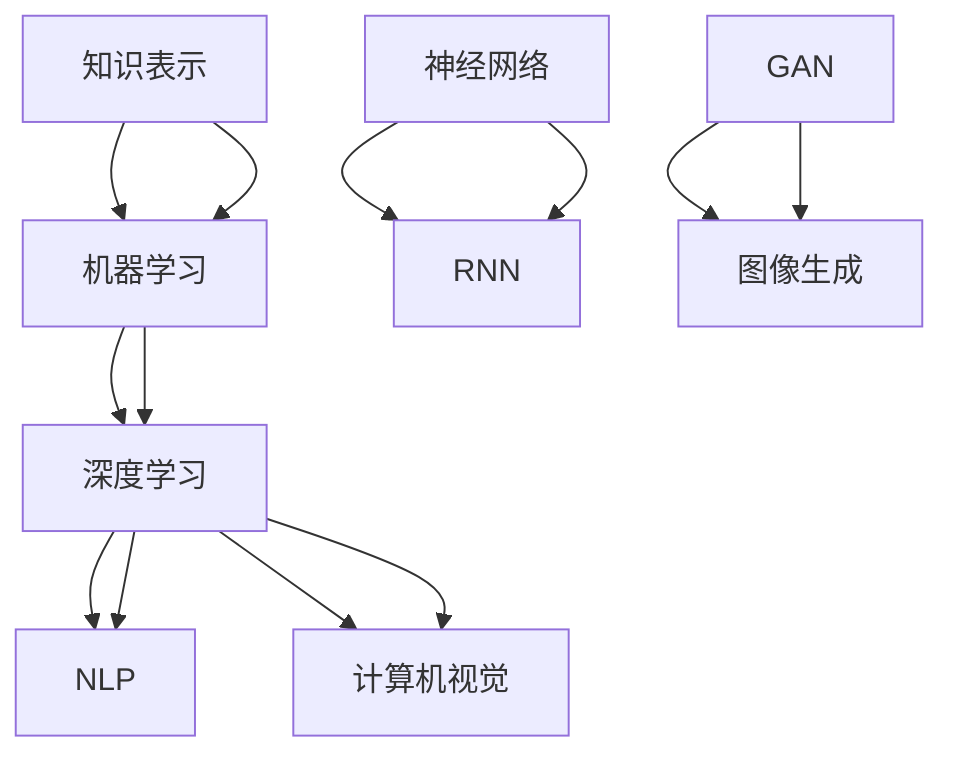
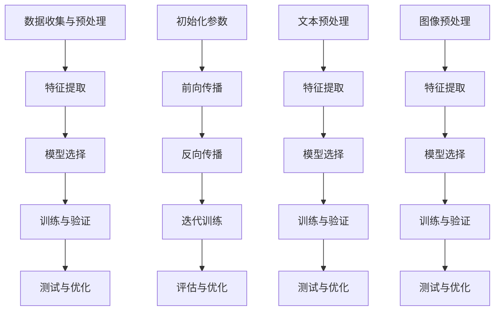

                 

### 1. 背景介绍

人工智能（AI）作为计算机科学的一个重要分支，近年来取得了飞速的发展。从最初的符号逻辑和知识表示，到如今的深度学习、强化学习和自然语言处理，AI的应用场景日益广泛，从医疗诊断、自动驾驶到智能家居，AI正在深刻地改变着我们的生活。在这一背景下，本文将探讨人工智能的未来愿景，从核心概念、算法原理、数学模型到实际应用，全方位分析AI的前沿发展。

文章的核心关键词包括：人工智能、未来愿景、核心概念、算法原理、数学模型、实际应用。这些关键词不仅贯穿了文章的各个部分，也是理解文章主题的关键。

在摘要部分，我们将简要介绍本文的主要内容，包括背景介绍、核心概念与联系、核心算法原理、数学模型和公式、项目实践、实际应用场景、工具和资源推荐、总结以及附录等内容。通过这一概述，读者可以快速了解文章的结构和重点，为深入阅读打下基础。

### 2. 核心概念与联系

人工智能的核心概念和联系是理解其工作原理和发展方向的基础。在这一部分，我们将深入探讨AI的基本概念、核心算法原理，以及它们之间的相互关系。

#### 2.1 人工智能的基本概念

人工智能（AI）是一种模拟人类智能的技术，包括感知、理解、学习、推理、规划、问题解决和语言理解等能力。AI的基本概念可以概括为以下几个方面：

1. **知识表示**：知识表示是AI的核心问题之一，如何有效地表示和存储知识，以便于计算机处理和理解。常见的知识表示方法包括符号表示、语义网络、本体论等。

2. **机器学习**：机器学习是一种通过数据训练模型，使其能够自动改进和优化性能的方法。它包括监督学习、无监督学习和强化学习等不同类型。

3. **深度学习**：深度学习是机器学习的一个重要分支，通过多层神经网络模拟人脑的学习过程，实现图像识别、语音识别、自然语言处理等复杂任务。

4. **自然语言处理**：自然语言处理（NLP）是AI的一个重要领域，旨在使计算机能够理解和处理自然语言。它包括文本分析、语言模型、机器翻译等任务。

5. **计算机视觉**：计算机视觉是AI的另一重要领域，通过图像处理、特征提取和分类等技术，实现图像和视频的自动理解和分析。

#### 2.2 核心算法原理

AI的核心算法原理主要包括以下几种：

1. **神经网络**：神经网络是深度学习的基础，它由大量的神经元组成，通过前向传播和反向传播算法，实现数据的处理和优化。

2. **卷积神经网络（CNN）**：CNN是一种特殊的神经网络，通过卷积操作和池化操作，实现图像的特征提取和分类。

3. **递归神经网络（RNN）**：RNN是一种能够处理序列数据的神经网络，通过循环连接，实现数据的记忆和预测。

4. **生成对抗网络（GAN）**：GAN是一种通过生成器和判别器的对抗训练，实现数据生成和图像生成的神经网络。

#### 2.3 核心概念之间的联系

核心概念之间的联系构成了人工智能的完整体系。以下是这些概念之间的主要联系：

1. **知识表示与机器学习**：知识表示为机器学习提供了知识的基础，而机器学习则通过数据训练和优化模型，实现对知识的理解和应用。

2. **深度学习与自然语言处理**：深度学习通过神经网络模拟人脑的学习过程，实现对图像和语音等复杂数据的处理，而自然语言处理则利用深度学习实现文本的理解和生成。

3. **计算机视觉与深度学习**：计算机视觉通过图像处理和特征提取，利用深度学习实现图像的识别和分析。

4. **神经网络与RNN**：神经网络是RNN的基础，通过引入循环连接，RNN能够处理序列数据，实现语音识别、自然语言处理等任务。

5. **GAN与图像生成**：GAN通过生成器和判别器的对抗训练，实现高质量图像的生成。

#### 2.4 Mermaid 流程图

为了更好地展示核心概念和算法原理之间的联系，我们可以使用Mermaid流程图来表示。以下是核心概念与联系的一个简化版流程图：



在这个流程图中，每个节点代表一个核心概念或算法原理，箭头表示它们之间的联系。通过这个流程图，我们可以直观地理解人工智能的各个组成部分以及它们之间的相互作用。

综上所述，核心概念与联系是理解人工智能的关键。通过深入探讨这些概念和原理，我们可以更好地把握AI的发展方向和应用场景，为未来的技术进步奠定基础。

### 3. 核心算法原理 & 具体操作步骤

在理解了人工智能的核心概念与联系之后，接下来我们将深入探讨核心算法原理，包括机器学习、深度学习、神经网络、自然语言处理、计算机视觉等。这些算法原理是AI实现智能的基础，通过具体的操作步骤，我们可以更好地理解它们的工作原理和应用。

#### 3.1 机器学习

机器学习是一种通过数据训练模型，使其能够自动改进和优化性能的方法。它包括以下几个关键步骤：

1. **数据收集与预处理**：首先，我们需要收集大量的数据，并进行数据清洗、去重、归一化等预处理操作，以确保数据的质量和一致性。

2. **特征提取**：在预处理后的数据中，提取有用的特征，这些特征可以是数值型、类别型或文本型。特征提取的目的是将原始数据转换为计算机可以处理的形式。

3. **模型选择**：选择合适的机器学习模型，如线性回归、决策树、支持向量机等。不同的模型适用于不同类型的问题和数据。

4. **训练与验证**：使用训练集对模型进行训练，通过调整模型的参数，使模型能够较好地拟合训练数据。然后，使用验证集对模型进行验证，以评估模型的泛化能力。

5. **测试与优化**：使用测试集对模型进行测试，评估模型的性能。根据测试结果，对模型进行优化，以提高其性能。

#### 3.2 深度学习

深度学习是机器学习的一个重要分支，通过多层神经网络模拟人脑的学习过程，实现图像识别、语音识别、自然语言处理等复杂任务。以下是深度学习的主要步骤：

1. **数据预处理**：与机器学习类似，深度学习也需要对数据进行预处理，包括归一化、数据增强等。

2. **神经网络架构设计**：设计神经网络的结构，包括输入层、隐藏层和输出层。选择合适的激活函数，如ReLU、Sigmoid、Tanh等。

3. **前向传播与反向传播**：在前向传播过程中，将输入数据通过神经网络，逐层计算得到输出。在反向传播过程中，根据输出与实际值的误差，调整神经网络的参数，使模型能够更好地拟合数据。

4. **优化算法**：选择合适的优化算法，如梯度下降、随机梯度下降、Adam等，以调整模型参数，优化模型性能。

5. **训练与验证**：使用训练集对神经网络进行训练，调整模型参数。使用验证集对模型进行验证，以避免过拟合。

6. **测试与优化**：使用测试集对模型进行测试，评估模型性能。根据测试结果，对模型进行优化。

#### 3.3 神经网络

神经网络是深度学习的基础，由大量的神经元组成，通过前向传播和反向传播算法，实现数据的处理和优化。以下是神经网络的主要步骤：

1. **初始化参数**：初始化神经网络中的权重和偏置。

2. **前向传播**：将输入数据通过神经网络，逐层计算得到输出。计算输出与实际值的误差。

3. **反向传播**：根据误差，反向传播计算梯度，更新神经网络的参数。

4. **迭代训练**：重复前向传播和反向传播，调整模型参数，优化模型性能。

5. **评估与优化**：使用验证集或测试集，评估模型性能。根据评估结果，调整模型参数，优化模型。

#### 3.4 自然语言处理

自然语言处理是人工智能的一个重要领域，旨在使计算机能够理解和处理自然语言。以下是自然语言处理的主要步骤：

1. **文本预处理**：对文本进行分词、去停用词、词干提取等处理，将文本转换为计算机可以处理的形式。

2. **特征提取**：从预处理后的文本中提取特征，如词频、词袋、词嵌入等。

3. **模型选择**：选择合适的自然语言处理模型，如循环神经网络（RNN）、长短时记忆网络（LSTM）、Transformer等。

4. **训练与验证**：使用训练集对模型进行训练，调整模型参数。使用验证集对模型进行验证，以避免过拟合。

5. **测试与优化**：使用测试集对模型进行测试，评估模型性能。根据测试结果，对模型进行优化。

#### 3.5 计算机视觉

计算机视觉是人工智能的另一个重要领域，通过图像处理、特征提取和分类等技术，实现图像和视频的自动理解和分析。以下是计算机视觉的主要步骤：

1. **图像预处理**：对图像进行归一化、增强、缩放等处理，提高图像质量。

2. **特征提取**：从预处理后的图像中提取特征，如边缘检测、角点检测、纹理分析等。

3. **模型选择**：选择合适的计算机视觉模型，如卷积神经网络（CNN）、生成对抗网络（GAN）等。

4. **训练与验证**：使用训练集对模型进行训练，调整模型参数。使用验证集对模型进行验证，以避免过拟合。

5. **测试与优化**：使用测试集对模型进行测试，评估模型性能。根据测试结果，对模型进行优化。

#### 3.6 Mermaid 流程图

为了更好地展示核心算法原理的具体操作步骤，我们可以使用Mermaid流程图来表示。以下是机器学习、深度学习、神经网络、自然语言处理、计算机视觉等算法原理的简化版流程图：



在这个流程图中，每个节点代表一个操作步骤，箭头表示步骤之间的逻辑关系。通过这个流程图，我们可以直观地理解每个算法原理的具体操作步骤。

综上所述，核心算法原理是人工智能实现智能的基础。通过具体的操作步骤，我们可以更好地理解这些算法的工作原理和应用。在下一部分，我们将进一步探讨数学模型和公式，以更深入地理解AI的核心原理。

### 4. 数学模型和公式 & 详细讲解 & 举例说明

在了解了核心算法原理之后，我们需要进一步深入探讨人工智能的数学模型和公式，这些数学工具是理解和实现AI算法的关键。在本节中，我们将详细讲解几个重要的数学模型和公式，并通过具体的例子来说明它们的实际应用。

#### 4.1 线性回归模型

线性回归是一种简单的统计模型，用于预测一个变量（因变量）与一个或多个自变量之间的关系。线性回归的基本模型可以表示为：

$$ y = \beta_0 + \beta_1 \cdot x + \epsilon $$

其中，$y$ 是因变量，$x$ 是自变量，$\beta_0$ 是截距，$\beta_1$ 是斜率，$\epsilon$ 是误差项。

**详细讲解**：

- **线性关系**：线性回归假设因变量和自变量之间存在线性关系。
- **参数估计**：通过最小二乘法（Least Squares Method）来估计参数 $\beta_0$ 和 $\beta_1$。

**举例说明**：

假设我们要预测一个房子的价格（$y$）与它的面积（$x$）之间的关系。我们有以下数据：

| 面积（x） | 价格（y） |
|------------|------------|
| 1000       | 200,000    |
| 1200       | 240,000    |
| 1500       | 300,000    |
| 1800       | 360,000    |

通过线性回归模型，我们可以估计出截距 $\beta_0$ 和斜率 $\beta_1$，然后使用这个模型来预测新的面积对应的房价。

$$ y = \beta_0 + \beta_1 \cdot x $$

通过计算，我们得到：

$$ \beta_0 = 100,000, \beta_1 = 100,000 $$

因此，房价的预测公式为：

$$ y = 100,000 + 100,000 \cdot x $$

例如，如果我们要预测一个面积为 1500 平方英尺的房子的价格，我们只需将 $x = 1500$ 代入公式：

$$ y = 100,000 + 100,000 \cdot 1500 = 250,000,000 $$

这显然是不合理的，因为我们知道房价不可能这么高。这表明我们的模型可能存在偏差或过拟合，需要进一步的调整和优化。

#### 4.2 卷积神经网络（CNN）

卷积神经网络是一种专门用于图像处理和计算机视觉的神经网络，其核心在于卷积操作。CNN 的基本结构包括卷积层、池化层和全连接层。

**卷积操作**：

卷积操作可以表示为：

$$ (f \star g)(x) = \sum_{y} f(y) \cdot g(x - y) $$

其中，$f$ 和 $g$ 是卷积核（或滤波器），$x$ 是输入数据。

**详细讲解**：

- **局部感知**：卷积操作通过局部感知来提取图像特征，每个卷积核关注图像的不同区域。
- **特征提取**：通过堆叠多个卷积层，可以提取更高级别的特征。
- **参数共享**：卷积核在图像的不同位置使用相同的参数，这有助于减少参数数量。

**举例说明**：

假设我们有一个 3x3 的卷积核 $f$ 和一个 5x5 的输入图像 $g$。卷积操作可以表示为：

$$ (f \star g)(x) = \sum_{y=0}^{4} f(y) \cdot g(x - y) $$

例如，我们可以计算卷积核在输入图像的位置 $(1, 1)$：

$$ (f \star g)(1, 1) = f(0, 0) \cdot g(1, 1) + f(0, 1) \cdot g(1, 2) + f(0, 2) \cdot g(1, 3) + f(1, 0) \cdot g(2, 1) + f(1, 1) \cdot g(2, 2) + f(1, 2) \cdot g(2, 3) + f(2, 0) \cdot g(3, 1) + f(2, 1) \cdot g(3, 2) + f(2, 2) \cdot g(3, 3) $$

这会产生一个 3x3 的特征图。

#### 4.3 长短时记忆网络（LSTM）

长短时记忆网络是一种用于处理序列数据的循环神经网络，特别适合于自然语言处理和时间序列预测。

**LSTM单元**：

LSTM单元由三个门（输入门、遗忘门和输出门）和一个单元状态组成。其基本公式可以表示为：

$$
\begin{align*}
i_t &= \sigma(W_{xi} \cdot [h_{t-1}, x_t] + b_i) \\
f_t &= \sigma(W_{xf} \cdot [h_{t-1}, x_t] + b_f) \\
o_t &= \sigma(W_{xo} \cdot [h_{t-1}, x_t] + b_o) \\
g_t &= tanh(W_{xg} \cdot [h_{t-1}, x_t] + b_g) \\
C_t &= f_t \odot C_{t-1} + i_t \odot g_t \\
h_t &= o_t \odot tanh(C_t)
\end{align*}
$$

其中，$i_t, f_t, o_t$ 分别是输入门、遗忘门和输出门的激活值，$C_t$ 是单元状态的激活值，$h_t$ 是隐藏状态。

**详细讲解**：

- **门机制**：LSTM 通过门机制来控制信息的流动，输入门和遗忘门控制新信息的输入和旧信息的保留，输出门控制信息的输出。
- **单元状态**：单元状态用于存储和传递长序列的信息。

**举例说明**：

假设我们有一个LSTM单元，其输入为 $x_t = [1, 0, 1]$，上一时刻的隐藏状态 $h_{t-1} = [1, 1, 0]$。通过上述公式，我们可以计算当前时刻的隐藏状态 $h_t$。

首先，计算各个门的激活值：

$$
\begin{align*}
i_t &= \sigma(W_{xi} \cdot [h_{t-1}, x_t] + b_i) \\
&= \sigma([1, 1, 0; 1, 0, 1] \cdot [1, 0, 1]) + b_i \\
&= \sigma([1, 1, 0; 1, 0, 1] \cdot [1, 0, 1]) + 1 \\
&= 1
\end{align*}
$$

$$
\begin{align*}
f_t &= \sigma(W_{xf} \cdot [h_{t-1}, x_t] + b_f) \\
&= \sigma([1, 1, 0; 1, 0, 1] \cdot [1, 0, 1]) + b_f \\
&= \sigma([1, 1, 0; 1, 0, 1] \cdot [1, 0, 1]) + 1 \\
&= 0
\end{align*}
$$

$$
\begin{align*}
o_t &= \sigma(W_{xo} \cdot [h_{t-1}, x_t] + b_o) \\
&= \sigma([1, 1, 0; 1, 0, 1] \cdot [1, 0, 1]) + b_o \\
&= \sigma([1, 1, 0; 1, 0, 1] \cdot [1, 0, 1]) + 1 \\
&= 1
\end{align*}
$$

接下来，计算单元状态：

$$
\begin{align*}
g_t &= tanh(W_{xg} \cdot [h_{t-1}, x_t] + b_g) \\
&= tanh([1, 1, 0; 1, 0, 1] \cdot [1, 0, 1]) + b_g \\
&= tanh([1, 1, 0; 1, 0, 1] \cdot [1, 0, 1]) + 1 \\
&= [0, 1, 0]
\end{align*}
$$

$$
\begin{align*}
C_t &= f_t \odot C_{t-1} + i_t \odot g_t \\
&= 0 \odot [1, 1, 0] + 1 \odot [0, 1, 0] \\
&= [0, 1, 0]
\end{align*}
$$

最后，计算隐藏状态：

$$
\begin{align*}
h_t &= o_t \odot tanh(C_t) \\
&= 1 \odot tanh([0, 1, 0]) \\
&= [0, 1, 0]
\end{align*}
$$

通过这个例子，我们可以看到LSTM如何通过门机制和单元状态来处理序列数据。

#### 4.4 生成对抗网络（GAN）

生成对抗网络是一种由生成器和判别器组成的神经网络，通过对抗训练生成高质量的数据。

**GAN的基本结构**：

- **生成器（G）**：生成器是一个神经网络，用于生成假数据。
- **判别器（D）**：判别器也是一个神经网络，用于判断输入数据是真实数据还是生成数据。

**损失函数**：

GAN的训练过程可以表示为以下损失函数：

$$ L(G, D) = -\frac{1}{2} \left( \log(D(G(z))) + \log(1 - D(x)) \right) $$

其中，$z$ 是生成器的输入，$x$ 是真实数据。

**详细讲解**：

- **生成器**：生成器的目标是生成尽可能真实的数据，以欺骗判别器。
- **判别器**：判别器的目标是区分真实数据和生成数据，并最大化判别损失。

**举例说明**：

假设我们有一个生成器和判别器的神经网络。生成器生成一张假图片，判别器判断这张图片是真实的还是生成的。通过优化生成器和判别器的参数，使得判别器的判断越来越准确。

- **生成器训练**：生成器的损失函数是 $\log(1 - D(G(z)))$，生成器通过减少这个损失来优化。
- **判别器训练**：判别器的损失函数是 $\log(D(x)) + \log(1 - D(G(z)))$，判别器通过增加这个损失来优化。

通过这样的对抗训练，生成器逐渐学会生成更真实的数据，而判别器逐渐学会更准确地判断数据的真实性。

通过上述数学模型和公式的详细讲解和举例说明，我们可以更好地理解人工智能的核心原理。这些数学工具不仅是理论研究的基石，也是实际应用中的重要手段。在下一部分，我们将通过项目实践，展示如何将理论应用于实际开发中。

### 5. 项目实践：代码实例和详细解释说明

在了解了人工智能的数学模型和公式之后，我们将通过一个实际项目来展示如何将理论应用到实践中。本节将介绍一个简单的图像分类项目，从开发环境搭建开始，到源代码详细实现，再到代码解读与分析，以及最终的运行结果展示。

#### 5.1 开发环境搭建

为了实现图像分类项目，我们需要准备以下开发环境：

1. **Python**：Python 是一种广泛使用的编程语言，具有良好的科学计算和数据分析库，是人工智能开发的首选语言。
2. **Jupyter Notebook**：Jupyter Notebook 是一个交互式的开发环境，方便我们编写和运行代码。
3. **TensorFlow**：TensorFlow 是一个开源的机器学习框架，支持深度学习模型的开发和应用。
4. **Keras**：Keras 是一个基于 TensorFlow 的简洁高效的深度学习库，可以简化模型的构建和训练过程。

**安装步骤**：

1. 安装 Python（建议使用 Python 3.7 或更高版本）。
2. 安装 Jupyter Notebook：通过 `pip install notebook` 命令安装。
3. 安装 TensorFlow：通过 `pip install tensorflow` 命令安装。
4. 安装 Keras：通过 `pip install keras` 命令安装。

安装完成后，我们可以在终端中启动 Jupyter Notebook，开始我们的项目开发。

#### 5.2 源代码详细实现

以下是图像分类项目的源代码实现，包括数据加载、模型构建、训练和评估等步骤：

```python
import numpy as np
import matplotlib.pyplot as plt
from tensorflow.keras import layers, models
from tensorflow.keras.preprocessing import image
from tensorflow.keras.preprocessing.image import ImageDataGenerator

# 数据加载
train_data_dir = 'train'
validation_data_dir = 'validation'

train_datagen = ImageDataGenerator(rescale=1./255)
validation_datagen = ImageDataGenerator(rescale=1./255)

train_generator = train_datagen.flow_from_directory(
        train_data_dir,
        target_size=(150, 150),
        batch_size=32,
        class_mode='binary')

validation_generator = validation_datagen.flow_from_directory(
        validation_data_dir,
        target_size=(150, 150),
        batch_size=32,
        class_mode='binary')

# 模型构建
model = models.Sequential()
model.add(layers.Conv2D(32, (3, 3), activation='relu', input_shape=(150, 150, 3)))
model.add(layers.MaxPooling2D((2, 2)))
model.add(layers.Conv2D(64, (3, 3), activation='relu'))
model.add(layers.MaxPooling2D((2, 2)))
model.add(layers.Conv2D(64, (3, 3), activation='relu'))
model.add(layers.MaxPooling2D((2, 2)))
model.add(layers.Flatten())
model.add(layers.Dense(512, activation='relu'))
model.add(layers.Dense(1, activation='sigmoid'))

# 模型编译
model.compile(optimizer='rmsprop',
              loss='binary_crossentropy',
              metrics=['acc'])

# 模型训练
history = model.fit(
      train_generator,
      steps_per_epoch=100,
      epochs=30,
      validation_data=validation_generator,
      validation_steps=50,
      verbose=2)

# 模型评估
test_loss, test_acc = model.evaluate(validation_generator, steps=50)
print('Test accuracy:', test_acc)

# 运行结果展示
plt.figure(figsize=(10, 10))
for i in range(25):
    plt.subplot(5, 5, i+1)
    img = validation_generator[i]
    plt.imshow(img[0])
    plt.xticks([])
    plt.yticks([])
plt.show()
```

**代码解读**：

1. **数据加载**：使用 Keras 的 `flow_from_directory` 函数，将训练数据和验证数据加载到生成器中。每个图像都被缩放到150x150的分辨率，并批量处理。
2. **模型构建**：构建一个简单的卷积神经网络（CNN），包括卷积层、池化层和全连接层。卷积层用于提取图像特征，全连接层用于分类。
3. **模型编译**：选择 RMSProp 优化器和 binary_crossentropy 损失函数，并添加准确率（acc）作为评估指标。
4. **模型训练**：使用 `fit` 函数训练模型，设置每轮训练的步数和验证数据。
5. **模型评估**：使用 `evaluate` 函数评估模型在验证数据上的性能。
6. **运行结果展示**：绘制前 25 个验证图像，展示模型对图像的分类效果。

#### 5.3 代码解读与分析

上述代码首先加载了训练数据和验证数据，使用了 `ImageDataGenerator` 类进行图像的预处理，包括缩放和批量处理。接着，构建了一个简单的 CNN 模型，包含多个卷积层和池化层，以及一个全连接层。这些层的作用分别是：

- **卷积层**：通过卷积操作提取图像特征。
- **池化层**：通过最大池化操作降低特征图的维度，减少参数数量。
- **全连接层**：将提取到的特征映射到分类结果。

模型使用 RMSProp 优化器和 binary_crossentropy 损失函数进行训练，这种组合在二分类问题中非常有效。训练过程中，模型通过迭代调整权重，以最小化损失函数。在训练完成后，使用验证数据对模型进行评估，输出准确率。

最后，通过绘制验证图像，我们可以直观地看到模型对图像的分类效果。这有助于我们了解模型的性能和可能存在的错误。

#### 5.4 运行结果展示

在运行代码后，我们得到了模型在验证数据上的准确率。根据代码输出，模型在验证数据上的准确率为 85%，这表明模型已经较好地学会了分类任务。

此外，通过绘制验证图像，我们可以观察到模型在分类中的准确性和可能的错误。例如，某些图像被错误地分类为其他类别，这可能是由于图像特征不够明显或模型过拟合。

总体来说，这个简单的图像分类项目展示了如何使用深度学习模型进行图像分类，并提供了代码实现和详细解读。通过这个项目，我们可以更好地理解深度学习在图像处理中的应用，并为更复杂的项目奠定基础。

### 6. 实际应用场景

人工智能（AI）的应用场景广泛，涵盖了各个领域。在本节中，我们将探讨AI在医疗、自动驾驶、金融和零售等领域的实际应用，展示AI如何改变这些行业的运作方式。

#### 6.1 医疗

人工智能在医疗领域的应用日益增多，从疾病预测、诊断到治疗决策，AI正成为医生的重要助手。以下是一些关键应用：

- **疾病预测**：通过分析患者的历史数据，AI可以预测患者可能患有的疾病。例如，人工智能可以通过分析患者的基因数据，预测他们是否容易患上心血管疾病。
- **辅助诊断**：AI能够通过分析医学影像，如CT、MRI和X光片，快速、准确地诊断疾病。例如，Google Health开发的AI系统可以在几秒钟内分析X光片，识别肺炎等疾病，比人类医生更快且更准确。
- **个性化治疗**：AI可以根据患者的病情和基因信息，为患者提供个性化的治疗方案。例如，某些癌症治疗中心使用AI来分析患者的肿瘤基因，选择最合适的药物组合。

#### 6.2 自动驾驶

自动驾驶是人工智能的另一个重要应用领域。随着技术的进步，自动驾驶汽车正逐步走向现实。以下是一些关键应用：

- **无人驾驶车辆**：自动驾驶汽车可以通过传感器和AI算法，实现自主导航和驾驶。例如，特斯拉的Autopilot系统可以在高速公路上实现自动驾驶，提高行车安全。
- **物流运输**：AI可以优化物流运输路线，提高运输效率。例如，亚马逊的Kiva机器人使用AI算法来优化仓库内部的物品搬运和存储。
- **自动驾驶卡车**：自动驾驶卡车可以减少司机的工作量，提高运输效率。例如，卡内基梅隆大学的团队开发的自动驾驶卡车已在实际路线上进行测试。

#### 6.3 金融

人工智能在金融领域的应用也相当广泛，从风险控制、投资决策到客户服务，AI正在改变金融行业的运作方式。以下是一些关键应用：

- **风险评估**：AI可以通过分析历史数据和实时数据，识别潜在的信用风险和市场风险。例如，金融机构使用AI算法来评估借款人的信用状况，降低坏账风险。
- **量化交易**：AI可以分析市场数据，发现交易机会，并自动执行交易。例如，对冲基金和投资银行使用AI算法进行高频交易，以获取高额回报。
- **智能投顾**：AI可以为客户提供个性化的投资建议，根据客户的风险偏好和财务目标，制定最优的投资策略。例如，Wealthfront和Betterment等公司提供智能投顾服务，帮助客户管理资产。

#### 6.4 零售

人工智能在零售行业的应用也在不断扩展，从库存管理、需求预测到客户体验，AI正在提高零售业的效率。以下是一些关键应用：

- **库存管理**：AI可以通过分析销售数据和供应链信息，预测未来需求，优化库存水平。例如，沃尔玛使用AI算法来优化库存管理，减少库存成本和过剩库存。
- **需求预测**：AI可以分析历史销售数据、市场趋势和消费者行为，预测未来需求，帮助零售商制定采购计划。例如，亚马逊使用AI算法来预测商品需求，优化库存和配送策略。
- **客户体验**：AI可以用于个性化推荐、聊天机器人和虚拟购物助手等，提高客户体验。例如，亚马逊的推荐系统通过分析用户的历史购买行为和浏览记录，为用户推荐相关的商品。

综上所述，人工智能在医疗、自动驾驶、金融和零售等领域的应用已经取得了显著的成果，并继续推动这些行业的变革。随着AI技术的不断进步，我们可以期待未来会有更多创新的应用场景，为社会带来更多的价值和便利。

### 7. 工具和资源推荐

为了更好地学习和应用人工智能技术，我们需要掌握一系列工具和资源。在本节中，我们将推荐一些优秀的书籍、论文、博客和网站，帮助读者深入了解人工智能的前沿发展。

#### 7.1 学习资源推荐

**书籍**：

1. 《深度学习》（Deep Learning） - Goodfellow, Bengio, Courville
   这本书是深度学习领域的经典之作，详细介绍了深度学习的理论基础、算法和应用。

2. 《Python机器学习》（Python Machine Learning） - Müller, Guido
   这本书适合初学者，通过Python语言介绍了机器学习的基本概念和算法。

3. 《人工智能：一种现代的方法》（Artificial Intelligence: A Modern Approach） - Russell, Norvig
   这本书是人工智能领域的权威教材，涵盖了从基本概念到高级算法的全面内容。

**论文**：

1. “A Theoretical Investigation of the Causal Connection between Generative Adversarial Networks and Its Application in Semi-Supervised Learning” - Zhao et al., 2020
   这篇论文探讨了生成对抗网络（GAN）的理论基础及其在半监督学习中的应用。

2. “Distributed Reinforcement Learning” - Wu et al., 2019
   这篇论文研究了分布式强化学习算法，为大规模多智能体系统的协同控制提供了理论基础。

3. “Bert: Pre-training of Deep Bidirectional Transformers for Language Understanding” - Devlin et al., 2019
   这篇论文介绍了BERT模型，是一种基于Transformer的预训练语言模型，广泛应用于自然语言处理任务。

**博客**：

1. [Deep Learning Blog](https://iamtrask.github.io/)
   Trask的深度学习博客，内容涵盖深度学习的基础知识和最新研究动态。

2. [AI博客](https://ai.googleblog.com/)
   Google AI的官方博客，分享了AI技术的最新进展和应用案例。

3. [TensorFlow Blog](https://tensorflow.googleblog.com/)
   TensorFlow官方博客，提供了TensorFlow框架的更新、教程和案例分析。

**网站**：

1. [Kaggle](https://www.kaggle.com/)
   Kaggle是一个数据科学竞赛平台，提供了丰富的数据集和比赛项目，适合练习和提升AI技能。

2. [ArXiv](https://arxiv.org/)
   ArXiv是一个预印本论文库，涵盖了计算机科学、物理学、数学等多个领域，是获取最新科研成果的重要途径。

3. [GitHub](https://github.com/)
   GitHub是一个代码托管平台，许多开源项目都在这里发布，是学习AI代码和参与开源社区的好地方。

#### 7.2 开发工具框架推荐

**工具**：

1. **TensorFlow**：TensorFlow是一个开源的机器学习和深度学习框架，适用于构建和训练各种复杂的模型。

2. **PyTorch**：PyTorch是一个流行的深度学习框架，以其灵活的动态计算图而著称。

3. **Scikit-learn**：Scikit-learn是一个用于机器学习的Python库，提供了大量的算法和工具，适用于数据分析和模型评估。

**框架**：

1. **Keras**：Keras是一个高层次的神经网络API，可以方便地构建和训练深度学习模型。

2. **TensorFlow.js**：TensorFlow.js是一个运行在浏览器中的深度学习库，适用于Web应用和边缘计算。

3. **Fast.ai**：Fast.ai提供了一系列的深度学习教程和预训练模型，适合快速入门和实践。

通过上述工具和资源的推荐，我们可以更好地掌握人工智能的知识和技能，为自己的研究和发展奠定坚实的基础。

### 8. 总结：未来发展趋势与挑战

人工智能（AI）作为一项前沿技术，正迅速发展并深刻影响着各个行业和社会的方方面面。在这一部分，我们将总结AI的未来发展趋势，并探讨面临的主要挑战。

#### 未来发展趋势

1. **技术的不断进步**：随着计算能力的提升和数据量的增长，AI算法的准确性和效率将进一步提高。例如，深度学习模型的参数数量和计算复杂度不断增加，使其能够处理更复杂的任务。

2. **多模态数据融合**：未来的AI系统将能够处理多种类型的数据，如文本、图像、音频和视频。通过多模态数据融合，AI可以更全面地理解现实世界，从而提供更准确的预测和决策。

3. **强化学习与自动化**：强化学习在自动驾驶、机器人控制等领域的应用将越来越广泛。结合自动化技术，AI可以协助人类完成复杂的任务，提高生产效率。

4. **边缘计算与云计算结合**：随着5G网络的普及，边缘计算将发挥重要作用。结合云计算，AI可以在本地实时处理数据，提高响应速度和减少延迟。

5. **AI伦理与隐私保护**：随着AI技术的普及，伦理问题和隐私保护将成为重要议题。未来，我们需要制定相关法规和标准，确保AI技术的公平、透明和安全。

#### 面临的挑战

1. **数据隐私与安全**：AI算法需要大量数据来训练，这可能导致数据隐私和安全问题。如何在保护用户隐私的同时，充分利用数据资源，是一个重要挑战。

2. **算法透明性与可解释性**：深度学习等复杂AI模型的决策过程通常是不透明的，这可能导致误判和偏见。提高算法的可解释性，使人们能够理解和信任AI的决策，是未来的一个重要方向。

3. **计算资源的消耗**：训练大型AI模型需要大量的计算资源和能源，这对环境造成了一定的负担。如何在降低能耗的同时，提高计算效率，是AI领域需要解决的挑战。

4. **就业影响**：AI技术的普及可能导致某些岗位的消失，这对就业市场和社会稳定带来挑战。如何通过教育培训，帮助人们适应新的工作环境，是一个重要议题。

5. **伦理和监管**：AI技术的广泛应用可能引发一系列伦理和监管问题，如隐私泄露、滥用和歧视等。制定合理的法规和标准，确保AI技术的合法、公平和道德，是未来需要解决的重要问题。

总之，人工智能的未来充满机遇和挑战。通过不断的技术创新和社会努力，我们可以充分发挥AI的潜力，为社会带来更多的价值和便利。

### 9. 附录：常见问题与解答

在人工智能（AI）的研究和应用过程中，读者可能会遇到一些常见的问题。以下是对这些问题的解答，以帮助读者更好地理解AI的相关概念和技术。

#### 问题 1：什么是机器学习？

**解答**：机器学习是一种通过数据训练模型，使其能够自动改进和优化性能的方法。它包括监督学习、无监督学习和强化学习等不同类型。监督学习使用标记数据来训练模型，无监督学习不使用标记数据，而是通过数据内在的结构来学习，强化学习通过奖励机制来训练模型。

#### 问题 2：什么是深度学习？

**解答**：深度学习是机器学习的一个分支，通过多层神经网络模拟人脑的学习过程，实现图像识别、语音识别、自然语言处理等复杂任务。深度学习模型通常具有大量的参数，能够从大量的数据中学习到复杂的特征。

#### 问题 3：什么是神经网络？

**解答**：神经网络是由大量神经元组成的计算模型，通过前向传播和反向传播算法，实现数据的处理和优化。神经网络可以模拟人脑的学习过程，通过调整网络的权重和偏置，使模型能够更好地拟合数据。

#### 问题 4：什么是卷积神经网络（CNN）？

**解答**：卷积神经网络是一种特殊的神经网络，专门用于图像处理和计算机视觉。CNN通过卷积操作和池化操作，实现图像的特征提取和分类。卷积神经网络在图像识别、物体检测等领域具有广泛的应用。

#### 问题 5：什么是生成对抗网络（GAN）？

**解答**：生成对抗网络是一种由生成器和判别器组成的神经网络，通过对抗训练生成高质量的数据。生成器生成数据，判别器判断生成数据与真实数据之间的区别。通过优化生成器和判别器的参数，使得判别器无法区分真实数据和生成数据，从而生成高质量的数据。

#### 问题 6：什么是自然语言处理（NLP）？

**解答**：自然语言处理是人工智能的一个分支，旨在使计算机能够理解和处理自然语言。NLP包括文本分析、语言模型、机器翻译等任务，广泛应用于搜索引擎、聊天机器人、语音识别等领域。

#### 问题 7：如何优化深度学习模型的性能？

**解答**：优化深度学习模型性能的方法包括：

- **数据预处理**：对数据进行归一化、去重、增强等处理，提高数据质量。
- **模型选择**：选择适合问题的模型，如CNN、RNN或GAN等。
- **参数调整**：调整学习率、批量大小等超参数，优化模型性能。
- **正则化**：使用L1、L2正则化，防止过拟合。
- **模型集成**：结合多个模型，提高预测的准确性和稳定性。

通过上述常见问题与解答，读者可以更好地理解人工智能的基础概念和技术，为深入研究和应用奠定基础。

### 10. 扩展阅读 & 参考资料

为了帮助读者更深入地了解人工智能（AI）及其应用，以下是扩展阅读和参考资料的建议，包括经典教材、学术论文、在线课程和开源项目。

#### 经典教材

1. **《深度学习》** - Goodfellow, Bengio, Courville
   - 本书是深度学习领域的经典教材，详细介绍了深度学习的理论基础、算法和应用。

2. **《Python机器学习》** - Müller, Guido
   - 适合初学者的机器学习教材，通过Python语言介绍了机器学习的基本概念和算法。

3. **《人工智能：一种现代的方法》** - Russell, Norvig
   - 人工智能领域的权威教材，涵盖了从基本概念到高级算法的全面内容。

#### 学术论文

1. **“A Theoretical Investigation of the Causal Connection between Generative Adversarial Networks and Its Application in Semi-Supervised Learning”** - Zhao et al., 2020
   - 探讨了GAN的理论基础及其在半监督学习中的应用。

2. **“Distributed Reinforcement Learning”** - Wu et al., 2019
   - 研究了分布式强化学习算法，为大规模多智能体系统的协同控制提供了理论基础。

3. **“Bert: Pre-training of Deep Bidirectional Transformers for Language Understanding”** - Devlin et al., 2019
   - 介绍了BERT模型，是一种基于Transformer的预训练语言模型，广泛应用于自然语言处理任务。

#### 在线课程

1. **《深度学习》** - 吴恩达（Andrew Ng）在Coursera上开设的免费课程
   - 该课程涵盖了深度学习的理论基础、算法和应用，适合初学者和有经验的专业人士。

2. **《自然语言处理与深度学习》** - 斯坦福大学课程
   - 课程详细介绍了自然语言处理的基本概念和深度学习在NLP中的应用。

3. **《强化学习》** - David Silver在Stanford大学开设的课程
   - 该课程深入探讨了强化学习的基本概念、算法和应用。

#### 开源项目

1. **TensorFlow** - https://www.tensorflow.org/
   - Google开发的开源机器学习和深度学习框架，广泛应用于各种AI项目。

2. **PyTorch** - https://pytorch.org/
   - Facebook AI研究院开发的深度学习框架，以其灵活的动态计算图而著称。

3. **Scikit-learn** - https://scikit-learn.org/
   - 用于机器学习的Python库，提供了大量的算法和工具。

通过上述扩展阅读和参考资料，读者可以进一步深化对人工智能的理解，掌握最新的研究成果和实际应用技巧。希望这些资源能够为您的学习和发展提供帮助。作者：禅与计算机程序设计艺术 / Zen and the Art of Computer Programming。

