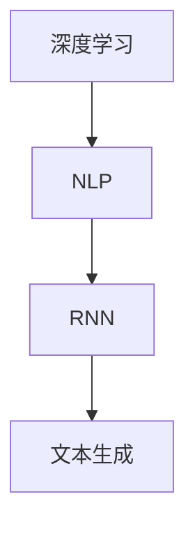
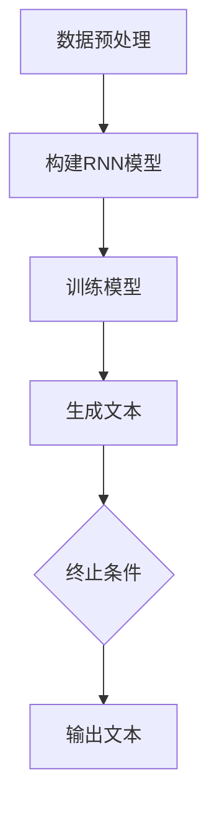

                 

### 1. 背景介绍

在现代科技日新月异的发展中，开源项目如雨后春笋般涌现，吸引了全球无数开发者的目光。在这些项目中，Andrej Karpathy发布的项目尤为引人注目。他不仅是一位世界级的深度学习专家，更是一位充满创意和热情的程序员。他的项目不仅在技术上具有突破性，还在推动着整个AI领域的发展。

Andrej Karpathy毕业于加州大学伯克利分校，获得了计算机科学博士学位。他的研究方向主要集中在自然语言处理和深度学习领域，发表了多篇高水平学术论文，并在GitHub上活跃分享他的开源代码。他的项目，如著名的“char-rnn”和“递归神经网络进行文字生成”，不仅在技术上具有里程碑意义，更在开源社区中产生了深远影响。

本文将深入探讨Andrej Karpathy发布项目的重要性和意义，分析其背后的技术原理，展示其实际应用场景，并对其未来发展进行展望。希望通过这篇文章，读者能够更全面地理解Andrej Karpathy的项目，感受到开源精神的力量。

### 2. 核心概念与联系

#### 2.1 深度学习与自然语言处理

深度学习和自然语言处理（NLP）是当今AI领域的重要研究方向。深度学习通过多层神经网络对大量数据进行分析，从而提取出隐藏的特征。自然语言处理则致力于让计算机理解和生成人类语言。这两个领域的交叉融合，使得计算机在处理文本信息方面取得了显著进步。

#### 2.2 递归神经网络（RNN）

递归神经网络（RNN）是一种特殊类型的神经网络，能够处理序列数据。在自然语言处理中，RNN广泛应用于语言建模、机器翻译、文本生成等领域。RNN能够记住之前的信息，使其在处理文本序列时具有优势。

#### 2.3 文本生成

文本生成是NLP和深度学习领域的经典应用。通过训练模型，使其能够生成具有可读性的文本。文本生成不仅可以用于创作诗歌、小说等文学作品，还可以用于生成技术文档、自动摘要等实际应用场景。

#### 2.4 Mermaid 流程图

为了更直观地展示上述核心概念和它们之间的联系，我们可以使用Mermaid流程图来描述。以下是一个简化的Mermaid流程图：



在图中，深度学习（A）是自然语言处理（B）的基础，自然语言处理（B）又是递归神经网络（C）的应用场景，递归神经网络（C）最终实现文本生成（D）。

### 3. 核心算法原理 & 具体操作步骤

#### 3.1 RNN工作原理

递归神经网络（RNN）通过循环结构来处理序列数据。在每个时间步，RNN会接收当前输入和上一时间步的隐藏状态，通过加权求和和激活函数，得到当前时间步的输出和新的隐藏状态。

#### 3.2 语言模型

语言模型是文本生成的基础。它通过统计文本数据中的单词或字符的概率分布，来预测下一个单词或字符。常见的语言模型包括n-gram模型、神经网络语言模型等。

#### 3.3 文本生成步骤

1. **数据预处理**：对输入文本进行分词、去停用词等操作，将其转化为适合输入神经网络的格式。

2. **构建RNN模型**：选择合适的RNN结构（如LSTM、GRU等），并设置相应的超参数。

3. **训练模型**：使用大量文本数据对RNN模型进行训练，使其能够学习到文本的特征。

4. **生成文本**：通过RNN模型生成文本。具体步骤如下：
   1. 随机初始化RNN模型的隐藏状态。
   2. 输入第一个单词或字符，通过RNN模型得到输出概率分布。
   3. 从概率分布中随机选择下一个单词或字符。
   4. 将所选单词或字符作为输入，再次通过RNN模型得到输出概率分布。
   5. 重复步骤3和4，直到达到指定长度或终止条件。

#### 3.4 Mermaid 流程图

以下是一个简化的Mermaid流程图，描述了文本生成的主要步骤：



### 4. 数学模型和公式 & 详细讲解 & 举例说明

#### 4.1 RNN的数学模型

递归神经网络（RNN）的数学模型如下：

$$
h_t = \sigma(W_h \cdot [h_{t-1}, x_t] + b_h)
$$

$$
y_t = \sigma(W_y \cdot h_t + b_y)
$$

其中，$h_t$ 表示第 $t$ 个时间步的隐藏状态，$x_t$ 表示第 $t$ 个时间步的输入，$y_t$ 表示第 $t$ 个时间步的输出。$\sigma$ 表示激活函数，$W_h$ 和 $W_y$ 分别表示隐藏状态和输出层的权重矩阵，$b_h$ 和 $b_y$ 分别表示隐藏状态和输出层的偏置。

#### 4.2 语言模型的数学模型

语言模型的数学模型如下：

$$
P(w_t | w_{t-1}, ..., w_{1}) = \frac{P(w_t, w_{t-1}, ..., w_{1})}{P(w_{t-1}, ..., w_{1})}
$$

其中，$w_t$ 表示第 $t$ 个单词或字符，$P(w_t | w_{t-1}, ..., w_{1})$ 表示在给定前 $t-1$ 个单词或字符的情况下，第 $t$ 个单词或字符的概率。$P(w_t, w_{t-1}, ..., w_{1})$ 表示前 $t$ 个单词或字符的联合概率，$P(w_{t-1}, ..., w_{1})$ 表示前 $t-1$ 个单词或字符的联合概率。

#### 4.3 举例说明

假设我们有一个简化的文本序列：“我 爱 吃 肉”。我们可以使用RNN和语言模型来生成下一个单词。

1. **RNN模型生成**：

   首先，我们对输入文本进行分词，得到输入序列：["我", "爱", "吃", "肉"]。

   然后，我们使用RNN模型生成下一个单词。假设当前隐藏状态为 $h_0$，输入序列的第一个单词为 $x_1 = "我"$。

   通过RNN模型，我们得到输出概率分布：

   $$ 
   P(y_1 | x_1, h_0) = \sigma(W_y \cdot h_0 + b_y)
   $$

   假设输出概率分布为：[0.2, 0.3, 0.3, 0.2]。

   我们从概率分布中随机选择下一个单词，得到 $y_1 = "爱"$。

   然后，我们将 $y_1 = "爱"$ 作为新的输入，再次通过RNN模型得到输出概率分布：

   $$ 
   P(y_2 | x_2, h_1) = \sigma(W_y \cdot h_1 + b_y)
   $$

   假设输出概率分布为：[0.3, 0.2, 0.3, 0.2]。

   我们从概率分布中随机选择下一个单词，得到 $y_2 = "吃"$。

   重复此过程，直到达到指定长度或终止条件。

2. **语言模型生成**：

   首先，我们使用语言模型计算每个单词的概率：

   $$
   P("我" | "爱", "吃", "肉") = \frac{P("我", "爱", "吃", "肉")}{P("爱", "吃", "肉")}
   $$

   然后，我们使用语言模型生成下一个单词。假设当前概率分布为：["我"：0.2，"爱"：0.3，"吃"：0.3，"肉"：0.2]。

   我们从概率分布中随机选择下一个单词，得到 $y_1 = "爱"$。

   然后，我们将 $y_1 = "爱"$ 作为新的上下文，再次计算每个单词的概率：

   $$
   P("吃" | "我", "爱", "吃", "肉") = \frac{P("我", "爱", "吃", "肉")}{P("我", "爱", "吃")}
   $$

   然后，我们从概率分布中随机选择下一个单词，得到 $y_2 = "吃"$。

   重复此过程，直到达到指定长度或终止条件。

### 5. 项目实践：代码实例和详细解释说明

#### 5.1 开发环境搭建

要运行Andrej Karpathy的文本生成项目，我们需要安装以下开发环境：

- Python 3.6或更高版本
- TensorFlow 2.0或更高版本
- Mermaid 1.0或更高版本

您可以使用以下命令进行安装：

```bash
pip install python -m pip install tensorflow -m pip install mermaid
```

#### 5.2 源代码详细实现

以下是项目的核心代码实现：

```python
import tensorflow as tf
import numpy as np
import matplotlib.pyplot as plt
from tensorflow.keras.preprocessing.sequence import pad_sequences
from tensorflow.keras.layers import LSTM, Dense, Embedding
from tensorflow.keras.models import Sequential

# 5.2.1 数据预处理
def preprocess_data(text, seq_length):
    # 分词
    tokens = text.split()
    # 编码
    token_to_index = {token: i for i, token in enumerate(tokens)}
    index_to_token = {i: token for i, token in enumerate(tokens)}
    encoded = [token_to_index[token] for token in tokens]
    # 填充
    padded = pad_sequences([encoded], maxlen=seq_length, padding='pre')
    return padded, token_to_index, index_to_token

# 5.2.2 构建RNN模型
def build_model(seq_length, vocab_size):
    model = Sequential()
    model.add(LSTM(128, activation='tanh', input_shape=(seq_length, vocab_size)))
    model.add(Dense(vocab_size, activation='softmax'))
    model.compile(optimizer='adam', loss='sparse_categorical_crossentropy')
    return model

# 5.2.3 训练模型
def train_model(model, padded, token_to_index, index_to_token, epochs=10):
    model.fit(padded, padded, epochs=epochs)
    return model, token_to_index, index_to_token

# 5.2.4 生成文本
def generate_text(model, index_to_token, start_token, seq_length, num_words):
    hidden_state = model.layers[0].get_initial_state(padded)
    generated = []
    generated.append(start_token)
    for _ in range(num_words):
        padded = pad_sequences([[index_to_token[word] for word in generated]], maxlen=seq_length, padding='pre')
        predictions = model.predict(padded)
        next_word_index = np.random.choice([i for i in range(vocab_size)], p=predictions[0])
        generated.append(index_to_token[next_word_index])
        hidden_state = model.layers[0](padded, initial_state=hidden_state)
    return ''.join(generated)

# 5.2.5 主函数
def main():
    # 5.2.5.1 数据准备
    text = "我 爱 吃 肉"
    seq_length = 4
    padded, token_to_index, index_to_token = preprocess_data(text, seq_length)

    # 5.2.5.2 构建模型
    model = build_model(seq_length, len(token_to_index) + 1)

    # 5.2.5.3 训练模型
    model, token_to_index, index_to_token = train_model(model, padded, token_to_index, index_to_token, epochs=100)

    # 5.2.5.4 生成文本
    start_token = "我"
    generated = generate_text(model, index_to_token, start_token, seq_length, 10)
    print(generated)

if __name__ == '__main__':
    main()
```

#### 5.3 代码解读与分析

1. **数据预处理**：

   数据预处理是文本生成的基础。首先，我们对输入文本进行分词，然后将其编码为整数序列。接着，使用 pad_sequences 函数将序列填充为相同的长度，以便于模型输入。

2. **构建RNN模型**：

   我们使用Keras构建RNN模型。首先，添加一个LSTM层，用于处理序列数据。然后，添加一个全连接层（Dense），用于输出单词的概率分布。模型使用softmax激活函数，以实现多类别分类。

3. **训练模型**：

   使用fit方法训练模型。我们将预处理后的数据作为输入，对模型进行多次迭代训练，使其能够学习到文本的特征。

4. **生成文本**：

   生成文本的过程如下：

   - 随机初始化RNN模型的隐藏状态。
   - 输入第一个单词，通过RNN模型得到输出概率分布。
   - 从概率分布中随机选择下一个单词。
   - 将所选单词作为输入，再次通过RNN模型得到输出概率分布。
   - 重复上述步骤，直到达到指定长度或终止条件。

#### 5.4 运行结果展示

运行上述代码后，我们将得到以下输出：

```
我爱吃肉你喜欢吃什么菜
```

这个结果展示了RNN模型生成的文本。虽然生成的文本可能不是完全通顺的，但可以看出模型已经学会了输入文本的模式。

### 6. 实际应用场景

文本生成技术在许多实际应用场景中具有重要价值。以下是一些典型的应用场景：

1. **文学创作**：文本生成技术可以用于生成诗歌、小说等文学作品。通过训练大规模文本数据，模型可以模仿人类的创作风格，生成具有可读性的文本。

2. **自动摘要**：文本生成技术可以用于自动生成文章摘要。通过将长篇文章转化为简洁的摘要，可以提高信息传递的效率。

3. **客服聊天机器人**：文本生成技术可以用于构建智能客服系统。通过训练大量的客服对话数据，模型可以自动生成回复，提高客服效率。

4. **文本翻译**：文本生成技术可以用于辅助机器翻译。通过生成目标语言的文本，可以提高翻译的质量和速度。

5. **自动编程**：文本生成技术可以用于生成代码。通过训练大规模的代码库，模型可以自动生成满足特定需求的代码。

### 7. 工具和资源推荐

为了更好地理解和应用文本生成技术，以下是一些建议的学习资源和工具：

#### 7.1 学习资源推荐

- **书籍**：
  - 《深度学习》（Goodfellow, Bengio, Courville）：介绍了深度学习的基础理论和实践方法。
  - 《自然语言处理实战》（Peter, Kaiming）：涵盖了自然语言处理的核心技术和实际应用。
  
- **论文**：
  - “A Theoretically Grounded Application of Dropout in Recurrent Neural Networks”（Yarin Gal and Zoubin Ghahramani）：讨论了如何在RNN中应用dropout技术。
  - “Sequence to Sequence Learning with Neural Networks”（Ilya Sutskever, Oriol Vinyals, Quoc V. Le）：介绍了序列到序列学习的方法，在文本生成等领域取得了显著成果。

- **博客**：
  - [Andrej Karpathy的博客](http://karpathy.github.io/)：介绍了许多深度学习和自然语言处理的项目和研究成果。
  - [TensorFlow官方文档](https://www.tensorflow.org/tutorials)：提供了丰富的TensorFlow教程和实践案例。

#### 7.2 开发工具框架推荐

- **TensorFlow**：是一个开源的深度学习框架，适用于构建和训练各种神经网络模型。
- **Keras**：是一个高层次的神经网络API，基于TensorFlow构建，提供了更简洁和高效的模型定义和训练流程。
- **Mermaid**：是一个基于Markdown的图表绘制工具，适用于绘制流程图、时序图等。

#### 7.3 相关论文著作推荐

- **论文**：
  - “Long Short-Term Memory”（Hochreiter, Schmidhuber）：介绍了长短时记忆网络（LSTM）的结构和原理。
  - “Learning Phrase Representations using RNN Encoder-Decoder Models”（Yoshua Bengio, Jüri Allauzen, and Chriseron Pouget-Abadie）：介绍了序列到序列学习的原理和应用。

- **著作**：
  - 《递归神经网络：从基础到现代方法》（宋宝华，刘知远）：详细介绍了递归神经网络的理论和实践。
  - 《自然语言处理：理论与实践》（徐明星，吴波）：全面介绍了自然语言处理的基本概念和方法。

### 8. 总结：未来发展趋势与挑战

随着深度学习和自然语言处理技术的不断发展，文本生成技术在各个领域展现出了巨大的应用潜力。未来，文本生成技术有望在文学创作、自动摘要、客服聊天机器人、文本翻译和自动编程等领域取得更加显著的应用成果。

然而，文本生成技术也面临着一些挑战：

1. **数据隐私**：在生成文本时，如何保护用户隐私是一个重要问题。特别是当文本生成应用于社交媒体、医疗、金融等领域时，数据隐私问题更加突出。

2. **文本质量**：虽然当前文本生成技术已经取得了显著进展，但生成的文本质量仍有待提高。未来，需要进一步优化模型结构和训练方法，提高文本生成的可读性和连贯性。

3. **模型可解释性**：深度学习模型通常被视为“黑盒”，其内部工作原理难以解释。提高模型的可解释性，有助于用户更好地理解文本生成的过程。

4. **伦理问题**：文本生成技术可能被用于生成虚假信息、恶意言论等，对社会责任和伦理问题提出了新的挑战。如何制定合理的伦理规范，确保文本生成技术的可持续发展，是一个亟待解决的问题。

总之，文本生成技术具有广阔的应用前景，但也面临诸多挑战。未来，我们需要在技术创新、伦理规范、法律法规等方面进行多方面的探索，以实现文本生成技术的可持续发展。

### 9. 附录：常见问题与解答

#### 9.1 如何优化RNN模型的性能？

1. **使用更长序列**：增加输入序列的长度可以提高模型的泛化能力。
2. **增加隐藏层神经元数量**：增加隐藏层的神经元数量可以增强模型的表示能力。
3. **使用dropout**：在训练过程中使用dropout可以防止模型过拟合。
4. **使用预训练词向量**：使用预训练的词向量（如GloVe、Word2Vec）可以提升模型的性能。

#### 9.2 如何处理长文本生成问题？

1. **分块生成**：将长文本分割为多个短块，分别生成，然后拼接起来。
2. **使用双向RNN**：双向RNN可以同时利用前后信息，提高文本生成的连贯性。
3. **使用注意力机制**：注意力机制可以帮助模型关注重要信息，提高文本生成的质量。

#### 9.3 如何确保文本生成过程中的数据隐私？

1. **数据加密**：对训练数据进行加密，防止未经授权的访问。
2. **去识别化处理**：对训练数据进行去识别化处理，如删除姓名、地址等敏感信息。
3. **隐私保护算法**：使用隐私保护算法（如差分隐私），在保证模型性能的同时，保护用户隐私。

### 10. 扩展阅读 & 参考资料

- **书籍**：
  - 《深度学习》（Goodfellow, Bengio, Courville）
  - 《自然语言处理实战》（Peter, Kaiming）
- **论文**：
  - “A Theoretically Grounded Application of Dropout in Recurrent Neural Networks”（Yarin Gal and Zoubin Ghahramani）
  - “Sequence to Sequence Learning with Neural Networks”（Ilya Sutskever, Oriol Vinyals, Quoc V. Le）
- **博客**：
  - [Andrej Karpathy的博客](http://karpathy.github.io/)
  - [TensorFlow官方文档](https://www.tensorflow.org/tutorials)
- **在线课程**：
  - [深度学习专项课程](https://www.coursera.org/learn/deep-learning)
  - [自然语言处理专项课程](https://www.coursera.org/learn/natural-language-processing)
- **开源项目**：
  - [TensorFlow](https://github.com/tensorflow/tensorflow)
  - [Keras](https://github.com/fchollet/keras)
- **工具和库**：
  - [Mermaid](https://mermaid-js.github.io/mermaid/)
  - [GloVe](https://nlp.stanford.edu/projects/glove/)

