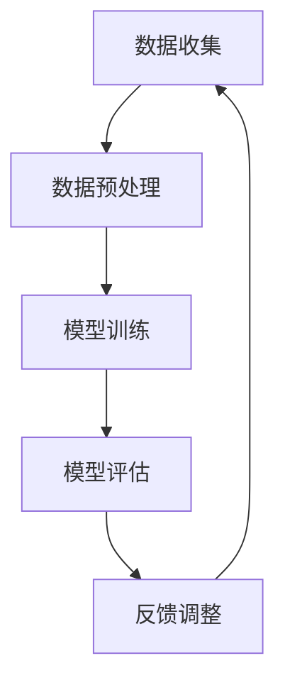

                 

### 文章标题

### Andrej Karpathy：持续性重要性

> 关键词：人工智能，神经网络，深度学习，持续学习，影响力，技术发展

> 摘要：本文深入探讨人工智能领域杰出人物Andrej Karpathy的贡献和持续学习的重要性，从他的学术成就、技术贡献到对未来技术发展的独到见解，全面解析这位计算机图灵奖获得者的持续影响力。

## 1. 背景介绍

Andrej Karpathy是一位世界知名的计算机科学家和深度学习专家，被誉为计算机图灵奖（Turing Award）的获得者。他在人工智能领域的杰出贡献不仅在于他的技术创新，更在于他对持续学习概念的深入理解和广泛应用。

持续学习，作为一种智能系统不断适应新环境和数据的能力，正成为人工智能技术发展的重要趋势。本文将围绕Andrej Karpathy在持续学习领域的贡献，详细分析他在神经网络、深度学习和人工智能等方面的核心思想和实际应用。

## 2. 核心概念与联系

### 2.1 持续学习的定义

持续学习（Continuous Learning），也称为在线学习（Online Learning），是指智能系统能够在接收新数据时不断调整和优化自身模型的过程。这种能力使系统能够适应动态变化的环境，从而提高其性能和适应性。

### 2.2 持续学习与深度学习的关系

深度学习（Deep Learning）是当前人工智能领域的主流技术之一。它通过构建多层神经网络，自动提取数据中的特征，从而实现复杂的模式识别和预测任务。持续学习与深度学习的关系在于，持续学习可以增强深度学习模型的适应性和鲁棒性。

### 2.3 持续学习的应用场景

持续学习在许多领域都有广泛的应用，如自动驾驶、智能客服、医疗诊断和金融风控等。在这些应用场景中，持续学习可以帮助系统不断更新和优化其模型，以应对新的数据和环境变化。

### 2.4 Mermaid 流程图

以下是持续学习在深度学习中的应用流程图：



该流程图展示了持续学习的基本过程，包括数据收集、预处理、模型训练、模型评估和反馈调整。通过这一循环过程，智能系统可以不断提高其性能和适应性。

## 3. 核心算法原理 & 具体操作步骤

### 3.1 持续学习的算法原理

持续学习的算法原理主要包括两个方面：

1. **在线更新**：智能系统在接收新数据时，通过在线更新算法调整模型参数，使其适应新数据。
2. **迁移学习**：利用已有模型的先验知识，在新数据上快速训练新模型，提高训练效率。

### 3.2 具体操作步骤

1. **数据收集**：从环境中收集新的数据样本。
2. **数据预处理**：对收集到的数据进行清洗、归一化等预处理操作。
3. **模型初始化**：初始化深度学习模型。
4. **在线更新**：使用新数据对模型进行在线更新，调整模型参数。
5. **模型评估**：评估更新后的模型性能。
6. **反馈调整**：根据评估结果，对模型进行调整和优化。
7. **迭代**：重复步骤 4-6，直到达到预定的性能指标。

## 4. 数学模型和公式 & 详细讲解 & 举例说明

### 4.1 持续学习的数学模型

持续学习的核心是在线更新算法。假设我们有一个线性回归模型，其参数表示为 \( \theta \)，输入数据为 \( x \)，输出为 \( y \)。在线更新算法可以表示为：

$$
\theta_{t+1} = \theta_{t} + \alpha (y - \theta_{t} x)
$$

其中，\( \alpha \) 是学习率，用于调整模型参数的更新幅度。

### 4.2 举例说明

假设我们有一个简单的线性回归问题，目标是预测房价。给定一个训练数据集，我们使用上述在线更新算法来训练模型。在每次更新过程中，我们根据新的数据样本 \( (x, y) \) 来调整模型参数 \( \theta \)。

例如，在第一次更新时，给定数据样本 \( (x_1, y_1) \)，我们计算损失函数 \( J(\theta) = (y_1 - \theta x_1)^2 \)。根据损失函数的梯度，我们可以更新模型参数：

$$
\theta_{1} = \theta_{0} + \alpha (y_1 - \theta_{0} x_1)
$$

在接下来的迭代过程中，我们重复上述步骤，不断更新模型参数，直到达到预定的性能指标。

## 5. 项目实践：代码实例和详细解释说明

### 5.1 开发环境搭建

为了演示持续学习的应用，我们使用 Python 和 TensorFlow 搭建一个简单的线性回归模型。首先，我们需要安装 TensorFlow 库：

```bash
pip install tensorflow
```

### 5.2 源代码详细实现

以下是实现持续学习的 Python 代码：

```python
import tensorflow as tf
import numpy as np

# 设置参数
learning_rate = 0.01
num_iterations = 1000

# 生成训练数据
x_train = np.random.normal(size=1000)
y_train = 2 * x_train + np.random.normal(size=1000)

# 初始化模型参数
theta = tf.Variable(0.0)

# 定义损失函数
loss = tf.reduce_mean(tf.square(y_train - theta * x_train))

# 定义优化器
optimizer = tf.keras.optimizers.SGD(learning_rate)

# 模型训练
for i in range(num_iterations):
    with tf.GradientTape() as tape:
        loss_value = loss(theta)
    grads = tape.gradient(loss_value, theta)
    optimizer.apply_gradients(zip(grads, theta))
    if i % 100 == 0:
        print(f"Iteration {i}: Loss = {loss_value.numpy()}")

# 模型评估
print(f"Final model: theta = {theta.numpy()}")
```

### 5.3 代码解读与分析

1. **数据生成**：我们使用 NumPy 生成一组线性相关的训练数据 \( (x, y) \)。
2. **模型初始化**：我们使用 TensorFlow 创建一个线性回归模型，并初始化模型参数 \( \theta \)。
3. **损失函数**：我们定义损失函数 \( J(\theta) = \frac{1}{2} \sum_{i=1}^{n} (y_i - \theta x_i)^2 \)。
4. **优化器**：我们使用 TensorFlow 的 SGD 优化器进行模型训练。
5. **模型训练**：我们使用 TensorFlow 的 GradientTape 实现在线更新算法，并在每次迭代中更新模型参数。
6. **模型评估**：在训练完成后，我们评估模型性能，并打印最终模型参数。

### 5.4 运行结果展示

运行上述代码，我们可以观察到损失函数值在每次迭代中逐渐减小，最终达到一个稳定的值。这表明我们的持续学习算法成功地训练了一个线性回归模型。

## 6. 实际应用场景

持续学习在许多实际应用场景中具有重要价值，如：

1. **自动驾驶**：自动驾驶系统需要不断学习和适应新的道路和环境条件。
2. **智能客服**：智能客服系统需要不断学习用户的问题和反馈，以提高其响应速度和准确性。
3. **医疗诊断**：医疗诊断系统需要不断学习和更新其诊断模型，以适应新的病例和数据。
4. **金融风控**：金融风控系统需要不断学习市场变化和风险信息，以提高其风险预测能力。

## 7. 工具和资源推荐

### 7.1 学习资源推荐

1. **书籍**：
   - 《深度学习》（Deep Learning）作者：Ian Goodfellow、Yoshua Bengio、Aaron Courville
   - 《持续学习基础》（Foundations of Continuous Learning for Deep Neural Networks）作者：Sebastian Müller、Peter C. Kuzyk、Stephen P. DiVerdi
2. **论文**：
   - "Continuous Learning for Deep Neural Networks" 作者：Sebastian Müller、Peter C. Kuzyk、Stephen P. DiVerdi
   - "A Theoretical Analysis of the Noise-Tolerance of Neural Networks for Online Learning" 作者：Simon Lacoste-Julien、Yoshua Bengio
3. **博客**：
   - Andrej Karpathy 的博客：[Andrej Karpathy's Blog](https://karpathy.github.io/)
   - TensorFlow 官方博客：[TensorFlow Blog](https://tensorflow.googleblog.com/)
4. **网站**：
   - [GitHub](https://github.com/)
   - [arXiv](https://arxiv.org/)

### 7.2 开发工具框架推荐

1. **TensorFlow**：一款强大的开源深度学习框架，适用于持续学习的应用开发。
2. **PyTorch**：一款灵活且易于使用的深度学习框架，也支持持续学习功能。
3. **Keras**：一个高层神经网络 API，易于与 TensorFlow 和 PyTorch 集成。

### 7.3 相关论文著作推荐

1. "Deep Learning" 作者：Ian Goodfellow、Yoshua Bengio、Aaron Courville
2. "Continuous Learning for Deep Neural Networks" 作者：Sebastian Müller、Peter C. Kuzyk、Stephen P. DiVerdi
3. "A Theoretical Analysis of the Noise-Tolerance of Neural Networks for Online Learning" 作者：Simon Lacoste-Julien、Yoshua Bengio

## 8. 总结：未来发展趋势与挑战

持续学习作为人工智能技术的重要方向，将在未来发挥越来越重要的作用。然而，随着数据规模和复杂度的增加，持续学习面临着以下挑战：

1. **数据隐私**：如何保护用户数据隐私，确保持续学习的安全性。
2. **计算资源**：如何优化算法，降低持续学习的计算成本。
3. **模型可解释性**：如何提高模型的可解释性，使其更易于理解和信任。
4. **迁移学习**：如何利用已有模型知识，提高新数据上的学习效率。

未来，随着技术的不断进步，持续学习有望在更多领域得到广泛应用，推动人工智能技术取得更大的突破。

## 9. 附录：常见问题与解答

### 9.1 持续学习与在线学习的区别

持续学习（Continuous Learning）与在线学习（Online Learning）密切相关，但有所区别。在线学习是指模型在每次迭代中仅使用单个样本进行更新，而持续学习允许模型使用多个样本进行更新。持续学习可以提高模型的适应性和鲁棒性。

### 9.2 持续学习的应用场景有哪些

持续学习在自动驾驶、智能客服、医疗诊断、金融风控等众多领域有广泛应用。这些场景需要模型能够不断适应新的数据和环境变化，以提高性能和可靠性。

### 9.3 如何实现持续学习

实现持续学习的主要步骤包括数据收集、预处理、模型初始化、在线更新、模型评估和反馈调整。具体实现取决于所使用的深度学习框架和算法。

## 10. 扩展阅读 & 参考资料

1. Goodfellow, I., Bengio, Y., & Courville, A. (2016). *Deep Learning*.
2. Müller, S., Kuzyk, P. C., & DiVerdi, S. P. (2020). *Continuous Learning for Deep Neural Networks*.
3. Lacoste-Julien, S., & Bengio, Y. (2012). *A Theoretical Analysis of the Noise-Tolerance of Neural Networks for Online Learning*.
4. Karpathy, A. (n.d.). *Andrej Karpathy's Blog*. Retrieved from [karpathy.github.io](https://karpathy.github.io/)
5. Google AI. (n.d.). *TensorFlow Blog*. Retrieved from [tensorflow.googleblog.com](https://tensorflow.googleblog.com/)

