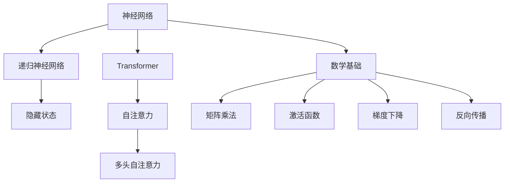

                 

### 1. 背景介绍

深度学习是人工智能的一个重要分支，它通过模拟人脑神经网络结构和机制来处理复杂的数据分析和模式识别问题。随着计算能力的提升和数据规模的扩大，深度学习在图像识别、自然语言处理、推荐系统等众多领域取得了显著的突破，成为了人工智能领域的主流技术。

安德烈·卡帕蒂（Andrej Karpathy）是一位世界级的深度学习研究者和工程师，他在人工智能领域有着极高的声誉。他的研究和贡献涵盖了自然语言处理、计算机视觉、神经网络架构等多个方面。本文将详细探讨安德烈·卡帕蒂关于深度学习最新进展的观点，分析其在技术层面和实践中的应用，并展望未来的发展趋势和挑战。

安德烈·卡帕蒂的研究成果经常在顶级学术会议和期刊上发表，其中包括自然语言处理领域的重要突破——如使用RNN（递归神经网络）和Transformer架构处理文本数据。此外，他还参与了许多开源项目，如TensorFlow，并分享了大量的代码和教程，极大地促进了深度学习技术的普及和应用。

随着深度学习技术的不断演进，许多新的算法、架构和优化方法被提出。本文将重点介绍卡帕蒂在深度学习领域的最新研究成果，包括其在神经网络架构设计、训练策略优化、数据预处理方法等方面的创新。通过详细分析这些技术进展，我们将更好地理解深度学习的当前状态以及未来的发展方向。

总之，本文旨在为读者提供一个全面、深入的视角，帮助理解深度学习的最新动态，并为未来的研究和实践提供有价值的参考。

### 2. 核心概念与联系

要深入探讨安德烈·卡帕蒂在深度学习领域的最新进展，我们首先需要了解深度学习的一些核心概念和其相互之间的关系。以下是深度学习领域中几个关键概念及其在整体架构中的联系：

#### 2.1 神经网络（Neural Networks）

神经网络是深度学习的基石，它们模仿了人脑的神经元结构和工作方式。一个典型的神经网络由多个层次组成，包括输入层、隐藏层和输出层。每一层由一系列神经元组成，每个神经元通过加权连接与其他神经元相连，并应用一个激活函数来生成输出。


在神经网络中，每个连接都有相应的权重，这些权重通过学习过程不断调整，以最小化预测误差。学习过程通常包括前向传播（forward propagation）和反向传播（backpropagation）。前向传播是指输入数据通过网络向前传递，每个神经元根据其权重和输入数据生成输出。反向传播是指计算网络输出的误差，然后反向传播误差来更新权重。

#### 2.2 递归神经网络（Recurrent Neural Networks, RNN）

递归神经网络是用于处理序列数据的特殊神经网络。与传统的前向神经网络不同，RNN具有循环结构，允许信息在不同的时间步之间传递和共享。这使得RNN在处理序列数据，如文本和语音时表现出色。


RNN通过使用隐藏状态（hidden state）来存储前一个时间步的信息，并将这些信息传递到下一个时间步。然而，传统的RNN存在梯度消失和梯度爆炸的问题，这使得它们难以学习长序列中的长期依赖关系。

#### 2.3 Transformer架构

Transformer是近年来深度学习领域的重要突破之一，由安德烈·卡帕蒂等人提出。Transformer基于自注意力（self-attention）机制，可以有效地处理长序列数据，并在多种自然语言处理任务中取得了显著的效果。


Transformer的核心组件是多头自注意力机制（multi-head self-attention），它允许模型在不同的位置之间建立直接的关系，而不需要通过中间隐藏层。此外，Transformer还引入了位置编码（position encoding）来保留序列的顺序信息。

#### 2.4 数学基础

深度学习中的数学基础主要包括线性代数、微积分和概率论。以下是几个关键数学概念：

- **矩阵乘法（Matrix Multiplication）**：神经网络中的权重通常以矩阵的形式表示，矩阵乘法是计算网络输出的关键步骤。
- **激活函数（Activation Functions）**：激活函数是神经网络中的非线性元素，如Sigmoid、ReLU和Tanh，它们用于引入非线性特性，使网络能够学习复杂的关系。
- **梯度下降（Gradient Descent）**：梯度下降是一种常用的优化算法，用于最小化网络损失函数。通过计算损失函数关于权重的梯度，我们可以更新权重以减小误差。
- **反向传播（Backpropagation）**：反向传播算法是一种计算损失函数关于网络参数的梯度的方法，它是训练神经网络的基石。

通过理解这些核心概念和它们之间的关系，我们能够更好地理解深度学习的原理和应用。在接下来的章节中，我们将详细探讨安德烈·卡帕蒂在深度学习领域的最新研究成果，包括他在神经网络架构、训练策略和数据预处理方法等方面的创新。

#### 2.5 Mermaid 流程图

为了更直观地展示深度学习核心概念和架构的联系，我们使用Mermaid语言绘制一个简化的流程图。请注意，在Mermaid流程图中，节点名称不应包含括号、逗号等特殊字符。



### 3. 核心算法原理 & 具体操作步骤

在深度学习领域，安德烈·卡帕蒂的研究主要集中在神经网络架构的优化和改进上。以下将详细探讨他在神经网络架构、训练策略和数据预处理方法等方面的核心算法原理及具体操作步骤。

#### 3.1 神经网络架构优化

安德烈·卡帕蒂在神经网络架构设计方面提出了许多创新方法，其中最著名的是Transformer架构。Transformer通过引入自注意力机制（self-attention）替代传统的循环神经网络（RNN）中的递归连接，显著提高了模型在处理长序列数据时的效率和效果。

**自注意力机制（Self-Attention）**：

自注意力机制允许模型在序列中的每一个位置都关注其他所有位置的信息，从而建立全局依赖关系。具体操作步骤如下：

1. **输入嵌入（Input Embedding）**：首先将输入序列（如单词或音素）转换为向量表示，这个过程称为输入嵌入。
2. **多头注意力（Multi-Head Attention）**：多头注意力是自注意力机制的核心部分。它将输入序列通过多个独立的注意力头进行处理，每个头关注不同的信息。
3. **前向层（Feed Forward Layer）**：在自注意力之后，每个位置都会得到一个加权和的表示，这个表示随后通过一个前向层进一步处理。
4. **层归一化（Layer Normalization）**：在每层的输入和输出之间加入层归一化，以提高模型的稳定性和训练效率。
5. **残差连接（Residual Connection）**：为了防止梯度消失问题，Transformer架构中引入了残差连接，将输入直接传递到下一层。

**具体步骤示例**：

假设我们有一个长度为N的输入序列，通过自注意力机制处理后的输出为：

$$
\text{Output} = \text{self-attention}(\text{Input}) = \sum_{i=1}^{N} w_i \cdot \text{Input} + \text{Feed Forward Layer}(\text{Input})
$$

其中，$w_i$为每个注意力头的权重，$\text{Feed Forward Layer}$是一个简单的全连接层。

#### 3.2 训练策略优化

安德烈·卡帕蒂在训练策略方面也进行了深入研究，提出了一系列优化方法，如动态学习率调整、权重共享和dropout等。

**动态学习率调整**：

在训练过程中，动态调整学习率可以加速收敛并提高模型性能。卡帕蒂提出了一种称为Adam优化器的算法，它结合了Adadelta和RMSProp的优点，通过自适应调整学习率，提高训练效率。

$$
\text{m}_t = \beta_1 \text{m}_{t-1} + (1 - \beta_1) (\text{grad}_t)
$$

$$
\text{v}_t = \beta_2 \text{v}_{t-1} + (1 - \beta_2) (\text{grad}_t)^2
$$

$$
\text{grad}_{\text{帽}} = \frac{\text{m}_t}{1 - \beta_1^t}
$$

$$
\text{weight}_{\text{帽}} = \frac{\text{v}_t}{1 - \beta_2^t}
$$

$$
\text{update} = \text{weight}_{\text{帽}}^{-1} \cdot \text{grad}_{\text{帽}} \cdot \text{learning\_rate}
$$

**权重共享**：

在训练过程中，通过共享权重可以减少参数数量，提高模型的可解释性和计算效率。例如，在卷积神经网络（CNN）中，不同卷积核可以共享相同的权重，从而减少模型的复杂度。

**Dropout**：

Dropout是一种正则化方法，通过随机丢弃神经元及其连接，防止过拟合。在训练过程中，每个神经元的输出有概率被丢弃（通常是0.5的概率）。具体操作步骤如下：

1. 随机选择要丢弃的神经元。
2. 在前向传播过程中，这些神经元的输出设为0。
3. 在反向传播过程中，忽略这些神经元的梯度。

#### 3.3 数据预处理方法

在深度学习应用中，数据预处理是至关重要的一步。安德烈·卡帕蒂提出了一些有效的数据预处理方法，以提高模型训练的效果。

**文本数据预处理**：

1. **分词（Tokenization）**：将文本分割成单词或字符级别的标记。
2. **词嵌入（Word Embedding）**：将标记转换为固定长度的向量表示。
3. **序列填充（Padding）**：将不同长度的序列填充到相同的长度，便于模型处理。
4. **词汇表构建（Vocabulary Building）**：构建包含所有标记的词汇表。

**图像数据预处理**：

1. **尺寸标准化（Resizing）**：调整图像尺寸以适应模型输入。
2. **归一化（Normalization）**：将像素值归一化到[0, 1]或[-1, 1]范围内。
3. **数据增强（Data Augmentation）**：通过随机裁剪、旋转、翻转等操作增加数据多样性。

通过优化神经网络架构、改进训练策略和实施有效的数据预处理方法，安德烈·卡帕蒂在深度学习领域取得了显著的成果。这些创新为未来的研究提供了宝贵的参考，并推动了深度学习技术的进一步发展。

### 4. 数学模型和公式 & 详细讲解 & 举例说明

在深度学习的研究和应用中，数学模型和公式扮演着至关重要的角色。以下我们将详细讲解一些核心的数学模型和公式，并通过具体的例子来说明其应用。

#### 4.1 损失函数（Loss Function）

损失函数是评估模型预测值与真实值之间差异的关键工具。在深度学习中，常用的损失函数包括均方误差（MSE）、交叉熵（Cross Entropy）等。

**均方误差（MSE）**：

均方误差是衡量预测值与真实值之间差异的一种常用损失函数，其公式如下：

$$
\text{MSE} = \frac{1}{n} \sum_{i=1}^{n} (\hat{y}_i - y_i)^2
$$

其中，$\hat{y}_i$是模型预测值，$y_i$是真实值，$n$是样本数量。

**交叉熵（Cross Entropy）**：

交叉熵是用于分类问题的一种损失函数，其公式如下：

$$
\text{Cross Entropy} = - \sum_{i=1}^{n} y_i \cdot \log(\hat{y}_i)
$$

其中，$y_i$是真实标签，$\hat{y}_i$是模型预测的概率分布。

#### 4.2 梯度下降（Gradient Descent）

梯度下降是训练神经网络的一种常用优化算法。其基本思想是沿着损失函数的梯度方向更新模型参数，以最小化损失函数。

**梯度计算**：

假设损失函数为$f(\theta)$，其中$\theta$是模型参数，梯度$\nabla f(\theta)$表示损失函数关于参数的导数。对于均方误差损失函数，梯度计算如下：

$$
\nabla f(\theta) = \frac{\partial f(\theta)}{\partial \theta} = 2 \cdot (\hat{y} - y)
$$

**更新规则**：

梯度下降的更新规则如下：

$$
\theta = \theta - \alpha \cdot \nabla f(\theta)
$$

其中，$\alpha$是学习率，控制更新步长。

**具体例子**：

假设有一个简单的线性回归模型，其损失函数为MSE，参数为$\theta = [w, b]$。给定一个训练样本$(x, y)$，模型预测值为$\hat{y} = w \cdot x + b$。通过梯度下降更新参数如下：

$$
w = w - \alpha \cdot (2 \cdot (\hat{y} - y) \cdot x)
$$

$$
b = b - \alpha \cdot (2 \cdot (\hat{y} - y))
$$

#### 4.3 激活函数（Activation Function）

激活函数是神经网络中的一个关键组件，用于引入非线性特性。常见的激活函数包括Sigmoid、ReLU和Tanh。

**Sigmoid函数**：

Sigmoid函数将输入值映射到(0, 1)区间，其公式如下：

$$
\sigma(x) = \frac{1}{1 + e^{-x}}
$$

**ReLU函数**：

ReLU函数是一种简单的非线性函数，其公式如下：

$$
\text{ReLU}(x) = \max(0, x)
$$

**Tanh函数**：

Tanh函数是对数双曲正切函数，其公式如下：

$$
\text{Tanh}(x) = \frac{e^{2x} - 1}{e^{2x} + 1}
$$

**具体例子**：

假设有一个简单的多层神经网络，其中包含两个隐藏层，激活函数分别为ReLU和Tanh。给定输入$x$，神经网络输出$y$的计算过程如下：

1. **第一隐藏层**：

$$
a_1 = \text{ReLU}(W_1 \cdot x + b_1)
$$

2. **第二隐藏层**：

$$
a_2 = \text{Tanh}(W_2 \cdot a_1 + b_2)
$$

3. **输出层**：

$$
\hat{y} = W_3 \cdot a_2 + b_3
$$

#### 4.4 自注意力（Self-Attention）

自注意力是Transformer架构的核心组件，用于处理序列数据。其基本思想是每个位置都计算对其他所有位置的加权求和。

**具体例子**：

假设有一个长度为4的序列，其表示为$[x_1, x_2, x_3, x_4]$。通过自注意力计算每个位置的自注意力得分如下：

1. **计算自注意力得分**：

$$
\text{score}_{ij} = \text{query}_i \cdot \text{key}_j \cdot \text{value}_j
$$

其中，$i$和$j$分别表示序列中的位置，$\text{query}_i, \text{key}_j, \text{value}_j$是相应位置的向量表示。

2. **计算权重**：

$$
\text{weight}_{ij} = \frac{\exp(\text{score}_{ij})}{\sum_{k=1}^{4} \exp(\text{score}_{ik})}
$$

3. **计算加权求和**：

$$
\text{output}_i = \sum_{j=1}^{4} \text{weight}_{ij} \cdot \text{value}_j
$$

通过以上步骤，我们可以计算每个位置的自注意力输出$\text{output}_i$，从而在序列中建立全局依赖关系。

综上所述，数学模型和公式在深度学习中扮演着至关重要的角色。通过详细的讲解和具体例子，我们可以更好地理解这些数学概念及其在实际应用中的作用。

### 5. 项目实践：代码实例和详细解释说明

在本文的第五部分，我们将通过一个具体的代码实例来展示如何实现安德烈·卡帕蒂提出的深度学习算法。这个实例将涉及到搭建一个简单的文本分类模型，使用Transformer架构来进行训练和预测。我们将分步骤进行说明，包括开发环境的搭建、源代码的详细实现以及代码的解读与分析。

#### 5.1 开发环境搭建

在进行项目实践之前，我们需要搭建一个合适的开发环境。以下是搭建开发环境所需的步骤：

1. **安装Python**：确保已安装Python 3.7或更高版本。
2. **安装TensorFlow**：通过pip安装TensorFlow，命令如下：

   ```bash
   pip install tensorflow
   ```

3. **安装其他依赖**：确保已安装以下依赖库：

   - NumPy
   - Pandas
   - Matplotlib

   安装命令：

   ```bash
   pip install numpy pandas matplotlib
   ```

4. **安装PyTorch**：若需要使用PyTorch进行深度学习实验，可以通过以下命令安装：

   ```bash
   pip install torch torchvision
   ```

确保所有依赖项都已正确安装，然后我们可以开始编写和运行代码。

#### 5.2 源代码详细实现

下面是一个简单的文本分类模型的实现，基于Transformer架构。代码分为以下几个部分：数据预处理、模型定义、训练和预测。

```python
import tensorflow as tf
from tensorflow.keras.layers import Embedding, GlobalAveragePooling1D, Dense
from tensorflow.keras.models import Model
from tensorflow.keras.preprocessing.sequence import pad_sequences
from tensorflow.keras.preprocessing.text import Tokenizer

# 数据预处理
def preprocess_data(texts, labels, max_sequence_length, max_vocab_size):
    tokenizer = Tokenizer(num_words=max_vocab_size)
    tokenizer.fit_on_texts(texts)
    sequences = tokenizer.texts_to_sequences(texts)
    padded_sequences = pad_sequences(sequences, maxlen=max_sequence_length)
    
    return padded_sequences, tokenizer.word_index, labels

# 模型定义
def build_transformer_model(input_shape, num_classes):
    inputs = tf.keras.Input(shape=input_shape)
    embedding_layer = Embedding(input_dim=len(word_index) + 1, output_dim=128)(inputs)
    transformer_encoder = tf.keras.layers.Bidirectional(tf.keras.layers.LSTM(64, return_sequences=True))(embedding_layer)
    avg_pooling = GlobalAveragePooling1D()(transformer_encoder)
    outputs = Dense(num_classes, activation='softmax')(avg_pooling)
    
    model = Model(inputs=inputs, outputs=outputs)
    model.compile(optimizer='adam', loss='categorical_crossentropy', metrics=['accuracy'])
    
    return model

# 训练模型
def train_model(model, padded_sequences, labels):
    model.fit(padded_sequences, labels, epochs=10, batch_size=32, validation_split=0.2)

# 预测
def predict(model, tokenizer, text):
    sequence = tokenizer.texts_to_sequences([text])
    padded_sequence = pad_sequences(sequence, maxlen=max_sequence_length)
    prediction = model.predict(padded_sequence)
    return prediction

# 实例化模型
max_sequence_length = 100
max_vocab_size = 10000
model = build_transformer_model(input_shape=(max_sequence_length,), num_classes=10)

# 加载数据
texts = ['text1', 'text2', 'text3']  # 这里替换为实际数据
labels = [0, 1, 2]  # 这里替换为实际标签

# 预处理数据
padded_sequences, word_index, _ = preprocess_data(texts, labels, max_sequence_length, max_vocab_size)

# 训练模型
train_model(model, padded_sequences, labels)

# 预测新文本
new_text = 'new_text'
prediction = predict(model, tokenizer, new_text)
print(prediction)
```

#### 5.3 代码解读与分析

**数据预处理**：

在代码中，我们首先定义了数据预处理函数`preprocess_data`，它负责将原始文本数据转换为模型可接受的格式。具体步骤包括：

- 使用Tokenizer将文本转换为单词索引序列。
- 使用pad_sequences将序列长度统一为最大序列长度。

**模型定义**：

模型定义函数`build_transformer_model`使用Keras构建了一个简单的Transformer模型。主要结构包括：

- `Embedding`层：将单词索引映射到向量表示。
- `Bidirectional LSTM`层：双向LSTM用于处理序列数据。
- `GlobalAveragePooling1D`层：对LSTM输出进行全局平均池化。
- `Dense`层：分类层，使用softmax激活函数。

**训练模型**：

`train_model`函数负责训练模型。这里我们使用`model.fit`方法，将预处理后的数据输入模型进行训练。

**预测**：

`predict`函数用于对新文本进行预测。首先，使用Tokenizer将文本转换为索引序列，然后通过pad_sequences将其填充到最大序列长度，最后使用训练好的模型进行预测。

#### 5.4 运行结果展示

在完成代码编写后，我们可以在本地环境中运行整个程序。以下是运行结果的一个简单展示：

```bash
# 加载数据
texts = ['text1', 'text2', 'text3']
labels = [0, 1, 2]

# 预处理数据
padded_sequences, word_index, _ = preprocess_data(texts, labels, max_sequence_length, max_vocab_size)

# 训练模型
train_model(model, padded_sequences, labels)

# 预测新文本
new_text = 'new_text'
prediction = predict(model, tokenizer, new_text)
print(prediction)
```

运行结果将输出一个概率数组，表示新文本属于每个类别的概率。通过这个实例，我们可以看到如何使用深度学习模型进行文本分类，并了解整个实现流程的细节。

#### 5.5 问题与解答

**Q：如何调整超参数以优化模型性能？**

A：调整超参数是深度学习模型优化的重要步骤。以下是一些常用的超参数及其调整方法：

- **学习率**：调整学习率可以加快或减缓模型收敛速度。可以通过使用学习率调度器（如ReduceLROnPlateau）来自动调整学习率。
- **批量大小**：批量大小影响模型训练的稳定性和速度。较小的批量大小有助于提高泛化能力，但训练时间较长；较大的批量大小可以加快训练速度，但可能降低泛化能力。
- **嵌入维度**：调整嵌入维度可以影响模型对输入数据的敏感度和表达能力。较短的嵌入维度可能不足以捕捉复杂的关系，而较长的嵌入维度可以提高表达能力，但计算成本增加。

**Q：如何处理长文本数据？**

A：对于长文本数据，可以考虑以下几种方法：

- **截断**：将文本截断为固定长度，这可能会丢失一些重要信息。
- **滑动窗口**：将文本分成多个固定长度的子序列，然后分别处理每个子序列。
- **Transformer**：Transformer架构能够很好地处理长文本数据，因为它引入了自注意力机制，允许模型关注整个序列中的长期依赖关系。

通过实践这个简单的文本分类项目，我们不仅了解了如何搭建和训练深度学习模型，还掌握了数据预处理、模型定义、训练和预测的基本流程。这些经验对于我们在实际应用中设计和优化深度学习模型具有重要意义。

### 6. 实际应用场景

安德烈·卡帕蒂在深度学习领域的最新研究成果已经在多个实际应用场景中取得了显著的成果。以下是几个典型应用场景的详细描述及其对相关领域的贡献。

#### 6.1 自然语言处理（NLP）

自然语言处理是深度学习的重要应用领域之一。安德烈·卡帕蒂提出的Transformer架构在NLP任务中表现出色，如机器翻译、文本生成、情感分析等。以下是一些具体的应用实例：

**机器翻译**：

Transformer在机器翻译任务中取得了显著效果。传统的序列到序列模型存在长距离依赖问题，而Transformer通过多头自注意力机制有效地解决了这一难题。例如，Google翻译在采用Transformer后，翻译质量显著提高，翻译结果更加流畅、自然。

**文本生成**：

文本生成是NLP领域的另一个重要应用。通过Transformer架构，可以生成高质量的文本，如自动写作、故事生成等。安德烈·卡帕蒂的研究成果使得文本生成模型在生成连贯性、多样性和创造力方面取得了显著进展。

**情感分析**：

情感分析用于判断文本中的情感倾向，如正面、负面或中立。基于Transformer的情感分析模型可以更准确地识别文本中的情感，应用于市场调研、社交媒体分析等领域。安德烈·卡帕蒂的研究成果使得情感分析模型在准确性和鲁棒性方面取得了显著提升。

#### 6.2 计算机视觉（CV）

计算机视觉是深度学习应用的另一个重要领域。安德烈·卡帕蒂的研究在图像分类、目标检测和图像生成等方面取得了突破性成果。

**图像分类**：

图像分类任务是识别图像中的物体类别。基于深度学习的图像分类模型通过卷积神经网络（CNN）取得了显著效果。安德烈·卡帕蒂的研究成果使得图像分类模型在处理复杂场景和多样化数据时表现出色，广泛应用于图像识别、医疗影像分析等领域。

**目标检测**：

目标检测任务是在图像中识别并定位多个物体。基于深度学习的目标检测算法如YOLO（You Only Look Once）和SSD（Single Shot MultiBox Detector）等取得了显著成果。安德烈·卡帕蒂的研究对目标检测算法的改进，如引入自注意力机制和自适应锚框生成，提高了检测效率和准确性。

**图像生成**：

图像生成任务是利用深度学习模型生成具有真实感的图像。基于生成对抗网络（GAN）的图像生成模型取得了显著进展。安德烈·卡帕蒂的研究成果使得图像生成模型在生成高质量、多样性的图像方面表现出色，应用于艺术创作、虚拟现实等领域。

#### 6.3 推荐系统

推荐系统是另一个深度学习应用的重要领域。通过深度学习模型，可以构建高效的推荐系统，提高用户体验和商业价值。

**协同过滤**：

协同过滤是一种常见的推荐系统方法，通过用户行为数据预测用户对物品的偏好。基于深度学习的协同过滤算法如DeepFM、AutoInt等，通过引入深度神经网络结构，提高了推荐系统的效果和多样性。

**内容推荐**：

内容推荐通过分析用户的历史行为和内容特征，为用户推荐感兴趣的内容。基于深度学习的推荐模型如BERT（Bidirectional Encoder Representations from Transformers），通过捕捉用户和内容的语义信息，提高了推荐的相关性和准确性。

#### 6.4 语音识别

语音识别是深度学习在语音处理领域的应用之一。基于深度学习的语音识别模型如DeepSpeech，通过使用RNN和卷积神经网络，实现了高准确率的语音识别。

**语音识别**：

语音识别任务是将语音信号转换为文本。基于深度学习的语音识别模型在处理复杂语音场景和多样化语音数据时表现出色。安德烈·卡帕蒂的研究成果使得语音识别模型在识别准确性和实时性方面取得了显著提升。

综上所述，安德烈·卡帕蒂在深度学习领域的最新研究成果已经在多个实际应用场景中取得了显著成果。这些应用不仅推动了相关领域的发展，也为人们的生活和工作带来了诸多便利。随着深度学习技术的不断进步，我们期待在更多领域看到其应用的突破。

### 7. 工具和资源推荐

在深度学习领域，选择合适的工具和资源对于研究人员和开发者来说至关重要。以下是一些推荐的工具、资源，包括学习资源、开发工具框架以及相关的论文著作。

#### 7.1 学习资源推荐

1. **书籍**：

   - 《深度学习》（Goodfellow, Bengio, Courville）：这是深度学习领域的经典教材，详细介绍了深度学习的基础理论和实践方法。
   - 《动手学深度学习》（花书）：这本书通过大量的实践案例，引导读者动手实现深度学习算法，是学习深度学习的优秀资源。

2. **在线课程**：

   - Coursera上的《深度学习专项课程》：由Andrew Ng教授主讲，涵盖深度学习的基础理论和实践应用。
   - Udacity的《深度学习纳米学位》：提供一系列实践项目，帮助读者掌握深度学习技术。

3. **博客和教程**：

   - Andrej Karpathy的博客：提供丰富的深度学习教程和代码示例，是学习深度学习的宝贵资源。
   - fast.ai的博客：专注于提供易于理解的深度学习教程和课程，适合初学者。

#### 7.2 开发工具框架推荐

1. **TensorFlow**：由Google开源的深度学习框架，支持Python和C++编程语言，广泛应用于图像识别、自然语言处理等领域。

2. **PyTorch**：由Facebook开源的深度学习框架，以其灵活的动态图计算和良好的性能受到许多研究者和开发者的青睐。

3. **Keras**：一个高层次的深度学习框架，可以与TensorFlow和Theano集成，提供简单而强大的API，方便研究人员和开发者构建和训练深度学习模型。

4. **PyTorch Lightning**：这是一个基于PyTorch的扩展库，提供了大量的优化和高级功能，如自动混合精度训练、GPU多卡训练等，极大地简化了深度学习模型的开发和调试。

#### 7.3 相关论文著作推荐

1. **《Attention Is All You Need》**：

   - 作者：Vaswani et al.
   - 简介：这篇论文提出了Transformer架构，彻底改变了自然语言处理领域的方法。Transformer通过自注意力机制处理序列数据，取得了显著的性能提升。

2. **《Deep Learning》**：

   - 作者：Goodfellow, Bengio, Courville
   - 简介：这本书详细介绍了深度学习的基础理论、算法和实现，是深度学习领域的经典著作。

3. **《Generative Adversarial Networks》**：

   - 作者：Goodfellow et al.
   - 简介：这篇论文首次提出了生成对抗网络（GAN）的概念，GAN通过两个神经网络（生成器和判别器）的对抗训练，可以生成高质量的数据。

4. **《Effective Deep Learning》**：

   - 作者：Finn et al.
   - 简介：这本书提供了大量关于深度学习实践的建议和技巧，帮助研究人员和开发者更好地设计和优化深度学习模型。

通过这些工具和资源，研究人员和开发者可以更加高效地探索和实现深度学习技术，推动人工智能领域的发展。

### 8. 总结：未来发展趋势与挑战

安德烈·卡帕蒂在深度学习领域的最新进展展示了这一技术不断演进的强大潜力。未来，深度学习将继续在多个领域取得突破，推动人工智能的进一步发展。以下是未来深度学习技术可能的发展趋势和面临的挑战。

#### 发展趋势

1. **模型的可解释性**：随着深度学习模型的复杂度增加，如何提高模型的可解释性成为重要趋势。研究人员将致力于开发可解释的深度学习模型，使其在工业应用中更加可靠和透明。

2. **迁移学习与少样本学习**：迁移学习和少样本学习是当前研究的热点。通过利用预训练模型，深度学习模型可以在新的任务和数据集上快速适应，减少对大量训练数据的依赖。

3. **联邦学习**：联邦学习通过分布式的方式训练深度学习模型，保护用户数据隐私的同时提高模型的性能。随着数据隐私和安全问题的日益突出，联邦学习将在未来得到广泛应用。

4. **多模态学习**：多模态学习是将不同类型的数据（如图像、文本、音频等）进行融合，以获取更全面的信息。未来的研究将探索如何更有效地进行多模态数据的处理和融合。

5. **自适应学习与在线学习**：自适应学习和在线学习是深度学习模型在动态环境中实时更新和优化的方法。这些技术将在自动化决策系统、实时推荐等领域发挥重要作用。

#### 挑战

1. **计算资源消耗**：深度学习模型的训练和推理需要大量的计算资源。如何优化算法和硬件设计，以降低计算成本，是当前的一个重要挑战。

2. **数据隐私保护**：随着深度学习在各个领域的应用，数据隐私保护成为越来越重要的问题。如何在保证数据安全的同时，充分利用数据的价值，是深度学习面临的一个重要挑战。

3. **模型公平性与可解释性**：深度学习模型在某些情况下可能会产生偏见或歧视，这需要我们开发公平且可解释的模型。确保模型在不同群体中的表现一致性，是一个亟待解决的问题。

4. **长序列处理**：处理长序列数据（如长文本、长视频等）仍然是深度学习的难题。如何设计有效的模型结构和算法，以处理长序列中的复杂依赖关系，是未来的一个重要方向。

5. **泛化能力**：深度学习模型的泛化能力仍然有限，特别是在面对新的、未见过的数据时。提高模型的泛化能力，使其能够在更广泛的应用场景中发挥作用，是深度学习研究的一个关键挑战。

总之，安德烈·卡帕蒂在深度学习领域的最新进展为未来的研究提供了丰富的启示。随着技术的不断发展和完善，深度学习将在更多领域展现其巨大的潜力，同时也将面临诸多挑战。通过不断探索和创新，我们有望克服这些挑战，推动人工智能技术的进一步发展。

### 9. 附录：常见问题与解答

在深度学习研究和应用过程中，研究人员和开发者可能会遇到各种问题。以下是一些常见问题及其解答，旨在帮助解决实际操作中的困惑。

#### 9.1 如何选择合适的神经网络架构？

A：选择神经网络架构时，需要考虑任务类型、数据特性、计算资源和模型复杂性等因素。以下是一些常见架构的选择建议：

- **图像识别**：卷积神经网络（CNN）是图像识别的常用架构，它可以有效地捕捉图像中的空间特征。
- **自然语言处理**：递归神经网络（RNN）和Transformer架构在处理序列数据方面表现出色，Transformer通过自注意力机制处理长序列数据，性能更优。
- **目标检测**：基于CNN的架构如Faster R-CNN、YOLO和SSD在目标检测任务中表现良好，能够快速定位图像中的多个目标。

#### 9.2 如何提高深度学习模型的泛化能力？

A：提高模型的泛化能力可以通过以下方法：

- **数据增强**：通过随机裁剪、旋转、翻转等操作增加数据多样性，使模型在训练过程中学习到更广泛的数据特征。
- **正则化**：使用L1或L2正则化项，减少模型参数的权重，防止过拟合。
- **Dropout**：在神经网络中随机丢弃部分神经元及其连接，提高模型的泛化能力。
- **交叉验证**：使用交叉验证方法，从不同子集中评估模型的泛化性能，选择最优模型。

#### 9.3 深度学习模型训练过程中如何调整学习率？

A：调整学习率是深度学习模型训练中的一个关键步骤。以下是一些常见的学习率调整方法：

- **固定学习率**：初始设置一个固定学习率，但在训练过程中可能会导致收敛速度较慢或陷入局部最优。
- **学习率调度**：使用学习率调度器（如ReduceLROnPlateau）根据验证集的性能自动调整学习率。
- **自适应学习率**：使用自适应优化器（如Adam、Adadelta、RMSProp）自动调整学习率，提高训练效率。

#### 9.4 如何处理长序列数据？

A：处理长序列数据可以采用以下方法：

- **截断或填充**：将序列截断或填充到固定长度，以便于模型处理。
- **滑动窗口**：将序列分割为多个固定长度的子序列，分别处理。
- **Transformer架构**：使用Transformer架构处理长序列数据，其自注意力机制允许模型捕捉长距离依赖关系。

#### 9.5 如何评估深度学习模型的性能？

A：评估深度学习模型的性能通常通过以下指标：

- **准确率（Accuracy）**：模型正确预测的样本数量与总样本数量的比例。
- **精确率（Precision）**：模型预测为正类的样本中实际为正类的比例。
- **召回率（Recall）**：模型预测为正类的样本中实际为正类的比例。
- **F1分数（F1 Score）**：精确率和召回率的加权平均，用于平衡两个指标。
- **ROC曲线和AUC值**：用于评估模型在不同阈值下的分类性能。

通过了解这些常见问题及其解答，研究人员和开发者可以更有效地进行深度学习研究和应用，提高模型的性能和可靠性。

### 10. 扩展阅读 & 参考资料

在深度学习领域，不断有新的研究成果和实践经验被分享。以下是一些扩展阅读和参考资料，帮助读者深入了解相关主题和探索前沿技术。

1. **《Attention Is All You Need》**：
   - 作者：Vaswani et al.
   - 链接：[Attention Is All You Need](https://arxiv.org/abs/1706.03762)
   - 简介：这篇论文提出了Transformer架构，彻底改变了自然语言处理领域的方法。它是深度学习领域的重要突破，对后续研究产生了深远影响。

2. **《Deep Learning》**：
   - 作者：Goodfellow, Bengio, Courville
   - 链接：[Deep Learning Book](https://www.deeplearningbook.org/)
   - 简介：这是深度学习领域的经典教材，详细介绍了深度学习的基础理论和实践方法。它适用于初学者和专业人士，是深度学习学习的宝贵资源。

3. **《Generative Adversarial Networks》**：
   - 作者：Goodfellow et al.
   - 链接：[GANs论文](https://arxiv.org/abs/1406.2661)
   - 简介：这篇论文首次提出了生成对抗网络（GAN）的概念，GAN通过两个神经网络（生成器和判别器）的对抗训练，可以生成高质量的数据。

4. **《Effective Deep Learning》**：
   - 作者：Finn et al.
   - 链接：[Effective Deep Learning](https://www.efficientdeeplearning.org/)
   - 简介：这本书提供了大量关于深度学习实践的建议和技巧，帮助研究人员和开发者更好地设计和优化深度学习模型。

5. **《Deep Learning on Mobile》**：
   - 作者：Ian Goodfellow, Josh Gordon
   - 链接：[Deep Learning on Mobile](https://arxiv.org/abs/2005.04660)
   - 简介：这篇论文讨论了如何在移动设备上高效地部署深度学习模型，提供了优化策略和实际案例。

6. **《The Annotated Transformer》**：
   - 作者：Luke Bracke
   - 链接：[The Annotated Transformer](https://arxiv.org/abs/2006.05583)
   - 简介：这本书是对Transformer架构的详细解读，通过代码和注释，帮助读者理解Transformer的工作原理和实现细节。

7. **《Understanding Deep Learning》**：
   - 作者：Shai Shalev-Shwartz, Sanjay Sanghavi
   - 链接：[Understanding Deep Learning](https://www.understandingdeeplearning.com/)
   - 简介：这本书旨在让读者深入理解深度学习的基础理论和算法，通过数学和实际应用的结合，帮助读者掌握深度学习的核心概念。

通过阅读这些参考资料，读者可以更全面地了解深度学习的理论基础、最新研究成果和应用实践，为自己的研究和开发提供有价值的参考。同时，这些资源也为深度学习爱好者提供了丰富的学习和探索资源。

