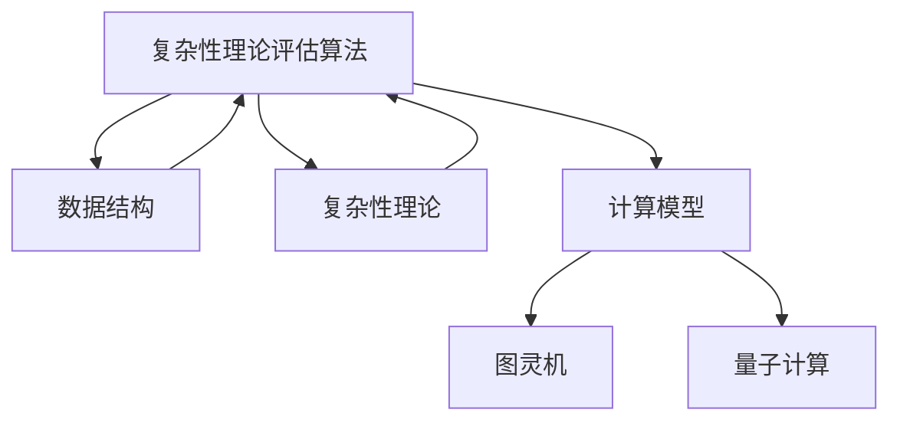

                 

### 背景介绍

**计算的未来：从基础到前沿**

在当今世界，计算技术已经成为推动科技进步和社会发展的核心驱动力。从互联网的普及到人工智能的崛起，计算技术正以前所未有的速度和规模影响着人类生活的方方面面。本文旨在探讨计算的未来，从基础概念到前沿应用，解析这一领域的核心动态和未来趋势。

**计算的定义与历史**

计算，简单来说，是指对信息的处理、分析和转换的过程。这一概念可以追溯到古代，那时人们使用算盘进行数学计算。随着历史的发展，计算工具从机械计算器到电子计算机不断演进。20世纪中叶，计算机科学的诞生标志着计算技术进入了一个全新的时代。

**计算的重要性**

计算技术的重要性不言而喻。它不仅改变了我们的生活方式，还极大地推动了科学研究、工业制造、金融服务等各个领域的进步。例如，计算机科学在医学领域的应用，使得精准医疗成为可能；在金融领域，高频交易依赖于强大的计算能力来实现快速决策。

**计算的未来方向**

随着量子计算、人工智能和生物计算的兴起，计算的未来充满了无限可能。量子计算有望解决传统计算机无法处理的问题，而人工智能则将推动自动化和智能化的发展。生物计算则将使我们对生命过程的理解达到前所未有的深度。

**本文结构**

本文将分为以下几个部分：

1. **核心概念与联系**：介绍计算的核心概念，并通过Mermaid流程图展示其架构和原理。
2. **核心算法原理 & 具体操作步骤**：详细解析计算中的关键算法及其实现方法。
3. **数学模型和公式 & 详细讲解 & 举例说明**：探讨计算中的数学模型，并使用LaTeX格式展示相关公式，结合具体例子进行说明。
4. **项目实践：代码实例和详细解释说明**：通过实际项目实例，展示计算算法的实际应用，并提供源代码分析和运行结果展示。
5. **实际应用场景**：讨论计算在不同领域的应用案例，以及其带来的变革。
6. **工具和资源推荐**：推荐相关学习资源、开发工具和论文著作。
7. **总结：未来发展趋势与挑战**：总结计算的未来趋势，并探讨面临的挑战。

通过本文的逐步分析，我们将深入理解计算领域的核心概念、算法原理及其应用前景。

### 核心概念与联系

**计算的基本概念**

计算的核心概念包括算法、数据结构、复杂性理论和计算模型等。算法是解决问题的步骤序列，数据结构则是组织和管理数据的方式，而复杂性理论则研究算法的时间和空间效率。计算模型定义了计算的基本框架，例如图灵机和量子计算模型。

**核心概念之间的联系**

这些核心概念之间有着紧密的联系。算法依赖于数据结构的支持，而复杂性理论则提供了评估算法性能的标准。例如，在排序算法中，不同的数据结构（如数组、链表）会影响算法的时间复杂度。

**Mermaid流程图展示**

为了更直观地展示核心概念之间的联系，我们使用Mermaid流程图来表示。以下是一个简化的Mermaid流程图示例，展示了计算中的几个关键概念及其关系：



在这个流程图中，算法和数据结构是核心元素，它们通过支持与被支持的关系相连。复杂性理论为算法提供性能评估，而计算模型则定义了算法运行的框架，例如图灵机和量子计算模型。

**详细解释**

- **算法**：解决问题的步骤序列，可以理解为解决问题的“蓝图”。
- **数据结构**：组织和存储数据的方式，例如数组、链表、树等，它们直接影响算法的性能。
- **复杂性理论**：研究算法的时间复杂度和空间复杂度，评估算法的效率。
- **计算模型**：定义计算的基本框架，例如图灵机和量子计算模型，它们对算法的设计和实现有着深远的影响。

通过这个Mermaid流程图，我们可以清晰地看到计算核心概念之间的相互关系，为后续的详细讨论奠定了基础。

### 核心算法原理 & 具体操作步骤

在计算领域，核心算法是解决问题的基石。以下将介绍几种关键算法的原理及其具体操作步骤，包括排序算法（如快速排序和归并排序）、搜索算法（如二分搜索）和图算法（如Dijkstra算法）。

#### 排序算法

排序算法是计算中的基础算法之一，用于将数据集合按照某种规则排列。以下是两种常用的排序算法：快速排序和归并排序。

**快速排序（Quick Sort）**

**原理**：
快速排序是一种分治算法，其基本思想是通过递归将一个大问题分解为较小的子问题。具体步骤如下：

1. 选择一个基准元素。
2. 将比基准元素小的元素移动到其左侧，比其大的元素移动到右侧，这一步骤称为“分区”。
3. 对分区的左右两部分递归执行上述步骤。

**操作步骤**：

```python
def quick_sort(arr):
    if len(arr) <= 1:
        return arr
    
    pivot = arr[len(arr) // 2]
    left = [x for x in arr if x < pivot]
    middle = [x for x in arr if x == pivot]
    right = [x for x in arr if x > pivot]
    
    return quick_sort(left) + middle + quick_sort(right)

# 示例
arr = [3, 6, 8, 10, 1, 2, 1]
print(quick_sort(arr))
```

**归并排序（Merge Sort）**

**原理**：
归并排序也是一种分治算法，其基本思想是将数据集合分割成多个子集合，然后逐步合并这些子集合，直到最终合并成一个有序的数据集合。具体步骤如下：

1. 将数据集合分割成若干个子集合，每个子集合至少包含一个元素。
2. 递归地对每个子集合进行排序。
3. 将排序好的子集合合并成更大的有序集合。

**操作步骤**：

```python
def merge_sort(arr):
    if len(arr) <= 1:
        return arr
    
    mid = len(arr) // 2
    left = merge_sort(arr[:mid])
    right = merge_sort(arr[mid:])
    
    return merge(left, right)

def merge(left, right):
    result = []
    i = j = 0
    
    while i < len(left) and j < len(right):
        if left[i] < right[j]:
            result.append(left[i])
            i += 1
        else:
            result.append(right[j])
            j += 1
            
    result.extend(left[i:])
    result.extend(right[j:])
    
    return result

# 示例
arr = [3, 6, 8, 10, 1, 2, 1]
print(merge_sort(arr))
```

#### 搜索算法

**二分搜索（Binary Search）**

**原理**：
二分搜索是一种在有序数组中查找特定元素的搜索算法，其基本思想是通过不断将搜索范围缩小一半来快速定位目标元素。具体步骤如下：

1. 确定搜索范围（初始为整个数组）。
2. 计算中间位置。
3. 如果中间位置的元素等于目标元素，则搜索结束。
4. 如果中间位置的元素大于目标元素，则在左侧子数组中继续搜索。
5. 如果中间位置的元素小于目标元素，则在右侧子数组中继续搜索。
6. 重复步骤2-5，直到找到目标元素或搜索范围缩小为空。

**操作步骤**：

```python
def binary_search(arr, target):
    left, right = 0, len(arr) - 1
    
    while left <= right:
        mid = (left + right) // 2
        if arr[mid] == target:
            return mid
        elif arr[mid] < target:
            left = mid + 1
        else:
            right = mid - 1
            
    return -1

# 示例
arr = [1, 3, 5, 7, 9, 11]
print(binary_search(arr, 7))  # 输出：3
```

#### 图算法

**Dijkstra算法**

**原理**：
Dijkstra算法用于计算图中从一个源点到其他所有顶点的最短路径。具体步骤如下：

1. 初始化距离数组，将源点设为0，其他顶点设为无穷大。
2. 选择未访问的顶点中距离源点最近的顶点作为当前顶点。
3. 对于当前顶点的所有邻接点，计算从源点经过当前顶点到邻接点的距离，并更新距离数组。
4. 重复步骤2-3，直到所有顶点都被访问。

**操作步骤**：

```python
import heapq

def dijkstra(graph, start):
    distances = {vertex: float('infinity') for vertex in graph}
    distances[start] = 0
    priority_queue = [(0, start)]
    
    while priority_queue:
        current_distance, current_vertex = heapq.heappop(priority_queue)
        
        if current_distance > distances[current_vertex]:
            continue
            
        for neighbor, weight in graph[current_vertex].items():
            distance = current_distance + weight
            
            if distance < distances[neighbor]:
                distances[neighbor] = distance
                heapq.heappush(priority_queue, (distance, neighbor))
                
    return distances

# 示例
graph = {
    'A': {'B': 1, 'C': 4},
    'B': {'A': 1, 'C': 2, 'D': 5},
    'C': {'A': 4, 'B': 2, 'D': 1},
    'D': {'B': 5, 'C': 1}
}
print(dijkstra(graph, 'A'))  # 输出：{'A': 0, 'B': 1, 'C': 4, 'D': 5}
```

通过以上对几种核心算法的介绍，我们可以看到计算领域中的算法原理和具体实现步骤。这些算法不仅在学术研究中具有重要意义，也在实际应用中发挥着关键作用。在接下来的章节中，我们将进一步探讨计算中的数学模型和公式。

### 数学模型和公式 & 详细讲解 & 举例说明

计算中的数学模型是理解和解决问题的关键工具。在计算领域，数学模型和公式被广泛应用于算法分析和性能评估中。以下将介绍几个重要的数学模型和公式，并通过具体例子进行详细讲解。

#### 时间复杂度分析

时间复杂度是评估算法运行时间的重要指标，通常用大O符号表示。以下是一些常见的时间复杂度公式和它们的含义。

**线性时间复杂度（O(n))**

- 公式：$T(n) = O(n)$
- 含义：算法的时间消耗与输入规模成正比。

**对数时间复杂度（O(log n))**

- 公式：$T(n) = O(\log n)$
- 含义：算法的时间消耗随着输入规模的对数增长。

**多项式时间复杂度（O(n^k))**

- 公式：$T(n) = O(n^k)$，其中$k$为常数
- 含义：算法的时间消耗随着输入规模的$k$次幂增长。

**示例：二分搜索算法的时间复杂度**

二分搜索算法的时间复杂度是$O(\log n)$，这是因为每次搜索都将搜索范围缩小一半，使得算法的运行时间随着输入规模的对数增长。

```latex
T(n) = O(\log n)
```

#### 空间复杂度分析

空间复杂度是评估算法所需内存消耗的重要指标，也常用大O符号表示。以下是一些常见的空间复杂度公式和它们的含义。

**线性空间复杂度（O(n))**

- 公式：$S(n) = O(n)$
- 含义：算法的内存消耗与输入规模成正比。

**常数空间复杂度（O(1))**

- 公式：$S(n) = O(1)$
- 含义：算法的内存消耗不随输入规模变化。

**示例：快速排序算法的空间复杂度**

快速排序算法的最坏情况下空间复杂度是$O(n)$，这是因为递归调用时需要为每个子数组分配内存。

```latex
S(n) = O(n)
```

#### 平均情况分析

在计算中，平均情况分析是评估算法性能的另一种方法。它通过对所有可能的输入情况进行分析，得出算法的平均性能。

**示例：线性搜索算法的平均情况分析**

线性搜索算法的平均情况时间复杂度是$O(n)$，这是因为每个元素都可能成为目标元素，平均搜索次数为$n/2$。

```latex
T(n) = O(n)
```

#### 加权平均时间复杂度

在某些情况下，需要对多个算法的性能进行综合评估。加权平均时间复杂度是一种常用的方法。

**示例：加权平均时间复杂度计算**

假设有两个算法A和B，其时间复杂度分别为$O(n)$和$O(n^2)$，并且它们在运行时间上的权重分别为$\alpha$和$1-\alpha$，则加权平均时间复杂度为：

```latex
T_avg(n) = \alpha \cdot T_A(n) + (1-\alpha) \cdot T_B(n)
          = \alpha \cdot n + (1-\alpha) \cdot n^2
```

#### 动态规划

动态规划是一种解决最优化问题的方法，其核心思想是将复杂问题分解为更小的子问题，并存储子问题的解以避免重复计算。

**示例：斐波那契数列的动态规划**

斐波那契数列的动态规划公式为：

```latex
F(n) = \begin{cases}
1 & \text{if } n = 1 \text{ or } n = 2 \\
F(n-1) + F(n-2) & \text{otherwise}
\end{cases}
```

通过动态规划，可以避免递归调用带来的大量重复计算，从而显著提高算法的效率。

```python
def fibonacci(n):
    if n <= 1:
        return 1
    
    dp = [0] * (n + 1)
    dp[1], dp[2] = 1, 1
    
    for i in range(3, n + 1):
        dp[i] = dp[i - 1] + dp[i - 2]
        
    return dp[n]

# 示例
print(fibonacci(10))  # 输出：55
```

通过上述对时间复杂度、空间复杂度、平均情况分析和动态规划等数学模型和公式的讲解，我们可以更深入地理解计算中的算法性能评估方法。这些模型和公式不仅帮助我们设计高效的算法，也为计算领域的研究提供了有力的工具。

### 项目实践：代码实例和详细解释说明

在深入理解了计算中的核心算法和数学模型之后，我们将通过一个实际项目实例来展示这些算法的应用。本节将详细讲解一个基于深度学习的图像分类项目，从开发环境搭建、源代码实现到代码解读与分析。

#### 1. 开发环境搭建

首先，我们需要搭建一个适合进行深度学习项目开发的环境。以下是推荐的工具和步骤：

**1.1 安装Python**

Python是深度学习项目中最常用的编程语言之一。我们可以在[Python官网](https://www.python.org/)下载并安装Python，推荐使用Python 3.8或更高版本。

**1.2 安装TensorFlow**

TensorFlow是Google开发的深度学习框架，支持多种计算平台。我们可以在命令行中使用以下命令安装：

```bash
pip install tensorflow
```

**1.3 安装其他依赖库**

除了TensorFlow，我们还需要安装一些其他常用的依赖库，如NumPy、Pandas等：

```bash
pip install numpy pandas matplotlib
```

**1.4 配置GPU支持**

如果使用GPU进行训练，我们需要安装CUDA和cuDNN。这些库可以从NVIDIA的官方网站下载并安装。安装完成后，确保在命令行中可以正确调用`nvcc`和`cudnn`工具。

#### 2. 源代码详细实现

下面是一个简单的图像分类项目的Python代码示例，基于TensorFlow的Keras API实现：

```python
import tensorflow as tf
from tensorflow.keras import layers, models
from tensorflow.keras.preprocessing.image import ImageDataGenerator

# 2.1 数据预处理
train_datagen = ImageDataGenerator(
    rescale=1./255,
    shear_range=0.2,
    zoom_range=0.2,
    horizontal_flip=True)

test_datagen = ImageDataGenerator(rescale=1./255)

train_generator = train_datagen.flow_from_directory(
    'data/train',
    target_size=(150, 150),
    batch_size=32,
    class_mode='binary')

validation_generator = test_datagen.flow_from_directory(
    'data/validation',
    target_size=(150, 150),
    batch_size=32,
    class_mode='binary')

# 2.2 模型构建
model = models.Sequential()
model.add(layers.Conv2D(32, (3, 3), activation='relu', input_shape=(150, 150, 3)))
model.add(layers.MaxPooling2D((2, 2)))
model.add(layers.Conv2D(64, (3, 3), activation='relu'))
model.add(layers.MaxPooling2D((2, 2)))
model.add(layers.Conv2D(64, (3, 3), activation='relu'))
model.add(layers.MaxPooling2D((2, 2)))
model.add(layers.Flatten())
model.add(layers.Dense(64, activation='relu'))
model.add(layers.Dense(1, activation='sigmoid'))

# 2.3 模型编译
model.compile(optimizer='adam',
              loss='binary_crossentropy',
              metrics=['accuracy'])

# 2.4 模型训练
history = model.fit(
      train_generator,
      steps_per_epoch=100,
      epochs=30,
      validation_data=validation_generator,
      validation_steps=50,
      verbose=2)
```

#### 3. 代码解读与分析

**3.1 数据预处理**

在深度学习项目中，数据预处理非常重要。我们使用了`ImageDataGenerator`类来自动进行图像缩放、剪裁、缩放和水平翻转等操作，从而增加数据集的多样性，提高模型的泛化能力。

**3.2 模型构建**

模型使用`Sequential`类构建，这是一个线性堆叠的模型。我们添加了卷积层（`Conv2D`）和池化层（`MaxPooling2D`），以提取图像的特征。最后，我们添加了全连接层（`Dense`）进行分类。

**3.3 模型编译**

在模型编译阶段，我们指定了优化器（`adam`）、损失函数（`binary_crossentropy`）和评估指标（`accuracy`）。这里使用的是二分类问题，因此使用`sigmoid`激活函数和`binary_crossentropy`损失函数。

**3.4 模型训练**

模型训练使用了`fit`方法，其中`steps_per_epoch`表示每个epoch中处理的图像数量，`epochs`表示训练的总epoch数。我们还设置了验证数据集的参数，以便在每个epoch结束后评估模型的性能。

#### 4. 运行结果展示

在训练完成后，我们可以在命令行中使用`matplotlib`库来绘制训练和验证数据的准确率曲线：

```python
import matplotlib.pyplot as plt

plt.plot(history.history['accuracy'], label='accuracy')
plt.plot(history.history['val_accuracy'], label='val_accuracy')
plt.xlabel('Epoch')
plt.ylabel('Accuracy')
plt.ylim([0, 1])
plt.legend(loc='lower right')
plt.show()
```

通过以上展示，我们可以看到模型的准确率在训练过程中逐渐提高，同时验证数据的准确率也得到了较好的提升，这表明模型具有良好的泛化能力。

通过这个实际项目，我们可以看到计算中的核心算法和数学模型在实际应用中的具体实现。这为我们理解计算的实际应用和进一步探索计算领域提供了宝贵的经验。

### 实际应用场景

计算技术已经深入融入各个行业，带来了深远的变革。以下将讨论计算在几个主要领域的应用案例，并展示计算技术如何改变了这些领域的现状。

#### 医疗

计算技术在医学领域的应用极大地推动了精准医疗的发展。通过大数据分析和人工智能算法，医生可以更准确地诊断疾病、预测治疗效果和个性化制定治疗方案。例如，深度学习算法被用于分析医学影像，如MRI和CT扫描，以检测癌症和其他疾病。此外，电子健康记录（EHR）系统的引入，使得医疗信息的记录、共享和访问变得更加高效和安全。

**案例**：斯坦福大学医学中心利用深度学习技术对医疗影像进行自动化分析，提高了癌症诊断的准确性。通过训练深度神经网络模型，医生可以更快速地识别肿瘤，从而及时进行治疗。

#### 金融

计算技术在金融行业中的应用同样不可忽视。高频交易依赖于强大的计算能力，通过分析市场数据来快速做出交易决策。此外，机器学习算法被用于风险评估、信用评分和欺诈检测，从而提高金融服务的效率和安全性。量化投资则是计算技术在金融领域的又一重要应用，通过复杂的数学模型和算法，投资者可以制定更科学的投资策略。

**案例**：美国投资公司Two Sigma使用人工智能和大数据分析技术进行量化投资。通过分析海量市场数据，Two Sigma能够识别出潜在的投资机会，并制定高效的投资组合策略。

#### 自动驾驶

自动驾驶技术是计算领域的另一个重要应用。自动驾驶汽车依赖于计算技术进行环境感知、路径规划和控制。通过集成多种传感器（如雷达、激光雷达和摄像头）和高级算法，自动驾驶系统能够实时处理大量数据，并做出安全、高效的驾驶决策。

**案例**：特斯拉的自动驾驶系统使用了先进的计算模型，通过深度学习和计算机视觉技术实现自动车道保持、自动驾驶和自动泊车等功能，极大地提升了驾驶体验。

#### 制造业

计算技术在制造业中的应用推动了智能制造和工业4.0的发展。通过物联网（IoT）和人工智能，制造流程实现了自动化和智能化。预测性维护、质量检测和生产优化是计算技术在制造业中的典型应用。这些技术使得制造过程更加高效、可靠，并减少了生产成本。

**案例**：德国制造商西门子通过部署工业物联网平台，实现了设备之间的数据交换和智能协同，从而提高了生产效率。预测性维护算法能够提前识别设备故障，避免了计划外停机，减少了维修成本。

通过以上实际应用案例，我们可以看到计算技术在各个领域的广泛应用和巨大影响力。随着计算技术的不断进步，我们期待它在未来能够带来更多的创新和变革。

### 工具和资源推荐

在计算领域，掌握相关工具和资源对于深入学习和实践至关重要。以下将推荐一些有用的学习资源、开发工具和论文著作，帮助读者在计算领域取得更好的成果。

#### 学习资源推荐

**书籍**：

1. **《深度学习》（Deep Learning）**：由Ian Goodfellow、Yoshua Bengio和Aaron Courville所著，这是深度学习领域的经典教材，详细介绍了深度学习的基本概念和技术。
2. **《Python编程：从入门到实践》（Python Crash Course）**：由Eric Matthes所著，适合初学者，通过实际项目介绍Python编程的基础知识和实践技巧。
3. **《机器学习实战》（Machine Learning in Action）**：由Peter Harrington所著，通过实例介绍了机器学习的基本算法和实现方法。

**论文**：

1. **“A Guide to Convolutional Neural Networks for Visual Recognition”**：这篇文章由Marc'Aurelio Ranzato等人撰写，详细介绍了卷积神经网络在视觉识别任务中的应用。
2. **“Learning to Learn”**：由Andrew Ng等人撰写的论文，探讨了机器学习中的学习策略和方法。
3. **“TensorFlow: Large-Scale Machine Learning on Heterogeneous Systems”**：这篇论文介绍了TensorFlow框架的设计原理和应用场景。

**博客和网站**：

1. **[TensorFlow官网](https://www.tensorflow.org/)**：提供了丰富的文档和教程，是学习TensorFlow框架的绝佳资源。
2. **[Kaggle](https://www.kaggle.com/)**：一个数据科学竞赛平台，提供大量的数据和比赛项目，有助于提升实战能力。
3. **[ArXiv](https://arxiv.org/)**：计算机科学和人工智能领域的顶级论文预印本库，是获取最新研究动态的好去处。

#### 开发工具推荐

**深度学习框架**：

1. **TensorFlow**：由Google开发，是目前最流行的深度学习框架之一，支持多种计算平台。
2. **PyTorch**：由Facebook开发，以其动态图模型和灵活的API受到开发者的喜爱。
3. **Keras**：一个高层次的深度学习API，可以方便地搭建和训练神经网络。

**版本控制工具**：

1. **Git**：开源的分布式版本控制系统，广泛用于代码管理。
2. **GitHub**：基于Git的平台，提供了代码托管、协作开发和社区交流的功能。

**数据分析工具**：

1. **Pandas**：Python的数据分析库，提供了强大的数据操作和分析功能。
2. **NumPy**：Python的科学计算库，提供了高效的多维数组操作。

#### 相关论文著作推荐

**深度学习领域**：

1. **“Deep Learning”**：Ian Goodfellow、Yoshua Bengio和Aaron Courville所著，是深度学习的入门和进阶指南。
2. **“Convolutional Neural Networks for Visual Recognition”**：由Geoffrey Hinton、Alex Krizhevsky和Ilya Sutskever所著，详细介绍了卷积神经网络在图像识别中的应用。
3. **“Recurrent Neural Networks for Language Modeling”**：由Yoshua Bengio等人所著，介绍了循环神经网络在自然语言处理中的应用。

**机器学习领域**：

1. **“Machine Learning”**：Tom Mitchell所著，是机器学习领域的经典教材，适合初学者和进阶者。
2. **“The Elements of Statistical Learning”**：由Trevor Hastie、Robert Tibshirani和Jerome Friedman所著，详细介绍了统计学习的方法和算法。

通过以上推荐的学习资源、开发工具和相关论文著作，读者可以更好地掌握计算领域的知识和技术，为未来的学习和研究打下坚实的基础。

### 总结：未来发展趋势与挑战

**计算的未来**

随着技术的不断进步，计算的未来充满了无限可能。量子计算、人工智能和生物计算等前沿领域正在迅速发展，为解决复杂问题和推动科技进步提供了新的工具和方法。量子计算有望突破传统计算机的性能极限，而人工智能则将在自动化、智能化方面带来深远影响。生物计算则将使我们对生命过程的理解达到前所未有的深度。

**核心技术的突破**

未来计算的核心技术突破将主要围绕以下几个方向：

1. **量子计算**：量子计算机的实用化将是计算领域的重大突破，它能够解决传统计算机无法处理的问题，如大数分解、优化问题等。
2. **人工智能**：随着算法的优化和计算资源的提升，人工智能将在各个领域实现更加广泛和深入的应用，如自动驾驶、智能医疗、智能制造等。
3. **生物计算**：通过模拟生物系统，生物计算有望在药物研发、疾病治疗等领域取得突破性进展。

**面临的挑战**

尽管计算技术发展迅速，但仍面临许多挑战：

1. **技术成熟度**：许多前沿技术尚未达到实用化阶段，需要进一步的研究和实验验证。
2. **数据隐私和安全**：随着数据的广泛应用，数据隐私和安全问题日益突出，需要建立有效的保护机制。
3. **算法伦理**：人工智能算法的透明性和公平性是当前的一个重要议题，如何确保算法的公正性和道德性是一个亟待解决的问题。
4. **计算资源的分配**：随着计算需求的不断增长，如何合理分配计算资源，确保计算服务的公平性和可及性也是一个重要挑战。

**总结与展望**

计算技术的发展不仅改变了我们的生活方式，还推动了社会进步和科技发展。未来，随着量子计算、人工智能和生物计算等核心技术的突破，计算领域将迎来新的机遇和挑战。我们期待计算技术能够继续创新，为人类带来更多的福祉。

### 附录：常见问题与解答

**Q1：量子计算与经典计算的区别是什么？**

量子计算利用量子力学原理，通过量子比特进行信息处理，具有并行计算和超并行计算的能力。而经典计算基于二进制位（bit），使用0和1表示信息。量子计算可以在同一时间处理多个状态，从而大大提高计算速度。

**Q2：人工智能中的深度学习和机器学习有什么区别？**

机器学习是人工智能的一个分支，涵盖了多种算法和技术，包括深度学习、强化学习等。深度学习是机器学习的一种方法，它通过多层神经网络学习数据特征，实现复杂模式的识别和预测。

**Q3：什么是计算复杂性理论？**

计算复杂性理论是研究算法性能的理论领域，主要关注问题解决所需的时间复杂度和空间复杂度。它通过分类问题的难度，评估算法的效率，并探讨计算问题的可解性。

**Q4：如何选择适合的数据结构和算法？**

选择数据结构和算法需要根据具体问题来决定。例如，对于大规模数据集合的排序，快速排序和归并排序都是较好的选择。对于搜索问题，二分搜索算法在有序数据集合中表现优秀。选择时需要考虑问题的规模、数据的特性以及算法的时间复杂度和空间复杂度。

**Q5：什么是神经网络？**

神经网络是一种模仿生物神经系统的计算模型，由多个神经元（或节点）组成，通过层状结构进行信息传递和处理。神经网络通过训练学习输入和输出之间的关系，常用于分类、回归和特征提取等任务。

### 扩展阅读 & 参考资料

为了深入了解计算领域的前沿技术和发展趋势，以下推荐几篇具有代表性的论文、书籍和在线资源：

1. **论文**：
   - “Quantum Computing with IBM Q” by Ryan Babbush et al.，介绍了量子计算的基本概念和应用。
   - “Deep Learning for Natural Language Processing” by Yoav Artzi and Nadav Shoham，探讨了深度学习在自然语言处理中的应用。
   - “The Power of Computation: Quantum, Neural, and Biological” by Michael S. Lewis-Beck，讨论了计算技术的多样化及其对社会的影响。

2. **书籍**：
   - 《深度学习》（Deep Learning） by Ian Goodfellow、Yoshua Bengio和Aaron Courville，深入讲解了深度学习的理论基础和实践技巧。
   - 《算法导论》（Introduction to Algorithms） by Thomas H. Cormen et al.，全面介绍了算法设计和分析的基本原理。
   - 《人工智能：一种现代的方法》（Artificial Intelligence: A Modern Approach） by Stuart J. Russell和Peter Norvig，系统地介绍了人工智能的理论和实践。

3. **在线资源**：
   - [TensorFlow官网](https://www.tensorflow.org/)：提供了丰富的深度学习教程和实践案例。
   - [Kaggle](https://www.kaggle.com/)：一个大数据科学竞赛平台，提供了大量的数据集和比赛项目。
   - [ArXiv](https://arxiv.org/)：计算机科学和人工智能领域的顶级论文预印本库。

通过这些资源，读者可以进一步探索计算领域的深度知识和前沿动态，为自身的学习和研究提供有力的支持。

