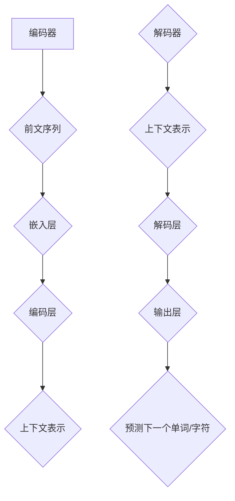

                 

关键词：语言模型，训练，神经网络，深度学习，自然语言处理，序列生成，编码器-解码器架构

> 摘要：本文将深入探讨语言模型训练的各个方面，包括背景介绍、核心概念与联系、核心算法原理、数学模型和公式、项目实践以及实际应用场景。我们将通过详细的讲解和实例分析，帮助读者理解语言模型训练的原理和技巧，以及其在自然语言处理领域的重要应用。

## 1. 背景介绍

语言模型是自然语言处理（NLP）领域的一个核心组件，它旨在预测一段文本的下一个单词或字符。语言模型的训练是一个复杂且极具挑战性的过程，涉及大量的数据预处理、算法设计和优化。随着深度学习的兴起，神经网络，尤其是递归神经网络（RNN）和变换器（Transformer）模型，在语言模型训练中发挥着重要作用。

语言模型的应用范围非常广泛，从机器翻译、文本摘要、问答系统到生成文本、创作诗歌和小说等。高效的训练方法和高性能的模型架构使得这些应用得以实现，并且取得了显著的效果。

本文将重点介绍Andrej Karpathy的研究工作，尤其是他在深度学习领域的贡献，特别是语言模型的训练。我们将探讨语言模型的核心概念、算法原理、数学模型、项目实践以及未来的发展趋势。

## 2. 核心概念与联系

### 2.1 语言模型的基本概念

语言模型是自然语言处理中的一个基本概念，它是一个概率模型，用于预测给定前文序列后下一个单词或字符的概率。一个简单的语言模型可以是基于N-gram的模型，它使用前N个单词的历史信息来预测下一个单词。

然而，深度学习的发展使得更复杂的语言模型成为可能。这些模型通常包括：

- **递归神经网络（RNN）**：RNN能够处理序列数据，并具有记忆功能，可以捕捉到序列中的长期依赖关系。
- **变换器（Transformer）**：Transformer模型是一种基于自注意力机制的神经网络架构，它在处理长序列和并行计算方面具有显著优势。

### 2.2 语言模型的架构

语言模型的架构可以分为编码器（Encoder）和解码器（Decoder）两部分：

- **编码器**：编码器负责将输入序列（如单词或字符）转换为上下文表示，这一表示能够捕获序列中的长期依赖关系。
- **解码器**：解码器则基于编码器生成的上下文表示，预测下一个单词或字符。

### 2.3 核心概念原理和架构的 Mermaid 流程图



在这个流程图中，编码器接收输入序列，并通过嵌入层和编码层生成上下文表示。解码器则使用这个上下文表示来预测下一个单词或字符。

## 3. 核心算法原理 & 具体操作步骤

### 3.1 算法原理概述

语言模型的训练目标是最大化模型对目标语言数据的概率分布的预测能力。在训练过程中，我们通常使用以下两个步骤：

- **正向传播**：输入序列通过编码器，生成上下文表示。然后，解码器基于这个上下文表示，生成预测序列。预测序列与实际序列进行比较，计算损失函数。
- **反向传播**：基于计算出的损失函数，模型参数通过梯度下降或其他优化算法进行更新。

### 3.2 算法步骤详解

#### 3.2.1 编码器

1. **嵌入层**：将输入单词或字符转换为向量表示。
2. **编码层**：使用RNN或Transformer等神经网络架构，处理序列数据，生成上下文表示。

#### 3.2.2 解码器

1. **初始状态**：解码器初始化为全零状态。
2. **解码层**：解码器基于编码器生成的上下文表示，逐个预测下一个单词或字符。
3. **输出层**：解码器输出概率分布，选择概率最高的单词或字符作为预测结果。

#### 3.2.3 损失函数

常用的损失函数包括交叉熵损失和均方误差（MSE）。在训练过程中，我们通过反向传播计算损失函数，并根据损失函数更新模型参数。

### 3.3 算法优缺点

- **优点**：
  - **高效性**：深度学习模型能够快速处理大量数据。
  - **灵活性**：神经网络可以适应不同的数据集和应用场景。
  - **强大表现**：先进的模型架构（如Transformer）在语言模型上取得了卓越的表现。

- **缺点**：
  - **训练难度**：深度学习模型通常需要大量的数据和计算资源进行训练。
  - **解释性**：神经网络模型难以解释，难以理解其内部工作机制。

### 3.4 算法应用领域

语言模型在多个领域有着广泛的应用：

- **文本生成**：用于生成文章、故事、诗歌等。
- **机器翻译**：将一种语言的文本翻译成另一种语言。
- **文本摘要**：将长文本简化为摘要。
- **问答系统**：回答用户关于特定领域的问题。
- **对话系统**：用于生成自然语言响应，与用户进行交互。

## 4. 数学模型和公式 & 详细讲解 & 举例说明

### 4.1 数学模型构建

语言模型的数学模型主要包括以下几个方面：

- **嵌入层**：将单词或字符映射到高维向量空间。
- **编码层**：处理序列数据，生成上下文表示。
- **解码层**：基于上下文表示，生成预测序列。

### 4.2 公式推导过程

语言模型的损失函数通常为交叉熵损失，其公式如下：

$$
L = -\sum_{i=1}^{n} \sum_{j=1}^{V} y_{ij} \log p_{ij}
$$

其中，$y_{ij}$为实际输出单词的概率，$p_{ij}$为模型预测的输出单词的概率。

### 4.3 案例分析与讲解

以下是一个简单的语言模型训练过程：

1. **数据预处理**：将文本数据划分为单词或字符序列，并构建词汇表。
2. **嵌入层**：将单词或字符映射到高维向量空间。
3. **编码层**：使用RNN或Transformer模型处理序列数据，生成上下文表示。
4. **解码层**：基于上下文表示，生成预测序列。
5. **损失函数**：计算交叉熵损失，并使用反向传播更新模型参数。

## 5. 项目实践：代码实例和详细解释说明

### 5.1 开发环境搭建

为了实现语言模型的训练，我们需要搭建一个合适的开发环境。以下是一个简单的步骤：

1. **安装Python**：确保Python环境已经安装。
2. **安装TensorFlow**：TensorFlow是一个流行的深度学习框架，用于构建和训练神经网络。
3. **数据准备**：下载并处理用于训练的语言数据集。

### 5.2 源代码详细实现

以下是一个简单的语言模型训练代码实例：

```python
import tensorflow as tf
from tensorflow.keras.layers import Embedding, LSTM, Dense
from tensorflow.keras.models import Sequential

# 数据准备
# ...

# 构建模型
model = Sequential([
    Embedding(vocab_size, embedding_dim),
    LSTM(units),
    Dense(vocab_size, activation='softmax')
])

# 编译模型
model.compile(optimizer='adam', loss='categorical_crossentropy', metrics=['accuracy'])

# 训练模型
model.fit(x_train, y_train, batch_size=batch_size, epochs=num_epochs)
```

### 5.3 代码解读与分析

在这个代码实例中，我们首先导入所需的TensorFlow模块。然后，我们准备数据，并构建一个简单的序列模型。模型由嵌入层、LSTM编码层和输出层组成。最后，我们编译并训练模型。

### 5.4 运行结果展示

运行上述代码后，模型将开始训练。在训练过程中，我们可以监控模型的损失和准确度。训练完成后，我们可以评估模型在测试数据集上的性能。

## 6. 实际应用场景

语言模型在多个实际应用场景中发挥着重要作用：

- **机器翻译**：例如，Google Translate使用深度学习模型将一种语言翻译成另一种语言。
- **文本摘要**：例如，新闻网站使用自动摘要技术将长篇文章简化为摘要。
- **对话系统**：例如，Amazon Alexa和Google Assistant等虚拟助手使用语言模型与用户进行交互。

## 7. 工具和资源推荐

### 7.1 学习资源推荐

- **《深度学习》（Goodfellow, Bengio, Courville）**：这是一本关于深度学习的经典教材，涵盖了语言模型等主题。
- **TensorFlow官方文档**：TensorFlow提供了详细的文档和教程，适合初学者和进阶用户。

### 7.2 开发工具推荐

- **Jupyter Notebook**：用于编写和运行Python代码。
- **Google Colab**：基于Jupyter Notebook，提供免费的GPU和Torch资源，适合深度学习项目。

### 7.3 相关论文推荐

- **《Attention Is All You Need》**：这篇论文提出了变换器（Transformer）模型，是语言模型领域的里程碑。
- **《Neural Machine Translation by Jointly Learning to Align and Translate》**：这篇论文介绍了基于神经网络的机器翻译方法。

## 8. 总结：未来发展趋势与挑战

### 8.1 研究成果总结

近年来，深度学习在语言模型训练方面取得了显著进展。变换器（Transformer）模型的出现标志着语言模型架构的变革。随着计算能力和数据集的增大，语言模型的性能不断提升，取得了在多个NLP任务上的卓越表现。

### 8.2 未来发展趋势

- **更大规模的语言模型**：随着计算资源的增加，未来将出现更大规模的语言模型，能够处理更复杂的语言现象。
- **多模态语言模型**：结合文本、图像、音频等多模态数据，开发多模态语言模型，拓展应用范围。
- **迁移学习与少样本学习**：利用迁移学习和少样本学习技术，降低训练成本，提高模型泛化能力。

### 8.3 面临的挑战

- **可解释性与可靠性**：深度学习模型的可解释性较差，如何提高模型的可解释性和可靠性是一个重要挑战。
- **隐私与安全**：大规模语言模型的训练和处理涉及大量用户数据，如何确保数据隐私和安全是一个重要问题。

### 8.4 研究展望

未来，语言模型将在人工智能领域发挥更加重要的作用。通过不断的创新和研究，我们有望实现更加智能、高效和可靠的语言模型，推动自然语言处理技术的发展。

## 9. 附录：常见问题与解答

### 9.1 什么是语言模型？

语言模型是一种概率模型，用于预测一段文本的下一个单词或字符。

### 9.2 语言模型有哪些类型？

常见的语言模型包括N-gram模型、递归神经网络（RNN）模型和变换器（Transformer）模型。

### 9.3 如何训练语言模型？

训练语言模型通常涉及以下步骤：数据预处理、模型构建、模型训练和模型评估。

### 9.4 语言模型有哪些应用？

语言模型的应用非常广泛，包括机器翻译、文本摘要、问答系统、文本生成等。

### 9.5 变换器模型是什么？

变换器模型是一种基于自注意力机制的深度学习模型，它在处理长序列和并行计算方面具有显著优势。

## 作者署名

作者：禅与计算机程序设计艺术 / Zen and the Art of Computer Programming

----------------------------------------------------------------

这篇文章以深入浅出的方式，涵盖了语言模型训练的各个方面，包括背景介绍、核心概念与联系、核心算法原理、数学模型和公式、项目实践以及实际应用场景。希望这篇文章能够帮助读者更好地理解语言模型训练的原理和技巧，并在实际应用中取得更好的效果。再次感谢读者对这篇文章的关注，如果您有任何疑问或建议，欢迎在评论区留言。让我们一起探索自然语言处理领域的无限可能。

