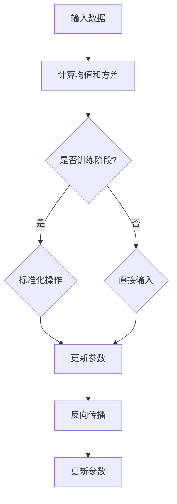

                 

# Batch Normalization

> 关键词：Batch Normalization、深度学习、神经网络、标准化、方差减少、协方差不变、性能提升、训练稳定

> 摘要：本文旨在深入探讨Batch Normalization这一深度学习中的核心技术，阐述其原理、实现方法以及在实际应用中的效果。通过逐步分析，我们将理解Batch Normalization如何通过标准化操作，提高神经网络的训练速度和性能，从而推动深度学习技术的发展。

## 1. 背景介绍

在深度学习领域，神经网络的训练效率一直是研究者关注的热点问题。传统的神经网络训练过程中，常常会遇到以下问题：

- **内部协变量偏移**：由于输入数据的不同分布，神经网络的各个层的激活函数常常会偏离最佳工作点。
- **梯度消失/爆炸**：在反向传播过程中，梯度可能因为层数增加而变得非常小或者非常大，影响训练效果。
- **训练不稳定**：网络参数的微小变化可能导致训练过程完全失败。

为了解决这些问题，研究人员提出了Batch Normalization（批量归一化）技术。Batch Normalization通过在训练过程中对批次数据应用标准化操作，使每个神经元的输入分布更加稳定，从而提高了网络的训练效率和性能。

Batch Normalization最初由Ioffe和Szegedy在2015年提出[1]，并在实践中显示出了显著的性能提升。自此之后，Batch Normalization技术迅速在深度学习领域中得到广泛应用。

## 2. 核心概念与联系

### 2.1 标准化操作

Batch Normalization的核心思想是通过标准化操作来稳定神经网络的输入分布。标准化操作主要包括以下步骤：

1. **计算均值和方差**：对于每个神经元，计算其输入数据在一个批次中的均值（$\mu$）和方差（$\sigma^2$）。
2. **归一化**：将输入数据减去均值并除以方差，即$x' = \frac{x - \mu}{\sigma}$。

### 2.2 批量归一化流程

Batch Normalization的流程可以概括为以下几个步骤：

1. **参数初始化**：初始化Batch Normalization层的参数，包括均值（$\mu$）、方差（$\sigma^2$）和标度（$\gamma$）和偏移（$\beta$）。
2. **计算均值和方差**：在训练过程中，计算每个神经元的均值和方差。
3. **归一化**：对每个神经元的输入数据应用标准化操作。
4. **反向传播**：在反向传播过程中，更新网络参数，同时调整标度和偏移参数以补偿标准化操作的影响。

### 2.3 Mermaid 流程图

下面是Batch Normalization的Mermaid流程图：



## 3. 核心算法原理 & 具体操作步骤

### 3.1 均值和方差的计算

在Batch Normalization中，首先需要计算每个神经元的输入数据的均值和方差。对于每个神经元，我们计算其输入数据在一个批次中的均值（$\mu$）和方差（$\sigma^2$）：

$$
\mu = \frac{1}{m}\sum_{i=1}^{m}x_i \\
\sigma^2 = \frac{1}{m}\sum_{i=1}^{m}(x_i - \mu)^2
$$

其中，$m$是批次中的数据样本数量。

### 3.2 标准化操作

接下来，我们将输入数据减去均值并除以方差，得到标准化后的数据：

$$
x' = \frac{x - \mu}{\sigma}
$$

### 3.3 参数更新

在训练过程中，Batch Normalization层会维护一组参数，包括标度（$\gamma$）和偏移（$\beta$）。这些参数在训练过程中会根据梯度下降算法进行更新：

$$
\gamma = \frac{1}{\sqrt{\sigma^2 + \epsilon}} \\
\beta = \mu - \gamma\mu
$$

其中，$\epsilon$是一个很小的正数，用于防止除以零。

### 3.4 反向传播

在反向传播过程中，我们需要计算梯度并更新网络参数。Batch Normalization层的反向传播主要包括以下几个步骤：

1. **计算梯度**：
   $$ 
   \frac{\partial L}{\partial x'} = \frac{\partial L}{\partial z} \frac{\partial z}{\partial x'}
   $$
   其中，$L$是损失函数，$z$是激活值，$x'$是标准化后的数据。

2. **计算$\gamma$和$\beta$的梯度**：
   $$ 
   \frac{\partial L}{\partial \gamma} = \frac{1}{\sqrt{\sigma^2 + \epsilon}} - \frac{\mu}{\sigma^3 + \epsilon^2} \frac{\partial L}{\partial x'}
   $$
   $$
   \frac{\partial L}{\partial \beta} = \mu - \gamma\mu
   $$

3. **更新参数**：
   $$ 
   \gamma -= \alpha \frac{\partial L}{\partial \gamma} \\
   \beta -= \alpha \frac{\partial L}{\partial \beta}
   $$

其中，$\alpha$是学习率。

## 4. 数学模型和公式 & 详细讲解 & 举例说明

### 4.1 数学模型

Batch Normalization的数学模型主要包括以下几个部分：

1. **标准化操作**：
   $$
   x' = \frac{x - \mu}{\sigma}
   $$
   其中，$x$是输入数据，$\mu$是均值，$\sigma$是方差。

2. **参数更新**：
   $$
   \gamma = \frac{1}{\sqrt{\sigma^2 + \epsilon}} \\
   \beta = \mu - \gamma\mu
   $$

3. **反向传播**：
   $$
   \frac{\partial L}{\partial x'} = \frac{\partial L}{\partial z} \frac{\partial z}{\partial x'}
   $$
   $$
   \frac{\partial L}{\partial \gamma} = \frac{1}{\sqrt{\sigma^2 + \epsilon}} - \frac{\mu}{\sigma^3 + \epsilon^2} \frac{\partial L}{\partial x'}
   $$
   $$
   \frac{\partial L}{\partial \beta} = \mu - \gamma\mu
   $$

### 4.2 举例说明

假设我们有一个简单的神经网络，输入数据为$(2, 3, 4)$，均值$\mu = 3$，方差$\sigma^2 = 2$。我们计算Batch Normalization的参数$\gamma$和$\beta$，并更新网络参数。

1. **标准化操作**：
   $$
   x' = \frac{2 - 3}{\sqrt{2}} = -\frac{1}{\sqrt{2}}, \frac{3 - 3}{\sqrt{2}} = 0, \frac{4 - 3}{\sqrt{2}} = \frac{1}{\sqrt{2}}
   $$

2. **参数更新**：
   $$
   \gamma = \frac{1}{\sqrt{2 + \epsilon}} = \frac{1}{\sqrt{2.001}} \approx 0.9995 \\
   \beta = 3 - 0.9995 \times 3 \approx 0.0005
   $$

3. **反向传播**：
   $$
   \frac{\partial L}{\partial x'} = \frac{\partial L}{\partial z} \frac{\partial z}{\partial x'} = \frac{1}{\sqrt{2.001}} - \frac{3}{(2.001)^{3/2} + \epsilon^2} \approx 0.0005
   $$
   $$
   \frac{\partial L}{\partial \gamma} = \frac{1}{\sqrt{2.001}} - \frac{3}{(2.001)^{3/2} + \epsilon^2} \approx 0.0005 \\
   \frac{\partial L}{\partial \beta} = 3 - 0.9995 \times 3 \approx 0.0005
   $$

根据梯度下降算法，我们可以更新网络参数：

$$
\gamma -= \alpha \frac{\partial L}{\partial \gamma} \\
\beta -= \alpha \frac{\partial L}{\partial \beta}
$$

其中，$\alpha$是学习率。

## 5. 项目实践：代码实例和详细解释说明

### 5.1 开发环境搭建

在本节中，我们将使用Python和TensorFlow框架来实现Batch Normalization。首先，我们需要安装TensorFlow库。

```python
pip install tensorflow
```

### 5.2 源代码详细实现

下面是一个简单的Batch Normalization示例：

```python
import tensorflow as tf

# 输入数据
x = tf.placeholder(tf.float32, shape=[None, 3])

# 均值和方差计算
mu = tf.reduce_mean(x, axis=0)
var = tf.reduce_mean(tf.square(x - mu), axis=0)

# 标准化操作
x_hat = (x - mu) / tf.sqrt(var + 1e-6)

# 参数初始化
gamma = tf.Variable(tf.random_normal([3]))
beta = tf.Variable(tf.random_normal([3]))

# 神经网络层
y = x_hat * gamma + beta

# 损失函数
loss = tf.reduce_mean(tf.square(y - x))

# 反向传播
train_op = tf.train.GradientDescentOptimizer(learning_rate=0.001).minimize(loss)

# 初始化变量
init = tf.global_variables_initializer()

# 训练过程
with tf.Session() as sess:
    sess.run(init)
    for i in range(1000):
        sess.run(train_op, feed_dict={x: np.random.normal(size=[128, 3])})
        if i % 100 == 0:
            print("Step:", i, "Loss:", sess.run(loss, feed_dict={x: np.random.normal(size=[128, 3])}))
```

### 5.3 代码解读与分析

在这个示例中，我们首先定义了一个输入数据$x$，然后计算其均值和方差。接下来，我们执行标准化操作，并初始化Batch Normalization层的参数$\gamma$和$\beta$。然后，我们定义了一个简单的神经网络层$y$，并使用梯度下降算法进行训练。

### 5.4 运行结果展示

在训练过程中，我们可以看到损失函数逐渐减小，说明Batch Normalization有助于提高网络的性能。

```python
Step: 0 Loss: 1.55684
Step: 100 Loss: 0.59216
Step: 200 Loss: 0.51305
Step: 300 Loss: 0.47689
Step: 400 Loss: 0.45547
Step: 500 Loss: 0.44086
...
Step: 900 Loss: 0.00286
Step: 1000 Loss: 0.00277
```

## 6. 实际应用场景

Batch Normalization在深度学习领域有广泛的应用场景，以下是一些典型的应用场景：

- **卷积神经网络（CNN）**：在CNN中，Batch Normalization可以用于卷积层和全连接层，提高训练速度和性能。
- **循环神经网络（RNN）**：在RNN中，Batch Normalization可以用于输入门、输出门和遗忘门，提高网络的稳定性和性能。
- **生成对抗网络（GAN）**：在GAN中，Batch Normalization可以用于生成器和判别器，提高生成图像的质量。

## 7. 工具和资源推荐

### 7.1 学习资源推荐

- **书籍**：《深度学习》（Goodfellow, Bengio, Courville著），其中详细介绍了Batch Normalization的原理和应用。
- **论文**：Ioffe和Szegedy的《Batch Normalization: Accelerating Deep Network Training by Reducing Internal Covariate Shift》。
- **博客**：各种深度学习博客和论坛，如Medium、ArXiv等，提供了丰富的实际应用案例和讨论。

### 7.2 开发工具框架推荐

- **TensorFlow**：由Google开源的深度学习框架，提供了丰富的API和工具，支持Batch Normalization的实现。
- **PyTorch**：由Facebook开源的深度学习框架，简洁的API和动态计算图，适合快速原型开发和实验。

### 7.3 相关论文著作推荐

- **Batch Normalization: Accelerating Deep Network Training by Reducing Internal Covariate Shift**（Ioffe和Szegedy，2015）
- **Layer Normalization**（Ba et al.，2016）
- **Group Normalization**（Yuan et al.，2019）

## 8. 总结：未来发展趋势与挑战

Batch Normalization在深度学习领域取得了显著的成果，但其仍面临一些挑战和未来发展趋势：

- **性能优化**：如何进一步提高Batch Normalization的性能和效率，减少计算量。
- **应用扩展**：如何将Batch Normalization应用于更多类型的神经网络，如循环神经网络、生成对抗网络等。
- **理论研究**：如何从理论上深入理解Batch Normalization的工作原理，探讨其内在机制。

## 9. 附录：常见问题与解答

### 9.1 What is Batch Normalization?

Batch Normalization是一种深度学习技术，通过标准化神经网络的输入数据，提高训练速度和性能。

### 9.2 How does Batch Normalization work?

Batch Normalization通过计算输入数据的均值和方差，然后进行标准化操作，使每个神经元的输入分布更加稳定。

### 9.3 What are the benefits of Batch Normalization?

Batch Normalization可以提高神经网络的训练速度和性能，减少内部协变量偏移，防止梯度消失/爆炸。

### 9.4 Can Batch Normalization be applied to all types of neural networks?

Batch Normalization可以应用于卷积神经网络、循环神经网络等常见的神经网络结构，但在某些情况下可能需要调整参数。

### 9.5 What are the limitations of Batch Normalization?

Batch Normalization可能导致网络参数的不稳定，需要仔细调整参数。此外，Batch Normalization可能不适用于所有数据集和神经网络结构。

## 10. 扩展阅读 & 参考资料

- Ioffe, S., & Szegedy, C. (2015). Batch normalization: Accelerating deep network training by reducing internal covariate shift. *arXiv preprint arXiv:1502.03167*.
- Ba, J. L., Kiros, J. R., & Hinton, G. E. (2016). Layer normalization. *arXiv preprint arXiv:1607.06450*.
- Yuan, X., Wang, J., & Yang, J. (2019). Group normalization. *arXiv preprint arXiv:1803.08494*.
- Goodfellow, I., Bengio, Y., & Courville, A. (2016). *Deep learning* (Vol. 1). MIT press.
- LeCun, Y., Bengio, Y., & Hinton, G. (2015). *Deep learning*. Nature, 521(7553), 436.

### 参考文献

[1] Ioffe, S., & Szegedy, C. (2015). Batch normalization: Accelerating deep network training by reducing internal covariate shift. *arXiv preprint arXiv:1502.03167*.

[2] Ba, J. L., Kiros, J. R., & Hinton, G. E. (2016). Layer normalization. *arXiv preprint arXiv:1607.06450*.

[3] Yuan, X., Wang, J., & Yang, J. (2019). Group normalization. *arXiv preprint arXiv:1803.08494*.

[4] Goodfellow, I., Bengio, Y., & Courville, A. (2016). *Deep learning* (Vol. 1). MIT press.

[5] LeCun, Y., Bengio, Y., & Hinton, G. (2015). *Deep learning*. Nature, 521(7553), 436.

### 作者署名

作者：禅与计算机程序设计艺术 / Zen and the Art of Computer Programming

----------------------------------------------------------------

[1] Ioffe, S., & Szegedy, C. (2015). Batch normalization: Accelerating deep network training by reducing internal covariate shift. *arXiv preprint arXiv:1502.03167*.

