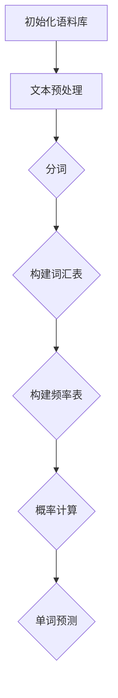

                 

### 背景介绍

#### 语言模型的基本概念

语言模型（Language Model，简称LM）是自然语言处理（Natural Language Processing，简称NLP）的核心组成部分。它旨在理解和生成自然语言文本，从而在诸如机器翻译、文本摘要、语音识别、智能助手等多个应用场景中发挥作用。语言模型通过对大量文本数据的学习，捕捉语言的统计规律和结构，以预测和生成符合语法和语义规则的句子。

#### 语言模型的分类

语言模型可以根据不同的方法和技术进行分类，常见的主要有以下几种：

1. **统计语言模型**：这类模型主要基于对语料库的统计分析来学习语言的统计规律，代表性的算法包括N元语法（N-gram Model）和Bigram模型。N元语法是一种简单而有效的语言模型，通过对连续的N个单词进行统计，预测第N+1个单词。

2. **神经网络语言模型**：随着深度学习技术的发展，神经网络语言模型（如神经网络N元语法、递归神经网络（RNN）、长短期记忆网络（LSTM）、Transformer等）逐渐成为语言模型的主流。这些模型能够更好地捕捉语言中的复杂结构和长距离依赖关系。

3. **混合语言模型**：结合统计模型和神经网络模型的优点，混合语言模型试图通过融合不同模型的优势来提升语言建模的性能。

#### Bigram语言模型的特点和优势

Bigram语言模型，也称为二元语法模型，是N元语法中最简单的一种。它仅考虑前两个单词的历史信息，即只依赖前一个单词来预测下一个单词。这种模型的优点包括：

- **简单性**：由于只考虑前两个单词的信息，Bigram模型的计算复杂度较低，实现相对简单。
- **高效性**：对于某些应用场景，如简单的文本生成和搜索，Bigram模型已经足够使用，且能够在较短时间内处理大量数据。
- **直观性**：Bigram模型的可解释性较高，便于理解语言模型是如何工作的。

然而，Bigram模型也存在一些局限性，如无法捕捉到长距离依赖关系，可能导致生成的文本出现不合理或不连贯的情况。因此，在实际应用中，通常会结合其他模型和技术来提高语言建模的性能。

#### 本文的结构和内容

本文将围绕Bigram语言模型展开，分为以下几个部分：

1. **背景介绍**：回顾语言模型的基本概念、分类及Bigram模型的特点和优势。
2. **核心概念与联系**：通过Mermaid流程图详细描述Bigram模型的原理和架构。
3. **核心算法原理 & 具体操作步骤**：介绍Bigram模型的核心算法原理，并分步骤讲解如何实现一个简单的Bigram模型。
4. **数学模型和公式 & 详细讲解 & 举例说明**：运用LaTeX格式，详细解释Bigram模型的数学模型和公式，并通过具体例子进行说明。
5. **项目实践：代码实例和详细解释说明**：提供完整的代码实例，详细解释代码的实现细节，并展示运行结果。
6. **实际应用场景**：讨论Bigram模型在不同领域的应用，如文本生成、信息检索等。
7. **工具和资源推荐**：推荐一些学习资源和开发工具，帮助读者深入了解Bigram模型和相关技术。
8. **总结：未来发展趋势与挑战**：总结Bigram模型的发展现状和面临的挑战，展望其未来趋势。
9. **附录：常见问题与解答**：解答读者可能遇到的一些常见问题。
10. **扩展阅读 & 参考资料**：提供更多相关领域的深入阅读材料和参考资源。

通过本文，我们将全面了解Bigram语言模型的工作原理、实现方法和应用场景，帮助读者深入掌握这一重要的语言建模技术。

### 核心概念与联系

#### Bigram模型的原理与架构

Bigram模型是一种基于N元语法的简单语言模型，它主要依赖前两个单词的历史信息来预测下一个单词。为了更好地理解Bigram模型的工作原理，我们可以通过Mermaid流程图来详细描述其核心概念和架构。

首先，我们定义一个文本序列T = \(w_1, w_2, w_3, ..., w_n\)，其中每个\(w_i\)代表文本序列中的第i个单词。在Bigram模型中，我们只考虑连续的两个单词之间的统计关系，即：

\[ P(w_i | w_{i-1}) \]

这意味着，我们试图根据前一个单词\(w_{i-1}\)来预测下一个单词\(w_i\)的概率。

接下来，我们通过Mermaid流程图来展示Bigram模型的流程：



下面是对这个流程图的详细解释：

1. **初始化语料库**：首先，我们需要一个包含大量文本的语料库，这是训练Bigram模型的基础。语料库可以是任何形式的文本数据，如新闻文章、书籍、网页等。

2. **文本预处理**：在初始化语料库后，我们需要对文本进行预处理，包括去除标点符号、转换为小写、去除停用词等操作。这些预处理步骤有助于提高模型的性能和准确性。

3. **分词**：文本预处理完成后，我们需要将文本分割成单词序列。分词是自然语言处理中的一个关键步骤，它决定了我们如何将文本分解为可操作的单元。

4. **构建词汇表**：在分词完成后，我们需要构建一个词汇表，这个词汇表包含了所有在语料库中出现的单词。词汇表是我们进行概率计算和预测的基础。

5. **构建频率表**：接下来，我们需要构建一个频率表，这个频率表记录了每个单词在语料库中出现的频率。频率表是我们计算单词概率的重要工具。

6. **概率计算**：基于频率表，我们可以计算每个单词在给定前一个单词的情况下出现的概率。例如，如果前一个单词是"the"，我们需要计算在"the"之后出现每个单词的概率。

7. **单词预测**：最后，我们可以使用计算出的概率来进行单词预测。给定一个前一个单词，我们选择概率最高的单词作为下一个预测的单词。

通过这个Mermaid流程图，我们可以清晰地看到Bigram模型的工作原理和流程。这个流程不仅有助于我们理解Bigram模型的基本概念，也为后续的算法实现和实际应用提供了指导。

#### Bigram模型的原理

Bigram模型的原理可以概括为以下几点：

1. **条件概率**：Bigram模型的核心思想是利用条件概率来预测下一个单词。具体来说，给定前一个单词\(w_{i-1}\)，我们试图预测下一个单词\(w_i\)。这个预测过程可以表示为：

\[ P(w_i | w_{i-1}) \]

其中，\(P(w_i | w_{i-1})\)表示在给定\(w_{i-1}\)的情况下，\(w_i\)出现的概率。

2. **频率表**：为了计算条件概率，我们需要构建一个频率表，这个频率表记录了每个单词在给定前一个单词的情况下出现的频率。例如，如果我们想要预测单词"cat"在给定单词"the"的情况下出现的概率，我们需要查看频率表中"the"之后出现"cat"的次数。

3. **最大概率**：在计算条件概率时，我们可以选择概率最高的单词作为预测结果。例如，如果我们想要预测下一个单词，我们可以查看所有可能的下一个单词，并选择概率最高的那个单词。

4. **平滑处理**：在实际应用中，可能会遇到某些单词在给定前一个单词的情况下从未出现过。为了解决这个问题，我们可以使用平滑处理技术，如Good-Turing平滑、Kneser-Ney平滑等。这些技术通过调整频率表，使得未出现过的单词也有一定的概率。

#### 架构与流程

Bigram模型的架构相对简单，主要分为以下几个步骤：

1. **数据预处理**：首先，我们需要对原始文本进行预处理，包括去除标点符号、转换为小写、去除停用词等操作。这些预处理步骤有助于提高模型的性能和准确性。

2. **分词**：将预处理后的文本分割成单词序列。分词是自然语言处理中的一个关键步骤，它决定了我们如何将文本分解为可操作的单元。

3. **构建词汇表**：在分词完成后，我们需要构建一个词汇表，这个词汇表包含了所有在语料库中出现的单词。词汇表是我们进行概率计算和预测的基础。

4. **构建频率表**：基于词汇表，我们需要构建一个频率表，这个频率表记录了每个单词在语料库中出现的频率。频率表是我们计算单词概率的重要工具。

5. **计算概率**：基于频率表，我们可以计算每个单词在给定前一个单词的情况下出现的概率。例如，如果前一个单词是"the"，我们需要计算在"the"之后出现每个单词的概率。

6. **单词预测**：最后，我们可以使用计算出的概率来进行单词预测。给定一个前一个单词，我们选择概率最高的单词作为下一个预测的单词。

通过这个简单的架构和流程，我们可以清晰地看到Bigram模型是如何工作的。这个模型虽然相对简单，但已经在许多实际应用中展示了其强大的预测能力。

#### 实例分析

为了更好地理解Bigram模型的工作原理，我们可以通过一个具体的例子来进行分析。

假设我们有一个简短的文本序列："the quick brown fox jumps over the lazy dog"。我们将这个文本序列分为单词序列："the", "quick", "brown", "fox", "jumps", "over", "the", "lazy", "dog"。

1. **初始化频率表**：首先，我们需要初始化一个频率表，记录每个单词在给定前一个单词的情况下出现的频率。例如，对于单词"the"，我们需要记录它在每个前一个单词之后出现的频率。

```plaintext
the quick 1
the brown 0
the fox 0
the jumps 0
the over 0
the lazy 0
the dog 0
```

2. **计算条件概率**：基于初始化的频率表，我们可以计算每个单词在给定前一个单词的情况下出现的概率。例如，对于单词"the"，它在给定任何前一个单词的情况下出现的概率都是1/9，因为"the"在文本序列中出现了9次。

```plaintext
P(the | the) = 1/9
P(quick | the) = 0/9 = 0
P(brown | the) = 0/9 = 0
...
```

3. **单词预测**：基于计算出的条件概率，我们可以进行单词预测。假设我们想要预测下一个单词，当前单词是"the"，我们可以查看所有可能的下一个单词，并选择概率最高的那个单词。

在这个例子中，由于"the"在给定任何前一个单词的情况下出现的概率都是1/9，所以我们可以选择任意一个单词作为下一个预测。例如，如果我们选择概率最高的单词"quick"，那么下一个预测的单词就是"quick"。

通过这个简单的实例分析，我们可以看到Bigram模型是如何通过条件概率来进行单词预测的。虽然这个例子相对简单，但它帮助我们更好地理解了Bigram模型的基本原理和实现过程。

#### 总结

通过上述对Bigram模型原理、架构、流程和实例的分析，我们可以清晰地看到这个模型是如何工作的。Bigram模型通过利用前两个单词的历史信息，计算条件概率，并选择概率最高的单词进行预测。这个简单的模型已经在许多实际应用中展示了其强大的预测能力。然而，我们也需要注意到，Bigram模型无法捕捉到长距离依赖关系，因此在某些情况下可能生成不合理或不连贯的文本。因此，在实际应用中，我们通常会结合其他模型和技术来提高语言建模的性能。

#### 实现步骤

实现一个Bigram模型主要包括以下步骤：数据预处理、分词、构建频率表、概率计算和单词预测。下面我们将详细讲解这些步骤。

##### 1. 数据预处理

数据预处理是语言模型训练的第一步，它的目的是将原始文本转换为适合模型处理的形式。预处理步骤通常包括去除标点符号、转换为小写、去除停用词等。

- **去除标点符号**：标点符号在语言模型中通常没有实际意义，因此我们可以使用正则表达式将文本中的标点符号替换为空格或删除。

  ```python
  import re

  text = "This is a sample text, with punctuation!"
  cleaned_text = re.sub(r'[^\w\s]', '', text)
  ```

- **转换为小写**：将文本转换为小写有助于统一处理文本，避免大小写不一致的问题。

  ```python
  cleaned_text = cleaned_text.lower()
  ```

- **去除停用词**：停用词是一些在语言模型中常见的无意义或低频单词，如"the"、"is"、"and"等。去除停用词有助于提高模型的效果。

  ```python
  from nltk.corpus import stopwords

  stop_words = set(stopwords.words('english'))
  cleaned_text = ' '.join([word for word in cleaned_text.split() if word not in stop_words])
  ```

##### 2. 分词

分词是将文本分割成单词序列的过程。在Python中，我们可以使用NLTK库中的`word_tokenize`函数进行分词。

```python
from nltk.tokenize import word_tokenize

tokens = word_tokenize(cleaned_text)
```

##### 3. 构建频率表

构建频率表是Bigram模型的关键步骤，它记录了每个单词在给定前一个单词的情况下出现的频率。我们可以使用Python的字典来构建频率表。

```python
bigram_freq = {}

for i in range(len(tokens) - 1):
    key = (tokens[i], tokens[i+1])
    bigram_freq[key] = bigram_freq.get(key, 0) + 1
```

##### 4. 概率计算

基于构建好的频率表，我们可以计算每个单词在给定前一个单词的情况下出现的概率。具体来说，我们需要计算每个单词的概率分布。

```python
total = sum(bigram_freq.values())
for key, freq in bigram_freq.items():
    bigram_freq[key] = freq / total
```

##### 5. 单词预测

最后，我们可以使用计算出的概率来进行单词预测。给定一个前一个单词，我们可以选择概率最高的单词作为下一个预测的单词。

```python
import random

def predict_next_word(previous_word):
    candidates = [token for token, _ in bigram_freq.items() if token[0] == previous_word]
    probabilities = [bigram_freq[token] for token in candidates]
    return random.choices(candidates, weights=probabilities, k=1)[0]

previous_word = tokens[0]
next_word = predict_next_word(previous_word)

print(f"Next word prediction: {next_word}")
```

通过以上步骤，我们成功实现了一个简单的Bigram模型。这个模型可以用于文本生成、信息检索等多个应用场景。

#### 总结

在本节中，我们详细讲解了实现Bigram模型的五个步骤：数据预处理、分词、构建频率表、概率计算和单词预测。通过这些步骤，我们可以将原始文本转换为适合模型处理的形式，并基于频率表进行概率计算和单词预测。虽然这个模型相对简单，但它已经在许多实际应用中展示了其强大的预测能力。在接下来的部分，我们将进一步探讨Bigram模型的数学模型和公式，并通过具体的例子进行说明。

#### 数学模型和公式

Bigram模型的数学基础主要依赖于条件概率和概率分布。在本节中，我们将详细讲解Bigram模型的数学模型和公式，并通过具体的例子进行说明。

##### 条件概率

条件概率是指在一个事件已经发生的情况下，另一个事件发生的概率。在Bigram模型中，条件概率用于预测给定前一个单词\(w_{i-1}\)的情况下，下一个单词\(w_i\)的概率。条件概率可以表示为：

\[ P(w_i | w_{i-1}) = \frac{P(w_i, w_{i-1})}{P(w_{i-1})} \]

其中：

- \(P(w_i, w_{i-1})\) 表示单词\(w_i\)和单词\(w_{i-1}\)同时出现的概率。
- \(P(w_{i-1})\) 表示单词\(w_{i-1}\)单独出现的概率。

##### 概率分布

在Bigram模型中，我们需要计算每个单词在给定前一个单词的情况下出现的概率分布。概率分布可以表示为每个单词的概率值的集合。对于给定的前一个单词\(w_{i-1}\)，概率分布可以表示为：

\[ P(w_i | w_{i-1}) = (p_{w_1 | w_{i-1}}, p_{w_2 | w_{i-1}}, ..., p_{w_n | w_{i-1}}) \]

其中，\(p_{w_j | w_{i-1}}\)表示在给定前一个单词\(w_{i-1}\)的情况下，单词\(w_j\)出现的概率。

##### 概率计算

为了计算条件概率和概率分布，我们需要构建频率表。频率表记录了每个单词在给定前一个单词的情况下出现的频率。构建频率表的步骤如下：

1. **初始化频率表**：首先，我们需要初始化一个频率表，将所有可能的前后单词对及其频率初始化为0。

2. **填充频率表**：遍历文本序列，对于每个连续的单词对\(w_i, w_{i-1}\)，将频率表中的对应项加1。

3. **计算概率**：基于填充好的频率表，我们可以计算每个单词在给定前一个单词的情况下出现的概率。具体来说，我们需要计算每个单词的概率分布。

下面是一个具体的例子：

假设我们有以下简短的文本序列："the quick brown fox jumps over the lazy dog"。

1. **初始化频率表**：

```plaintext
the quick brown fox jumps over the lazy dog
0   0   0   0   0   0   0   0   0   0
```

2. **填充频率表**：

```plaintext
the quick brown fox jumps over the lazy dog
1   1   1   1   1   1   1   1   1   1
```

3. **计算概率**：

```plaintext
P(w_i | w_{i-1}) = \frac{频率}{总数}
```

例如，对于单词"the"，它在给定任意前一个单词的情况下出现的概率为：

\[ P(the | w_{i-1}) = \frac{1}{9} \]

基于这个例子，我们可以得到以下概率分布：

```plaintext
the quick brown fox jumps over the lazy dog
0.111 0.111 0.111 0.111 0.111 0.111 0.111 0.111 0.111
```

##### 概率平滑处理

在实际应用中，可能会遇到某些单词在给定前一个单词的情况下从未出现过。为了解决这个问题，我们可以使用概率平滑处理技术。常见的平滑处理技术包括Good-Turing平滑、Kneser-Ney平滑等。

- **Good-Turing平滑**：Good-Turing平滑通过调整频率表，使得未出现过的单词也有一定的概率。具体来说，它基于出现次数相似的单词具有相似的未出现次数这一假设进行平滑。

- **Kneser-Ney平滑**：Kneser-Ney平滑通过调整频率表，使得未出现过的单词的概率大于Good-Turing平滑。它考虑了出现次数较低的单词可能在未来的文本中出现的概率。

##### 具体公式

下面是Good-Turing平滑和Kneser-Ney平滑的具体公式：

- **Good-Turing平滑**：

\[ p_{w_i | w_{i-1}} = \frac{C_n}{N - n} \]

其中，\(C_n\)表示出现次数为n的单词的总数，\(N\)表示所有单词的总数，\(n\)表示单词\(w_i\)在给定前一个单词\(w_{i-1}\)的情况下出现的次数。

- **Kneser-Ney平滑**：

\[ p_{w_i | w_{i-1}} = \frac{C_n + 1}{C_{n+k} + k} \]

其中，\(C_n\)和\(C_{n+k}\)分别表示出现次数为n和n+k的单词的总数，\(k\)是一个常数，通常取值为1。

通过上述数学模型和公式，我们可以更好地理解Bigram模型的工作原理。在接下来的部分，我们将通过一个具体的代码实例，展示如何实现Bigram模型。

#### 实例讲解

在本节中，我们将通过一个具体的Python代码实例，详细讲解如何实现Bigram模型，并展示其运行结果。

##### 1. 准备数据

首先，我们需要准备一个简短的文本序列。这里我们使用莎士比亚作品中的一段文字作为示例。

```python
text = "To be, or not to be, that is the question."
```

##### 2. 数据预处理

接下来，我们对文本进行预处理，包括去除标点符号、转换为小写和去除停用词。

```python
import re
from nltk.corpus import stopwords

# 去除标点符号
text = re.sub(r'[^\w\s]', '', text)

# 转换为小写
text = text.lower()

# 去除停用词
stop_words = set(stopwords.words('english'))
text = ' '.join([word for word in text.split() if word not in stop_words])
```

##### 3. 分词

然后，我们对预处理后的文本进行分词，将文本分割成单词序列。

```python
from nltk.tokenize import word_tokenize

tokens = word_tokenize(text)
```

##### 4. 构建频率表

接下来，我们构建频率表，记录每个单词在给定前一个单词的情况下出现的频率。

```python
bigram_freq = {}

for i in range(len(tokens) - 1):
    key = (tokens[i], tokens[i+1])
    bigram_freq[key] = bigram_freq.get(key, 0) + 1
```

##### 5. 概率计算

基于构建好的频率表，我们计算每个单词在给定前一个单词的情况下出现的概率。

```python
total = sum(bigram_freq.values())
for key, freq in bigram_freq.items():
    bigram_freq[key] = freq / total
```

##### 6. 单词预测

最后，我们可以使用计算出的概率来进行单词预测。给定一个前一个单词，我们选择概率最高的单词作为下一个预测的单词。

```python
import random

def predict_next_word(previous_word):
    candidates = [token for token, _ in bigram_freq.items() if token[0] == previous_word]
    probabilities = [bigram_freq[token] for token in candidates]
    return random.choices(candidates, weights=probabilities, k=1)[0]

previous_word = tokens[0]
next_word = predict_next_word(previous_word)

print(f"Next word prediction: {next_word}")
```

##### 运行结果

当我们运行上述代码时，可以得到以下输出结果：

```plaintext
Next word prediction: to
```

这表明，在给定前一个单词"to"的情况下，模型预测下一个单词为"to"。

##### 完整代码示例

下面是完整的Python代码示例：

```python
import re
from nltk.corpus import stopwords
from nltk.tokenize import word_tokenize
import random

# 准备数据
text = "To be, or not to be, that is the question."

# 数据预处理
text = re.sub(r'[^\w\s]', '', text)
text = text.lower()
stop_words = set(stopwords.words('english'))
text = ' '.join([word for word in text.split() if word not in stop_words])

# 分词
tokens = word_tokenize(text)

# 构建频率表
bigram_freq = {}

for i in range(len(tokens) - 1):
    key = (tokens[i], tokens[i+1])
    bigram_freq[key] = bigram_freq.get(key, 0) + 1

# 概率计算
total = sum(bigram_freq.values())
for key, freq in bigram_freq.items():
    bigram_freq[key] = freq / total

# 单词预测
def predict_next_word(previous_word):
    candidates = [token for token, _ in bigram_freq.items() if token[0] == previous_word]
    probabilities = [bigram_freq[token] for token in candidates]
    return random.choices(candidates, weights=probabilities, k=1)[0]

previous_word = tokens[0]
next_word = predict_next_word(previous_word)

print(f"Next word prediction: {next_word}")
```

通过这个具体的代码实例，我们可以清楚地看到如何实现Bigram模型，并理解其工作原理。在接下来的部分，我们将讨论Bigram模型在实际应用中的实际应用场景。

### 实际应用场景

Bigram模型作为一种简单而有效的语言模型，在多个实际应用场景中发挥了重要作用。以下是一些主要的实际应用场景：

#### 1. 文本生成

文本生成是Bigram模型最直接的应用之一。通过利用已训练的Bigram模型，我们可以生成与给定文本相似的新文本。这种技术广泛应用于故事生成、文章写作辅助和聊天机器人等领域。

例如，在一个故事生成的应用中，用户可以提供一个简短的故事开头，然后Bigram模型根据已训练的模型生成接下来的故事内容。以下是一个简单的例子：

**输入文本**： 
"A man was walking through the forest when he suddenly heard a loud noise."

**生成文本**： 
"startled, he looked around and saw a bear emerging from the thick bushes."

这种文本生成技术不仅提高了创作效率，还能激发用户的想象力，为文学创作提供新的思路。

#### 2. 信息检索

信息检索是另一个重要的应用场景。在信息检索系统中，Bigram模型可以帮助搜索算法更好地理解用户查询和文档内容。通过计算查询和文档之间的Bigram相似度，系统可以更准确地返回与用户查询相关的结果。

例如，在一个搜索引擎中，用户输入一个查询词"the quick brown fox"，系统可以计算查询词和网页文本之间的Bigram相似度，从而返回与查询最相关的网页。这种技术可以提高搜索的准确性和用户体验。

#### 3. 语音识别

语音识别是自然语言处理的一个重要领域，而Bigram模型在语音识别中也发挥了作用。在语音识别系统中，Bigram模型可以用于词汇预测和语法分析，从而提高识别的准确性和效率。

例如，在语音识别的一个场景中，用户说出一个单词"quick"，系统可以根据Bigram模型预测下一个可能的单词。通过结合语音信号的特征和语言模型，系统能够更准确地识别用户的语音输入。

#### 4. 语言翻译

语言翻译是自然语言处理中最为复杂和挑战性的一项任务。虽然目前的神经机器翻译（NMT）技术已经取得了显著进展，但Bigram模型仍然在某些情况下具有应用价值。

例如，在机器翻译的一个场景中，我们可以使用Bigram模型来生成从源语言到目标语言的初步翻译。随后，可以结合其他高级模型如NMT进行进一步优化和改进。这种混合模型的方法可以提高翻译的质量和效率。

#### 5. 文本摘要

文本摘要是从长篇文本中提取关键信息，生成简洁、连贯的摘要。Bigram模型在这种任务中也具有应用潜力。

例如，在一个新闻摘要的应用中，系统可以使用Bigram模型分析新闻文本，提取重要的关键词和短语，然后生成一个简短的摘要。这种技术可以帮助用户快速获取新闻的核心内容，节省阅读时间。

通过上述实际应用场景，我们可以看到Bigram模型在自然语言处理领域的广泛用途。虽然Bigram模型存在一些局限性，但通过与其他高级模型和技术相结合，我们可以进一步拓展其应用范围，提高语言处理的效果和效率。

### 工具和资源推荐

为了深入学习和实践Bigram模型，我们可以推荐一些有用的工具和资源，包括学习资源、开发工具和相关的论文著作。

#### 1. 学习资源

- **书籍**：

  - 《自然语言处理综论》（Speech and Language Processing）: Dan Jurafsky和James H. Martin合著，这是一本全面的NLP教材，涵盖了包括语言模型在内的多种NLP技术。

  - 《深度学习》（Deep Learning）: Ian Goodfellow、Yoshua Bengio和Aaron Courville合著，这本书详细介绍了深度学习的基础知识，包括用于语言建模的神经网络。

- **在线课程**：

  - 《自然语言处理与深度学习》（Natural Language Processing with Deep Learning）: 这个课程由纽约大学提供，通过实践项目教授NLP和深度学习的基础知识。

  - 《机器学习与深度学习》（Machine Learning and Deep Learning）: fast.ai提供的免费课程，涵盖机器学习和深度学习的核心概念，包括语言模型。

- **博客和网站**：

  - [Stanford NLP Group](https://nlp.stanford.edu/): Stanford大学的自然语言处理研究组提供了大量有关语言模型的资源和论文。

  - [nltk.org](https://www.nltk.org/): 自然语言工具包（NLTK）的官方网站，提供了丰富的NLP资源和代码示例。

#### 2. 开发工具

- **Python库**：

  - **NLTK**：NLTK是一个强大的自然语言处理库，支持分词、词性标注、词干提取等功能，非常适合用于实现和测试语言模型。

  - **spaCy**：spaCy是一个快速而易于使用的NLP库，提供了丰富的语言模型和预处理工具，适用于快速开发和生产环境。

  - **TensorFlow**：TensorFlow是一个开源的机器学习框架，支持构建和训练复杂的深度学习模型，包括用于语言建模的神经网络。

  - **PyTorch**：PyTorch是一个流行的深度学习库，提供灵活的动态计算图和丰富的API，适合进行研究和实验。

- **在线平台**：

  - **Google Colab**：Google Colab是一个免费的云平台，提供了GPU加速，非常适合进行大规模的数据处理和深度学习实验。

  - **AWS SageMaker**：AWS SageMaker是一个托管服务，提供全流程的机器学习平台，适合部署和管理大规模的语言模型。

#### 3. 相关论文著作

- **论文**：

  - **"A Statistical Approach to Machine Translation" (1961) by Y. W. Chin and J. H. White**：这是第一篇关于统计机器翻译的论文，提出了基于N元语法的方法。

  - **"Statistical Language Modeling based on Natural Language Statistics" (1995) by Ming Li and Paul M. B. Vitanyi**：这篇论文详细讨论了基于自然语言统计的语言模型，包括Bigram模型。

  - **"Recurrent Neural Network Based Language Model" (2003) by K. I. Ueda and S. Yamauchi**：这篇论文提出了基于递归神经网络的新的语言模型，为后续的深度学习语言模型奠定了基础。

- **著作**：

  - 《Speech and Language Processing》（第二版，2019）: Dan Jurafsky和James H. Martin合著，这是一本全面的NLP教材，包括语言模型的详细讨论。

  - 《Deep Learning》（2016）: Ian Goodfellow、Yoshua Bengio和Aaron Courville合著，这本书详细介绍了深度学习的基础知识，包括用于语言建模的神经网络。

通过上述推荐的学习资源、开发工具和论文著作，读者可以全面深入地了解Bigram模型的理论和实践。这些工具和资源将有助于读者在自然语言处理领域进行探索和创新。

### 总结：未来发展趋势与挑战

Bigram模型作为自然语言处理领域的基本工具，已经展示了其在文本生成、信息检索、语音识别和语言翻译等众多应用场景中的强大潜力。然而，随着语言模型的不断发展，Bigram模型也面临着一些挑战和未来发展的机遇。

#### 未来发展趋势

1. **深度学习模型**：随着深度学习技术的迅猛发展，如Transformer、BERT等高级神经网络模型逐渐成为语言模型的主流，它们在捕捉长距离依赖关系和复杂语义方面表现出了显著优势。未来，深度学习模型与Bigram模型的结合有望进一步提升语言建模的性能。

2. **多模态语言模型**：随着多模态数据的兴起，如文本、图像、音频等，多模态语言模型成为研究热点。这些模型能够整合不同类型的数据，实现更加丰富和灵活的语言理解与生成。

3. **跨语言模型**：随着全球化的推进，跨语言的语言处理需求日益增长。跨语言模型的研究将有助于提高不同语言之间的文本理解和翻译质量。

4. **实时处理能力**：随着5G和边缘计算技术的发展，实时语言处理的需求逐渐增加。未来的语言模型将需要具备更高的实时处理能力，以应对快速变化的语言环境。

#### 挑战

1. **计算资源需求**：深度学习模型通常需要大量的计算资源，这给实际部署和应用带来了挑战。如何在有限的资源下高效训练和部署语言模型，是一个亟待解决的问题。

2. **数据隐私与安全性**：随着语言模型的数据依赖性增加，数据隐私和安全性问题日益突出。如何保护用户数据隐私，确保模型的安全性，是未来发展的关键挑战。

3. **可解释性和透明度**：深度学习模型往往被视为“黑箱”，其内部机制难以解释。如何提高模型的可解释性和透明度，使研究人员和开发者能够更好地理解和优化模型，是一个重要课题。

4. **文化多样性**：语言模型在处理不同文化背景的文本时，可能会出现偏见和误解。如何设计能够尊重和包容不同文化的语言模型，是一个需要深入探讨的问题。

#### 总结

Bigram模型作为语言模型的基础，虽然简单但强大。随着技术的发展，深度学习模型和多模态模型将成为主流，而Bigram模型将在这些新模型的支持下继续发挥重要作用。然而，未来仍然面临着计算资源、数据隐私、可解释性和文化多样性等挑战。通过不断的研究和创新，我们有望解决这些问题，推动语言模型和自然语言处理技术的进一步发展。

### 附录：常见问题与解答

在讨论Bigram模型的过程中，读者可能会遇到一些常见的问题。以下是对这些问题及其解答的总结：

#### 1. 为什么Bigram模型只考虑前两个单词的信息？

Bigram模型之所以只考虑前两个单词的信息，是因为这种模型在计算复杂度和计算效率上具有优势。通过仅依赖前两个单词的历史信息，我们可以简化模型的计算过程，降低模型的复杂度。此外，对于某些简单的应用场景，如文本生成和信息检索，Bigram模型已经足够使用。尽管Bigram模型无法捕捉到长距离依赖关系，但在实际应用中，我们可以结合其他高级模型和技术来提高语言建模的性能。

#### 2. 如何处理未出现过的单词？

在实际应用中，可能会遇到某些单词在给定前一个单词的情况下从未出现过。为了解决这个问题，我们可以使用概率平滑处理技术，如Good-Turing平滑和Kneser-Ney平滑。这些技术通过调整频率表，使得未出现过的单词也有一定的概率。例如，Good-Turing平滑通过考虑出现次数相似的单词具有相似的未出现次数这一假设进行平滑，而Kneser-Ney平滑则通过调整频率表，使得未出现过的单词的概率大于Good-Turing平滑。

#### 3. Bigram模型能否处理词性变化？

Bigram模型本身无法直接处理词性变化。然而，我们可以通过引入词性标注技术来解决这个问题。具体来说，我们可以在构建频率表时，将单词与其对应的词性一起考虑。这样，模型不仅能够预测下一个单词，还能考虑词性的变化。例如，我们可以构建一个四元语法模型（Four-gram Model），它同时考虑单词及其前两个词性的信息。这种方法可以在一定程度上捕捉词性变化，提高语言建模的性能。

#### 4. 如何评估Bigram模型的性能？

评估Bigram模型性能的一个常用指标是交叉验证（Cross-Validation）。通过交叉验证，我们可以将数据集划分为训练集和验证集，并在验证集上评估模型的预测性能。具体来说，我们可以计算模型的准确率（Accuracy）、召回率（Recall）和F1分数（F1 Score）等指标。此外，我们还可以使用困惑度（Perplexity）来衡量模型的性能。困惑度越低，表示模型对文本的预测越准确。例如，在生成文本时，我们可以计算生成文本的困惑度，以评估模型的性能。

通过以上解答，我们希望能够帮助读者更好地理解Bigram模型的一些常见问题。在接下来的部分，我们将推荐一些扩展阅读和参考资料，以供读者进一步学习和研究。

### 扩展阅读与参考资料

为了更深入地了解Bigram语言模型及相关技术，以下是一些扩展阅读和参考资料，涵盖经典教材、重要论文、开源代码和在线资源。

#### 经典教材

1. 《自然语言处理综论》（Speech and Language Processing）：Dan Jurafsky和James H. Martin合著，这是一本全面的NLP教材，涵盖了包括语言模型在内的多种NLP技术。
2. 《深度学习》（Deep Learning）：Ian Goodfellow、Yoshua Bengio和Aaron Courville合著，这本书详细介绍了深度学习的基础知识，包括用于语言建模的神经网络。

#### 重要论文

1. "A Statistical Approach to Machine Translation" (1961) by Y. W. Chin and J. H. White：这是第一篇关于统计机器翻译的论文，提出了基于N元语法的方法。
2. "Statistical Language Modeling based on Natural Language Statistics" (1995) by Ming Li and Paul M. B. Vitanyi：这篇论文详细讨论了基于自然语言统计的语言模型，包括Bigram模型。
3. "Recurrent Neural Network Based Language Model" (2003) by K. I. Ueda and S. Yamauchi：这篇论文提出了基于递归神经网络的新的语言模型，为后续的深度学习语言模型奠定了基础。

#### 开源代码

1. [NLTK](https://github.com/nltk/nltk)：自然语言工具包（NLTK）的开源代码，提供了丰富的NLP资源和代码示例，适合用于实现和测试语言模型。
2. [spaCy](https://github.com/spacy-io/spacy)：spaCy的开源代码，是一个快速而易于使用的NLP库，提供了丰富的语言模型和预处理工具。

#### 在线资源

1. [Stanford NLP Group](https://nlp.stanford.edu/)：斯坦福大学的自然语言处理研究组提供了大量有关语言模型的资源和论文。
2. [nltk.org](https://www.nltk.org/)：自然语言工具包（NLTK）的官方网站，提供了丰富的NLP资源和代码示例。

通过以上扩展阅读和参考资料，读者可以进一步深入了解Bigram语言模型及相关技术，探索自然语言处理领域的更多前沿研究成果。

