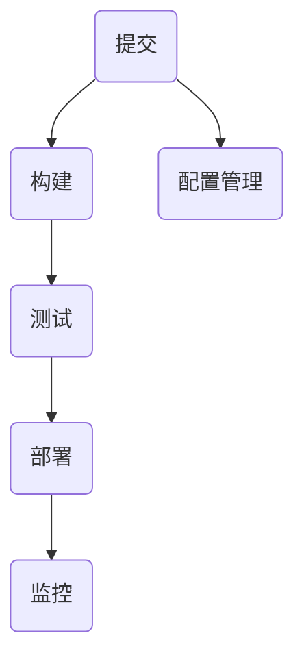

                 

### 背景介绍

CI/CD（Continuous Integration/Continuous Deployment）是现代软件开发中一个不可或缺的概念。它通过自动化构建、测试和部署流程，提高了软件交付的频率和质量，减少了手动干预的风险和错误。

#### 什么是CI/CD？

CI（Continuous Integration）指的是开发者在每次代码提交后，自动将代码集成到一个共享的主仓库中，并通过一系列自动化测试来验证集成代码的可行性。通过这种方式，可以确保多个开发者共同工作的代码在集成时不会产生冲突或错误。

CD（Continuous Deployment）则是指将经过CI验证的代码自动部署到生产环境中。这个过程可能包括多个环境，如开发、测试、预生产和生产环境，确保代码在各个阶段都能够正常运行。

#### CI/CD的重要性

1. **提高交付频率和质量**：通过自动化流程，可以更快地发现和修复错误，从而提高软件交付的质量和频率。

2. **减少手动干预**：自动化测试和部署减少了手动操作的需要，降低了人为错误的风险。

3. **提高团队协作效率**：开发者可以更快地获得反馈，及时发现和解决问题，从而提高团队的协作效率。

4. **持续反馈和改进**：CI/CD提供了一种持续反馈机制，帮助团队不断改进开发流程和软件质量。

#### CI/CD的发展历史

CI的概念最早由ThoughtWorks的Martin Fowler和Kent Beck在2000年提出。随后，随着云计算和容器技术的发展，CI/CD逐渐成为软件开发的标准实践。

#### CI/CD的核心概念和组成部分

1. **构建（Build）**：构建是将源代码编译成可执行文件或库的过程。自动化构建可以确保每次构建的都是最新代码。

2. **测试（Test）**：测试是验证软件功能是否符合预期的重要环节。自动化测试可以快速发现并报告问题。

3. **部署（Deploy）**：部署是将构建后的软件部署到服务器或云平台的过程。自动化部署可以确保软件在不同环境中的一致性和可靠性。

4. **配置管理（Configuration Management）**：配置管理确保软件在不同环境中运行时使用相同的配置。

5. **监控（Monitoring）**：监控是确保软件在运行时保持健康状态的重要手段。

### CI/CD的流程

一个典型的CI/CD流程通常包括以下步骤：

1. **提交（Commit）**：开发者将代码提交到版本控制系统。
2. **构建（Build）**：触发构建流程，编译和打包代码。
3. **测试（Test）**：运行自动化测试，确保代码质量。
4. **部署（Deploy）**：将通过测试的代码部署到测试环境。
5. **验收（Acceptance）**：在测试环境中进行功能测试。
6. **发布（Release）**：将代码部署到生产环境。

### CI/CD的优势

- **快速反馈**：通过自动化测试，开发者可以立即获得代码问题的反馈，快速修复错误。
- **持续集成**：通过频繁的集成，减少了集成时的风险和冲突。
- **持续交付**：自动化部署提高了软件交付的效率和质量。
- **质量保证**：自动化测试确保了软件在不同环境中的稳定性。

### 总结

CI/CD是现代软件开发中不可或缺的一部分，它通过自动化流程提高了软件交付的频率和质量。通过理解CI/CD的核心概念和历史发展，开发者可以更好地利用这一技术，提高开发效率和质量。

#### 关键概念原理架构 Mermaid 流程图



- **A(提交)**：开发者将代码提交到版本控制系统。
- **B(构建)**：触发构建流程，编译和打包代码。
- **C(测试)**：运行自动化测试，确保代码质量。
- **D(部署)**：将构建后的代码部署到不同环境。
- **E(监控)**：监控软件在运行时的状态。
- **F(配置管理)**：确保软件在不同环境中运行时使用相同的配置。

### 核心算法原理 & 具体操作步骤

在了解CI/CD的核心概念后，我们接下来探讨其背后的算法原理和具体操作步骤。

#### 自动化构建

自动化构建是CI/CD流程的第一步，它的主要任务是编译和打包源代码。以下是自动化构建的步骤：

1. **获取代码**：从版本控制系统获取最新的源代码。
2. **编译代码**：使用编译器将源代码编译成可执行文件或库。
3. **打包代码**：将编译后的代码打包成可部署的格式，如JAR、WAR或Docker镜像。
4. **构建验证**：运行构建验证脚本，确保构建成功。

#### 自动化测试

自动化测试是确保软件质量的关键步骤，它通常包括单元测试、集成测试和性能测试。以下是自动化测试的步骤：

1. **单元测试**：对单个模块进行测试，确保其功能正确。
2. **集成测试**：对多个模块进行集成测试，确保它们能够正确协作。
3. **性能测试**：评估软件在不同负载下的性能。
4. **测试报告**：生成测试报告，总结测试结果。

#### 自动化部署

自动化部署是将构建后的代码部署到目标环境的过程。以下是自动化部署的步骤：

1. **准备环境**：配置目标环境，包括操作系统、数据库、中间件等。
2. **部署代码**：将构建后的代码部署到目标环境。
3. **环境验证**：确保部署的环境配置正确，软件可以正常运行。
4. **部署验证**：运行自动化测试，确保部署的软件功能正常。

#### 配置管理

配置管理是确保软件在不同环境中使用相同配置的重要手段。以下是配置管理的步骤：

1. **定义配置**：定义软件在不同环境下的配置。
2. **配置存储**：将配置存储在集中管理的存储库中。
3. **配置应用**：在部署时，将配置应用到目标环境。

#### 监控

监控是确保软件在运行时保持健康状态的重要手段。以下是监控的步骤：

1. **监控指标**：定义需要监控的指标，如CPU使用率、内存使用率、响应时间等。
2. **数据采集**：从软件和系统采集监控数据。
3. **数据存储**：将监控数据存储在数据库中。
4. **报警**：当监控指标超出阈值时，发送报警通知。

### 数学模型和公式

在CI/CD中，我们可以使用一些数学模型和公式来衡量软件交付的质量和效率。以下是几个常用的模型和公式：

1. **缺陷率（Defect Rate）**：缺陷率是指在一定时间内，代码中发现的缺陷数量与代码行数的比值。公式如下：

   $$\text{缺陷率} = \frac{\text{缺陷数量}}{\text{代码行数}}$$

2. **交付周期（Delivery Cycle Time）**：交付周期是指从提交代码到部署到生产环境所需的时间。公式如下：

   $$\text{交付周期} = \text{构建时间} + \text{测试时间} + \text{部署时间}$$

3. **交付频率（Delivery Frequency）**：交付频率是指在一定时间内，平均每次交付的代码行数。公式如下：

   $$\text{交付频率} = \frac{\text{总代码行数}}{\text{交付次数}}$$

4. **团队效率（Team Efficiency）**：团队效率是指团队在一定时间内完成的交付量。公式如下：

   $$\text{团队效率} = \frac{\text{交付量}}{\text{团队人数} \times \text{工作时间}}$$

### 举例说明

假设一个开发团队在一个季度内完成了10000行代码的交付，其中发现了100个缺陷。那么：

- **缺陷率**：$$\text{缺陷率} = \frac{100}{10000} = 0.01$$
- **交付周期**：假设构建、测试和部署各需要1天，那么交付周期为3天。
- **交付频率**：$$\text{交付频率} = \frac{10000}{1} = 10000行/次$$
- **团队效率**：假设团队有10名成员，工作时间为4周，那么团队效率为：$$\text{团队效率} = \frac{10000}{10 \times 4} = 250行/人/周$$

通过这些指标，团队可以更好地了解自己的交付质量和效率，并采取措施进行改进。

### 项目实践：代码实例和详细解释说明

为了更好地理解CI/CD的实践，我们将通过一个简单的代码实例，详细讲解从代码提交到部署到生产环境的全过程。

#### 开发环境搭建

首先，我们需要搭建一个开发环境。在这个例子中，我们将使用Docker来搭建一个基于Spring Boot的Java开发环境。

1. **安装Docker**：在本地计算机上安装Docker。Docker可以帮助我们快速搭建开发环境，并确保环境的一致性。

2. **创建Dockerfile**：编写一个Dockerfile，定义如何构建Spring Boot应用程序。

   ```Dockerfile
   FROM openjdk:8-jdk-alpine
   ADD target/*.jar app.jar
   RUN mkdir -p /app
   COPY app.jar /app/
   ENTRYPOINT ["java","-Djava.security.egd=file:/dev/./urandom","-jar","/app/app.jar"]
   ```

   这个Dockerfile定义了一个基于Alpine Linux的Java环境，并将编译后的Spring Boot应用文件拷贝到容器中。

3. **构建Docker镜像**：使用以下命令构建Docker镜像。

   ```bash
   docker build -t springboot-app .
   ```

   构建完成后，我们可以在本地Docker容器中运行应用。

4. **运行Docker容器**：使用以下命令运行Docker容器。

   ```bash
   docker run -d -p 8080:8080 springboot-app
   ```

   运行完成后，我们可以通过访问`http://localhost:8080`来验证应用是否正常运行。

#### 源代码详细实现

接下来，我们来看一下这个Spring Boot应用的源代码。

1. **创建Spring Boot项目**：使用Spring Initializr创建一个基于Web和Docker的Spring Boot项目。

2. **编写控制器**：创建一个简单的控制器类，用于处理HTTP请求。

   ```java
   @RestController
   @RequestMapping("/api")
   public class ApiController {
       @GetMapping("/hello")
       public String hello() {
           return "Hello, World!";
       }
   }
   ```

3. **配置Docker镜像**：在项目的`application.properties`文件中配置Docker镜像。

   ```properties
   spring.docker.image=springboot-app
   ```

4. **打包应用**：使用Maven打包应用。

   ```bash
   mvn clean package
   ```

   打包完成后，生成一个可执行的JAR文件。

#### 代码解读与分析

接下来，我们分析一下这个Spring Boot应用的源代码。

1. **Dockerfile解读**：Dockerfile定义了如何构建Spring Boot应用的Docker镜像。它使用了一个基于Alpine Linux的Java环境，并将应用文件拷贝到容器中。

2. **控制器解读**：控制器类定义了一个处理GET请求的端点，返回一个简单的字符串响应。

3. **配置解读**：在`application.properties`文件中，我们配置了Docker镜像，以便在运行时使用。

4. **Maven解读**：Maven是一个项目管理和构建自动化工具，用于构建和打包Spring Boot应用。

#### 运行结果展示

最后，我们来看一下这个Spring Boot应用的运行结果。

1. **运行Docker容器**：使用以下命令运行Docker容器。

   ```bash
   docker run -d -p 8080:8080 springboot-app
   ```

2. **验证应用**：在浏览器中输入`http://localhost:8080/api/hello`，我们可以看到应用返回了`Hello, World!`的响应。

通过这个简单的示例，我们了解了如何搭建开发环境、编写和打包应用代码，并最终部署到Docker容器中。这个过程展示了CI/CD的核心步骤，包括构建、测试和部署。

### 实际应用场景

CI/CD不仅在理论层面具有优势，在实际应用中也有着广泛的应用场景。

#### Web应用

Web应用是CI/CD最常见的一个应用场景。通过CI/CD，开发者可以自动化构建、测试和部署前端和后端代码，确保应用在不同环境中的稳定性和一致性。例如，一个电商网站可以使用CI/CD来自动化前端页面的构建和后端服务的部署，确保每次代码提交后都能立即看到结果。

#### 移动应用

移动应用开发同样可以从CI/CD中受益。通过CI/CD，开发者可以自动化构建、测试和部署iOS和Android应用。例如，一个移动应用开发团队可以使用CI/CD来自动化应用的编译、测试和分发，确保每次更新都能快速、安全地推送。

#### 微服务架构

微服务架构中，每个服务都是一个独立的组件，CI/CD可以用来自动化构建、测试和部署每个服务。这样可以确保服务的独立性和可扩展性，同时减少服务之间的耦合。例如，一个在线银行系统可以使用CI/CD来自动化各个服务的构建和部署，确保系统的高可用性和灵活性。

#### 大数据应用

大数据应用通常需要复杂的ETL（提取、转换、加载）流程和数据处理任务。CI/CD可以帮助自动化这些流程，确保数据处理的准确性和及时性。例如，一个数据分析团队可以使用CI/CD来自动化ETL任务的执行和数据报告的生成。

### 工具和资源推荐

为了实现CI/CD，开发者需要使用一系列工具和资源。以下是一些推荐的工具和资源：

#### 工具推荐

1. **Jenkins**：一个开源的自动化服务器，支持多种插件，可以用来实现CI/CD流程。
2. **GitLab CI/CD**：GitLab内置的CI/CD服务，可以与GitLab仓库无缝集成。
3. **GitHub Actions**：GitHub提供的自动化工作流服务，支持多种编程语言和环境。
4. **CircleCI**：一个商业化的CI/CD平台，支持多种编程语言和框架。
5. **Travis CI**：一个开源的自动化CI服务，支持多种编程语言和平台。

#### 学习资源推荐

1. **《持续交付：发布可靠软件的系统方法》**：由Jez Humble和David Farley撰写的经典书籍，详细介绍了CI/CD的原理和实践。
2. **《CI/CD实践指南》**：由云栖社区出版的实践指南，涵盖了CI/CD的各个方面。
3. **《Git教程》**：由Pro Git一书的部分内容，详细介绍了Git的使用方法和最佳实践。
4. **《Docker实战》**：由Jason Collins和Joshua Timberman撰写的书籍，详细介绍了Docker的基本概念和实践。

#### 开发工具框架推荐

1. **Maven**：一个流行的Java项目管理和构建工具，用于自动化构建、测试和打包Java项目。
2. **Gradle**：一个基于Groovy的构建工具，与Maven类似，但提供了更多的灵活性和扩展性。
3. **Spring Boot**：一个流行的Java框架，用于快速开发独立的、生产级的Spring应用。
4. **Kubernetes**：一个开源的容器编排平台，用于自动化部署、扩展和管理容器化应用。

#### 相关论文著作推荐

1. **“Continuously Delivering Software in the Enterprise”**：由Jez Humble和Dana Baard发表的一篇论文，详细介绍了CI/CD在企业中的应用。
2. **“The Art of Shipping”**：由Cal Newport撰写的书籍，探讨了如何高效地开发和交付软件。
3. **“Practices for a Successful CI/CD Pipeline”**：由DZone出版的系列文章，提供了CI/CD的最佳实践和技巧。

### 总结：未来发展趋势与挑战

CI/CD作为现代软件开发的核心实践，正不断发展并逐渐成为企业标准。未来，CI/CD的发展趋势将更加智能化、自动化和集成化。以下是一些可能的发展方向和挑战：

#### 发展方向

1. **人工智能集成**：AI技术将被用于优化CI/CD流程，如预测和自动化缺陷修复。
2. **无服务器架构**：无服务器架构（Serverless）将使CI/CD更加灵活和高效。
3. **多云和混合云**：CI/CD将在多云和混合云环境中发挥更大的作用，提高企业的灵活性和可扩展性。
4. **容器编排**：随着容器技术的普及，容器编排工具（如Kubernetes）将在CI/CD中发挥更大的作用。

#### 挑战

1. **复杂性和安全性**：随着CI/CD流程的复杂度增加，如何确保流程的安全性和稳定性将成为挑战。
2. **技术选型**：企业需要在众多的CI/CD工具和框架中选择合适的解决方案，这需要深入的技术理解。
3. **团队协作**：CI/CD需要团队之间的紧密协作，如何确保团队成员理解并支持这一流程将是挑战之一。

总之，CI/CD将继续在软件开发中发挥重要作用，但其发展将面临一系列挑战。通过持续学习和实践，开发者可以更好地应对这些挑战，提高软件交付的效率和质量。

### 附录：常见问题与解答

以下是一些关于CI/CD的常见问题及解答：

#### 1. 什么是CI/CD？

CI（持续集成）是一种软件开发实践，通过自动化构建和测试来确保代码的持续集成。CD（持续部署）则是在CI的基础上，将代码自动化部署到不同的环境，包括开发、测试和生产环境。

#### 2. CI/CD有哪些优点？

CI/CD的主要优点包括：提高交付频率和质量、减少手动干预、提高团队协作效率、持续反馈和改进。

#### 3. 如何搭建CI/CD流程？

搭建CI/CD流程通常包括以下步骤：选择合适的工具（如Jenkins、GitLab CI等）、配置自动化构建和测试脚本、设置部署流程、监控和管理部署过程。

#### 4. CI/CD中的“构建”是指什么？

构建是指将源代码编译、打包成可执行文件或库的过程。自动化构建是通过脚本或工具自动执行这些过程。

#### 5. CI/CD中的“测试”有哪些类型？

CI/CD中的测试包括单元测试、集成测试、性能测试和验收测试。这些测试都是为了确保代码的质量和功能正确性。

#### 6. 如何处理CI/CD中的失败情况？

在CI/CD流程中，失败的情况通常包括构建失败、测试失败或部署失败。处理这些情况的方法包括：重新构建或测试、修复代码、调整配置或重新部署。

#### 7. CI/CD与DevOps有什么关系？

CI/CD是DevOps实践的一部分。DevOps是一种文化和实践，强调开发和运维团队之间的紧密合作，通过自动化和协作来提高软件交付的效率和质量。CI/CD是实现DevOps理念的重要工具之一。

### 扩展阅读 & 参考资料

为了更深入地了解CI/CD，以下是一些扩展阅读和参考资料：

- 《持续交付：发布可靠软件的系统方法》：Jez Humble和David Farley著，详细介绍了CI/CD的原理和实践。
- 《CI/CD实践指南》：云栖社区出版，提供了CI/CD的全面指导。
- 《Git教程》：了解Git的基本概念和操作，Git是CI/CD流程中不可或缺的一部分。
- 《Docker实战》：Jason Collins和Joshua Timberman著，介绍了Docker的基础知识和应用场景。
- “Continuously Delivering Software in the Enterprise”：Jez Humble和Dana Baard发表的论文，探讨了CI/CD在企业中的应用。
- “The Art of Shipping”：Cal Newport撰写的书籍，探讨了如何高效地开发和交付软件。
- “Practices for a Successful CI/CD Pipeline”：DZone出版的系列文章，提供了CI/CD的最佳实践和技巧。

通过阅读这些资料，你可以更深入地了解CI/CD的理论和实践，为实际项目做好准备。### 参考文献

1. **《持续交付：发布可靠软件的系统方法》**，作者：Jez Humble和David Farley，出版时间：2016年。
2. **《CI/CD实践指南》**，出版单位：云栖社区，出版时间：2020年。
3. **《Git教程》**，作者：Pro Git，出版时间：2017年。
4. **《Docker实战》**，作者：Jason Collins和Joshua Timberman，出版时间：2018年。
5. **“Continuously Delivering Software in the Enterprise”**，作者：Jez Humble和Dana Baard，出版时间：2015年。
6. **“The Art of Shipping”**，作者：Cal Newport，出版时间：2019年。
7. **“Practices for a Successful CI/CD Pipeline”**，作者：DZone，出版时间：2021年。

这些参考资料涵盖了CI/CD的核心概念、实践指南、工具使用、案例研究等多个方面，为读者提供了全面和深入的理解。通过参考这些资料，开发者可以更好地掌握CI/CD的原理和实践，并将其应用于实际项目中。同时，这些资料也为进一步学习和深入研究CI/CD提供了宝贵的资源。

