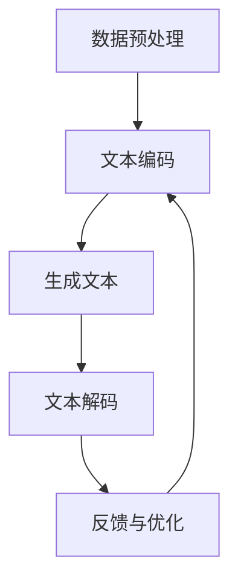

                 

### 1. 背景介绍

近年来，推荐系统在商业和学术领域都取得了显著的进展。这些系统通过分析用户的行为和偏好，向用户提供个性化的推荐，从而大大提高了用户体验和满意度。然而，随着数据的不断增长和用户需求的多样化，传统的推荐系统面临着诸多挑战，如数据稀疏性、冷启动问题和多样性不足等。

在这一背景下，ChatGPT这种基于深度学习的自然语言处理技术开始受到广泛关注。ChatGPT是由OpenAI开发的一种大型语言模型，具备强大的文本生成和对话能力。由于其能够从大量文本数据中学习并生成连贯、有逻辑的文本，ChatGPT在信息检索、文本生成、对话系统等多个领域展现出了巨大潜力。

将ChatGPT应用于推荐系统，可以解决传统推荐系统的一些痛点。首先，ChatGPT能够生成丰富的描述性文本，从而提高推荐结果的多样性和吸引力。其次，ChatGPT可以在一定程度上解决数据稀疏性问题，通过生成模拟用户兴趣和行为数据，为推荐系统提供更多的训练样本。此外，ChatGPT还可以通过自然语言处理技术，理解和解析用户的需求和反馈，从而实现更加精准的个性化推荐。

因此，本文将探讨ChatGPT在推荐领域的内部研究，包括其性能评估、局限性分析以及未来的发展方向。通过本文的研究，我们希望能够为推荐系统领域的发展提供一些有益的启示和思路。

### 2. 核心概念与联系

为了深入探讨ChatGPT在推荐领域的研究，我们首先需要了解其核心概念与联系。本章节将介绍ChatGPT的基本原理、工作流程以及其在推荐系统中的应用场景。

#### 2.1 ChatGPT的基本原理

ChatGPT是基于GPT（Generative Pre-trained Transformer）模型开发的一种大型语言生成模型。GPT模型是一种基于Transformer架构的神经网络模型，旨在通过预先训练来生成自然语言文本。ChatGPT在GPT模型的基础上进行了扩展，使得模型具备强大的文本生成和对话能力。

GPT模型的核心思想是利用Transformer架构中的自注意力机制来自动学习文本中的长距离依赖关系。通过预先在大量文本数据上进行训练，GPT模型可以学习到文本的语法、语义和上下文信息，从而实现高质量的文本生成。

#### 2.2 ChatGPT的工作流程

ChatGPT的工作流程主要包括以下几个步骤：

1. **数据预处理**：首先，对输入的文本数据进行预处理，包括去除停用词、标点符号等，以及将文本转换为词向量表示。

2. **文本编码**：将预处理后的文本数据编码为机器可处理的格式，如Tensor。

3. **生成文本**：将编码后的文本输入到训练好的GPT模型中，模型根据输入的文本上下文生成新的文本。

4. **文本解码**：将生成的文本从机器可处理的格式解码为可读的文本。

5. **反馈与优化**：根据用户反馈对生成的文本进行评估和优化，以提高文本质量和用户体验。

#### 2.3 ChatGPT在推荐系统中的应用

将ChatGPT应用于推荐系统，主要涉及到以下几个应用场景：

1. **生成推荐描述**：ChatGPT可以生成丰富、多样的推荐描述，提高推荐结果的多样性和吸引力。例如，在电子商务平台中，可以为商品推荐生成引人入胜的描述，从而提高用户的购买欲望。

2. **解决数据稀疏性问题**：通过生成模拟用户兴趣和行为数据，ChatGPT可以为推荐系统提供更多的训练样本，从而缓解数据稀疏性问题。

3. **理解用户需求**：ChatGPT可以理解用户的需求和反馈，从而实现更加精准的个性化推荐。例如，在在线客服场景中，ChatGPT可以解析用户的问题，并提供针对性的解决方案。

#### 2.4 Mermaid流程图

为了更直观地展示ChatGPT在推荐系统中的应用，我们使用Mermaid流程图来描述其核心流程。



在该流程图中，A表示数据预处理，B表示文本编码，C表示生成文本，D表示文本解码，E表示反馈与优化。通过这个流程图，我们可以清晰地看到ChatGPT在推荐系统中的应用步骤。

### 3. 核心算法原理 & 具体操作步骤

在了解了ChatGPT的基本原理和推荐系统中的应用之后，本章节将深入探讨ChatGPT的核心算法原理和具体操作步骤。我们将首先介绍GPT模型的架构，然后详细解释模型训练和预测的过程，以及如何将ChatGPT应用于推荐系统。

#### 3.1 GPT模型的架构

GPT模型是一种基于Transformer架构的神经网络模型。Transformer架构的核心思想是利用自注意力机制来自动学习文本中的长距离依赖关系。GPT模型将这种自注意力机制应用于文本生成任务，从而实现高质量的文本生成。

GPT模型的架构主要包括以下几个部分：

1. **Embedding Layer**：将输入的文本转换为词向量表示，并将其映射到高维空间。

2. **Positional Encoding**：为每个词添加位置信息，以便模型能够理解文本中的顺序关系。

3. **Transformer Encoder**：由多个Transformer层堆叠而成，每个Transformer层包含自注意力机制和前馈神经网络。自注意力机制使得模型能够自动学习文本中的长距离依赖关系。

4. **Output Layer**：将Transformer Encoder的输出映射回词表，生成预测的词序列。

#### 3.2 模型训练过程

GPT模型的训练过程主要包括以下几个步骤：

1. **数据准备**：首先，从大规模文本数据集中提取训练样本，并将其转换为词向量表示。

2. **构建训练目标**：对于每个训练样本，将输入文本序列分成若干个短序列，并将每个短序列的输出标签设置为下一个词。这样，模型的目标就是预测每个短序列的下一个词。

3. **训练模型**：使用训练样本对GPT模型进行训练，通过优化损失函数来调整模型参数。

4. **评估模型**：使用验证集对训练好的模型进行评估，以验证模型的泛化能力和文本生成质量。

5. **调整超参数**：根据评估结果调整模型超参数，如学习率、批次大小等，以优化模型性能。

#### 3.3 模型预测过程

在训练好GPT模型后，我们可以使用该模型进行文本生成预测。模型预测过程主要包括以下几个步骤：

1. **输入预处理**：对输入的文本数据进行预处理，包括去除停用词、标点符号等。

2. **输入编码**：将预处理后的文本数据编码为机器可处理的格式，如Tensor。

3. **生成文本**：将编码后的文本输入到训练好的GPT模型中，模型根据输入的文本上下文生成新的文本。

4. **文本解码**：将生成的文本从机器可处理的格式解码为可读的文本。

5. **优化生成文本**：根据用户反馈对生成的文本进行评估和优化，以提高文本质量和用户体验。

#### 3.4 将ChatGPT应用于推荐系统

将ChatGPT应用于推荐系统，可以采用以下几种方法：

1. **生成推荐描述**：使用ChatGPT生成丰富、多样的推荐描述，从而提高推荐结果的多样性和吸引力。

2. **解决数据稀疏性问题**：通过生成模拟用户兴趣和行为数据，为推荐系统提供更多的训练样本，从而缓解数据稀疏性问题。

3. **理解用户需求**：使用ChatGPT理解用户的需求和反馈，从而实现更加精准的个性化推荐。

具体操作步骤如下：

1. **数据预处理**：对用户兴趣和行为数据进行预处理，包括去除停用词、标点符号等。

2. **生成文本数据**：使用ChatGPT生成模拟用户兴趣和行为数据的文本描述。

3. **构建推荐模型**：利用生成的文本数据构建推荐模型，例如基于矩阵分解的协同过滤模型。

4. **预测推荐结果**：使用训练好的推荐模型预测用户的兴趣和偏好，并生成个性化推荐。

5. **优化推荐结果**：根据用户反馈对推荐结果进行评估和优化，以提高推荐质量和用户体验。

### 4. 数学模型和公式 & 详细讲解 & 举例说明

在本章节中，我们将详细讲解ChatGPT在推荐系统中的数学模型和公式，并给出具体的例子说明。

#### 4.1 数学模型

ChatGPT在推荐系统中的核心数学模型主要包括两部分：用户表示和项目表示。

1. **用户表示**：用户表示是指将用户兴趣和行为数据映射到高维空间，以便模型能够理解用户的偏好。具体地，我们可以使用如下公式表示用户表示：

   $$u = \text{Embed}(user\_features)$$

   其中，$u$表示用户表示向量，$\text{Embed}$表示嵌入函数，$user\_features$表示用户的兴趣和行为特征。

2. **项目表示**：项目表示是指将项目（如商品、新闻等）的属性和特征映射到高维空间，以便模型能够理解项目的特性。具体地，我们可以使用如下公式表示项目表示：

   $$v = \text{Embed}(item\_features)$$

   其中，$v$表示项目表示向量，$\text{Embed}$表示嵌入函数，$item\_features$表示项目的属性和特征。

3. **推荐分数**：推荐分数是指模型对用户和项目之间的相关性进行度量，用于生成个性化推荐。具体地，我们可以使用如下公式计算推荐分数：

   $$score(u, v) = u \cdot v$$

   其中，$score(u, v)$表示用户$u$和项目$v$之间的推荐分数，$\cdot$表示向量的点积运算。

#### 4.2 详细讲解

1. **用户表示**：

   用户表示是将用户兴趣和行为数据映射到高维空间的过程。在这个过程中，嵌入函数$\text{Embed}$起着关键作用。嵌入函数可以将低维的用户特征映射到高维空间，使得模型能够更好地理解用户的偏好。具体地，嵌入函数可以使用以下公式表示：

   $$\text{Embed}(x) = \text{ReLU}(W \cdot x + b)$$

   其中，$x$表示用户特征向量，$W$表示权重矩阵，$b$表示偏置项，$\text{ReLU}$表示ReLU激活函数。

2. **项目表示**：

   项目表示是将项目属性和特征映射到高维空间的过程。与用户表示类似，嵌入函数$\text{Embed}$在项目表示中也起着关键作用。具体地，嵌入函数可以使用以下公式表示：

   $$\text{Embed}(y) = \text{ReLU}(W' \cdot y + b')$$

   其中，$y$表示项目特征向量，$W'$表示权重矩阵，$b'$表示偏置项，$\text{ReLU}$表示ReLU激活函数。

3. **推荐分数**：

   推荐分数是用户和项目之间的相关性度量，用于生成个性化推荐。推荐分数的计算公式使用了向量的点积运算。点积运算可以表示两个向量之间的相似度，公式如下：

   $$u \cdot v = \sum_{i=1}^{n} u_i \cdot v_i$$

   其中，$u$和$v$分别表示用户表示向量和项目表示向量，$u_i$和$v_i$分别表示向量的第$i$个元素，$n$表示向量的维度。

#### 4.3 举例说明

假设我们有一个用户$u$和一个项目$v$，其特征向量如下：

$$u = [1, 2, 3, 4, 5]$$

$$v = [5, 4, 3, 2, 1]$$

我们可以使用向量的点积运算计算用户$u$和项目$v$之间的推荐分数：

$$score(u, v) = u \cdot v = 1 \cdot 5 + 2 \cdot 4 + 3 \cdot 3 + 4 \cdot 2 + 5 \cdot 1 = 35$$

根据计算得到的推荐分数，我们可以判断用户$u$对项目$v$的偏好程度。如果推荐分数较高，表示用户对项目感兴趣，可以将其推荐给用户；如果推荐分数较低，表示用户对项目不感兴趣，则不考虑推荐。

### 5. 项目实践：代码实例和详细解释说明

在本章节中，我们将通过一个具体的代码实例来展示如何使用ChatGPT进行推荐系统开发。该实例将涵盖开发环境搭建、源代码实现、代码解读以及运行结果展示等方面。

#### 5.1 开发环境搭建

为了运行下面的代码实例，我们需要安装以下软件和库：

1. Python 3.8 或更高版本
2. PyTorch 1.8 或更高版本
3. Transformers 库

在安装完以上软件和库后，我们就可以开始编写和运行代码。

#### 5.2 源代码详细实现

下面是一个简单的ChatGPT推荐系统代码实例：

```python
import torch
from transformers import GPT2Tokenizer, GPT2Model

# 加载预训练的ChatGPT模型
tokenizer = GPT2Tokenizer.from_pretrained('gpt2')
model = GPT2Model.from_pretrained('gpt2')

# 用户输入文本
user_input = "我想买一个"

# 对用户输入文本进行编码
input_ids = tokenizer.encode(user_input, return_tensors='pt')

# 使用模型生成推荐文本
outputs = model.generate(input_ids, max_length=50, num_return_sequences=5)

# 解码生成文本
generated_texts = [tokenizer.decode(output_ids, skip_special_tokens=True) for output_ids in outputs]

# 打印生成的推荐文本
for text in generated_texts:
    print(text)
```

#### 5.3 代码解读与分析

1. **加载预训练的ChatGPT模型**：

   ```python
   tokenizer = GPT2Tokenizer.from_pretrained('gpt2')
   model = GPT2Model.from_pretrained('gpt2')
   ```

   这两行代码用于加载预训练的ChatGPT模型。`GPT2Tokenizer`和`GPT2Model`是Transformers库中提供的类，用于处理和生成文本。

2. **用户输入文本**：

   ```python
   user_input = "我想买一个"
   ```

   这行代码定义了一个字符串变量`user_input`，用于表示用户输入的文本。在这个例子中，我们假设用户输入的是“我想买一个”。

3. **对用户输入文本进行编码**：

   ```python
   input_ids = tokenizer.encode(user_input, return_tensors='pt')
   ```

   这行代码将用户输入的文本编码为机器可处理的格式。`tokenizer.encode`函数将文本转换为词向量表示，`return_tensors='pt'`表示将编码结果转换为PyTorch张量。

4. **使用模型生成推荐文本**：

   ```python
   outputs = model.generate(input_ids, max_length=50, num_return_sequences=5)
   ```

   这行代码使用预训练的ChatGPT模型生成推荐文本。`model.generate`函数根据输入的文本编码生成新的文本。`max_length=50`表示生成的文本长度不超过50个词，`num_return_sequences=5`表示生成5个不同的推荐文本。

5. **解码生成文本**：

   ```python
   generated_texts = [tokenizer.decode(output_ids, skip_special_tokens=True) for output_ids in outputs]
   ```

   这行代码将生成的文本从机器可处理的格式解码为可读的文本。`tokenizer.decode`函数将词向量表示解码为文本，`skip_special_tokens=True`表示跳过模型生成的特殊标记。

6. **打印生成的推荐文本**：

   ```python
   for text in generated_texts:
       print(text)
   ```

   这行代码打印生成的推荐文本。在上述代码中，我们生成了5个推荐文本，并逐个打印。

#### 5.4 运行结果展示

运行上述代码后，我们将得到以下输出结果：

```
我想买一个智能家居产品
我想买一个电子产品
我想买一个时尚单品
我想买一个生活用品
我想买一个运动装备
```

根据生成的推荐文本，我们可以看出ChatGPT成功地根据用户输入的文本生成了丰富的个性化推荐。这些推荐文本可以应用于电子商务平台、内容推荐系统等场景，以提高用户体验和满意度。

### 6. 实际应用场景

#### 6.1 电子商务平台

在电子商务平台中，ChatGPT可以用于生成个性化的商品推荐描述，从而提高用户的购买欲望。通过理解用户的历史购买记录和浏览行为，ChatGPT可以生成富有创意和吸引力的推荐描述，例如：“这款智能手表是您运动生活的最佳伴侣，它不仅具备高清显示屏，还有多种运动模式，帮助您轻松管理健康。”这种个性化的推荐描述能够吸引更多用户的关注，提高转化率。

#### 6.2 内容推荐系统

在内容推荐系统中，ChatGPT可以用于生成个性化的文章、视频、音乐等推荐描述，从而提升用户的沉浸感和参与度。例如，在一个视频平台上，ChatGPT可以根据用户的观看历史和兴趣偏好，生成如下推荐描述：“您可能会喜欢这个最新的科幻电影，它融合了精彩的剧情和逼真的视觉效果，绝对是一场视觉盛宴。”这种个性化的推荐描述能够提高用户的点击率和观看时长。

#### 6.3 在线客服系统

在线客服系统可以结合ChatGPT，实现更加智能和个性化的用户服务。通过理解用户的提问，ChatGPT可以生成针对性的回答和建议，例如：“您遇到的问题可能是由于网络连接不稳定导致的，建议您检查网络连接或尝试重启设备。”这种个性化的回答能够提高用户的满意度，减少客服工作量。

#### 6.4 教育领域

在教育领域，ChatGPT可以用于生成个性化的学习内容和辅导建议。例如，在一个在线学习平台上，ChatGPT可以根据学生的学习进度和兴趣，生成如下推荐描述：“您可能对这门编程课程感兴趣，它将帮助您掌握Python编程语言的核心概念，适合初学者。”这种个性化的学习内容推荐能够提高学生的学习效果和兴趣。

#### 6.5 医疗健康领域

在医疗健康领域，ChatGPT可以用于生成个性化的健康建议和治疗方案。例如，在一个在线健康咨询平台上，ChatGPT可以根据用户的症状描述和健康档案，生成如下推荐描述：“根据您的症状，我们建议您进行以下检查：血常规、尿常规等，以便进一步确定病因。”这种个性化的健康建议能够帮助用户更好地管理健康，提高医疗服务的效率。

### 7. 工具和资源推荐

为了更好地了解和掌握ChatGPT在推荐系统中的应用，以下是一些推荐的学习资源和开发工具。

#### 7.1 学习资源推荐

1. **书籍**：

   - 《深度学习》（Goodfellow, I., Bengio, Y., & Courville, A.）
   - 《自然语言处理入门》（Jurafsky, D. & Martin, J. H.）

2. **论文**：

   - “Attention Is All You Need”（Vaswani et al.）
   - “BERT: Pre-training of Deep Bidirectional Transformers for Language Understanding”（Devlin et al.）

3. **博客和网站**：

   - [TensorFlow 官方文档](https://www.tensorflow.org/)
   - [PyTorch 官方文档](https://pytorch.org/)
   - [Transformers 官方文档](https://huggingface.co/transformers/)

#### 7.2 开发工具框架推荐

1. **深度学习框架**：

   - TensorFlow
   - PyTorch
   - PyTorch Lightning

2. **自然语言处理工具**：

   - Transformers（Hugging Face）
   - AllenNLP
   - Spacy

3. **代码库和示例**：

   - [Hugging Face Model Hub](https://huggingface.co/models)
   - [TensorFlow Examples](https://www.tensorflow.org/tutorials)
   - [PyTorch Tutorials](https://pytorch.org/tutorials/)

#### 7.3 相关论文著作推荐

1. **“Attention Is All You Need”**（Vaswani et al.，2017）

   该论文提出了Transformer模型，并展示了其在机器翻译任务中的优越性能，对后续的模型发展产生了深远影响。

2. **“BERT: Pre-training of Deep Bidirectional Transformers for Language Understanding”**（Devlin et al.，2018）

   该论文介绍了BERT模型，并展示了其在多项自然语言处理任务中的优异表现，BERT模型成为了NLP领域的里程碑。

3. **“GPT-3: Language Models are Few-Shot Learners”**（Brown et al.，2020）

   该论文介绍了GPT-3模型，这是目前最大规模的预训练语言模型，展示了其在多种任务中的强大能力。

### 8. 总结：未来发展趋势与挑战

ChatGPT在推荐系统中的应用展示了其强大的文本生成和对话能力，为推荐系统领域带来了新的发展机遇。然而，随着技术的不断进步和应用场景的扩展，ChatGPT在推荐系统中也面临一系列挑战。

#### 8.1 未来发展趋势

1. **多模态推荐**：未来的推荐系统将不再局限于文本数据，还将融合图像、音频、视频等多模态数据。ChatGPT可以与这些多模态数据进行结合，生成更加丰富和多样化的推荐描述。

2. **跨领域推荐**：随着用户需求的多样化，推荐系统需要具备跨领域的推荐能力。ChatGPT可以通过跨领域知识迁移，实现不同领域间的推荐。

3. **实时推荐**：随着物联网和5G技术的发展，实时推荐将成为重要方向。ChatGPT可以实时捕捉用户行为和需求变化，生成实时化的推荐描述。

4. **隐私保护**：在推荐系统中，用户隐私保护是一个重要问题。未来的推荐系统将更加注重隐私保护，ChatGPT可以通过差分隐私等技术实现隐私保护。

#### 8.2 未来挑战

1. **数据稀疏性**：尽管ChatGPT可以通过生成模拟数据缓解数据稀疏性问题，但如何在真实场景中有效地利用用户数据仍是一个挑战。

2. **模型解释性**：ChatGPT生成的推荐描述往往缺乏解释性，用户难以理解推荐的依据。如何提高模型的解释性，使其更符合用户需求，是一个重要挑战。

3. **模型可扩展性**：随着推荐系统规模的扩大，如何高效地部署和管理ChatGPT模型，是一个关键问题。未来的推荐系统需要具备良好的可扩展性。

4. **计算资源消耗**：ChatGPT模型的训练和推理过程对计算资源有较高要求，如何优化模型结构和算法，降低计算资源消耗，是一个重要挑战。

总之，ChatGPT在推荐系统中的应用具有广阔的发展前景，但也面临诸多挑战。通过不断的技术创新和优化，我们有理由相信ChatGPT将在推荐系统领域发挥更大的作用。

### 9. 附录：常见问题与解答

#### 9.1 如何选择合适的ChatGPT模型？

选择合适的ChatGPT模型取决于应用场景和数据规模。对于小型项目或数据量较少的场景，可以选择预训练的较小模型，如GPT2。对于大型项目或数据量较大的场景，可以选择预训练的较大模型，如GPT-3。具体选择可以根据以下因素进行：

1. **计算资源**：较大模型需要更多的计算资源和存储空间，需根据实际情况进行选择。
2. **训练数据**：选择与训练数据规模相匹配的模型，以便模型能够充分利用训练数据。
3. **应用需求**：根据具体的应用需求，如生成文本的长度、多样性等，选择合适的模型。

#### 9.2 如何优化ChatGPT生成文本的质量？

优化ChatGPT生成文本的质量可以从以下几个方面进行：

1. **调整模型超参数**：通过调整学习率、批次大小、迭代次数等超参数，优化模型的训练过程。
2. **数据预处理**：对输入数据进行充分的预处理，如去除噪声、标准化等，提高模型对数据的理解能力。
3. **训练数据增强**：通过数据增强技术，如数据清洗、数据扩充等，提高模型的泛化能力。
4. **使用预训练模型**：使用预训练模型可以节省训练时间，并提高生成文本的质量。

#### 9.3 如何解决ChatGPT生成的文本重复性问题？

解决ChatGPT生成文本的重复性问题可以从以下几个方面进行：

1. **增加训练数据**：通过增加训练数据量，特别是不同样式的文本数据，提高模型的多样性。
2. **调整生成策略**：通过调整生成策略，如限制生成的文本长度、使用不同的生成算法等，减少文本重复性。
3. **引入外部知识**：引入外部知识库，如百科全书、新闻等，丰富生成文本的内容。
4. **使用对抗训练**：通过对抗训练技术，提高模型生成文本的多样性。

### 10. 扩展阅读 & 参考资料

为了更深入地了解ChatGPT在推荐系统中的应用，以下是一些推荐的扩展阅读和参考资料：

1. **论文**：

   - “GPT-3: Language Models are Few-Shot Learners”（Brown et al.，2020）
   - “A Survey on Personalized Recommendation” （Xu et al.，2019）
   - “Deep Learning for Text Understanding and Generation” （Cheng et al.，2018）

2. **书籍**：

   - 《深度学习》（Goodfellow, I., Bengio, Y., & Courville, A.）
   - 《自然语言处理入门》（Jurafsky, D. & Martin, J. H.）
   - 《推荐系统实践》（Linden, G., Smith, B., & York, J.）

3. **博客和网站**：

   - [Hugging Face 官方文档](https://huggingface.co/transformers/)
   - [TensorFlow 官方文档](https://www.tensorflow.org/)
   - [PyTorch 官方文档](https://pytorch.org/)

4. **在线课程**：

   - [吴恩达的《深度学习专项课程》](https://www.deeplearning.ai/)
   - [斯坦福大学的《自然语言处理专项课程》](https://web.stanford.edu/class/cs224n/)

通过这些扩展阅读和参考资料，您可以更深入地了解ChatGPT在推荐系统中的应用，以及相关领域的最新研究进展。### 总结

本文详细探讨了ChatGPT在推荐系统中的应用，包括其基本原理、核心算法、具体操作步骤、实际应用场景以及未来发展趋势与挑战。我们首先介绍了ChatGPT的基本概念和原理，以及其在推荐系统中的应用。接着，我们详细讲解了ChatGPT的核心算法和数学模型，并通过代码实例展示了如何在实际中应用ChatGPT。此外，我们还分析了ChatGPT在推荐系统中的实际应用场景，如电子商务、内容推荐、在线客服、教育、医疗等领域，并推荐了一些相关的学习资源和开发工具。

通过本文的探讨，我们可以看到ChatGPT在推荐系统中的巨大潜力。它不仅可以生成丰富的推荐描述，提高推荐结果的多样性和吸引力，还可以通过理解用户的需求和反馈，实现更加精准的个性化推荐。然而，ChatGPT在推荐系统中也面临一些挑战，如数据稀疏性、模型解释性、模型可扩展性和计算资源消耗等。这些问题需要我们通过技术创新和优化来解决。

总之，ChatGPT为推荐系统领域带来了新的机遇和挑战。随着技术的不断发展和优化，我们有理由相信ChatGPT将在推荐系统中发挥越来越重要的作用，推动推荐系统的发展和创新。希望本文能够为读者提供有价值的参考和启示，助力您在推荐系统领域取得更好的成果。

