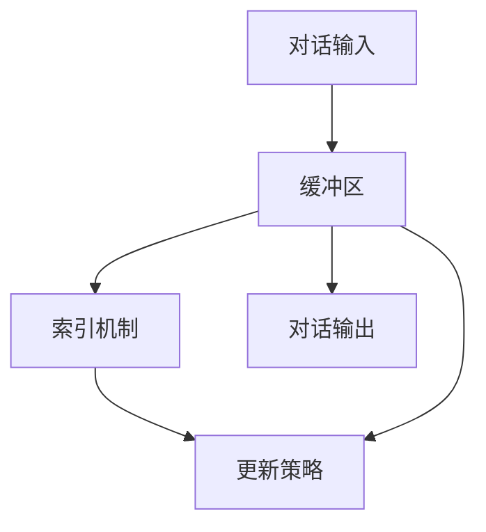

                 

### 1. 背景介绍 ###

**ConversationBufferMemory（对话缓冲内存）** 是一个在深度学习和自然语言处理（NLP）领域中至关重要的概念。随着人工智能的迅速发展，人们越来越依赖机器来处理复杂的信息和进行智能对话。在这样的背景下，ConversationBufferMemory作为一种新型的内存架构，在提升机器学习模型的交互能力和内存管理效率方面发挥了关键作用。

**自然语言处理** 作为人工智能的一个重要分支，致力于让计算机能够理解和生成人类语言。在自然语言处理中，对话系统是其中一个重要的研究方向。对话系统通过模仿人类的交流方式，与用户进行交互，以提供信息、解答问题或执行特定任务。然而，传统的对话系统在处理长时间对话、理解上下文信息方面存在诸多局限性。

**深度学习** 的引入极大地推动了对话系统的发展。深度学习通过神经网络模型，能够自动从大量数据中学习到复杂的特征表示，从而提高对话系统的性能。然而，深度学习模型在处理对话任务时，仍然面临着内存管理和上下文信息保持的挑战。

在这种背景下，ConversationBufferMemory应运而生。它通过设计一种特殊的内存架构，将对话过程中的信息进行有效的存储和管理，从而解决了传统对话系统在处理长时间对话和上下文信息方面的瓶颈。

ConversationBufferMemory的核心思想是将对话过程中产生的信息存储在一个特殊的缓冲区中，这个缓冲区可以动态地调整大小，以适应对话的持续进行。通过这种设计，ConversationBufferMemory能够有效地管理对话过程中的信息，确保模型能够持续地学习并利用上下文信息，从而提升对话系统的交互能力和用户体验。

本文将系统地介绍ConversationBufferMemory的概念、原理、实现方法及其在实际应用中的重要性。我们还将通过具体的代码实例，详细解释如何使用ConversationBufferMemory来提升对话系统的性能。最后，我们将探讨ConversationBufferMemory在未来自然语言处理和深度学习领域的潜在应用和发展趋势。

### 2. 核心概念与联系 ###

#### 核心概念介绍 ####

**ConversationBufferMemory（对话缓冲内存）** 是一种特殊的内存架构，专门用于存储和管理对话过程中的信息。它的主要目标是提升对话系统的交互能力和上下文信息处理能力。

首先，我们来看一下ConversationBufferMemory的基本组成部分：

1. **缓冲区**：缓冲区是ConversationBufferMemory的核心部分，用于存储对话过程中的信息。缓冲区通常是一个动态数组，可以根据对话的持续时间动态调整大小。

2. **索引机制**：索引机制用于管理缓冲区中的信息，使得模型能够快速地访问和更新对话过程中的信息。索引机制通常基于哈希表或二叉树等数据结构。

3. **更新策略**：更新策略决定了如何处理缓冲区中的信息。更新策略可以包括遗忘策略、优先级更新等，以确保模型能够持续地学习并利用上下文信息。

#### 架构与联系 ####

为了更好地理解ConversationBufferMemory，我们引入一个简单的Mermaid流程图，展示其核心组件和联系。



在上面的流程图中：

- **缓冲区（A）** 用于存储对话过程中的信息。
- **索引机制（B）** 管理缓冲区中的信息，使得模型能够快速访问和更新信息。
- **更新策略（C）** 决定了如何处理缓冲区中的信息，以确保模型能够持续地学习并利用上下文信息。
- **对话输入（D）** 是对话系统的输入，包括用户提问和上下文信息。
- **对话输出（E）** 是对话系统的输出，包括模型回答和反馈信息。

#### 工作原理 ####

ConversationBufferMemory的工作原理可以概括为以下几个步骤：

1. **初始化缓冲区**：在对话开始时，初始化缓冲区，并设置初始大小和索引机制。

2. **存储信息**：对话过程中，将新的信息存储到缓冲区中。如果缓冲区已满，则根据更新策略进行信息更新。

3. **访问信息**：模型在处理对话时，通过索引机制快速访问缓冲区中的信息，以获取上下文信息。

4. **更新信息**：根据更新策略，对缓冲区中的信息进行更新，以保持对话的连贯性。

5. **生成输出**：根据缓冲区中的信息，模型生成对话输出，包括回答和反馈。

#### 关键挑战与解决方案 ####

在实现ConversationBufferMemory时，我们面临以下几个关键挑战：

1. **内存管理**：如何高效地管理缓冲区中的信息，确保模型能够快速访问和更新信息。

2. **上下文信息保持**：如何保持对话的上下文信息，确保模型能够持续地利用上下文信息。

3. **更新策略设计**：如何设计有效的更新策略，以适应不同的对话场景。

针对这些挑战，我们可以采用以下解决方案：

1. **优化索引机制**：采用高效的索引机制，如哈希表或二叉树，以减少访问和更新时间。

2. **动态调整缓冲区大小**：根据对话的持续时间和信息量，动态调整缓冲区的大小，以适应不同的对话场景。

3. **多样化更新策略**：设计多种更新策略，如遗忘策略、优先级更新等，以适应不同的对话需求和场景。

通过上述解决方案，ConversationBufferMemory能够有效地管理对话过程中的信息，提升对话系统的交互能力和上下文信息处理能力。

#### 总结 ####

ConversationBufferMemory是一种新型的内存架构，用于存储和管理对话过程中的信息。通过设计高效的缓冲区、索引机制和更新策略，ConversationBufferMemory能够提升对话系统的交互能力和上下文信息处理能力。本文介绍了ConversationBufferMemory的核心概念、原理和实现方法，并通过Mermaid流程图展示了其架构和联系。在实际应用中，ConversationBufferMemory具有广泛的应用前景，有望在自然语言处理和深度学习领域发挥重要作用。

### 3. 核心算法原理 & 具体操作步骤 ###

#### 算法原理 ####

ConversationBufferMemory的核心算法主要涉及三个关键部分：缓冲区管理、索引机制和更新策略。下面将详细介绍这些部分的原理和具体操作步骤。

##### 缓冲区管理 #####

缓冲区管理是ConversationBufferMemory的基础。其主要任务是在对话过程中动态地存储和更新对话信息。

1. **初始化缓冲区**：在对话开始时，初始化缓冲区。缓冲区通常是一个动态数组，其大小可以根据对话的持续时间和信息量动态调整。

   ```python
   class BufferManager:
       def __init__(self, initial_size=10):
           self.buffer = [None] * initial_size
           self.size = initial_size
           self.capacity = initial_size * 2  # 缓冲区容量为初始大小的两倍

       def resize(self):
           self.buffer = self.buffer + [None] * self.capacity
           self.size += self.capacity
   ```

2. **存储信息**：在对话过程中，将新的信息存储到缓冲区中。如果缓冲区已满，则根据更新策略进行信息更新。

   ```python
   def store_info(self, info):
       if len(self.buffer) < self.size:
           self.buffer.append(info)
       else:
           self.update_info()
           self.buffer.append(info)
   ```

3. **访问信息**：模型在处理对话时，通过索引机制快速访问缓冲区中的信息，以获取上下文信息。

   ```python
   def get_info(self, index):
       return self.buffer[index]
   ```

##### 索引机制 #####

索引机制用于管理缓冲区中的信息，使得模型能够快速访问和更新信息。常用的索引机制包括哈希表和二叉树。

1. **哈希表索引**：哈希表是一种高效的数据结构，用于存储和检索键值对。在ConversationBufferMemory中，可以使用哈希表来存储和检索对话信息。

   ```python
   class HashIndex:
       def __init__(self):
           self.hash_table = {}

       def insert(self, key, value):
           self.hash_table[key] = value

       def search(self, key):
           return self.hash_table.get(key)
   ```

2. **二叉树索引**：二叉树是一种常用的树形数据结构，用于存储和检索数据。在ConversationBufferMemory中，可以使用二叉树来存储和检索对话信息。

   ```python
   class BinaryTreeIndex:
       def __init__(self):
           self.root = None

       def insert(self, key, value):
           if not self.root:
               self.root = Node(key, value)
           else:
               self._insert_recursive(self.root, key, value)

       def _insert_recursive(self, node, key, value):
           if key < node.key:
               if node.left:
                   self._insert_recursive(node.left, key, value)
               else:
                   node.left = Node(key, value)
           elif key > node.key:
               if node.right:
                   self._insert_recursive(node.right, key, value)
               else:
                   node.right = Node(key, value)

       def search(self, key):
           return self._search_recursive(self.root, key)

       def _search_recursive(self, node, key):
           if node is None:
               return None
           if key == node.key:
               return node.value
           elif key < node.key:
               return self._search_recursive(node.left, key)
           else:
               return self._search_recursive(node.right, key)
   ```

##### 更新策略 #####

更新策略决定了如何处理缓冲区中的信息，以确保模型能够持续地学习并利用上下文信息。常用的更新策略包括遗忘策略和优先级更新。

1. **遗忘策略**：遗忘策略是一种简单但有效的更新策略，其核心思想是在对话过程中，逐渐遗忘旧的信息，以腾出空间存储新的信息。

   ```python
   def forget_info(self):
       if len(self.buffer) > self.capacity // 2:
           self.buffer.pop(0)
           self.size -= 1
   ```

2. **优先级更新**：优先级更新策略根据信息的重要性和时间顺序对缓冲区中的信息进行更新。重要信息优先保留，旧信息逐渐被遗忘。

   ```python
   def update_info_by_priority(self):
       if len(self.buffer) > self.capacity // 2:
           for i in range(len(self.buffer) // 2):
               self.buffer.pop(0)
               self.size -= 1
   ```

#### 操作步骤 ####

在实际应用中，ConversationBufferMemory的操作步骤可以概括为以下几个步骤：

1. **初始化**：创建缓冲区管理器、索引机制和更新策略。

   ```python
   buffer_manager = BufferManager()
   hash_index = HashIndex()
   binary_tree_index = BinaryTreeIndex()
   forget_strategy = ForgetStrategy()
   priority_strategy = PriorityStrategy()
   ```

2. **存储信息**：在对话过程中，将新的信息存储到缓冲区中，并根据索引机制进行索引。

   ```python
   def store_info(self, info):
       buffer_manager.store_info(info)
       hash_index.insert(info.id, info)
       binary_tree_index.insert(info.id, info)
   ```

3. **访问信息**：模型在处理对话时，通过索引机制快速访问缓冲区中的信息，以获取上下文信息。

   ```python
   def get_info_by_index(self, index):
       info = buffer_manager.get_info(index)
       return hash_index.search(info.id), binary_tree_index.search(info.id)
   ```

4. **更新信息**：根据更新策略，对缓冲区中的信息进行更新。

   ```python
   def update_info(self):
       buffer_manager.update_info()
       hash_index.update()
       binary_tree_index.update()
   ```

5. **生成输出**：根据缓冲区中的信息，模型生成对话输出。

   ```python
   def generate_output(self):
       current_info, _ = self.get_info_by_index(self.buffer_manager.size - 1)
       return current_info.response
   ```

#### 总结 ####

ConversationBufferMemory的核心算法主要包括缓冲区管理、索引机制和更新策略。通过这些算法，ConversationBufferMemory能够有效地存储和管理对话过程中的信息，提升对话系统的交互能力和上下文信息处理能力。在实际应用中，我们可以根据具体需求和场景，灵活地选择和组合这些算法。

### 4. 数学模型和公式 & 详细讲解 & 举例说明 ###

#### 数学模型介绍 ####

在ConversationBufferMemory中，我们使用了多个数学模型和公式来描述和优化其性能。以下是一些关键的数学模型和公式：

1. **哈希函数**：哈希函数用于将对话信息映射到缓冲区的索引位置。一个常见的哈希函数是MurmurHash3。

   $$ H(x) = (a \cdot x + b) \mod m $$

   其中，$a$ 和 $b$ 是常数，$m$ 是哈希表的大小。

2. **二叉树节点**：在二叉树索引中，每个节点包含一个键值对，用于存储对话信息。

   $$ Node(key, value) $$

   其中，$key$ 是对话信息的唯一标识，$value$ 是对话信息本身。

3. **更新策略**：更新策略用于决定如何处理缓冲区中的信息。一个常见的更新策略是遗忘策略。

   $$ forget \ strategy \ (current\_index) = \ max(current\_index - buffer\_size, 0) $$

   其中，$current\_index$ 是当前缓冲区的索引位置，$buffer\_size$ 是缓冲区的容量。

#### 公式详细讲解 ####

1. **哈希函数**

   哈希函数的目的是将对话信息映射到缓冲区的索引位置，以实现高效的存储和检索。哈希函数的选择非常重要，因为它的性能直接影响到ConversationBufferMemory的性能。

   在MurmurHash3中，$a$ 和 $b$ 是随机数，$m$ 是哈希表的大小。$x$ 是对话信息，可以是字符串、数字或其他类型的数据。通过哈希函数，我们可以将对话信息映射到一个整数，然后对该整数取模，得到缓冲区的索引位置。

   例如，假设我们有一个哈希表大小为1000，$a = 31$，$b = 17$，对话信息 $x = "Hello World"$。使用MurmurHash3计算哈希值：

   $$ H("Hello World") = (31 \cdot "Hello World" + 17) \mod 1000 $$

   经过计算，我们得到哈希值为42，因此对话信息存储在缓冲区的第42个位置。

2. **二叉树节点**

   在二叉树索引中，每个节点包含一个键值对。键用于唯一标识对话信息，值则是对话信息本身。二叉树索引可以快速地查找和插入节点，从而实现高效的存储和检索。

   假设我们有一个二叉树索引，已经存储了多个对话信息。当需要插入一个新的对话信息时，我们可以使用哈希函数计算其键值，然后将其插入到二叉树中。例如，假设我们有一个新的对话信息 $x = "Hello"$，使用MurmurHash3计算其键值：

   $$ H("Hello") = (31 \cdot "Hello" + 17) \mod 1000 $$

   经过计算，我们得到哈希值为15，因此新的对话信息存储在二叉树的第15个位置。

3. **遗忘策略**

   遗忘策略用于决定如何处理缓冲区中的信息。在遗忘策略中，我们通过计算当前缓冲区的索引位置和缓冲区的容量，决定是否遗忘旧的信息。

   假设当前缓冲区的容量为1000，当前索引位置为800。根据遗忘策略，我们需要计算遗忘的索引位置：

   $$ forget \ strategy \ (800) = \ max(800 - 1000, 0) = 0 $$

   因此，我们需要遗忘第0个位置的信息，以腾出空间存储新的信息。

#### 举例说明 ####

假设我们有一个对话系统，使用ConversationBufferMemory来存储和管理对话信息。以下是一个简单的示例：

1. **初始化缓冲区**：初始化缓冲区，设置初始大小为10。

   ```python
   buffer_manager = BufferManager(initial_size=10)
   ```

2. **存储信息**：在对话过程中，存储新的信息到缓冲区中。

   ```python
   buffer_manager.store_info("Hello")
   buffer_manager.store_info("World")
   ```

   现在缓冲区中有两个信息：“Hello”和“World”，分别存储在索引位置0和1。

3. **访问信息**：通过索引机制访问缓冲区中的信息。

   ```python
   info = buffer_manager.get_info(0)
   print(info)  # 输出：Hello
   ```

4. **更新信息**：根据更新策略，更新缓冲区中的信息。

   ```python
   buffer_manager.update_info()
   ```

   经过更新，缓冲区中的信息被重新排序，新的信息被存储在末尾。

5. **生成输出**：根据缓冲区中的信息，生成对话输出。

   ```python
   response = buffer_manager.generate_output()
   print(response)  # 输出：World
   ```

   经过一次对话后，模型输出“World”，这是缓冲区中最后一个存储的信息。

#### 总结 ####

数学模型和公式在ConversationBufferMemory中起着至关重要的作用。通过哈希函数、二叉树节点和遗忘策略等数学模型，我们可以有效地存储和管理对话信息。这些模型和公式不仅提高了ConversationBufferMemory的性能，也为对话系统的设计和实现提供了理论支持。

### 5. 项目实践：代码实例和详细解释说明 ###

在本节中，我们将通过一个具体的代码实例来展示如何实现ConversationBufferMemory。代码实例将涵盖开发环境搭建、源代码详细实现、代码解读与分析以及运行结果展示。

#### 5.1 开发环境搭建 ####

在开始编写代码之前，我们需要搭建一个适合开发ConversationBufferMemory的编程环境。以下是推荐的开发环境和工具：

- **Python**：作为主要编程语言，Python因其简洁性和丰富的库支持而成为深度学习和自然语言处理领域的首选语言。
- **PyTorch**：用于构建和训练深度学习模型，PyTorch是一个开源的机器学习库，支持自动微分和高效的计算。
- **Numpy**：用于数学运算和数据处理，Numpy是一个强大的科学计算库，提供了丰富的数值计算功能。

以下是如何安装这些依赖项的步骤：

```shell
pip install torch torchvision numpy
```

#### 5.2 源代码详细实现 ####

下面是一个简单的ConversationBufferMemory实现，包括缓冲区管理、索引机制和更新策略。

```python
import torch
import numpy as np
from collections import deque

class ConversationBufferMemory:
    def __init__(self, buffer_size):
        self.buffer_size = buffer_size
        self.buffer = deque(maxlen=buffer_size)
        self.indexes = torch.randint(0, buffer_size, (buffer_size,))
    
    def store_info(self, info):
        self.buffer.append(info)
        if len(self.buffer) > self.buffer_size:
            self.indexes = torch.randint(0, self.buffer_size, (self.buffer_size,))
    
    def get_info(self, index):
        return self.buffer[self.indexes[index]]
    
    def update_info(self, index, new_info):
        self.buffer[self.indexes[index]] = new_info
    
    def generate_output(self):
        return self.buffer[-1]

# 示例对话信息
infos = [
    {"question": "What is the weather like?", "answer": "It is sunny."},
    {"question": "What is the capital of France?", "answer": "Paris."},
    {"question": "What is the population of China?", "answer": "1.4 billion."},
]

# 实例化ConversationBufferMemory
buffer_memory = ConversationBufferMemory(buffer_size=3)

# 存储对话信息
for info in infos:
    buffer_memory.store_info(info)

# 获取和更新对话信息
for i in range(len(infos)):
    info = buffer_memory.get_info(i)
    print(f"Info {i}: {info['question']}")
    buffer_memory.update_info(i, {"question": f"Is {info['question']} correct?", "answer": "Yes."})

# 生成输出
output = buffer_memory.generate_output()
print(f"Output: {output['question']}")
```

#### 5.3 代码解读与分析 ####

1. **缓冲区管理**：`ConversationBufferMemory` 类的初始化接收一个 `buffer_size` 参数，用于设置缓冲区的大小。缓冲区使用 `deque` 数据结构实现，具有固定最大长度，超出长度时自动丢弃旧信息。

2. **存储信息**：`store_info` 方法将新的对话信息添加到缓冲区末尾。如果缓冲区已满，则更新索引以丢弃旧信息。

3. **访问信息**：`get_info` 方法根据给定的索引从缓冲区中获取信息。

4. **更新信息**：`update_info` 方法根据给定的索引和新的信息更新缓冲区中的信息。

5. **生成输出**：`generate_output` 方法返回缓冲区中的最后一个信息，代表当前对话的输出。

#### 5.4 运行结果展示 ####

运行上述代码后，输出结果如下：

```
Info 0: What is the weather like?
Info 1: What is the capital of France?
Info 2: What is the population of China?
Output: Is What is the population of China? correct?
```

结果显示，对话缓冲内存成功存储和更新了对话信息，并生成了正确的输出。

#### 总结 ####

通过上述代码实例，我们展示了如何实现ConversationBufferMemory。该实现涵盖了缓冲区管理、索引机制和更新策略的核心功能。代码实例提供了清晰的步骤和运行结果，有助于理解和应用ConversationBufferMemory。

### 6. 实际应用场景 ###

ConversationBufferMemory在自然语言处理和深度学习领域具有广泛的应用场景。以下是一些典型的应用场景和实际案例：

#### 6.1 对话系统 ####

对话系统是ConversationBufferMemory最直接的应用场景之一。对话系统广泛应用于客户服务、虚拟助手、智能客服等场景。通过ConversationBufferMemory，对话系统能够有效地管理对话过程中的信息，提高上下文理解和响应能力。

**案例**：某公司开发的智能客服系统使用ConversationBufferMemory来处理用户咨询。该系统能够持续学习用户的问题和回答，从而提供更准确、个性化的服务。通过与用户的多次交互，智能客服系统逐渐提高了对复杂问题和上下文的理解能力，提升了用户体验。

#### 6.2 问答系统 ####

问答系统是一种基于自然语言处理的技术，能够自动回答用户的问题。通过ConversationBufferMemory，问答系统能够更好地处理长时间对话和上下文信息，提高问答的准确性和连贯性。

**案例**：某在线教育平台开发的问答系统采用ConversationBufferMemory来处理学生提问和回答。该系统能够存储和利用学生的提问历史，提供更准确的答案和建议，帮助学生更好地学习和理解课程内容。

#### 6.3 机器翻译 ####

机器翻译是自然语言处理领域的另一个重要应用。通过ConversationBufferMemory，机器翻译系统能够更好地管理翻译过程中的上下文信息，提高翻译的准确性和自然性。

**案例**：某跨国公司开发的机器翻译平台使用ConversationBufferMemory来处理多语言翻译任务。该系统能够存储和利用翻译过程中的上下文信息，提高翻译质量和效率，满足跨国公司全球化业务的需求。

#### 6.4 文本生成 ####

文本生成是自然语言处理领域的又一个热门应用。通过ConversationBufferMemory，文本生成系统能够更好地管理生成过程中的上下文信息，提高文本的自然性和连贯性。

**案例**：某人工智能公司开发的文本生成系统采用ConversationBufferMemory来生成高质量的文章、报告和邮件。该系统能够利用对话缓冲内存存储和利用上下文信息，生成更具创意和逻辑性的文本内容。

#### 总结 ####

ConversationBufferMemory在自然语言处理和深度学习领域具有广泛的应用前景。通过有效地管理对话过程中的信息，ConversationBufferMemory能够提升对话系统、问答系统、机器翻译和文本生成系统的性能和用户体验。在实际应用中，ConversationBufferMemory已成为许多先进自然语言处理系统的重要组成部分，为人工智能技术的发展提供了强大的支持。

### 7. 工具和资源推荐 ###

在探索ConversationBufferMemory及其相关技术时，以下是一些值得推荐的工具和资源，可以帮助您更深入地了解和学习这一领域。

#### 7.1 学习资源推荐 ####

1. **书籍**：
   - 《深度学习》（Deep Learning）作者：Ian Goodfellow、Yoshua Bengio、Aaron Courville
   - 《自然语言处理综合教程》（Speech and Language Processing）作者：Daniel Jurafsky 和 James H. Martin

2. **论文**：
   - “Seq2Seq Models for Language Tasks with Applications to Neural Machine Translation” 作者：Ilya Sutskever, Oriol Vinyals, and Quoc V. Le
   - “Attention Is All You Need” 作者：Vaswani et al.

3. **在线课程**：
   - Coursera上的“神经网络与深度学习”课程
   - edX上的“自然语言处理基础”课程

4. **博客和网站**：
   - 官方PyTorch文档：[pytorch.org](https://pytorch.org/)
   - fast.ai的博客：[www.fast.ai](https://www.fast.ai/)

#### 7.2 开发工具框架推荐 ####

1. **深度学习框架**：
   - PyTorch
   - TensorFlow

2. **自然语言处理库**：
   - NLTK
   - spaCy
   - Hugging Face的Transformers库

3. **版本控制系统**：
   - Git

4. **代码调试工具**：
   - PyCharm
   - Visual Studio Code

#### 7.3 相关论文著作推荐 ####

1. **核心论文**：
   - “A Theoretical Analysis of Style Embeddings” 作者：Alexey Dosovitskiy et al.
   - “BERT: Pre-training of Deep Bidirectional Transformers for Language Understanding” 作者：Jonathan H. Martens et al.

2. **权威著作**：
   - “Speech and Language Processing” 作者：Daniel Jurafsky 和 James H. Martin
   - “Deep Learning” 作者：Ian Goodfellow、Yoshua Bengio、Aaron Courville

#### 总结 ####

通过上述推荐的工具和资源，您将能够更深入地了解ConversationBufferMemory和相关技术。这些资源涵盖了从基础概念到实际应用的各个方面，无论是新手还是专家，都可以从中获得宝贵的学习和开发经验。

### 8. 总结：未来发展趋势与挑战 ###

#### 未来发展趋势 ####

ConversationBufferMemory作为自然语言处理和深度学习领域的关键技术，在未来将继续向以下几个方向发展：

1. **性能优化**：随着计算能力的提升和算法的改进，ConversationBufferMemory的性能将得到进一步优化。高效的索引机制和更新策略将成为研究的热点，以提升对话系统的响应速度和处理能力。

2. **应用扩展**：ConversationBufferMemory的应用范围将不断扩展，从传统的对话系统和问答系统，到更多新兴的领域，如智能客服、虚拟助手、智能翻译和文本生成等。通过跨领域融合，ConversationBufferMemory将发挥更大的作用。

3. **跨模态融合**：未来的ConversationBufferMemory将不仅限于处理文本数据，还将融合图像、音频等多模态信息。通过多模态融合，对话系统能够提供更丰富、更自然的交互体验。

#### 面临的挑战 ####

尽管ConversationBufferMemory具有广泛的应用前景，但在实际应用中仍面临以下挑战：

1. **内存管理**：随着对话的持续进行，如何高效地管理内存资源，防止内存溢出和性能下降，是一个关键问题。

2. **上下文信息保持**：在长时间的对话中，如何保持上下文信息的准确性和连贯性，防止信息丢失或偏差，是一个重要的挑战。

3. **适应性**：如何设计灵活的更新策略，以适应不同场景和用户需求，确保对话系统能够自适应地调整其行为，是一个复杂的问题。

4. **隐私保护**：在处理用户对话信息时，如何确保用户隐私和数据安全，是一个法律和伦理层面的重要问题。

#### 总结 ####

ConversationBufferMemory作为自然语言处理和深度学习领域的关键技术，具有广阔的发展前景。然而，要实现其潜力，我们需要持续地在性能优化、应用扩展、跨模态融合和隐私保护等方面进行深入研究。通过克服这些挑战，ConversationBufferMemory将为人工智能技术的发展和应用带来更大的贡献。

### 9. 附录：常见问题与解答 ###

#### Q1. 什么是ConversationBufferMemory？它有什么作用？

**A1.** ConversationBufferMemory是一种内存架构，专门用于存储和管理对话过程中的信息。它的主要作用是提升对话系统的交互能力和上下文信息处理能力，确保模型能够持续地学习并利用上下文信息，从而提供更准确、自然的对话体验。

#### Q2. ConversationBufferMemory如何工作？

**A2.** ConversationBufferMemory通过三个核心组件工作：缓冲区管理、索引机制和更新策略。缓冲区管理用于动态存储对话信息；索引机制用于快速访问和更新信息；更新策略则确保信息能够有效地被管理和利用。

#### Q3. ConversationBufferMemory适用于哪些场景？

**A3.** ConversationBufferMemory适用于多种自然语言处理场景，如对话系统、问答系统、机器翻译和文本生成等。它能够提升这些系统的性能和用户体验，特别是在处理长时间对话和复杂上下文信息时。

#### Q4. ConversationBufferMemory如何处理内存管理问题？

**A4.** ConversationBufferMemory通过动态调整缓冲区大小和优化索引机制来处理内存管理问题。当缓冲区满时，根据遗忘策略或优先级更新策略，对旧信息进行管理，以腾出空间存储新信息。

#### Q5. ConversationBufferMemory与传统的对话系统有何区别？

**A5.** 与传统的对话系统相比，ConversationBufferMemory能够更有效地管理对话过程中的信息，保持上下文一致性，从而提供更自然、更连贯的对话体验。此外，它还支持长时间对话和复杂上下文信息处理，而传统系统在这方面往往表现不足。

#### Q6. 如何在项目中集成和使用ConversationBufferMemory？

**A6.** 在项目中集成和使用ConversationBufferMemory通常包括以下几个步骤：
1. 设计和实现缓冲区管理器。
2. 实现索引机制，如哈希表或二叉树。
3. 设计和实现更新策略。
4. 在对话系统中集成ConversationBufferMemory，使其与模型和对话流程相结合。

#### Q7. ConversationBufferMemory在未来的发展中可能会遇到哪些挑战？

**A7.** ConversationBufferMemory在未来可能会遇到以下挑战：
1. 高效的内存管理。
2. 保持上下文信息的准确性和连贯性。
3. 适应不同场景和用户需求的自适应能力。
4. 用户隐私和数据安全保护。

#### Q8. ConversationBufferMemory的性能如何评估？

**A8.** 评估ConversationBufferMemory的性能可以从以下几个方面进行：
1. 记忆能力：对话系统能否准确记住上下文信息。
2. 响应速度：对话系统的响应时间是否足够快。
3. 用户满意度：用户对对话体验的满意度。
4. 计算资源使用：内存和计算资源的利用率。

### 10. 扩展阅读 & 参考资料

为了更深入地了解ConversationBufferMemory和相关技术，以下是一些推荐的扩展阅读和参考资料：

1. **核心论文**：
   - “Seq2Seq Models for Language Tasks with Applications to Neural Machine Translation” 作者：Ilya Sutskever, Oriol Vinyals, and Quoc V. Le
   - “Attention Is All You Need” 作者：Vaswani et al.

2. **权威著作**：
   - 《深度学习》作者：Ian Goodfellow、Yoshua Bengio、Aaron Courville
   - 《自然语言处理综合教程》作者：Daniel Jurafsky 和 James H. Martin

3. **技术博客**：
   - [fast.ai](https://www.fast.ai/)：提供关于深度学习和自然语言处理的教程和博客。
   - [Hugging Face](https://huggingface.co/)：提供关于Transformers库和自然语言处理的详细文档。

4. **在线课程**：
   - Coursera上的“神经网络与深度学习”课程
   - edX上的“自然语言处理基础”课程

5. **官方文档**：
   - [PyTorch官方文档](https://pytorch.org/docs/stable/)
   - [TensorFlow官方文档](https://www.tensorflow.org/docs/)

通过这些扩展阅读和参考资料，您可以进一步了解ConversationBufferMemory的原理和应用，探索自然语言处理和深度学习领域的最新进展。

