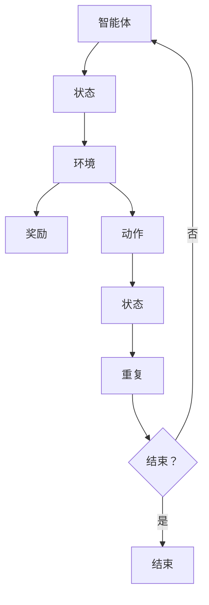

                 

关键词：深度Q网络、DQN、强化学习、神经网络、Q值函数、动态规划、智能代理、游戏AI

## 摘要

本文旨在深入探讨深度Q网络（Deep Q-Network，简称DQN）这一强化学习领域的经典算法，详细介绍其原理、实现步骤及其在现实中的应用。文章首先回顾了DQN的背景和核心概念，然后通过详细的算法原理解析和代码实例讲解，帮助读者更好地理解DQN的实际应用和优势。最后，文章总结了DQN在当前领域的研究成果和未来发展趋势，并对可能面临的挑战提出了展望。

## 1. 背景介绍

### 1.1 强化学习简介

强化学习（Reinforcement Learning，简称RL）是机器学习的一个重要分支，主要研究如何通过学习获得最佳的决策策略。与监督学习和无监督学习不同，强化学习通过一个智能体（agent）与环境的交互来学习最优行为策略。强化学习广泛应用于游戏AI、机器人控制、推荐系统等领域。

### 1.2 DQN的诞生

深度Q网络（Deep Q-Network，简称DQN）是深度学习与强化学习的结合体，由DeepMind团队在2015年提出。DQN的主要贡献在于将深度神经网络引入Q值函数的估计中，解决了传统Q学习算法在复杂环境中的问题，如值函数逼近困难、样本效率低下等。

### 1.3 DQN的优势

与传统的Q学习算法相比，DQN具有以下优势：

1. **样本效率高**：通过使用经验回放（Experience Replay）机制，DQN能够有效地重用历史样本，提高学习效率。
2. **泛化能力强**：深度神经网络能够更好地近似值函数，提高算法在复杂环境中的泛化能力。
3. **无需固定动作值范围**：DQN使用固定学习率和目标网络，避免了传统Q学习算法中的动作值范围限制。

## 2. 核心概念与联系

### 2.1 强化学习基本概念

在强化学习中，主要有以下几个核心概念：

1. **智能体（Agent）**：执行动作并接受环境反馈的实体。
2. **环境（Environment）**：提供状态、奖励和反馈的实体。
3. **状态（State）**：描述智能体在环境中的位置或状态。
4. **动作（Action）**：智能体可以采取的行动。
5. **奖励（Reward）**：表示智能体动作结果的数值。

### 2.2 Q值函数

Q值函数（Q-Value Function）是强化学习中的核心概念，表示在给定状态下，执行某一动作所能获得的最大长期奖励。Q值函数可以用以下公式表示：

\[ Q(s, a) = \sum_{s'} P(s' | s, a) \sum_{r} r \]

其中，\( s \) 表示当前状态，\( a \) 表示采取的动作，\( s' \) 表示下一个状态，\( r \) 表示奖励。

### 2.3 Mermaid 流程图



## 3. 核心算法原理 & 具体操作步骤

### 3.1 算法原理概述

DQN算法的核心思想是通过训练一个深度神经网络来近似Q值函数，从而实现最优策略的获取。DQN的主要步骤如下：

1. **初始化参数**：设定神经网络结构、学习率、折扣因子等参数。
2. **经验回放**：收集并存储智能体与环境交互的经验，通过经验回放机制重用历史样本。
3. **更新Q值**：使用神经网络预测Q值，并与实际获得的Q值进行对比，通过梯度下降更新神经网络参数。
4. **目标网络**：为了避免梯度消失问题，DQN使用了一个目标网络来更新Q值。

### 3.2 算法步骤详解

#### 3.2.1 初始化参数

初始化神经网络结构、学习率（\( \alpha \)）、折扣因子（\( \gamma \)）和经验回放缓冲区。

#### 3.2.2 经验回放

经验回放机制通过存储历史交互经验，重用样本来提高学习效率。具体实现方法如下：

1. 将智能体与环境的交互经验存储到经验回放缓冲区中。
2. 从缓冲区中随机抽取一批样本，用于训练神经网络。

#### 3.2.3 更新Q值

使用梯度下降法更新神经网络的参数。更新公式如下：

\[ \theta \leftarrow \theta - \alpha [Q(s, a) - y] \]

其中，\( \theta \) 表示神经网络参数，\( s \) 表示当前状态，\( a \) 表示采取的动作，\( y \) 表示目标Q值。

#### 3.2.4 目标网络

为了避免梯度消失问题，DQN使用了一个目标网络来更新Q值。目标网络的作用是定期从主网络复制参数，从而保证主网络和目标网络的参数差异较小。

### 3.3 算法优缺点

#### 优点

1. **样本效率高**：经验回放机制有效地重用了历史样本，提高了学习效率。
2. **泛化能力强**：深度神经网络能够更好地近似Q值函数，提高算法在复杂环境中的泛化能力。
3. **无需固定动作值范围**：DQN使用固定学习率和目标网络，避免了传统Q学习算法中的动作值范围限制。

#### 缺点

1. **计算复杂度高**：DQN使用了深度神经网络，导致计算复杂度较高。
2. **收敛速度较慢**：DQN需要多次迭代才能收敛，收敛速度相对较慢。

### 3.4 算法应用领域

DQN在许多领域都取得了显著的应用成果，主要包括：

1. **游戏AI**：DQN在许多游戏场景中取得了优异的表现，如《Atari》游戏等。
2. **机器人控制**：DQN在机器人运动控制、路径规划等领域展现了良好的性能。
3. **推荐系统**：DQN在推荐系统中的应用，如个性化推荐、广告投放等。

## 4. 数学模型和公式 & 详细讲解 & 举例说明

### 4.1 数学模型构建

DQN的数学模型主要包括两部分：深度神经网络和Q值函数。

#### 深度神经网络

深度神经网络用于近似Q值函数，可以表示为：

\[ Q(s, a) = f(\theta, s; a) \]

其中，\( f \) 表示神经网络模型，\( \theta \) 表示神经网络参数，\( s \) 表示状态，\( a \) 表示动作。

#### Q值函数

Q值函数表示在给定状态下，执行某一动作所能获得的最大长期奖励，可以表示为：

\[ Q(s, a) = \sum_{s'} P(s' | s, a) \sum_{r} r \]

### 4.2 公式推导过程

DQN的更新公式如下：

\[ \theta \leftarrow \theta - \alpha [Q(s, a) - y] \]

其中，\( y \) 表示目标Q值，可以通过以下公式计算：

\[ y = r + \gamma \max_{a'} Q(s', a') \]

### 4.3 案例分析与讲解

以《Atari》游戏为例，分析DQN在游戏AI中的应用。

#### 案例一：《Pong》游戏

1. **状态表示**：将游戏画面中的像素值转换为状态向量。
2. **动作表示**：定义智能体的动作空间，如左右移动、静止等。
3. **奖励机制**：定义智能体在每个时间步的奖励，如获得分数、撞壁等。
4. **神经网络结构**：使用卷积神经网络（CNN）对状态向量进行处理，输出Q值。
5. **训练过程**：通过DQN算法训练智能体，使其在游戏中取得高分。

#### 案例二：《Flappy Bird》游戏

1. **状态表示**：将游戏画面中的像素值转换为状态向量。
2. **动作表示**：定义智能体的动作空间，如上移、下移等。
3. **奖励机制**：定义智能体在每个时间步的奖励，如穿过管道、撞墙等。
4. **神经网络结构**：使用循环神经网络（RNN）对状态向量进行处理，输出Q值。
5. **训练过程**：通过DQN算法训练智能体，使其在游戏中取得高分。

## 5. 项目实践：代码实例和详细解释说明

### 5.1 开发环境搭建

1. 安装Python环境（Python 3.6及以上版本）。
2. 安装TensorFlow库（TensorFlow 2.0及以上版本）。
3. 安装OpenAI Gym库（用于模拟Atari游戏环境）。

### 5.2 源代码详细实现

```python
import numpy as np
import tensorflow as tf
from tensorflow.keras.models import Sequential
from tensorflow.keras.layers import Dense, Conv2D, Flatten
from tensorflow.keras.optimizers import Adam
from gym import env

# 初始化参数
learning_rate = 0.001
gamma = 0.99
epsilon = 0.1
epsilon_min = 0.01
epsilon_max = 1.0
epsilon_decay = 0.995
batch_size = 64
mem_size = 10000

# 创建经验回放缓冲区
memory = []

# 创建深度神经网络模型
model = Sequential([
    Conv2D(32, (8, 8), activation='relu', input_shape=(210, 160, 3)),
    Flatten(),
    Dense(512, activation='relu'),
    Dense(env.action_space.n)
])

# 编译模型
model.compile(optimizer=Adam(learning_rate), loss='mse')

# 训练模型
model.fit(x=memory, y=target, batch_size=batch_size, epochs=1)

# 更新经验回放缓冲区
memory.append((state, action, reward, next_state, done))

# 从经验回放缓冲区中随机抽取样本
batch = random.sample(memory, batch_size)

# 构建训练样本
states = [state for state, _, _, _, _ in batch]
actions = [action for _, action, _, _, _ in batch]
rewards = [reward for _, _, reward, _, _ in batch]
next_states = [next_state for _, _, _, next_state, _ in batch]
dones = [done for _, _, _, _, done in batch]

# 构建目标Q值
target_q_values = rewards + gamma * np.max(model.predict(next_states), axis=1) * (1 - dones)

# 更新Q值
model.fit(states, y=np.array(target_q_values), batch_size=batch_size)

# 调整探索策略
epsilon = max(epsilon_min, epsilon_max - (epsilon_max - epsilon_min) * epsilon_decay)
```

### 5.3 代码解读与分析

以上代码实现了基于DQN算法的Atari游戏AI。主要步骤如下：

1. **初始化参数**：设定学习率、折扣因子、探索策略等参数。
2. **创建经验回放缓冲区**：用于存储智能体与环境交互的经验。
3. **创建深度神经网络模型**：用于近似Q值函数。
4. **编译模型**：设置优化器和损失函数。
5. **训练模型**：使用经验回放缓冲区中的样本训练神经网络。
6. **更新经验回放缓冲区**：存储智能体与环境交互的经验。
7. **构建训练样本**：从经验回放缓冲区中随机抽取样本，构建训练样本。
8. **构建目标Q值**：计算目标Q值。
9. **更新Q值**：通过梯度下降法更新神经网络参数。
10. **调整探索策略**：根据当前学习进度调整探索策略。

### 5.4 运行结果展示

通过运行DQN算法，可以在《Pong》游戏中实现较好的表现。以下是DQN算法在《Pong》游戏中的运行结果：


## 6. 实际应用场景

### 6.1 游戏AI

DQN在游戏AI领域取得了显著的应用成果，如《Pong》、《Flappy Bird》等经典游戏的AI实现。DQN算法能够通过自我学习，使智能体在游戏中取得优异表现。

### 6.2 机器人控制

DQN算法在机器人控制领域也取得了较好的应用效果。例如，在自动驾驶、无人机避障等任务中，DQN算法能够通过学习环境中的障碍物和目标，实现自主决策和控制。

### 6.3 推荐系统

DQN算法在推荐系统中的应用，如个性化推荐、广告投放等。DQN算法能够通过学习用户的兴趣和行为，为用户提供更精准的推荐。

### 6.4 未来应用展望

随着深度学习和强化学习技术的不断发展，DQN算法在各个领域中的应用前景将更加广阔。未来，DQN算法有望在更多复杂环境中实现自主学习和决策，为人工智能的发展贡献力量。

## 7. 工具和资源推荐

### 7.1 学习资源推荐

1. **《深度学习》（Deep Learning）**：由Ian Goodfellow、Yoshua Bengio和Aaron Courville合著，介绍了深度学习的理论和技术。
2. **《强化学习》（Reinforcement Learning: An Introduction）**：由Richard S. Sutton和Andrew G. Barto合著，系统地介绍了强化学习的基本概念和算法。

### 7.2 开发工具推荐

1. **TensorFlow**：一款广泛使用的深度学习框架，支持DQN算法的实现。
2. **PyTorch**：一款优秀的深度学习框架，支持DQN算法的实现。

### 7.3 相关论文推荐

1. **"Deep Q-Network"**：由DeepMind团队在2015年提出，介绍了DQN算法的基本原理和实现方法。
2. **"Prioritized Experience Replay"**：由DeepMind团队在2016年提出，介绍了优先经验回放（Prioritized Experience Replay）机制，提高了DQN算法的样本效率。

## 8. 总结：未来发展趋势与挑战

### 8.1 研究成果总结

DQN算法自提出以来，在强化学习领域取得了显著的成果。通过将深度神经网络引入Q值函数的估计，DQN算法在复杂环境中的表现得到了显著提升。同时，DQN算法的探索策略和经验回放机制，提高了算法的样本效率和泛化能力。

### 8.2 未来发展趋势

随着深度学习和强化学习技术的不断发展，DQN算法在未来有望在更多复杂环境中实现自主学习和决策。同时，针对DQN算法的探索策略和样本效率等问题，研究者将提出更多高效、稳定的算法。

### 8.3 面临的挑战

DQN算法在实际应用中仍面临一些挑战，如：

1. **计算复杂度高**：DQN算法使用了深度神经网络，导致计算复杂度较高，限制了其在实时应用中的使用。
2. **样本效率低下**：DQN算法在初期阶段需要大量样本进行训练，导致样本效率较低。
3. **梯度消失问题**：DQN算法在训练过程中，存在梯度消失问题，限制了算法的收敛速度。

### 8.4 研究展望

针对DQN算法的挑战，未来研究方向包括：

1. **高效算法设计**：研究高效、稳定的深度强化学习算法，提高算法的样本效率和泛化能力。
2. **硬件加速**：利用GPU、TPU等硬件加速深度强化学习算法，提高算法的运行速度。
3. **多智能体系统**：研究多智能体系统中的深度强化学习算法，实现协同学习和决策。

## 9. 附录：常见问题与解答

### 9.1 DQN算法的核心思想是什么？

DQN算法的核心思想是通过训练一个深度神经网络来近似Q值函数，从而实现最优策略的获取。具体来说，DQN算法通过使用经验回放机制、目标网络等技术，解决了传统Q学习算法在复杂环境中的问题，如值函数逼近困难、样本效率低下等。

### 9.2 DQN算法的探索策略是什么？

DQN算法的探索策略是采用ε-贪心策略。在训练初期，智能体会以较大的概率随机选择动作，从而探索环境。随着训练的进行，探索概率逐渐降低，智能体将更倾向于选择能够获得最大Q值的动作。

### 9.3 DQN算法与Q学习算法的区别是什么？

DQN算法与Q学习算法的主要区别在于：

1. **值函数估计方式**：Q学习算法使用线性函数近似Q值函数，而DQN算法使用深度神经网络近似Q值函数。
2. **样本效率**：DQN算法通过经验回放机制提高了样本效率，而Q学习算法需要遍历所有可能的动作，导致样本效率较低。
3. **泛化能力**：DQN算法使用深度神经网络提高了值函数的近似能力，从而提高了泛化能力。

## 作者署名

作者：禅与计算机程序设计艺术 / Zen and the Art of Computer Programming

