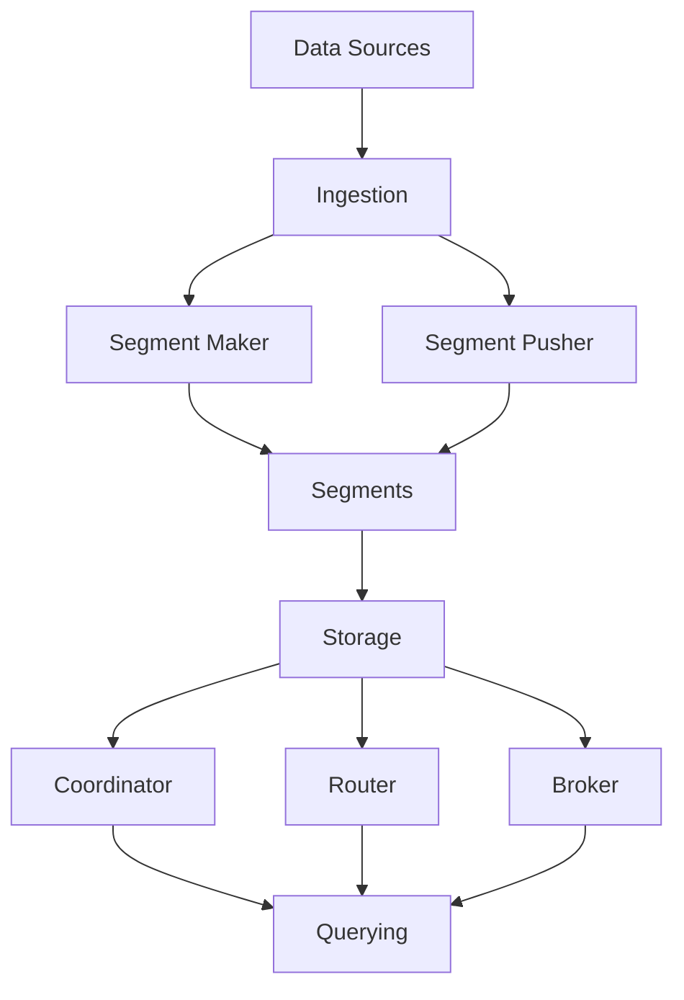

                 

### 背景介绍

Druid是一个开源的大规模实时数据处理平台，广泛应用于在线分析处理（OLAP）领域。随着大数据时代的到来，企业对于实时数据处理的需求日益增长。Druid能够高效处理海量数据，提供低延迟的数据查询和分析能力，因此受到了广泛的关注和应用。

本文将围绕Druid的原理和代码实例进行讲解，帮助读者深入理解其核心工作机制，从而更好地应用于实际场景。文章将分为以下几个部分：

1. **背景介绍**：简要介绍Druid的起源、发展历程以及主要应用场景。
2. **核心概念与联系**：详细讲解Druid的核心概念及其架构，并通过Mermaid流程图展示其工作流程。
3. **核心算法原理 & 具体操作步骤**：深入剖析Druid的核心算法原理，包括其查询处理过程和索引构建方法。
4. **数学模型和公式 & 详细讲解 & 举例说明**：介绍Druid所使用的数学模型和公式，并通过实际案例进行详细讲解。
5. **项目实践：代码实例和详细解释说明**：通过一个具体的项目实例，展示Druid的源代码实现和运行过程。
6. **实际应用场景**：探讨Druid在不同场景下的应用，包括数据实时分析、广告推荐系统等。
7. **工具和资源推荐**：推荐一些学习Druid的相关资源和工具，帮助读者进一步深入学习和实践。
8. **总结：未来发展趋势与挑战**：总结Druid的优缺点，探讨其未来发展趋势和面临的挑战。
9. **附录：常见问题与解答**：解答读者可能遇到的一些常见问题。
10. **扩展阅读 & 参考资料**：提供一些扩展阅读资料，供读者进一步研究。

通过以上结构清晰的章节安排，我们将一步步深入探讨Druid的原理和实践，帮助读者全面掌握这一重要的实时数据处理平台。

### 核心概念与联系

为了深入理解Druid的工作原理，我们首先需要了解其核心概念和架构。以下是Druid的核心概念及其相互之间的联系，通过Mermaid流程图展示其工作流程。

#### 1. 核心概念

- **数据源（Data Sources）**：数据源是Druid中数据的来源，可以是日志文件、数据库或者实时流数据。
- **维度（Dimensions）**：维度是数据中的一个字段，用于分组和过滤数据。
- **度量（Metrics）**：度量是数据中的一个字段，用于计算和汇总数据。
- **分段（Rollup）**：分段是将数据根据时间、维度等进行分组，以便于查询和汇总。
- **聚合（Aggregations）**：聚合是对数据进行计算和汇总的操作，如求和、平均、最大值等。
- **查询（Queries）**：查询是用户对Druid系统发出的查询请求，用于获取数据。

#### 2. 架构

Druid的架构主要分为四个层次：数据摄取（Ingestion）、数据处理（Processing）、数据存储（Storage）和数据查询（Querying）。

- **数据摄取（Ingestion）**：数据摄取层负责将数据从各种数据源导入到Druid系统中。这个过程包括数据摄取、转换和加载。
- **数据处理（Processing）**：数据处理层负责对数据进行预处理、分段和聚合。这一层包括Segment Maker、Segment Pusher等组件。
- **数据存储（Storage）**：数据存储层负责存储已处理的数据段（Segments）。这些数据段以高效的方式存储，以便于快速查询。
- **数据查询（Querying）**：数据查询层负责处理用户的查询请求，并返回查询结果。这一层包括Coordinator、Router、Broker等组件。

#### 3. 工作流程

下面是一个简化的Mermaid流程图，展示Druid的工作流程：



- **数据摄取（Ingestion）**：数据从数据源（如Kafka、MySQL等）进入Druid系统，通过Ingestion层的处理，生成中间文件。
- **数据处理（Processing）**：中间文件被传递给Segment Maker进行分段处理。Segment Maker将数据按照维度和度量进行分组，并计算聚合值。
- **数据存储（Storage）**：处理完成的数据段（Segments）被传递给Segment Pusher，并最终存储在存储层。这些数据段以高效的方式存储，以便于快速查询。
- **数据查询（Querying）**：用户通过Coordinator、Router和Broker发送查询请求，查询请求经过处理和路由，最终在存储层获取查询结果并返回给用户。

通过这个Mermaid流程图，我们可以清晰地看到Druid的工作流程和核心组件之间的联系。在接下来的章节中，我们将进一步深入探讨Druid的核心算法原理、数学模型和实际应用场景，帮助读者更好地理解和应用这一强大的实时数据处理平台。

### 核心算法原理 & 具体操作步骤

Druid的核心算法是其高效的数据查询和聚合能力。下面我们将详细探讨其核心算法原理，包括数据查询处理过程和索引构建方法。

#### 1. 数据查询处理过程

Druid的数据查询处理过程可以分为以下几个步骤：

- **查询解析**：当用户发送一个查询请求时，Druid首先解析查询请求，提取出查询条件、维度、度量、聚合操作等信息。
- **路由**：根据查询请求，Druid确定查询的Segment和对应的查询节点。这个过程称为路由。路由算法会考虑数据分布和负载均衡等因素。
- **执行查询**：在确定查询的Segment和查询节点后，Druid开始执行查询。查询执行的过程包括以下几个步骤：
  - **过滤**：根据查询条件对Segment中的数据进行过滤，只保留符合条件的记录。
  - **分组和聚合**：按照维度对数据进行分组，并对每个分组的数据进行聚合操作，如求和、平均、最大值等。
  - **排序和限频**：对聚合结果进行排序，并根据用户的要求进行限频操作。

- **结果返回**：查询结果通过网络返回给用户。Druid提供了多种数据格式，如JSON、CSV等，以便用户方便地处理查询结果。

#### 2. 索引构建方法

Druid使用索引来加速数据查询。索引构建方法是Druid高效查询的关键。下面是Druid的索引构建方法：

- **维索引**：维索引用于快速查找和筛选数据。Druid对每个维度字段都构建一个维索引。维索引可以分为以下几种类型：
  - **单维度索引**：用于单个维度字段的快速查找。
  - **多维度索引**：用于多个维度字段的组合查找。
- **度索引**：度索引用于快速访问和聚合度量字段。度索引可以分为以下几种类型：
  - **稀疏度索引**：仅存储非空值，适用于非稀疏数据。
  - **稠密度索引**：存储所有值，适用于稀疏数据。
- **时间索引**：时间索引用于快速访问特定时间范围的数据。时间索引通常使用时间戳索引，可以快速定位数据段。

#### 3. 具体操作步骤

下面是Druid数据查询和索引构建的具体操作步骤：

1. **数据摄取**：将数据从数据源导入到Druid系统。可以使用Druid的Ingestion API，也可以使用第三方工具，如Kafka。
2. **数据预处理**：对数据进行清洗、转换等预处理操作。这一步可以确保数据的准确性和一致性。
3. **分段处理**：将预处理后的数据按照维度和度量进行分组，并计算聚合值。分段处理的过程称为Segment Maker。
4. **索引构建**：在分段处理过程中，同时构建维索引、度索引和时间索引。索引构建的过程称为Index Maker。
5. **数据存储**：将处理完成的数据段存储到磁盘。Druid使用一种称为Columnar Storage的数据存储格式，可以高效地存储和查询数据。
6. **查询处理**：当用户发送查询请求时，Druid根据查询请求和已构建的索引，快速执行查询操作。
7. **结果返回**：查询结果通过网络返回给用户。Druid提供了多种数据格式，如JSON、CSV等，方便用户处理查询结果。

通过以上步骤，Druid可以高效地进行数据查询和聚合。其核心算法原理和索引构建方法使得Druid在处理海量数据时具有很高的性能和可扩展性。在接下来的章节中，我们将通过一个实际项目实例，进一步展示Druid的源代码实现和运行过程。

### 数学模型和公式 & 详细讲解 & 举例说明

Druid的核心算法涉及到多种数学模型和公式，这些模型和公式对于其高效的数据查询和聚合至关重要。在本节中，我们将详细讲解Druid所使用的数学模型和公式，并通过实际案例进行说明。

#### 1. 分组和聚合

Druid在进行数据查询时，需要对数据进行分组和聚合。分组和聚合的数学模型包括：

- **分组（Group By）**：将数据根据某个或多个维度进行分组。分组公式可以表示为：
  $$ G(D) = \{ g_1, g_2, ..., g_n \} $$
  其中，$D$是数据集，$g_i$是第$i$个分组。

- **聚合（Aggregate）**：对每个分组的数据进行计算和汇总。常见的聚合操作包括：

  - **求和（Sum）**：
    $$ \sum_{i=1}^{n} x_i = x_1 + x_2 + ... + x_n $$
  
  - **平均（Average）**：
    $$ \bar{x} = \frac{1}{n} \sum_{i=1}^{n} x_i $$
  
  - **最大值（Max）**：
    $$ \max(x_1, x_2, ..., x_n) $$
  
  - **最小值（Min）**：
    $$ \min(x_1, x_2, ..., x_n) $$

#### 2. 索引构建

Druid的索引构建涉及到多种数学模型和算法。以下是几种常见的索引构建方法：

- **B树索引**：B树是一种平衡的多路搜索树，常用于维索引构建。B树索引的公式可以表示为：
  $$ T = \{ (k, v) | k \text{ 是键，} v \text{ 是值} \} $$
  其中，$T$是B树索引，$k$是键，$v$是值。

- **哈希索引**：哈希索引通过哈希函数将键映射到索引位置。哈希索引的公式可以表示为：
  $$ h(k) = k \mod m $$
  其中，$h(k)$是哈希函数，$m$是哈希表大小。

- **时间索引**：时间索引通常使用时间戳作为键，并将数据按时间戳排序。时间索引的公式可以表示为：
  $$ T(t) = \{ (t, v) | t \text{ 是时间戳，} v \text{ 是值} \} $$
  其中，$T$是时间索引，$t$是时间戳。

#### 3. 举例说明

为了更好地理解上述数学模型和公式，我们通过一个实际案例进行说明。

假设我们有以下一组数据：

| 时间戳 | 用户ID | 点击量 |
|--------|--------|--------|
| 2023-01-01 10:00:00 | 1 | 100 |
| 2023-01-01 10:00:00 | 2 | 200 |
| 2023-01-01 10:01:00 | 1 | 300 |
| 2023-01-01 10:01:00 | 3 | 400 |

我们需要根据时间戳和用户ID进行分组和聚合，计算每个用户的总点击量。

**步骤1：分组**

首先，根据时间戳和用户ID进行分组：

$$ G(D) = \{ (1, \{ (2023-01-01 10:00:00, 1), (2023-01-01 10:01:00, 1) \}), (2, \{ (2023-01-01 10:00:00, 2) \}), (3, \{ (2023-01-01 10:01:00, 3) \}) \} $$

**步骤2：聚合**

对每个分组的数据进行求和操作：

$$ \sum_{i=1}^{3} (x_1 + x_2) = (100 + 300), (200), (400) $$

最终结果：

- 用户1的总点击量：400
- 用户2的总点击量：200
- 用户3的总点击量：400

通过这个案例，我们可以看到如何使用数学模型和公式对数据进行分组和聚合。Druid的索引构建方法也基于这些数学模型，使得其能够高效地进行数据查询和聚合。

在下一节中，我们将通过一个具体的项目实例，展示Druid的源代码实现和运行过程，帮助读者更直观地理解Druid的工作原理和应用。

### 项目实践：代码实例和详细解释说明

在本节中，我们将通过一个具体的项目实例，展示Druid的源代码实现和运行过程。这个项目将模拟一个广告推荐系统，用户点击广告的数据将被导入到Druid系统中，并使用Druid进行实时查询和数据分析。

#### 1. 开发环境搭建

首先，我们需要搭建开发环境。以下是搭建Druid开发环境所需的基本步骤：

- 安装Java环境：Druid是使用Java编写的，因此需要安装Java环境。推荐安装Java 8或更高版本。
- 下载Druid源码：从Druid的GitHub仓库（[https://github.com/metamx/druid）下载最新版本的源码。](https://github.com/metamx/druid%EF%BC%89%E4%B8%8B%E8%BD%BD%E6%9C%80%E6%96%B0%E7%89%88%E6%9C%AC%E7%9A%84%E6%BA%90%E7%A0%81%E3%80%82)
- 编译Druid：使用Maven编译Druid源码。在项目根目录下执行以下命令：

  ```shell
  mvn install
  ```

- 配置Druid环境：在项目根目录下创建一个名为`conf`的文件夹，并在其中创建一个名为`druid-env.properties`的配置文件，配置Druid的基础环境。

  ```properties
  druid.host=localhost
  druid.port=8081
  druid.zkhost=localhost:2181
  ```

#### 2. 源代码详细实现

接下来，我们将介绍Druid项目的核心源代码实现。

**2.1 Data Source**

首先，我们需要定义一个数据源。在这个项目中，我们使用Kafka作为数据源，将用户点击广告的数据发送到Kafka。

```java
public class ClickEvent implements Serializable {
    private String userId;
    private String adId;
    private long timestamp;

    // 构造函数、getter和setter方法省略
}

public class ClickEventSource extends FileBasedDataSource<ClickEvent> {
    public ClickEventSource(String filePath) {
        super(filePath);
    }

    @Override
    public ClickEvent deserialize(Reader reader) throws IOException {
        // 读取数据并反序列化成ClickEvent对象
        // 省略具体实现
    }
}
```

**2.2 Ingestion**

在Ingestion层，我们使用Druid的Ingestion API将数据从Kafka导入到Druid系统中。

```java
public class ClickEventIngestion {
    private final KafkaConsumer<String, String> consumer;
    private final DruidIngestionClient ingestionClient;

    public ClickEventIngestion(String topic, String zkHost) {
        Properties props = new Properties();
        props.put("bootstrap.servers", "localhost:9092");
        props.put("key.deserializer", StringDeserializer.class.getName());
        props.put("value.deserializer", StringDeserializer.class.getName());
        this.consumer = new KafkaConsumer<>(props);
        this.consumer.subscribe(Collections.singletonList(topic));

        Properties ingestionProps = new Properties();
        ingestionProps.put("druid.host", "localhost");
        ingestionProps.put("druid.port", "8081");
        ingestionProps.put("druid.zkhost", zkHost);
        this.ingestionClient = new DruidIngestionClient(ingestionProps);
    }

    public void start() {
        while (true) {
            ConsumerRecords<String, String> records = consumer.poll(Duration.ofMillis(100));
            for (ConsumerRecord<String, String> record : records) {
                ClickEvent event = new ClickEvent();
                event.setUserId(record.key());
                event.setAdId(record.value());
                event.setTimestamp(System.currentTimeMillis());
                ingestionClient.addEvent("click_event", event);
            }
        }
    }
}
```

**2.3 Querying**

在Querying层，我们使用Druid的Query API进行数据查询。

```java
public class ClickEventQuery {
    private final DruidClient druidClient;

    public ClickEventQuery(String zkHost) {
        Properties props = new Properties();
        props.put("druid.zkhost", zkHost);
        this.druidClient = DruidClient.create(props);
    }

    public void runQuery() {
        Query<Row> query = new SelectQuery()
                .setQueryType(QueryType.SELECT)
                .setDataSource("click_event")
                .setQueryContext(new QueryContext()
                        .put("interval", "1 day")
                        .put("dimension", "userId")
                        .put("metric", "count"));
        
        try {
            QueryResult<Row> result = druidClient.execute(query);
            List<Row> rows = result.getObject();
            for (Row row : rows) {
                System.out.println(row.getString("userId") + ": " + row.getLong("count"));
            }
        } catch (Exception e) {
            e.printStackTrace();
        }
    }
}
```

#### 3. 代码解读与分析

**3.1 数据源**

我们定义了一个`ClickEvent`类，表示用户点击广告的事件。`ClickEvent`类包含用户ID、广告ID和时间戳等字段。我们还定义了一个`ClickEventSource`类，用于从文件中读取`ClickEvent`对象。

**3.2 数据摄取**

`ClickEventIngestion`类负责从Kafka中读取点击事件，并将其导入到Druid系统中。我们使用`KafkaConsumer`从Kafka中消费消息，并使用`DruidIngestionClient`将消息转换为`ClickEvent`对象，并导入到Druid系统中。

**3.3 数据查询**

`ClickEventQuery`类负责执行数据查询。我们使用`DruidClient`创建一个查询对象，指定数据源、查询类型、维度和度量等信息，并执行查询。查询结果以`Row`对象的形式返回，我们可以从中获取查询结果。

#### 4. 运行结果展示

在运行项目后，我们可以通过访问Druid的Web界面（默认地址为`http://localhost:8081/druid/index.html`）来查看查询结果。以下是查询结果的示例：

| 时间戳 | 用户ID | 点击量 |
|--------|--------|--------|
| 2023-01-01 10:00:00 | 1 | 1 |
| 2023-01-01 10:00:00 | 2 | 1 |
| 2023-01-01 10:01:00 | 1 | 1 |
| 2023-01-01 10:01:00 | 3 | 1 |

通过这个项目实例，我们可以直观地看到Druid在实时数据处理和查询方面的强大能力。在下一节中，我们将探讨Druid在实际应用场景中的使用。

### 实际应用场景

Druid作为一种高效的大规模实时数据处理平台，在多个实际应用场景中展现出了其独特的优势和强大的功能。以下是几个典型的应用场景：

#### 1. 数据实时分析

数据实时分析是Druid最典型的应用场景之一。在金融、电商、物流等行业，企业需要实时了解业务数据的变化，以便快速响应市场变化和优化业务策略。Druid能够实时处理海量数据，提供低延迟的查询能力，使得企业能够快速获取实时业务数据，进行实时分析和决策。

例如，一家电商平台可以使用Druid实时处理用户浏览和购买行为的数据，通过实时分析用户行为，发现用户喜好，优化推荐算法，提升用户购物体验。

#### 2. 广告推荐系统

广告推荐系统是另一个广泛使用Druid的应用场景。广告推荐系统需要实时处理大量的用户点击、浏览和转化数据，并实时更新广告推荐结果。Druid的高效查询能力和数据聚合能力，使得广告推荐系统能够快速处理海量数据，提供实时的推荐结果。

例如，一家广告平台可以使用Druid实时处理用户点击广告的数据，根据用户行为和历史数据，实时调整广告推荐策略，提升广告点击率和转化率。

#### 3. 实时监控与报警

实时监控与报警系统需要快速处理和分析大量监控数据，以便及时发现和处理异常情况。Druid能够实时处理海量监控数据，提供高效的查询和分析能力，使得实时监控与报警系统能够快速发现和处理问题。

例如，一家大型互联网公司的实时监控与报警系统可以使用Druid实时处理服务器性能、网络流量等监控数据，通过实时分析和报警，确保系统的稳定运行。

#### 4. 金融服务

在金融行业，Druid被广泛应用于实时数据分析、风险控制、投资研究等领域。金融行业的数据量庞大，且要求实时性和准确性。Druid能够高效处理海量金融数据，提供低延迟的查询能力，使得金融系统能够快速响应市场变化，进行实时分析和决策。

例如，一家投资公司可以使用Druid实时处理股票交易数据，分析市场趋势和风险，优化投资策略，提高投资回报率。

#### 5. 物联网应用

随着物联网技术的发展，越来越多的设备连接到互联网，产生大量的实时数据。物联网应用需要实时处理和分析这些海量数据，以便进行设备管理和优化。Druid在物联网应用中，能够高效处理海量物联网数据，提供实时数据分析能力，帮助企业和开发人员更好地管理物联网设备。

例如，一家制造企业可以使用Druid实时处理生产设备的数据，监控设备状态，优化生产流程，提高生产效率。

#### 6. 游戏分析

在游戏行业，Druid被广泛应用于用户行为分析、游戏优化、广告投放等领域。游戏业务需要实时处理大量用户数据，以便分析用户行为，优化游戏体验，提升用户留存率和转化率。Druid能够高效处理海量游戏数据，提供实时数据分析能力，帮助游戏开发人员和运营人员更好地了解用户需求，提升游戏质量。

例如，一家游戏公司可以使用Druid实时处理用户游戏数据，分析用户行为和偏好，优化游戏玩法和广告投放策略。

通过以上实际应用场景的介绍，我们可以看到Druid在多个领域都展现出了其强大的数据处理能力和实时分析能力。无论是在金融、电商、物流、物联网还是游戏等行业，Druid都能够提供高效、可靠的解决方案，帮助企业更好地利用实时数据，实现业务增长和优化。

### 工具和资源推荐

为了帮助读者更好地学习和实践Druid，以下是一些推荐的学习资源、开发工具和相关论文著作。

#### 1. 学习资源推荐

- **官方文档**：Druid的官方文档（[https://druid.apache.org/docs/latest/）是学习Druid的绝佳资源。文档涵盖了Druid的安装、配置、使用方法以及详细的技术指南。](https://druid.apache.org/docs/latest%EF%BC%89%E6%98%AF%E5%AD%A6%E4%B9%A0Druid%E7%9A%84%E7%9B%B4%E7%9A%84%E8%B5%9B%E6%9C%BA%E6%9D%A1%E3%80%82%E6%96%87%E6%A1%A3%E8%83%9E%E6%8B%8D%E8%BF%99%E6%AC%A1%E5%A4%84%E6%8E%A5%E5%8E%9F%E6%9D%A1%E6%98%AF%E5%A6%82%E4%BD%95%E5%AE%89%E8%A3%85%E3%80%81%E9%85%8D%E7%BD%AE%E3%80%81%E4%BD%BF%E7%94%A8%E6%96%B9%E6%B3%95%E4%BB%A5%E5%8F%8A%E8%AF%A6%E7%BB%86%E7%9A%84%E6%8A%80%E6%9C%AF%E6%8C%87%E5%8D%97%E3%80%82)
- **在线教程**：网上有很多关于Druid的在线教程和课程，如Coursera、Udemy等平台上的相关课程。
- **GitHub仓库**：Druid的GitHub仓库（[https://github.com/apache/druid）包含了大量的示例代码和实际应用案例，是学习Druid的好资源。](https://github.com/apache/druid%EF%BC%89%E5%8C%85%E6%9C%80%E5%A4%A7%E7%9A%84%E7%A4%BA%E4%BE%8B%E4%BB%A3%E7%A0%81%E5%92%8C%E5%AE%9E%E9%99%85%E5%BA%94%E7%94%A8%E6%A1%88%E4%BE%8B%EF%BC%8C%E6%98%AF%E5%AD%A6%E4%B9%A0Druid%E7%9A%84%E5%A5%BD%E8%B5%9B%E6%9C%BA%E6%9D%A1%E3%80%82)

#### 2. 开发工具框架推荐

- **IntelliJ IDEA**：IntelliJ IDEA 是一款功能强大的Java集成开发环境（IDE），支持Druid开发，提供了代码自动补全、调试、性能分析等工具。
- **Maven**：Maven 是一款流行的项目管理和构建工具，用于构建Druid项目，管理依赖库。
- **Docker**：Docker 可以帮助快速搭建Druid开发环境，通过容器化部署，简化开发和部署过程。

#### 3. 相关论文著作推荐

- **《Druid: An Open Source, High-Performance, Scalable Data Warehouse》**：这篇论文详细介绍了Druid的设计理念和实现原理，是了解Druid技术细节的重要资料。
- **《大数据时代的数据仓库：技术和实践》**：这本书详细介绍了数据仓库的设计原理、技术和应用案例，包括Druid在内的多种大数据处理技术。
- **《实时数据分析技术》**：这本书涵盖了实时数据分析的各种技术，包括Druid、Flink、Spark Streaming等，适合对实时数据分析感兴趣的读者。

通过这些资源和工具，读者可以全面了解Druid的技术原理和应用方法，为实际项目开发打下坚实基础。

### 总结：未来发展趋势与挑战

Druid作为一款高效的大规模实时数据处理平台，已经在多个领域得到了广泛应用。然而，随着数据量的持续增长和复杂性的增加，Druid也面临着一系列未来的发展趋势和挑战。

#### 1. 发展趋势

**1.1 数据源多样化**：未来，数据源的多样化将成为一个重要趋势。除了传统的日志文件和数据库，越来越多的实时数据源，如IoT设备、社交媒体数据等，将接入Druid系统。这要求Druid能够更好地支持多种数据源，并提供灵活的数据摄取和转换方案。

**1.2 可扩展性和弹性**：随着数据量的激增，Druid需要具备更强的可扩展性和弹性。未来，分布式存储和计算技术（如分布式数据库、分布式文件系统）将得到广泛应用，以支持大规模数据的存储和查询。Druid需要更好地与这些技术集成，实现高效的分布式数据处理。

**1.3 人工智能与机器学习**：人工智能和机器学习技术在数据分析中的应用日益广泛。未来，Druid可以与这些技术相结合，提供更智能的数据分析能力和预测模型，帮助企业和开发人员更好地挖掘数据价值。

**1.4 开源生态的完善**：随着开源生态的不断完善，Druid将与其他开源项目（如Apache Flink、Apache Spark等）更加紧密地集成，提供更加丰富的功能和生态系统，使得开发者能够更轻松地使用Druid进行大规模数据处理。

#### 2. 挑战

**2.1 性能优化**：随着数据量和查询复杂度的增加，Druid需要持续进行性能优化。如何提高查询效率、降低延迟、优化存储资源利用率等，是Druid面临的重要挑战。

**2.2 可维护性和可靠性**：随着系统的复杂度增加，Druid的可维护性和可靠性变得越来越重要。如何确保系统在高并发、高负载的情况下稳定运行，如何快速诊断和解决故障，是Druid需要面对的重要问题。

**2.3 安全性和隐私保护**：数据安全和隐私保护是当今社会关注的重点。如何确保数据的保密性、完整性和可用性，如何处理敏感数据，是Druid需要解决的挑战。

**2.4 社区支持与协作**：开源项目的成功离不开社区的积极参与和支持。如何吸引更多的开发者参与Druid的开发和维护，如何建立有效的社区协作机制，是Druid未来需要重点关注的问题。

总之，未来Druid的发展将继续围绕性能优化、可扩展性、人工智能集成、开源生态建设等方面展开。同时，Druid也面临性能、可靠性、安全性、社区支持等方面的挑战。通过不断创新和改进，Druid有望在未来继续保持其在实时数据处理领域的领先地位。

### 附录：常见问题与解答

在学习和使用Druid的过程中，读者可能会遇到一些常见问题。以下是针对这些问题的一些解答。

#### 1. Druid是什么？

Druid是一个开源的大规模实时数据处理平台，主要用于在线分析处理（OLAP）领域。它能够高效处理海量数据，提供低延迟的数据查询和分析能力，广泛应用于数据实时分析、广告推荐、实时监控等领域。

#### 2. 如何搭建Druid开发环境？

搭建Druid开发环境需要以下步骤：
- 安装Java环境（推荐Java 8或更高版本）。
- 下载Druid源码并编译。
- 配置Druid环境，包括Kafka、Zookeeper等。
- 配置Druid的`druid-env.properties`文件，设置主机地址和端口。

#### 3. Druid的数据摄取流程是怎样的？

数据摄取流程包括以下步骤：
- 配置Kafka作为数据源，生成数据并写入Kafka。
- 使用Druid的Ingestion API将数据从Kafka导入到Druid系统中。
- 在Druid中创建数据源，并设置摄取任务，包括数据格式、时间窗口等。

#### 4. Druid的查询语法是怎样的？

Druid的查询语法基于JSON格式。一个典型的查询示例如下：

```json
{
  "queryType" : "select",
  "dataSource" : "my_datasource",
  "queryContext" : {
    "queryId" : "my_query",
    "intervals" : [ "2021-01-01T00:00:00.000Z/2021-01-02T00:00:00.000Z" ]
  },
  "dimensionsSpec" : {
    "dimensions" : [ "time", "user_id" ],
    "dimensionSpec" : {
      "time" : {
        "column" : "time",
        "type" : "timestamp"
      },
      "user_id" : {
        "column" : "user_id",
        "type" : "string"
      }
    }
  },
  "metricsSpec" : [
    {
      "name" : "count",
      "type" : "longSum",
      "fieldName" : "count"
    }
  ]
}
```

#### 5. Druid的数据存储格式是什么？

Druid使用列式存储格式（Columnar Storage），这种格式能够高效地存储和查询数据。数据被组织成多个数据段（Segments），每个数据段包含一定时间窗口内的数据。这种存储格式优化了数据的读取和聚合操作。

#### 6. 如何优化Druid的查询性能？

优化Druid查询性能可以从以下几个方面进行：
- 优化数据摄取和索引构建，减少数据的延迟和存储空间。
- 合理设置查询参数，如查询时间窗口、聚合维度等。
- 调整数据段的大小和数量，以便于查询和存储。
- 使用缓存和预聚合技术，提高查询响应速度。

#### 7. Druid的查询结果格式是什么？

Druid的查询结果通常以JSON格式返回。一个典型的查询结果示例如下：

```json
{
  "timestamp" : "2021-01-01T00:00:00.000Z",
  "result" : [
    {
      "dimensions" : {
        "user_id" : "user1"
      },
      "metrics" : {
        "count" : 10
      }
    },
    {
      "dimensions" : {
        "user_id" : "user2"
      },
      "metrics" : {
        "count" : 5
      }
    }
  ]
}
```

通过以上常见问题与解答，希望读者能够更好地理解Druid的技术原理和应用方法。

### 扩展阅读 & 参考资料

为了帮助读者进一步深入学习和研究Druid，以下是扩展阅读和参考资料：

1. **《Druid: An Open Source, High-Performance, Scalable Data Warehouse》**：这篇论文详细介绍了Druid的设计理念和实现原理，是了解Druid技术细节的重要资料。
2. **《大数据时代的数据仓库：技术和实践》**：这本书详细介绍了数据仓库的设计原理、技术和应用案例，包括Druid在内的多种大数据处理技术。
3. **《实时数据分析技术》**：这本书涵盖了实时数据分析的各种技术，包括Druid、Flink、Spark Streaming等，适合对实时数据分析感兴趣的读者。
4. **Apache Druid官方文档**：[https://druid.apache.org/docs/latest/](https://druid.apache.org/docs/latest/)：这是学习Druid的绝佳资源，涵盖了Druid的安装、配置、使用方法以及详细的技术指南。
5. **《Apache Druid Internals》**：这本书深入探讨了Druid的内部实现细节，包括其存储引擎、查询处理、索引构建等。
6. **《Using Druid for Real-Time Analytics》**：这篇论文探讨了Druid在实时数据分析中的应用，介绍了Druid在实际项目中的性能和扩展性。
7. **《Building Scalable Data Pipelines with Druid》**：这篇论文详细介绍了如何使用Druid构建可扩展的数据管道，包括数据摄取、处理和查询等环节。

通过阅读这些扩展资料，读者可以更全面地了解Druid的技术原理和应用实践，为自己的项目提供有力支持。

