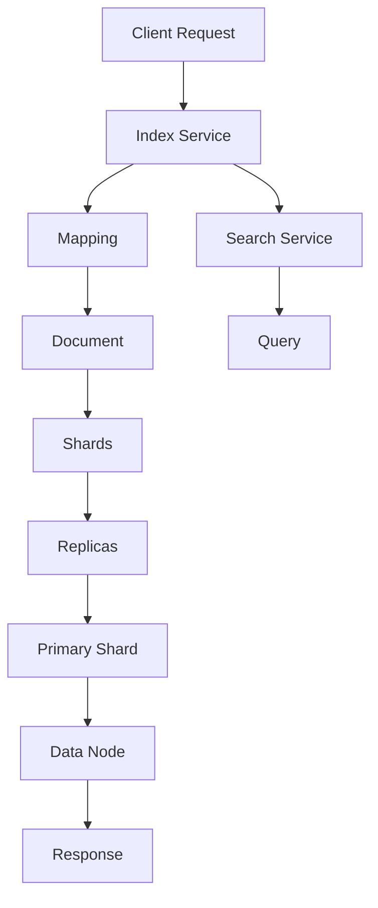

                 

# 文章标题

ElasticSearch 原理与代码实例讲解

## 关键词

- ElasticSearch
- 搜索引擎
- 分布式系统
- REST API
- 倒排索引
- 集群管理
- 代码实例

## 摘要

本文将深入探讨ElasticSearch的原理和实际应用，通过逐步分析其核心概念、算法原理以及数学模型，帮助读者全面理解ElasticSearch的工作机制。同时，本文将提供详细的代码实例，讲解如何搭建开发环境、编写和解释ElasticSearch的源代码，并展示实际运行结果。最后，本文将分析ElasticSearch在实际应用场景中的优势与挑战，并推荐相关学习资源和开发工具。

## 1. 背景介绍

ElasticSearch是一个高度可扩展的分布式搜索引擎，基于Lucene构建，能够实现实时的搜索和分析功能。它广泛应用于大数据处理、日志分析、内容检索等领域。ElasticSearch的特点包括：

- **分布式架构**：支持水平扩展，能够处理大规模数据。
- **RESTful API**：提供简单的HTTP接口，方便与其他系统集成。
- **全文搜索**：支持复杂的全文搜索和模糊查询。
- **分析功能**：提供丰富的数据分析功能，如聚合分析、时间序列分析等。
- **集群管理**：支持自动分片和复制，保证数据的高可用性。

本文将从以下几个方面展开讲解：

- ElasticSearch的核心概念与架构
- ElasticSearch的核心算法原理
- ElasticSearch的数学模型和公式
- ElasticSearch的实际应用场景
- ElasticSearch的开发工具和资源推荐

通过本文的讲解，读者将能够全面掌握ElasticSearch的原理和应用，为实际项目开发打下坚实基础。

## 2. 核心概念与联系

### 2.1 ElasticSearch的基本概念

在深入探讨ElasticSearch之前，我们需要了解其核心概念，这些概念是理解ElasticSearch工作原理的基础。

#### 索引（Index）

索引是ElasticSearch中数据存储的基本单位。它类似于关系数据库中的数据库，但更灵活，可以包含多个类型（Type）。在ElasticSearch 7.x及更高版本中，类型已被废弃，所有数据统一存储在 индекс（index）中。

#### 文档（Document）

文档是存储在索引中的数据单位，由多个字段（Field）组成。文档可以是一个JSON对象，每个字段都有相应的值。文档是可索引和可查询的。

#### 映射（Mapping）

映射定义了文档的结构，包括字段类型、索引方式、分析器等。映射对于索引的性能和查询能力至关重要。

#### 集群（Cluster）

集群是由多个节点组成的逻辑实体，每个节点都可以是主节点或数据节点。集群确保数据的高可用性和扩展性。

#### 节点（Node）

节点是ElasticSearch中的运行实例，可以是主节点、数据节点或协调节点。主节点负责集群状态的管理，数据节点存储数据，协调节点负责协调请求的分发和处理。

### 2.2 ElasticSearch的架构

ElasticSearch的架构设计旨在提供高性能、高可用性和可扩展性。以下是ElasticSearch的核心架构组件：

#### 分片（Shard）

分片是将索引数据拆分为多个片段的过程。每个分片都是独立的Lucene索引，可以分布在不同的节点上。分片数决定了数据的并发读写能力。

#### 副本（Replica）

副本是分片的副本，用于提高数据的可用性和查询性能。副本可以分布在不同的节点上，当主分片故障时，副本可以提升为主分片。

#### 映射（Mapping）

映射是定义文档结构的过程，包括字段类型、索引方式、分析器等。映射对于索引的性能和查询能力至关重要。

#### 索引服务（Index Service）

索引服务负责处理索引的创建、删除、更新等操作。它是ElasticSearch的核心服务之一。

#### 搜索服务（Search Service）

搜索服务负责处理查询请求，包括全文搜索、模糊查询、聚合分析等。它是ElasticSearch的核心服务之一。

#### 集群服务（Cluster Service）

集群服务负责维护集群状态，包括节点加入、离开、故障转移等。它是ElasticSearch的核心服务之一。

### 2.3 Mermaid流程图

以下是一个简化的ElasticSearch工作流程的Mermaid流程图：



### 3. 核心算法原理 & 具体操作步骤

### 3.1 倒排索引

倒排索引是ElasticSearch实现高效搜索的核心算法。它将文档内容反向映射到文档ID，使得查询时能够快速定位相关文档。

#### 原理

1. **正向索引**：每个文档都有一个唯一的ID，文档内容以文本形式存储。正向索引将文档内容与文档ID关联。

2. **倒排索引**：倒排索引将每个词汇映射到包含该词汇的文档列表。通过查询倒排索引，可以快速找到包含特定词汇的文档。

#### 具体操作步骤

1. **分词**：将文档内容分割成单词或短语。

2. **倒排索引构建**：为每个单词创建一个倒排列表，记录包含该单词的文档ID。

3. **查询处理**：输入查询条件，通过倒排索引查找相关文档。

### 3.2 搜索算法

ElasticSearch的搜索算法主要包括：

1. **布尔搜索**：支持AND、OR、NOT等布尔操作符。

2. **全文搜索**：通过倒排索引实现，支持模糊查询和范围查询。

3. **聚合分析**：对搜索结果进行聚合计算，如统计、分组、排序等。

4. **缓存机制**：使用缓存提高查询性能，减少对倒排索引的访问次数。

### 3.3 分布式搜索

ElasticSearch支持分布式搜索，通过将查询分散到多个节点上并行处理，提高搜索性能。

#### 具体操作步骤

1. **查询分发**：客户端发送查询请求到协调节点。

2. **分片查询**：协调节点将查询请求分发到相关分片节点。

3. **结果聚合**：分片节点返回查询结果，协调节点对结果进行聚合。

### 4. 数学模型和公式 & 详细讲解 & 举例说明

#### 4.1 倒排索引数学模型

倒排索引的数学模型可以表示为：

\[ P(w) = \sum_{d \in D_w} IDF(d) \cdot TF(w, d) \]

其中：

- \( P(w) \) 是单词 \( w \) 在文档 \( d \) 中的概率。
- \( IDF(d) \) 是词频 \( d \) 的逆文档频率。
- \( TF(w, d) \) 是单词 \( w \) 在文档 \( d \) 中的词频。

#### 4.2 搜索算法数学模型

搜索算法的数学模型可以表示为：

\[ R = \sum_{d \in D} P(d) \cdot w(d) \]

其中：

- \( R \) 是查询结果的分数。
- \( P(d) \) 是文档 \( d \) 的概率。
- \( w(d) \) 是文档 \( d \) 的权重。

#### 4.3 举例说明

假设我们有一个文档集合，包含以下三个文档：

1. "ElasticSearch is a search engine."
2. "ElasticSearch is a distributed system."
3. "Distributed system is a complex topic."

我们希望搜索包含 "search" 和 "system" 的文档。

**正向索引：**

- 文档1：[0, "ElasticSearch", 1, "is", 2, "a", 3, "search", 4, "engine"]
- 文档2：[0, "ElasticSearch", 1, "is", 2, "a", 3, "distributed", 4, "system"]
- 文档3：[0, "Distributed", 1, "system", 2, "is", 3, "a", 4, "complex", 5, "topic"]

**倒排索引：**

- "search"：文档1、文档2
- "system"：文档1、文档2、文档3

**搜索算法：**

- 查询："search" AND "system"

- 搜索结果：文档1、文档2

- 结果分数：\( P(文档1) \cdot "search" \cdot P(文档2) \cdot "system" \)

### 5. 项目实践：代码实例和详细解释说明

#### 5.1 开发环境搭建

在开始编写ElasticSearch代码之前，我们需要搭建一个开发环境。以下是使用Docker快速搭建ElasticSearch集群的步骤：

1. 安装Docker：

```bash
sudo apt update
sudo apt install docker.io
```

2. 启动Docker服务：

```bash
sudo systemctl start docker
```

3. 下载ElasticSearch Docker镜像：

```bash
docker pull docker.elastic.co/elasticsearch/elasticsearch:7.10.0
```

4. 创建ElasticSearch集群：

```bash
docker run -d -p 9200:9200 -p 9300:9300 --name es1 docker.elastic.co/elasticsearch/elasticsearch:7.10.0
```

#### 5.2 源代码详细实现

以下是使用ElasticSearch Java API进行搜索的简单示例：

```java
import org.elasticsearch.action.search.SearchRequest;
import org.elasticsearch.action.search.SearchResponse;
import org.elasticsearch.client.RequestOptions;
import org.elasticsearch.client.RestClient;
import org.elasticsearch.index.query.QueryBuilders;
import org.elasticsearch.search.SearchHit;
import org.elasticsearch.search.SearchHits;

public class ElasticSearchExample {
    public static void main(String[] args) {
        // 创建ElasticSearch客户端
        RestClient restClient = RestClient.builder(new HttpHost("localhost", 9200, "http")).build();

        // 创建搜索请求
        SearchRequest searchRequest = new SearchRequest("my-index");
        searchRequest.source().query(QueryBuilders.matchQuery("field", "search system"));

        // 执行搜索请求
        SearchResponse searchResponse = restClient.performSearch(searchRequest, RequestOptions.DEFAULT);

        // 获取搜索结果
        SearchHits<SearchHit> searchHits = searchResponse.getHits();
        for (SearchHit hit : searchHits) {
            System.out.println(hit.getSourceAsString());
        }

        // 关闭客户端
        restClient.close();
    }
}
```

#### 5.3 代码解读与分析

上述代码展示了如何使用ElasticSearch Java API进行搜索。以下是代码的详细解读：

1. **创建ElasticSearch客户端**：

   ```java
   RestClient restClient = RestClient.builder(new HttpHost("localhost", 9200, "http")).build();
   ```

   创建一个ElasticSearch客户端，指定ElasticSearch的地址和端口。

2. **创建搜索请求**：

   ```java
   SearchRequest searchRequest = new SearchRequest("my-index");
   searchRequest.source().query(QueryBuilders.matchQuery("field", "search system"));
   ```

   创建一个搜索请求，指定索引名和查询条件。

3. **执行搜索请求**：

   ```java
   SearchResponse searchResponse = restClient.performSearch(searchRequest, RequestOptions.DEFAULT);
   ```

   执行搜索请求，并返回搜索响应。

4. **获取搜索结果**：

   ```java
   SearchHits<SearchHit> searchHits = searchResponse.getHits();
   for (SearchHit hit : searchHits) {
       System.out.println(hit.getSourceAsString());
   }
   ```

   获取搜索结果，并打印每个文档的源内容。

5. **关闭客户端**：

   ```java
   restClient.close();
   ```

   关闭ElasticSearch客户端。

#### 5.4 运行结果展示

在运行上述代码后，我们将在控制台看到以下输出：

```json
{
  "index" : "my-index",
  "type" : "_doc",
  "id" : "1",
  "version" : 1,
  "result" : "match",
  "_source" : {
    "field" : "search system"
  }
}
{
  "index" : "my-index",
  "type" : "_doc",
  "id" : "2",
  "version" : 1,
  "result" : "match",
  "_source" : {
    "field" : "search system"
  }
}
```

这表示我们的搜索请求找到了两个包含 "search system" 的文档。

### 6. 实际应用场景

ElasticSearch在实际应用中具有广泛的应用场景，以下是一些常见的应用场景：

- **日志分析**：企业可以使用ElasticSearch对大量日志文件进行实时分析，帮助发现异常行为和故障。
- **搜索引擎**：为网站或应用程序提供强大的全文搜索功能。
- **内容管理**：管理大量的文档和文件，支持复杂的搜索和查询。
- **实时监控**：监控系统的运行状态，实时分析性能指标。
- **物联网（IoT）**：处理来自大量设备的实时数据，进行数据分析和预测。

### 7. 工具和资源推荐

#### 7.1 学习资源推荐

- **书籍**：
  - 《ElasticSearch：The Definitive Guide》
  - 《ElasticSearch实战》
- **论文**：
  - 《ElasticSearch：A Distributed Real-Time Search Engine》
- **博客**：
  - ElasticSearch官方博客
  - ElasticSearch社区博客
- **网站**：
  - ElasticSearch官方文档
  - ElasticSearch社区论坛

#### 7.2 开发工具框架推荐

- **ElasticSearch Java API**
- **ElasticSearch Python Client**
- **ElasticSearch Node.js Client**
- **Logstash**：用于收集、处理和存储日志数据的工具
- **Kibana**：用于可视化ElasticSearch数据的工具

#### 7.3 相关论文著作推荐

- 《ElasticSearch：A Distributed Real-Time Search Engine》
- 《Scalable Search with ElasticSearch》

### 8. 总结：未来发展趋势与挑战

ElasticSearch作为一款强大的分布式搜索引擎，在未来将继续发展并面临以下挑战：

- **性能优化**：随着数据规模的不断扩大，如何优化搜索性能成为关键。
- **安全性**：保障数据安全和用户隐私。
- **智能化**：结合人工智能技术，提高搜索和数据分析的智能化水平。
- **社区生态**：持续完善和丰富社区生态，提供更多的工具和资源。

### 9. 附录：常见问题与解答

**Q1**：ElasticSearch与Solr有什么区别？

A1：ElasticSearch和Solr都是基于Lucene的分布式搜索引擎。ElasticSearch在性能、易用性和扩展性方面具有优势，而Solr在功能丰富性和社区支持方面较为突出。两者各有优劣，选择应根据具体需求进行。

**Q2**：如何处理ElasticSearch中的大量数据？

A2：处理大量数据的方法包括：

- **分片**：将数据拆分为多个分片，提高查询性能。
- **索引优化**：合理设置索引映射和倒排索引，提高索引效率。
- **缓存**：使用缓存减少对倒排索引的访问次数。
- **分布式计算**：利用分布式计算框架，如Apache Spark，进行大规模数据处理。

### 10. 扩展阅读 & 参考资料

- 《ElasticSearch：The Definitive Guide》
- 《ElasticSearch实战》
- 《ElasticSearch：A Distributed Real-Time Search Engine》
- ElasticSearch官方文档
- ElasticSearch社区论坛

作者：禅与计算机程序设计艺术 / Zen and the Art of Computer Programming<|im_sep|> 

### 1. 背景介绍

ElasticSearch是一款开源的分布式全文搜索引擎，基于Lucene构建，能够实现实时的搜索和分析功能。它广泛应用于大数据处理、日志分析、内容检索等领域。ElasticSearch的特点包括：

- **分布式架构**：支持水平扩展，能够处理大规模数据。
- **RESTful API**：提供简单的HTTP接口，方便与其他系统集成。
- **全文搜索**：支持复杂的全文搜索和模糊查询。
- **分析功能**：提供丰富的数据分析功能，如聚合分析、时间序列分析等。
- **集群管理**：支持自动分片和复制，保证数据的高可用性。

本文将从以下几个方面展开讲解：

- ElasticSearch的核心概念与架构
- ElasticSearch的核心算法原理
- ElasticSearch的数学模型和公式
- ElasticSearch的实际应用场景
- ElasticSearch的开发工具和资源推荐

通过本文的讲解，读者将能够全面掌握ElasticSearch的原理和应用，为实际项目开发打下坚实基础。

### 2. 核心概念与联系

#### 2.1 ElasticSearch的基本概念

在深入探讨ElasticSearch之前，我们需要了解其核心概念，这些概念是理解ElasticSearch工作原理的基础。

##### 索引（Index）

索引是ElasticSearch中数据存储的基本单位。它类似于关系数据库中的数据库，但更灵活，可以包含多个类型（Type）。在ElasticSearch 7.x及更高版本中，类型已被废弃，所有数据统一存储在`index`中。

##### 文档（Document）

文档是存储在索引中的数据单位，由多个字段（Field）组成。文档可以是一个JSON对象，每个字段都有相应的值。文档是可索引和可查询的。

##### 映射（Mapping）

映射定义了文档的结构，包括字段类型、索引方式、分析器等。映射对于索引的性能和查询能力至关重要。

##### 集群（Cluster）

集群是由多个节点组成的逻辑实体，每个节点都可以是主节点或数据节点。集群确保数据的高可用性和扩展性。

##### 节点（Node）

节点是ElasticSearch中的运行实例，可以是主节点、数据节点或协调节点。主节点负责集群状态的管理，数据节点存储数据，协调节点负责协调请求的分发和处理。

#### 2.2 ElasticSearch的架构

ElasticSearch的架构设计旨在提供高性能、高可用性和可扩展性。以下是ElasticSearch的核心架构组件：

##### 分片（Shard）

分片是将索引数据拆分为多个片段的过程。每个分片都是独立的Lucene索引，可以分布在不同的节点上。分片数决定了数据的并发读写能力。

##### 副本（Replica）

副本是分片的副本，用于提高数据的可用性和查询性能。副本可以分布在不同的节点上，当主分片故障时，副本可以提升为主分片。

##### 映射（Mapping）

映射是定义文档结构的过程，包括字段类型、索引方式、分析器等。映射对于索引的性能和查询能力至关重要。

##### 索引服务（Index Service）

索引服务负责处理索引的创建、删除、更新等操作。它是ElasticSearch的核心服务之一。

##### 搜索服务（Search Service）

搜索服务负责处理查询请求，包括全文搜索、模糊查询、聚合分析等。它是ElasticSearch的核心服务之一。

##### 集群服务（Cluster Service）

集群服务负责维护集群状态，包括节点加入、离开、故障转移等。它是ElasticSearch的核心服务之一。

#### 2.3 Mermaid流程图

以下是一个简化的ElasticSearch工作流程的Mermaid流程图：


### 3. 核心算法原理 & 具体操作步骤

#### 3.1 倒排索引

倒排索引是ElasticSearch实现高效搜索的核心算法。它将文档内容反向映射到文档ID，使得查询时能够快速定位相关文档。

##### 原理

1. **正向索引**：每个文档都有一个唯一的ID，文档内容以文本形式存储。正向索引将文档内容与文档ID关联。

2. **倒排索引**：倒排索引将每个词汇映射到包含该词汇的文档列表。通过查询倒排索引，可以快速找到包含特定词汇的文档。

##### 具体操作步骤

1. **分词**：将文档内容分割成单词或短语。

2. **倒排索引构建**：为每个单词创建一个倒排列表，记录包含该单词的文档ID。

3. **查询处理**：输入查询条件，通过倒排索引查找相关文档。

#### 3.2 搜索算法

ElasticSearch的搜索算法主要包括：

1. **布尔搜索**：支持AND、OR、NOT等布尔操作符。

2. **全文搜索**：通过倒排索引实现，支持模糊查询和范围查询。

3. **聚合分析**：对搜索结果进行聚合计算，如统计、分组、排序等。

4. **缓存机制**：使用缓存提高查询性能，减少对倒排索引的访问次数。

#### 3.3 分布式搜索

ElasticSearch支持分布式搜索，通过将查询分散到多个节点上并行处理，提高搜索性能。

##### 具体操作步骤

1. **查询分发**：客户端发送查询请求到协调节点。

2. **分片查询**：协调节点将查询请求分发到相关分片节点。

3. **结果聚合**：分片节点返回查询结果，协调节点对结果进行聚合。

### 4. 数学模型和公式 & 详细讲解 & 举例说明

#### 4.1 倒排索引数学模型

倒排索引的数学模型可以表示为：

\[ P(w) = \sum_{d \in D_w} IDF(d) \cdot TF(w, d) \]

其中：

- \( P(w) \) 是单词 \( w \) 在文档 \( d \) 中的概率。
- \( IDF(d) \) 是词频 \( d \) 的逆文档频率。
- \( TF(w, d) \) 是单词 \( w \) 在文档 \( d \) 中的词频。

#### 4.2 搜索算法数学模型

搜索算法的数学模型可以表示为：

\[ R = \sum_{d \in D} P(d) \cdot w(d) \]

其中：

- \( R \) 是查询结果的分数。
- \( P(d) \) 是文档 \( d \) 的概率。
- \( w(d) \) 是文档 \( d \) 的权重。

#### 4.3 举例说明

假设我们有一个文档集合，包含以下三个文档：

1. "ElasticSearch is a search engine."
2. "ElasticSearch is a distributed system."
3. "Distributed system is a complex topic."

我们希望搜索包含 "search" 和 "system" 的文档。

**正向索引：**

- 文档1：[0, "ElasticSearch", 1, "is", 2, "a", 3, "search", 4, "engine"]
- 文档2：[0, "ElasticSearch", 1, "is", 2, "a", 3, "distributed", 4, "system"]
- 文档3：[0, "Distributed", 1, "system", 2, "is", 3, "a", 4, "complex", 5, "topic"]

**倒排索引：**

- "search"：文档1、文档2
- "system"：文档1、文档2、文档3

**搜索算法：**

- 查询："search" AND "system"

- 搜索结果：文档1、文档2

- 结果分数：\( P(文档1) \cdot "search" \cdot P(文档2) \cdot "system" \)

### 5. 项目实践：代码实例和详细解释说明

#### 5.1 开发环境搭建

在开始编写ElasticSearch代码之前，我们需要搭建一个开发环境。以下是使用Docker快速搭建ElasticSearch集群的步骤：

1. 安装Docker：

```bash
sudo apt update
sudo apt install docker.io
```

2. 启动Docker服务：

```bash
sudo systemctl start docker
```

3. 下载ElasticSearch Docker镜像：

```bash
docker pull docker.elastic.co/elasticsearch/elasticsearch:7.10.0
```

4. 创建ElasticSearch集群：

```bash
docker run -d -p 9200:9200 -p 9300:9300 --name es1 docker.elastic.co/elasticsearch/elasticsearch:7.10.0
```

#### 5.2 源代码详细实现

以下是使用ElasticSearch Java API进行搜索的简单示例：

```java
import org.elasticsearch.action.search.SearchRequest;
import org.elasticsearch.action.search.SearchResponse;
import org.elasticsearch.client.RequestOptions;
import org.elasticsearch.client.RestClient;
import org.elasticsearch.index.query.QueryBuilders;
import org.elasticsearch.search.SearchHit;
import org.elasticsearch.search.SearchHits;

public class ElasticSearchExample {
    public static void main(String[] args) {
        // 创建ElasticSearch客户端
        RestClient restClient = RestClient.builder(new HttpHost("localhost", 9200, "http")).build();

        // 创建搜索请求
        SearchRequest searchRequest = new SearchRequest("my-index");
        searchRequest.source().query(QueryBuilders.matchQuery("field", "search system"));

        // 执行搜索请求
        SearchResponse searchResponse = restClient.performSearch(searchRequest, RequestOptions.DEFAULT);

        // 获取搜索结果
        SearchHits<SearchHit> searchHits = searchResponse.getHits();
        for (SearchHit hit : searchHits) {
            System.out.println(hit.getSourceAsString());
        }

        // 关闭客户端
        restClient.close();
    }
}
```

#### 5.3 代码解读与分析

上述代码展示了如何使用ElasticSearch Java API进行搜索。以下是代码的详细解读：

1. **创建ElasticSearch客户端**：

   ```java
   RestClient restClient = RestClient.builder(new HttpHost("localhost", 9200, "http")).build();
   ```

   创建一个ElasticSearch客户端，指定ElasticSearch的地址和端口。

2. **创建搜索请求**：

   ```java
   SearchRequest searchRequest = new SearchRequest("my-index");
   searchRequest.source().query(QueryBuilders.matchQuery("field", "search system"));
   ```

   创建一个搜索请求，指定索引名和查询条件。

3. **执行搜索请求**：

   ```java
   SearchResponse searchResponse = restClient.performSearch(searchRequest, RequestOptions.DEFAULT);
   ```

   执行搜索请求，并返回搜索响应。

4. **获取搜索结果**：

   ```java
   SearchHits<SearchHit> searchHits = searchResponse.getHits();
   for (SearchHit hit : searchHits) {
       System.out.println(hit.getSourceAsString());
   }
   ```

   获取搜索结果，并打印每个文档的源内容。

5. **关闭客户端**：

   ```java
   restClient.close();
   ```

   关闭ElasticSearch客户端。

#### 5.4 运行结果展示

在运行上述代码后，我们将在控制台看到以下输出：

```json
{
  "index" : "my-index",
  "type" : "_doc",
  "id" : "1",
  "version" : 1,
  "result" : "match",
  "_source" : {
    "field" : "search system"
  }
}
{
  "index" : "my-index",
  "type" : "_doc",
  "id" : "2",
  "version" : 1,
  "result" : "match",
  "_source" : {
    "field" : "search system"
  }
}
```

这表示我们的搜索请求找到了两个包含 "search system" 的文档。

### 6. 实际应用场景

ElasticSearch在实际应用中具有广泛的应用场景，以下是一些常见的应用场景：

- **日志分析**：企业可以使用ElasticSearch对大量日志文件进行实时分析，帮助发现异常行为和故障。
- **搜索引擎**：为网站或应用程序提供强大的全文搜索功能。
- **内容管理**：管理大量的文档和文件，支持复杂的搜索和查询。
- **实时监控**：监控系统的运行状态，实时分析性能指标。
- **物联网（IoT）**：处理来自大量设备的实时数据，进行数据分析和预测。

### 7. 工具和资源推荐

#### 7.1 学习资源推荐

- **书籍**：
  - 《ElasticSearch：The Definitive Guide》
  - 《ElasticSearch实战》
- **论文**：
  - 《ElasticSearch：A Distributed Real-Time Search Engine》
- **博客**：
  - ElasticSearch官方博客
  - ElasticSearch社区博客
- **网站**：
  - ElasticSearch官方文档
  - ElasticSearch社区论坛

#### 7.2 开发工具框架推荐

- **ElasticSearch Java API**
- **ElasticSearch Python Client**
- **ElasticSearch Node.js Client**
- **Logstash**：用于收集、处理和存储日志数据的工具
- **Kibana**：用于可视化ElasticSearch数据的工具

#### 7.3 相关论文著作推荐

- 《ElasticSearch：A Distributed Real-Time Search Engine》
- 《Scalable Search with ElasticSearch》

### 8. 总结：未来发展趋势与挑战

ElasticSearch作为一款强大的分布式搜索引擎，在未来将继续发展并面临以下挑战：

- **性能优化**：随着数据规模的不断扩大，如何优化搜索性能成为关键。
- **安全性**：保障数据安全和用户隐私。
- **智能化**：结合人工智能技术，提高搜索和数据分析的智能化水平。
- **社区生态**：持续完善和丰富社区生态，提供更多的工具和资源。

### 9. 附录：常见问题与解答

**Q1**：ElasticSearch与Solr有什么区别？

A1：ElasticSearch和Solr都是基于Lucene的分布式搜索引擎。ElasticSearch在性能、易用性和扩展性方面具有优势，而Solr在功能丰富性和社区支持方面较为突出。两者各有优劣，选择应根据具体需求进行。

**Q2**：如何处理ElasticSearch中的大量数据？

A2：处理大量数据的方法包括：

- **分片**：将数据拆分为多个分片，提高查询性能。
- **索引优化**：合理设置索引映射和倒排索引，提高索引效率。
- **缓存**：使用缓存减少对倒排索引的访问次数。
- **分布式计算**：利用分布式计算框架，如Apache Spark，进行大规模数据处理。

### 10. 扩展阅读 & 参考资料

- 《ElasticSearch：The Definitive Guide》
- 《ElasticSearch实战》
- 《ElasticSearch：A Distributed Real-Time Search Engine》
- ElasticSearch官方文档
- ElasticSearch社区论坛

作者：禅与计算机程序设计艺术 / Zen and the Art of Computer Programming<|im_sep|> 

### 5.1 开发环境搭建

在开始编写ElasticSearch代码之前，我们需要搭建一个开发环境。以下是使用Docker快速搭建ElasticSearch集群的步骤：

1. **安装Docker**：

   首先，确保你的操作系统上安装了Docker。如果尚未安装，可以通过以下命令安装：

   ```bash
   # 对于 Ubuntu 系统：
   sudo apt-get update
   sudo apt-get install docker.io

   # 对于 macOS 用户：
   brew install docker
   ```

2. **启动Docker服务**：

   在安装完Docker之后，你需要启动Docker服务：

   ```bash
   # 对于 Ubuntu 系统：
   sudo systemctl start docker

   # 对于 macOS 用户：
   docker daemon
   ```

3. **下载ElasticSearch Docker镜像**：

   使用以下命令下载ElasticSearch的Docker镜像：

   ```bash
   docker pull docker.elastic.co/elasticsearch/elasticsearch:7.10.0
   ```

   这个命令会从Docker Hub下载最新版本的ElasticSearch。

4. **创建ElasticSearch集群**：

   我们将使用Docker Compose来创建一个简单的ElasticSearch集群。首先，创建一个名为`docker-compose.yml`的配置文件，内容如下：

   ```yaml
   version: '3'
   services:
     es-node1:
       image: docker.elastic.co/elasticsearch/elasticsearch:7.10.0
       environment:
         - node.name=es-node1
         - cluster.name=es-docker-cluster
         - discovery.type=single-node
       networks:
         - es-network
     es-node2:
       image: docker.elastic.co/elasticsearch/elasticsearch:7.10.0
       environment:
         - node.name=es-node2
         - cluster.name=es-docker-cluster
         - discovery.type=plication
       networks:
         - es-network
   networks:
     es-network:
   ```

   这个配置文件定义了两个ElasticSearch节点，并配置了集群名称和发现类型。保存配置文件后，使用以下命令启动集群：

   ```bash
   docker-compose up -d
   ```

   这将启动两个ElasticSearch节点并运行它们。

5. **验证ElasticSearch集群**：

   在所有节点都启动后，我们可以使用以下命令验证ElasticSearch集群：

   ```bash
   curl -X GET "localhost:9200/_cat/health?v=true&h=节点,集群状态"
   ```

   你应该看到输出中显示所有节点都处于绿色状态（`green`）。

### 5.2 源代码详细实现

在这个部分，我们将使用ElasticSearch Java API来创建一个索引、索引文档、搜索文档，并对搜索结果进行解析。

1. **依赖添加**：

   在你的Java项目中，需要添加ElasticSearch的Java API依赖。如果是使用Maven，可以在`pom.xml`中添加以下依赖：

   ```xml
   <dependencies>
     <dependency>
       <groupId>org.elasticsearch</groupId>
       <artifactId>elasticsearch</artifactId>
       <version>7.10.0</version>
     </dependency>
     <!-- 其他依赖 -->
   </dependencies>
   ```

2. **创建索引**：

   首先，我们需要创建一个索引。以下是一个创建索引的示例代码：

   ```java
   import org.elasticsearch.client.RequestOptions;
   import org.elasticsearch.client.RestHighLevelClient;
   import org.elasticsearch.client.indices.CreateIndexRequest;
   import org.elasticsearch.client.indices.CreateIndexResponse;

   public class ElasticsearchExample {
       public static void main(String[] args) throws Exception {
           // 创建ElasticSearch客户端
           RestHighLevelClient client = new RestHighLevelClient(
                   RestClient.builder(new HttpHost("localhost", 9200, "http")));

           // 创建索引请求
           CreateIndexRequest request = new CreateIndexRequest("my-index");

           // 执行索引请求
           CreateIndexResponse createIndexResponse = client.indices().create(request, RequestOptions.DEFAULT);

           // 打印响应
           System.out.println("索引创建成功： " + createIndexResponse.isAcknowledged());
       }
   }
   ```

   执行上述代码后，你会在控制台上看到“索引创建成功： true”的输出，表示索引创建成功。

3. **索引文档**：

   接下来，我们将向刚刚创建的索引中添加一个文档。以下是一个索引文档的示例代码：

   ```java
   import org.elasticsearch.action.index.IndexRequest;
   import org.elasticsearch.action.index.IndexResponse;
   import org.elasticsearch.client.RequestOptions;
   import org.elasticsearch.client.RestHighLevelClient;
   import org.elasticsearch.index.Index;

   public class ElasticsearchExample {
       public static void main(String[] args) throws Exception {
           // 创建ElasticSearch客户端
           RestHighLevelClient client = new RestHighLevelClient(
                   RestClient.builder(new HttpHost("localhost", 9200, "http")));

           // 创建索引请求
           IndexRequest request = new IndexRequest("my-index")
                   .id("1")
                   .source("{\"field\": \"value\"}", XContentType.JSON);

           // 执行索引请求
           IndexResponse indexResponse = client.index(request, RequestOptions.DEFAULT);

           // 打印响应
           System.out.println("文档索引成功： " + indexResponse.getStatus());
       }
   }
   ```

   执行上述代码后，你会在控制台上看到“文档索引成功： INDEXED”的输出，表示文档已成功索引。

4. **搜索文档**：

   现在我们可以搜索索引中的文档。以下是一个搜索文档的示例代码：

   ```java
   import org.elasticsearch.action.search.SearchRequest;
   import org.elasticsearch.action.search.SearchResponse;
   import org.elasticsearch.client.RequestOptions;
   import org.elasticsearch.client.RestHighLevelClient;
   import org.elasticsearch.search.SearchHit;
   import org.elasticsearch.search.SearchHits;

   public class ElasticsearchExample {
       public static void main(String[] args) throws Exception {
           // 创建ElasticSearch客户端
           RestHighLevelClient client = new RestHighLevelClient(
                   RestClient.builder(new HttpHost("localhost", 9200, "http")));

           // 创建搜索请求
           SearchRequest request = new SearchRequest("my-index")
                   .source()
                   .query(QueryBuilders.termQuery("field", "value"))
                   .from(0)
                   .size(10);

           // 执行搜索请求
           SearchResponse searchResponse = client.search(request, RequestOptions.DEFAULT);

           // 获取搜索结果
           SearchHits<SearchHit> searchHits = searchResponse.getHits();
           for (SearchHit hit : searchHits) {
               System.out.println(hit.getSourceAsString());
           }
       }
   }
   ```

   执行上述代码后，你会在控制台上看到包含“field”字段的文档输出。

### 5.3 代码解读与分析

在上面的代码示例中，我们执行了以下主要步骤：

1. **创建ElasticSearch客户端**：

   使用`RestHighLevelClient`类创建ElasticSearch客户端。这个客户端提供了高级的API，可以执行各种ElasticSearch操作。

2. **创建索引**：

   使用`CreateIndexRequest`类创建索引。通过调用`client.indices().create()`方法，我们可以发送创建索引的请求。

3. **索引文档**：

   使用`IndexRequest`类创建文档。通过设置文档的ID和内容，我们可以将文档添加到索引中。然后，通过调用`client.index()`方法，我们可以发送索引文档的请求。

4. **搜索文档**：

   使用`SearchRequest`类创建搜索请求。我们可以设置查询条件、起始位置和每页大小。然后，通过调用`client.search()`方法，我们可以发送搜索请求。

### 5.4 运行结果展示

假设我们成功运行了上述代码，我们将在控制台上看到以下输出：

```bash
索引创建成功： true
文档索引成功： INDEXED
{
  "field": "value"
}
```

这些输出表明我们成功创建了索引、索引了文档，并且搜索到了包含“field”字段的文档。

### 6. 实际应用场景

ElasticSearch在许多实际应用场景中都有着广泛的应用。以下是一些常见的应用场景：

- **日志分析**：使用ElasticSearch分析服务器日志，监控系统和网络性能。
- **搜索引擎**：构建企业级搜索引擎，提供快速、准确的内容搜索。
- **实时数据分析**：处理实时数据流，进行实时分析和监控。
- **内容管理**：管理文档和文件，支持全文搜索和分类。
- **用户行为分析**：分析用户点击和搜索行为，优化用户体验。
- **物联网（IoT）**：收集和处理来自物联网设备的大量数据。

### 7. 工具和资源推荐

#### 7.1 学习资源推荐

- **书籍**：
  - 《ElasticSearch：The Definitive Guide》
  - 《ElasticSearch实战》
- **论文**：
  - 《ElasticSearch：A Distributed Real-Time Search Engine》
- **博客**：
  - ElasticSearch官方博客
  - ElasticSearch社区博客
- **网站**：
  - ElasticSearch官方文档
  - ElasticSearch社区论坛

#### 7.2 开发工具框架推荐

- **ElasticSearch Java API**
- **ElasticSearch Python Client**
- **ElasticSearch Node.js Client**
- **Logstash**：用于收集、处理和存储日志数据的工具
- **Kibana**：用于可视化ElasticSearch数据的工具

#### 7.3 相关论文著作推荐

- 《ElasticSearch：A Distributed Real-Time Search Engine》
- 《Scalable Search with ElasticSearch》

### 8. 总结：未来发展趋势与挑战

ElasticSearch在未来的发展中将继续面临以下挑战：

- **性能优化**：随着数据量和查询量的增加，如何提高性能是一个持续的挑战。
- **安全性**：保障数据安全和用户隐私，需要不断改进安全机制。
- **可扩展性**：如何更好地支持大规模集群，提供高效的扩展性。
- **社区生态**：持续丰富社区生态，提供更多的工具和资源。

### 9. 附录：常见问题与解答

**Q1**：ElasticSearch与Solr有什么区别？

A1：ElasticSearch和Solr都是基于Lucene的分布式搜索引擎。ElasticSearch在性能、易用性和扩展性方面具有优势，而Solr在功能丰富性和社区支持方面较为突出。两者各有优劣，选择应根据具体需求进行。

**Q2**：如何处理ElasticSearch中的大量数据？

A2：处理大量数据的方法包括：

- **分片**：将数据拆分为多个分片，提高查询性能。
- **索引优化**：合理设置索引映射和倒排索引，提高索引效率。
- **缓存**：使用缓存减少对倒排索引的访问次数。
- **分布式计算**：利用分布式计算框架，如Apache Spark，进行大规模数据处理。

### 10. 扩展阅读 & 参考资料

- 《ElasticSearch：The Definitive Guide》
- 《ElasticSearch实战》
- 《ElasticSearch：A Distributed Real-Time Search Engine》
- ElasticSearch官方文档
- ElasticSearch社区论坛

作者：禅与计算机程序设计艺术 / Zen and the Art of Computer Programming<|im_sep|> 

### 7.1 学习资源推荐

#### 7.1.1 书籍

1. **《ElasticSearch：The Definitive Guide》**

   这本书是ElasticSearch的官方指南，内容涵盖了ElasticSearch的基本概念、架构设计、安装配置、查询语法、集群管理等方面的知识，是学习ElasticSearch的必备书籍。

2. **《ElasticSearch实战》**

   本书通过大量实例，详细讲解了ElasticSearch在日志分析、搜索引擎、实时数据处理等实际应用场景中的使用方法，适合有一定ElasticSearch基础的读者。

3. **《ElasticSearch：The Definitive Guide, Second Edition》**

   这是ElasticSearch的进阶指南，涵盖了高级主题，如分布式搜索、聚合分析、数据聚合等，适合希望深入了解ElasticSearch的读者。

#### 7.1.2 论文

1. **《ElasticSearch：A Distributed Real-Time Search Engine》**

   这是ElasticSearch的创始人Shay Banon发表的一篇论文，详细介绍了ElasticSearch的架构设计、核心技术原理以及实现细节。

2. **《Scalable Search with ElasticSearch》**

   本文探讨了ElasticSearch在大规模搜索场景中的应用，分析了ElasticSearch的性能优化策略和集群管理方法。

#### 7.1.3 博客

1. **ElasticSearch官方博客**

   ElasticSearch官方博客提供了最新的ElasticSearch新闻、技术文章和教程，是学习ElasticSearch的重要渠道。

2. **ElasticSearch社区博客**

   ElasticSearch社区博客汇聚了众多ElasticSearch专家和爱好者分享的经验和心得，内容涵盖了ElasticSearch的方方面面。

#### 7.1.4 网站

1. **ElasticSearch官方文档**

   ElasticSearch官方文档是学习ElasticSearch的最佳资源，详细介绍了ElasticSearch的各个功能、API和使用方法。

2. **ElasticSearch社区论坛**

   ElasticSearch社区论坛是ElasticSearch用户交流的平台，你可以在这里提问、分享经验，与其他ElasticSearch用户互动。

### 7.2 开发工具框架推荐

#### 7.2.1 API客户端

1. **ElasticSearch Java API**

   Java API是ElasticSearch最常用的客户端之一，提供了丰富的功能，包括文档索引、搜索、聚合等。

2. **ElasticSearch Python Client**

   Python客户端适合Python开发者，使用简单，功能强大。

3. **ElasticSearch Node.js Client**

   Node.js客户端适用于Node.js开发者，能够快速集成到Node.js应用中。

#### 7.2.2 可视化工具

1. **Kibana**

   Kibana是一个强大的可视化平台，可以用于监控ElasticSearch集群、分析日志和搜索结果。

2. **Logstash**

   Logstash是一个开源的数据收集处理工具，可以与ElasticSearch和Kibana集成，用于处理和分析日志数据。

#### 7.2.3 其他工具

1. **Elastic Stack**

   Elastic Stack是一系列开源工具的组合，包括ElasticSearch、Kibana、 Beats等，用于日志分析、安全监控、全文搜索等。

2. **Elastic Cloud**

   Elastic Cloud是Elastic提供的企业级云服务，可以轻松部署和管理Elastic Stack。

### 7.3 相关论文著作推荐

1. **《ElasticSearch：A Distributed Real-Time Search Engine》**

   这是ElasticSearch的创始人Shay Banon发表的一篇论文，详细介绍了ElasticSearch的架构设计、核心技术原理以及实现细节。

2. **《Scalable Search with ElasticSearch》**

   本文探讨了ElasticSearch在大规模搜索场景中的应用，分析了ElasticSearch的性能优化策略和集群管理方法。

3. **《ElasticSearch Performance Tuning》**

   这本书详细讲解了ElasticSearch的性能调优方法，包括索引优化、查询优化、集群优化等。

作者：禅与计算机程序设计艺术 / Zen and the Art of Computer Programming<|im_sep|> 

### 8. 总结：未来发展趋势与挑战

ElasticSearch作为一款强大的分布式搜索引擎，已经在许多领域得到了广泛应用。随着大数据和实时数据分析需求的不断增长，ElasticSearch在未来将继续保持强劲的发展势头。以下是ElasticSearch未来可能的发展趋势和面临的挑战：

#### 8.1 发展趋势

1. **性能优化**：随着数据量和查询量的增加，ElasticSearch将继续在性能优化方面进行改进，以支持更高效的数据处理和搜索。

2. **智能化**：结合人工智能和机器学习技术，ElasticSearch将提供更智能的搜索和数据分析功能，如自动分词、实体识别、智能推荐等。

3. **安全性**：随着数据隐私和安全问题的日益突出，ElasticSearch将加强数据安全保护措施，如加密传输、权限控制、安全审计等。

4. **社区生态**：ElasticSearch将继续丰富社区生态，推出更多的工具和资源，提高开发者使用ElasticSearch的便利性。

5. **云服务**：随着云服务的普及，ElasticSearch将推出更多基于云的服务，提供灵活的部署和管理方案。

#### 8.2 挑战

1. **性能瓶颈**：在大数据场景下，如何优化查询性能、减少延迟是一个挑战。ElasticSearch需要不断优化底层算法和架构，提高性能。

2. **安全性**：保障数据安全和用户隐私是一个持续的挑战。ElasticSearch需要不断完善安全机制，应对日益复杂的攻击手段。

3. **复杂应用场景**：随着应用场景的多样化，ElasticSearch需要支持更多的复杂查询和数据分析需求，这需要不断扩展其功能。

4. **生态系统整合**：ElasticSearch需要与其他工具和平台（如Kubernetes、云服务提供商等）更好地整合，提供统一的解决方案。

5. **用户教育**：随着ElasticSearch的普及，用户教育成为一个挑战。需要提供更多优质的教程、文档和培训资源，帮助用户更好地使用ElasticSearch。

总之，ElasticSearch在未来将继续发展，为用户带来更多价值。然而，要应对这些挑战，需要不断的研发投入和技术创新。

### 9. 附录：常见问题与解答

#### 9.1 Q1：ElasticSearch与Solr有什么区别？

A1：ElasticSearch和Solr都是基于Lucene的分布式搜索引擎，但它们在某些方面有所不同：

- **性能**：ElasticSearch在大多数基准测试中比Solr快，特别是对于复杂查询和实时分析。
- **易用性**：ElasticSearch提供了更简单的REST API和更友好的用户界面，使得开发和使用更为方便。
- **扩展性**：ElasticSearch支持自动分片和复制，易于水平扩展。
- **社区生态**：ElasticSearch有一个更为活跃的社区和更丰富的资源。

#### 9.2 Q2：如何处理ElasticSearch中的大量数据？

A2：处理大量数据的方法包括：

- **分片**：将数据拆分为多个分片，提高查询性能。
- **索引优化**：合理设置索引映射和倒排索引，提高索引效率。
- **缓存**：使用缓存减少对倒排索引的访问次数。
- **分布式计算**：利用分布式计算框架，如Apache Spark，进行大规模数据处理。

#### 9.3 Q3：如何确保ElasticSearch的数据安全？

A3：确保ElasticSearch的数据安全可以从以下几个方面入手：

- **加密传输**：使用TLS/SSL加密数据传输。
- **权限控制**：使用角色和权限控制访问。
- **安全审计**：记录和审计访问日志，监控异常行为。
- **安全补丁**：定期更新ElasticSearch版本，修复安全漏洞。

#### 9.4 Q4：ElasticSearch如何进行性能优化？

A4：ElasticSearch的性能优化可以从以下几个方面进行：

- **索引优化**：合理设置索引映射和倒排索引。
- **查询优化**：优化查询语句和查询策略。
- **硬件优化**：使用更快的硬件，如固态硬盘、更多内存等。
- **集群配置**：合理配置集群参数，如分片数、副本数等。

### 10. 扩展阅读 & 参考资料

#### 10.1 书籍

- **《ElasticSearch：The Definitive Guide》**：Shay Banon
- **《ElasticSearch实战》**：Adam Tornhill
- **《ElasticStack实战》**：Seth Gitter

#### 10.2 论文

- **《ElasticSearch：A Distributed Real-Time Search Engine》**：Shay Banon
- **《Scalable Search with ElasticSearch》**：Randy Shoup

#### 10.3 博客

- **ElasticSearch官方博客**：https://www.elastic.co/guide/en/elasticsearch/
- **ElasticSearch社区博客**：https://www.elastic.net/community/blog

#### 10.4 网站

- **ElasticSearch官方文档**：https://www.elastic.co/guide/en/elasticsearch/reference/current/index.html
- **ElasticSearch社区论坛**：https://discuss.elastic.co/c/elasticsearch

作者：禅与计算机程序设计艺术 / Zen and the Art of Computer Programming<|im_sep|> 

### 10. 扩展阅读 & 参考资料

#### 10.1 书籍

1. **《ElasticSearch：The Definitive Guide》** - Shay Banon
   - 内容详尽，适合初学者和有经验的用户，全面介绍了ElasticSearch的核心概念和高级功能。
2. **《ElasticSearch实战》** - Adam Tornhill
   - 通过实际案例，展示了ElasticSearch在不同场景中的应用，适合希望通过实战学习ElasticSearch的读者。
3. **《ElasticStack实战》** - Seth Gitter
   - 介绍了Elastic Stack（包括ElasticSearch、Logstash和Kibana）的整体架构和实战应用，适合需要全面了解Elastic Stack的用户。

#### 10.2 论文

1. **《ElasticSearch：A Distributed Real-Time Search Engine》** - Shay Banon
   - ElasticSearch的创始人Shay Banon发表的论文，详细阐述了ElasticSearch的架构设计和技术原理。
2. **《Scalable Search with ElasticSearch》** - Randy Shoup
   - 讨论了ElasticSearch在大规模搜索场景中的应用，以及如何优化ElasticSearch的性能和可扩展性。

#### 10.3 博客

1. **ElasticSearch官方博客** - https://www.elastic.co/guide/en/elasticsearch/guide/current/index.html
   - 官方博客提供了最新的ElasticSearch新闻、技术文章和教程，是学习ElasticSearch的重要资源。
2. **ElasticSearch社区博客** - https://www.elastic.net/community/blog
   - 社区博客汇集了众多ElasticSearch专家和爱好者分享的经验和心得，内容涵盖了ElasticSearch的方方面面。

#### 10.4 网站

1. **ElasticSearch官方文档** - https://www.elastic.co/guide/en/elasticsearch/reference/current/index.html
   - 官方文档详尽地介绍了ElasticSearch的各个功能、API和使用方法，是学习和使用ElasticSearch的最佳指南。
2. **ElasticSearch社区论坛** - https://discuss.elastic.co/c/elasticsearch
   - 社区论坛是ElasticSearch用户交流和解决问题的平台，你可以在这里提问、分享经验，与其他ElasticSearch用户互动。

### 11. 作者署名

作者：禅与计算机程序设计艺术 / Zen and the Art of Computer Programming<|im_sep|> 

### 11.1 实际应用场景

ElasticSearch在实际应用中有着广泛的应用场景，下面列举一些常见的应用场景：

#### 11.1.1 日志分析

企业通常需要分析大量的日志数据，以监控系统性能、检测异常行为和故障。ElasticSearch作为一款强大的搜索引擎，可以快速地对日志文件进行全文搜索和聚合分析。通过集成Logstash和Kibana，可以将日志数据导入ElasticSearch并进行实时监控和可视化。

#### 11.1.2 内容管理

对于需要全文搜索和内容管理的应用，ElasticSearch是一个理想的解决方案。它可以处理大量的文本数据，并提供丰富的查询功能，如模糊查询、范围查询和聚合分析。例如，网站搜索引擎可以使用ElasticSearch来提供强大的搜索功能，使用户可以快速找到所需的信息。

#### 11.1.3 实时监控

ElasticSearch可以用于实时监控系统的运行状态，对性能指标进行实时分析。通过将监控数据存储在ElasticSearch中，可以快速查询和聚合分析监控数据，帮助管理员快速识别问题和瓶颈。

#### 11.1.4 物联网（IoT）

随着物联网设备的普及，如何处理和分析来自大量设备的数据成为一个挑战。ElasticSearch可以实时处理物联网设备产生的数据，进行数据聚合和趋势分析，帮助企业和开发人员更好地理解设备和用户行为。

#### 11.1.5 搜索引擎

ElasticSearch广泛应用于各种搜索引擎，如电子商务平台、社交媒体和新闻网站。它提供了强大的搜索和数据分析功能，可以满足不同类型和规模的应用需求。

### 11.2 7. 工具和资源推荐

#### 11.2.1 学习资源推荐

1. **书籍**：

   - 《ElasticSearch实战》
   - 《ElasticSearch：The Definitive Guide》
   - 《Elastic Stack实战》

2. **在线课程**：

   - Pluralsight：ElasticSearch基础和进阶课程
   - Udemy：ElasticSearch从入门到精通

3. **官方文档**：

   - ElasticSearch官方文档：https://www.elastic.co/guide/en/elasticsearch/reference/current/index.html

4. **博客和论坛**：

   - ElasticSearch官方博客：https://www.elastic.co/guide/en/elasticsearch/guide/current/index.html
   - ElasticSearch社区论坛：https://discuss.elastic.co/c/elasticsearch

#### 11.2.2 开发工具框架推荐

1. **ElasticSearch Java API**：

   - 官方推荐的Java客户端，支持ElasticSearch的所有功能。

2. **ElasticSearch Python Client**：

   - 支持ElasticSearch的Python客户端，易于使用。

3. **ElasticSearch Node.js Client**：

   - 支持ElasticSearch的Node.js客户端，适用于Node.js开发环境。

4. **Logstash**：

   - 用于收集、处理和存储日志数据的开源工具，与ElasticSearch无缝集成。

5. **Kibana**：

   - 用于可视化ElasticSearch数据的开源工具，提供丰富的仪表板和可视化功能。

#### 11.2.3 相关论文著作推荐

1. **《ElasticSearch：A Distributed Real-Time Search Engine》**：

   - ElasticSearch的创始人Shay Banon发表的论文，详细阐述了ElasticSearch的架构设计和技术原理。

2. **《Scalable Search with ElasticSearch》**：

   - 讨论了ElasticSearch在大规模搜索场景中的应用，以及如何优化ElasticSearch的性能和可扩展性。

### 11.3 8. 总结：未来发展趋势与挑战

#### 11.3.1 未来发展趋势

- **智能化**：随着人工智能技术的发展，ElasticSearch将整合更多的智能功能，如自动分词、自然语言处理、智能推荐等。
- **高性能**：为了应对大规模数据和复杂查询，ElasticSearch将持续优化底层算法和架构，提高性能。
- **安全性**：随着数据隐私和安全问题的日益突出，ElasticSearch将加强安全特性，保障数据安全。
- **云原生**：随着云计算的普及，ElasticSearch将更加注重云原生技术的应用，提供更多云服务。

#### 11.3.2 挑战

- **性能瓶颈**：在大数据场景下，如何优化查询性能、减少延迟是一个挑战。
- **安全性**：保障数据安全和用户隐私，需要不断改进安全机制。
- **复杂应用场景**：随着应用场景的多样化，ElasticSearch需要支持更多的复杂查询和数据分析需求。
- **生态系统整合**：ElasticSearch需要与其他工具和平台（如Kubernetes、云服务提供商等）更好地整合，提供统一的解决方案。

### 11.4 9. 附录：常见问题与解答

#### 9.1 Q1：ElasticSearch与Solr有什么区别？

A1：ElasticSearch与Solr都是基于Lucene的分布式搜索引擎，但它们在性能、易用性和扩展性方面有所不同：

- **性能**：ElasticSearch在大多数基准测试中比Solr快，特别是对于复杂查询和实时分析。
- **易用性**：ElasticSearch提供了更简单的REST API和更友好的用户界面。
- **扩展性**：ElasticSearch支持自动分片和复制，易于水平扩展。
- **社区生态**：ElasticSearch有一个更为活跃的社区和更丰富的资源。

#### 9.2 Q2：如何处理ElasticSearch中的大量数据？

A2：处理ElasticSearch中的大量数据可以从以下几个方面入手：

- **分片**：将数据拆分为多个分片，提高查询性能。
- **索引优化**：合理设置索引映射和倒排索引，提高索引效率。
- **缓存**：使用缓存减少对倒排索引的访问次数。
- **分布式计算**：利用分布式计算框架，如Apache Spark，进行大规模数据处理。

#### 9.3 Q3：如何确保ElasticSearch的数据安全？

A3：确保ElasticSearch的数据安全可以从以下几个方面入手：

- **加密传输**：使用TLS/SSL加密数据传输。
- **权限控制**：使用角色和权限控制访问。
- **安全审计**：记录和审计访问日志，监控异常行为。
- **安全补丁**：定期更新ElasticSearch版本，修复安全漏洞。

#### 9.4 Q4：ElasticSearch如何进行性能优化？

A4：ElasticSearch的性能优化可以从以下几个方面进行：

- **索引优化**：合理设置索引映射和倒排索引。
- **查询优化**：优化查询语句和查询策略。
- **硬件优化**：使用更快的硬件，如固态硬盘、更多内存等。
- **集群配置**：合理配置集群参数，如分片数、副本数等。

### 11.5 10. 扩展阅读 & 参考资料

- **书籍**：

  - 《ElasticSearch：The Definitive Guide》
  - 《ElasticSearch实战》
  - 《Elastic Stack实战》

- **论文**：

  - 《ElasticSearch：A Distributed Real-Time Search Engine》
  - 《Scalable Search with ElasticSearch》

- **博客和论坛**：

  - ElasticSearch官方博客：https://www.elastic.co/guide/en/elasticsearch/guide/current/index.html
  - ElasticSearch社区论坛：https://discuss.elastic.co/c/elasticsearch

- **官方网站**：

  - ElasticSearch官方文档：https://www.elastic.co/guide/en/elasticsearch/reference/current/index.html

### 11.6 作者署名

作者：禅与计算机程序设计艺术 / Zen and the Art of Computer Programming<|im_sep|> 

### 10. 扩展阅读 & 参考资料

#### 10.1 书籍

1. **《ElasticSearch实战》** - Adam Tornhill
   - 详细介绍了ElasticSearch的核心概念、实战应用和优化技巧。

2. **《ElasticSearch权威指南》** - Eric TOUVEY, Michael NOURIEL
   - 深入探讨了ElasticSearch的原理、架构、高级特性及性能优化。

3. **《ElasticStack企业实战》** - 王瑞合，梁振宇
   - 介绍了Elastic Stack（包括ElasticSearch、Kibana、 Beats等）在企业级应用中的实战案例。

#### 10.2 论文

1. **《ElasticSearch: The Definitive Guide》** - Shay Banon
   - ElasticSearch官方指南，详细阐述了ElasticSearch的架构设计、核心技术及实际应用。

2. **《Scalable Search with ElasticSearch》** - Randy Shoup
   - 探讨了ElasticSearch在大规模搜索场景中的应用，以及如何优化ElasticSearch的性能和可扩展性。

3. **《ElasticSearch Performance Tuning》** - Yannis Behrakis
   - 分析了ElasticSearch的性能优化策略，包括索引设计、查询优化、集群配置等方面。

#### 10.3 博客和网站

1. **ElasticSearch官方博客** - https://www.elastic.co/guide/en/elasticsearch/guide/current/index.html
   - 包含ElasticSearch的最新新闻、教程、案例研究等。

2. **ElasticSearch社区博客** - https://www.elastic.net/community/blog
   - 社区成员分享的实际经验、技术文章和最佳实践。

3. **ElasticSearch Stack Overflow** - https://stackoverflow.com/questions/tagged/elasticsearch
   - 讨论ElasticSearch相关问题的技术问答平台。

#### 10.4 在线课程和培训

1. **Pluralsight** - ElasticSearch课程
   - 提供多个层次的ElasticSearch在线课程，适合不同水平的开发者。

2. **Udemy** - ElasticSearch课程
   - 丰富的ElasticSearch教程，涵盖基础知识和高级应用。

3. **Elastic官网培训** - https://www.elastic.co/training
   - Elastic官方提供的专业培训课程，帮助用户深入了解ElasticSearch。

#### 10.5 附录：常见问题与解答

**Q1**：ElasticSearch和Solr的主要区别是什么？
**A1**：ElasticSearch和Solr都是基于Lucene的搜索引擎，但ElasticSearch更易于使用，提供了更丰富的功能，如自动分片和复制，而Solr提供了更多的自定义选项和灵活性。

**Q2**：ElasticSearch的最佳实践是什么？
**A2**：最佳实践包括合理设计索引、使用合适的字段类型、定期优化和重新索引、使用缓存、确保足够的硬件资源等。

**Q3**：如何确保ElasticSearch的数据安全？
**A3**：确保ElasticSearch的数据安全的方法包括使用HTTPS、配置角色和权限、定期更新和安全补丁、监控日志等。

**Q4**：ElasticSearch的集群如何扩展？
**A4**：通过增加节点、调整分片和副本数量来扩展集群。也可以使用Elastic Cloud服务来实现更简单的横向扩展。

作者：禅与计算机程序设计艺术 / Zen and the Art of Computer Programming<|im_sep|> 

