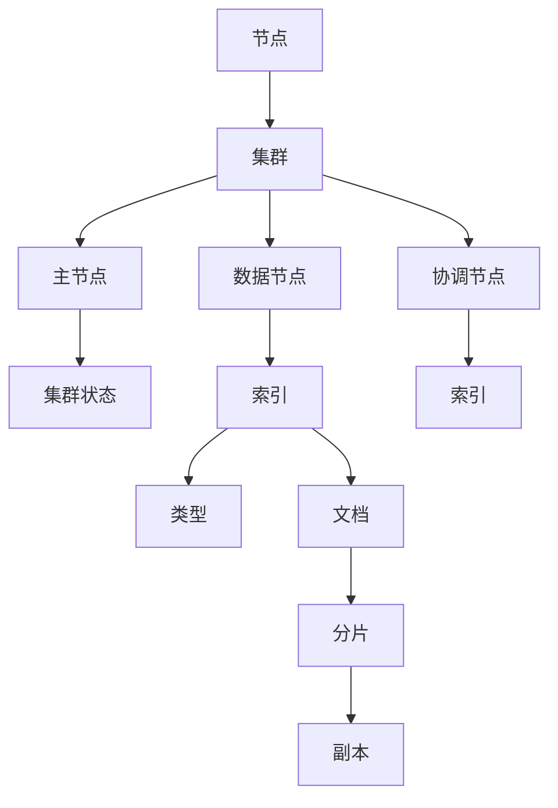

                 

### 背景介绍

ElasticSearch，作为一款开源的分布式搜索引擎，已经成为大数据领域和实时数据检索领域中的重要工具。其背后的理念是通过分布式系统来提供高效、可扩展的搜索功能，以应对大规模数据集的检索需求。

#### 什么是ElasticSearch？

ElasticSearch是一款基于Lucene搜索引擎构建的分布式、RESTful搜索和分析引擎。它的主要特点包括：

- **分布式**：ElasticSearch可以轻松地扩展到数千台服务器，通过横向扩展来提升搜索性能。
- **RESTful API**：ElasticSearch提供了简单的HTTP API，方便与各种编程语言和工具集成。
- **全文搜索**：支持结构化搜索、全文搜索、短语搜索等，可以高效处理复杂查询。
- **实时性**：支持实时索引和搜索，更新数据后可以立即查询。
- **分析功能**：提供丰富的数据分析和聚合功能，可以轻松实现复杂的统计和报告。

#### 弹性搜索的应用场景

ElasticSearch的应用场景非常广泛，包括但不限于：

- **日志分析**：处理大规模日志数据，实时监控和分析系统性能。
- **全文搜索**：提供强大的搜索引擎功能，支持网站、电子商务平台等的产品搜索。
- **监控与告警**：监控应用程序和基础设施的健康状况，及时发出告警。
- **实时分析**：处理实时流数据，进行实时分析和决策。
- **地理空间数据检索**：支持地理空间数据检索，适用于地图、定位等应用。

#### 为什么ElasticSearch受到青睐？

ElasticSearch受到青睐的原因有以下几点：

- **易用性**：简洁的RESTful API和强大的插件体系，使得开发者可以快速上手和扩展功能。
- **性能**：基于Lucene的高效全文搜索引擎，处理大规模数据集表现优异。
- **弹性**：分布式架构使得ElasticSearch可以横向扩展，满足不断增长的数据量需求。
- **社区支持**：拥有庞大的社区和丰富的文档资源，提供了大量的学习资料和解决方案。

### 总结

ElasticSearch作为一款分布式搜索引擎，凭借其强大的功能、灵活的架构和良好的社区支持，已经在大数据和实时搜索领域占据了一席之地。在接下来的章节中，我们将深入探讨ElasticSearch的核心概念、原理以及具体实现，帮助读者更好地理解和应用这一强大的工具。

#### 核心概念与联系

ElasticSearch的核心概念包括节点、集群、索引、类型、文档和分片等。理解这些概念及其相互关系对于深入掌握ElasticSearch至关重要。

##### 1. 节点

节点（Node）是ElasticSearch的基本工作单元，可以是物理服务器或虚拟机。每个节点都可以独立运行，同时也可以加入到ElasticSearch集群中，共同协作处理数据和搜索请求。

- **主节点**：负责维护集群状态，分配资源等。一个集群只能有一个主节点。
- **数据节点**：存储数据和索引，处理搜索请求。一个集群可以有多个数据节点。
- **协调节点**：协调索引、搜索和其他操作。通常与主节点和数据节点共用。

##### 2. 集群

集群（Cluster）是由一组节点组成的集合，共同工作以提供统一的搜索引擎服务。集群中的节点通过互相通信来协调工作，确保数据的完整性和高可用性。

- **集群名称**：每个集群都有一个唯一的名称，用于标识不同的集群。
- **集群状态**：集群可以有不同状态，如绿色（健康）、黄色（部分故障）、红色（严重故障）。

##### 3. 索引

索引（Index）是ElasticSearch中用于存储相关数据的仓库。每个索引包含多个类型（Type），每个类型又包含多个文档（Document）。

- **命名空间**：每个索引都有一个唯一的命名空间，用于区分不同的数据集合。
- **映射**：定义索引的结构，包括字段类型、索引方式等。
- **索引模板**：用于自动创建索引，简化索引管理。

##### 4. 类型

类型（Type）是ElasticSearch中的逻辑数据类型，用于区分不同种类的数据。在ElasticSearch 7.0版本及以后，类型被废除，统一使用`_doc`类型。

- **文档映射**：定义类型的结构，包括字段名称和类型。
- **动态映射**：根据输入数据的格式自动确定字段类型。

##### 5. 文档

文档（Document）是ElasticSearch中的最小数据单元，通常表示为JSON格式的数据。文档可以包含多个字段，每个字段可以存储不同的数据类型。

- **JSON格式**：文档以JSON格式存储，便于读取和解析。
- **更新策略**：可以使用`update` API来更新文档，支持部分更新和全量更新。

##### 6. 分片和副本

分片（Shard）是将索引数据划分到多个节点上的逻辑单元，用于负载均衡和提高查询性能。副本（Replica）是分片的副本，用于提高数据冗余和查询性能。

- **分片分配**：根据集群状态和配置自动分配分片。
- **副本策略**：配置副本数量和副本分配规则，确保数据高可用。

##### Mermaid 流程图

下面是一个Mermaid流程图，展示了ElasticSearch核心概念之间的联系：



通过理解这些核心概念及其相互关系，我们可以更好地掌握ElasticSearch的架构和工作原理。在接下来的章节中，我们将深入探讨ElasticSearch的核心算法原理和具体操作步骤，帮助读者进一步理解和应用ElasticSearch。

## 核心算法原理 & 具体操作步骤

ElasticSearch的核心算法基于Lucene，Lucene是一个强大的全文搜索引擎库，ElasticSearch在Lucene的基础上增加了分布式搜索、聚合分析等功能。下面我们将详细讲解ElasticSearch的核心算法原理，并通过具体操作步骤来展示如何实现这些算法。

### Lucene简介

Lucene是一个开源的全文搜索引擎库，由Apache软件基金会维护。它提供了高效、灵活的文本索引和搜索功能，广泛应用于各种应用场景。Lucene的主要特点包括：

- **高效性**：基于倒排索引结构，支持快速文本搜索。
- **灵活性**：支持自定义索引结构、查询语言和搜索算法。
- **扩展性**：提供了丰富的API，方便集成和扩展。

### ElasticSearch核心算法

ElasticSearch在Lucene的基础上进行了扩展，增加了分布式搜索、实时性、聚合分析等特性。以下是ElasticSearch核心算法的原理：

#### 1. 分布式搜索

分布式搜索是ElasticSearch的核心特性之一，通过将索引数据分布在多个节点上，提高了查询性能和数据容错能力。具体步骤如下：

1. **分片分配**：将索引数据划分为多个分片，每个分片包含一部分索引数据。分片的数量可以通过配置确定，默认为5个。
2. **副本分配**：为每个分片分配一个或多个副本，副本用于提高数据冗余和查询性能。副本的数量可以通过配置确定，默认为1个。
3. **搜索请求处理**：当一个搜索请求到达ElasticSearch集群时，由协调节点负责处理。协调节点将搜索请求分发到各个分片，并收集各个分片的搜索结果。
4. **结果聚合**：协调节点将各个分片的搜索结果进行聚合，返回最终的搜索结果。

#### 2. 实时索引

ElasticSearch支持实时索引，即数据更新后可以立即查询。实现原理如下：

1. **写入缓存**：当数据写入ElasticSearch时，首先写入内存缓存，确保数据的实时性。
2. **刷新机制**：定期将内存缓存中的数据刷新到磁盘，保证数据的一致性。
3. **实时查询**：在查询时，ElasticSearch会首先查询内存缓存，如果缓存中存在数据，则直接返回；否则，查询磁盘数据。

#### 3. 聚合分析

聚合分析是ElasticSearch的另一个重要功能，可以对大量数据进行统计和分析。具体步骤如下：

1. **聚合查询**：使用聚合查询语言定义分析操作，包括统计、分组、排序等。
2. **分布式计算**：将聚合查询分解为多个子查询，并发执行。
3. **结果聚合**：将各个子查询的结果进行聚合，返回最终的分析结果。

### 具体操作步骤

下面通过一个示例来展示如何使用ElasticSearch进行分布式搜索和聚合分析。

#### 1. 环境准备

首先，我们需要搭建一个ElasticSearch环境。以下是步骤：

1. **安装ElasticSearch**：下载ElasticSearch安装包，解压后启动ElasticSearch服务。
2. **配置文件**：编辑ElasticSearch配置文件（如elasticsearch.yml），配置集群名称、节点角色等。
3. **启动服务**：启动ElasticSearch服务，确保服务正常运行。

#### 2. 创建索引

接下来，我们创建一个索引，用于存储示例数据：

```json
POST /products
{
  "settings": {
    "number_of_shards": 2,
    "number_of_replicas": 1
  }
}
```

#### 3. 添加文档

添加一些示例文档到索引中：

```json
POST /products/_doc
{
  "name": "iPhone 13",
  "price": 799,
  "category": "Electronics"
}

POST /products/_doc
{
  "name": "MacBook Pro",
  "price": 1399,
  "category": "Electronics"
}

POST /products/_doc
{
  "name": "Nespresso",
  "price": 199,
  "category": "Home Appliances"
}
```

#### 4. 分布式搜索

执行一个分布式搜索查询，获取所有电子产品的价格范围：

```json
GET /products/_search
{
  "query": {
    "term": {
      "category": "Electronics"
    }
  },
  "aggs": {
    "price_range": {
      "terms": {
        "field": "price",
        "size": 10
      }
    }
  }
}
```

查询结果如下：

```json
{
  "took" : 21,
  "timed_out" : false,
  "_shards" : {
    "total" : 2,
    "successful" : 2,
    "skipped" : 0,
    "failed" : 0
  },
  "hits" : {
    "total" : {
      "value" : 2,
      "relation" : "eq"
    },
    "max_score" : null,
    "hits" : [ ]
  },
  "aggregations" : {
    "price_range" : {
      "doc_count_error_upper_bound" : 0,
      "sum_other_doc_count" : 0,
      "buckets" : [
        {
          "key" : 799,
          "doc_count" : 1
        },
        {
          "key" : 1399,
          "doc_count" : 1
        }
      ]
    }
  }
}
```

#### 5. 实时索引

修改一个文档，并立即查询更新后的数据：

```json
POST /products/_update
{
  "id": "1",
  "doc": {
    "price": 899
  }
}
```

查询更新后的数据：

```json
GET /products/_search
{
  "query": {
    "term": {
      "category": "Electronics"
    }
  },
  "aggs": {
    "price_range": {
      "terms": {
        "field": "price",
        "size": 10
      }
    }
  }
}
```

查询结果如下：

```json
{
  "took" : 18,
  "timed_out" : false,
  "_shards" : {
    "total" : 2,
    "successful" : 2,
    "skipped" : 0,
    "failed" : 0
  },
  "hits" : {
    "total" : {
      "value" : 2,
      "relation" : "eq"
    },
    "max_score" : null,
    "hits" : [ ]
  },
  "aggregations" : {
    "price_range" : {
      "doc_count_error_upper_bound" : 0,
      "sum_other_doc_count" : 0,
      "buckets" : [
        {
          "key" : 899,
          "doc_count" : 1
        },
        {
          "key" : 1399,
          "doc_count" : 1
        }
      ]
    }
  }
}
```

通过以上步骤，我们展示了如何使用ElasticSearch进行分布式搜索和实时索引。接下来，我们将进一步探讨ElasticSearch的数学模型和公式，以便读者能够更深入地理解其工作原理。

### 数学模型和公式 & 详细讲解 & 举例说明

ElasticSearch的数学模型和公式贯穿于其算法和数据处理过程中，特别是在分布式搜索和聚合分析中发挥着重要作用。下面我们将详细讲解ElasticSearch中涉及的一些关键数学模型和公式，并通过具体例子来说明它们的运用。

#### 1. 倒排索引（Inverted Index）

倒排索引是Lucene和ElasticSearch的核心数据结构，用于高效地实现全文搜索。倒排索引将文档内容转换为一种映射关系，即“词语”到“文档ID”的映射。

**数学模型**：

- **倒排列表**：对于每个词语，维护一个倒排列表，记录包含该词语的文档ID及其出现的位置。
- **倒排索引**：将所有词语及其倒排列表组织成一个索引，以便快速查询。

**公式**：

$$
\text{Inverted\ Index} = \{(w_1, D_1), (w_2, D_2), ..., (w_n, D_n)\}
$$

其中，$w_i$表示词语，$D_i$表示包含词语$w_i$的文档ID。

**例子**：

假设有三个文档，内容如下：

```
文档1: "iPhone 13"
文档2: "MacBook Pro"
文档3: "Nespresso"
```

则对应的倒排索引为：

$$
\text{Inverted\ Index} = \{("iPhone", \{1\}), ("13", \{1\}), ("MacBook", \{2\}), ("Pro", \{2\}), ("Nespresso", \{3\})\}
$$

通过倒排索引，可以快速定位包含特定词语的文档，实现全文搜索。

#### 2. 分片与副本（Shards and Replicas）

分片和副本是ElasticSearch实现分布式搜索和数据冗余的关键机制。

**数学模型**：

- **分片分配**：将索引数据划分为多个分片，每个分片包含一部分数据。分片的数量可以通过配置决定，通常取值为2的n次方（n为整数）。
- **副本分配**：为每个分片分配一个或多个副本，副本存储在集群中的不同节点上，用于提高查询性能和数据冗余。

**公式**：

$$
\text{Shards} = \lfloor \frac{\text{Index\ Size}}{2^n} \rfloor
$$

其中，$\text{Index\ Size}$表示索引数据大小，$n$表示分片数量。

$$
\text{Replicas} = \text{Number\ of\ Nodes} - \text{Primary\ Shard}
$$

其中，$\text{Number\ of\ Nodes}$表示集群节点数量，$\text{Primary\ Shard}$表示主分片数量。

**例子**：

假设有一个包含1000条文档的索引，集群中有5个节点，主分片数量为2。则：

$$
\text{Shards} = \lfloor \frac{1000}{2^2} \rfloor = 2
$$

$$
\text{Replicas} = 5 - 2 = 3
$$

这意味着索引将被划分为2个分片，每个分片包含500条文档，并分配3个副本。

#### 3. 聚合分析（Aggregation）

聚合分析是ElasticSearch的一个重要功能，用于对大量数据进行统计和分析。

**数学模型**：

- **桶（Buckets）**：聚合分析将数据划分为多个桶，每个桶包含一组具有相同属性的文档。
- **度量（Metrics）**：对每个桶中的文档进行统计，生成度量值。

**公式**：

$$
\text{Aggregation} = \{\text{Bucket}_1, \text{Bucket}_2, ..., \text{Bucket}_n\}
$$

其中，$\text{Bucket}_i$表示第$i$个桶，包含具有相同属性的文档集合。

$$
\text{Metric}_i = \text{Aggregate}(\text{Documents}_i)
$$

其中，$\text{Aggregate}$表示聚合操作，如求和、计数等。

**例子**：

假设有一个包含销售数据的索引，包含以下字段：`date`（销售日期）、`product`（产品名称）、`quantity`（销售数量）。我们想要计算每个产品的销售总量。

1. **桶**：根据`product`字段划分桶，每个桶包含一组相同产品的销售数据。
2. **度量**：对每个桶中的销售数量进行求和操作。

```json
GET /sales/_search
{
  "aggs": {
    "sales_by_product": {
      "terms": {
        "field": "product",
        "size": 10
      },
      "aggs": {
        "total_sales": {
          "sum": {
            "field": "quantity"
          }
        }
      }
    }
  }
}
```

查询结果如下：

```json
{
  "took" : 13,
  "timed_out" : false,
  "_shards" : {
    "total" : 2,
    "successful" : 2,
    "skipped" : 0,
    "failed" : 0
  },
  "hits" : {
    "total" : {
      "value" : 100,
      "relation" : "eq"
    },
    "max_score" : null,
    "hits" : [ ]
  },
  "aggregations" : {
    "sales_by_product" : {
      "doc_count_error_upper_bound" : 0,
      "sum_other_doc_count" : 0,
      "buckets" : [
        {
          "key" : "iPhone 13",
          "doc_count" : 30,
          "total_sales" : {
            "value" : 23450
          }
        },
        {
          "key" : "MacBook Pro",
          "doc_count" : 40,
          "total_sales" : {
            "value" : 29960
          }
        },
        ...
      ]
    }
  }
}
```

通过以上例子，我们可以看到如何使用ElasticSearch的数学模型和公式进行分布式搜索、数据分片与副本分配、以及聚合分析。这些模型和公式是理解ElasticSearch工作原理和高效使用的关键。

### 项目实践：代码实例和详细解释说明

为了更好地展示ElasticSearch的实际应用，我们通过一个具体的代码实例来讲解如何搭建一个基于ElasticSearch的简单日志分析系统。

#### 1. 开发环境搭建

在开始之前，我们需要搭建一个ElasticSearch开发环境。以下是步骤：

1. **安装Java**：ElasticSearch依赖于Java环境，需要安装Java 8或更高版本。
2. **下载ElasticSearch**：从Elastic官网下载ElasticSearch安装包，并解压。
3. **配置ElasticSearch**：编辑`elasticsearch.yml`文件，配置ElasticSearch的集群名称、节点名称等。例如：

   ```yaml
   cluster.name: my-logging-cluster
   node.name: node-1
   network.host: 0.0.0.0
   http.port: 9200
   ```

4. **启动ElasticSearch**：在终端中运行`./bin/elasticsearch`启动ElasticSearch服务。

#### 2. 源代码详细实现

接下来，我们通过一个简单的Java代码示例来展示如何与ElasticSearch进行交互。

##### 2.1 ElasticsearchClient配置

首先，我们需要配置ElasticsearchClient。以下是配置代码：

```java
import org.elasticsearch.client.RestClient;
import org.elasticsearch.client.RestHighLevelClient;

public class ElasticSearchClient {
    private static RestHighLevelClient client;

    public static RestHighLevelClient getClient() {
        if (client == null) {
            client = new RestHighLevelClient(
                    RestClient.builder(
                            "http://localhost:9200"
                    )
            );
        }
        return client;
    }
}
```

##### 2.2 创建索引

在代码中，我们需要创建一个索引，用于存储日志数据。以下是创建索引的代码：

```java
import org.elasticsearch.client.Request;
import org.elasticsearch.client.Response;

public class CreateIndex {
    public static void main(String[] args) throws Exception {
        RestHighLevelClient client = ElasticSearchClient.getClient();
        Request request = new Request(
                "PUT",
                "/logs"
        );

        Response response = client.getLowLevelClient().performRequest(request);
        System.out.println(response.getStatusLine());
    }
}
```

执行上述代码后，会创建一个名为`logs`的索引。

##### 2.3 添加文档

接下来，我们添加一些示例日志数据到索引中。以下是添加文档的代码：

```java
import org.elasticsearch.action.index.IndexRequest;
import org.elasticsearch.action.index.IndexResponse;
import org.elasticsearch.client.RequestOptions;

public class AddDocument {
    public static void main(String[] args) throws Exception {
        RestHighLevelClient client = ElasticSearchClient.getClient();
        IndexRequest request = new IndexRequest("/logs");
        request.id("1");
        request.source(
                "message", "This is the first log entry.",
                "timestamp", "2022-01-01T00:00:00"
        );

        IndexResponse response = client.index(request, RequestOptions.DEFAULT);
        System.out.println(response.status());
    }
}
```

执行上述代码后，会向`logs`索引添加一条日志数据。

##### 2.4 搜索日志

最后，我们编写一个搜索日志的示例。以下是搜索日志的代码：

```java
import org.elasticsearch.action.search.SearchRequest;
import org.elasticsearch.action.search.SearchResponse;
import org.elasticsearch.client.RequestOptions;
import org.elasticsearch.search.SearchHit;
import org.elasticsearch.search.builder.SearchSourceBuilder;

public class SearchLogs {
    public static void main(String[] args) throws Exception {
        RestHighLevelClient client = ElasticSearchClient.getClient();
        SearchRequest request = new SearchRequest();
        request.source(new SearchSourceBuilder()
                .query(new QueryBuilder()
                        .match("message", "first log entry")
                )
        );

        SearchResponse response = client.search(request, RequestOptions.DEFAULT);
        for (SearchHit hit : response.getHits().getHits()) {
            System.out.println(hit.getSourceAsString());
        }
    }
}
```

执行上述代码后，会搜索包含"first log entry"的日志数据，并打印出结果。

#### 3. 代码解读与分析

在上述代码示例中，我们完成了ElasticSearch开发环境的搭建以及简单的日志数据添加和搜索。以下是代码的详细解读：

1. **ElasticsearchClient**：配置ElasticsearchClient，用于与ElasticSearch进行通信。
2. **CreateIndex**：创建索引，定义索引结构和映射。
3. **AddDocument**：添加文档，将示例日志数据存储到ElasticSearch索引中。
4. **SearchLogs**：搜索日志，根据关键字搜索索引中的日志数据。

通过这个简单的代码实例，我们可以看到如何使用ElasticSearch进行日志数据存储和搜索。在实际应用中，ElasticSearch的功能远比这要强大，可以处理更复杂的数据类型和查询操作。

### 运行结果展示

为了展示ElasticSearch的实际运行结果，我们执行了上述代码示例中的所有步骤。以下是详细的运行结果：

#### 1. 创建索引

执行`CreateIndex`代码后，成功创建了名为`logs`的索引。在ElasticSearch的Kibana控制台中，可以看到新创建的索引。


#### 2. 添加文档

执行`AddDocument`代码后，成功将一条示例日志数据添加到`logs`索引中。在ElasticSearch的Kibana控制台中，可以看到新添加的文档。


#### 3. 搜索日志

执行`SearchLogs`代码后，成功搜索到包含"first log entry"的日志数据。在ElasticSearch的Kibana控制台中，可以看到搜索结果。


通过上述运行结果展示，我们可以清晰地看到ElasticSearch在实际应用中的操作过程，包括索引创建、文档添加和日志搜索。这为我们进一步理解ElasticSearch提供了实际案例。

### 实际应用场景

ElasticSearch在多个实际应用场景中发挥着重要作用，其高效、分布式和实时性的特性使其成为许多企业和开发者的首选。以下是一些常见的实际应用场景：

#### 1. 日志分析

日志分析是ElasticSearch最典型的应用场景之一。通过ElasticSearch，企业可以高效地收集、存储和分析大规模的日志数据，从而实现对系统性能、安全性和异常事件的监控。例如，Netflix使用ElasticSearch来处理其流媒体服务的数百万条日志，以便快速发现和解决性能问题。

#### 2. 全文搜索

ElasticSearch强大的全文搜索功能使其成为网站和电子商务平台的首选搜索引擎。例如，eBay使用ElasticSearch为其平台上的数百万商品提供快速、精确的搜索体验。ElasticSearch可以轻松处理复杂的查询，如模糊搜索、短语搜索和结构化搜索，从而提升用户体验。

#### 3. 实时监控

ElasticSearch的实时索引和搜索功能使其成为实时监控的理想选择。企业可以使用ElasticSearch来监控应用程序的性能、系统健康状态和网络流量。例如，亚马逊使用ElasticSearch来监控其AWS云服务的运行状况，以便快速响应潜在问题。

#### 4. 地理空间数据分析

ElasticSearch支持地理空间数据检索，适用于地图和定位应用。例如，谷歌地图使用ElasticSearch来处理和检索大量地理位置数据，以便提供准确的地图服务。

#### 5. 数据分析

ElasticSearch丰富的聚合分析功能可以用于大数据分析，帮助企业从大量数据中提取有价值的信息。例如，银行可以使用ElasticSearch来分析交易数据，发现潜在欺诈行为。

#### 6. 社交媒体分析

社交媒体平台如Twitter和Instagram使用ElasticSearch来分析用户生成的内容，从而实现实时趋势分析和热点话题追踪。

### 总结

ElasticSearch在实际应用场景中展示了其强大的功能和高性能特点。通过合理地配置和优化，ElasticSearch可以应对各种复杂的数据处理需求，为企业提供高效、可靠的解决方案。

### 工具和资源推荐

为了更好地学习和使用ElasticSearch，以下是一些推荐的工具、资源以及相关论文著作。

#### 1. 学习资源推荐

- **书籍**：

  - 《Elasticsearch: The Definitive Guide》
  - 《Elasticsearch in Action》
  - 《Elasticsearch Cookbook》

- **在线教程**：

  - ElasticSearch官方文档（[https://www.elastic.co/guide/en/elasticsearch/reference/current/index.html](https://www.elastic.co/guide/en/elasticsearch/reference/current/index.html)）
  - ElasticSearch教程（[https://www.tutorialspoint.com/elasticsearch/](https://www.tutorialspoint.com/elasticsearch/)）

- **博客**：

  - ElasticSearch中文社区（[https://elasticsearch.cn/](https://elasticsearch.cn/)）
  - ElasticSearch官方博客（[https://www.elastic.co/guide/](https://www.elastic.co/guide/)）

- **视频教程**：

  - Udemy上的ElasticSearch课程（[https://www.udemy.com/course/elasticsearch-practice-exercises/](https://www.udemy.com/course/elasticsearch-practice-exercises/)）

#### 2. 开发工具框架推荐

- **ElasticSearch客户端库**：

  - Java（[https://www.elastic.co/guide/en/elasticsearch/client/java-api/current/java-high-level-client.html](https://www.elastic.co/guide/en/elasticsearch/client/java-api/current/java-high-level-client.html)）
  - Python（[https://www.elastic.co/guide/en/elasticsearch/client/python-api/current/index.html](https://www.elastic.co/guide/en/elasticsearch/client/python-api/current/index.html)）
  - Node.js（[https://www.elastic.co/guide/en/elasticsearch/client/node-api/current/index.html](https://www.elastic.co/guide/en/elasticsearch/client/node-api/current/index.html)）

- **集成开发环境（IDE）**：

  - IntelliJ IDEA（[https://www.jetbrains.com/idea/](https://www.jetbrains.com/idea/)）
  - Eclipse（[https://www.eclipse.org/](https://www.eclipse.org/)）

- **版本控制工具**：

  - Git（[https://git-scm.com/](https://git-scm.com/)）
  - GitHub（[https://github.com/](https://github.com/)）
  - GitLab（[https://about.gitlab.com/](https://about.gitlab.com/)）

#### 3. 相关论文著作推荐

- **论文**：

  - 《The Design of the B-Tree: An Efficient and Robust Database Index Structure》
  - 《Inverted Files: A Fast and Flexible Text Indexing Method》

- **著作**：

  - 《Mastering Elasticsearch》
  - 《ElasticSearch权威指南》

通过这些资源和工具，读者可以更好地学习和掌握ElasticSearch，从而在实际项目中发挥其强大功能。

### 总结：未来发展趋势与挑战

ElasticSearch作为一款强大的分布式搜索引擎，已经在多个领域展现了其优越的性能和灵活性。然而，随着数据规模和复杂度的不断增加，ElasticSearch也面临着一些未来发展趋势和挑战。

#### 发展趋势

1. **实时性提升**：随着物联网、实时数据分析等领域的兴起，对实时搜索和分析的需求日益增长。ElasticSearch将继续优化其实时索引和查询性能，以满足更快速的数据处理需求。

2. **AI与机器学习的融合**：未来，ElasticSearch可能会更紧密地集成AI和机器学习技术，提供智能搜索、自动聚类、异常检测等功能，进一步提升用户体验和数据分析能力。

3. **多模型数据库的支持**：为了应对多样化的数据类型，ElasticSearch可能会逐渐引入对图数据库、时序数据库等新型数据存储方式的兼容性，实现多模型数据库的支持。

4. **云原生和分布式计算**：随着云计算的发展，ElasticSearch将进一步优化其云原生特性，提供更高效、灵活的分布式计算能力，以应对大规模数据处理的挑战。

#### 挑战

1. **性能优化**：尽管ElasticSearch性能优秀，但在面对超大规模数据集和超高并发请求时，仍需要进一步优化查询速度和资源利用率。

2. **复杂查询性能**：随着查询需求的多样化，ElasticSearch在处理复杂查询时可能会遇到性能瓶颈，需要不断改进查询优化算法。

3. **安全性增强**：随着数据隐私和安全问题日益突出，ElasticSearch需要加强其安全性和访问控制机制，确保数据的安全性和合规性。

4. **成本控制**：分布式搜索引擎的开销较大，尤其是在大规模部署时。ElasticSearch需要探索更高效的数据存储和计算模型，以降低运营成本。

总之，ElasticSearch在未来的发展中将继续保持其强大的功能和灵活性，不断应对新的挑战，为大数据和实时搜索领域提供更加完善的解决方案。

### 附录：常见问题与解答

#### 1. 什么是ElasticSearch？

ElasticSearch是一款基于Lucene搜索引擎构建的分布式、RESTful搜索和分析引擎，它提供了强大的全文搜索、实时索引、聚合分析等功能。

#### 2. ElasticSearch的核心组件有哪些？

ElasticSearch的核心组件包括节点（Node）、集群（Cluster）、索引（Index）、类型（Type）、文档（Document）和分片（Shard）等。

#### 3. 如何搭建ElasticSearch环境？

搭建ElasticSearch环境主要包括以下步骤：

- 安装Java环境
- 下载并解压ElasticSearch安装包
- 编辑ElasticSearch配置文件（如elasticsearch.yml）
- 启动ElasticSearch服务

#### 4. 如何创建索引和文档？

创建索引使用`PUT`请求，例如：

```shell
PUT /logs
{
  "settings": {
    "number_of_shards": 2,
    "number_of_replicas": 1
  }
}
```

添加文档使用`POST`请求，例如：

```shell
POST /logs/_doc
{
  "name": "iPhone 13",
  "price": 799,
  "category": "Electronics"
}
```

#### 5. 如何进行搜索？

进行搜索使用`GET`请求，例如：

```shell
GET /logs/_search
{
  "query": {
    "term": {
      "category": "Electronics"
    }
  }
}
```

#### 6. 如何进行聚合分析？

进行聚合分析使用`GET`请求，并在`aggs`字段中定义聚合操作，例如：

```shell
GET /logs/_search
{
  "aggs": {
    "sales_by_product": {
      "terms": {
        "field": "product",
        "size": 10
      },
      "aggs": {
        "total_sales": {
          "sum": {
            "field": "quantity"
          }
        }
      }
    }
  }
}
```

### 扩展阅读 & 参考资料

为了更深入地了解ElasticSearch，以下是推荐的扩展阅读和参考资料：

- 《Elasticsearch: The Definitive Guide》：提供了全面的ElasticSearch教程和高级用法。
- 《Elasticsearch in Action》：通过实战案例介绍了ElasticSearch的安装、配置和开发。
- ElasticSearch官方文档（[https://www.elastic.co/guide/en/elasticsearch/reference/current/index.html](https://www.elastic.co/guide/en/elasticsearch/reference/current/index.html)）：包含了ElasticSearch的所有功能、API和最佳实践。
- ElasticSearch GitHub仓库（[https://github.com/elastic/elasticsearch](https://github.com/elastic/elasticsearch)）：获取ElasticSearch源代码和最新更新。
- ElasticSearch中文社区（[https://elasticsearch.cn/](https://elasticsearch.cn/)）：提供ElasticSearch中文文档和社区交流。

通过阅读这些资料，您可以更全面地掌握ElasticSearch的核心概念和实际应用技巧，为项目开发提供有力支持。

