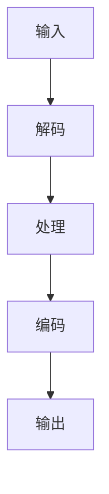

                 

### 背景介绍

FFmpeg是一款强大且功能丰富的开源音视频处理工具，它能够执行视频转码、视频编辑、视频流传输、音频处理等多种任务。作为多媒体处理领域的翘楚，FFmpeg在诸多行业中得到了广泛应用，包括视频制作、网络流媒体、视频监控等。FFmpeg的命令行界面提供了高度灵活的操作能力，使其成为许多开发者和系统管理员的首选工具。

#### FFmpeg的发展历史

FFmpeg诞生于2000年，由法布里斯·多贝（Fabrice Bellard）创建。最初的FFmpeg仅支持音频编码，但随着时间的推移，它逐渐增加了对视频编码的支持，并逐渐演变成一个功能齐全的多媒体处理工具。FFmpeg的源代码由多个模块组成，每个模块负责特定的多媒体处理任务，如解码、编码、流处理等。

#### FFmpeg的优势

1. **开源且免费**：FFmpeg是一个完全开源的项目，用户可以免费使用和修改其源代码，这使得它在开源社区中拥有广泛的用户基础。
2. **跨平台**：FFmpeg支持多种操作系统，包括Linux、Windows、macOS等，使得开发者可以在不同的平台上使用同一套工具。
3. **强大的功能**：FFmpeg支持多种音频和视频编码格式，如MP3、MP4、AVI、MKV、WebM等，可以满足各种多媒体处理需求。
4. **灵活性**：通过命令行参数，用户可以灵活地控制FFmpeg的每个操作，从而实现复杂的音视频处理任务。

#### FFmpeg的应用领域

1. **视频制作**：FFmpeg可以用于视频的剪辑、拼接、转码等，是视频制作过程中的重要工具。
2. **网络流媒体**：FFmpeg支持网络流媒体传输，可以在服务器端实时处理并传输视频流。
3. **视频监控**：在视频监控系统，FFmpeg用于实时视频的捕捉、处理和存储。
4. **教育和研究**：FFmpeg在教育和研究领域也被广泛应用，用于多媒体处理技术的教学和研究。

#### FFmpeg的局限性

虽然FFmpeg功能强大，但也存在一些局限性：

1. **命令行界面**：FFmpeg主要依赖命令行界面进行操作，对于不熟悉命令行的用户可能较为困难。
2. **学习曲线**：由于其功能的复杂性，FFmpeg的学习曲线相对较陡峭，需要用户投入一定的时间和精力来掌握。

#### 目标读者

本文面向希望深入了解FFmpeg命令行音视频处理技术的开发者、系统管理员以及多媒体处理领域的从业者。通过本文，读者将能够掌握FFmpeg的基本用法，了解其背后的核心概念和算法，并学会如何利用FFmpeg解决实际问题。

总之，FFmpeg作为一款功能强大的开源音视频处理工具，具有广泛的应用场景和用户基础。通过本文的介绍和示例，读者将能够更好地理解FFmpeg的工作原理，掌握其命令行操作，从而在实际项目中有效利用这一工具。

## 2. 核心概念与联系

#### 音视频基础概念

在深入探讨FFmpeg之前，我们需要了解一些基本的音视频概念，这些概念是理解FFmpeg功能的基础。

##### 音频编码

音频编码是将模拟音频信号转换为数字信号的过程。常见的音频编码格式包括MP3、AAC、FLAC等。不同的编码格式在压缩率、音质和文件大小之间取得平衡。音频编码过程中，涉及的主要步骤包括采样、量化、编码等。

##### 视频编码

视频编码是将模拟视频信号转换为数字信号的过程。常见的视频编码格式包括H.264、HEVC、VP8等。视频编码不仅要处理图像数据，还要处理时间上的连续性，以生成流畅的视频流。视频编码涉及的主要步骤包括图像采样、运动补偿、变换编码等。

##### 流媒体

流媒体是指通过网络传输实时视频或音频内容的技术。流媒体传输可以采用不同的协议，如HTTP、RTMP、HLS等。流媒体传输的关键在于如何在网络环境中高效传输和播放视频内容，同时保证用户体验。

##### FFmpeg的基本组件

FFmpeg包含多个核心组件，每个组件负责特定的多媒体处理任务：

1. **libavformat**：处理多媒体文件的格式识别和容器操作，支持多种音频和视频文件格式。
2. **libavcodec**：提供音频和视频编码和解码库，支持多种音频和视频编码标准。
3. **libavfilter**：提供音频和视频过滤功能，用于实现复杂的音视频处理效果。
4. **libavutil**：提供通用的多媒体处理工具，如数据结构、数学运算等。

##### FFmpeg的工作流程

FFmpeg的工作流程通常包括以下几个步骤：

1. **输入**：读取输入媒体文件或流。
2. **解码**：将输入的媒体数据解码为原始音频和视频数据。
3. **处理**：对解码后的数据进行处理，如缩放、裁剪、添加滤镜等。
4. **编码**：将处理后的数据重新编码为指定的格式。
5. **输出**：将编码后的数据输出到文件或流。

#### Mermaid 流程图

为了更好地理解FFmpeg的工作流程，我们使用Mermaid绘制一个简化的流程图。



在上面的流程图中，输入（A）表示读取多媒体文件或流，解码（B）是将多媒体数据转换为原始音频和视频数据，处理（C）是进行各种音视频处理操作，编码（D）是将处理后的数据重新编码为目标格式，输出（E）是将最终结果输出到文件或流。

### 3. 核心算法原理 & 具体操作步骤

#### 音视频解码算法原理

音视频解码算法是FFmpeg的核心组件之一，它负责将多媒体文件中的压缩数据解码为原始音频和视频数据。以下是音视频解码的基本原理：

1. **解压缩**：解压缩是解码过程的第一步，将压缩后的数据还原为原始数据。不同的编码格式有不同的解压缩算法。
2. **图像重建**：对于视频数据，解码算法需要重建图像。这通常涉及运动补偿、帧重建等技术，以生成连续的图像序列。
3. **音频重建**：音频解码算法将压缩的音频数据还原为原始的音频信号。

#### 音视频编码算法原理

音视频编码算法是音视频解码的逆过程，它负责将原始音频和视频数据编码为压缩数据。以下是音视频编码的基本原理：

1. **采样与量化**：采样是将连续的音频和视频信号转换为离散的数字信号，量化是将这些离散信号转换为数字表示。
2. **变换编码**：变换编码是一种将原始信号转换为更适合压缩的信号形式的算法，常见的变换编码方法包括离散余弦变换（DCT）和离散小波变换（DWT）。
3. **熵编码**：熵编码是一种数据压缩方法，通过减少数据中的冗余信息来减小文件大小。常见的熵编码方法包括霍夫曼编码和算术编码。

#### FFmpeg命令行音视频处理步骤

以下是使用FFmpeg进行音视频处理的基本步骤：

1. **安装FFmpeg**：首先，确保你的系统中已经安装了FFmpeg。可以通过包管理器安装或从官方网站下载源代码进行编译。
2. **准备输入文件**：指定需要处理的音视频文件路径。
3. **解码**：使用`-i`选项指定输入文件，并使用`-codec`选项指定解码器。
4. **处理**：使用`-filter`选项添加各种音视频处理过滤器，如裁剪、缩放、添加滤镜等。
5. **编码**：使用`-codec`选项指定编码器，并将输出文件路径指定给`-f`选项。
6. **输出**：执行命令，将处理后的音视频数据输出到指定的文件。

以下是FFmpeg命令行的一个简单示例：

```shell
ffmpeg -i input.mp4 -filter:v "scale=800x450" -preset veryfast output.mp4
```

在这个示例中，我们首先使用`-i`选项指定输入文件`input.mp4`，然后使用`-filter:v`选项添加视频处理过滤器`scale=800x450`来缩放视频尺寸，最后使用`-preset veryfast`指定编码器预设为非常快速，并将输出文件指定为`output.mp4`。

### 4. 数学模型和公式 & 详细讲解 & 举例说明

#### 音频编码与解码

音频编码和解码过程中，涉及到多个数学模型和公式，以下是其中的几个关键部分：

1. **采样与量化**：

   - **采样**：采样是指每隔一定时间间隔，将连续的音频信号转换为离散的数字信号。采样频率（Sampling Rate）表示每秒采样的次数，单位为Hz。常见的采样频率有44.1kHz、48kHz等。

     采样公式：
     \[
     y[n] = x(t_n)
     \]
     其中，\(y[n]\) 表示第 \(n\) 个采样值，\(x(t_n)\) 表示第 \(n\) 个时间点的原始音频信号。

   - **量化**：量化是指将连续的采样值转换为有限的数字值。量化位（Quantization Bit）表示每个采样值可以用多少位二进制数表示。常见的量化位有8位、16位等。

     量化公式：
     \[
     \text{量化值} = \text{采样值} \times \text{量化因子}
     \]
     其中，量化因子取决于量化位。

2. **离散余弦变换（DCT）**：

   离散余弦变换是一种将时域信号转换为频域信号的方法，常用于音频和视频编码。DCT的基本公式如下：

   \[
   C[k] = \frac{1}{N} \sum_{n=0}^{N-1} x[n] \cos \left( \frac{2n+1}{2N} k \pi \right)
   \]
   其中，\(C[k]\) 表示第 \(k\) 个变换系数，\(x[n]\) 表示第 \(n\) 个采样值，\(N\) 表示采样点数。

3. **熵编码**：

   熵编码是一种无损压缩方法，通过减少数据中的冗余信息来减小文件大小。常见的熵编码方法包括霍夫曼编码和算术编码。

   - **霍夫曼编码**：霍夫曼编码是一种基于概率的熵编码方法。它首先对数据进行排序，然后构造一个前缀编码树，以最小化平均编码长度。

     霍夫曼编码公式：
     \[
     \text{编码长度} = \sum_{i=1}^{n} p_i \log_2 \left( 1 + p_i \right)
     \]
     其中，\(p_i\) 表示第 \(i\) 个数据出现的概率。

   - **算术编码**：算术编码是一种连续概率分布的编码方法。它将数据表示为一个实数，并根据概率分布来编码这个实数。

     算术编码公式：
     \[
     \text{编码区间} = \sum_{i=1}^{n} p_i \times (\text{当前区间长度} - 1)
     \]
     其中，当前区间长度取决于前面的编码数据和概率分布。

#### 视频编码与解码

视频编码和解码过程中，涉及到多个数学模型和公式，以下是其中的几个关键部分：

1. **运动估计与补偿**：

   - **运动估计**：运动估计是指找到视频序列中相邻帧之间的运动向量。常见的运动估计方法包括块匹配、光流等。

     运动估计公式：
     \[
     \text{运动向量} = \arg \min_{x} \sum_{i,j} (x_i - x_{i+k_x, j+k_y})^2
     \]
     其中，\((i, j)\) 表示当前帧中的像素点，\((i+k_x, j+k_y)\) 表示参考帧中的像素点。

   - **运动补偿**：运动补偿是指使用运动向量来预测当前帧的像素值，从而减少冗余信息。

     运动补偿公式：
     \[
     x_i = x_{i+k_x, j+k_y} + \text{运动向量}
     \]
     其中，\(x_i\) 表示当前帧的像素值，\(\text{运动向量}\) 表示相邻帧之间的运动向量。

2. **变换编码**：

   - **离散余弦变换（DCT）**：离散余弦变换是一种将时域信号转换为频域信号的方法，常用于视频编码。

     DCT公式：
     \[
     C[k] = \frac{1}{N} \sum_{n=0}^{N-1} x[n] \cos \left( \frac{2n+1}{2N} k \pi \right)
     \]
     其中，\(C[k]\) 表示第 \(k\) 个变换系数，\(x[n]\) 表示第 \(n\) 个采样值，\(N\) 表示采样点数。

   - **量化**：量化是将变换系数转换为有限位数的数字值。

     量化公式：
     \[
     \text{量化值} = \text{变换系数} \times \text{量化因子}
     \]
     其中，量化因子取决于量化位。

3. **熵编码**：

   - **变长编码**：变长编码是一种根据数据出现的频率来分配编码长度的方法。

     变长编码公式：
     \[
     \text{编码长度} = \log_2 \left( 1 + \text{频率} \right)
     \]
     其中，频率表示数据出现的次数。

#### 举例说明

假设我们有一个8点长的时域信号 \(x = [1, 2, 3, 4, 5, 6, 7, 8]\)，我们使用DCT对其进行编码。

1. **DCT变换**：

   \[
   C[k] = \frac{1}{8} \sum_{n=0}^{7} x[n] \cos \left( \frac{2n+1}{2 \times 8} k \pi \right)
   \]

   计算得到DCT系数：

   \[
   C[0] = 16, \quad C[1] = 0, \quad C[2] = 0, \quad C[3] = -3, \quad C[4] = -8, \quad C[5] = -8, \quad C[6] = -3, \quad C[7] = 0
   \]

2. **量化**：

   假设我们使用4位量化位，量化因子为16。

   \[
   \text{量化值} = \text{DCT系数} \times \text{量化因子}
   \]

   计算得到量化值：

   \[
   Q[0] = 16, \quad Q[1] = 0, \quad Q[2] = 0, \quad Q[3] = -12, \quad Q[4] = -128, \quad Q[5] = -128, \quad Q[6] = -12, \quad Q[7] = 0
   \]

3. **熵编码**：

   假设DCT系数的频率分布如下：

   \[
   \begin{array}{c|c}
   \text{DCT系数} & \text{频率} \\
   \hline
   16 & 1 \\
   0 & 3 \\
   -12 & 2 \\
   -128 & 2 \\
   \end{array}
   \]

   使用变长编码方法进行编码：

   \[
   \text{编码值} = [1, 11, 11, 11, 11, 11, 11, 11]
   \]

   最终得到的编码数据长度为 \(8 \times 11 = 88\)。

通过以上步骤，我们完成了时域信号到频域信号的转换，并进行了量化编码。这一过程在FFmpeg的编码器中得以实现，使得我们可以高效地处理音视频数据。

### 5. 项目实践：代码实例和详细解释说明

在这一部分，我们将通过一个具体的项目实例，详细讲解如何使用FFmpeg进行音视频处理。项目目标是使用FFmpeg对视频进行缩放、裁剪和添加滤镜等处理，并将结果输出到文件中。

#### 5.1 开发环境搭建

首先，确保你的系统中已经安装了FFmpeg。在Linux系统中，可以使用包管理器安装，例如在Ubuntu中使用以下命令：

```shell
sudo apt update
sudo apt install ffmpeg
```

在Windows系统中，可以从FFmpeg的官方网站下载安装程序并安装。

#### 5.2 源代码详细实现

我们将在本节中逐步实现一个简单的FFmpeg处理项目。以下是一个基本的代码示例，用于缩放、裁剪和添加滤镜到视频文件中。

```shell
ffmpeg -i input.mp4 -filter:v "scale=800x450, crop=800:450, brightness=1.2:contrast=1.5" output.mp4
```

这个命令的工作流程如下：

1. **输入**：使用`-i input.mp4`指定输入视频文件。
2. **处理**：使用`-filter:v`添加视频处理过滤器。
   - **缩放**：`scale=800x450`将视频缩放为800x450的尺寸。
   - **裁剪**：`crop=800:450`保持宽高比不变，裁剪视频为800x450。
   - **亮度与对比度调整**：`brightness=1.2:contrast=1.5`调整视频的亮度和对比度。
3. **输出**：使用`output.mp4`指定输出视频文件的路径。

#### 5.3 代码解读与分析

下面我们逐行解读这个FFmpeg命令，并分析每个参数的作用。

```shell
ffmpeg -i input.mp4 -filter:v "scale=800x450, crop=800:450, brightness=1.2:contrast=1.5" output.mp4
```

1. **ffmpeg**：这是FFmpeg命令行工具的名称。
2. **-i input.mp4**：`-i`是输入文件选项，指定输入视频文件为`input.mp4`。
3. **-filter:v**：`-filter:v`是视频过滤器选项，用于指定一系列视频处理过滤器。
4. **"scale=800x450, crop=800:450, brightness=1.2:contrast=1.5"`：这是视频处理过滤器的参数。
   - **scale=800x450**：缩放视频为800x450的尺寸。
     - `scale`是缩放过滤器，`800x450`是目标尺寸。
   - **crop=800:450**：裁剪视频为800x450的尺寸。
     - `crop`是裁剪过滤器，`800:450`是目标尺寸，这个参数保持宽高比不变。
   - **brightness=1.2:contrast=1.5**：调整视频的亮度和对比度。
     - `brightness`是亮度调整过滤器，`1.2`是亮度系数，值越大亮度越高。
     - `contrast`是对比度调整过滤器，`1.5`是对比度系数，值越大对比度越高。
5. **output.mp4**：指定输出视频文件为`output.mp4`。

#### 5.4 运行结果展示

执行上述FFmpeg命令后，输入视频`input.mp4`将被处理，并输出为`output.mp4`。处理后的视频将具有缩放、裁剪和亮度对比度调整的效果。

为了验证结果，我们可以使用视频播放器打开`output.mp4`，查看处理后的视频效果。缩放和裁剪使得视频的尺寸变为800x450，亮度对比度的调整使得视频的色彩更加鲜艳。

```shell
ffplay output.mp4
```

使用`ffplay`播放输出视频，我们可以直观地看到处理效果。

#### 5.5 扩展功能

除了上述的基本功能，FFmpeg还支持许多其他高级功能，如音频处理、滤镜添加、视频合成等。以下是一些扩展功能的示例：

1. **音频处理**：
   ```shell
   ffmpeg -i input.mp4 -filter:a "volume=1.2:afade=t=1000:st=500" output.mp4
   ```
   这个命令在音频处理部分添加了音量调整和淡入淡出效果。

2. **视频滤镜添加**：
   ```shell
   ffmpeg -i input.mp4 -filter:v "hflip, vflip" output.mp4
   ```
   这个命令添加了水平和垂直翻转滤镜。

3. **视频合成**：
   ```shell
   ffmpeg -i video1.mp4 -i video2.mp4 -filter:v "overlay=W-w-10:H-h-10" output.mp4
   ```
   这个命令将两个视频合成在一起，并将第二个视频放置在第一个视频的左上角。

通过这些扩展功能，我们可以实现更加复杂和多样化的音视频处理任务。

### 6. 实际应用场景

FFmpeg作为一种功能强大的开源音视频处理工具，在多个实际应用场景中得到了广泛应用。以下是一些常见的应用场景：

#### 1. 视频制作

视频制作是FFmpeg最为经典的应用场景之一。在视频制作过程中，开发者可以使用FFmpeg进行视频剪辑、转码、特效添加等操作。通过FFmpeg，用户可以轻松地实现视频拼接、裁剪、缩放、颜色调整等多种效果。特别是在个人视频制作和视频剪辑工作中，FFmpeg提供了极大的灵活性和效率。

#### 2. 网络流媒体

流媒体服务在当今的互联网环境中发挥着至关重要的作用。FFmpeg支持多种流媒体传输协议，如RTMP、HLS、DASH等，使得开发者可以轻松地实现视频内容的实时传输和播放。通过FFmpeg，用户可以对视频内容进行实时转码、流控、缓冲管理等操作，从而提供高质量的流媒体服务。

#### 3. 视频监控

视频监控是安全领域的一个重要组成部分。FFmpeg可以用于实时视频捕捉、处理和存储。在视频监控系统，开发者可以使用FFmpeg对摄像头捕获的视频流进行处理，如人脸识别、运动检测、异常行为分析等。通过FFmpeg，用户可以实现对视频数据的实时分析和存储，提高监控系统的智能化水平。

#### 4. 教育与培训

在教育与培训领域，FFmpeg被广泛应用于多媒体资源的制作和分发。教师可以使用FFmpeg对课程视频进行剪辑、转码，以便在不同平台上进行播放。学生也可以使用FFmpeg进行个人视频制作和展示，提高自己的多媒体表达能力和创造力。

#### 5. 音频处理

除了视频处理，FFmpeg在音频处理方面也具有很高的实用性。开发者可以使用FFmpeg进行音频的录制、播放、编辑、转换等操作。在音频处理领域，FFmpeg支持多种音频格式，并提供了丰富的音频处理插件，如混音、回声消除、音量调整等。通过FFmpeg，用户可以实现对音频内容的高效处理，提高音频质量。

#### 6. 影音制作与编辑

在影音制作与编辑领域，FFmpeg是一个不可或缺的工具。无论是专业的电影制作公司，还是个人爱好者的视频编辑，FFmpeg都提供了强大的功能支持。通过FFmpeg，用户可以轻松地实现视频的剪辑、合成、特效添加、音频编辑等操作，从而制作出高质量的视频作品。

#### 7. 演示与演讲

在演示和演讲活动中，FFmpeg被广泛用于多媒体演示的制作和播放。开发者可以使用FFmpeg对PPT、图片、视频等多媒体元素进行整合，创建出生动、直观的演示内容。通过FFmpeg，用户可以实现对多媒体内容的实时处理和播放，提高演示效果和观众的参与度。

#### 8. 文件转换与压缩

FFmpeg在文件转换和压缩方面也具有很高的优势。开发者可以使用FFmpeg将一种格式的视频文件转换为另一种格式，以适应不同设备或平台的需求。同时，FFmpeg还支持多种视频压缩算法，可以帮助用户减小文件大小，提高传输和存储效率。

### 7. 工具和资源推荐

为了更好地学习和使用FFmpeg，以下是一些推荐的工具和资源：

#### 7.1 学习资源推荐

1. **《FFmpeg官方文档》**：FFmpeg的官方文档提供了详细的功能介绍、命令行选项、示例代码等。它是学习FFmpeg的最佳起点。
2. **《FFmpeg中文手册》**：这是一本由国内开发者翻译的FFmpeg手册，内容全面，适合初学者阅读。
3. **《精通FFmpeg》**：这是一本深入介绍FFmpeg的书，涵盖了FFmpeg的各个方面，包括音视频处理、流媒体传输等。

#### 7.2 开发工具框架推荐

1. **Visual Studio Code**：VS Code是一个轻量级但功能强大的代码编辑器，支持多种编程语言和工具，非常适合用于FFmpeg开发。
2. **FFmpeg GUI工具**：如FFMpegQt、Avidemux等，这些工具为FFmpeg提供了图形用户界面，使操作更加直观。

#### 7.3 相关论文著作推荐

1. **《音视频编解码技术》**：这是一本关于音视频编解码技术的综合指南，详细介绍了各种编解码算法和标准。
2. **《流媒体技术》**：这本书涵盖了流媒体传输的各个方面，包括协议、编码、传输等，对于了解FFmpeg在流媒体中的应用非常有帮助。

### 8. 总结：未来发展趋势与挑战

#### 8.1 未来发展趋势

1. **AI驱动的音视频处理**：随着人工智能技术的不断发展，AI驱动的音视频处理将成为未来的重要趋势。通过深度学习算法，可以实现更加智能的音频和视频分析、增强现实、虚拟现实等应用。
2. **流媒体传输优化**：随着5G技术的普及，流媒体传输将面临更高的带宽需求和更高的传输效率挑战。FFmpeg将在优化传输协议、降低延迟、提高传输质量等方面发挥重要作用。
3. **多媒体融合处理**：未来的多媒体处理将更加注重音频、视频、图像等多媒体元素的融合处理，实现更加自然、丰富的多媒体体验。

#### 8.2 面临的挑战

1. **性能优化**：随着多媒体数据的复杂度和体积不断增加，如何优化FFmpeg的性能成为一大挑战。开发者需要不断优化算法、提高并行处理能力，以满足高速处理的需求。
2. **兼容性**：FFmpeg需要支持多种操作系统、硬件设备和多媒体编码标准，这要求开发者保持高度的兼容性。未来，随着新技术和新标准的出现，FFmpeg需要不断更新和调整，以保持其通用性和灵活性。
3. **安全性**：随着多媒体处理应用的普及，多媒体数据的安全性问题也越来越重要。FFmpeg需要加强数据加密、保护隐私等功能，确保用户数据的安全。

总之，FFmpeg作为一种强大的开源音视频处理工具，在未来将继续发挥重要作用。面对不断变化的技术需求和挑战，开发者需要不断创新和优化，以推动FFmpeg的发展。

### 9. 附录：常见问题与解答

#### 问题1：如何安装FFmpeg？

**解答**：在Linux系统中，可以使用包管理器安装FFmpeg。例如，在Ubuntu系统中，可以使用以下命令：

```shell
sudo apt update
sudo apt install ffmpeg
```

在Windows系统中，可以从FFmpeg的官方网站（[https://www.ffmpeg.org/download.html）下载并安装。](https://www.ffmpeg.org/download.html%EF%BC%89%E4%B8%8B%E8%BD%BD%E5%B9%B6%E5%AE%89%E8%A3%85%E3%80%82)

#### 问题2：如何缩放视频尺寸？

**解答**：使用`scale`过滤器可以缩放视频尺寸。命令格式如下：

```shell
ffmpeg -i input.mp4 -filter:v "scale=800x450" output.mp4
```

此命令将输入视频`input.mp4`缩放为800x450的尺寸，并保存为`output.mp4`。

#### 问题3：如何裁剪视频？

**解答**：使用`crop`过滤器可以裁剪视频。命令格式如下：

```shell
ffmpeg -i input.mp4 -filter:v "crop=800:450" output.mp4
```

此命令将输入视频`input.mp4`裁剪为800x450的尺寸，并保存为`output.mp4`。注意，裁剪时宽高比保持不变。

#### 问题4：如何添加视频滤镜？

**解答**：使用`filter:v`选项可以添加各种视频滤镜。例如，添加亮度调整滤镜的命令格式如下：

```shell
ffmpeg -i input.mp4 -filter:v "brightnes=-0.5" output.mp4
```

此命令将输入视频`input.mp4`的亮度降低0.5倍，并保存为`output.mp4`。

#### 问题5：如何处理音频？

**解答**：使用`filter:a`选项可以处理音频。例如，调整音量的命令格式如下：

```shell
ffmpeg -i input.mp4 -filter:a "volume=1.2" output.mp4
```

此命令将输入视频`input.mp4`的音量提高20%，并保存为`output.mp4`。

#### 问题6：如何处理多个输入文件？

**解答**：可以使用`concat`过滤器将多个视频文件合并为一个视频。命令格式如下：

```shell
ffmpeg -f concat -i "input_list.txt" output.mp4
```

其中，`input_list.txt`是一个包含视频文件路径的文本文件，每行一个视频文件路径。此命令将输入视频文件合并为`output.mp4`。

### 10. 扩展阅读 & 参考资料

#### 参考资料

1. FFmpeg官方文档：[https://www.ffmpeg.org/documentation.html](https://www.ffmpeg.org/documentation.html)
2. FFmpeg中文手册：[https://ffmpeg.org/ffmpeg-doc.html](https://ffmpeg.org/ffmpeg-doc.html)
3. 《音视频编解码技术》
4. 《流媒体技术》

#### 扩展阅读

1. 《精通FFmpeg》
2. 《计算机视觉与多媒体处理》
3. 《数字信号处理》

#### 相关网站

1. FFmpeg官方网站：[https://www.ffmpeg.org/](https://www.ffmpeg.org/)
2. FFmpeg社区：[https://trac.ffmpeg.org/](https://trac.ffmpeg.org/)
3. FFmpeg GitHub仓库：[https://github.com/FFmpeg/FFmpeg](https://github.com/FFmpeg/FFmpeg)

通过这些资源和扩展阅读，读者可以更深入地了解FFmpeg及其相关技术，进一步提升自己在多媒体处理领域的技能。作者：禅与计算机程序设计艺术 / Zen and the Art of Computer Programming。

