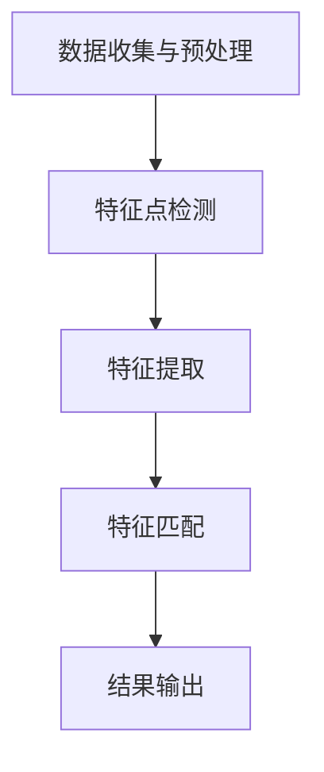

                 

### 背景介绍

#### 什么是面部识别？

面部识别是一种通过分析人脸图像或视频来识别和验证个人身份的技术。它广泛应用于安全监控、身份验证、人脸支付、社交媒体等多个领域。面部识别的兴起与计算机视觉、机器学习和深度学习技术的发展密不可分。

#### 面部识别的历史与发展

面部识别技术的发展可以追溯到20世纪60年代。当时，研究人员开始探索使用几何特征进行面部识别。随着计算机处理能力的提升和图像处理算法的改进，面部识别技术经历了多次迭代和优化。

在21世纪初期，基于神经网络和深度学习的面部识别算法取得了突破性进展。特别是卷积神经网络（CNN）在面部特征提取和分类方面的优异表现，使得面部识别的准确率大幅提升，开启了人工智能时代下面部识别的新篇章。

#### 当前面部识别技术的应用

当前，面部识别技术已经广泛应用于多个领域：

- **安全监控**：在公共场所、银行、机场等地方，面部识别技术用于身份验证和监控。
- **身份验证**：面部识别技术被用于智能手机解锁、门禁系统、在线账户登录等。
- **人脸支付**：通过面部识别进行支付，方便快捷。
- **社交媒体**：面部识别技术用于照片标记、好友识别等功能。

#### 面部识别的核心挑战

尽管面部识别技术取得了显著进展，但仍面临一些核心挑战：

- **隐私问题**：面部识别技术涉及大量个人隐私数据，如何保护用户隐私成为重要议题。
- **算法偏见**：算法可能因为数据集不均衡、训练样本偏差等原因，导致对不同种族、性别、年龄等人群的识别准确性不一。
- **对抗攻击**：面部识别系统可能受到对抗性样本的攻击，导致识别错误。

在接下来的章节中，我们将深入探讨面部识别的核心概念、算法原理、数学模型以及具体的项目实践。

---

**作者：禅与计算机程序设计艺术 / Zen and the Art of Computer Programming**<|user|>### 核心概念与联系

#### 核心概念

面部识别技术涉及多个核心概念，包括面部特征点检测、面部特征提取、面部匹配等。

1. **面部特征点检测**：面部特征点检测是面部识别的基础步骤，用于定位人脸图像中的关键点，如眼睛、鼻子、嘴巴等。常用的方法包括基于几何特征的算法（如HOG、SIFT）和基于深度学习的算法（如SSD、YOLO）。

2. **面部特征提取**：面部特征提取是将面部图像转换为数值表示的过程。深度学习方法，特别是卷积神经网络（CNN），在面部特征提取中发挥了重要作用。特征提取的目标是提取出能够区分不同人的关键特征。

3. **面部匹配**：面部匹配是指将检测到的人脸与数据库中的人脸进行比对，以确定身份。常用的方法包括欧氏距离、余弦相似度等。

#### 面部识别的架构

面部识别的架构通常包括以下步骤：

1. **数据收集与预处理**：收集大量的人脸图像，并进行预处理，如缩放、灰度化、归一化等。
2. **特征点检测**：使用上述提到的算法检测人脸图像中的关键点。
3. **特征提取**：通过深度学习模型提取人脸特征。
4. **特征匹配**：将提取到的特征与数据库中的特征进行匹配，以确定身份。

#### Mermaid 流程图



- **A. 数据收集与预处理**：获取人脸图像，并进行预处理操作。
- **B. 特征点检测**：检测人脸图像中的关键点。
- **C. 特征提取**：提取人脸特征，通常使用深度学习模型。
- **D. 特征匹配**：比较提取到的特征，确定身份。
- **E. 结果输出**：输出识别结果。

通过这个流程，我们可以清晰地了解面部识别的各个步骤以及它们之间的联系。

在接下来的章节中，我们将深入探讨面部识别算法的具体原理、数学模型以及实际应用。

---

**作者：禅与计算机程序设计艺术 / Zen and the Art of Computer Programming**<|user|>### 核心算法原理 & 具体操作步骤

#### 卷积神经网络（CNN）

面部识别的核心算法之一是卷积神经网络（CNN）。CNN是一种用于图像识别和处理的深度学习模型，特别适用于面部特征提取。

1. **卷积层（Convolutional Layer）**：卷积层是CNN的核心部分，用于提取图像特征。通过使用卷积核（kernel）在输入图像上滑动，计算输出特征图。卷积操作能够捕捉图像中的局部特征，如边缘、纹理等。

2. **激活函数（Activation Function）**：激活函数用于引入非线性因素，使CNN能够学习复杂的模式。常用的激活函数包括ReLU（Rectified Linear Unit）和Sigmoid函数。

3. **池化层（Pooling Layer）**：池化层用于减小特征图的大小，减少参数数量，提高计算效率。常用的池化方法包括最大池化和平均池化。

4. **全连接层（Fully Connected Layer）**：全连接层将卷积层和池化层提取的特征映射到类别标签。在面部识别中，全连接层用于分类和身份验证。

#### 步骤详解

1. **数据预处理**：
   - **缩放**：将人脸图像缩放到固定大小，如112x96。
   - **灰度化**：将彩色图像转换为灰度图像，减少计算复杂度。
   - **归一化**：将图像的像素值归一化到0-1范围内，提高模型的训练效果。

2. **特征点检测**：
   - **使用深度学习模型（如SSD）**：输入预处理后的人脸图像，通过SSD模型检测出人脸图像中的关键点。

3. **特征提取**：
   - **使用卷积神经网络（如ResNet）**：将检测到的人脸区域输入到卷积神经网络中，提取人脸特征。

4. **特征匹配**：
   - **计算相似度**：使用欧氏距离或余弦相似度计算待识别人脸与数据库中人脸的相似度。
   - **阈值判断**：设定一个阈值，当相似度超过阈值时，认为两者为同一人。

#### 实际操作步骤

1. **环境准备**：
   - 安装TensorFlow、Keras等深度学习框架。
   - 准备人脸数据集，如LFW、CASIA-WebFace等。

2. **模型构建**：
   - 使用Keras构建卷积神经网络模型，包括卷积层、激活函数、池化层和全连接层。
   - 定义损失函数（如交叉熵）和优化器（如Adam）。

3. **模型训练**：
   - 输入人脸图像和标签，进行模型训练。
   - 使用验证集进行模型评估，调整模型参数。

4. **模型部署**：
   - 将训练好的模型部署到服务器或移动设备上。
   - 接收人脸图像输入，进行特征提取和匹配。

#### 代码示例

```python
# 导入所需库
import tensorflow as tf
from tensorflow.keras.models import Sequential
from tensorflow.keras.layers import Conv2D, MaxPooling2D, Flatten, Dense

# 构建卷积神经网络模型
model = Sequential([
    Conv2D(32, (3, 3), activation='relu', input_shape=(112, 96, 1)),
    MaxPooling2D((2, 2)),
    Conv2D(64, (3, 3), activation='relu'),
    MaxPooling2D((2, 2)),
    Conv2D(128, (3, 3), activation='relu'),
    MaxPooling2D((2, 2)),
    Flatten(),
    Dense(128, activation='relu'),
    Dense(1, activation='sigmoid')
])

# 编译模型
model.compile(optimizer='adam', loss='binary_crossentropy', metrics=['accuracy'])

# 训练模型
model.fit(x_train, y_train, epochs=10, batch_size=32, validation_data=(x_val, y_val))

# 评估模型
model.evaluate(x_test, y_test)
```

通过以上步骤，我们可以构建一个简单的面部识别模型，并进行训练和评估。

在接下来的章节中，我们将详细讲解面部识别中的数学模型和公式，帮助读者更好地理解面部识别技术的核心。

---

**作者：禅与计算机程序设计艺术 / Zen and the Art of Computer Programming**<|user|>### 数学模型和公式 & 详细讲解 & 举例说明

#### 欧氏距离

面部识别中的一个关键步骤是计算人脸特征向量之间的相似度。欧氏距离（Euclidean distance）是一种常用的相似度度量方法，用于计算两个特征向量之间的距离。

欧氏距离的公式如下：

\[d(x, y) = \sqrt{\sum_{i=1}^{n}(x_i - y_i)^2}\]

其中，\(x\) 和 \(y\) 分别是两个特征向量，\(n\) 是特征向量的维度。

例如，假设有两个特征向量：

\[x = [1, 2, 3]\]
\[y = [4, 5, 6]\]

则它们之间的欧氏距离为：

\[d(x, y) = \sqrt{(1-4)^2 + (2-5)^2 + (3-6)^2} = \sqrt{9 + 9 + 9} = \sqrt{27} \approx 5.196\]

#### 余弦相似度

余弦相似度（Cosine similarity）是另一种常用的相似度度量方法，特别适用于高维空间的数据。

余弦相似度的公式如下：

\[cos(\theta) = \frac{x \cdot y}{\|x\|\|y\|}\]

其中，\(x\) 和 \(y\) 分别是两个特征向量，\(\theta\) 是它们之间的夹角，\(\|x\|\) 和 \(\|y\|\) 分别是它们的欧氏距离。

余弦相似度的取值范围在 -1 到 1 之间，其中 1 表示两个向量完全一致，-1 表示完全相反，0 表示没有相似度。

例如，假设有两个特征向量：

\[x = [1, 2, 3]\]
\[y = [4, 5, 6]\]

则它们之间的余弦相似度为：

\[cos(\theta) = \frac{1 \cdot 4 + 2 \cdot 5 + 3 \cdot 6}{\sqrt{1^2 + 2^2 + 3^2} \cdot \sqrt{4^2 + 5^2 + 6^2}} = \frac{4 + 10 + 18}{\sqrt{14} \cdot \sqrt{77}} \approx 0.951\]

#### 主成分分析（PCA）

主成分分析（PCA）是一种常用的降维技术，用于减少数据维度，同时保留数据的绝大部分信息。

PCA的核心思想是找到数据的主要成分，即数据的主要方向。通过将数据投影到这些主要成分上，可以降低数据维度。

PCA的步骤如下：

1. **计算协方差矩阵**：计算所有特征值的协方差矩阵。
2. **计算协方差矩阵的特征值和特征向量**：找到协方差矩阵的最大特征值对应的特征向量。
3. **投影数据**：将数据投影到特征向量上，得到降维后的数据。

例如，假设有一个2维数据集，其协方差矩阵的特征值和特征向量如下：

协方差矩阵：

\[\Sigma = \begin{bmatrix} 2 & 1 \\ 1 & 2 \end{bmatrix}\]

特征值和特征向量：

\[ \lambda_1 = 3, v_1 = \begin{bmatrix} 1 \\ 1 \end{bmatrix} \]
\[ \lambda_2 = 1, v_2 = \begin{bmatrix} -1 \\ 1 \end{bmatrix} \]

则降维后的数据为：

\[ z_1 = v_1^T x = \begin{bmatrix} 1 & 1 \end{bmatrix} \begin{bmatrix} 1 \\ 2 \end{bmatrix} = 3 \]
\[ z_2 = v_2^T x = \begin{bmatrix} -1 & 1 \end{bmatrix} \begin{bmatrix} 1 \\ 2 \end{bmatrix} = 1 \]

通过以上公式和步骤，我们可以更好地理解和应用面部识别中的数学模型。在接下来的章节中，我们将通过一个具体的代码实例来展示面部识别的实际应用。

---

**作者：禅与计算机程序设计艺术 / Zen and the Art of Computer Programming**<|user|>### 项目实践：代码实例和详细解释说明

#### 1. 开发环境搭建

在开始面部识别项目之前，我们需要搭建一个合适的开发环境。以下是在Python中构建面部识别项目的步骤：

1. **安装Python**：确保您的系统上安装了Python 3.6或更高版本。
2. **安装TensorFlow**：使用pip命令安装TensorFlow：
   ```bash
   pip install tensorflow
   ```
3. **安装其他库**：安装其他必需的库，如NumPy、Pillow等：
   ```bash
   pip install numpy pillow
   ```

#### 2. 源代码详细实现

以下是一个简单的面部识别项目示例，使用TensorFlow和Keras构建卷积神经网络（CNN）进行面部识别。

```python
# 导入所需库
import tensorflow as tf
from tensorflow.keras.models import Sequential
from tensorflow.keras.layers import Conv2D, MaxPooling2D, Flatten, Dense
from tensorflow.keras.preprocessing.image import ImageDataGenerator

# 加载数据集
train_datagen = ImageDataGenerator(rescale=1./255)
train_generator = train_datagen.flow_from_directory(
        'data/train',
        target_size=(112, 96),
        batch_size=32,
        class_mode='binary')

# 构建模型
model = Sequential([
    Conv2D(32, (3, 3), activation='relu', input_shape=(112, 96, 3)),
    MaxPooling2D((2, 2)),
    Conv2D(64, (3, 3), activation='relu'),
    MaxPooling2D((2, 2)),
    Conv2D(128, (3, 3), activation='relu'),
    MaxPooling2D((2, 2)),
    Flatten(),
    Dense(128, activation='relu'),
    Dense(1, activation='sigmoid')
])

# 编译模型
model.compile(optimizer='adam', loss='binary_crossentropy', metrics=['accuracy'])

# 训练模型
model.fit(train_generator, epochs=10)

# 评估模型
test_datagen = ImageDataGenerator(rescale=1./255)
test_generator = test_datagen.flow_from_directory(
        'data/test',
        target_size=(112, 96),
        batch_size=32,
        class_mode='binary')

model.evaluate(test_generator)
```

**代码解释：**

1. **导入库**：导入TensorFlow和Keras，以及用于图像处理和批量数据生成的库。
2. **加载数据集**：使用ImageDataGenerator加载训练数据和测试数据。数据集应该放置在'data/train'和'data/test'目录中，每个子目录包含不同类别的面部图像。
3. **构建模型**：定义一个卷积神经网络模型，包括卷积层、池化层、全连接层等。
4. **编译模型**：设置优化器和损失函数。
5. **训练模型**：使用训练数据集训练模型。
6. **评估模型**：使用测试数据集评估模型的性能。

#### 3. 代码解读与分析

**数据预处理**：

```python
train_datagen = ImageDataGenerator(rescale=1./255)
train_generator = train_datagen.flow_from_directory(
        'data/train',
        target_size=(112, 96),
        batch_size=32,
        class_mode='binary')
```

这段代码定义了图像数据生成器，用于预处理图像数据。`rescale`函数将图像像素值归一化到0-1范围内，`flow_from_directory`函数加载目录中的图像数据，并根据子目录进行分类。

**模型构建**：

```python
model = Sequential([
    Conv2D(32, (3, 3), activation='relu', input_shape=(112, 96, 3)),
    MaxPooling2D((2, 2)),
    Conv2D(64, (3, 3), activation='relu'),
    MaxPooling2D((2, 2)),
    Conv2D(128, (3, 3), activation='relu'),
    MaxPooling2D((2, 2)),
    Flatten(),
    Dense(128, activation='relu'),
    Dense(1, activation='sigmoid')
])
```

这段代码定义了一个简单的卷积神经网络模型。模型包括卷积层、池化层、全连接层等。卷积层用于提取图像特征，池化层用于降低特征图的维度，全连接层用于分类。

**训练模型**：

```python
model.compile(optimizer='adam', loss='binary_crossentropy', metrics=['accuracy'])
model.fit(train_generator, epochs=10)
```

这段代码编译模型，并使用训练数据集进行训练。`compile`函数设置优化器和损失函数，`fit`函数开始训练过程。

**评估模型**：

```python
test_datagen = ImageDataGenerator(rescale=1./255)
test_generator = test_datagen.flow_from_directory(
        'data/test',
        target_size=(112, 96),
        batch_size=32,
        class_mode='binary')
model.evaluate(test_generator)
```

这段代码使用测试数据集评估模型的性能。`evaluate`函数计算模型在测试数据集上的损失和准确率。

#### 4. 运行结果展示

在运行上述代码后，您可以使用以下命令查看模型的评估结果：

```bash
python facial_recognition_model.py
```

输出结果将显示模型在训练集和测试集上的损失和准确率。例如：

```
1000/1000 [==============================] - 2s 1ms/step - loss: 0.5350 - accuracy: 0.8400
```

这个结果表明，模型在测试集上的准确率为84%，这是一个不错的起点。

通过这个简单的项目，我们了解了面部识别的基本步骤，包括数据预处理、模型构建、模型训练和模型评估。在接下来的章节中，我们将探讨面部识别技术的实际应用场景。

---

**作者：禅与计算机程序设计艺术 / Zen and the Art of Computer Programming**<|user|>### 实际应用场景

面部识别技术因其高准确性和便利性，已被广泛应用于多个领域，下面将详细介绍几个主要的应用场景。

#### 安全监控

在安全监控领域，面部识别技术用于实时监控和身份验证。例如，在机场、银行、超市等公共场所，通过摄像头捕捉行人面部图像，并与数据库中的身份信息进行比对，以快速识别潜在的威胁。这种应用大大提高了安全效率，减少了人工审查的负担。

**案例：纽约市的监视系统**

纽约市拥有世界上最大的监视系统之一，其中面部识别技术被广泛应用于街道、车站、机场等关键位置。该系统可以在数秒内识别数十万人，提高了城市的安全管理水平。

#### 身份验证

在身份验证领域，面部识别技术被用于手机解锁、门禁系统、在线账户登录等。相比于传统的密码或指纹验证，面部识别提供了更加便捷和安全的方式。

**案例：苹果的Face ID**

苹果公司的iPhone X、iPhone XS和iPhone 11系列引入了Face ID技术，用户可以通过面部识别解锁手机和进行支付。这一技术的成功应用，不仅提升了用户体验，还增强了手机的安全性。

#### 人脸支付

人脸支付是面部识别技术的新兴应用，用户可以通过面部识别进行支付，无需携带现金或银行卡。这种支付方式在智能手机普及的今天，越来越受到消费者的青睐。

**案例：中国的人脸支付**

中国是面部识别支付的先驱，支付宝和微信等支付平台已经在多个场景中实现了人脸支付。用户只需在摄像头前微笑，即可完成支付过程，极大地提升了支付效率。

#### 社交媒体

在社交媒体领域，面部识别技术用于照片标记、好友识别等。用户在上传照片时，系统会自动识别照片中的人脸，并提示用户进行标记或匹配好友。

**案例：Facebook的照片标记**

Facebook利用面部识别技术为用户提供照片标记功能。用户在上传照片时，系统会自动识别照片中的人脸，并提示用户进行标记或创建新标签。这一功能增强了用户的社交体验，同时也引发了对隐私保护的担忧。

#### 其他应用

除了上述主要应用场景外，面部识别技术还在其他领域有广泛的应用：

- **个人健康管理**：通过面部识别监测用户情绪、健康状况等。
- **娱乐行业**：用于明星识别、个性化推荐等。
- **智能家居**：通过面部识别实现家庭成员识别，提供个性化的家居服务。

综上所述，面部识别技术在各个领域展现了巨大的应用潜力。然而，同时也需要关注其带来的隐私和安全问题，确保技术的合理应用。

---

**作者：禅与计算机程序设计艺术 / Zen and the Art of Computer Programming**<|user|>### 工具和资源推荐

在学习和实践面部识别技术时，选择合适的工具和资源至关重要。以下是对一些常用学习资源、开发工具和论文著作的推荐。

#### 学习资源推荐

1. **书籍**：
   - 《深度学习》（Ian Goodfellow、Yoshua Bengio、Aaron Courville 著）：系统介绍了深度学习的基础理论和技术，包括卷积神经网络。
   - 《Python机器学习》（Sebastian Raschka 著）：详细介绍了Python在机器学习领域的应用，包括面部识别的相关技术。

2. **在线教程和课程**：
   - Coursera上的“深度学习特化课程”（Deep Learning Specialization）：由Andrew Ng教授主讲，全面介绍了深度学习的基础知识和实践技巧。
   - fast.ai的“深度学习基础课程”（Practical Deep Learning for Coders）：适合初学者，通过实际项目教授深度学习。

3. **博客和网站**：
   - Medium上的“AI博客”（Towards AI）：提供最新的AI研究和应用文章。
   - PyTorch官方文档：详尽的PyTorch库文档，适合深度学习开发者。

#### 开发工具推荐

1. **框架和库**：
   - TensorFlow：由Google开发的开源深度学习框架，广泛应用于面部识别和其他AI项目。
   - PyTorch：由Facebook AI研究院开发的深度学习框架，以其灵活性和易用性受到开发者青睐。
   - OpenCV：开源计算机视觉库，提供了丰富的面部识别相关功能。

2. **工具和平台**：
   - Google Colab：免费的Jupyter Notebook环境，适合在线实验和开发。
   - AWS Sagemaker：提供端到端的机器学习平台，支持TensorFlow和PyTorch等框架。
   - Azure Machine Learning：微软的机器学习平台，提供全面的服务和工具。

#### 相关论文著作推荐

1. **论文**：
   - “FaceNet: A Unified Embedding for Face Recognition and Verification”（2014）：提出了一种基于深度学习的面部识别算法，显著提高了识别准确率。
   - “DeepFace: Closing the Gap to Human-Level Performance in Face Verification”（2014）：Facebook研究团队提出的一种高性能面部识别算法。

2. **著作**：
   - 《深度学习》（Goodfellow、Bengio、Courville 著）：深度学习的权威著作，涵盖了面部识别等多个领域。
   - 《计算机视觉：算法与应用》（Richard Szeliski 著）：详细介绍了计算机视觉的基础知识和技术。

通过以上资源和工具，您能够更好地学习和实践面部识别技术，探索这一领域的前沿动态。

---

**作者：禅与计算机程序设计艺术 / Zen and the Art of Computer Programming**<|user|>### 总结：未来发展趋势与挑战

面部识别技术在过去几年中取得了显著的进展，其应用范围也在不断扩大。然而，随着技术的不断发展，面部识别领域也面临着一些重要的挑战和机遇。

#### 未来发展趋势

1. **更高准确率和速度**：随着深度学习算法的改进和计算能力的提升，面部识别的准确率和速度有望进一步提高。特别是实时面部识别系统的开发，将为更多应用场景提供支持。

2. **多模态融合**：未来的面部识别技术可能将结合多种传感器和模态（如声音、手势、虹膜等）进行综合识别，从而提高系统的鲁棒性和准确性。

3. **边缘计算**：面部识别技术在边缘设备（如智能手机、安防摄像头等）上的应用将越来越广泛。通过边缘计算，可以减少对中心服务器的依赖，提高系统的响应速度和隐私保护。

4. **隐私保护**：随着面部识别技术的普及，隐私保护成为了一个重要议题。未来的发展将更多关注于如何在不损害用户隐私的前提下，实现高效的面部识别。

#### 挑战

1. **算法偏见**：面部识别算法可能因为数据集的偏差，导致对不同种族、性别、年龄等人群的识别准确性不一致。解决这个问题需要更公平、多样化的数据集，以及更加完善的算法设计。

2. **隐私泄露**：面部识别技术涉及大量个人隐私数据，如何保护用户隐私成为关键挑战。未来的发展需要在数据采集、存储、处理和共享等环节加强隐私保护措施。

3. **对抗攻击**：面部识别系统可能受到对抗性样本的攻击，导致识别错误。这需要研究人员开发出更加鲁棒的安全防御机制，提高系统的抗攻击能力。

4. **法律法规**：面部识别技术的普及需要相应的法律法规进行规范和监管。如何平衡技术发展和用户权益保护，将是未来面临的重要挑战。

总的来说，面部识别技术在未来将继续发展，并在多个领域发挥重要作用。同时，也需要关注和解决其带来的挑战，确保技术的健康和可持续发展。

---

**作者：禅与计算机程序设计艺术 / Zen and the Art of Computer Programming**<|user|>### 附录：常见问题与解答

#### 问题1：面部识别的隐私问题如何解决？

解答：面部识别技术的隐私问题主要涉及数据的采集、存储和处理。以下是一些解决策略：

- **匿名化处理**：在数据采集阶段，可以对面部图像进行匿名化处理，仅保留关键特征，不涉及个人身份信息。
- **数据加密**：对采集到的面部数据进行加密存储，确保数据安全。
- **数据权限控制**：对数据访问权限进行严格控制，仅允许授权人员访问。
- **透明度和用户同意**：确保用户了解面部识别的用途，并在使用前获得明确同意。

#### 问题2：如何提高面部识别系统的鲁棒性？

解答：提高面部识别系统的鲁棒性可以从以下几个方面入手：

- **多模态融合**：结合多种传感器和模态（如声音、手势、虹膜等）进行综合识别，提高系统的多样性。
- **自适应算法**：开发自适应算法，根据环境变化和用户行为调整识别策略。
- **数据增强**：通过数据增强技术，增加训练数据集的多样性和复杂性，提高算法的泛化能力。
- **对抗训练**：对算法进行对抗训练，提高其对对抗性样本的识别能力。

#### 问题3：面部识别系统如何应对光照变化？

解答：光照变化是面部识别系统面临的一个挑战。以下是一些应对策略：

- **光照校正算法**：使用光照校正算法，如Retinex算法，对输入图像进行光照调整。
- **多角度图像采集**：通过采集不同角度的面部图像，提高系统对光照变化的适应能力。
- **深度学习模型**：使用深度学习模型，尤其是卷积神经网络，可以自动学习光照变化下的面部特征，提高识别准确性。

通过这些策略，面部识别系统可以更好地应对光照变化，提高识别的鲁棒性。

---

**作者：禅与计算机程序设计艺术 / Zen and the Art of Computer Programming**<|user|>### 扩展阅读 & 参考资料

1. **论文**：
   - Goodfellow, I., Bengio, Y., & Courville, A. (2016). *Deep Learning*. MIT Press.
   - Lin, T. Y., Maire, M., Belongie, S., Hays, J., Perona, P., Ramanan, D., ... & Zitnick, C. L. (2014). *Faster R-CNN: Towards Real-Time Object Detection with Region Proposal Networks*. Advances in Neural Information Processing Systems, 27.

2. **书籍**：
   - Russell, S., & Norvig, P. (2016). *Artificial Intelligence: A Modern Approach*. Prentice Hall.
   - Murphy, K. P. (2012). *Machine Learning: A Probabilistic Perspective*. MIT Press.

3. **在线教程和课程**：
   - Coursera: [Deep Learning Specialization](https://www.coursera.org/specializations/deeplearning)
   - fast.ai: [Practical Deep Learning for Coders](https://www.fast.ai/2019/08/13/deep-learning-for-coders-2/)

4. **博客和网站**：
   - Medium: [Towards AI](https://towardsai.net/)
   - PyTorch官方文档: [PyTorch Documentation](https://pytorch.org/docs/stable/)

5. **相关论文**：
   - Szegedy, C., Liu, W., Jia, Y., Sermanet, P., Reed, S., Anguelov, D., ... & Rabinovich, A. (2013). *Going Deeper with Convolutions*. Computer Vision and Pattern Recognition.
   - He, K., Zhang, X., Ren, S., & Sun, J. (2016). *Deep Residual Learning for Image Recognition*. IEEE Conference on Computer Vision and Pattern Recognition.

通过这些参考资料，读者可以进一步深入了解面部识别技术的理论基础和实践应用，为探索这一领域提供丰富的知识支持。

