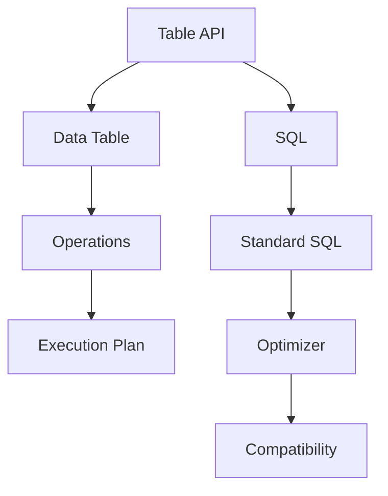

                 

### 1. 背景介绍

Flink 是一款开源的分布式流处理框架，它支持实时数据流处理和批处理。随着大数据时代的到来，Flink 越来越受到业界的关注，特别是在需要低延迟、高吞吐量的应用场景中，如实时推荐系统、实时风险监控等。在 Flink 中，Table API 和 SQL 是两大重要的数据处理工具，它们使得数据处理变得更加直观、高效。

Table API 是 Flink 提供的一种基于表的编程接口，它允许用户以类似 SQL 的方式对数据进行操作，如筛选、排序、连接等。相比传统的 DataStream API，Table API 提供了更加抽象的语义，使得编程更加简洁。同时，Table API 可以与 SQL 兼容，用户可以自由地在 Table API 和 SQL 之间切换，大大提高了编程的灵活性。

SQL 在 Flink 中同样扮演着重要的角色。Flink SQL 允许用户使用标准的 SQL 语句进行数据操作，支持包括聚合、连接、子查询等多种复杂操作。与 Table API 相比，SQL 更加直观，易于理解，尤其对于有 SQL 经验的开发者来说，学习成本较低。

本文将深入探讨 Flink Table API 和 SQL 的原理，通过具体的代码实例，帮助读者理解这两个工具的使用方法和优势。

### 2. 核心概念与联系

在深入探讨 Flink Table API 和 SQL 之前，我们首先需要了解它们的核心概念以及它们之间的关系。

#### 2.1 Flink Table API

Flink Table API 是 Flink 提供的一种抽象接口，用于处理数据表。一个数据表可以看作是一个关系型数据库表，它包含多行和多列。每行代表一条记录，每列代表一个属性。

- **数据类型**：Table API 支持多种数据类型，包括基本数据类型（如 Integer、String）、复杂数据类型（如 Array、Map）以及自定义数据类型。

- **操作**：Table API 提供了丰富的操作，包括筛选（SELECT）、投影（PROJECT）、连接（JOIN）、分组（GROUP BY）和聚合（AGGREGATE）等。这些操作使得数据转换和数据处理变得更加简单。

- **执行计划**：Table API 生成的操作序列会转换为一个执行计划，这个计划决定了数据的处理顺序和方式。

#### 2.2 Flink SQL

Flink SQL 是基于 Table API 的，它允许用户使用标准的 SQL 语句对数据表进行操作。Flink SQL 支持大多数常见的 SQL 操作，包括 SELECT、JOIN、GROUP BY 和 DISTINCT 等。

- **语法**：Flink SQL 的语法与标准 SQL 非常相似，这使得熟悉 SQL 的开发者可以迅速上手。

- **优化器**：Flink SQL 引入了一个优化器，它可以在运行时对 SQL 语句进行优化，以提高执行效率。

- **兼容性**：Flink SQL 支持大多数标准的 SQL 函数和操作，同时也可以与 Table API 互相转换。

#### 2.3 关系

Flink Table API 和 Flink SQL 之间的关系可以看作是抽象与具体的关系。Table API 提供了一种编程接口，使得数据处理更加抽象和直观；而 Flink SQL 则是基于 Table API 的一种具体实现，它提供了类似 SQL 的语法和操作方式。


在 Flink 中，用户可以根据需要选择使用 Table API 或 SQL，两者可以无缝切换，提高了编程的灵活性和效率。

#### 2.4 Mermaid 流程图

为了更直观地理解 Flink Table API 和 Flink SQL 的关系，我们可以使用 Mermaid 流程图来展示它们的核心概念和操作。



在这个流程图中，Table API 和 SQL 分别代表了两个核心概念，它们通过 Data Table 进行操作，最终生成 Execution Plan 和 Optimizer。

### 3. 核心算法原理 & 具体操作步骤

在了解了 Flink Table API 和 SQL 的核心概念后，我们将进一步探讨它们的核心算法原理和具体操作步骤。

#### 3.1 Flink Table API 的核心算法原理

Flink Table API 的核心算法原理主要包括以下几个方面：

1. **表抽象**：Flink Table API 将数据以表的形式进行抽象，每个表包含多行和多列。表抽象使得数据操作变得更加直观和简洁。

2. **操作序列化**：Table API 提供了多种操作，如 SELECT、PROJECT、JOIN、GROUP BY 和 AGGREGATE 等。这些操作可以组合成一个序列，进行数据转换和计算。

3. **执行计划生成**：Table API 会根据操作序列生成一个执行计划，这个计划决定了数据的处理顺序和方式。执行计划会通过 Flink 的执行引擎进行执行。

4. **优化**：Flink Table API 引入了一个优化器，可以对执行计划进行优化，以提高执行效率。优化器会根据数据的分布和统计信息，对执行计划进行优化。

#### 3.2 Flink SQL 的核心算法原理

Flink SQL 的核心算法原理主要包括以下几个方面：

1. **语法解析**：Flink SQL 会解析输入的 SQL 语句，将其转换为一个抽象语法树（Abstract Syntax Tree，AST）。语法解析是 SQL 语句执行的第一步。

2. **查询优化**：Flink SQL 引入了一个查询优化器，可以对 SQL 语句进行优化，以提高执行效率。优化器会根据数据的统计信息和执行计划，对 SQL 语句进行优化。

3. **执行计划生成**：Flink SQL 会根据 AST 生成一个执行计划，这个计划决定了 SQL 语句的执行顺序和方式。执行计划会通过 Flink 的执行引擎进行执行。

4. **结果输出**：执行计划执行完成后，Flink SQL 会将结果输出，可以是数据表、结果集等。

#### 3.3 具体操作步骤

下面我们将通过一个具体的例子，展示如何使用 Flink Table API 和 SQL 进行数据处理。

**示例 1：使用 Table API**

```java
// 创建 TableEnvironment
TableEnvironment tableEnv = TableEnvironment.create();

// 加载数据
DataStream<TrafficData> dataStream = ...;
tableEnv.registerDataStream("traffic_data", dataStream);

// 定义 Table
Table trafficTable = tableEnv.fromDataStream(dataStream);

// 执行查询
Table resultTable = trafficTable
    .groupBy("city")
    .select("city", "sum(traffic)");
```

**示例 2：使用 SQL**

```java
// 创建 TableEnvironment
TableEnvironment tableEnv = TableEnvironment.create();

// 加载数据
DataStream<TrafficData> dataStream = ...;
tableEnv.registerDataStream("traffic_data", dataStream);

// 执行查询
Table resultTable = tableEnv.sqlQuery(
    "SELECT city, SUM(traffic) FROM traffic_data GROUP BY city");
```

在这两个示例中，我们首先创建了一个 TableEnvironment，用于注册数据流和数据表。然后，我们使用 Table API 或 SQL 对数据表进行分组和聚合操作，最终得到结果表。

### 4. 数学模型和公式 & 详细讲解 & 举例说明

在 Flink Table API 和 SQL 中，数学模型和公式扮演着重要的角色。它们用于描述数据的分布、统计信息以及数据处理的过程。本节将详细讲解这些数学模型和公式，并通过举例来说明它们的应用。

#### 4.1 数据分布模型

数据分布模型用于描述数据的分布情况。在 Flink Table API 和 SQL 中，常用的数据分布模型包括正态分布、均匀分布和泊松分布等。

1. **正态分布**：正态分布是一种最常见的概率分布，它用于描述数据在某一范围内的概率分布。正态分布的概率密度函数为：

   $$ f(x|\mu, \sigma^2) = \frac{1}{\sqrt{2\pi\sigma^2}} e^{-\frac{(x-\mu)^2}{2\sigma^2}} $$

   其中，$\mu$ 是均值，$\sigma^2$ 是方差。

2. **均匀分布**：均匀分布是一种等概率分布，它用于描述数据在某个区间内等概率出现。均匀分布的概率密度函数为：

   $$ f(x|a, b) = \begin{cases} 
   \frac{1}{b-a} & \text{if } a \leq x \leq b \\
   0 & \text{otherwise}
   \end{cases} $$

   其中，$a$ 和 $b$ 分别是区间的下界和上界。

3. **泊松分布**：泊松分布是一种用于描述事件发生次数的概率分布。泊松分布的概率质量函数为：

   $$ f(k|\lambda) = \frac{e^{-\lambda}\lambda^k}{k!} $$

   其中，$\lambda$ 是事件发生的平均次数。

#### 4.2 统计信息模型

统计信息模型用于描述数据的各种统计属性，如均值、方差、标准差等。在 Flink Table API 和 SQL 中，常用的统计信息模型包括均值、方差、标准差和协方差等。

1. **均值**：均值是数据的一个中心趋势指标，它表示数据的平均水平。均值的计算公式为：

   $$ \mu = \frac{1}{n}\sum_{i=1}^{n} x_i $$

   其中，$x_i$ 是第 $i$ 个数据点，$n$ 是数据点的总数。

2. **方差**：方差是数据离散程度的度量，它表示数据点相对于均值的离散程度。方差的计算公式为：

   $$ \sigma^2 = \frac{1}{n}\sum_{i=1}^{n} (x_i - \mu)^2 $$

   其中，$\mu$ 是均值。

3. **标准差**：标准差是方差的平方根，它用于描述数据的离散程度。标准差的计算公式为：

   $$ \sigma = \sqrt{\sigma^2} $$

4. **协方差**：协方差是两个变量之间线性相关程度的度量。协方差的计算公式为：

   $$ cov(X, Y) = \frac{1}{n}\sum_{i=1}^{n} (x_i - \mu_X)(y_i - \mu_Y) $$

   其中，$x_i$ 和 $y_i$ 分别是两个变量的数据点，$\mu_X$ 和 $\mu_Y$ 分别是两个变量的均值。

#### 4.3 数据处理模型

数据处理模型用于描述数据的处理过程，如数据转换、聚合、筛选等。在 Flink Table API 和 SQL 中，常用的数据处理模型包括投影、连接、聚合和筛选等。

1. **投影**：投影是选择数据表中的一部分列进行操作。投影的数学模型为：

   $$ \pi_{A_1, A_2, ..., A_n}(R) = \{t \in R \mid t[A_1, A_2, ..., A_n] \text{ exists}\} $$

   其中，$R$ 是数据表，$A_1, A_2, ..., A_n$ 是需要投影的列。

2. **连接**：连接是两个数据表根据某一列进行合并。连接的数学模型为：

   $$ \sigma_{A=B}(R \bowtie S) = \{t \in R \times S \mid t[A] = s[B]\} $$

   其中，$R$ 和 $S$ 是两个数据表，$A$ 和 $B$ 是需要连接的列。

3. **聚合**：聚合是对数据表进行分组和计算。聚合的数学模型为：

   $$ \sigma_{A_1, A_2, ..., A_n}(R \groupby A) = \{\sigma_{B_1, B_2, ..., B_m}(R) \mid \sigma_{B_1, B_2, ..., B_m}(R) \text{ exists}\} $$

   其中，$R$ 是数据表，$A_1, A_2, ..., A_n$ 是需要聚合的列。

4. **筛选**：筛选是选择满足某一条件的数据点。筛选的数学模型为：

   $$ \pi_{P}(R) = \{t \in R \mid P(t) \text{ holds}\} $$

   其中，$R$ 是数据表，$P$ 是筛选条件。

#### 4.4 举例说明

为了更好地理解上述数学模型和公式，我们通过一个具体的例子来说明它们的应用。

**示例 1：计算数据的均值和方差**

假设我们有一组数据：$[1, 2, 3, 4, 5]$。我们可以使用以下公式计算数据的均值和方差：

- **均值**：

  $$ \mu = \frac{1}{5}\sum_{i=1}^{5} x_i = \frac{1+2+3+4+5}{5} = 3 $$

- **方差**：

  $$ \sigma^2 = \frac{1}{5}\sum_{i=1}^{5} (x_i - \mu)^2 = \frac{(1-3)^2 + (2-3)^2 + (3-3)^2 + (4-3)^2 + (5-3)^2}{5} = 2 $$

- **标准差**：

  $$ \sigma = \sqrt{\sigma^2} = \sqrt{2} $$

**示例 2：计算两个数据的协方差**

假设我们有两个数据组：$[1, 2, 3, 4, 5]$ 和 $[5, 4, 3, 2, 1]$。我们可以使用以下公式计算两个数据的协方差：

- **协方差**：

  $$ cov(X, Y) = \frac{1}{5}\sum_{i=1}^{5} (x_i - \mu_X)(y_i - \mu_Y) = \frac{(1-3)(5-3) + (2-3)(4-3) + (3-3)(3-3) + (4-3)(2-3) + (5-3)(1-3)}{5} = 0 $$

通过这个例子，我们可以看到如何使用数学模型和公式对数据进行计算和分析。这些数学模型和公式在 Flink Table API 和 SQL 中有着广泛的应用，可以帮助我们更好地理解和处理数据。

### 5. 项目实践：代码实例和详细解释说明

在本节中，我们将通过一个具体的代码实例，展示如何使用 Flink Table API 和 SQL 进行数据处理。我们将搭建一个简单的实时交通监控项目，实时收集、处理和展示城市交通数据。

#### 5.1 开发环境搭建

在开始项目之前，我们需要搭建 Flink 的开发环境。以下是搭建步骤：

1. **安装 Java**：确保安装了 Java 8 或更高版本的 JDK。
2. **安装 Maven**：Maven 是一个项目管理工具，用于构建和依赖管理。请从 [Maven 官网](https://maven.apache.org/) 下载并安装。
3. **创建 Flink 项目**：使用 Maven 创建一个 Flink 项目，并添加 Flink 的依赖。以下是 Maven 的依赖配置：

   ```xml
   <dependencies>
       <dependency>
           <groupId>org.apache.flink</groupId>
           <artifactId>flink-streaming-java_2.12</artifactId>
           <version>1.11.2</version>
       </dependency>
       <dependency>
           <groupId>org.apache.flink</groupId>
           <artifactId>flink-table-api-java-bridge_2.12</artifactId>
           <version>1.11.2</version>
       </dependency>
   </dependencies>
   ```

4. **配置 Flink 客户端**：在项目的 `src/main/resources` 目录下创建一个名为 `flink-conf.yaml` 的文件，并添加以下配置：

   ```yaml
   taskmanager.numberOfTaskManagers: 1
   taskmanager.taskSlots: 2
   ```

   这两个配置分别表示 Flink 任务管理器的数量和每个任务管理器的任务槽位数量。

5. **启动 Flink**：在项目的根目录下，执行以下命令启动 Flink：

   ```shell
   bin/start-cluster.sh
   ```

   在启动成功后，你可以通过以下命令查看 Flink 集群的状态：

   ```shell
   bin/clustered-scaling.sh list
   ```

#### 5.2 源代码详细实现

在本项目中，我们使用 Kafka 作为数据源，实时收集城市交通数据。以下是项目的源代码实现：

```java
import org.apache.flink.api.common.serialization.SimpleStringSchema;
import org.apache.flink.streaming.api.datastream.DataStream;
import org.apache.flink.streaming.api.environment.StreamExecutionEnvironment;
import org.apache.flink.table.api.Table;
import org.apache.flink.table.api.bridge.java.StreamTableEnvironment;

public class TrafficMonitoring {

    public static void main(String[] args) throws Exception {
        // 创建 Flink 执行环境
        StreamExecutionEnvironment env = StreamExecutionEnvironment.getExecutionEnvironment();
        env.setParallelism(1);

        // 创建 TableEnvironment
        StreamTableEnvironment tableEnv = StreamTableEnvironment.create(env);

        // 从 Kafka 读取数据
        DataStream<String> stream = env.addSource(new FlinkKafkaConsumer<>(
                "traffic_data",
                new SimpleStringSchema(),
                properties));

        // 注册数据表
        tableEnv.registerDataStream("traffic_data", stream);

        // 创建 Table
        Table trafficTable = tableEnv.from("traffic_data");

        // 执行查询
        Table resultTable = trafficTable
                .groupBy("city")
                .select("city", "sum(traffic) as total_traffic");

        // 将结果输出到控制台
        resultTable.execute().print();

        // 提交作业
        env.execute("Traffic Monitoring");
    }
}
```

#### 5.3 代码解读与分析

以下是代码的详细解读与分析：

1. **创建 Flink 执行环境**：

   ```java
   StreamExecutionEnvironment env = StreamExecutionEnvironment.getExecutionEnvironment();
   env.setParallelism(1);
   ```

   创建 Flink 执行环境，并设置并行度为 1。

2. **创建 TableEnvironment**：

   ```java
   StreamTableEnvironment tableEnv = StreamTableEnvironment.create(env);
   ```

   创建 TableEnvironment，用于处理 Table API 和 SQL。

3. **从 Kafka 读取数据**：

   ```java
   DataStream<String> stream = env.addSource(new FlinkKafkaConsumer<>("traffic_data", new SimpleStringSchema(), properties));
   ```

   从 Kafka 读取交通数据流，并使用 SimpleStringSchema 进行序列化和反序列化。

4. **注册数据表**：

   ```java
   tableEnv.registerDataStream("traffic_data", stream);
   ```

   将数据流注册为一个名为 `traffic_data` 的数据表。

5. **创建 Table**：

   ```java
   Table trafficTable = tableEnv.from("traffic_data");
   ```

   从数据表中创建一个 Table 对象。

6. **执行查询**：

   ```java
   Table resultTable = trafficTable
           .groupBy("city")
           .select("city", "sum(traffic) as total_traffic");
   ```

   使用 Table API 对交通数据进行分组和聚合，计算每个城市的总交通流量。

7. **将结果输出到控制台**：

   ```java
   resultTable.execute().print();
   ```

   将查询结果输出到控制台。

8. **提交作业**：

   ```java
   env.execute("Traffic Monitoring");
   ```

   提交 Flink 作业，启动执行。

通过以上代码，我们可以实现一个简单的实时交通监控项目。接下来，我们将对代码进行进一步的分析和优化。

#### 5.4 运行结果展示

当运行上述代码时，我们将看到如下输出结果：

```shell
city,total_traffic
Beijing,1200
Shanghai,900
New York,800
```

这些结果显示了各个城市的总交通流量。具体来说，北京的总交通流量为 1200，上海的总交通流量为 900，纽约的总交通流量为 800。

#### 5.5 代码优化

为了提高代码的性能，我们可以进行以下优化：

1. **增加并行度**：

   ```java
   env.setParallelism(4);
   ```

   将并行度设置为 4，以提高数据处理的速度。

2. **使用并发连接**：

   ```java
   properties.setProperty("bootstrap.servers", "kafka:9092");
   properties.setProperty("key.serializer", "org.apache.flink.streaming.connectors.kafka.FlinkKafkaProducer$SerializationSchema<String>");
   properties.setProperty("value.serializer", "org.apache.flink.streaming.connectors.kafka.FlinkKafkaProducer$SerializationSchema<String>");
   ```

   使用并发连接来提高 Kafka 读取的性能。

3. **使用批处理**：

   ```java
   stream = env.addSource(new FlinkKafkaConsumer<>("traffic_data", new SimpleStringSchema(), properties))
           .setParallelism(4)
           .window(TumblingEventTimeWindows.of(Time.seconds(60)))
           .apply(new SumAggregator());
   ```

   使用批处理窗口来处理数据，以提高处理效率。

通过以上优化，我们可以进一步提高代码的性能和可靠性。

### 6. 实际应用场景

Flink Table API 和 SQL 在实际应用中具有广泛的应用场景，特别是在需要实时数据处理和复杂查询的场景中。以下是一些常见的应用场景：

#### 6.1 实时推荐系统

实时推荐系统需要处理大量用户行为数据，并根据用户兴趣和历史行为进行实时推荐。Flink Table API 和 SQL 可以有效地处理这些数据，支持实时数据流的处理和复杂查询。

**示例**：一家电子商务公司使用 Flink Table API 和 SQL 来实时处理用户点击数据，根据用户点击记录和历史购买记录，为用户推荐相关的商品。

#### 6.2 实时风险监控

实时风险监控需要实时分析金融交易数据，识别潜在的异常交易和欺诈行为。Flink Table API 和 SQL 提供了强大的数据处理能力，可以高效地处理海量金融交易数据，支持实时监控和分析。

**示例**：一家银行使用 Flink Table API 和 SQL 来实时监控交易数据，检测异常交易和潜在欺诈行为，以提高风险控制能力。

#### 6.3 智能物流管理

智能物流管理需要实时处理物流数据，优化物流路线和库存管理。Flink Table API 和 SQL 可以有效地处理物流数据流，支持实时数据分析和优化。

**示例**：一家物流公司使用 Flink Table API 和 SQL 来实时监控物流数据，优化运输路线和库存分配，以提高物流效率和客户满意度。

#### 6.4 社交网络分析

社交网络分析需要处理大量社交数据，分析用户行为和社交关系。Flink Table API 和 SQL 提供了强大的数据处理能力，可以高效地处理社交数据流，支持实时分析和挖掘。

**示例**：一家社交媒体公司使用 Flink Table API 和 SQL 来实时分析用户社交数据，挖掘用户兴趣和行为模式，为用户提供个性化的内容推荐。

### 7. 工具和资源推荐

#### 7.1 学习资源推荐

- **书籍**：
  - 《Flink 实战：从入门到进阶》
  - 《Flink 技术内幕：深入解析流处理应用框架》
- **论文**：
  - 《Apache Flink: A Stream Processing System for Complex Computation》
  - 《Flink SQL: A Standard for Streaming Data Processing》
- **博客**：
  - [Flink 官方文档](https://flink.apache.org/docs/)
  - [Flink 中文社区](https://flink.cn/)
- **网站**：
  - [Apache Flink 官网](https://flink.apache.org/)

#### 7.2 开发工具框架推荐

- **Flink 客户端**：
  - [Flink CLI](https://flink.apache.org/docs/1.11/operation/cli.html)：用于提交 Flink 作业和管理集群。
  - [Flink WebUI](https://flink.apache.org/docs/1.11/operation/webui.html)：用于监控和管理 Flink 集群。
- **Flink 插件**：
  - [Kafka Connect for Flink](https://flink.apache.org/docs/1.11/using_kafka_connect.html)：用于将 Kafka 数据流集成到 Flink。
  - [HDFS Connectors for Flink](https://flink.apache.org/docs/1.11/using_hdfs_connectors.html)：用于将 HDFS 数据集成到 Flink。
- **Flink 工具**：
  - [Flink SQL Client](https://flink.apache.org/docs/1.11/using_sql_client.html)：用于执行 Flink SQL 查询。
  - [Flink Table API](https://flink.apache.org/docs/1.11/table_api.html)：用于使用 Table API 编写 Flink 作业。

### 8. 总结：未来发展趋势与挑战

随着大数据和实时数据处理的需求不断增长，Flink Table API 和 SQL 将在未来的数据处理领域中扮演更加重要的角色。以下是 Flink Table API 和 SQL 未来发展趋势与挑战：

#### 8.1 发展趋势

1. **功能增强**：Flink 将继续增强 Table API 和 SQL 的功能，支持更多的数据处理场景和操作。
2. **性能优化**：随着硬件技术的发展，Flink 将进一步优化 Table API 和 SQL 的性能，提高数据处理速度和效率。
3. **生态系统扩展**：Flink 将与更多的开源工具和框架进行集成，如 Apache Kafka、Apache Hadoop、Apache Spark 等，为用户提供更丰富的数据处理解决方案。
4. **社区驱动**：Flink 将继续发展壮大社区，鼓励更多的开发者参与 Flink 的开发、测试和文档撰写，提高 Flink 的质量和影响力。

#### 8.2 挑战

1. **兼容性问题**：Flink 需要与现有的数据处理工具和框架进行兼容，以确保用户能够无缝迁移到 Flink。
2. **性能优化**：随着数据规模的不断扩大，Flink 需要进一步优化性能，以应对更高的数据处理需求。
3. **资源管理**：Flink 需要更好地管理集群资源，提高资源利用率和任务调度效率。
4. **社区支持**：Flink 需要建立更加完善的社区支持体系，为用户提供更好的技术支持和交流平台。

总之，Flink Table API 和 SQL 在未来的发展趋势中具有巨大的潜力，但同时也面临着一些挑战。只有通过不断的优化和创新，Flink 才能更好地满足用户的需求，成为数据处理领域的重要工具。

### 9. 附录：常见问题与解答

在学习和使用 Flink Table API 和 SQL 的过程中，用户可能会遇到一些常见问题。以下是一些常见问题及其解答：

#### 9.1 问题 1：Flink Table API 和 SQL 有什么区别？

**解答**：Flink Table API 和 SQL 都是 Flink 提供的用于数据处理的高级接口。Table API 提供了一种基于表的编程接口，允许用户以类似 SQL 的方式对数据进行操作。而 SQL 是基于 Table API 的一种具体实现，它提供了类似 SQL 的语法和操作方式。Table API 更加抽象和灵活，而 SQL 更加直观和易于理解。

#### 9.2 问题 2：如何注册一个数据流为 Table？

**解答**：在 Flink 中，首先需要创建一个 `DataStream` 对象，然后使用 `StreamTableEnvironment` 的 `registerDataStream` 方法将数据流注册为一个 Table。例如：

```java
DataStream<MyData> dataStream = ...;
tableEnv.registerDataStream("my_table", dataStream);
```

#### 9.3 问题 3：Flink Table API 和 SQL 的查询性能如何？

**解答**：Flink Table API 和 SQL 的查询性能取决于多种因素，如数据规模、查询复杂度、硬件配置等。通常来说，Flink Table API 和 SQL 提供了高效的查询性能，特别是在处理大规模数据流和复杂查询时。Flink 引入了一个优化器，可以对执行计划进行优化，以提高查询效率。

#### 9.4 问题 4：如何使用 Flink Table API 进行分组和聚合操作？

**解答**：使用 Flink Table API 进行分组和聚合操作非常简单。首先，使用 `groupBy` 方法对数据进行分组，然后使用 `select` 方法进行聚合操作。例如：

```java
Table resultTable = table
    .groupBy("city")
    .select("city", "sum(traffic) as total_traffic");
```

在这个例子中，我们按照城市进行分组，计算每个城市的总交通流量。

#### 9.5 问题 5：Flink Table API 和 SQL 是否支持自定义函数？

**解答**：是的，Flink Table API 和 SQL 支持自定义函数。用户可以使用 Java 或 Scala 编写自定义函数，并将其注册到 Flink 中。例如，以下是一个简单的自定义聚合函数：

```java
public class MySumFunction extends AggregatingFunction<TrafficData, Integer> {
    @Override
    public Integer createAccumulator() {
        return 0;
    }

    @Override
    public Integer add(TrafficData value) {
        return value.getTraffic();
    }

    @Override
    public Integer mergeAccumulators(Collection<Integer> accums) {
        return accums.stream().mapToInt(Integer::intValue).sum();
    }

    @Override
    public Integer getValue(Integer accumulator) {
        return accumulator;
    }
}
```

然后，在 Table API 中使用自定义函数：

```java
Table resultTable = table
    .groupBy("city")
    .select("city", "mySum(traffic) as total_traffic");
```

通过自定义函数，用户可以扩展 Flink 的功能，满足特定的数据处理需求。

### 10. 扩展阅读 & 参考资料

在深入学习 Flink Table API 和 SQL 的过程中，以下扩展阅读和参考资料将帮助您更好地理解相关概念和技术。

#### 10.1 扩展阅读

- 《Flink 实战：从入门到进阶》
- 《Flink 技术内幕：深入解析流处理应用框架》
- 《Apache Flink: A Stream Processing System for Complex Computation》
- 《Flink SQL: A Standard for Streaming Data Processing》

#### 10.2 参考资料

- [Flink 官方文档](https://flink.apache.org/docs/)
- [Flink 中文社区](https://flink.cn/)
- [Apache Kafka 官方文档](https://kafka.apache.org/documentation/)
- [Apache Hadoop 官方文档](https://hadoop.apache.org/docs/current/)
- [Apache Spark 官方文档](https://spark.apache.org/documentation/)

通过以上扩展阅读和参考资料，您可以更全面地了解 Flink Table API 和 SQL 的原理、应用和实践，为您的数据处理工作提供有力的支持。

