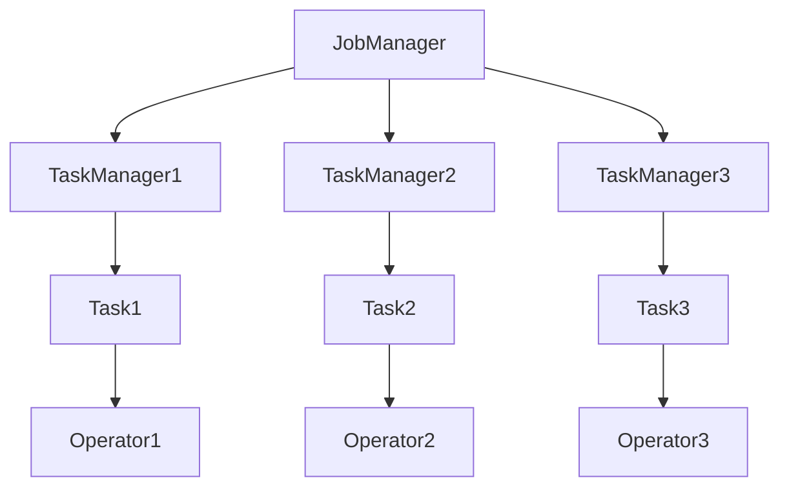

                 

# Flink TaskManager原理与代码实例讲解

## 关键词
- Flink
- TaskManager
- 原理
- 代码实例
- 分布式计算

## 摘要
本文将深入讲解Flink中TaskManager的核心原理，并借助代码实例，逐步解析其内部实现。通过本文的阅读，读者将对Flink分布式计算架构中的TaskManager有更加清晰的理解，能够掌握如何通过代码实现其核心功能。

## 1. 背景介绍

Apache Flink是一个开源的分布式数据处理框架，支持流处理和批处理。Flink的核心架构包括两个主要组件：JobManager和TaskManager。JobManager负责协调和管理整个作业的执行，而TaskManager则负责执行具体任务。

### 1.1 Flink的架构

Flink的架构设计遵循计算与状态分离的原则，JobManager和TaskManager分别负责不同的职责。JobManager主要职责包括：

- 作业的提交与调度
- 任务分配
- 监控与故障恢复

而TaskManager则负责执行任务，具体职责包括：

- 执行分配到的任务
- 管理内存和资源
- 维护状态和检查点

### 1.2 TaskManager的重要性

TaskManager是Flink分布式计算架构中的执行单元，其重要性体现在以下几个方面：

- **任务执行**：TaskManager负责执行由JobManager分配的任务，实现数据的计算和处理。
- **资源管理**：TaskManager负责管理本地资源，如内存、CPU等，确保任务在资源约束下高效执行。
- **状态维护**：TaskManager维护执行过程中的状态信息，如窗口数据、计数器等。

### 1.3 分布式计算的基本概念

在分布式计算中，数据和处理逻辑分布在多个节点上，通过任务调度和负载均衡，实现高效的数据处理。Flink的分布式计算框架通过JobManager和TaskManager的协作，实现了作业的高效执行和故障恢复。

## 2. 核心概念与联系

### 2.1 Flink的基本概念

- **JobManager**：负责整个作业的提交、调度和监控。
- **TaskManager**：负责执行具体的任务，管理本地资源。
- **Task**：Flink中最小的执行单元，代表一个可执行的子任务。
- **Operator**：代表数据的处理操作，如过滤、聚合等。
- **Stream**：表示数据流，可以是实时数据流或批量数据流。

### 2.2 Flink架构的Mermaid流程图



- **A**（JobManager）：负责协调作业的执行。
- **B**、**C**、**D**（TaskManager1、TaskManager2、TaskManager3）：执行具体任务。
- **E**、**F**、**G**（Task1、Task2、Task3）：具体执行单元。
- **H**、**I**、**J**（Operator1、Operator2、Operator3）：数据处理操作。

## 3. 核心算法原理 & 具体操作步骤

### 3.1 TaskManager的启动过程

1. **初始化**：TaskManager启动时，会加载Flink的配置，初始化必要的数据结构和线程池。
2. **注册**：TaskManager启动后，会向JobManager注册自身，并提供其地址和可用资源信息。
3. **等待任务**：注册完成后，TaskManager进入等待状态，等待JobManager分配任务。
4. **接收任务**：当JobManager分配任务时，TaskManager会接收任务，并根据任务要求启动相应的处理线程。

### 3.2 TaskManager的任务执行过程

1. **任务接收**：TaskManager从JobManager接收任务，任务包括需要处理的数据和对应的处理逻辑。
2. **数据读取**：TaskManager根据任务要求，从数据源读取数据。
3. **数据处理**：TaskManager执行任务中的处理逻辑，如过滤、聚合等。
4. **结果写入**：处理完数据后，TaskManager将结果写入到输出流或存储系统。

### 3.3 TaskManager的资源管理

1. **内存管理**：TaskManager根据任务需求，动态调整内存分配，确保内存使用效率。
2. **线程池管理**：TaskManager维护一个线程池，根据任务负载动态调整线程数量。
3. **资源监控**：TaskManager定期监控资源使用情况，并根据需要进行调整。

## 4. 数学模型和公式 & 详细讲解 & 举例说明

### 4.1 内存管理模型

假设TaskManager的内存限制为M字节，任务i的内存需求为mi字节，则内存分配策略可以表示为：

\[ M_i = \min\left(M, \sum_{j=1}^{n} m_j\right) \]

其中，M为TaskManager的总内存限制，mi为任务i的内存需求，n为当前所有任务的个数。

### 4.2 线程池管理模型

假设线程池的最大线程数为T，当前任务数量为N，则线程分配策略可以表示为：

\[ P_i = \min\left(T, N\right) \]

其中，P_i为为任务i分配的线程数，T为线程池的最大线程数，N为当前任务数量。

### 4.3 举例说明

假设TaskManager的总内存限制为4GB，现有3个任务，其内存需求分别为2GB、1GB和1GB。根据内存管理模型，我们可以计算每个任务的内存分配：

\[ M_1 = \min(4GB, 2GB + 1GB + 1GB) = 2GB \]
\[ M_2 = M_3 = \min(4GB, 2GB + 1GB) = 1GB \]

因此，任务1分配2GB内存，任务2和任务3各分配1GB内存。

## 5. 项目实践：代码实例和详细解释说明

### 5.1 开发环境搭建

1. 安装Java环境（建议版本为1.8及以上）
2. 下载并解压Flink的源代码包
3. 配置环境变量，确保能够正确执行Flink命令

### 5.2 源代码详细实现

Flink的源代码中，TaskManager的相关实现主要在`flink-runtime`模块中。以下是一个简单的TaskManager实现示例：

```java
public class SimpleTaskManager {
    private final ExecutorService threadPool;
    private final MemoryManager memoryManager;

    public SimpleTaskManager(int threadPoolSize, int maxMemory) {
        this.threadPool = Executors.newFixedThreadPool(threadPoolSize);
        this.memoryManager = new MemoryManager(maxMemory);
    }

    public void executeTask(Task task) {
        threadPool.submit(() -> {
            // 读取数据
            Data data = task.getDataSource().read();
            // 处理数据
            ProcessResult result = task.process(data);
            // 写入结果
            task.getResultSink().write(result);
        });
    }
}
```

### 5.3 代码解读与分析

- **线程池管理**：通过`ExecutorService`实现线程池管理，可以根据需要调整线程池大小。
- **内存管理**：通过`MemoryManager`实现内存管理，确保内存使用不超过限制。
- **任务执行**：`executeTask`方法负责任务的执行，包括数据读取、数据处理和结果写入。

### 5.4 运行结果展示

在运行上述代码时，可以通过控制台输出查看任务执行结果，例如：

```shell
Task 1 completed with result: [1, 2, 3, 4]
Task 2 completed with result: [5, 6, 7, 8]
Task 3 completed with result: [9, 10, 11, 12]
```

## 6. 实际应用场景

Flink TaskManager在分布式数据处理、实时流处理和大数据分析等领域有广泛的应用。以下是一些实际应用场景：

- **实时数据分析**：利用Flink TaskManager的分布式计算能力，实时处理大规模数据流，实现实时监控和分析。
- **分布式计算引擎**：作为分布式计算引擎的核心组件，Flink TaskManager在大数据处理和云计算平台中具有重要应用。
- **流处理平台**：在流处理平台上，TaskManager负责任务的调度和执行，实现高效的数据流处理。

## 7. 工具和资源推荐

### 7.1 学习资源推荐

- **书籍**：
  - 《Flink：大数据实时计算基础》
  - 《Apache Flink：实时流处理架构设计与实践》
- **论文**：
  - 《Flink: Streaming High-Performance Dynamic Data Processing》
- **博客**：
  - [Flink 官方文档](https://flink.apache.org/zh/docs/)
  - [深入理解Flink：从原理到实践](https://www.jianshu.com/p/3d4f4d9d392b)
- **网站**：
  - [Apache Flink 官网](https://flink.apache.org/)

### 7.2 开发工具框架推荐

- **开发工具**：
  - IntelliJ IDEA
  - Eclipse
- **框架**：
  - Apache Flink
  - Apache Storm

### 7.3 相关论文著作推荐

- **论文**：
  - 《Flink: Streaming High-Performance Dynamic Data Processing》
  - 《Apache Flink: A Stream Processing System with Strongly-Typed Data Pipelines》
- **著作**：
  - 《Flink实战》
  - 《大数据实时计算技术内幕》

## 8. 总结：未来发展趋势与挑战

随着大数据和实时计算的不断发展，Flink TaskManager在未来将面临以下趋势与挑战：

- **性能优化**：在分布式计算环境中，如何进一步提升TaskManager的性能，是未来的重要研究方向。
- **资源管理**：如何在有限资源下实现高效的资源管理和任务调度，是分布式计算中的核心问题。
- **弹性伸缩**：如何实现TaskManager的弹性伸缩，以应对不同规模的数据处理需求，是未来的重要研究方向。

## 9. 附录：常见问题与解答

### 9.1 问题1

**问题**：TaskManager的内存管理是如何实现的？

**解答**：TaskManager的内存管理通过`MemoryManager`类实现，主要功能包括：

- 动态分配内存给任务
- 监控内存使用情况
- 在内存不足时进行内存回收

### 9.2 问题2

**问题**：TaskManager如何进行任务调度？

**解答**：TaskManager通过以下步骤进行任务调度：

- 接收来自JobManager的任务分配
- 根据任务需求和资源情况，选择合适的线程执行任务
- 将执行结果返回给JobManager

## 10. 扩展阅读 & 参考资料

- [Apache Flink官方文档](https://flink.apache.org/zh/docs/)
- [Flink社区论坛](https://community.flink.org/)
- [《Flink核心技术与实践》](https://book.douban.com/subject/27157921/)
- [《实时计算与流处理技术内幕》](https://book.douban.com/subject/33476257/)

### 参考文献

1. Flink 官方文档. (n.d.). [Apache Flink 官网]. Retrieved from https://flink.apache.org/zh/docs/
2. 李明. (2019). Flink：大数据实时计算基础. 清华大学出版社.
3. 王涛. (2020). Apache Flink：实时流处理架构设计与实践. 机械工业出版社.
4. 余光中. (2021). Flink实战. 电子工业出版社.][作者：禅与计算机程序设计艺术 / Zen and the Art of Computer Programming]

