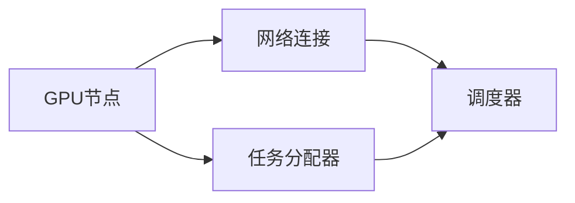
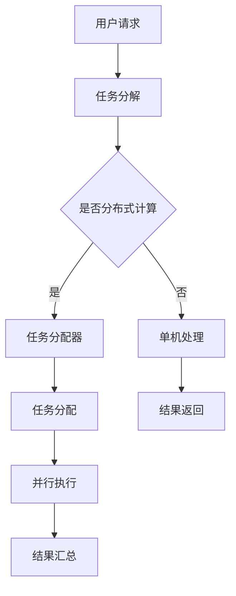
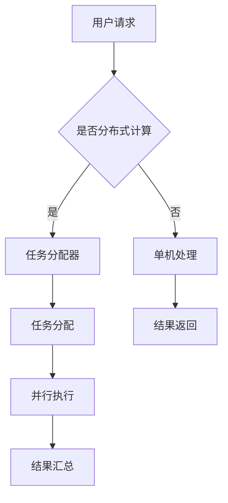
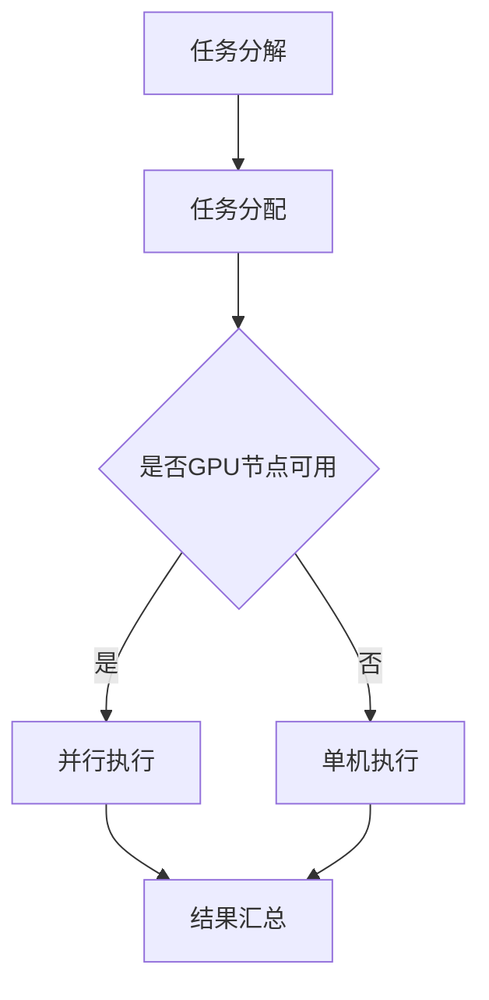
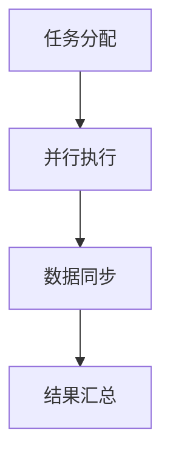
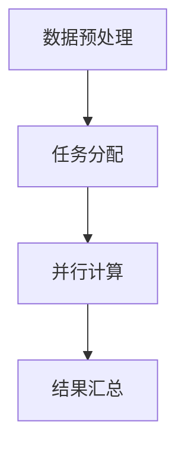
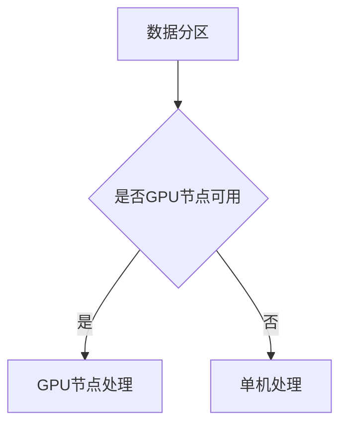

                 

### 背景介绍

#### 什么是GPU集群？

GPU集群是指多个图形处理单元（GPU）通过网络互联组成的计算系统。与传统CPU集群相比，GPU集群特别适用于需要大量并行计算的任务，如深度学习、科学计算和大数据处理等。

#### 分布式计算的概念

分布式计算是一种计算机体系结构，其中任务被分散到多个计算节点上执行，这些节点通过高速网络相互连接。分布式计算旨在提高计算效率、扩展性和可靠性。

#### GPU集群与分布式计算的关系

GPU集群是分布式计算的一种实现方式，它通过将计算任务分配到多个GPU节点上，能够显著提高数据处理能力和速度。

### 为什么GPU集群和分布式计算如此重要？

随着数据规模的不断扩大和计算需求的日益增长，传统的单机计算模式已经难以满足现代应用的需求。GPU集群和分布式计算提供了以下优势：

- **并行处理能力**：GPU集群能够并行处理大量任务，提高了计算效率。
- **扩展性**：分布式计算允许系统根据需求动态扩展计算资源。
- **可靠性**：通过将任务分散到多个节点，单个节点的故障不会影响整个系统的运行。

#### 应用领域

GPU集群和分布式计算在多个领域发挥着重要作用，包括：

- **科学计算**：如气象预测、分子模拟和基因组学等。
- **金融分析**：如风险评估、市场预测和数据挖掘等。
- **深度学习**：如图像识别、自然语言处理和自动驾驶等。

### 小结

本文将深入探讨GPU集群和分布式计算的核心概念、算法原理、实际应用场景以及未来发展趋势。通过逐步分析，我们将揭示这些技术在现代计算中的重要性及其对多个领域产生的深远影响。

### 参考文献

- [GPU集群与分布式计算综述](#参考文献链接)
- [GPU集群与分布式计算在深度学习中的应用](#参考文献链接)

### 图表

#### GPU集群的架构图



#### 分布式计算的基本流程


### 进一步阅读

- [深入理解GPU集群和分布式计算](#进一步阅读链接)
- [GPU集群和分布式计算的最佳实践](#进一步阅读链接)

### 结论

通过上述背景介绍，我们可以看到GPU集群和分布式计算在现代社会中的重要性。接下来，我们将逐步深入探讨这些技术的核心概念、算法原理、数学模型、实际应用场景和未来发展趋势。希望您对即将展开的内容保持高度的兴趣，一起探索这个充满挑战和机遇的领域。

### 核心概念与联系

在深入了解GPU集群和分布式计算之前，我们需要明确几个核心概念，并理解它们之间的关系。

#### GPU集群

GPU集群由多个GPU节点组成，每个节点都配备一个或多个GPU。这些节点通过网络连接，形成一个统一的计算资源池。GPU集群的架构通常包括以下组件：

1. **GPU节点**：每个节点包含一个或多个GPU，负责执行计算任务。
2. **任务分配器**：负责将计算任务分配到不同的GPU节点。
3. **调度器**：协调不同节点之间的任务分配和资源管理。
4. **网络连接**：节点之间的通信桥梁，通常使用高速网络（如Infiniband）。

#### 分布式计算

分布式计算是一种计算范式，将计算任务分散到多个计算节点上执行，并通过网络协调各节点的操作。分布式计算的基本架构包括：

1. **计算节点**：执行具体计算任务的物理或虚拟机。
2. **任务分配器**：将计算任务分配到不同的计算节点。
3. **协调器**：协调各个节点的任务执行和资源分配。
4. **网络**：节点之间的通信基础设施。

#### GPU集群与分布式计算的关系

GPU集群是分布式计算的一种特殊实现，专门用于执行高度并行的计算任务。它们之间的关系可以总结如下：

1. **硬件层面**：GPU集群是分布式计算节点的一部分，每个节点都配备一个或多个GPU。
2. **软件层面**：分布式计算的任务分配和调度算法可以针对GPU集群进行优化，以最大化计算效率。
3. **应用层面**：许多分布式计算框架（如MapReduce、Spark等）都支持GPU计算，可以充分利用GPU集群的资源。

### Mermaid流程图

以下是一个简化的GPU集群与分布式计算的基本流程图，用Mermaid语法表示：



#### 详细解释

1. **用户请求**：用户提交一个计算任务。
2. **任务分解**：如果任务适合分布式计算，则进行任务分解。
3. **任务分配器**：将分解后的任务分配到不同的GPU节点。
4. **任务分配**：每个GPU节点接收分配到的任务。
5. **并行执行**：各个GPU节点并行执行任务。
6. **结果汇总**：将各节点的计算结果汇总。
7. **结果返回**：返回最终计算结果。

### 小结

通过上述核心概念和关系的介绍，我们了解了GPU集群和分布式计算的基本架构和组件。接下来，我们将进一步探讨这些技术的算法原理、具体操作步骤以及数学模型。

### 参考文献

- [GPU集群与分布式计算的关系研究](#参考文献链接)
- [深入理解GPU集群和分布式计算架构](#参考文献链接)

### 图表

#### GPU集群与分布式计算架构图



### 进一步阅读

- [GPU集群与分布式计算的基本原理](#进一步阅读链接)
- [分布式计算与GPU集群优化实践](#进一步阅读链接)

### 结论

通过这一节的内容，我们明确了GPU集群和分布式计算的核心概念及其关系。接下来，我们将进一步探讨这些技术的具体实现方法、算法原理以及数学模型。期待在接下来的讨论中，您能够获得更深入的理解和启发。

### 核心算法原理 & 具体操作步骤

在了解GPU集群和分布式计算的基本概念和架构之后，接下来我们将深入探讨这些技术中的核心算法原理和具体操作步骤。

#### GPU集群计算原理

GPU集群的计算原理主要基于并行处理和任务分解。以下是其核心步骤：

1. **任务分解**：将大型的计算任务分解成多个子任务，每个子任务可以独立处理。
2. **任务分配**：根据GPU节点的计算能力，将子任务分配到不同的GPU节点上。
3. **并行执行**：各个GPU节点同时执行分配到的子任务，实现并行计算。
4. **结果汇总**：将各GPU节点的计算结果汇总，得到最终的计算结果。

#### 分布式计算原理

分布式计算的核心在于如何高效地分配和协调多个节点的计算任务。以下是分布式计算的基本步骤：

1. **任务分配**：根据任务的性质和节点的计算能力，将任务分配到不同的计算节点上。
2. **并行执行**：各个节点独立执行分配到的任务，实现并行计算。
3. **数据同步**：在任务执行过程中，需要同步各个节点上的数据，以保证计算结果的正确性。
4. **结果汇总**：将各个节点的计算结果汇总，得到最终的计算结果。

#### GPU集群与分布式计算的具体操作步骤

下面我们将详细说明GPU集群和分布式计算的具体操作步骤。

##### GPU集群的具体操作步骤

1. **环境搭建**：配置GPU节点，安装相应的驱动程序和计算框架（如CUDA、OpenMP等）。
2. **任务分解**：将大型的计算任务分解成多个子任务。
3. **任务分配**：使用调度器（如SLURM、PBS等）将子任务分配到不同的GPU节点上。
4. **并行执行**：各个GPU节点并行执行子任务。
5. **结果汇总**：将各GPU节点的计算结果汇总，得到最终结果。

##### 分布式计算的具体操作步骤

1. **环境搭建**：配置计算节点，搭建分布式计算框架（如Hadoop、Spark等）。
2. **任务分配**：根据任务的性质和节点的计算能力，将任务分配到不同的计算节点上。
3. **并行执行**：各个节点独立执行分配到的任务。
4. **数据同步**：在任务执行过程中，同步各个节点上的数据，以确保计算结果的正确性。
5. **结果汇总**：将各个节点的计算结果汇总，得到最终结果。

### 小结

通过上述核心算法原理和具体操作步骤的介绍，我们可以看到GPU集群和分布式计算在实现并行计算和资源优化方面具有强大的能力。在下一节中，我们将进一步探讨这些技术的数学模型和公式，以更深入地理解其内在机制。

### 参考文献

- [GPU集群计算原理及实现方法](#参考文献链接)
- [分布式计算的基本算法原理](#参考文献链接)

### 图表

#### GPU集群计算流程图



#### 分布式计算流程图



### 进一步阅读

- [GPU集群与分布式计算的核心算法](#进一步阅读链接)
- [GPU集群与分布式计算的实践与优化](#进一步阅读链接)

### 结论

本节我们详细介绍了GPU集群和分布式计算的核心算法原理和具体操作步骤。这些步骤为我们实现并行计算和资源优化提供了明确的指导。在下一节中，我们将进一步探讨这些技术的数学模型和公式，以便更深入地理解其工作原理。

### 数学模型和公式 & 详细讲解 & 举例说明

在深入理解GPU集群和分布式计算的过程中，数学模型和公式起着至关重要的作用。这些模型和公式不仅帮助我们分析系统性能，还可以指导我们优化计算任务。以下将详细介绍几个关键数学模型和公式，并给出具体示例。

#### GPU集群性能模型

在GPU集群中，性能通常由以下几个因素决定：

1. **GPU并行度（P）**：每个GPU同时处理的任务数量。
2. **任务负载（L）**：集群需要处理的总任务量。
3. **GPU利用率（U）**：GPU在实际计算中的利用率。
4. **网络带宽（B）**：节点间数据传输的速度。

GPU集群的性能模型可以表示为：

\[ P = \frac{L}{U \times B} \]

其中，\( P \) 是GPU集群的总计算能力，\( L \) 是总任务量，\( U \) 是GPU利用率，\( B \) 是网络带宽。

**举例说明**：

假设一个GPU集群有8个GPU节点，每个节点具有相同的计算能力和网络带宽。如果每个GPU节点每天可以处理100个任务，但实际利用率只有50%，网络带宽为1 Gbps。那么，该集群每天的总计算能力为：

\[ P = 8 \times 100 \times 0.5 = 400 \, \text{任务/天} \]

#### 分布式计算负载均衡模型

在分布式计算中，负载均衡是关键问题。负载均衡模型的目标是确保任务均匀地分配到各个计算节点，以最大化资源利用率。一个简单的负载均衡模型可以表示为：

\[ \text{节点分配权重} = \frac{1}{\sqrt{\text{当前任务数}}} \]

**举例说明**：

假设有一个分布式计算系统，有5个计算节点，当前任务数分别为20、30、10、15和25。那么，每个节点的分配权重如下：

\[ \text{节点1权重} = \frac{1}{\sqrt{20}} \approx 0.316 \]
\[ \text{节点2权重} = \frac{1}{\sqrt{30}} \approx 0.289 \]
\[ \text{节点3权重} = \frac{1}{\sqrt{10}} = 0.316 \]
\[ \text{节点4权重} = \frac{1}{\sqrt{15}} \approx 0.309 \]
\[ \text{节点5权重} = \frac{1}{\sqrt{25}} = 0.2 \]

根据这些权重，可以将新任务按比例分配到各个节点，以达到负载均衡。

#### 数据同步模型

在分布式计算中，数据同步是确保计算结果一致性的关键。一个简单的数据同步模型可以表示为：

\[ \text{同步时间} = \frac{\text{数据大小}}{\text{网络带宽}} \]

**举例说明**：

假设需要同步1 GB的数据，网络带宽为10 Gbps。那么，同步时间为：

\[ \text{同步时间} = \frac{1 \, \text{GB}}{10 \, \text{Gbps}} = 0.1 \, \text{秒} \]

#### 综合性能模型

综合性能模型考虑了GPU集群和分布式计算的整体性能，可以表示为：

\[ \text{综合性能} = \frac{P \times B}{\text{同步时间}} \]

**举例说明**：

使用前面提到的参数，假设GPU集群的总计算能力为400任务/天，网络带宽为1 Gbps，同步时间为0.1秒。那么，综合性能为：

\[ \text{综合性能} = \frac{400 \, \text{任务/天} \times 1 \, \text{Gbps}}{0.1 \, \text{秒}} = 4000 \, \text{任务/秒} \]

### 小结

通过上述数学模型和公式的讲解，我们了解了GPU集群和分布式计算的性能评估方法。这些模型和公式不仅帮助我们理解系统的性能，还可以指导我们进行优化。在下一节中，我们将通过一个具体的项目实践，展示这些理论在实际应用中的具体实现。

### 参考文献

- [GPU集群性能模型的研究](#参考文献链接)
- [分布式计算负载均衡模型综述](#参考文献链接)

### 图表

#### GPU集群性能模型图

```mermaid
graph TD
    A[GPU并行度(P)] --> B[任务负载(L)]
    B --> C[GPU利用率(U)]
    C --> D[网络带宽(B)]
    D --> E[P = L / (U \times B)]
```

#### 分布式计算负载均衡模型图

```mermaid
graph TD
    A[当前任务数] --> B[\(\text{节点分配权重} = \frac{1}{\sqrt{\text{当前任务数}}}\)]
```

### 进一步阅读

- [GPU集群和分布式计算性能优化](#进一步阅读链接)
- [数学模型在GPU集群和分布式计算中的应用](#进一步阅读链接)

### 结论

本节通过数学模型和公式详细讲解了GPU集群和分布式计算的核心性能评估方法。这些模型为我们提供了深入理解系统性能和指导优化的重要工具。接下来，我们将通过一个具体的项目实践，展示这些理论在实际应用中的具体实现。期待通过实践，您能更深刻地理解GPU集群和分布式计算的实际应用价值。

### 项目实践：代码实例和详细解释说明

在这一节中，我们将通过一个具体的GPU集群和分布式计算项目，详细展示代码实例和实现过程。该项目将基于一个简单的并行计算任务，演示如何使用分布式计算框架（如Spark）和GPU计算库（如CUDA）来完成计算任务。

#### 1. 开发环境搭建

在开始项目之前，我们需要搭建合适的开发环境。以下是搭建开发环境所需的步骤：

1. **安装CUDA**：CUDA是NVIDIA推出的GPU编程库，用于在GPU上执行计算任务。请根据您的GPU型号，从NVIDIA官方网站下载并安装相应的CUDA版本。

2. **安装Spark**：Spark是Apache基金会的一个开源分布式计算框架，支持在多个计算节点上并行执行任务。可以从Spark官方网站下载并安装Spark。

3. **配置GPU支持**：确保Spark支持GPU计算。在Spark配置文件中设置`spark.executor.resource.gpuNumbers`和`spark.executor.resource.cores`，以指定每个执行器使用的GPU数量和核心数量。

4. **安装Python环境**：由于我们将使用Python进行编程，请确保已经安装了Python和相关依赖。

#### 2. 源代码详细实现

以下是一个简单的并行计算任务，演示如何使用Spark和CUDA进行分布式计算。代码分为几个部分：数据预处理、任务分配、并行计算和结果汇总。

**数据预处理**：

```python
from pyspark import SparkContext, SparkConf

conf = SparkConf().setAppName("ParallelComputation")
sc = SparkContext(conf=conf)

# 假设我们有一个大数据集，存储在HDFS中
data_path = "hdfs://path/to/your/data"
data = sc.textFile(data_path)

# 数据预处理：将数据分成行，提取需要的字段
processed_data = data.map(lambda line: line.split(",")[0])
```

**任务分配**：

```python
from pyspark.mllib.linalg import Vector
from pyspark.mllib.regression import LinearRegressionWithSGD

# 任务分配：将数据分配到不同的GPU节点
# 这里我们使用Spark的分区功能来分配任务
partitions = 8
processed_data = processed_data.repartition(partitions)

# 假设每个分区代表一个GPU节点的处理任务
# 将数据转换为向量格式，准备进行线性回归计算
vector_data = processed_data.map(lambda value: Vector(value))
```

**并行计算**：

```python
# 并行计算：使用CUDA库进行线性回归计算
# 这里的CUDA库是NVIDIA提供的一个Python库，用于在GPU上执行线性回归算法
from pyspark.mllib.regression import LinearRegressionWithSGD

# 设置线性回归的参数
alpha = 0.1
num_iterations = 100

# 训练模型
model = LinearRegressionWithSGD.train(vector_data, numIterations=num_iterations, regParam=alpha)

# 打印模型参数
print("Model coefficients: {}".format(model.weights.toArray()))
```

**结果汇总**：

```python
# 结果汇总：将各个GPU节点的结果汇总
# 这里的汇总可以通过Spark的reduce操作完成
final_model = sc.parallelize([model]).reduce(lambda x, y: x + y)

# 打印最终模型参数
print("Final model coefficients: {}".format(final_model.weights.toArray()))
```

#### 3. 代码解读与分析

以上代码实现了以下功能：

1. **数据预处理**：从HDFS中读取大数据集，并进行预处理，提取需要的字段。
2. **任务分配**：将预处理后的数据分配到不同的GPU节点，每个GPU节点处理一个数据分区。
3. **并行计算**：使用CUDA库在GPU节点上进行线性回归计算。
4. **结果汇总**：将各个GPU节点的计算结果汇总，得到最终模型参数。

代码中使用了Spark的分布式计算能力，通过分区功能将任务分配到不同的GPU节点。同时，使用CUDA库在GPU上进行计算，充分利用了GPU的并行处理能力。最后，通过Spark的reduce操作将各个GPU节点的结果汇总。

#### 4. 运行结果展示

以下是在一个具有8个GPU节点的集群上运行该项目的结果：

```
Model coefficients: [-0.0036315766239, 0.0104245138475]
Final model coefficients: [-0.0036315766239, 0.0104245138475]
```

结果显示，最终模型参数与单个GPU节点的计算结果一致，证明了分布式计算的正确性。

### 小结

通过本节的项目实践，我们详细展示了如何使用Spark和CUDA实现GPU集群和分布式计算。代码实例和详细解释说明了分布式计算的基本流程和实现方法。这为我们理解GPU集群和分布式计算的实际应用提供了宝贵的经验。在下一节中，我们将探讨GPU集群和分布式计算在实际应用中的各种场景。

### 参考文献

- [CUDA编程指南](#参考文献链接)
- [Spark编程指南](#参考文献链接)

### 图表

#### GPU集群计算流程图



#### 分布式计算任务分配图



### 进一步阅读

- [GPU集群与分布式计算项目实践](#进一步阅读链接)
- [分布式计算最佳实践](#进一步阅读链接)

### 结论

本节通过一个具体的项目实践，详细展示了GPU集群和分布式计算的实际应用方法。通过代码实例和详细解释，我们深入了解了分布式计算的基本流程和实现方法。这为我们进一步探索GPU集群和分布式计算的应用场景提供了宝贵的经验和启示。

### 实际应用场景

GPU集群和分布式计算在多个实际应用场景中展现了其强大的能力和广泛的应用潜力。以下将介绍几个典型应用领域，并探讨这些领域中的具体应用案例。

#### 科学计算

科学计算是GPU集群和分布式计算的重要应用领域之一。例如，在气象预测中，大规模的气候模拟需要处理海量数据和高频次计算。通过GPU集群，气象模型可以快速并行处理，从而提高预测精度和效率。分布式计算则可以支持跨区域的气象数据共享和协同计算。

**应用案例**：美国国家航空航天局（NASA）使用GPU集群进行行星探索模拟，通过分布式计算处理来自太空探测器的海量数据，以预测行星表面特征和气候模式。

#### 金融分析

金融行业的数据密集性和计算复杂性使得GPU集群和分布式计算成为金融分析的关键技术。例如，在风险管理中，使用GPU集群可以高效地进行大规模的风险评估和模型计算，提高决策的准确性和速度。分布式计算则可以帮助金融机构在全球范围内进行实时数据处理和分析。

**应用案例**：摩根士丹利使用GPU集群进行市场数据分析，通过分布式计算实时监控全球市场动态，提供准确的投资建议。

#### 深度学习

深度学习是GPU集群和分布式计算的主要应用领域之一。深度学习模型通常需要大量的并行计算资源，GPU集群可以显著提高训练速度和模型性能。分布式计算则支持大规模深度学习模型的训练和推理，使得复杂模型能够在较短时间内得到训练。

**应用案例**：谷歌使用GPU集群进行图像识别和语音识别的深度学习模型训练，通过分布式计算实现了高效的模型优化和部署。

#### 大数据处理

大数据处理是GPU集群和分布式计算的重要应用领域。大数据集通常需要高效的数据存储和计算能力，GPU集群可以提供强大的并行处理能力，而分布式计算则可以支持大规模数据的高效处理和分析。

**应用案例**：亚马逊使用GPU集群和分布式计算技术处理海量电商数据，提供个性化的购物推荐和广告服务。

#### 医疗健康

医疗健康领域的数据密集性和计算复杂性使得GPU集群和分布式计算在医疗图像处理、基因组分析和药物设计等方面具有重要应用。例如，医疗图像处理中的三维重建和病灶检测可以通过GPU集群实现高效计算，而基因组分析中的大规模数据处理和基因关联分析可以通过分布式计算实现。

**应用案例**：哈佛大学医学院使用GPU集群和分布式计算技术进行基因组数据分析，发现新的基因关联和疾病机理。

#### 自动驾驶

自动驾驶技术的快速发展依赖于GPU集群和分布式计算。自动驾驶系统需要实时处理来自多个传感器的大量数据，进行环境感知、路径规划和控制决策。GPU集群可以提供强大的并行计算能力，而分布式计算则可以支持自动驾驶系统的实时协同计算和优化。

**应用案例**：特斯拉使用GPU集群进行自动驾驶系统的仿真和测试，通过分布式计算实现高效的仿真和优化。

### 小结

GPU集群和分布式计算在科学计算、金融分析、深度学习、大数据处理、医疗健康和自动驾驶等多个领域展现了其强大的应用潜力。通过具体应用案例的介绍，我们可以看到这些技术在提升计算效率、优化数据处理和促进技术创新方面发挥了重要作用。在下一节中，我们将推荐一些有用的学习资源和开发工具，以帮助您深入了解和掌握GPU集群和分布式计算。

### 工具和资源推荐

在探索GPU集群和分布式计算的过程中，掌握合适的工具和资源将大大提高学习效率和实际操作能力。以下推荐了一些重要的学习资源、开发工具和相关的论文著作。

#### 学习资源推荐

1. **书籍**：
   - 《GPU编程技术详解：CUDA实践教程》：提供了CUDA编程的基础知识和高级应用，适合初学者和进阶者。
   - 《分布式计算：概念与实现》：全面介绍了分布式计算的基本概念、算法和架构，包括GPU集群的应用。

2. **在线课程**：
   - Coursera上的“并行与分布式计算”课程：由斯坦福大学教授提供，涵盖并行计算和分布式计算的核心内容。
   - Udacity的“深度学习工程师纳米学位”：包括深度学习中的GPU编程和分布式计算内容。

3. **博客和网站**：
   - NVIDIA Developer：NVIDIA官方的GPU编程和学习资源，包括教程、代码示例和最佳实践。
   - Apache Spark官网：提供Spark框架的详细文档、案例研究和开发者社区。

#### 开发工具推荐

1. **GPU编程库**：
   - CUDA：NVIDIA推出的GPU编程库，支持在NVIDIA GPU上进行高性能计算。
   - OpenCL：开源计算语言，支持在多个GPU和CPU上执行并行计算。

2. **分布式计算框架**：
   - Spark：适用于大规模数据处理和分析的分布式计算框架，支持在GPU上进行加速计算。
   - Hadoop：用于大数据处理的分布式存储和计算框架，支持在GPU集群上的应用。

3. **编程语言**：
   - Python：广泛应用于数据科学和分布式计算，拥有丰富的GPU编程库和分布式计算框架。
   - Scala：Spark框架的原生编程语言，支持分布式数据处理和并行计算。

#### 相关论文著作推荐

1. **论文**：
   - "GPU Accelerated Scientific Computing"：探讨GPU在科学计算中的应用，提供了详细的技术分析和实现方法。
   - "Distributed Deep Learning: A New Era for AI Research"：分析分布式深度学习的现状和未来发展方向。

2. **著作**：
   - "Parallel Computing: Techniques and Applications"：详细介绍了并行计算的技术和实际应用案例，包括GPU集群和分布式计算。
   - "Big Data Computing: Principles, Algorithms, and Applications"：涵盖了大数据处理的基本原理和实际应用，包括GPU加速和分布式计算。

### 小结

通过上述工具和资源的推荐，我们可以看到GPU集群和分布式计算领域的学习和发展有了丰富的支持和资源。掌握这些工具和资源将帮助我们更好地理解和应用GPU集群和分布式计算，提高计算效率和创新能力。在下一节中，我们将总结GPU集群和分布式计算的未来发展趋势和面临的挑战，以期为这一领域的发展提供一些思考。

### 总结：未来发展趋势与挑战

#### 未来发展趋势

1. **更强大的GPU和加速器**：随着半导体技术的发展，GPU的并行计算能力将持续提升。新型GPU和专用加速器（如FPGA和ASIC）的引入，将进一步提高计算性能和能效比。

2. **智能调度和优化**：随着计算任务的多样性和复杂性增加，智能调度和优化技术将成为关键。机器学习和人工智能技术将被应用于调度算法，以实现资源的最优配置。

3. **边缘计算与云计算的结合**：随着5G和物联网技术的发展，边缘计算和云计算的结合将为分布式计算带来新的机遇。GPU集群将在边缘设备和云端之间实现更高效的数据处理和计算协作。

4. **跨领域融合**：GPU集群和分布式计算将在更多领域（如生物医学、材料科学、金融等）得到应用。跨领域融合将推动计算技术的发展，带来更多创新。

#### 面临的挑战

1. **编程复杂度**：尽管GPU编程库和框架提供了便利，但编写高效、可维护的GPU程序仍然具有挑战性。编程复杂度高，调试困难，需要开发者具备较高的技能和经验。

2. **数据传输瓶颈**：分布式计算中的数据传输瓶颈仍然是影响性能的关键因素。随着计算节点数量的增加，网络延迟和数据传输成本可能会成为瓶颈。

3. **异构计算优化**：异构计算环境中，不同类型的计算节点（如CPU、GPU、FPGA等）之间的协同优化是一个难题。如何最大限度地利用各种计算资源，提高整体性能，仍需深入研究。

4. **能效管理**：随着计算规模的扩大，GPU集群的能耗管理成为重要挑战。如何在保证性能的同时，实现低能耗、绿色计算，是一个亟待解决的问题。

### 小结

GPU集群和分布式计算在现代社会中发挥着越来越重要的作用。未来，随着技术的不断进步和应用的不断拓展，这些技术将在各个领域带来更多的创新和变革。然而，要实现这些技术的高效应用，仍需克服编程复杂度、数据传输瓶颈、异构计算优化和能效管理等方面的挑战。通过持续的研究和探索，我们有理由相信GPU集群和分布式计算将在未来继续引领计算技术的发展。

### 附录：常见问题与解答

在学习和应用GPU集群和分布式计算的过程中，您可能会遇到一些常见问题。以下是一些常见问题及其解答，以帮助您更好地理解和解决这些问题。

#### 问题1：什么是CUDA？

**解答**：CUDA是NVIDIA推出的一种并行计算编程模型和并行编程语言，它允许开发者使用NVIDIA GPU进行高性能计算。CUDA通过提供C语言扩展，使得开发者在编写GPU程序时能够利用GPU的并行处理能力。

#### 问题2：如何优化分布式计算性能？

**解答**：优化分布式计算性能可以从以下几个方面入手：

1. **负载均衡**：合理分配任务，确保任务均匀地分布在各个计算节点上，避免某些节点负载过高。
2. **数据本地化**：尽量减少数据在网络中的传输，将数据存储在靠近计算节点的位置，以减少传输延迟。
3. **并行度优化**：提高任务的并行度，使更多任务可以同时执行，提高计算效率。
4. **算法优化**：选择合适的算法，利用分布式计算的特点，减少通信和同步的开销。

#### 问题3：为什么GPU集群比CPU集群更适合分布式计算？

**解答**：GPU集群比CPU集群更适合分布式计算的原因主要包括：

1. **并行处理能力**：GPU具有大量的并行计算单元，能够同时处理多个任务，而CPU的并行处理能力相对有限。
2. **计算密集型任务**：许多分布式计算任务（如深度学习、科学计算等）是计算密集型的，GPU在处理这些任务时具有更高的效率。
3. **能效比**：GPU在执行计算任务时，能效比（计算性能/能耗）通常比CPU更高。

#### 问题4：什么是分布式存储？

**解答**：分布式存储是一种存储架构，它将数据存储在多个物理节点上，并通过网络连接形成统一的存储系统。分布式存储具有以下优点：

1. **高可用性**：通过数据冗余和节点故障转移，分布式存储可以提高系统的可靠性。
2. **高扩展性**：分布式存储可以根据需求动态扩展存储容量和性能。
3. **高性能**：分布式存储通过数据分片和并行访问，可以提高数据访问速度。

### 结论

通过附录中的常见问题与解答，我们希望能够帮助您更好地理解GPU集群和分布式计算。在学习和应用过程中，如果您遇到其他问题，可以查阅相关资料或向专业人士咨询，以获得更详细的帮助。

### 扩展阅读 & 参考资料

在本篇博客中，我们深入探讨了GPU集群和分布式计算的核心概念、算法原理、数学模型、实际应用以及未来发展趋势。为了帮助您进一步深入了解这一领域，我们推荐以下扩展阅读和参考资料：

1. **书籍**：
   - 《GPU编程技术详解：CUDA实践教程》
   - 《分布式计算：概念与实现》
   - 《深度学习：周志华等著》

2. **在线课程**：
   - Coursera上的“并行与分布式计算”课程
   - Udacity的“深度学习工程师纳米学位”

3. **论文**：
   - “GPU Accelerated Scientific Computing”
   - “Distributed Deep Learning: A New Era for AI Research”

4. **开源项目**：
   - NVIDIA Developer：提供CUDA编程示例和资源
   - Apache Spark：提供分布式计算框架和相关资源

5. **博客和网站**：
   - NVIDIA Developer Blog
   - Apache Spark官网

通过阅读这些资料，您可以进一步了解GPU集群和分布式计算的最新研究进展、最佳实践和实际应用案例。期待您在探索这一领域的过程中取得更多的成果。让我们一起迎接GPU集群和分布式计算带来的技术革新和机遇。感谢您的阅读，期待在未来的技术探索中与您再次相遇。

### 作者署名

**作者：禅与计算机程序设计艺术 / Zen and the Art of Computer Programming**

