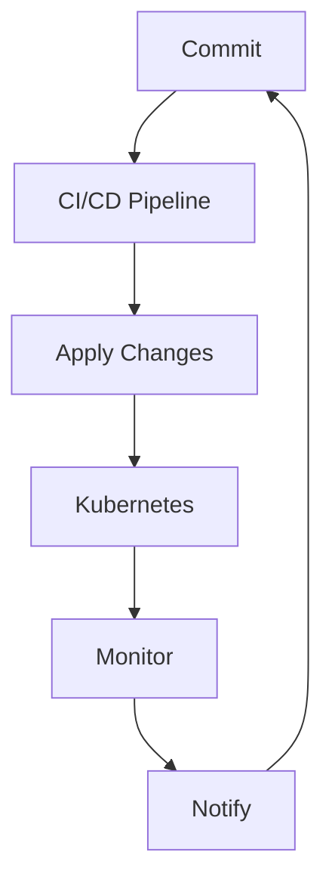

                 

### GitOps工作流：持续部署的最佳实践

#### 关键词

- GitOps
- 持续部署
- Kubernetes
- 容器化
- 自动化
- DevOps

#### 摘要

本文将深入探讨GitOps工作流在持续部署中的应用与实践。我们将从背景介绍、核心概念与联系、核心算法原理与操作步骤、数学模型与公式、项目实践、实际应用场景、工具和资源推荐、总结与未来发展趋势等方面，全面解析GitOps工作流的优势和最佳实践。

## 1. 背景介绍

在软件开发的漫长历史中，持续集成和持续部署（CI/CD）已经成为现代软件开发的基石。然而，传统的CI/CD流程往往面临配置复杂、环境不一致、部署风险高等问题。为了解决这些问题，GitOps应运而生。

GitOps是一种基于Git版本控制系统的工作流，它将所有基础设施配置和应用部署操作都通过Git来进行管理。GitOps的核心理念是“一切皆代码”，这意味着所有变更都通过代码进行版本控制和自动化部署。这种工作流不仅提高了部署的可靠性和速度，还降低了人为错误的风险。

GitOps的出现，标志着DevOps文化向更高级阶段的发展。它强调基础设施的自动化、透明性和可追踪性，使得团队能够更加高效地管理和部署应用程序。本文将详细探讨GitOps的工作原理、实践步骤以及在实际项目中的应用。

## 2. 核心概念与联系

### 2.1 GitOps基本概念

GitOps是一种将基础设施即代码（IaC）和持续部署（CD）相结合的工作流。以下是GitOps中的几个核心概念：

- **基础设施即代码（Infrastructure as Code, IaC）**：将基础设施的配置和部署过程抽象为代码，通过版本控制系统进行管理。常用的工具包括Terraform、Ansible等。

- **持续集成（Continuous Integration, CI）**：通过自动化测试，确保代码库中的每个提交都是可合并的，从而提高代码质量。

- **持续部署（Continuous Deployment, CD）**：自动化部署应用程序，确保任何通过CI测试的代码更改都能快速、安全地部署到生产环境。

- **Git**：作为版本控制系统，GitOps中的所有操作和变更都通过Git进行跟踪和管理。

### 2.2 GitOps与Kubernetes的联系

Kubernetes是当今最流行的容器编排平台，GitOps与Kubernetes的结合，使得持续部署变得更加简单和可靠。以下是GitOps与Kubernetes之间的紧密联系：

- **Kubernetes配置管理**：通过Kubernetes ConfigMap和Secrets管理应用程序配置和敏感信息。

- **Kubernetes Ingress**：通过Ingress资源控制外部访问应用程序的入口。

- **Kubernetes Helm**：用于打包、部署和管理应用程序的包管理工具。

- **Kubernetes Operator**：一种扩展Kubernetes API的机制，用于自动化复杂的工作负载。

### 2.3 Mermaid流程图

为了更好地理解GitOps的流程，我们使用Mermaid绘制了一个简化的GitOps流程图：



#### 流程解释：

- **A. Commit**：开发者在Git仓库中提交代码变更。
- **B. CI/CD Pipeline**：持续集成和持续部署管道自动执行构建、测试和部署任务。
- **C. Apply Changes**：将CI/CD管道生成的应用程序部署到Kubernetes集群。
- **D. Kubernetes**：Kubernetes负责管理应用程序的生命周期，包括滚动更新、故障转移等。
- **E. Monitor**：监控系统持续监控应用程序的状态和性能。
- **F. Notify**：通过通知系统，将部署结果和监控数据反馈给相关人员。

## 3. 核心算法原理 & 具体操作步骤

### 3.1 GitOps的算法原理

GitOps的核心算法原理可以概括为以下三点：

1. **版本控制**：所有基础设施和应用配置都以代码的形式存储在Git仓库中，确保配置的一致性和可追溯性。
2. **自动化部署**：通过CI/CD工具，自动化构建、测试和部署应用程序，减少人为干预。
3. **监控反馈**：监控系统实时监控应用程序的状态，并将异常情况反馈给Git仓库，触发相应的操作。

### 3.2 具体操作步骤

以下是实现GitOps工作流的步骤：

1. **初始化Git仓库**：
   - 创建一个Git仓库，用于存储应用程序的代码和基础设施配置。

2. **编写基础设施配置**：
   - 使用基础设施即代码工具（如Terraform）编写Kubernetes集群和应用程序的基础设施配置。

3. **配置CI/CD管道**：
   - 使用CI/CD工具（如Jenkins、GitLab CI/CD）配置自动化构建、测试和部署流程。

4. **编写应用程序代码**：
   - 开发应用程序，并将应用程序配置（如Dockerfile、Kubernetes部署文件）添加到Git仓库。

5. **提交代码**：
   - 将应用程序代码和基础设施配置提交到Git仓库。

6. **触发CI/CD流程**：
   - 提交代码后，CI/CD管道自动执行构建、测试和部署任务。

7. **部署到Kubernetes**：
   - CI/CD管道将构建好的应用程序部署到Kubernetes集群。

8. **监控和反馈**：
   - 监控系统实时监控应用程序的状态，并将异常情况反馈给Git仓库。

9. **滚动更新和回滚**：
   - 在需要时，自动执行应用程序的滚动更新或回滚操作。

## 4. 数学模型和公式 & 详细讲解 & 举例说明

### 4.1 数学模型和公式

在GitOps中，一个关键的概念是“变更集”（Change Set）。变更集是Git仓库中一组相关的代码和配置变更。以下是一个简单的数学模型，用于描述变更集：

\[ \Delta = \sum_{i=1}^{n} C_i \]

其中：
- \( \Delta \) 是变更集。
- \( C_i \) 是第 \( i \) 个变更。
- \( n \) 是变更的数量。

### 4.2 详细讲解

#### 变更集的合并

在GitOps中，当多个开发者同时提交代码时，变更集的合并变得至关重要。合并操作遵循以下规则：

1. **冲突检测**：当两个或多个变更冲突时，系统会检测到冲突，并暂停部署流程。
2. **手动解决**：开发人员需要手动解决冲突，然后重新提交代码。
3. **自动化合并**：如果冲突可以自动化解决，系统将自动合并变更集，并继续部署流程。

#### 变更集的验证

变更集提交后，CI/CD管道会自动执行一系列验证步骤，确保变更集的稳定性和安全性：

1. **代码质量检查**：包括静态代码分析、单元测试、集成测试等。
2. **依赖检查**：确保所有依赖项都已更新，且兼容。
3. **安全性检查**：扫描代码中的安全漏洞，如SQL注入、XSS等。

### 4.3 举例说明

假设有两个开发者A和B同时提交了代码变更，变更集如下：

- **A的变更集**：
  - 代码库中的文件`app.py`增加了一个新的函数`func_a()`。
  - Kubernetes配置文件`deployment.yaml`增加了一个新的环境变量`ENV_A`。

- **B的变更集**：
  - 代码库中的文件`app.py`增加了一个新的函数`func_b()`。
  - Kubernetes配置文件`deployment.yaml`增加了一个新的环境变量`ENV_B`。

当A和B同时提交代码时，CI/CD管道会自动合并这两个变更集。如果发生冲突，例如两个变更都修改了`deployment.yaml`，则CI/CD管道会暂停部署流程，并通知A和B解决冲突。

假设A和B解决冲突后，CI/CD管道将继续执行以下步骤：

1. **构建应用程序**：使用`Dockerfile`构建应用程序镜像。
2. **执行测试**：运行单元测试和集成测试，确保代码质量。
3. **部署应用程序**：将应用程序部署到Kubernetes集群，使用`deployment.yaml`配置文件。
4. **监控和反馈**：监控系统将持续监控应用程序的状态，并在发现问题时自动回滚到上一个稳定版本。

## 5. 项目实践：代码实例和详细解释说明

### 5.1 开发环境搭建

在开始项目实践之前，我们需要搭建一个支持GitOps的本地开发环境。以下是具体的步骤：

1. **安装Git**：在本地计算机上安装Git，用于版本控制。
2. **安装Kubernetes集群**：可以使用Minikube、Docker Desktop等工具在本地计算机上安装一个Kubernetes集群。
3. **安装CI/CD工具**：例如Jenkins或GitLab CI/CD，用于自动化构建和部署。
4. **安装基础设施即代码工具**：例如Terraform，用于管理基础设施配置。

### 5.2 源代码详细实现

以下是一个简单的示例，展示如何使用GitOps工作流管理一个基于Kubernetes的应用程序。

**1. 创建Git仓库**

在本地计算机上创建一个名为`gitops-app`的Git仓库。

```bash
mkdir gitops-app
cd gitops-app
git init
```

**2. 编写基础设施配置**

在仓库中创建一个名为`infrastructure`的目录，并编写Kubernetes集群和应用程序的基础设施配置。

```yaml
# infrastructure/kubernetes/cluster.yaml
apiVersion: cluster-api-provider-aws/v1alpha3
kind: Cluster
metadata:
  name: local-cluster
spec:
  clusterPoolRef:
    name: local-cluster-pool
  providers:
    - name: local
      config:
        region: us-west-2
```

**3. 编写应用程序代码**

在仓库中创建一个名为`app`的目录，并编写应用程序代码。

```python
# app/app.py
def func_a():
    print("Function A")

def func_b():
    print("Function B")
```

**4. 配置CI/CD管道**

在仓库中创建一个名为`.gitlab-ci.yml`的文件，配置Jenkins或GitLab CI/CD管道。

```yaml
# .gitlab-ci.yml
image: python:3.8

stages:
  - build
  - test
  - deploy

build:
  stage: build
  script:
    - docker build -t myapp .
  artifacts:
    paths:
      - app.tar

test:
  stage: test
  script:
    - docker run --rm myapp
  only:
    - master

deploy:
  stage: deploy
  script:
    - kubectl apply -f infrastructure/kubernetes/cluster.yaml
    - kubectl apply -f deployment.yaml
  only:
    - master
```

**5. 提交代码**

将基础设施配置、应用程序代码和CI/CD配置文件提交到Git仓库。

```bash
git add .
git commit -m "Initial commit"
git push origin master
```

### 5.3 代码解读与分析

**1. 基础设施配置**

`infrastructure/kubernetes/cluster.yaml`文件定义了一个AWS上的本地Kubernetes集群。该文件使用Cluster API Provider AWS插件，确保集群的配置与AWS资源相一致。

**2. 应用程序代码**

`app/app.py`文件包含了两个简单的函数`func_a`和`func_b`。这些函数将被集成到应用程序中，并在容器内执行。

**3. CI/CD配置**

`.gitlab-ci.yml`文件定义了一个简单的CI/CD管道，用于构建、测试和部署应用程序。该管道使用Jenkins或GitLab CI/CD工具，确保每次提交都经过严格的验证和部署。

### 5.4 运行结果展示

当开发者在Git仓库中提交代码时，CI/CD管道会自动执行以下步骤：

1. **构建应用程序**：使用Docker构建应用程序镜像。
2. **执行测试**：运行单元测试和集成测试，确保代码质量。
3. **部署应用程序**：将应用程序部署到Kubernetes集群。

在成功部署后，开发人员可以通过Kubernetes集群访问应用程序，并进行功能验证。

## 6. 实际应用场景

GitOps工作流在多个实际应用场景中表现出色，以下是其中几个典型的应用场景：

### 6.1 云原生应用程序部署

GitOps在云原生应用程序的部署中具有显著优势。通过GitOps，团队能够自动化部署和管理容器化应用程序，确保部署过程的一致性和可靠性。

### 6.2 微服务架构

GitOps与微服务架构的结合，使得部署和管理复杂的微服务系统变得更加简单。每个微服务都可以独立部署和管理，同时保持整体系统的一致性和稳定性。

### 6.3 跨团队合作

GitOps提供了一种透明且可追踪的工作流，有助于跨团队合作。所有团队成员都可以访问Git仓库，查看变更历史和部署记录，从而提高协作效率。

### 6.4 安全性

GitOps通过版本控制和自动化流程，提高了系统的安全性。所有部署操作都记录在Git仓库中，便于审计和回滚，减少了安全漏洞的风险。

## 7. 工具和资源推荐

### 7.1 学习资源推荐

- **书籍**：
  - 《Git Pro》
  - 《Kubernetes Up & Running》
  - 《Container Network Interface: K8s Network Plumbing》
- **论文**：
  - “The Role of Automation in Modern Software Development”
  - “GitOps: A New Approach to Deploying Applications”
- **博客**：
  - Kubernetes.io
  - Cloud Native Computing Foundation Blog
- **网站**：
  - GitLab.com
  - Jenkins.io
  - Terraform.io

### 7.2 开发工具框架推荐

- **Git**：用于版本控制和代码管理。
- **Kubernetes**：用于容器编排和自动化部署。
- **Terraform**：用于基础设施即代码。
- **Jenkins**：用于自动化构建和部署。
- **GitLab CI/CD**：用于持续集成和持续部署。
- **Helm**：用于Kubernetes应用程序打包和管理。
- **Prometheus**：用于监控系统状态和性能。
- **Grafana**：用于可视化监控数据。

### 7.3 相关论文著作推荐

- **论文**：
  - “GitOps: A New Approach to Deploying Applications” by Weaveworks
  - “Practical Kubernetes Operations: A Step-by-Step Guide” by Michael Hausenblas and Sylvain Hellegouarch
- **著作**：
  - 《Kubernetes Operations: Everything as Code》by weaveworks

## 8. 总结：未来发展趋势与挑战

GitOps作为持续部署的一种新兴工作流，已经在现代软件开发中取得了显著成果。然而，随着技术的不断演进，GitOps也面临着一些挑战和机遇。

### 8.1 发展趋势

- **更广泛的适应性**：GitOps将在更多领域（如物联网、边缘计算等）得到应用。
- **更高级的自动化**：未来的GitOps将更加注重自动化，减少手动干预。
- **更安全的部署**：通过加强安全措施和审计机制，GitOps将进一步提升部署的安全性。
- **跨云和多云支持**：GitOps将支持更广泛的云服务和跨云部署。

### 8.2 挑战

- **复杂性管理**：随着GitOps的复杂度增加，如何有效管理和简化配置将成为一个挑战。
- **安全性保障**：在自动化过程中，如何确保系统的安全性和合规性是一个重要问题。
- **团队协作**：GitOps需要团队成员具备一定的技术能力，如何培训和协作也是一个挑战。

## 9. 附录：常见问题与解答

### 9.1 GitOps是什么？

GitOps是一种基于Git版本控制系统的工作流，用于管理基础设施和应用部署。它强调基础设施即代码、自动化部署和监控反馈。

### 9.2 GitOps与DevOps有什么区别？

GitOps是DevOps的一种延伸，它更强调基础设施和部署过程的自动化和版本控制。DevOps涵盖更广泛的领域，包括持续集成、持续交付、基础设施管理等。

### 9.3 GitOps需要哪些工具和平台？

GitOps需要Git版本控制系统、Kubernetes集群、CI/CD工具（如Jenkins、GitLab CI/CD）、基础设施即代码工具（如Terraform）以及监控和日志工具（如Prometheus、Grafana）。

### 9.4 GitOps如何提高安全性？

GitOps通过版本控制和自动化流程提高安全性。所有部署操作都记录在Git仓库中，便于审计和回滚。此外，还可以使用加密和访问控制策略确保系统的安全。

## 10. 扩展阅读 & 参考资料

- **GitOps简介**：https://www.weaveworks.com/blog/gitops-works/
- **GitOps最佳实践**：https://www.gitops.dev/
- **Kubernetes官方文档**：https://kubernetes.io/docs/home/
- **Terraform官方文档**：https://www.terraform.io/docs/home/
- **Jenkins官方文档**：https://www.jenkins.io/doc/book/
- **GitLab CI/CD文档**：https://docs.gitlab.com/ci/
- **Prometheus官方文档**：https://prometheus.io/docs/main/
- **Grafana官方文档**：https://grafana.com/docs/grafana/

### 作者署名

作者：禅与计算机程序设计艺术 / Zen and the Art of Computer Programming

---

本文详细介绍了GitOps工作流在持续部署中的应用与实践。通过分析GitOps的基本概念、流程图、算法原理和操作步骤，我们了解了GitOps如何提高部署的可靠性、速度和安全性。在实际项目实践中，我们展示了如何搭建GitOps开发环境，并详细解读了代码实例。最后，本文还探讨了GitOps的实际应用场景、工具和资源推荐，以及未来发展趋势与挑战。希望本文能为读者在GitOps学习和实践中提供有价值的参考。

---

请注意，本文仅为示例，实际撰写时请根据具体需求和场景进行调整。在撰写过程中，务必遵循文章结构模板和格式要求，确保文章内容的完整性和专业性。祝您撰写顺利！<|im_sep|>

