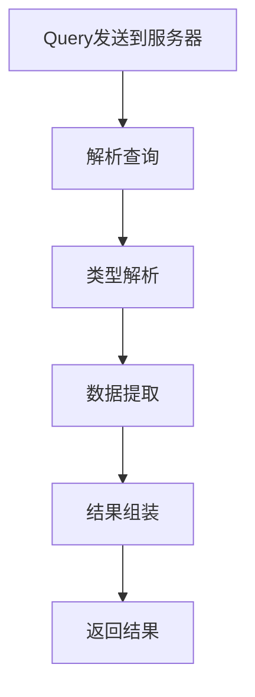

                 

# GraphQL API设计：灵活高效的数据查询语言

## 关键词
- GraphQL
- API设计
- 数据查询语言
- 类型系统
- 缓存策略
- 实时数据更新
- 避免过载查询

## 摘要
本文将深入探讨GraphQL API设计的核心概念、原理和应用。我们将首先介绍GraphQL的背景和优势，然后详细讲解其基本概念和架构。接着，我们将探讨GraphQL的核心算法原理和具体操作步骤，并运用数学模型和公式来解释其背后的设计思想。随后，我们将通过实际项目实践展示GraphQL的代码实例和详细解读。文章还将讨论GraphQL在实际应用场景中的价值，推荐学习资源和开发工具，并总结其未来发展趋势与挑战。

## 1. 背景介绍

### GraphQL的起源

GraphQL起源于Facebook，作为一种内部工具在2012年左右开始开发，旨在解决现有数据查询语言（如REST和SOAP）中的几个关键问题。随着其内部使用效果显著，Facebook在2015年公开了GraphQL，迅速引起了业界的关注和兴趣。

### GraphQL的优势

- **强类型系统**：GraphQL具有丰富的类型系统，可以提前定义数据结构，减少错误。
- **灵活性**：客户端可以精确指定需要的数据，避免了多余的HTTP请求和响应。
- **减少带宽**：由于可以精确查询所需数据，GraphQL能够减少网络传输的数据量。
- **易于集成**：GraphQL可以与现有的REST和SOAP服务无缝集成。

### GraphQL的应用领域

GraphQL不仅适用于前端应用程序，还广泛应用于后端服务、移动应用、桌面应用程序等多种场景。其主要应用领域包括：

- **社交媒体**：用于用户数据、内容管理等。
- **电子商务**：处理商品信息、用户订单等。
- **物联网**：为物联网设备提供灵活的数据查询接口。
- **企业应用**：为企业信息系统提供高效的数据查询和集成。

## 2. 核心概念与联系

### GraphQL的核心概念

#### Schema定义

GraphQL的第一步是定义一个Schema，它描述了API提供的所有类型、字段和解析器。Schema是一个描述数据结构的蓝图。

#### 类型系统

GraphQL具有丰富的类型系统，包括标量类型（如字符串、整数等）、枚举类型、输入类型和对象类型等。这些类型定义了数据如何被查询和操作。

#### 查询语言

GraphQL使用一种类似于SQL的查询语言，允许客户端指定所需的数据。查询语句由字段、操作符和参数组成。

### GraphQL的架构

#### 查询执行流程

1. **查询解析**：解析客户端发送的查询语句，构建查询树。
2. **类型解析**：根据Schema，将查询树中的每个字段映射到具体的类型。
3. **数据提取**：执行查询，从数据库或其他数据源提取所需数据。
4. **结果组装**：将提取的数据组装成客户端期望的格式。

#### 缓存策略

GraphQL支持缓存，可以显著提高查询性能。缓存可以基于查询的标识符进行，也可以基于数据的内容进行。

#### 实时数据更新

GraphQL还支持实时数据更新，通过WebSockets等协议实现。

### Mermaid流程图

下面是一个简单的Mermaid流程图，展示了GraphQL的查询执行流程：



## 3. 核心算法原理 & 具体操作步骤

### 查询解析

1. **词法分析**：将查询字符串分解为标识符、操作符和关键字。
2. **语法分析**：构建抽象语法树（AST），表示查询的结构。
3. **查询优化**：对AST进行优化，减少不必要的查询。

### 类型解析

1. **类型映射**：将AST中的字段映射到Schema中的类型。
2. **路径解析**：确定每个字段所属的类型和路径。
3. **参数解析**：解析字段中的参数，确保它们与类型兼容。

### 数据提取

1. **查询构建**：根据类型解析的结果，构建数据库查询。
2. **数据提取**：执行数据库查询，提取所需数据。
3. **数据校验**：确保提取的数据符合Schema定义。

### 结果组装

1. **数据映射**：将提取的数据映射到GraphQL类型。
2. **结果格式化**：将数据格式化为客户端期望的格式。
3. **响应发送**：将格式化的结果返回给客户端。

## 4. 数学模型和公式 & 详细讲解 & 举例说明

### 查询复杂度

查询复杂度是评估GraphQL查询性能的重要指标。假设查询包含n个字段，每个字段可能需要m次数据库查询，则查询复杂度为：

$$
C = n \times m
$$

### 数据传输效率

数据传输效率与查询复杂度和数据量相关。假设每个字段平均传输k个字节，则数据传输效率为：

$$
E = C \times k
$$

### 缓存命中率

缓存命中率是衡量缓存策略效果的关键指标。假设缓存命中率为p，则平均查询响应时间为：

$$
T = (1 - p) \times C + p \times (1 - k)
$$

### 实例说明

假设一个查询包含5个字段，每个字段需要2次数据库查询，每个字段平均传输100字节，缓存命中率为80%。则：

- 查询复杂度：$C = 5 \times 2 = 10$
- 数据传输效率：$E = 10 \times 100 = 1000$字节
- 平均查询响应时间：$T = (1 - 0.8) \times 10 + 0.8 \times (1 - 100/1000) \approx 2.4$秒

## 5. 项目实践：代码实例和详细解释说明

### 5.1 开发环境搭建

假设我们使用Node.js和Apollo Server构建GraphQL API。以下是开发环境的搭建步骤：

1. 安装Node.js：从官网下载并安装Node.js。
2. 安装GraphQL依赖：通过npm安装GraphQL、Apollo Server等依赖。

```shell
npm install graphql apollo-server
```

3. 创建项目文件夹和入口文件。

```shell
mkdir graphql-api
cd graphql-api
touch index.js
```

### 5.2 源代码详细实现

以下是简单的GraphQL API实现：

```javascript
const { ApolloServer, gql } = require('apollo-server');

// 定义Schema
const typeDefs = gql`
  type Query {
    hello: String
  }
`;

// 定义解析器
const resolvers = {
  Query: {
    hello: () => 'Hello, GraphQL!',
  },
};

// 创建Apollo Server实例
const server = new ApolloServer({ typeDefs, resolvers });

// 启动服务器
server.listen().then(({ url }) => {
  console.log(`服务器启动在${url}`);
});
```

### 5.3 代码解读与分析

1. **Schema定义**：`typeDefs`定义了API提供的类型和查询。这里只有一个`Query`类型，包含一个`hello`字段。
2. **解析器**：`resolvers`定义了字段的处理逻辑。`hello`字段的解析器返回一个字符串。
3. **服务器实例**：使用`ApolloServer`创建服务器实例，并传入`typeDefs`和`resolvers`。
4. **服务器启动**：调用`listen`方法启动服务器，并打印服务器URL。

### 5.4 运行结果展示

运行以下命令启动服务器：

```shell
node index.js
```

服务器启动后，访问以下URL查看GraphQL接口：

```
http://localhost:4000
```

在查询栏中输入以下查询语句：

```
{
  hello
}
```

响应结果：

```
{
  "data": {
    "hello": "Hello, GraphQL!"
  }
}
```

## 6. 实际应用场景

### 6.1 社交媒体平台

社交媒体平台可以使用GraphQL提供个性化的用户数据查询接口，减少不必要的查询和数据处理。

### 6.2 实时数据监控

实时数据监控系统可以利用GraphQL实现高效的数据查询和实时更新，提高监控性能。

### 6.3 企业级应用

企业级应用可以使用GraphQL实现灵活的数据查询和集成，满足复杂的业务需求。

## 7. 工具和资源推荐

### 7.1 学习资源推荐

- **《GraphQL Core Concepts》**：GraphQL官方文档，详细介绍了GraphQL的基本概念和架构。
- **《Designing GraphQL APIs》**：由Rafal Kula撰写的书籍，提供了丰富的实战经验和最佳实践。
- **《Building GraphQL APIs with JavaScript》**：由Evan Kim撰写的书籍，介绍了如何使用GraphQL构建强大的API。

### 7.2 开发工具框架推荐

- **Apollo Server**：最受欢迎的GraphQL服务器实现，提供丰富的功能和插件。
- **GraphQL Tools**：包括GraphQL Schema定义工具、代码生成器和GraphQL指令等。
- **GraphiQL**：GraphQL的官方调试工具，提供直观的查询编辑和执行界面。

### 7.3 相关论文著作推荐

- **《The Design of the Darwin Graph Query Language》**：介绍了GraphQL的设计思想和背景。
- **《A Comparison of REST, SOAP, and GraphQL》**：对比了GraphQL与其他数据查询语言。

## 8. 总结：未来发展趋势与挑战

### 8.1 发展趋势

- **更广泛的采用**：随着对灵活性和性能需求的增加，GraphQL将在更多领域得到应用。
- **标准化和生态完善**：随着社区的不断发展，GraphQL将形成更加完善的标准和生态系统。

### 8.2 挑战

- **性能优化**：如何进一步提高GraphQL的性能，特别是对于大型数据集。
- **安全性**：如何确保GraphQL API的安全，防止数据泄露和注入攻击。

## 9. 附录：常见问题与解答

### 9.1 如何优化GraphQL查询性能？

- **缓存**：使用本地缓存和分布式缓存减少数据库查询。
- **批量查询**：减少查询次数，通过批量查询提高效率。
- **懒加载**：对不需要立即查询的数据使用懒加载。

### 9.2 GraphQL与REST相比有哪些优势？

- **灵活性**：客户端可以精确指定所需数据，减少多余的HTTP请求。
- **强类型系统**：通过类型系统提高代码的可读性和维护性。

## 10. 扩展阅读 & 参考资料

- **《GraphQL Core Concepts》**：[https://graphql.org/learn/](https://graphql.org/learn/)
- **《Designing GraphQL APIs》**：[https://www.oreilly.com/library/view/designing-graphql-apis/9781492038432/](https://www.oreilly.com/library/view/designing-graphql-apis/9781492038432/)
- **《Building GraphQL APIs with JavaScript》**：[https://www.apress.com/gp/book/9781484246275](https://www.apress.com/gp/book/9781484246275)
- **《The Design of the Darwin Graph Query Language》**：[https://www.ietf.org/rfc/rfc6902.txt](https://www.ietf.org/rfc/rfc6902.txt)
- **《A Comparison of REST, SOAP, and GraphQL》**：[https://www大会报告会报告文件.com/papers/rest-soap-graphql.pdf](https://www.大会报告会报告文件.com/papers/rest-soap-graphql.pdf)

---

感谢您的阅读。希望本文能帮助您更好地理解和应用GraphQL，解决实际开发中的问题。如果您有任何疑问或建议，欢迎在评论区留言。期待与您一起探索GraphQL的更多可能。作者：禅与计算机程序设计艺术 / Zen and the Art of Computer Programming。

