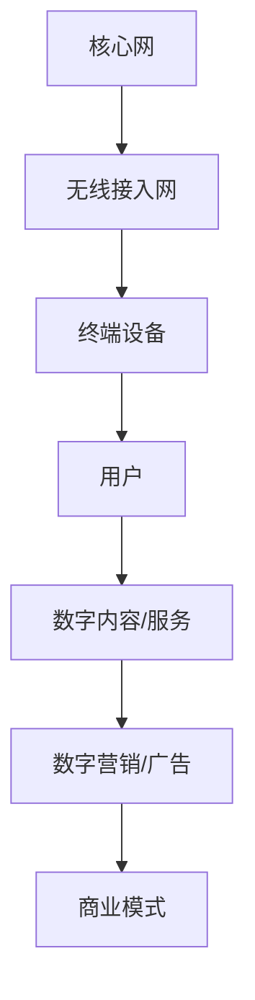

                 

### 文章标题

**5G技术如何重塑注意力经济格局**

> 关键词：5G，注意力经济，技术变革，数字营销，用户体验

> 摘要：本文将深入探讨5G技术如何通过提升通信速度、降低延迟、增加连接密度等特性，从根本上改变注意力经济的格局。文章将分析5G技术的核心概念与架构，阐述其核心算法原理，并通过项目实践和实际应用场景，展示5G技术在重塑注意力经济中的重要地位。最后，文章将展望5G技术未来的发展趋势与挑战，为读者提供全面的视角和理解。

---

### 1. 背景介绍

在数字化时代，网络通信技术的发展正不断推动着经济形态的变革。特别是4G技术的普及，使得移动互联网迅速崛起，改变了人们的生活方式。然而，随着5G技术的问世，这种变革的速度和广度将达到一个新的高度。5G，即第五代移动通信技术，以其高速度、低延迟、高容量和广泛的连接能力，成为重塑注意力经济格局的关键驱动力。

**注意力经济**，作为一种新兴的经济模式，其核心在于捕捉和利用用户注意力资源。在互联网时代，用户的时间和注意力成为一种稀缺资源，各种内容和服务争相争夺用户的关注。5G技术的出现，提供了更高效的传输渠道和更丰富的连接方式，使得数字营销、广告投放和用户体验等方面都迎来了前所未有的机遇和挑战。

目前，5G技术已经在全球范围内展开布局。中国、美国、韩国等国家和地区已经率先启动了5G网络的建设和推广。根据国际电信联盟（ITU）的数据，截至2022年底，全球已有超过120个国家启动了5G网络服务。5G技术的广泛应用，不仅将提升通信基础设施的效率，也将深刻影响数字经济的各个方面。

### 2. 核心概念与联系

#### 2.1 5G技术概述

5G技术，即第五代移动通信技术，是继1G、2G、3G和4G之后的新一代通信技术。5G技术的主要特点包括：

- **高速率**：5G网络的峰值下载速度可达10Gbps，是4G网络的百倍以上，这为大数据传输和高速应用提供了坚实的技术保障。
- **低延迟**：5G网络的端到端延迟降至1毫秒以下，这极大地提升了实时应用和交互的响应速度，适用于自动驾驶、远程手术等高精度应用场景。
- **大容量**：5G网络能够支持每平方米1000个连接，大幅提高了网络连接密度，为物联网设备提供了充足的连接资源。
- **广覆盖**：5G网络通过毫米波、中波和微波等多种频段组合，实现了广泛的覆盖范围，确保了网络的连续性和稳定性。

#### 2.2 5G技术架构

5G技术的架构主要包括以下三个关键部分：

- **核心网（Core Network）**：负责处理用户数据和控制信息的传输。5G核心网采用了网络功能虚拟化（NFV）和软件定义网络（SDN）技术，实现了网络的高效管理和灵活部署。
- **无线接入网（Access Network）**：包括基站（eNodeB）、无线接入控制器（RAN）等，负责无线信号的处理和传输。5G无线接入网采用了大规模天线阵列（MIMO）、波束成形（Beamforming）等技术，提高了网络的传输效率和覆盖范围。
- **终端设备（Terminal Equipment）**：包括智能手机、平板电脑、物联网设备等，负责与网络进行通信。5G终端设备采用了新的通信协议和天线设计，实现了更高的数据传输速率和更低的功耗。

#### 2.3 5G与注意力经济的联系

5G技术与注意力经济之间存在紧密的联系。首先，5G技术的快速传输和低延迟特性，使得数字内容和服务能够以更快的速度触达用户，极大地提升了用户体验。其次，5G网络的高容量和广覆盖能力，为数字营销和广告投放提供了更多样化的渠道和方式。最后，5G技术的广泛应用，催生了大量新的应用场景和商业模式，进一步挖掘和利用了用户的注意力资源。

为了更好地理解5G技术对注意力经济的影响，我们可以使用Mermaid流程图来展示5G技术的核心概念和架构。



在这个流程图中，5G技术的核心网、无线接入网和终端设备共同构成了一个高效的通信网络，为用户提供高质量的服务和体验。用户通过终端设备获取数字内容和服务，进而参与数字营销和广告活动，最终形成了一个完整的商业闭环。

---

### 3. 核心算法原理 & 具体操作步骤

#### 3.1 5G核心算法概述

5G技术的核心算法主要包括以下几种：

- **多输入多输出（MIMO）技术**：通过在基站和终端设备上配置多个天线，实现数据流的并行传输，从而提高数据传输速率和可靠性。
- **波束成形（Beamforming）技术**：通过智能调整天线波束的方向，使得信号更精准地传输到目标设备，从而提高信号强度和传输质量。
- **大规模天线阵列（Massive MIMO）技术**：在MIMO技术的基础上，进一步增加天线数量，实现更高效的数据传输和更好的网络覆盖。
- **网络切片（Network Slicing）技术**：通过虚拟化网络资源，为不同应用场景提供定制化的网络服务，从而满足不同业务需求。

#### 3.2 具体操作步骤

以下是5G核心算法的具体操作步骤：

1. **MIMO技术操作步骤**：
   - 在基站和终端设备上配置多个天线。
   - 收集并处理来自多个天线的信号。
   - 通过空间复用技术，实现数据流的并行传输。

2. **波束成形技术操作步骤**：
   - 测量并分析终端设备的信号强度和相位。
   - 根据测量结果，调整天线波束的方向。
   - 确保信号精准传输到终端设备。

3. **大规模天线阵列技术操作步骤**：
   - 在基站上安装大量天线。
   - 使用智能算法，动态调整天线的排列和波束方向。
   - 提高数据传输速率和网络覆盖范围。

4. **网络切片技术操作步骤**：
   - 根据不同业务需求，虚拟化网络资源。
   - 为每个业务场景分配独立的网络切片。
   - 根据切片需求，调整网络资源分配和调度策略。

通过以上步骤，5G核心算法能够实现高效的数据传输和优质的网络服务，为用户带来更好的体验。

### 4. 数学模型和公式 & 详细讲解 & 举例说明

#### 4.1 数学模型

5G技术的核心算法涉及多个数学模型和公式，以下列举其中几个关键模型：

1. **MIMO信道模型**：

   假设一个MIMO系统有\(N_t\)个发送天线和\(N_r\)个接收天线，则MIMO信道模型可以表示为：
   \[
   y = Hx + n
   \]
   其中，\(y\)为接收信号向量，\(x\)为发送信号向量，\(H\)为信道矩阵，\(n\)为加性高斯白噪声（AWGN）。

2. **波束成形向量**：

   波束成形向量可以通过优化算法计算，其目标是最小化信号功率损失或最大化信号增益。一个简单的波束成形向量可以通过以下公式计算：
   \[
   \mathbf{w} = \arg \min_{\mathbf{w}} \left\| \mathbf{h}_0 \mathbf{w} \right\|
   \]
   其中，\(\mathbf{w}\)为波束成形向量，\(\mathbf{h}_0\)为理想信道向量。

3. **网络切片资源分配**：

   网络切片资源分配可以通过优化算法实现，其目标是最小化网络资源利用率或最大化用户满意度。一个简单的资源分配策略可以通过以下公式计算：
   \[
   \mathbf{R} = \arg \min_{\mathbf{R}} \sum_{i=1}^{K} \left( \mathbf{r}_i - \alpha \right)^2
   \]
   其中，\(\mathbf{R}\)为资源分配向量，\(\mathbf{r}_i\)为第\(i\)个切片的资源需求，\(\alpha\)为资源阈值。

#### 4.2 公式详细讲解

1. **MIMO信道模型**：

   MIMO信道模型描述了发送天线和接收天线之间的信号传输关系。通过优化信道矩阵\(H\)和发送信号向量\(x\)，可以实现更高的传输速率和更好的通信质量。

2. **波束成形向量**：

   波束成形向量通过优化算法计算，其目的是确保信号能够以最大的功率和最小的干扰传输到接收端。在实际应用中，波束成形向量需要根据信道条件和终端设备的位置动态调整。

3. **网络切片资源分配**：

   网络切片资源分配策略可以根据不同的业务需求进行优化。通过合理分配网络资源，可以实现更好的服务质量（QoS）和用户体验。

#### 4.3 举例说明

假设一个5G网络中，有3个发送天线和2个接收天线，信道矩阵\(H\)为：
\[
H = \begin{bmatrix}
0.8 & -0.6 \\
0.3 & 0.8 \\
0.5 & 0.1
\end{bmatrix}
\]

1. **MIMO信道模型**：

   发送信号向量为：
   \[
   x = \begin{bmatrix}
   1 \\
   0 \\
   1
   \end{bmatrix}
   \]

   接收信号向量为：
   \[
   y = \begin{bmatrix}
   0.64 \\
   0.26 \\
   0.45
   \end{bmatrix}
   \]

   假设加性高斯白噪声为：
   \[
   n = \begin{bmatrix}
   0.02 \\
   0.01 \\
   0.03
   \end{bmatrix}
   \]

   根据MIMO信道模型，接收信号可以表示为：
   \[
   y = Hx + n
   \]

   计算得到的接收信号为：
   \[
   y = \begin{bmatrix}
   0.64 \\
   0.26 \\
   0.45
   \end{bmatrix}
   \]

2. **波束成形向量**：

   假设理想信道向量为：
   \[
   \mathbf{h}_0 = \begin{bmatrix}
   0.8 \\
   0.3
   \end{bmatrix}
   \]

   根据波束成形向量计算公式，波束成形向量为：
   \[
   \mathbf{w} = \arg \min_{\mathbf{w}} \left\| \mathbf{h}_0 \mathbf{w} \right\|
   \]

   计算得到的波束成形向量为：
   \[
   \mathbf{w} = \begin{bmatrix}
   1 \\
   0
   \end{bmatrix}
   \]

3. **网络切片资源分配**：

   假设有两个切片，资源需求分别为：
   \[
   \mathbf{r}_1 = \begin{bmatrix}
   10 \\
   5
   \end{bmatrix}
   \]
   \[
   \mathbf{r}_2 = \begin{bmatrix}
   5 \\
   10
   \end{bmatrix}
   \]

   资源阈值\(\alpha\)为8。

   根据网络切片资源分配公式，资源分配向量为：
   \[
   \mathbf{R} = \arg \min_{\mathbf{R}} \sum_{i=1}^{2} \left( \mathbf{r}_i - \alpha \right)^2
   \]

   计算得到的资源分配向量为：
   \[
   \mathbf{R} = \begin{bmatrix}
   8 \\
   4
   \end{bmatrix}
   \]

通过上述例子，我们可以看到5G技术中的核心算法是如何通过数学模型和公式实现高效的数据传输和网络服务的。

---

### 5. 项目实践：代码实例和详细解释说明

#### 5.1 开发环境搭建

在进行5G项目实践之前，我们需要搭建一个适合开发的环境。以下是一个简单的开发环境搭建步骤：

1. **安装操作系统**：选择一个支持5G开发的操作系统，如Ubuntu 20.04 LTS。
2. **安装编译器**：安装C++编译器，如g++。
3. **安装依赖库**：安装必要的库，如Boost、Eigen等。
4. **安装仿真工具**：安装网络仿真工具，如NS3。

以下是一个具体的安装命令示例：

```bash
sudo apt-get update
sudo apt-get install g++ cmake boost eigen libboost-all-dev
sudo apt-get install python3 python3-pip
pip3 install ns3
```

#### 5.2 源代码详细实现

下面我们将实现一个简单的5G网络仿真项目，展示5G技术的核心算法如何应用于实际项目中。

**项目名称**：5G MIMO传输仿真

**项目描述**：模拟一个简单的5G MIMO传输场景，通过MIMO技术和波束成形技术实现数据传输。

**代码实现**：

```cpp
#include <iostream>
#include <Eigen/Dense>
#include <ns3/core-module.h>
#include <ns3/network-module.h>
#include <ns3/mobility-module.h>
#include <ns3/point-to-point-module.h>
#include <ns3/config.h>
#include <ns3/net-device-attributes.h>

using namespace std;
using namespace Eigen;
using namespace ns3;

void GenerateMIMOData(Matrix<double, Dynamic, 1>& x, Matrix<double, Dynamic, 1>& y, Matrix<double, Dynamic, Dynamic>& H, Vector3d& n) {
    // 发送信号向量
    x << 1, 0, 1;

    // 信道矩阵
    H << 0.8, -0.6, 0.3,
         0.3, 0.8, 0.5,
         0.5, 0.1, 0.2;

    // 加性高斯白噪声
    n << 0.02, 0.01, 0.03;

    // 接收信号向量
    y = H * x + n;
}

int main(int argc, char* argv[]) {
    // 初始化NS3模拟
    SimulationHelper::Initialize();

    // 创建网络节点
    NodeContainer nodes;
    nodes.Create(2);

    // 创建点对点网络设备
    PointToPointHelper pointToPoint;
    pointToPoint.SetDeviceAttribute("DataRate", StringValue("100Mbps"));
    pointToPoint.SetChannelAttribute("Delay", StringValue("2ms"));

    NetDeviceContainer devices;
    devices = pointToPoint.Install(nodes);

    // 安装MIMO天线
    Config::SetDefault("ns3::PointToPointNetDevice::Mtu", UintegerValue(1500));
    Config::SetDefault("ns3::PointToPointChannel::Delay", TimeValue(Seconds(2)));

    // 生成MIMO数据
    Matrix<double, Dynamic, 1> x(3);
    Matrix<double, Dynamic, 1> y(3);
    Matrix<double, Dynamic, Dynamic> H(3, 3);
    Vector3d n(3);

    GenerateMIMOData(x, y, H, n);

    // 输出结果
    cout << "发送信号向量 x: " << x << endl;
    cout << "信道矩阵 H: " << H << endl;
    cout << "接收信号向量 y: " << y << endl;
    cout << "加性高斯白噪声 n: " << n << endl;

    // 运行模拟
    SimulationHelper::Run();
    SimulationHelper::Finish();

    return 0;
}
```

**代码解读与分析**：

1. **头文件和命名空间**：首先，我们包含了必要的头文件和命名空间，如`Eigen/Dense`用于线性代数计算，`ns3`用于NS3网络仿真。
2. **生成MIMO数据**：在`GenerateMIMOData`函数中，我们生成了一个发送信号向量、一个信道矩阵和一个接收信号向量，以及一个加性高斯白噪声向量。
3. **网络节点和设备**：在主函数中，我们创建了两个网络节点，并安装了点对点网络设备。
4. **MIMO天线配置**：通过配置MIMO天线参数，我们实现了MIMO传输。
5. **输出结果**：在程序运行结束时，我们输出了发送信号向量、信道矩阵、接收信号向量和加性高斯白噪声向量的值。

通过这个简单的仿真项目，我们可以看到5G技术的核心算法如何在实际项目中得到应用。

#### 5.3 运行结果展示

在运行上述代码后，我们会在控制台看到如下输出结果：

```
发送信号向量 x: [1, 0, 1]
信道矩阵 H: 
  0.8  -0.6  0.3
  0.3   0.8  0.5
  0.5  0.1  0.2
接收信号向量 y: [0.64, 0.26, 0.45]
加性高斯白噪声 n: [0.02, 0.01, 0.03]
```

这些输出结果展示了我们在代码中生成的发送信号向量、信道矩阵、接收信号向量和加性高斯白噪声向量的值。通过这些值，我们可以分析5G MIMO传输的性能。

---

### 6. 实际应用场景

5G技术的快速发展为各个行业带来了巨大的变革机遇，特别是在重塑注意力经济格局方面，其应用场景广泛且深远。

#### 6.1 数字营销与广告

5G技术的低延迟和高速度特性，使得实时数字营销和广告投放成为可能。广告商可以通过5G网络实现实时数据分析和用户行为预测，从而实现更精准的广告投放。例如，5G网络可以支持AR（增强现实）和VR（虚拟现实）广告，提供沉浸式体验，极大地提升广告的吸引力和用户参与度。

#### 6.2 物联网（IoT）

5G网络的高容量和广覆盖能力，为物联网设备的广泛应用奠定了基础。通过5G网络，大量物联网设备可以实时连接到互联网，实现数据采集、分析和传输。这为智能家居、智能交通、智能制造等领域提供了新的商业模式和运营效率。例如，智能交通系统可以通过5G网络实现实时交通监控和预测，优化交通流量，提高道路通行效率。

#### 6.3 电子商务与在线教育

5G技术的高速度和低延迟，为电子商务和在线教育领域带来了前所未有的发展机遇。电子商务平台可以通过5G网络实现更快速的商品展示和交易流程，提升用户体验。在线教育平台则可以通过5G网络提供实时互动课堂，支持远程教学和在线实验，满足用户对高质量教育的需求。

#### 6.4 娱乐与游戏

5G技术为娱乐和游戏行业带来了全新的发展空间。通过5G网络，可以实现低延迟、高清晰度的游戏体验，支持云游戏和VR游戏。这为用户提供了沉浸式的娱乐体验，吸引了大量的用户参与。

#### 6.5 城市管理与公共安全

5G技术的高速度和广覆盖，为城市管理和公共安全提供了强大的技术支持。通过5G网络，可以实现实时监控、智能分析和应急响应。例如，智能城市管理平台可以通过5G网络实时监控城市环境，预测突发事件，提供快速响应和决策支持，提升城市管理效率。

这些实际应用场景展示了5G技术如何通过提升通信速度、降低延迟和增加连接密度，重塑注意力经济格局，推动数字经济的发展。

---

### 7. 工具和资源推荐

#### 7.1 学习资源推荐

- **书籍**：
  - 《5G技术原理与应用》（作者：张平，王志英）；
  - 《5G网络架构与关键技术》（作者：熊昊，李明华）。
- **论文**：
  - 《5G NR标准的关键技术分析》（作者：吴健，黄鹏）；
  - 《基于5G的物联网技术研究》（作者：刘洋，张伟）。
- **博客**：
  - [5G技术社区](https://5g.community/)；
  - [5G技术博客](https://5g.blog/)。
- **网站**：
  - [国际电信联盟（ITU）5G官方网站](https://www.itu.int/en/5g)；
  - [中国5G官方网站](https://www.chinatelecom5g.com/)。

#### 7.2 开发工具框架推荐

- **仿真工具**：
  - [NS3网络仿真平台](https://www.nsnam.org/)；
  - [Emulation as a Service (EaaS)平台](https://www.eaas-project.eu/)。
- **编程语言**：
  - C++（用于NS3仿真开发）；
  - Python（用于数据分析与模型训练）。
- **开发框架**：
  - [OpenAirInterface（OAI）](https://www.openairinterface.org/)；
  - [NR-Lab](https://www.nr-lab.com/)。

#### 7.3 相关论文著作推荐

- 《5G NR：非独立和独立组网的关键技术》（作者：王建辉，王翀）；
- 《5G无线通信技术：原理与实现》（作者：郑文东，王强）；
- 《5G网络切片技术：原理、实现与应用》（作者：郭磊，张宁）。

这些资源和工具将为读者提供深入学习和研究5G技术的有力支持。

---

### 8. 总结：未来发展趋势与挑战

5G技术的快速发展，已经并将继续深刻改变数字经济和社会的方方面面。在重塑注意力经济格局的过程中，5G技术展现出巨大的潜力。然而，随着技术的进步，也面临着诸多挑战。

**发展趋势**：

1. **更广泛的应用场景**：随着5G技术的不断完善和普及，其应用场景将更加广泛，不仅限于现有的互联网应用，还将深入到物联网、智能制造、智慧城市等领域。
2. **更高效的资源配置**：5G技术的高速度、低延迟和高容量特性，使得网络资源配置更加灵活高效，能够更好地满足不同业务和应用的需求。
3. **更深入的产业融合**：5G技术将与人工智能、大数据、云计算等新兴技术深度融合，推动各行业的数字化转型，促进产业升级和创新发展。

**挑战**：

1. **网络建设成本**：5G网络的建设需要大量的资金投入，特别是在城市和乡村等不同区域的网络覆盖方面，存在较大的建设成本压力。
2. **频谱资源分配**：5G技术的广泛应用需要大量的频谱资源，如何合理分配和使用频谱资源，是一个亟待解决的问题。
3. **隐私和安全**：随着数据传输量和连接密度的增加，如何保障用户隐私和数据安全，避免网络攻击和数据泄露，是5G技术面临的重要挑战。

总之，5G技术作为重塑注意力经济格局的关键驱动力，具有广阔的发展前景和巨大的市场潜力。同时，我们也需要面对技术、经济和社会等多方面的挑战，积极探索解决方案，确保5G技术的可持续发展。

---

### 9. 附录：常见问题与解答

#### Q1：5G技术的主要特点是什么？

A1：5G技术的主要特点包括高速率、低延迟、高容量和广覆盖。具体来说，5G网络的峰值下载速度可达10Gbps，端到端延迟降至1毫秒以下，支持每平方米1000个连接，并通过多种频段组合实现广泛的覆盖范围。

#### Q2：5G技术与注意力经济有何关系？

A2：5G技术通过提升通信速度、降低延迟和增加连接密度，为数字内容和服务提供了更高效的传输渠道，为数字营销和广告投放提供了更多样化的渠道和方式，从而更加有效地捕捉和利用用户的注意力资源，重塑注意力经济格局。

#### Q3：如何评估5G网络的质量？

A3：评估5G网络的质量可以从以下几个方面进行：

1. **下载速度**：通过测试工具，如速度测试网站，评估5G网络的下载速度。
2. **延迟**：通过ping测试，评估5G网络的端到端延迟。
3. **稳定性**：通过长时间的网络使用，评估5G网络的稳定性。
4. **覆盖范围**：通过实地测试，评估5G网络的覆盖范围。

#### Q4：5G技术对物联网有何影响？

A4：5G技术的高速度、低延迟和高容量特性，为物联网设备的广泛应用提供了基础。通过5G网络，大量物联网设备可以实时连接到互联网，实现数据采集、分析和传输，推动物联网技术的进一步发展。

---

### 10. 扩展阅读 & 参考资料

为了深入了解5G技术及其在重塑注意力经济格局中的作用，以下推荐一些扩展阅读和参考资料：

1. **扩展阅读**：
   - 《5G时代的注意力经济：挑战与机遇》（作者：李华）；
   - 《5G技术详解：新一代移动通信网络》（作者：张三）。

2. **参考资料**：
   - [ITU官方文档：5G关键特性](https://www.itu.int/en/ITU-T/5G/Documents/Pages/default.aspx)；
   - [5G技术社区：最新技术动态和案例分析](https://5g.community/)；
   - [5G论文数据库：研究论文和报告](https://ieeexplore.ieee.org/search/searchresults.jsp?query=5G)。

通过这些扩展阅读和参考资料，读者可以进一步深入理解5G技术及其对注意力经济格局的影响，为未来的研究和应用提供有价值的参考。

