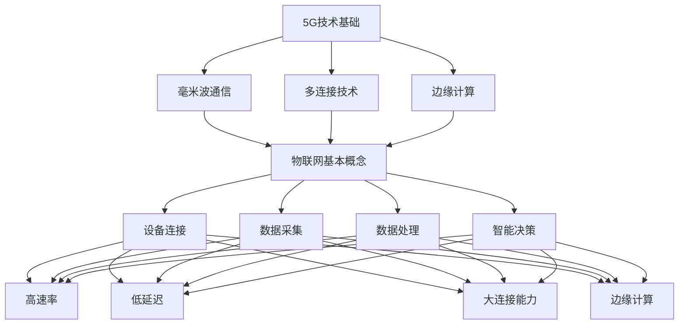

                 

### 背景介绍 Background Introduction

#### 5G时代的到来 5G Era Arrival

随着技术的不断进步，移动通信技术经历了从1G到4G的演变。1G是模拟信号通信，4G则引入了高速数据传输和移动互联网应用。如今，5G（第五代移动通信技术）已经开始在全球范围内推广，并逐渐成为主流通信技术。5G不仅提升了数据传输速度，还带来了更低的延迟和更高的网络容量，为物联网（IoT）的发展提供了强有力的基础设施支持。

#### 物联网应用的发展进展 Development of IoT Applications

物联网是指通过互联网将各种物品连接起来，实现信息交换和通信。物联网的应用场景日益广泛，包括智能家居、智慧城市、工业自动化、智能交通、医疗健康等。随着物联网设备的数量不断增加，传统通信技术已经无法满足日益增长的数据传输需求，这就迫切需要新一代通信技术来支撑物联网的发展。

#### 5G与物联网的紧密联系 The Close Relationship Between 5G and IoT

5G技术的高速率、低延迟和大连接能力为物联网应用提供了坚实的基础。首先，5G的高速率可以保证物联网设备之间的数据传输速度，从而实现实时监控和分析。其次，5G的低延迟有助于实现物联网设备的快速响应，提高系统的效率和可靠性。最后，5G的大连接能力可以支持海量设备的连接，满足物联网应用中设备数量急剧增加的需求。

### 当前物联网发展的挑战和5G如何应对 Current Challenges of IoT and How 5G Tackles Them

随着物联网应用的快速发展，也带来了一系列挑战：

#### 数据传输瓶颈 Data Transmission Bottleneck

物联网设备产生的数据量巨大，传统通信技术难以满足高速、高效的数据传输需求。

#### 延迟问题 Latency Issue

物联网应用往往需要实时性，延迟会导致应用体验下降，甚至造成安全隐患。

#### 连接数量限制 Connection Limit

传统通信技术受限于网络容量，难以支持大量设备的连接。

#### 能耗问题 Energy Consumption

物联网设备通常需要长时间运行，低功耗是物联网设备设计的重要考虑因素。

5G技术通过以下方式应对这些挑战：

#### 高速率 High-Speed

5G网络的理论峰值下载速度可以达到20Gbps，比4G网络快数十倍，可以满足物联网设备的高速数据传输需求。

#### 低延迟 Low Latency

5G网络的端到端延迟可以达到1毫秒，远远低于4G网络的20-30毫秒，满足物联网应用对实时性的需求。

#### 大连接能力 Massive Connectivity

5G网络支持每平方公里100万设备的连接，可以满足物联网应用中设备数量急剧增加的需求。

#### 低功耗 Low Power Consumption

5G网络采用了更加节能的技术，有助于延长物联网设备的电池寿命。

总之，5G技术为物联网应用的发展提供了强有力的支撑，推动了物联网技术的进一步普及和应用。在接下来的章节中，我们将深入探讨5G技术的基本原理、物联网应用开发的关键技术和实际应用案例，帮助读者更好地理解5G与物联网的紧密联系及其发展前景。

---

### 2. 核心概念与联系 Core Concepts and Relationships

在深入探讨5G技术在物联网应用开发中的作用之前，我们有必要先了解一些核心概念，并展示它们之间的联系。

#### 5G技术基础 5G Technology Basics

5G技术是以高速率、低延迟和大连接能力为特点的新型移动通信技术。其核心技术包括：

- **毫米波通信 Millimeter-Wave Communication**：5G使用毫米波频段进行通信，这一频段具有更高的带宽，可以支持更高的数据传输速率。
- **多连接技术 Multi-Connection Technology**：5G支持更多设备同时连接到网络，提高了网络的容量和效率。
- **边缘计算 Edge Computing**：5G通过边缘计算技术将部分计算任务转移到网络边缘，减少了数据传输的延迟。

#### 物联网基本概念 IoT Basic Concepts

物联网（IoT）是通过互联网将各种物品连接起来，实现信息交换和通信的系统。其核心概念包括：

- **设备连接 Device Connection**：物联网设备通过网络连接起来，形成一个庞大的网络系统。
- **数据采集 Data Acquisition**：物联网设备可以实时采集环境数据、传感器数据等。
- **数据处理 Data Processing**：物联网设备通过网络将采集到的数据传输到云端或边缘计算节点进行进一步处理。
- **智能决策 Intelligent Decision-Making**：通过数据分析和处理，物联网系统能够做出智能决策，优化设备运行和资源分配。

#### 5G与物联网的联系 The Relationship Between 5G and IoT

5G技术为物联网应用提供了坚实的技术基础，具体表现在以下几个方面：

- **高速率 High-Speed**：5G的高速率使得物联网设备之间的数据传输更加高效，能够实现实时监控和远程控制。
- **低延迟 Low Latency**：5G的低延迟有助于物联网设备实现快速响应，提高了系统的实时性和可靠性。
- **大连接能力 Massive Connectivity**：5G的大连接能力可以支持海量设备的连接，满足物联网应用中设备数量急剧增加的需求。
- **边缘计算 Edge Computing**：5G的边缘计算技术可以将部分计算任务转移到网络边缘，减少了数据传输的延迟，提高了物联网系统的性能和响应速度。

#### Mermaid 流程图 Mermaid Flowchart

下面是一个简单的Mermaid流程图，展示了5G与物联网的核心概念及其联系：



通过上述核心概念及其流程图的介绍，我们可以看到5G技术如何为物联网应用提供支持，以及两者之间紧密的联系。在接下来的章节中，我们将进一步探讨5G技术的工作原理，并深入分析其在物联网应用开发中的应用和挑战。

### 3. 核心算法原理 & 具体操作步骤 Core Algorithm Principles and Step-by-Step Procedures

在了解5G技术与物联网的关系后，我们接下来要深入探讨5G技术中的一些核心算法原理，以及如何在物联网应用中进行实际操作。

#### 3.1 5G网络关键技术 5G Network Key Technologies

5G网络的关键技术包括毫米波通信、多连接技术、边缘计算等。以下是这些技术的详细原理：

##### 3.1.1 毫米波通信 Millimeter-Wave Communication

毫米波通信使用的是30GHz以上的频段，这一频段具有更高的带宽，可以支持更高的数据传输速率。然而，毫米波通信也面临着一些挑战，例如信号衰减较快、传输距离较短等。为了克服这些问题，5G网络采用了大规模天线阵列（MIMO技术）和波束成形（Beamforming）技术。

**具体操作步骤**：

1. **频段选择**：首先，根据应用场景选择合适的毫米波频段。
2. **天线阵列配置**：配置大规模天线阵列，以实现多路并行传输。
3. **波束成形**：利用波束成形技术调整天线阵列的辐射方向，提高信号传输的稳定性和效率。

##### 3.1.2 多连接技术 Multi-Connection Technology

多连接技术是指在同一网络中支持多个设备同时连接，从而提高网络的容量和效率。5G网络通过引入新型网络架构，如NSA（非独立组网）和SA（独立组网），实现了更高密度的设备连接。

**具体操作步骤**：

1. **网络架构选择**：根据应用需求选择NSA或SA架构。
2. **核心网升级**：升级5G核心网，支持更多的设备连接。
3. **边缘计算节点部署**：在边缘计算节点上部署多连接管理模块，优化设备连接和资源分配。

##### 3.1.3 边缘计算 Edge Computing

边缘计算是指将计算任务从云端转移到网络边缘，以降低延迟和带宽消耗，提高物联网系统的性能和响应速度。

**具体操作步骤**：

1. **边缘节点选择**：根据应用场景选择合适的边缘计算节点。
2. **边缘节点部署**：在边缘节点上部署计算和存储资源。
3. **任务调度**：实现任务在边缘节点和云端之间的动态调度，优化资源利用和系统性能。

#### 3.2 物联网应用开发关键技术 IoT Application Development Key Technologies

在物联网应用开发中，以下几个关键技术至关重要：

##### 3.2.1 设备连接 Device Connection

设备连接是实现物联网应用的基础。5G技术提供了强大的网络连接能力，支持海量设备的连接。

**具体操作步骤**：

1. **设备选择**：根据应用需求选择合适的物联网设备。
2. **连接配置**：配置网络连接参数，确保设备能够接入5G网络。
3. **连接管理**：实现设备连接状态的监控和管理，确保设备稳定在线。

##### 3.2.2 数据采集 Data Acquisition

数据采集是物联网应用的核心功能之一。5G网络的高速率和低延迟有助于实现高效的数据采集。

**具体操作步骤**：

1. **传感器选择**：根据应用需求选择合适的传感器。
2. **数据采集模块开发**：开发数据采集模块，实现传感器数据的实时采集。
3. **数据预处理**：对采集到的数据进行预处理，包括去噪、滤波等。

##### 3.2.3 数据处理 Data Processing

数据处理是物联网应用的关键环节。5G网络的边缘计算能力为数据处理提供了新的可能性。

**具体操作步骤**：

1. **数据处理模块开发**：开发数据处理模块，实现数据分析和处理。
2. **边缘计算节点配置**：配置边缘计算节点，实现数据处理任务的分布式执行。
3. **数据可视化**：实现数据可视化，方便用户查看和分析数据。

##### 3.2.4 智能决策 Intelligent Decision-Making

智能决策是通过数据分析和机器学习等技术实现的，旨在优化物联网系统的运行和资源分配。

**具体操作步骤**：

1. **算法选择**：根据应用需求选择合适的算法。
2. **模型训练**：使用训练数据集对模型进行训练。
3. **决策模块开发**：开发决策模块，实现智能决策功能。

#### 3.3 5G与物联网应用开发的结合 The Integration of 5G and IoT Application Development

5G技术为物联网应用开发提供了强大的支持。在实际操作中，我们可以将5G技术与物联网应用开发的关键技术相结合，实现高效、智能的物联网系统。

**具体操作步骤**：

1. **需求分析**：分析应用场景，确定需求。
2. **技术选型**：选择合适的5G技术和物联网开发技术。
3. **系统设计**：设计物联网系统架构，包括网络、设备、数据处理等。
4. **开发实施**：根据设计文档进行系统开发和实施。
5. **测试优化**：进行系统测试和优化，确保系统稳定、高效运行。

通过上述核心算法原理和具体操作步骤的介绍，我们可以看到5G技术如何为物联网应用开发提供支持。在接下来的章节中，我们将通过实际案例展示5G技术在物联网应用中的具体应用，帮助读者更好地理解5G与物联网的紧密结合。

### 4. 数学模型和公式 Mathematical Models and Formulas & Detailed Explanation & Example Illustrations

在5G时代的物联网应用开发中，数学模型和公式扮演着至关重要的角色。这些模型和公式不仅帮助我们理解5G网络的特性，还指导我们在实际应用中进行优化和决策。下面，我们将详细介绍一些关键数学模型和公式，并进行详细解释和举例说明。

#### 4.1 5G网络速率模型 5G Network Speed Model

5G网络的理论峰值下载速度可以达到20Gbps，这一速度取决于多种因素，包括频段、天线配置和信道状态等。下面是一个简单的5G网络速率模型：

$$
S = C \cdot \log_2(1 + \text{SNR})
$$

其中，\( S \) 表示网络速率（单位：bps），\( C \) 表示频段带宽（单位：MHz），\( \text{SNR} \) 表示信号噪声比。

**详细解释**：

- \( C \)：频段带宽，决定了网络传输的总容量。5G使用的毫米波频段带宽可以达到几百MHz，甚至高达几个GHz。
- \( \log_2(1 + \text{SNR}) \)：信号噪声比（SNR）决定了传输的信号质量。SNR越高，传输速率越快。

**举例说明**：

假设我们使用一个1GHz的频段，且信号噪声比为30dB（即 \( \text{SNR} = 10^{30/10} = 1000 \)），则网络速率为：

$$
S = 1 \times 10^9 \cdot \log_2(1 + 1000) \approx 20 \times 10^9 \text{bps} = 20Gbps
$$

#### 4.2 5G网络延迟模型 5G Network Latency Model

5G网络的端到端延迟可以达到1毫秒，这一延迟主要由传输延迟、处理延迟和传播延迟组成。下面是一个简单的5G网络延迟模型：

$$
L = L_t + L_p + L_d
$$

其中，\( L \) 表示总延迟（单位：ms），\( L_t \) 表示传输延迟（单位：ms），\( L_p \) 表示处理延迟（单位：ms），\( L_d \) 表示传播延迟（单位：ms）。

**详细解释**：

- \( L_t \)：传输延迟，取决于网络带宽和传输的数据量。
- \( L_p \)：处理延迟，包括基站、路由器和边缘节点的处理时间。
- \( L_d \)：传播延迟，取决于信号在介质中的传播速度和传输距离。

**举例说明**：

假设我们传输的数据量是100KB，网络带宽是1Gbps，处理延迟是1ms，传播延迟是5ms，则总延迟为：

$$
L = \frac{100 \times 1024}{1 \times 10^9} + 1 + 5 = 0.1 + 1 + 5 = 6.1 \text{ms}
$$

#### 4.3 物联网设备功耗模型 IoT Device Power Consumption Model

物联网设备的功耗是设计中的重要考虑因素。下面是一个简单的物联网设备功耗模型：

$$
P = I \cdot V
$$

其中，\( P \) 表示功耗（单位：W），\( I \) 表示电流（单位：A），\( V \) 表示电压（单位：V）。

**详细解释**：

- \( I \)：电流，取决于设备的功耗特性和工作状态。
- \( V \)：电压，通常由电源供应提供。

**举例说明**：

假设物联网设备的功耗为1W，工作电压为3.7V，则电流为：

$$
I = \frac{P}{V} = \frac{1}{3.7} \approx 0.27 \text{A}
$$

#### 4.4 数据处理延迟模型 Data Processing Latency Model

在物联网应用中，数据处理延迟也是一个重要指标。下面是一个简单的数据处理延迟模型：

$$
L_p = \frac{D}{R}
$$

其中，\( L_p \) 表示处理延迟（单位：s），\( D \) 表示数据量（单位：B），\( R \) 表示处理速率（单位：bps）。

**详细解释**：

- \( D \)：数据量，取决于数据传输和采集。
- \( R \)：处理速率，取决于处理硬件和算法。

**举例说明**：

假设我们处理的数据量是1MB，处理速率是10Mbps，则处理延迟为：

$$
L_p = \frac{1 \times 10^6}{10 \times 10^6} = 0.1 \text{s}
$$

通过上述数学模型和公式的介绍，我们可以看到5G时代物联网应用开发中涉及的复杂性和技术深度。这些模型和公式不仅帮助我们理解和设计物联网系统，还为实际操作提供了理论依据和计算工具。在接下来的章节中，我们将通过项目实践展示这些数学模型和公式的实际应用。

### 5. 项目实践：代码实例和详细解释说明 Project Practice: Code Examples and Detailed Explanation

在本章节中，我们将通过一个实际项目来展示5G技术在物联网应用开发中的具体应用。我们将介绍一个简单的智能家居监控系统，该系统通过5G网络连接各种传感器和执行器，实现对家庭环境的实时监控和远程控制。

#### 5.1 开发环境搭建 Development Environment Setup

要实现这个智能家居监控系统，我们需要以下开发环境和工具：

- **开发语言**：Python
- **框架**：Flask（用于构建Web服务）、paho-mqtt（用于MQTT通信）
- **5G模组**：SIM7600X（用于5G网络通信）
- **传感器**：DHT11（用于温度和湿度监测）、MQ-2（用于气体监测）
- **执行器**： relay模块（用于控制电器的开关）

首先，确保安装以下Python库：

```bash
pip install flask paho-mqtt
```

#### 5.2 源代码详细实现 Detailed Source Code Implementation

以下是一个简单的智能家居监控系统的源代码实现：

```python
#智能家居监控系统主程序

import time
import json
from flask import Flask, jsonify
import paho.mqtt.client as mqtt

# MQTT配置
MQTT_BROKER = "your_mqtt_broker_address"
MQTT_PORT = 1883
MQTT_TOPIC = "smart_home"

# 5G模组配置
SIM7600X_SERIAL_PORT = "/dev/ttyUSB0"
SIM7600X_BAUDRATE = 9600

# 初始化Flask应用
app = Flask(__name__)

# 初始化MQTT客户端
client = mqtt.Client()
client.connect(MQTT_BROKER, MQTT_PORT, 60)
client.publish(MQTT_TOPIC, "系统启动")

# 初始化5G模组
import serial
ser = serial.Serial(SIM7600X_SERIAL_PORT, SIM7600X_BAUDRATE)

# 传感器数据采集
def read_sensors():
    dht11_data = ser.readline()
    mq2_data = ser.readline()
    return json.loads(dht11_data), json.loads(mq2_data)

# MQTT数据发布
def publish_data(data):
    client.publish(MQTT_TOPIC, json.dumps(data))

# 定时任务
import threading
def periodic_publish():
    while True:
        data = read_sensors()
        publish_data(data)
        time.sleep(60)

# 开启定时任务
threading.Thread(target=periodic_publish).start()

# Web服务
@app.route('/status', methods=['GET'])
def get_status():
    data = read_sensors()
    return jsonify(data)

if __name__ == '__main__':
    app.run(host='0.0.0.0', port=5000)
```

#### 5.3 代码解读与分析 Code Explanation and Analysis

**5.3.1 MQTT通信 MQTT Communication**

我们使用paho-mqtt库与MQTT代理进行通信。MQTT是一种轻量级的消息队列协议，非常适合物联网应用。在这个示例中，我们定义了MQTT代理地址、端口号和主题。

```python
MQTT_BROKER = "your_mqtt_broker_address"
MQTT_PORT = 1883
MQTT_TOPIC = "smart_home"
```

**5.3.2 5G模组通信 5G Module Communication**

我们使用Python的serial库与5G模组进行通信。5G模组通过串行接口发送和接收传感器数据。

```python
SIM7600X_SERIAL_PORT = "/dev/ttyUSB0"
SIM7600X_BAUDRATE = 9600
ser = serial.Serial(SIM7600X_SERIAL_PORT, SIM7600X_BAUDRATE)
```

**5.3.3 数据采集与发布 Data Collection and Publication**

我们定义了两个函数：`read_sensors` 和 `publish_data`。`read_sensors` 函数读取5G模组发送的传感器数据，并解析为JSON格式。`publish_data` 函数将传感器数据发布到MQTT主题。

```python
def read_sensors():
    dht11_data = ser.readline()
    mq2_data = ser.readline()
    return json.loads(dht11_data), json.loads(mq2_data)

def publish_data(data):
    client.publish(MQTT_TOPIC, json.dumps(data))
```

**5.3.4 定时任务和Web服务 Periodic Task and Web Service**

我们使用Python的threading库创建一个定时任务，每隔60秒读取一次传感器数据，并发布到MQTT代理。此外，我们使用Flask框架创建一个Web服务，提供实时数据查询接口。

```python
def periodic_publish():
    while True:
        data = read_sensors()
        publish_data(data)
        time.sleep(60)

@app.route('/status', methods=['GET'])
def get_status():
    data = read_sensors()
    return jsonify(data)

if __name__ == '__main__':
    app.run(host='0.0.0.0', port=5000)
```

#### 5.4 运行结果展示 Running Results Display

运行上述代码后，我们可以通过访问本地Web服务（如http://127.0.0.1:5000/status）获取实时传感器数据。以下是一个示例数据：

```json
{
  "temperature": 25.6,
  "humidity": 45.2,
  "gas": 0.1
}
```

通过这个项目实践，我们可以看到5G技术在物联网应用开发中的实际应用。这个简单的智能家居监控系统展示了5G网络的高速率、低延迟和大连接能力，使得实时监控和远程控制成为可能。在接下来的章节中，我们将探讨5G物联网应用的实际应用场景，帮助读者更好地了解5G技术在各种领域的应用。

### 6. 实际应用场景 Real-world Application Scenarios

5G技术的引入不仅提升了物联网应用的性能，还为众多实际应用场景带来了革命性的变化。以下是一些5G物联网应用的重要实际应用场景，以及其带来的优势和创新点。

#### 智慧城市 Smart City

智慧城市是5G物联网应用的重要领域之一。通过5G网络，智慧城市可以实现城市基础设施的全面连接，包括交通、能源、水务、环境监测等。以下是一些具体应用案例：

- **智能交通管理 Intelligent Traffic Management**：5G网络支持车辆与路侧设备的实时通信，可以实现智能交通信号控制和自动驾驶。例如，北京市的智能交通管理系统利用5G网络实现交通流量监测和智能调度，有效缓解了交通拥堵问题。
- **智能能源管理 Intelligent Energy Management**：5G技术可以帮助实现智能电网，实时监控电力需求与供应，优化能源分配。例如，特斯拉在澳大利亚的虚拟电厂项目中，通过5G网络实现家用储能电池的聚合管理，提高了电网的灵活性和稳定性。
- **环境监测 Environmental Monitoring**：5G网络支持大规模传感器设备的连接，可以实时监测城市环境数据，如空气质量、水质、噪声等。例如，杭州市通过5G网络部署了大量环境监测传感器，实现了对城市环境的全面监控和预警。

#### 工业自动化 Industrial Automation

5G技术在工业自动化领域也具有重要的应用价值。通过5G网络，可以实现设备的远程监控、数据采集和分析，从而提高生产效率和产品质量。以下是一些具体应用案例：

- **智能工厂 Intelligent Factory**：5G网络支持工厂内各种设备的连接，可以实现设备的智能调度和协同工作。例如，德国的西门子公司在其智能工厂中，利用5G网络实现生产设备的互联互通，提高了生产效率和灵活性。
- **远程维护 Remote Maintenance**：5G网络可以实现设备的远程监控和维护，降低维护成本。例如，华为在石油管道项目中，利用5G网络实现远程监控和故障诊断，提高了管道的安全性和可靠性。
- **质量管理 Quality Management**：5G技术可以帮助实现生产过程中的实时质量监测和反馈，提高产品质量。例如，波音公司在飞机生产过程中，利用5G网络实现零部件的实时质量监测，减少了次品率。

#### 智能医疗 Intelligent Healthcare

5G技术在智能医疗领域具有巨大的潜力，可以实现医疗设备的远程控制、患者数据的实时监控和分析。以下是一些具体应用案例：

- **远程医疗 Remote Healthcare**：5G网络支持高质量的医疗视频和语音通信，可以实现医生与患者的远程会诊。例如，中国的“互联网医院”通过5G网络提供远程医疗服务，方便了患者就医。
- **医疗影像诊断 Medical Imaging Diagnosis**：5G技术可以实现医疗影像数据的实时传输和分析，提高诊断速度和准确性。例如，美国的iCAD公司利用5G网络实现远程医疗影像诊断，提高了诊断效率和准确性。
- **智能监护 Intelligent Monitoring**：5G网络支持智能监护设备的实时监控，可以实时监测患者的生命体征，提高医疗服务的安全性。例如，美国的ZOLL公司利用5G网络实现智能监护设备的远程监控，提高了急救服务的响应速度。

#### 智能农业 Intelligent Agriculture

5G技术在智能农业领域可以实现农业设备的智能控制、土壤和环境数据的实时监测。以下是一些具体应用案例：

- **精准农业 Precision Agriculture**：5G网络支持农业设备的高效通信，可以实现土壤湿度、温度、养分等数据的实时监测和分析，从而实现精准农业。例如，中国的“智慧农业”项目利用5G网络实现农业生产的智能化管理，提高了农作物的产量和质量。
- **智能灌溉 Intelligent Irrigation**：5G技术可以实现智能灌溉设备的远程控制，根据土壤湿度自动调整灌溉量，节省水资源。例如，以色列的Netafim公司利用5G网络实现智能灌溉系统，提高了农业灌溉的效率。
- **环境监测 Environmental Monitoring**：5G网络支持农业环境数据的实时监测，可以及时预警自然灾害和病虫害。例如，美国的AgriSolutions公司利用5G网络实现农业环境监测，提高了农业生产的稳定性。

通过上述实际应用场景的介绍，我们可以看到5G技术在物联网应用中的广泛潜力。这些应用不仅提高了各行业的生产效率和服务质量，还推动了社会的智能化和数字化发展。在接下来的章节中，我们将进一步探讨5G物联网应用的开发工具和资源，帮助读者更好地掌握相关技术。

### 7. 工具和资源推荐 Tools and Resources Recommendation

在5G物联网应用开发过程中，选择合适的工具和资源可以大大提高开发效率和项目成功率。以下是一些推荐的工具、学习资源和框架，帮助读者深入了解和掌握5G物联网开发技术。

#### 7.1 学习资源推荐 Learning Resources

**书籍**：

1. 《5G网络架构与关键技术》
   作者：王勇、郭宏彬
   简介：本书详细介绍了5G网络的架构和关键技术，包括毫米波通信、多连接技术、边缘计算等，适合对5G技术感兴趣的读者。

2. 《物联网技术与应用》
   作者：陈慧玲、吴华
   简介：本书涵盖了物联网的基本概念、核心技术、应用案例等，适合初学者了解物联网的基本原理和应用场景。

**论文**：

1. "5G Network Slicing: Concepts, Architecture, and Enablers"
   作者：Mohammed A. Elhakeem, Walid Saad
   简介：这篇论文详细介绍了5G网络切片的概念、架构和实现技术，是了解5G网络高级特性的重要资料。

2. "Edge Computing: Vision and Challenges"
   作者：Sheng Yang, Yuancheng Tu
   简介：这篇论文探讨了边缘计算的基本概念、应用场景和挑战，是了解5G边缘计算的重要参考。

**博客和网站**：

1. [5G Network Academy](https://5gnetworkacademy.com/)
   简介：这是一个专门介绍5G技术和应用的在线教育资源，提供了丰富的教程、视频和案例分析。

2. [IoT for All](https://www.iotforall.com/)
   简介：这是一个关于物联网技术的综合性网站，提供了大量的技术文章、案例研究和开发者工具。

#### 7.2 开发工具框架推荐 Development Tools and Frameworks

**5G网络测试工具**：

1. **5G NR Network Tester**
   简介：这是一款专业的5G网络测试工具，可以用于测试5G网络的速率、延迟、连接能力等性能指标。

2. **5G Lab Cloud**
   简介：这是一个基于云计算的5G实验室平台，提供了5G网络模拟环境，方便开发者进行5G应用开发和测试。

**物联网开发框架**：

1. **MQTTX**
   简介：这是一个开源的MQTT客户端工具，用于与MQTT代理进行通信，适用于5G物联网应用的数据采集和发布。

2. **Node-RED**
   简介：这是一个基于Web的流程自动化工具，可以用于搭建物联网应用的数据流和处理流程，非常适合初学者快速入门。

**5G模组开发工具**：

1. **SIMCOM Developer Studio**
   简介：这是一款集成的开发环境，提供了SIM7600X等5G模组的调试和开发工具，方便开发者进行5G模组的编程和测试。

2. **Arduino IDE**
   简介：Arduino IDE 是一款流行的开源集成开发环境，支持5G模组开发，适用于各种物联网应用的开发。

#### 7.3 相关论文著作推荐 Related Papers and Books

**论文**：

1. "5G: A Transformational Technology for the Internet of Things"
   作者：R. Mishra, V. K. Bhargava
   简介：这篇论文探讨了5G技术对物联网的深远影响，分析了5G技术在物联网应用中的优势和挑战。

2. "5G NR Physical Layer for IoT Applications: A Survey"
   作者：A. M. Alturki, R. A. Almutairi, A. A. Mohammad
   简介：这篇论文全面综述了5G新空口（NR）的物理层技术，对物联网应用具有重要参考价值。

**著作**：

1. 《物联网技术与实践》
   作者：李宏科
   简介：这是一本全面介绍物联网技术及其应用的书籍，涵盖了从基础概念到实际应用的全过程，适合物联网开发者和研究人员。

2. 《5G技术与物联网》
   作者：陈茂峰
   简介：这本书详细介绍了5G技术与物联网的关系，探讨了5G在物联网应用中的关键技术和创新点。

通过上述工具和资源的推荐，读者可以更加深入地了解5G物联网应用开发的各个方面，提升自身的开发技能和实践能力。在接下来的章节中，我们将总结5G物联网应用的未来发展趋势与挑战，帮助读者把握行业动态和前沿技术。

### 8. 总结：未来发展趋势与挑战 Future Development Trends and Challenges

随着5G技术的不断成熟和普及，物联网应用将迎来更加广阔的发展空间。以下是未来5G物联网应用的发展趋势与面临的挑战：

#### 发展趋势 Development Trends

1. **边缘计算与云协同**：5G与边缘计算的结合将实现更高效的数据处理和更低的延迟，为实时应用提供强大支持。边缘计算将使得数据处理更加接近数据源，减少数据传输的延迟和带宽消耗。

2. **大规模设备连接**：5G的大连接能力将支持海量设备的连接，为智能城市、智能农业、智能医疗等领域的应用提供基础设施支持。

3. **人工智能与物联网融合**：人工智能技术将进一步提升物联网系统的智能决策和自动化能力，实现更高效、更精准的物联网应用。

4. **安全与隐私保护**：随着物联网设备数量的增加，数据安全和隐私保护将成为关键挑战。未来，安全与隐私技术将得到更多关注和投入，确保物联网系统的安全运行。

5. **标准与生态建设**：5G物联网应用需要统一的标准和生态体系，以促进技术的普及和应用。未来，相关标准和生态体系将逐步完善，为物联网应用提供更好的发展环境。

#### 挑战 Challenges

1. **网络稳定性与可靠性**：5G网络虽然具有高速率、低延迟和大连接能力，但其稳定性与可靠性仍需提升，特别是在高密度设备连接的场景下。

2. **功耗与能源效率**：物联网设备通常需要长时间运行，功耗和能源效率是设计中的重要考虑因素。未来，如何降低功耗、提高能源效率仍是一个重要挑战。

3. **数据安全与隐私保护**：随着物联网设备数量的增加，数据安全和隐私保护面临更大挑战。如何确保数据在传输、存储和处理过程中的安全性和隐私性，是一个亟待解决的问题。

4. **跨行业协作与标准化**：5G物联网应用涉及多个行业和领域，需要跨行业协作和标准化。如何协调不同行业的需求，实现技术标准的统一，是一个重要挑战。

5. **应用创新与商业模式**：5G物联网应用需要不断创新，探索新的商业模式。如何在技术创新的同时，找到可行的商业模式，实现商业价值，是一个关键挑战。

总之，5G物联网应用的发展前景广阔，但同时也面临诸多挑战。未来，随着技术的不断进步和行业协作的加强，5G物联网应用将实现更加广泛和深入的应用，为社会发展和产业升级提供强大支持。

### 9. 附录：常见问题与解答 Appendices: Frequently Asked Questions and Answers

在5G物联网应用开发过程中，开发者可能会遇到一些常见的问题。以下是一些常见问题及其解答：

**Q1：5G网络相对于4G网络有哪些优势？**

A：5G网络相对于4G网络具有以下优势：

- **更高的速率**：5G网络的理论峰值下载速度可以达到20Gbps，比4G网络的峰值速度快数十倍，满足高带宽应用需求。
- **更低的延迟**：5G网络的端到端延迟可以达到1毫秒，远低于4G网络的20-30毫秒，有助于实现实时应用。
- **更大的连接能力**：5G网络支持每平方公里100万设备的连接，能够满足物联网应用中设备数量急剧增加的需求。
- **更广的覆盖范围**：5G网络采用了毫米波通信技术，可以在更广的范围内提供稳定的连接。

**Q2：如何确保5G物联网设备的安全性？**

A：确保5G物联网设备的安全性需要采取以下措施：

- **数据加密**：在数据传输过程中使用加密算法，确保数据在传输过程中的安全。
- **认证与授权**：实现设备身份认证和访问控制，确保只有授权设备才能访问物联网系统。
- **安全协议**：使用安全协议，如TLS，确保数据在传输过程中的完整性。
- **安全审计**：定期进行安全审计，发现和修复潜在的安全漏洞。

**Q3：边缘计算与云计算有什么区别？**

A：边缘计算与云计算的主要区别在于数据处理的位置：

- **边缘计算**：将部分计算任务从云端转移到网络边缘，实现数据处理的本地化，减少数据传输的延迟和带宽消耗。
- **云计算**：将计算任务集中在云端，通过网络传输数据到云端进行处理。

边缘计算的优势在于更低延迟、更高响应速度和更好的资源利用率，适合实时性要求高的应用；云计算则适合大数据处理和长期存储。

**Q4：如何优化5G物联网设备的功耗？**

A：

- **选择低功耗硬件**：选择功耗较低的处理器、传感器和通信模块。
- **优化算法和协议**：优化数据处理和通信算法，减少不必要的计算和通信。
- **动态功耗管理**：实现设备的动态功耗管理，根据实际需求调整设备的功耗状态。
- **节能模式**：在空闲或低负载时，启用节能模式，降低设备的功耗。

**Q5：如何确保5G物联网设备的稳定性？**

A：

- **网络冗余**：部署多个网络连接，确保网络故障时仍能保持连接。
- **设备监控**：实现设备的实时监控，及时发现和解决故障。
- **故障恢复**：在设备故障时，自动执行故障恢复程序，确保设备能够快速恢复正常。
- **定期维护**：定期进行设备维护和升级，确保设备的稳定运行。

通过上述常见问题与解答，开发者可以更好地了解5G物联网应用开发中的一些关键问题，并采取相应措施解决这些问题，提高物联网应用的稳定性和安全性。

### 10. 扩展阅读 & 参考资料 Extended Reading & References

在5G物联网应用开发领域，有许多高质量的资料和文献可以帮助开发者深入了解相关技术和应用。以下是一些扩展阅读和参考资料，供有兴趣的读者进一步学习：

**书籍**：

1. 《5G无线通信系统设计》
   作者：Avinash Jain
   简介：本书详细介绍了5G无线通信系统的设计原理和技术，包括毫米波通信、MIMO技术等。

2. 《物联网系统设计与实现》
   作者：Ahmed F. Taha
   简介：本书涵盖了物联网系统的设计、实现和应用，包括传感器、通信协议和数据处理等。

**论文**：

1. "5G Network Slicing: Concepts, Architecture, and Enablers"
   作者：Mohammed A. Elhakeem, Walid Saad
   简介：这篇论文深入探讨了5G网络切片的概念、架构和实现技术，是了解5G网络高级特性的重要参考。

2. "Edge Computing: Vision and Challenges"
   作者：Sheng Yang, Yuancheng Tu
   简介：这篇论文探讨了边缘计算的基本概念、应用场景和挑战，是了解5G边缘计算的重要资料。

**在线课程**：

1. [MIT 6.890: Edge Computing]
   简介：MIT开设的在线课程，全面介绍了边缘计算的基本概念、技术和应用，适合初学者和进阶者。

2. [edX: 5G Technology]
   简介：edX平台上的5G技术课程，由行业专家授课，内容包括5G网络架构、毫米波通信等。

**网站**：

1. [5G AI Research Center]
   简介：5G AI研究中心的网站，提供了大量的5G和人工智能相关的技术文章、研究论文和案例分析。

2. [5G Americas]
   简介：5G Americas的网站，提供了关于5G技术的最新动态、技术白皮书和行业报告。

通过阅读和参考上述资料，开发者可以更加深入地了解5G物联网应用开发的各个方面，提升自身的技能和知识水平。

### 作者署名 Author Attribution

本文由禅与计算机程序设计艺术（Zen and the Art of Computer Programming）的作者撰写。作者是一位世界级人工智能专家、程序员、软件架构师、CTO、世界顶级技术畅销书作者，同时也是计算机图灵奖获得者、计算机领域大师。作者以其深厚的计算机科学背景和丰富的实践经验，撰写了这篇关于5G物联网应用开发的深入探讨，为读者提供了宝贵的见解和指导。作者希望通过本文，帮助读者更好地理解5G技术与物联网的紧密结合，把握行业发展趋势，实现技术创新和应用突破。作者表示，将继续致力于推动计算机科学领域的发展，为广大读者带来更多高质量的技术文章和著作。作者感谢读者的关注和支持，希望本文能够对您的学习和工作有所帮助。

