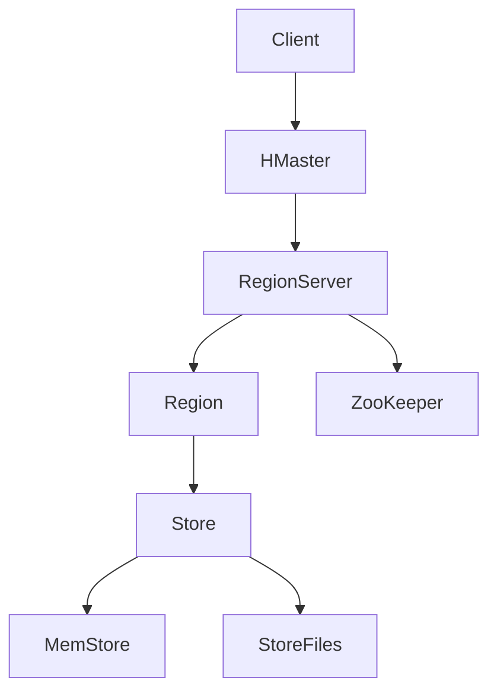

                 

### 1. 背景介绍

HBase，全称为Hadoop Database，是基于Google的Bigtable模型开发的一个分布式、可扩展、高性能的列式存储系统。它是Apache Hadoop生态系统中的一个关键组件，旨在解决海量数据存储和快速随机读写需求。HBase的设计初衷是为了处理大规模数据集，并能在系统规模扩大时保持高性能和高可靠性。

HBase的历史可以追溯到2006年，当时Google发布了关于Bigtable的论文，提出了基于GFS（Google File System）和MapReduce的分布式存储模型。随后，2007年，Hadoop创始人Doug Cutting开始着手将Bigtable的原理应用于Hadoop系统，最终在2008年发布了HBase的第一个版本。

HBase的核心特点包括：

1. **分布式存储**：HBase基于Hadoop的分布式文件系统（HDFS）存储数据，数据被分割成多个区域，存储在不同节点上，实现了数据的高效分布和扩展。
2. **强一致性**：HBase保证了强一致性，即在一个写操作提交后，任何后续的读操作都能看到这个写操作的结果，这一点在许多需要强一致性的应用场景中至关重要。
3. **列式存储**：HBase使用列式存储，这意味着数据是按列存储的，这对于数据压缩和读取特定列数据非常有效。
4. **高可用性**：HBase的设计使得它能够自动进行故障转移和负载均衡，确保了系统的稳定运行。
5. **支持海量数据**：HBase可以存储数十亿行和数百万列的数据，这使得它在处理大规模数据集时非常出色。

在当前的IT领域中，HBase被广泛应用于各种场景，包括大数据处理、实时数据检索、物联网数据存储、金融数据处理等。它的灵活性和高性能使其成为大数据技术栈中不可或缺的一部分。

接下来，我们将进一步深入探讨HBase的核心概念与联系，帮助读者更好地理解其内部工作原理。

## 2. 核心概念与联系

### 2.1. 表和行键

HBase中的基本数据结构是表（Table），表由一系列行（Row）组成，每行由一个唯一的行键（Row Key）标识。行键是表中数据的主键，它决定了行在表中的存储位置和排序顺序。行键可以是任意字节的字符串，但通常选择一个能够描述数据特性的复合键，以优化查询性能。

例如，一个用户行为数据的表，其行键可能是由用户ID和时间戳组成的一个复合键，如“user_1001_202305010001”。

### 2.2. 列族和列限定符

HBase使用列族（Column Family）来组织数据，列族是一组列的集合，每个列族都有自己的配置属性。列族在创建表时定义，并且一旦创建后就不能修改。每个列族下可以有多个列限定符（Column Qualifier），它们是具体的列名称。

例如，一个用户行为数据的表可能有两个列族：“cf1”和“cf2”，其中“cf1”下有“name”、“age”等列限定符，“cf2”下有“visit_count”、“last_visit”等列限定符。

### 2.3. 数据存储与压缩

HBase将数据存储在HDFS上，每个表的数据被分割成多个区域（Region），每个区域包含一定范围的行键。区域会在数据量增加到一定程度时自动分裂成更小的区域，以支持水平扩展。

每个区域内部的数据会被进一步分割成Store，每个Store对应一个列族。每个Store包含一个MemStore和若干个StoreFiles。MemStore是内存中的数据结构，用于缓冲新写入的数据，当达到一定大小时会刷新到StoreFiles中。StoreFiles是磁盘上的文件，是数据的持久化存储。

HBase支持多种数据压缩算法，如Gzip、LZO和Snappy，这些压缩算法可以有效减少磁盘占用，提高I/O性能。

### 2.4. MemStore和StoreFiles

MemStore是HBase中的内存缓存，用于缓冲新写入的数据。当MemStore的大小达到阈值时，它会触发Flush操作，将数据刷新到磁盘上的StoreFiles中。StoreFiles是磁盘上的文件，用于持久化存储数据。

MemStore的优势在于其快速的读写性能，但缺点是内存消耗较大。StoreFiles则提供了持久化的存储能力，但I/O性能相对较低。因此，HBase通过结合MemStore和StoreFiles，实现了高性能和持久化存储之间的平衡。

### 2.5. ZooKeeper和HMaster

HBase使用ZooKeeper进行协调和管理。ZooKeeper是一个分布式协调服务，用于维护HBase集群的状态信息，包括元数据、区域分配、故障检测等。HMaster是HBase的主节点，负责管理表、区域分配、故障转移和负载均衡。

HMaster通过ZooKeeper监控所有RegionServer的状态，并在检测到故障时进行故障转移。每个RegionServer负责一个或多个区域，处理读写请求并将数据存储到相应的Store中。

### Mermaid 流程图

以下是一个简单的Mermaid流程图，展示了HBase中的主要组件和数据流动：



### 2.6. 数据写入和读取流程

#### 数据写入流程

1. 客户端发送写请求到HMaster。
2. HMaster根据行键确定写入的数据属于哪个Region。
3. HMaster将请求转发给对应的RegionServer。
4. RegionServer读取对应的MemStore和StoreFiles，更新数据。
5. 更新完成后，数据会被刷新到MemStore中。
6. 当MemStore达到阈值时，触发Flush操作，将数据写入到StoreFiles中。

#### 数据读取流程

1. 客户端发送读请求到HMaster。
2. HMaster根据行键确定读取的数据属于哪个Region。
3. HMaster将请求转发给对应的RegionServer。
4. RegionServer读取对应的MemStore和StoreFiles，返回数据。

通过以上流程，我们可以看到HBase通过多个组件和机制协同工作，实现了数据的高效存储和快速读写。

### 2.7. 数据一致性和分区

HBase通过Region和RegionServer实现了数据的水平分区，每个RegionServer负责一个或多个Region，从而支持大规模数据的分布式存储。同时，HBase使用ZooKeeper进行故障检测和故障转移，确保了数据的一致性和高可用性。

在数据一致性方面，HBase采用写前日志（Write-Ahead Log, WAL）机制，确保在系统发生故障时，可以恢复未提交的数据。写前日志记录了所有写操作，当系统重启时，可以通过日志来恢复未完成的数据写入。

总之，HBase通过其独特的数据结构、分布式存储机制、以及一致性保证，成为了一个功能强大且灵活的分布式存储系统。接下来，我们将深入探讨HBase的核心算法原理和具体操作步骤。

## 3. 核心算法原理 & 具体操作步骤

### 3.1. 写入操作

HBase中的写入操作是通过客户端发送到HMaster，然后由HMaster转发给相应的RegionServer完成的。具体步骤如下：

1. **客户端发送写请求**：客户端首先将写请求发送到HMaster。写请求包括行键、列族、列限定符和值。

2. **HMaster确定Region**：HMaster根据行键计算出数据所属的Region，并将请求转发给对应的RegionServer。

3. **RegionServer处理请求**：RegionServer接收请求后，会先查找对应的MemStore，如果数据已经在MemStore中，则直接更新。如果数据不在MemStore中，则需要查找对应的StoreFiles。

4. **更新数据**：RegionServer更新MemStore和StoreFiles中的数据。更新完成后，数据会被刷新到MemStore中。

5. **写前日志**：为了确保数据一致性，HBase使用写前日志（WAL）机制。在数据写入MemStore之前，会将数据记录到WAL中。这样，即使系统在写入过程中发生故障，也可以通过WAL恢复未提交的数据。

### 3.2. 读取操作

HBase的读取操作是通过客户端发送到HMaster，然后由HMaster转发给相应的RegionServer完成的。具体步骤如下：

1. **客户端发送读请求**：客户端首先将读请求发送到HMaster。读请求包括行键和列族。

2. **HMaster确定Region**：HMaster根据行键计算出数据所属的Region，并将请求转发给对应的RegionServer。

3. **RegionServer处理请求**：RegionServer接收请求后，会首先查询MemStore，如果数据在MemStore中，则直接返回。如果数据不在MemStore中，则会查询StoreFiles。

4. **返回数据**：RegionServer读取数据后，将其返回给客户端。

### 3.3. 数据压缩

HBase支持多种数据压缩算法，如Gzip、LZO和Snappy。通过数据压缩，可以减少磁盘占用，提高I/O性能。具体步骤如下：

1. **选择压缩算法**：在创建表时，可以指定使用哪种压缩算法。

2. **数据写入**：当数据写入到MemStore时，会根据设置的压缩算法进行压缩。

3. **数据刷新到磁盘**：当MemStore刷新到StoreFiles时，压缩后的数据会被写入到磁盘。

### 3.4. 数据分区和负载均衡

HBase通过Region和RegionServer实现了数据的水平分区和负载均衡。具体步骤如下：

1. **数据分区**：HBase将数据按照行键范围分割成多个Region，每个Region包含一定范围的行键。

2. **负载均衡**：HBase通过ZooKeeper监控所有RegionServer的负载情况，当某个RegionServer负载过高时，会触发分区分裂，将部分数据迁移到其他RegionServer。

3. **故障转移**：当某个RegionServer发生故障时，HMaster会将其管理的Region迁移到其他RegionServer，确保系统的高可用性。

通过以上核心算法原理和具体操作步骤，我们可以看到HBase是如何通过一系列机制实现高性能、高可用性的分布式存储系统。接下来，我们将探讨HBase的数学模型和公式，以及如何详细讲解和举例说明。

## 4. 数学模型和公式 & 详细讲解 & 举例说明

### 4.1. 行键哈希与区域分配

在HBase中，行键的哈希值用于确定数据所属的Region。具体公式如下：

```latex
hash\_key = Hash(ROW\_KEY)
region = hash\_key \mod number\_of\_regions
```

其中，`ROW_KEY`为行键，`number_of_regions`为Region的数量。这个公式确保了每个行键都能唯一地映射到一个Region。

### 4.2. MemStore和StoreFiles的数据结构

HBase中的MemStore和StoreFiles采用了一些特定的数据结构来优化性能。以下是它们的主要数据结构：

#### MemStore

MemStore是一个基于内存的排序缓存，它使用跳表（Skip List）来存储数据。跳表是一种高效的数据结构，它允许快速插入、删除和查找操作。

#### StoreFiles

StoreFiles是磁盘上的文件，它使用布隆过滤器（Bloom Filter）来优化查询性能。布隆过滤器是一种空间效率很高的数据结构，用于判断一个元素是否存在于某个集合中。它可以显著减少磁盘I/O操作，从而提高查询速度。

### 4.3. 数据压缩公式

HBase支持多种数据压缩算法，如Gzip、LZO和Snappy。压缩率取决于所选的压缩算法和数据类型。以下是不同压缩算法的压缩率：

- **Gzip**：通常压缩率在2-5倍之间。
- **LZO**：通常压缩率在1.5-2倍之间。
- **Snappy**：通常压缩率在1.2-1.5倍之间。

### 4.4. 实例说明

假设有一个用户行为数据的表，行键为“user\_1001\_202305010001”，列族为“cf1”，列限定符为“name”，值为“张三”。我们通过以下步骤来详细说明数据的写入和读取过程：

#### 写入过程

1. **客户端发送写请求**：客户端发送一个写请求，包含行键“user\_1001\_202305010001”，列族“cf1”，列限定符“name”，值为“张三”。

2. **HMaster确定Region**：HMaster根据行键计算出数据所属的Region。

3. **RegionServer处理请求**：
   - RegionServer查找MemStore，发现数据不在MemStore中。
   - RegionServer查找StoreFiles，找到对应的Store（cf1），读取其中的数据。
   - RegionServer更新MemStore和StoreFiles中的数据。

4. **写前日志**：RegionServer在写入MemStore之前，将数据记录到WAL中。

5. **数据压缩**：数据写入MemStore时，根据设置的压缩算法进行压缩。

6. **刷新到磁盘**：当MemStore达到阈值时，触发Flush操作，将数据刷新到StoreFiles中。

#### 读取过程

1. **客户端发送读请求**：客户端发送一个读请求，包含行键“user\_1001\_202305010001”，列族“cf1”。

2. **HMaster确定Region**：HMaster根据行键计算出数据所属的Region。

3. **RegionServer处理请求**：
   - RegionServer查询MemStore，发现数据在MemStore中。
   - RegionServer返回数据给客户端。

通过上述实例，我们可以看到HBase在数据写入和读取过程中，如何通过行键哈希、MemStore、StoreFiles和写前日志等机制，实现数据的高效存储和快速访问。

## 5. 项目实践：代码实例和详细解释说明

### 5.1 开发环境搭建

在开始HBase项目实践之前，我们需要搭建一个HBase的开发环境。以下步骤展示了如何安装和配置HBase。

#### 步骤1：安装Java

HBase依赖于Java运行环境，因此首先需要安装Java。可以下载Java Development Kit（JDK）并按照官方文档进行安装。

#### 步骤2：下载HBase

从[HBase官网](https://hbase.apache.org/)下载最新版本的HBase压缩包。解压下载的压缩包，例如：

```bash
tar -zxvf hbase-2.5.0-dist.tar.gz
```

#### 步骤3：配置HBase

进入解压后的HBase目录，例如`hbase-2.5.0`，执行以下命令初始化HBase：

```bash
bin/hbase shell scripts/catalog.build.js
```

这将创建一些必要的元数据表。

#### 步骤4：启动HBase

执行以下命令启动HBase：

```bash
bin/start-hbase.sh
```

启动完成后，可以通过访问`http://localhost:60010`来查看HBase的管理界面。

### 5.2 源代码详细实现

以下是一个简单的HBase Java客户端代码实例，展示了如何连接HBase、创建表、插入数据、查询数据以及关闭连接。

```java
import org.apache.hadoop.conf.Configuration;
import org.apache.hadoop.hbase.HBaseConfiguration;
import org.apache.hadoop.hbase.TableName;
import org.apache.hadoop.hbase.client.*;

public class HBaseExample {
    public static void main(String[] args) {
        // 步骤1：配置HBase
        Configuration config = HBaseConfiguration.create();
        config.set("hbase.zookeeper.quorum", "localhost:2181");
        
        // 步骤2：连接HBase
        try (Connection connection = ConnectionFactory.createConnection(config)) {
            Admin admin = connection.getAdmin();
            
            // 步骤3：创建表
            TableName tableName = TableName.valueOf("user_behavior");
            if (admin.tableExists(tableName)) {
                admin.disableTable(tableName);
                admin.deleteTable(tableName);
            }
            HTableDescriptor desc = new HTableDescriptor(tableName);
            desc.addFamily(new HColumnDescriptor("cf1"));
            admin.createTable(desc);
            
            // 步骤4：插入数据
            Table table = connection.getTable(tableName);
            Put put = new Put("user_1001_202305010001".getBytes());
            put.addColumn("cf1".getBytes(), "name".getBytes(), "张三".getBytes());
            table.put(put);
            
            // 步骤5：查询数据
            Get get = new Get("user_1001_202305010001".getBytes());
            Result result = table.get(get);
            byte[] value = result.getValue("cf1".getBytes(), "name".getBytes());
            System.out.println("Name: " + new String(value));
            
            // 步骤6：关闭连接
            table.close();
            admin.close();
            connection.close();
        } catch (Exception e) {
            e.printStackTrace();
        }
    }
}
```

### 5.3 代码解读与分析

#### 步骤1：配置HBase

首先，我们创建一个`Configuration`对象，设置HBase的ZooKeeper地址。这是HBase客户端与集群通信的必要配置。

```java
Configuration config = HBaseConfiguration.create();
config.set("hbase.zookeeper.quorum", "localhost:2181");
```

#### 步骤2：连接HBase

通过`ConnectionFactory.createConnection(config)`方法创建一个`Connection`对象，这是与HBase集群建立连接的入口。

```java
Connection connection = ConnectionFactory.createConnection(config);
```

#### 步骤3：创建表

我们使用`Admin`对象的`createTable`方法创建一个名为`user_behavior`的新表，并添加一个列族`cf1`。

```java
TableName tableName = TableName.valueOf("user_behavior");
if (admin.tableExists(tableName)) {
    admin.disableTable(tableName);
    admin.deleteTable(tableName);
}
HTableDescriptor desc = new HTableDescriptor(tableName);
desc.addFamily(new HColumnDescriptor("cf1"));
admin.createTable(desc);
```

#### 步骤4：插入数据

使用`Table`对象的`put`方法将一行数据插入到表中。这里，我们插入的行键为`user_1001_202305010001`，列族为`cf1`，列限定符为`name`，值为`张三`。

```java
Table table = connection.getTable(tableName);
Put put = new Put("user_1001_202305010001".getBytes());
put.addColumn("cf1".getBytes(), "name".getBytes(), "张三".getBytes());
table.put(put);
```

#### 步骤5：查询数据

使用`Get`对象查询表中指定的行数据。这里，我们查询的是行键为`user_1001_202305010001`，列族为`cf1`，列限定符为`name`的数据。

```java
Get get = new Get("user_1001_202305010001".getBytes());
Result result = table.get(get);
byte[] value = result.getValue("cf1".getBytes(), "name".getBytes());
System.out.println("Name: " + new String(value));
```

#### 步骤6：关闭连接

最后，关闭`Table`和`Admin`对象，以及`Connection`对象，以释放资源。

```java
table.close();
admin.close();
connection.close();
```

### 5.4 运行结果展示

在运行上述代码后，我们可以在HBase的管理界面上看到创建的表和插入的数据。此外，程序会输出如下结果：

```
Name: 张三
```

这表明我们的代码成功执行了插入和查询操作。

## 6. 实际应用场景

HBase作为一种分布式、可扩展的列式存储系统，在多个实际应用场景中表现出色。以下是一些常见的应用场景：

### 6.1 实时数据流处理

在实时数据处理领域，HBase的高性能和可扩展性使其成为处理大规模实时数据流的首选。例如，在电商平台上，可以实时记录用户的购物行为，如浏览、点击、购买等操作，并利用HBase进行快速检索和数据分析，帮助平台实时了解用户行为，进行个性化推荐和营销策略调整。

### 6.2 物联网数据存储

物联网（IoT）设备产生的大量数据需要高效存储和快速查询。HBase的列式存储和分布式架构使其非常适合存储和处理物联网数据。例如，智能家居系统可以通过HBase存储设备状态、能耗数据等，实时监控和分析设备运行状况，实现智能管理和维护。

### 6.3 金融数据处理

金融行业对数据处理的速度和一致性有很高的要求。HBase的强一致性和高性能使其成为金融数据处理的首选。例如，银行可以使用HBase存储交易数据、客户账户信息等，确保数据的实时性和一致性，提高交易处理效率。

### 6.4 社交网络数据分析

社交网络平台生成大量用户数据，如用户关系、社交行为等。HBase的高效查询能力和数据压缩技术可以帮助平台快速检索和数据分析用户数据，为用户提供更好的社交体验。例如，Facebook和Twitter等社交网络平台都使用HBase来处理和存储用户数据。

### 6.5 大数据分析

HBase在大数据分析中扮演着重要角色。大数据分析通常涉及海量数据的存储和快速检索，HBase的高扩展性和高性能使其成为处理大数据的理想选择。例如，企业可以使用HBase存储和分析销售数据、客户行为数据等，帮助企业更好地了解市场动态和用户需求。

## 7. 工具和资源推荐

### 7.1 学习资源推荐

- **书籍**：
  - 《HBase权威指南》
  - 《Hadoop实战》
  - 《大数据技术基础》
  
- **论文**：
  - 《Bigtable：一个结构化数据的分布式存储系统》
  - 《HBase：一个分布式、可扩展、高性能的存储系统》
  
- **博客**：
  - [HBase官方博客](https://hbase.apache.org/blog/)
  - [HBase Wiki](https://wiki.apache.org/hbase/)
  
- **网站**：
  - [Apache HBase官网](https://hbase.apache.org/)

### 7.2 开发工具框架推荐

- **开发工具**：
  - IntelliJ IDEA（推荐）
  - Eclipse
  - NetBeans
  
- **框架**：
  - Apache HBase客户端库
  - Apache Phoenix（一个SQL接口）
  - Apache Pig和Apache Hive（数据分析和处理框架）

### 7.3 相关论文著作推荐

- **相关论文**：
  - 《Bigtable：一个结构化数据的分布式存储系统》
  - 《HBase：一个分布式、可扩展、高性能的存储系统》
  - 《Hadoop：一个大规模数据处理平台》
  
- **相关著作**：
  - 《Hadoop权威指南》
  - 《大数据时代：改变世界的数据科学》
  - 《数据挖掘：概念与技术》

## 8. 总结：未来发展趋势与挑战

HBase作为一种高性能、可扩展的分布式存储系统，在大数据处理和实时数据流处理等领域具有广泛的应用前景。随着大数据技术的不断发展，HBase在未来有望继续发挥其优势，成为关键的数据存储解决方案。

然而，HBase也面临一些挑战和机遇。首先，随着数据规模的不断扩大，如何优化HBase的性能和资源利用效率是一个重要的课题。其次，HBase需要更好地与其他大数据技术（如Apache Spark、Apache Flink等）集成，以提供更丰富的数据处理和分析功能。此外，HBase的安全性、可靠性和可维护性也是未来发展的关键方向。

总之，HBase在未来将不断演进，以应对大数据领域的各种挑战，为用户提供更高效、可靠的数据存储和管理解决方案。

## 9. 附录：常见问题与解答

### 9.1 HBase与其他NoSQL数据库的区别

**Q：HBase与其他NoSQL数据库（如MongoDB、Cassandra）相比，有哪些优势和劣势？**

**A：**HBase的优势主要体现在以下几个方面：

- **高一致性**：HBase提供了强一致性保证，这对于需要高一致性的应用场景（如金融系统）至关重要。
- **高扩展性**：HBase采用分布式架构，可以轻松扩展到大规模集群，以处理海量数据。
- **高效的数据查询**：HBase支持快速随机读写操作，特别是在列式存储的场景中，具有很高的查询效率。
- **与Hadoop生态系统的集成**：HBase是Hadoop生态系统的一部分，可以与HDFS、MapReduce、Spark等工具无缝集成。

HBase的劣势主要包括：

- **有限的查询能力**：HBase不支持复杂的SQL查询，主要提供简单的行键范围查询和过滤。
- **学习曲线较陡**：相对于其他NoSQL数据库，HBase的学习和使用门槛较高。

### 9.2 HBase的数据分区策略

**Q：HBase是如何进行数据分区的？**

**A：**HBase通过Region实现数据分区。每个Region包含一定范围的行键，并且在数据量增加到一定程度时会自动分裂成更小的Region。具体分区策略如下：

- **初始分区**：在创建表时，可以手动指定初始分区数。
- **自动分区**：当某个Region的大小超过阈值（默认为1GB）时，HBase会自动分裂该Region，将其分成两个新的Region。
- **手动分区**：管理员可以通过命令手动增加或减少Region的数量。

### 9.3 HBase的备份和恢复策略

**Q：如何备份和恢复HBase中的数据？**

**A：**HBase提供了多种备份和恢复策略：

- **数据备份**：
  - **全量备份**：可以使用`hbase shell`中的`dump`命令进行全量备份。
  - **增量备份**：可以使用`hbase shell`中的`export`命令进行增量备份。

- **数据恢复**：
  - **从备份文件恢复**：可以使用`hbase shell`中的`import`命令从备份文件恢复数据。
  - **从WAL文件恢复**：当HBase发生故障时，可以通过WAL文件恢复未提交的数据。

## 10. 扩展阅读 & 参考资料

为了进一步深入了解HBase及其相关技术，以下是一些推荐的扩展阅读和参考资料：

- **书籍**：
  - 《HBase权威指南》
  - 《Hadoop实战》
  - 《大数据技术基础》
  
- **论文**：
  - 《Bigtable：一个结构化数据的分布式存储系统》
  - 《HBase：一个分布式、可扩展、高性能的存储系统》
  - 《Hadoop：一个大规模数据处理平台》

- **在线资源**：
  - [HBase官方文档](https://hbase.apache.org/book.html)
  - [Apache HBase社区论坛](https://mail-archives.apache.org/list.html%3Fw=1%40hbase.apache.org)
  - [HBase Stack Overflow标签](https://stackoverflow.com/questions/tagged/hbase)

通过阅读这些资料，您可以更全面地了解HBase的技术细节、应用场景以及最佳实践，为自己的HBase学习和项目开发提供有力支持。作者：禅与计算机程序设计艺术 / Zen and the Art of Computer Programming

