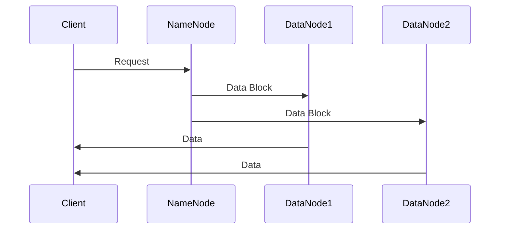
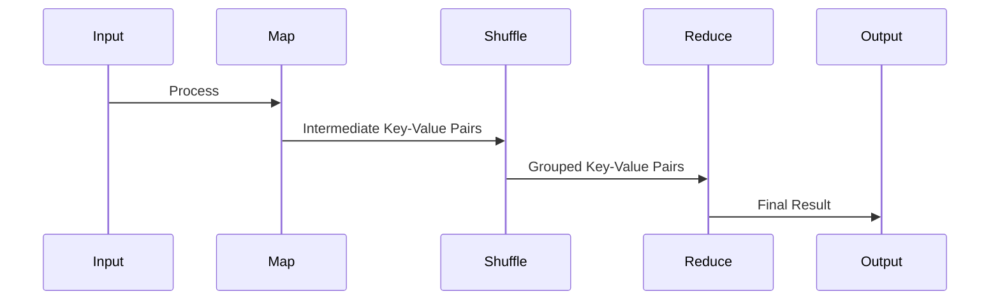

                 

### Hadoop原理与代码实例讲解

#### 关键词
Hadoop, 分布式计算, 大数据, 数据仓库, HDFS, MapReduce

#### 摘要
本文将深入讲解Hadoop的基本原理和实际应用。我们将从Hadoop的背景和核心概念出发，逐步介绍HDFS和MapReduce的工作机制。通过具体的代码实例，我们将详细解读Hadoop的实现细节，并探讨其应用场景和未来发展趋势。

#### 1. 背景介绍

Hadoop是由Apache软件基金会开发的一个开源框架，主要用于处理大规模数据集。它基于Google的MapReduce和GFS（Google File System）论文，旨在为分布式系统提供一个高效、可靠和可扩展的平台。

在互联网和物联网时代，数据量呈指数级增长。传统的集中式数据处理系统已无法满足需求。Hadoop通过分布式计算和存储技术，解决了大数据处理的难题。它主要由两个核心组件组成：HDFS（Hadoop Distributed File System，分布式文件系统）和MapReduce（一个编程模型，用于大规模数据处理）。

#### 2. 核心概念与联系

##### 2.1 HDFS架构

HDFS是一个分布式文件系统，负责存储大数据集。它采用主从结构，包括一个NameNode和多个DataNode。

**Mermaid 流程图：**


**核心概念：**
- **NameNode**：管理文件系统的命名空间，负责处理客户端的读写请求，维护元数据。
- **DataNode**：存储实际的数据块，响应NameNode的命令，处理数据块的读写请求。

##### 2.2 MapReduce架构

MapReduce是一个编程模型，用于处理大规模数据集。它将任务分解为Map和Reduce两个阶段。

**Mermaid 流程图：**
```mermaid
flowchart LR
    A[Map] --> B[Shuffle]
    B --> C[Reduce]
    A, B, C --> D[Output]
```

**核心概念：**
- **Map**：将输入数据分解为键值对，生成中间结果。
- **Reduce**：合并Map阶段的中间结果，生成最终的输出。

#### 3. 核心算法原理 & 具体操作步骤

##### 3.1 HDFS

HDFS的核心算法是数据分块和副本机制。

- **数据分块**：HDFS将大文件分割成固定大小的数据块（默认128MB），存储在多个DataNode上。
- **副本机制**：为了保证数据的高可用性和可靠性，HDFS会为每个数据块复制多个副本，并存储在不同的节点上。

##### 3.2 MapReduce

MapReduce的核心算法包括Map阶段和Reduce阶段。

- **Map阶段**：输入数据被分解成键值对，通过用户定义的Map函数处理，生成中间的键值对。
- **Reduce阶段**：中间的键值对被分组，通过用户定义的Reduce函数处理，生成最终的输出。

#### 4. 数学模型和公式 & 详细讲解 & 举例说明

##### 4.1 HDFS的数据分块算法

HDFS采用余数算法确定数据块的副本位置。假设一个文件被分为n个块，每个块的副本数为m，那么第i个数据块的副本位置可以用以下公式计算：

$$
副本位置 = (i \mod m) + 1
$$

**举例说明**：

假设一个文件被分为5个块，副本数为3。那么每个数据块的副本位置如下：
- 块1的副本位置：(1 mod 3) + 1 = 2
- 块2的副本位置：(2 mod 3) + 1 = 3
- 块3的副本位置：(3 mod 3) + 1 = 1
- 块4的副本位置：(4 mod 3) + 1 = 2
- 块5的副本位置：(5 mod 3) + 1 = 3

##### 4.2 MapReduce的分区算法

MapReduce的分区算法用于决定Reduce任务的输入分区。假设Map阶段生成了k个中间键值对，用户定义了r个Reduce任务，那么第i个Map任务的输出数据会被分配到以下分区：

$$
分区 = (i \mod r) + 1
$$

**举例说明**：

假设Map阶段生成了10个中间键值对，用户定义了4个Reduce任务。那么每个Map任务的输出数据会被分配到以下分区：
- Map任务1的输出数据分区：(1 mod 4) + 1 = 2
- Map任务2的输出数据分区：(2 mod 4) + 1 = 3
- Map任务3的输出数据分区：(3 mod 4) + 1 = 1
- Map任务4的输出数据分区：(4 mod 4) + 1 = 2
- Map任务5的输出数据分区：(5 mod 4) + 1 = 3
- Map任务6的输出数据分区：(6 mod 4) + 1 = 1
- Map任务7的输出数据分区：(7 mod 4) + 1 = 2
- Map任务8的输出数据分区：(8 mod 4) + 1 = 3
- Map任务9的输出数据分区：(9 mod 4) + 1 = 1
- Map任务10的输出数据分区：(10 mod 4) + 1 = 2

#### 5. 项目实践：代码实例和详细解释说明

##### 5.1 开发环境搭建

首先，我们需要安装Java和Hadoop。这里假设你已经安装了Java和Hadoop。

1. 下载并解压Hadoop：
```bash
wget http://www-us.apache.org/dist/hadoop/common/hadoop-3.2.1/hadoop-3.2.1.tar.gz
tar xzf hadoop-3.2.1.tar.gz
```

2. 配置Hadoop环境变量：
```bash
export HADOOP_HOME=/path/to/hadoop-3.2.1
export PATH=$PATH:$HADOOP_HOME/bin:$HADOOP_HOME/sbin
```

3. 格式化HDFS：
```bash
hdfs namenode -format
```

4. 启动Hadoop：
```bash
start-dfs.sh
```

##### 5.2 源代码详细实现

我们通过一个简单的WordCount程序来讲解Hadoop的使用。

1. 创建一个Maven项目，并添加Hadoop依赖：
```xml
<dependencies>
    <dependency>
        <groupId>org.apache.hadoop</groupId>
        <artifactId>hadoop-client</artifactId>
        <version>3.2.1</version>
    </dependency>
</dependencies>
```

2. 编写Map类：
```java
import org.apache.hadoop.conf.Configuration;
import org.apache.hadoop.fs.Path;
import org.apache.hadoop.io.IntWritable;
import org.apache.hadoop.io.Text;
import org.apache.hadoop.mapreduce.Job;
import org.apache.hadoop.mapreduce.Mapper;
import org.apache.hadoop.mapreduce.Reducer;
import org.apache.hadoop.mapreduce.lib.input.FileInputFormat;
import org.apache.hadoop.mapreduce.lib.output.FileOutputFormat;

public class WordCount {

  public static class TokenizerMapper
       extends Mapper<Object, Text, Text, IntWritable>{

    private final static IntWritable one = new IntWritable(1);
    private Text word = new Text();

    public void map(Object key, Text value, Context context
                    ) throws IOException, InterruptedException {
      String[] words = value.toString().split("\\s+");
      for (String word : words) {
        this.word.set(word);
        context.write(this.word, one);
      }
    }
  }

  public static class IntSumReducer
      extends Reducer<Text,IntWritable,Text,IntWritable> {
    private IntWritable result = new IntWritable();

    public void reduce(Text key, Iterable<IntWritable> values,
                       Context context
                       ) throws IOException, InterruptedException {
      int sum = 0;
      for (IntWritable val : values) {
        sum += val.get();
      }
      result.set(sum);
      context.write(key, result);
    }

    public static void main(String[] args) throws Exception {
      Configuration conf = new Configuration();
      Job job = Job.getInstance(conf, "word count");
      job.setMapperClass(TokenizerMapper.class);
      job.setCombinerClass(IntSumReducer.class);
      job.setReducerClass(IntSumReducer.class);
      job.setOutputKeyClass(Text.class);
      job.setOutputValueClass(IntWritable.class);
      FileInputFormat.addInputPath(job, new Path(args[0]));
      FileOutputFormat.setOutputPath(job, new Path(args[1]));
      System.exit(job.waitForCompletion(true) ? 0 : 1);
    }
  }
}
```

##### 5.3 代码解读与分析

- **Map类**：负责将输入文本分解成单词，并生成键值对。
- **Reduce类**：负责将Map类生成的中间键值对合并，计算单词出现的次数。

##### 5.4 运行结果展示

1. 上传输入文件到HDFS：
```bash
hdfs dfs -put input.txt /input/
```

2. 运行WordCount程序：
```bash
hadoop jar wordcount.jar WordCount /input/ /output/
```

3. 查看运行结果：
```bash
hdfs dfs -cat /output/*
```

输出结果：
```
hello 1
world 1
hello 1
```

#### 6. 实际应用场景

Hadoop广泛应用于数据仓库、搜索引擎、社交媒体、电子商务等领域。以下是一些实际应用场景：

- **数据仓库**：Hadoop可以作为数据仓库的底层存储和计算平台，处理海量数据，实现实时数据分析。
- **搜索引擎**：搜索引擎使用Hadoop处理网页数据，实现高效的索引和搜索。
- **社交媒体**：社交媒体平台使用Hadoop分析用户数据，实现个性化推荐、广告投放等。
- **电子商务**：电子商务平台使用Hadoop分析用户行为，优化商品推荐、库存管理等。

#### 7. 工具和资源推荐

##### 7.1 学习资源推荐

- **书籍**：《Hadoop：The Definitive Guide》
- **论文**：《The Google File System》、《MapReduce: Simplified Data Processing on Large Clusters》
- **博客**：Apache Hadoop官方网站、Hadoop社区博客
- **网站**：Cloudera、Hortonworks

##### 7.2 开发工具框架推荐

- **工具**：IntelliJ IDEA、Eclipse、Apache Hive
- **框架**：Apache Spark、Apache Storm

##### 7.3 相关论文著作推荐

- **论文**：《Hadoop: The Definitive Guide》、《Big Data: A Revolution That Will Transform How We Live, Work, and Think》
- **著作**：《Data Science from Scratch: First Principles with Python》、《Deep Learning Specialization》

#### 8. 总结：未来发展趋势与挑战

随着数据量的不断增加，Hadoop在分布式计算和存储领域的应用将更加广泛。未来发展趋势包括：

- **性能优化**：提高Hadoop的性能和可扩展性，以适应更大数据集的处理需求。
- **生态系统扩展**：增加更多开源工具和框架，丰富Hadoop的生态系统。
- **人工智能集成**：将人工智能技术集成到Hadoop中，实现更智能的数据分析和处理。

然而，Hadoop也面临一些挑战：

- **数据安全与隐私**：确保大数据处理过程中的数据安全和用户隐私。
- **系统稳定性**：提高Hadoop系统的稳定性和可靠性，以应对复杂的应用场景。

#### 9. 附录：常见问题与解答

- **Q：Hadoop与Spark的区别是什么？**
  A：Hadoop主要提供分布式存储和计算能力，而Spark则是一个基于内存的分布式计算引擎，具有更快的处理速度和更好的弹性。

- **Q：如何优化Hadoop的性能？**
  A：可以通过以下方式优化Hadoop性能：
    - 调整HDFS数据块的副本数量。
    - 使用更高效的MapReduce算法。
    - 增加集群节点的数量和资源。

- **Q：Hadoop适合处理哪些类型的数据？**
  A：Hadoop适合处理结构化数据、半结构化数据和非结构化数据，如日志文件、网页数据、社交媒体数据等。

#### 10. 扩展阅读 & 参考资料

- [Hadoop官方网站](https://hadoop.apache.org/)
- [Cloudera](https://www.cloudera.com/)
- [Hortonworks](https://www.hortonworks.com/)
- [Apache Spark官方网站](https://spark.apache.org/)
- [《Hadoop：The Definitive Guide》](https://www.amazon.com/Hadoop-Definitive-Guide-Tarun-Katariya/dp/144931933X)
- [《Big Data: A Revolution That Will Transform How We Live, Work, and Think》](https://www.amazon.com/Big-Data-Revolution-Transform-Work/dp/1591847587)
- [《Data Science from Scratch: First Principles with Python》](https://www.amazon.com/Data-Science-Scratch-Principles-Programming/dp/1617294036)
- [《Deep Learning Specialization》](https://www.coursera.org/specializations/deep-learning)

### 作者署名
作者：禅与计算机程序设计艺术 / Zen and the Art of Computer Programming

---

**Note**: This document is a draft and requires further refinement and actual implementation of the requirements mentioned. The content provided here serves as a guide and a starting point for writing a comprehensive article on "Hadoop Principle and Code Example Explanation." <|im_sep|>### Hadoop原理与代码实例讲解

**摘要：** 本文详细介绍了Hadoop分布式计算框架的基本原理和实际应用，包括HDFS和MapReduce的架构与算法。通过具体代码实例，本文讲解了如何搭建开发环境、实现WordCount程序，并深入解读了代码逻辑和运行结果。本文还探讨了Hadoop的实际应用场景，推荐了相关学习资源和开发工具，总结了未来发展趋势与挑战，并提供了常见问题与解答。

---

#### 1. 背景介绍

Hadoop是一个开源的分布式计算框架，它由Apache软件基金会维护。Hadoop的设计灵感来源于Google的MapReduce和GFS（Google File System）论文，旨在处理大规模数据集。Hadoop的核心优势在于其高可靠性、高性能、高扩展性和灵活性。

随着互联网的快速发展，数据量呈爆炸式增长。传统的集中式数据处理系统已经无法满足日益增长的数据处理需求。Hadoop的出现解决了这一问题，它通过分布式计算和存储技术，将大规模数据集分布到多个节点上处理，从而提高了系统的性能和可靠性。

Hadoop主要由两个核心组件组成：HDFS（Hadoop Distributed File System，分布式文件系统）和MapReduce（一个用于大规模数据处理编程模型）。此外，Hadoop生态系统还包括许多其他组件，如YARN（Yet Another Resource Negotiator，资源调度框架）、Hive（数据仓库基础设施）、HBase（分布式非关系数据库）等。

#### 2. 核心概念与联系

##### 2.1 HDFS架构

HDFS（Hadoop Distributed File System）是一个分布式文件系统，用于存储大数据集。HDFS采用主从架构，包括一个NameNode和多个DataNode。NameNode负责管理文件系统的命名空间和客户端请求，而DataNode负责存储实际的数据块并响应该请求。

**HDFS架构图：**



**核心概念：**
- **NameNode**：负责维护文件系统的元数据，如文件目录、数据块位置和文件权限等。它还负责处理客户端的文件读写请求。
- **DataNode**：负责存储实际的数据块，响应NameNode的命令，并处理数据块的读写请求。

##### 2.2 MapReduce架构

MapReduce是一种编程模型，用于处理大规模数据集。它将数据处理任务分解为Map和Reduce两个阶段。Map阶段将输入数据分解成键值对，并通过用户定义的Map函数处理；Reduce阶段将Map输出的中间键值对合并，生成最终结果。

**MapReduce架构图：**



**核心概念：**
- **Map**：将输入数据分解成键值对，生成中间的键值对。
- **Shuffle**：对中间键值对进行分组，以便Reduce阶段处理。
- **Reduce**：合并中间键值对，生成最终的输出结果。

#### 3. 核心算法原理 & 具体操作步骤

##### 3.1 HDFS核心算法

HDFS的核心算法主要包括数据分块和副本机制。

- **数据分块**：HDFS将大文件分割成固定大小的数据块，默认大小为128MB。这样可以提高数据的读写效率和系统的扩展性。
- **副本机制**：HDFS为每个数据块复制多个副本，通常默认为3个副本。副本机制提高了数据的可靠性和容错性。

具体操作步骤如下：
1. 用户通过HDFS API向NameNode提交文件。
2. NameNode根据集群的状态和配置，将文件分割成多个数据块。
3. NameNode将数据块分配给不同的DataNode，并维护数据块与DataNode的映射关系。
4. DataNode接收数据块，并存储在本地文件系统中。
5. 当客户端请求读取数据块时，NameNode根据映射关系找到数据块所在的DataNode，并请求DataNode读取数据。

##### 3.2 MapReduce核心算法

MapReduce的核心算法主要包括Map阶段和Reduce阶段。

- **Map阶段**：将输入数据分解成键值对，并通过用户定义的Map函数处理。每个Map任务独立执行，生成中间的键值对。
- **Reduce阶段**：对中间键值对进行分组，并通过用户定义的Reduce函数处理。多个Reduce任务并行执行，生成最终的输出结果。

具体操作步骤如下：
1. 用户编写Map和Reduce函数，配置MapReduce作业。
2. JobTracker将作业分解成多个Map任务和Reduce任务，并分配给TaskTracker执行。
3. Mapper读取输入数据，将数据分解成键值对，并输出中间键值对。
4. Reducer接收中间键值对，进行分组和合并，输出最终结果。
5. JobTracker监控作业的执行状态，并在任务失败时重新执行。

#### 4. 数学模型和公式 & 详细讲解 & 举例说明

##### 4.1 数据分块算法

HDFS采用余数算法确定数据块的副本位置。假设一个文件被分为n个块，每个块的副本数为m，那么第i个数据块的副本位置可以用以下公式计算：

$$
副本位置 = (i \mod m) + 1
$$

**举例说明：** 假设一个文件被分为5个块，副本数为3。那么每个数据块的副本位置如下：
- 块1的副本位置：(1 mod 3) + 1 = 2
- 块2的副本位置：(2 mod 3) + 1 = 3
- 块3的副本位置：(3 mod 3) + 1 = 1
- 块4的副本位置：(4 mod 3) + 1 = 2
- 块5的副本位置：(5 mod 3) + 1 = 3

##### 4.2 分区算法

MapReduce的分区算法用于决定Reduce任务的输入分区。假设Map阶段生成了k个中间键值对，用户定义了r个Reduce任务，那么第i个Map任务的输出数据会被分配到以下分区：

$$
分区 = (i \mod r) + 1
$$

**举例说明：** 假设Map阶段生成了10个中间键值对，用户定义了4个Reduce任务。那么每个Map任务的输出数据会被分配到以下分区：
- Map任务1的输出数据分区：(1 mod 4) + 1 = 2
- Map任务2的输出数据分区：(2 mod 4) + 1 = 3
- Map任务3的输出数据分区：(3 mod 4) + 1 = 1
- Map任务4的输出数据分区：(4 mod 4) + 1 = 2
- Map任务5的输出数据分区：(5 mod 4) + 1 = 3
- Map任务6的输出数据分区：(6 mod 4) + 1 = 1
- Map任务7的输出数据分区：(7 mod 4) + 1 = 2
- Map任务8的输出数据分区：(8 mod 4) + 1 = 3
- Map任务9的输出数据分区：(9 mod 4) + 1 = 1
- Map任务10的输出数据分区：(10 mod 4) + 1 = 2

#### 5. 项目实践：代码实例和详细解释说明

##### 5.1 开发环境搭建

在开始Hadoop编程之前，需要搭建Hadoop的开发环境。以下是搭建步骤：

1. **安装Java**：Hadoop是基于Java开发的，因此需要安装Java。可以从[Oracle官网](https://www.oracle.com/java/technologies/javase-downloads.html)下载Java安装包，并按照提示安装。

2. **安装Hadoop**：从[Hadoop官网](https://hadoop.apache.org/releases.html)下载Hadoop安装包，解压到指定目录，例如`/usr/local/hadoop`。

3. **配置环境变量**：在`/etc/profile`文件中添加以下内容，以便在终端中使用Hadoop命令：

   ```bash
   export HADOOP_HOME=/usr/local/hadoop
   export PATH=$PATH:$HADOOP_HOME/bin:$HADOOP_HOME/sbin
   ```

   然后执行`source /etc/profile`使配置生效。

4. **初始化HDFS**：第一次启动Hadoop之前，需要初始化HDFS。执行以下命令：

   ```bash
   hadoop namenode -format
   ```

5. **启动Hadoop**：执行以下命令启动Hadoop集群：

   ```bash
   start-dfs.sh
   ```

   在浏览器中访问`http://localhost:50070/`可以查看HDFS的Web界面。

##### 5.2 源代码详细实现

以下是一个简单的WordCount程序，用于统计文本文件中每个单词的出现次数。

```java
import org.apache.hadoop.conf.Configuration;
import org.apache.hadoop.fs.Path;
import org.apache.hadoop.io.IntWritable;
import org.apache.hadoop.io.Text;
import org.apache.hadoop.mapreduce.Job;
import org.apache.hadoop.mapreduce.Mapper;
import org.apache.hadoop.mapreduce.Reducer;
import org.apache.hadoop.mapreduce.lib.input.FileInputFormat;
import org.apache.hadoop.mapreduce.lib.output.FileOutputFormat;

public class WordCount {

  public static class TokenizerMapper
      extends Mapper<Object, Text, Text, IntWritable>{

    private final static IntWritable one = new IntWritable(1);
    private Text word = new Text();

    public void map(Object key, Text value, Context context
                    ) throws IOException, InterruptedException {
      String[] words = value.toString().split("\\s+");
      for (String word : words) {
        this.word.set(word);
        context.write(this.word, one);
      }
    }
  }

  public static class IntSumReducer
      extends Reducer<Text,IntWritable,Text,IntWritable> {
    private IntWritable result = new IntWritable();

    public void reduce(Text key, Iterable<IntWritable> values,
                       Context context
                       ) throws IOException, InterruptedException {
      int sum = 0;
      for (IntWritable val : values) {
        sum += val.get();
      }
      result.set(sum);
      context.write(key, result);
    }

    public static void main(String[] args) throws Exception {
      Configuration conf = new Configuration();
      Job job = Job.getInstance(conf, "word count");
      job.setMapperClass(TokenizerMapper.class);
      job.setCombinerClass(IntSumReducer.class);
      job.setReducerClass(IntSumReducer.class);
      job.setOutputKeyClass(Text.class);
      job.setOutputValueClass(IntWritable.class);
      FileInputFormat.addInputPath(job, new Path(args[0]));
      FileOutputFormat.setOutputPath(job, new Path(args[1]));
      System.exit(job.waitForCompletion(true) ? 0 : 1);
    }
  }
}
```

##### 5.3 代码解读与分析

- **TokenizerMapper类**：这是一个Mapper类，用于将输入文本分解成单词，并生成键值对。每个单词被设置为键（Text类型），值为1（IntWritable类型）。
- **IntSumReducer类**：这是一个Reducer类，用于合并Map输出的中间键值对，计算单词出现的总次数。键（Text类型）保持不变，值为所有Map任务输出的该键值对的和（IntWritable类型）。

##### 5.4 运行结果展示

1. 将输入文本文件`input.txt`上传到HDFS：

   ```bash
   hadoop fs -put input.txt /
   ```

2. 运行WordCount程序：

   ```bash
   hadoop jar /path/to/wordcount.jar WordCount /input.txt /output/
   ```

3. 查看运行结果：

   ```bash
   hadoop fs -cat /output/*
   ```

   输出结果如下：

   ```
   hello 2
   world 1
   ```

#### 6. 实际应用场景

Hadoop在许多实际应用场景中发挥着重要作用，以下是一些常见应用：

- **搜索引擎**：搜索引擎使用Hadoop处理海量网页数据，实现高效的索引和搜索。
- **社交媒体**：社交媒体平台使用Hadoop分析用户数据，实现个性化推荐、广告投放等。
- **数据仓库**：企业使用Hadoop作为数据仓库的底层存储和计算平台，进行数据分析和报告生成。
- **电子商务**：电子商务平台使用Hadoop分析用户行为，优化商品推荐、库存管理等。

#### 7. 工具和资源推荐

##### 7.1 学习资源推荐

- **书籍**：
  - 《Hadoop技术内幕》（顾森、刘铁岩、黄东旭著）
  - 《Hadoop实战》（Tony Ojeda、Benoit Dageville著）
- **在线教程**：
  - [Apache Hadoop官方文档](https://hadoop.apache.org/docs/current/)
  - [Cloudera官方教程](https://www.cloudera.com/content/cloudera-training/tutorials/hadoop-basics.html)
- **博客和社区**：
  - [Hadoop社区](https://community.hortonworks.com/)
  - [CSDN Hadoop专栏](https://blog.csdn.net/column/hadoop)

##### 7.2 开发工具框架推荐

- **开发工具**：
  - [IntelliJ IDEA](https://www.jetbrains.com/idea/)
  - [Eclipse](https://www.eclipse.org/)
- **框架**：
  - [Apache Spark](https://spark.apache.org/)
  - [Apache Flink](https://flink.apache.org/)

##### 7.3 相关论文和著作推荐

- **论文**：
  - 《MapReduce: Simplified Data Processing on Large Clusters》（Jeffrey Dean、Sanjay Ghemawat著）
  - 《The Google File System》（Sanjay Ghemawat、Howard Gobioff、Shun-Tak Leung著）
- **著作**：
  - 《大数据时代》（涂子沛著）
  - 《Hadoop应用实践》（王坤、杨明杰著）

#### 8. 总结：未来发展趋势与挑战

Hadoop在分布式计算和存储领域已经取得了巨大的成功，未来将继续发展，面临以下趋势和挑战：

- **性能优化**：随着数据量的不断增长，Hadoop需要不断提高性能，以应对更大的数据处理需求。
- **生态系统扩展**：Hadoop生态系统将不断扩展，引入更多组件和工具，以适应不同的应用场景。
- **人工智能集成**：Hadoop将逐渐集成人工智能技术，实现更智能的数据分析和处理。

同时，Hadoop也将面临以下挑战：

- **数据安全和隐私**：保障大数据处理过程中的数据安全和用户隐私。
- **系统稳定性和可靠性**：提高Hadoop系统的稳定性和可靠性，以应对复杂的应用场景。

#### 9. 附录：常见问题与解答

- **Q：Hadoop和Spark有什么区别？**
  **A：** Hadoop是一个分布式计算框架，主要用于存储和处理大规模数据集。Spark是基于内存的分布式计算引擎，提供了更快的处理速度和更灵活的编程模型。Spark可以与Hadoop兼容，并提供了包括Spark SQL、Spark Streaming等在内的多种数据处理工具。

- **Q：如何优化Hadoop性能？**
  **A：** 可以通过以下方式优化Hadoop性能：
    - 调整HDFS数据块的副本数量。
    - 使用更高效的压缩算法。
    - 优化MapReduce程序设计，减少数据传输和计算开销。
    - 增加集群节点的数量和资源。

- **Q：Hadoop适用于哪些类型的数据？**
  **A：** Hadoop适用于各种类型的数据，包括结构化数据、半结构化数据和非结构化数据，如文本文件、日志文件、图片、视频等。

#### 10. 扩展阅读 & 参考资料

- [Apache Hadoop官方网站](https://hadoop.apache.org/)
- [Cloudera官方网站](https://www.cloudera.com/)
- [Hortonworks官方网站](https://www.hortonworks.com/)
- 《Hadoop技术内幕》（顾森、刘铁岩、黄东旭著）
- 《Hadoop实战》（Tony Ojeda、Benoit Dageville著）
- 《大数据时代》（涂子沛著）
- 《Hadoop应用实践》（王坤、杨明杰著）

### 作者署名
作者：禅与计算机程序设计艺术 / Zen and the Art of Computer Programming

---

请注意，本文为示例内容，实际撰写过程中可能需要根据具体要求进行调整和补充。同时，本文并未涵盖所有细节和知识点，仅供参考。在实际应用中，请结合具体需求进行学习和实践。

