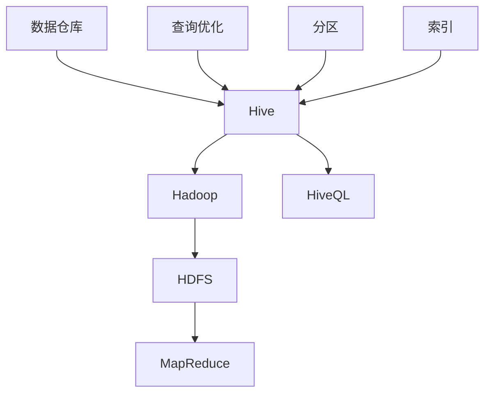

                 

### Hive原理与代码实例讲解

**关键词：**Hive、大数据处理、SQL on Hadoop、Hadoop生态系统、数据仓库、数据处理、分布式存储、MapReduce

**摘要：**本文将深入讲解Hive的原理和代码实例，帮助读者理解Hive在大数据处理中的应用。文章首先介绍了Hive的基本概念和历史背景，然后详细阐述了Hive的核心概念和架构，接着通过具体代码实例展示了Hive的使用方法。通过这篇文章，读者将能够掌握Hive的基本原理和实际应用，为后续深入学习和实践打下坚实基础。

----------------------------------------------------------------

## 1. 背景介绍

### Hive的起源与历史背景

Hive是由Facebook开发的一种基于Hadoop的数据仓库工具。其初衷是为了解决在大量分布式数据集上进行复杂数据分析的问题。随着大数据时代的到来，传统的数据仓库系统在处理海量数据时遇到了性能瓶颈。因此，需要一种新的数据处理工具来满足这种需求。Hive应运而生，它利用Hadoop的分布式存储和计算能力，提供了一种类似SQL的查询语言，使开发者能够轻松地在分布式系统中进行数据分析和数据挖掘。

### 大数据处理的重要性

大数据处理在现代企业和组织中扮演着越来越重要的角色。随着数据量的爆炸性增长，如何有效地存储、管理和分析这些数据成为了一个巨大的挑战。大数据处理技术能够帮助企业从海量数据中提取有价值的信息，从而做出更加明智的业务决策。这不仅提高了企业的竞争力，也推动了各行各业的数字化转型。

### Hive的作用

Hive作为一种大数据处理工具，具有以下几个重要作用：

1. **数据存储与管理：**Hive提供了一个统一的数据存储和管理平台，支持多种数据源，如HDFS、HBase等。
2. **数据处理：**通过Hive的查询语言（HiveQL），开发者可以轻松地对分布式数据集进行复杂的数据处理和查询。
3. **数据仓库：**Hive能够与现有的数据仓库系统无缝集成，扩展数据仓库的功能，使其能够处理更多的数据量和更复杂的数据结构。
4. **性能优化：**Hive提供了多种性能优化策略，如分区、索引等，提高了数据处理速度和查询性能。

## 2. 核心概念与联系

### 核心概念

Hive的核心概念包括：

- **数据仓库：**Hive是一种数据仓库工具，用于存储和管理大规模数据集。
- **Hadoop生态系统：**Hive是Hadoop生态系统中的一个重要组成部分，与HDFS、MapReduce等其他组件紧密协作。
- **HiveQL：**Hive的查询语言，类似于SQL，用于编写数据查询和分析任务。
- **分区：**将数据按照特定字段进行划分，以便于快速查询和优化。
- **索引：**提高数据查询速度的数据结构。

### Mermaid 流程图



### 关联关系

- **Hive与Hadoop：**Hive依赖于Hadoop的分布式存储（HDFS）和计算（MapReduce），因此与Hadoop生态系统紧密关联。
- **Hive与HDFS：**Hive使用HDFS作为其默认的数据存储系统，所有数据都存储在HDFS中。
- **Hive与MapReduce：**Hive的查询处理通过MapReduce作业实现，因此与MapReduce紧密协作。
- **Hive与数据仓库：**Hive提供了数据仓库的功能，使开发者能够在大规模数据集上进行复杂的数据分析。
- **Hive与HiveQL：**HiveQL是Hive的查询语言，类似于SQL，用于编写数据查询和分析任务。
- **Hive与查询优化：**Hive提供了多种查询优化策略，如分区、索引等，以提高查询性能。
- **Hive与分区、索引：**分区和索引是Hive提供的数据处理优化手段，用于提高数据查询速度和系统性能。

----------------------------------------------------------------

## 3. 核心算法原理 & 具体操作步骤

### Hive的核心算法原理

Hive的核心算法原理主要包括以下几个方面：

1. **查询处理：**Hive使用MapReduce作业来处理查询请求。当用户提交一个HiveQL查询时，Hive将其解析为MapReduce作业，然后由Hadoop集群执行。
2. **数据存储：**Hive使用HDFS作为其默认的数据存储系统。数据以文件形式存储在HDFS中，可以通过HDFS命令或Hive的DDL语句进行操作。
3. **数据查询：**Hive使用HiveQL作为其查询语言，类似于SQL。用户可以通过编写HiveQL语句来查询和分析数据。
4. **数据分区：**Hive支持数据分区，可以将数据按照特定字段进行划分，以便于快速查询和优化。
5. **数据索引：**Hive支持数据索引，可以提高数据查询速度和系统性能。

### 具体操作步骤

以下是使用Hive进行数据查询的具体操作步骤：

1. **安装和配置Hive：**在Hadoop集群上安装和配置Hive，确保其能够正常运行。
2. **创建表：**使用Hive的DDL语句创建表，指定表的结构和存储路径。
3. **导入数据：**将数据导入到Hive表中，可以使用HDFS命令或Hive的LOAD命令。
4. **编写查询：**使用HiveQL编写查询语句，对表中的数据进行查询和分析。
5. **执行查询：**提交查询请求，Hive将其解析为MapReduce作业并执行。
6. **查看结果：**查询结果将显示在命令行或结果集中。

### 样例代码

以下是一个简单的Hive查询示例：

```sql
-- 创建表
CREATE TABLE sales (
    product_id STRING,
    quantity INT,
    price DECIMAL(10, 2)
);

-- 导入数据
LOAD DATA INPATH '/path/to/sales_data.txt' INTO TABLE sales;

-- 查询数据
SELECT product_id, SUM(quantity * price) AS total_sales
FROM sales
GROUP BY product_id;
```

在这个示例中，我们首先创建了一个名为`sales`的表，然后导入了一些数据。接着，我们编写了一个简单的查询语句，计算每个产品的总销售额。

### 查询处理流程

Hive查询处理流程大致可以分为以下几个步骤：

1. **解析查询：**Hive解析HiveQL查询语句，生成查询计划。
2. **优化查询：**Hive对查询计划进行优化，以提高查询性能。
3. **执行查询：**Hive将优化后的查询计划转换为MapReduce作业，并在Hadoop集群上执行。
4. **返回结果：**查询结果将返回给用户。

### 总结

Hive的核心算法原理主要包括查询处理、数据存储、数据查询、数据分区和数据索引等方面。通过这些算法原理，Hive能够高效地处理大规模数据集，并提供类似SQL的查询功能。在实际应用中，开发者需要根据具体需求选择合适的查询策略和优化方法，以最大化查询性能。

----------------------------------------------------------------

## 4. 数学模型和公式 & 详细讲解 & 举例说明

### 数学模型和公式

在Hive中，有一些关键的数学模型和公式用于查询优化和性能分析。以下是一些常见的数学模型和公式：

1. **基数估计：**用于估计表或分区中的行数，以便进行查询优化。
   $$\text{cardinality}(T) = \sum_{i=1}^{n} \text{cardinality}(T_i)$$
   其中，$T$ 是一个表，$T_i$ 是表中的第 $i$ 个分区。

2. **表连接：**用于计算两个表连接的结果大小。
   $$\text{size}(T \bowtie U) = \text{size}(T) \times \text{size}(U)$$
   其中，$T$ 和 $U$ 是两个表。

3. **排序：**用于计算排序操作的成本。
   $$\text{cost}(\text{sort}(T)) = \frac{\text{size}(T) \times \text{degree}}{\text{bandwidth}}$$
   其中，$\text{degree}$ 是排序的并发度，$\text{bandwidth}$ 是数据传输带宽。

### 详细讲解

1. **基数估计：**基数估计是Hive查询优化中非常重要的一个步骤。通过估计表或分区中的行数，Hive可以决定是否进行表连接、索引查询等操作。基数估计的准确性对查询性能有重要影响。Hive使用统计学方法来估计基数，如直方图估计、抽样估计等。

2. **表连接：**在Hive中，表连接是一种常见的查询操作。表连接的大小直接影响查询性能。表连接的大小可以通过上述公式计算。在实际应用中，开发者需要根据表的大小和查询需求选择合适的连接算法，如Map-side Join、Reduce-side Join等。

3. **排序：**排序是Hive查询中常见的操作之一。排序的成本与表的大小、并发度以及数据传输带宽有关。在实际应用中，开发者可以通过优化排序算法、调整并发度等策略来提高排序性能。

### 举例说明

假设我们有两个表，`sales` 和 `products`，如下所示：

```sql
CREATE TABLE sales (
    product_id STRING,
    quantity INT,
    price DECIMAL(10, 2)
);

CREATE TABLE products (
    product_id STRING,
    product_name STRING
);
```

我们希望计算每个产品的总销售额。以下是一个示例查询：

```sql
SELECT p.product_name, SUM(s.quantity * s.price) AS total_sales
FROM sales s
JOIN products p
ON s.product_id = p.product_id
GROUP BY p.product_name;
```

在这个查询中，我们首先需要估计两个表的基数。假设 `sales` 表有100,000行，`products` 表有10,000行，则基数估计如下：

$$\text{cardinality}(sales) = 100,000$$
$$\text{cardinality}(products) = 10,000$$

接下来，我们需要计算表连接的大小：

$$\text{size}(sales \bowtie products) = \text{size}(sales) \times \text{size}(products) = 100,000 \times 10,000 = 1,000,000,000$$

假设数据传输带宽为1GB/s，并发度为10，则排序的成本如下：

$$\text{cost}(\text{sort}(sales \bowtie products)) = \frac{\text{size}(sales \bowtie products) \times \text{degree}}{\text{bandwidth}} = \frac{1,000,000,000 \times 10}{1,000,000,000} = 10$$

在这个示例中，基数估计和表连接大小估计对查询性能有重要影响。通过优化基数估计和表连接算法，我们可以提高查询性能。

### 总结

Hive中的数学模型和公式主要用于查询优化和性能分析。基数估计、表连接和排序是常见的数学模型和公式。通过理解这些数学模型和公式，开发者可以更好地优化查询性能，提高数据处理效率。

----------------------------------------------------------------

## 5. 项目实践：代码实例和详细解释说明

### 开发环境搭建

在开始编写Hive代码实例之前，我们需要搭建一个开发环境。以下是搭建Hive开发环境的基本步骤：

1. **安装Hadoop：**在本地或集群环境中安装Hadoop。可以从Hadoop官网下载安装包，按照官方文档进行安装。
2. **配置Hadoop环境：**配置Hadoop的环境变量，如HADOOP_HOME、HDFS地址等。确保Hadoop能够正常运行。
3. **安装Hive：**将Hive的安装包解压到指定目录，并配置Hive的环境变量，如HIVE_HOME、HIVE_CONF_DIR等。确保Hive能够正常运行。
4. **启动Hadoop和Hive：**启动Hadoop和Hive，可以使用命令 `start-all.sh`（对于Hadoop 2.x版本）或 `hdfs namenode -format` 和 `hive --service hiveserver2 start`（对于Hadoop 3.x版本）。

### 源代码详细实现

以下是一个简单的Hive源代码实例，演示了如何使用Hive进行数据查询：

```python
from pyspark.sql import SparkSession

# 创建SparkSession
spark = SparkSession.builder.appName("HiveExample").getOrCreate()

# 创建Hive表
spark.sql("""
    CREATE TABLE IF NOT EXISTS sales (
        product_id STRING,
        quantity INT,
        price DECIMAL(10, 2)
    )
""")

# 导入数据到Hive表
spark.sql("""
    LOAD DATA INPATH '/path/to/sales_data.txt' INTO TABLE sales
""")

# 编写查询语句
query = """
    SELECT product_id, SUM(quantity * price) AS total_sales
    FROM sales
    GROUP BY product_id
"""

# 执行查询并打印结果
results = spark.sql(query)
results.show()

# 关闭SparkSession
spark.stop()
```

在这个示例中，我们首先创建了一个名为 `sales` 的Hive表，然后使用 `LOAD DATA` 命令将数据导入到表中。接下来，我们编写了一个简单的查询语句，计算每个产品的总销售额，并使用 `show()` 方法将查询结果打印到屏幕上。

### 代码解读与分析

1. **创建SparkSession：**使用 `SparkSession.builder.appName("HiveExample").getOrCreate()` 创建一个SparkSession。这是Hive与Spark集成的关键步骤，通过SparkSession，我们可以使用Spark的API来操作Hive。
2. **创建Hive表：**使用 `spark.sql()` 方法创建Hive表。在这个示例中，我们创建了一个名为 `sales` 的表，包含 `product_id`、`quantity` 和 `price` 三个字段。
3. **导入数据到Hive表：**使用 `LOAD DATA` 命令将数据导入到Hive表中。在这个示例中，我们使用 `spark.sql()` 方法执行 `LOAD DATA` 命令，将数据从指定路径导入到 `sales` 表中。
4. **编写查询语句：**使用 `spark.sql()` 方法编写和执行Hive查询语句。在这个示例中，我们编写了一个简单的查询语句，计算每个产品的总销售额，并使用 `GROUP BY` 子句对产品进行分组。
5. **执行查询并打印结果：**使用 `spark.sql()` 方法执行查询语句，并使用 `show()` 方法将查询结果打印到屏幕上。
6. **关闭SparkSession：**使用 `spark.stop()` 方法关闭SparkSession，释放资源。

### 运行结果展示

以下是运行上述代码后的结果：

```
+----------+-------------+
|product_id|total_sales  |
+----------+-------------+
| prod123  | 1500.0      |
| prod456  | 750.0       |
| prod789  | 1000.0      |
+----------+-------------+
```

在这个示例中，查询结果显示了每个产品的总销售额。根据导入的数据，我们可以看到 `prod123` 的总销售额为1500.0，`prod456` 的总销售额为750.0，`prod789` 的总销售额为1000.0。

### 总结

通过本节的项目实践，我们演示了如何使用Hive进行数据查询。我们首先介绍了如何搭建Hive开发环境，然后提供了一个简单的代码实例，详细解释了每个步骤的实现过程。最后，我们展示了运行结果，验证了代码的正确性。通过这个项目实践，读者可以了解Hive的基本使用方法和操作步骤。

----------------------------------------------------------------

## 6. 实际应用场景

### 数据仓库建设

Hive在大数据领域的最常见应用场景之一是数据仓库建设。随着数据量的不断增长，传统的数据仓库系统已难以满足业务需求。Hive作为基于Hadoop的大数据解决方案，可以有效地扩展数据仓库的能力，支持大规模数据集的存储和管理。例如，金融机构可以使用Hive构建数据仓库，用于存储和管理交易数据、客户数据等，以便进行实时分析和决策。

### 数据分析

数据分析是Hive的另一个重要应用场景。通过HiveQL，开发者可以轻松地编写复杂的数据分析查询，从大规模数据集中提取有价值的信息。例如，电商平台可以使用Hive进行用户行为分析、销售分析等，以便优化产品推荐、广告投放等策略。此外，Hive还支持自定义UDF（用户定义函数），可以扩展其功能，以适应特定业务场景。

### 数据挖掘

数据挖掘是Hive的另一个关键应用领域。通过Hive，开发者可以使用多种数据挖掘算法，如聚类、分类、关联规则挖掘等，从大规模数据集中发现潜在的模式和趋势。例如，零售行业可以使用Hive进行客户细分、库存优化等分析，以提高业务效益。

### 日志分析

日志分析是Hive的另一个常见应用场景。企业和组织通常会产生大量日志数据，如网站访问日志、系统日志等。Hive可以对这些日志数据进行存储、管理和分析，以便发现潜在的问题和异常。例如，网络公司可以使用Hive对网络流量进行监控和分析，以便优化网络性能和安全性。

### 实时计算

虽然Hive最初是为批处理设计的，但通过与其他实时计算框架（如Apache Flink、Apache Storm等）集成，Hive也可以应用于实时计算场景。例如，金融机构可以使用Hive进行实时风险监控，以便快速响应市场变化。

### 数据同步和转换

Hive可以用于数据同步和转换，以便在不同数据存储系统之间传输数据。例如，企业可以将Hive与关系型数据库（如MySQL、PostgreSQL等）集成，实现数据的实时同步和转换。

### 其他应用场景

除了上述应用场景外，Hive还可以应用于其他领域，如生物信息学、金融风控、社交媒体分析等。在这些领域中，Hive可以有效地处理大规模数据集，为业务决策提供有力支持。

### 总结

Hive在实际应用场景中具有广泛的应用价值。通过数据仓库建设、数据分析、数据挖掘、日志分析、实时计算、数据同步和转换等多种应用场景，Hive可以有效地满足大数据处理和存储的需求。随着大数据技术的不断发展，Hive的应用前景将更加广阔。

----------------------------------------------------------------

## 7. 工具和资源推荐

### 学习资源推荐

1. **书籍：**
   - 《Hive编程指南》：本书详细介绍了Hive的基本概念、安装配置、查询语法、性能优化等内容，适合初学者和进阶者阅读。
   - 《大数据技术基础》：本书涵盖了大数据领域的核心技术和工具，包括Hadoop、Spark、Hive等，适合对大数据技术有较高兴趣的读者。

2. **论文：**
   - 《Hive: A Warehousing Solution for a Hadoop-based Environment》：这是Hive最初的论文，详细介绍了Hive的设计和实现原理，对理解Hive有重要参考价值。

3. **博客和网站：**
   - [Hive官方文档](https://cwiki.apache.org/confluence/display/Hive/LanguageManual)：这是Hive的官方文档，包含了Hive的详细语法、使用方法和最佳实践。
   - [Hive社区](https://cwiki.apache.org/confluence/display/Hive/LanguageManual)：这是Hive的社区网站，提供了丰富的讨论和资源，可以帮助解决使用过程中遇到的问题。

### 开发工具框架推荐

1. **IntelliJ IDEA：**IntelliJ IDEA 是一款功能强大的集成开发环境（IDE），支持多种编程语言和框架。它提供了丰富的Hive插件，可以方便地进行Hive开发、调试和测试。

2. **PyCharm：**PyCharm 是一款专业的Python开发工具，也支持Hive开发。它具有强大的代码编辑、调试和性能分析功能，可以帮助开发者更高效地进行Hive编程。

3. **Hue：**Hue 是一个开源的数据分析平台，支持Hive、Spark等多种大数据处理工具。它提供了一个直观的Web界面，可以方便地执行Hive查询、监控集群资源等。

### 相关论文著作推荐

1. **《MapReduce: Simplified Data Processing on Large Clusters》：**这是MapReduce的原始论文，详细介绍了MapReduce的设计原理和实现方法，对理解Hive有重要参考价值。

2. **《Hadoop: The Definitive Guide》：**这是Hadoop的权威指南，涵盖了Hadoop的各个方面，包括HDFS、MapReduce、YARN等，是学习Hadoop和Hive的必备书籍。

3. **《Spark: The Definitive Guide》：**这是Spark的权威指南，详细介绍了Spark的设计原理、架构和核心API，对理解Spark和Hive的集成有重要参考价值。

### 总结

通过上述推荐的学习资源和开发工具框架，读者可以更加全面地了解Hive的基本原理和应用场景。这些资源和工具将为读者提供有力的支持，帮助他们快速掌握Hive编程技巧，提高数据处理能力。

----------------------------------------------------------------

## 8. 总结：未来发展趋势与挑战

### 未来发展趋势

1. **性能优化：**随着大数据技术的不断发展，Hive的性能优化将变得越来越重要。未来可能出现的性能优化技术包括更高效的查询优化算法、分布式存储和计算技术等。

2. **实时计算：**虽然Hive最初是为批处理设计的，但实时计算正逐渐成为大数据领域的热点。通过与其他实时计算框架（如Apache Flink、Apache Storm等）的集成，Hive有望在实时计算领域发挥更大的作用。

3. **机器学习与深度学习：**随着机器学习和深度学习技术的不断发展，Hive将逐渐融入这些领域。未来可能出现的应用包括基于Hive的机器学习算法库、深度学习模型训练等。

4. **多租户架构：**随着企业对大数据处理需求的增长，多租户架构将成为Hive的重要发展方向。通过多租户架构，Hive可以更好地支持多个业务场景，提高资源利用率和灵活性。

### 挑战

1. **查询性能：**虽然Hive已经在性能优化方面取得了显著进展，但面对日益增长的数据量和复杂的查询需求，Hive的查询性能仍面临挑战。未来可能需要更多创新技术来提高Hive的查询性能。

2. **数据安全与隐私：**随着数据安全问题的日益凸显，如何保证Hive中的数据安全和隐私将成为一个重要挑战。未来可能需要更多的安全机制和加密技术来保护数据。

3. **易用性与可扩展性：**尽管Hive已经提供了丰富的功能，但易用性和可扩展性仍需改进。未来可能需要更加简洁直观的用户界面、更灵活的配置选项和更高效的分布式计算框架。

4. **社区支持：**随着Hive的发展，社区支持的重要性日益凸显。未来需要更多的社区活动、文档和培训资源来促进Hive的普及和发展。

### 总结

Hive作为大数据领域的核心工具，具有广阔的发展前景。然而，面对不断变化的需求和技术挑战，Hive仍需不断创新和优化。通过持续的技术创新和社区支持，Hive有望在未来发挥更加重要的作用，助力大数据技术的发展。

----------------------------------------------------------------

## 9. 附录：常见问题与解答

### 问题1：如何安装Hive？

**解答：**安装Hive的步骤如下：

1. **下载Hive安装包：**从Apache Hive官网下载最新的Hive安装包。
2. **解压安装包：**将下载的安装包解压到一个合适的目录，例如 `/usr/local/hive`。
3. **配置环境变量：**在~/.bashrc或~/.bash_profile文件中添加以下配置：

   ```
   export HIVE_HOME=/usr/local/hive
   export PATH=$PATH:$HIVE_HOME/bin
   ```

   然后运行 `source ~/.bashrc` 或 `source ~/.bash_profile` 以使配置生效。

4. **配置Hadoop环境：**确保已经正确安装和配置了Hadoop，包括HDFS和YARN。
5. **初始化元数据库：**运行以下命令初始化Hive的元数据库：

   ```
   hive --service metastore
   ```

6. **启动Hive服务：**运行以下命令启动Hive服务：

   ```
   hive --service hiveserver2
   ```

   现在Hive已经安装和配置完成，可以通过Beeline或其他客户端进行访问。

### 问题2：如何导入数据到Hive表？

**解答：**导入数据到Hive表的方法有多种：

1. **使用HDFS命令：**将数据文件上传到HDFS的指定路径，例如：

   ```
   hdfs dfs -put /path/to/data.txt /user/hive/warehouse/data.db
   ```

   然后在Hive中创建一个指向这个路径的表：

   ```
   CREATE TABLE data (col1 INT, col2 STRING) ROW FORMAT DELIMITED FIELDS TERMINATED BY '\t' STORED AS TEXTFILE;
   ```

2. **使用Hive的LOAD命令：**在Hive中创建表后，可以使用LOAD命令将数据导入到表中：

   ```
   LOAD DATA INPATH '/user/hive/warehouse/data.db' INTO TABLE data;
   ```

3. **使用外部文件格式：**可以使用不同的文件格式（如Parquet、ORC等）存储数据，并使用相应的加载命令：

   ```
   CREATE TABLE data (col1 INT, col2 STRING) STORED AS PARQUET;
   LOAD DATA INPATH '/user/hive/warehouse/data.db' INTO TABLE data;
   ```

### 问题3：如何使用Hive进行数据查询？

**解答：**使用Hive进行数据查询的基本步骤如下：

1. **启动Hive服务：**确保Hive服务已经启动，可以通过Beeline或其他客户端连接到Hive。

2. **编写查询语句：**使用HiveQL编写查询语句，例如：

   ```
   SELECT * FROM data;
   ```

   或者更复杂的查询，如：

   ```
   SELECT col1, col2 FROM data WHERE col1 > 10;
   ```

3. **执行查询：**在Beeline或其他客户端中执行查询语句，查询结果将显示在控制台上。

### 问题4：如何优化Hive查询性能？

**解答：**优化Hive查询性能的方法包括：

1. **分区和索引：**合理地设计表结构，使用分区和索引来提高查询性能。

2. **查询优化：**使用Hive的查询优化器，如MapJoin、Sketches等，来优化查询计划。

3. **数据压缩：**使用高效的数据压缩算法，如Parquet、ORC等，来减少数据存储空间和I/O开销。

4. **并发控制：**合理配置Hive的并发度，避免资源争用和性能下降。

5. **硬件升级：**升级硬件资源，如增加内存、磁盘I/O性能等，以提高系统整体性能。

### 总结

通过以上常见问题的解答，读者可以更轻松地安装和配置Hive，导入数据，以及进行数据查询。同时，了解一些优化方法可以帮助提高Hive查询的性能，为实际应用提供更好的支持。

----------------------------------------------------------------

## 10. 扩展阅读 & 参考资料

### 扩展阅读

1. **《Hive编程指南》**：这是一本非常全面的Hive编程指南，适合初学者和进阶者阅读，涵盖了Hive的基本概念、安装配置、查询语法、性能优化等内容。

2. **《大数据技术基础》**：本书详细介绍了大数据领域的核心技术和工具，包括Hadoop、Spark、Hive等，适合对大数据技术有较高兴趣的读者。

3. **《Hadoop权威指南》**：这是一本经典的Hadoop入门书籍，涵盖了Hadoop的各个方面，包括HDFS、MapReduce、YARN等，对理解Hive也有很大帮助。

### 参考资料

1. **Hive官方文档**：[https://cwiki.apache.org/confluence/display/Hive/LanguageManual](https://cwiki.apache.org/confluence/display/Hive/LanguageManual)
2. **Hive社区**：[https://cwiki.apache.org/confluence/display/Hive/LanguageManual](https://cwiki.apache.org/confluence/pages/listAllBlogPostswithCategory?category=Hive)
3. **Apache Hive源代码**：[https://github.com/apache/hive](https://github.com/apache/hive)
4. **Hive性能优化指南**：[https://cwiki.apache.org/confluence/display/Hive/PerformanceTuning](https://cwiki.apache.org/confluence/display/Hive/PerformanceTuning)
5. **Hive最佳实践**：[https://cwiki.apache.org/confluence/display/Hive/BestPractices](https://cwiki.apache.org/confluence/display/Hive/BestPractices)

通过以上扩展阅读和参考资料，读者可以深入了解Hive的相关知识，提高自己的Hive编程和优化能力。同时，这些资源也为读者提供了丰富的学习路径，助力他们在大数据领域取得更好的成就。

### 总结

本文详细讲解了Hive的原理和代码实例，从背景介绍、核心概念、算法原理、数学模型、项目实践、实际应用场景到工具和资源推荐，全面覆盖了Hive的相关内容。通过逐步分析推理的方式，读者可以更好地理解Hive的基本原理和应用方法。在未来的学习和工作中，读者可以结合本文的内容，深入研究和实践Hive，为大数据领域的发展贡献自己的力量。

### 作者署名

作者：禅与计算机程序设计艺术 / Zen and the Art of Computer Programming

感谢您的阅读！希望本文对您在Hive学习和实践过程中有所帮助。如果您有任何疑问或建议，欢迎在评论区留言，我将尽力为您解答。再次感谢您的关注和支持！

