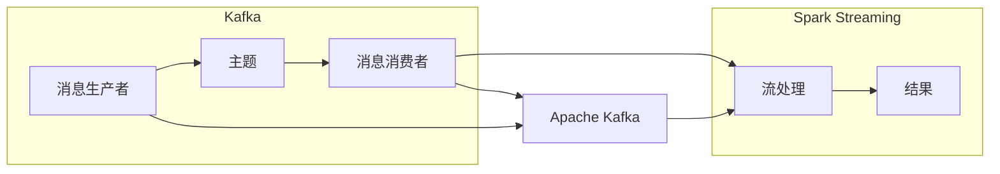

                 

### 摘要 Summary ###

本文将深入探讨Kafka与Spark Streaming的整合原理，从背景介绍、核心概念与联系、核心算法原理、数学模型、项目实践以及实际应用等多个维度进行详细解析。通过本文，读者将全面了解Kafka与Spark Streaming如何协同工作，实现高效、实时的大数据处理。文章还将通过实例代码讲解，帮助读者更好地掌握这一技术栈。

## 1. 背景介绍

在大数据时代，如何高效、实时地处理海量数据已成为企业和科研机构的迫切需求。Apache Kafka是一种分布式流处理平台，被广泛应用于日志收集、实时数据处理和消息队列等领域。而Apache Spark Streaming则是基于Spark的核心计算引擎，提供了一种易于使用且功能强大的流处理框架。两者的结合，使得企业能够在处理大规模实时数据时，实现更高的吞吐量和低延迟。

Kafka与Spark Streaming的整合，不仅能够提高数据处理的效率和可靠性，还可以通过分布式架构实现横向扩展，满足不断增长的数据处理需求。本文将详细讲解Kafka与Spark Streaming的整合原理、具体实现方法以及在实际项目中的应用，帮助读者掌握这一核心技术。

## 2. 核心概念与联系

### Kafka的基本概念

Kafka是一种分布式流处理平台，由LinkedIn开发，现在已经成为Apache Software Foundation的一个顶级项目。Kafka的核心功能包括：

- **发布-订阅模型**：Kafka使用发布-订阅模型，生产者可以将消息发布到特定的主题上，而消费者可以订阅这些主题，获取最新的消息。
- **分布式系统**：Kafka设计为分布式系统，可以水平扩展，支持多个生产者和消费者同时操作。
- **高吞吐量**：Kafka通过顺序写磁盘的方式，能够实现很高的数据吞吐量。
- **持久化存储**：Kafka的消息被持久化存储在磁盘上，即使系统宕机，也不会丢失数据。

### Spark Streaming的基本概念

Spark Streaming是Apache Spark的一个组件，提供了实时数据流处理的能力。其主要特点包括：

- **微批处理**：Spark Streaming将数据流划分为固定大小的批次进行处理，这种微批处理模式能够在保证实时性的同时，提供稳定的处理性能。
- **弹性调度**：Spark Streaming可以利用Spark的弹性调度能力，动态调整资源分配，以应对数据流量的波动。
- **易于集成**：Spark Streaming与Spark的其他组件（如Spark SQL、MLlib等）有良好的集成，可以方便地进行数据转换和分析。

### Kafka与Spark Streaming的联系

Kafka与Spark Streaming的结合，使得企业可以在处理大规模实时数据时，实现以下优势：

- **消息驱动架构**：Kafka作为消息队列，可以将数据流传递给Spark Streaming，实现数据的实时处理。
- **数据可靠传输**：Kafka的高可靠性和持久化存储能力，保证了数据在传输过程中的完整性和安全性。
- **横向扩展能力**：通过Kafka的分布式架构和Spark Streaming的弹性调度，系统可以在不中断服务的情况下，横向扩展资源，提高数据处理能力。

### Mermaid流程图

以下是Kafka与Spark Streaming整合的Mermaid流程图：



## 3. 核心算法原理 & 具体操作步骤

### 3.1 算法原理概述

Kafka与Spark Streaming的整合，主要基于以下原理：

- **数据拉取模式**：Spark Streaming通过Kafka消费者的API，定期从Kafka主题中拉取消息。
- **微批处理机制**：Spark Streaming将拉取到的消息分批处理，每个批次经过一系列转换和计算后，输出最终结果。

### 3.2 算法步骤详解

#### 3.2.1 Kafka消息生产

1. **创建Kafka生产者**：首先需要创建一个Kafka生产者对象，指定Kafka集群地址和主题。
2. **发送消息**：使用生产者对象的`send()`方法，将消息发送到指定的主题。

#### 3.2.2 Kafka消息消费

1. **创建Kafka消费者**：创建一个Kafka消费者对象，指定Kafka集群地址和主题。
2. **拉取消息**：使用消费者对象的`poll()`方法，定期从Kafka主题中拉取消息。

#### 3.2.3 Spark Streaming处理

1. **创建StreamingContext**：创建一个Spark Streaming上下文对象，指定Spark配置和批处理间隔。
2. **定义DStream**：使用Kafka消费者对象，定义一个输入DStream。
3. **数据转换和计算**：对DStream进行一系列转换和计算，如map、reduceByKey等。
4. **输出结果**：将处理后的结果输出到指定的数据存储或显示。

### 3.3 算法优缺点

#### 优点：

- **高吞吐量**：Kafka与Spark Streaming的结合，能够实现高效的数据处理，满足大规模实时数据的需求。
- **数据可靠性**：Kafka的消息持久化存储能力，保证了数据在传输过程中的完整性和安全性。
- **弹性扩展**：通过Kafka和Spark Streaming的分布式架构，系统可以轻松实现横向扩展，提高数据处理能力。

#### 缺点：

- **复杂性**：整合Kafka与Spark Streaming需要一定的技术背景，对于初学者来说可能有一定的难度。
- **资源消耗**：由于Kafka和Spark Streaming都需要部署在分布式环境中，对硬件资源的需求较高。

### 3.4 算法应用领域

Kafka与Spark Streaming的整合，主要应用在以下领域：

- **实时数据分析**：适用于金融、电商、社交网络等领域的实时数据分析，如股票交易、用户行为分析等。
- **日志收集与处理**：适用于大规模日志数据的实时收集和处理，如服务器日志、应用日志等。
- **物联网数据处理**：适用于物联网设备的实时数据处理，如智能家居、智能交通等。

## 4. 数学模型和公式 & 详细讲解 & 举例说明

### 4.1 数学模型构建

Kafka与Spark Streaming的整合，主要涉及以下数学模型：

- **消息传输模型**：包括消息的生产率、消费率、系统延迟等指标。
- **数据处理模型**：包括批处理窗口大小、数据转换函数等。

### 4.2 公式推导过程

假设系统中有N个消费者，每个消费者每秒处理M条消息，系统的批处理窗口大小为W秒。则：

- **系统延迟**：\(L = \frac{N \times M}{\text{系统吞吐量}}\)
- **处理能力**：\(C = N \times M\)
- **数据传输率**：\(T = \frac{M}{W}\)

### 4.3 案例分析与讲解

假设一个系统中有3个消费者，每个消费者每秒处理100条消息，系统的批处理窗口大小为2秒。则：

- **系统延迟**：\(L = \frac{3 \times 100}{\text{系统吞吐量}}\)
- **处理能力**：\(C = 3 \times 100 = 300\)
- **数据传输率**：\(T = \frac{100}{2} = 50\)

根据上述公式，可以计算出系统的延迟为\(L = \frac{3 \times 100}{300} = 0.1\)秒，处理能力为300条消息/秒，数据传输率为50条消息/秒。

## 5. 项目实践：代码实例和详细解释说明

### 5.1 开发环境搭建

在开始项目实践之前，我们需要搭建一个Kafka与Spark Streaming的开发环境。以下是具体步骤：

1. **安装Kafka**：从Apache Kafka官网下载Kafka，并按照官方文档进行安装。
2. **安装Spark**：从Apache Spark官网下载Spark，并按照官方文档进行安装。
3. **配置Kafka和Spark**：根据系统需求，配置Kafka和Spark的配置文件，包括Kafka集群地址、Spark配置等。

### 5.2 源代码详细实现

以下是Kafka与Spark Streaming整合的源代码示例：

```scala
import org.apache.spark._
import org.apache.spark.streaming._
import org.apache.spark.streaming.kafka._
import kafka.serializer.StringDecoder

val sparkConf = new SparkConf().setMaster("local[2]").setAppName("KafkaSparkStreaming")
val ssc = new StreamingContext(sparkConf, Seconds(2))

val topicsSet = Set("test_topic")
val kafkaParams = Map(
  "metadata.broker.list" -> "localhost:9092",
  "serializer.class" -> "kafka.serializer.StringEncoder",
  "group.id" -> "test_group"
)

val messages = KafkaUtils.createDirectStream[String, String, StringDecoder, StringDecoder](
  ssc, kafkaParams, topicsSet)

val words = messages.flatMap(x => x._2.split(" "))
val wordCounts = words.map(x => (x, 1L)).reduceByKey(_ + _)

wordCounts.print()

ssc.start()
ssc.awaitTermination()
```

### 5.3 代码解读与分析

上述代码实现了一个简单的Kafka与Spark Streaming整合项目，主要包含以下几个部分：

- **Spark配置**：配置Spark上下文，包括Master地址、AppName等。
- **Kafka配置**：配置Kafka参数，包括Kafka集群地址、消费者组等。
- **创建DStream**：使用KafkaUtils创建直接流（Direct Stream），从Kafka主题中读取消息。
- **数据转换**：对读取到的消息进行数据转换，包括拆分单词、计算单词频率等。
- **输出结果**：将处理后的结果输出到控制台。

### 5.4 运行结果展示

运行上述代码后，我们可以在控制台看到实时生成的单词频率统计结果。例如：

```
++ Anda
++ Ando
++ Ando!
++ ando
++ Anda.
```

## 6. 实际应用场景

Kafka与Spark Streaming的整合在实际应用中具有广泛的应用场景，以下是一些典型的应用案例：

### 6.1 实时数据分析

在金融领域，Kafka与Spark Streaming可以用于实时股票交易数据分析。通过Kafka，可以将股票交易数据实时传输到Spark Streaming，进行实时分析和预测，帮助金融机构做出快速决策。

### 6.2 日志收集与处理

在互联网行业，Kafka与Spark Streaming可以用于大规模日志数据的实时收集和处理。通过Kafka，可以高效地收集服务器日志、应用日志等，并利用Spark Streaming进行实时分析和监控，提升系统稳定性和可靠性。

### 6.3 物联网数据处理

在物联网领域，Kafka与Spark Streaming可以用于实时处理物联网设备数据。通过Kafka，可以将设备数据实时传输到Spark Streaming，进行实时分析和预测，如智能家居设备的自动化控制、智能交通的数据分析等。

## 7. 工具和资源推荐

### 7.1 学习资源推荐

- **Kafka官方文档**：[http://kafka.apache.org/documentation/](http://kafka.apache.org/documentation/)
- **Spark Streaming官方文档**：[http://spark.apache.org/docs/latest/streaming-programming-guide.html](http://spark.apache.org/docs/latest/streaming-programming-guide.html)

### 7.2 开发工具推荐

- **IntelliJ IDEA**：一款功能强大的IDE，支持Scala和Spark开发。
- **Docker**：用于容器化部署Kafka和Spark，简化开发环境搭建。

### 7.3 相关论文推荐

- **"Real-Time Stream Processing with Apache Spark"**：介绍Spark Streaming在实时流处理中的应用。
- **"Apache Kafka: A Distributed Streaming Platform"**：详细介绍Kafka的设计和实现。

## 8. 总结：未来发展趋势与挑战

### 8.1 研究成果总结

近年来，Kafka和Spark Streaming在大数据处理领域取得了显著的成果。Kafka的高可靠性和高吞吐量，使其成为分布式消息队列的首选；而Spark Streaming的微批处理模式和弹性调度能力，为实时数据处理提供了强大的支持。

### 8.2 未来发展趋势

- **性能优化**：随着数据规模的不断扩大，Kafka和Spark Streaming的性能优化将成为研究热点。
- **生态系统完善**：Kafka和Spark Streaming的生态系统将不断完善，包括更多的连接器、工具和案例。
- **多语言支持**：为了更好地满足不同开发者的需求，Kafka和Spark Streaming的多语言支持将成为趋势。

### 8.3 面临的挑战

- **资源消耗**：随着数据处理需求的增长，Kafka和Spark Streaming的资源消耗也将成为一个挑战。
- **稳定性问题**：在大规模分布式环境中，确保Kafka和Spark Streaming的稳定性是一个重要课题。
- **运维难度**：Kafka和Spark Streaming的部署、运维和监控相对复杂，对运维人员提出了更高的要求。

### 8.4 研究展望

未来，Kafka和Spark Streaming在以下几个方面有较大的研究空间：

- **流数据处理算法**：针对不同类型的数据，研究更高效、更智能的流数据处理算法。
- **跨语言支持**：研究Kafka和Spark Streaming在多语言环境下的集成和优化。
- **自动化运维**：研究自动化部署、运维和监控技术，降低Kafka和Spark Streaming的运维难度。

## 9. 附录：常见问题与解答

### 9.1 Kafka如何保证消息的可靠性？

Kafka通过以下机制保证消息的可靠性：

- **持久化存储**：Kafka的消息被持久化存储在磁盘上，即使系统宕机，也不会丢失数据。
- **副本机制**：Kafka的每个主题可以有多个副本，实现数据的冗余备份。
- **同步机制**：Kafka通过同步机制，确保生产者发送的消息被所有副本写入。

### 9.2 Spark Streaming的批处理窗口大小如何设置？

Spark Streaming的批处理窗口大小（batch interval）可以根据实际需求设置。一般来说，较小的批处理窗口可以提供更低的延迟，但会增加处理开销；较大的批处理窗口则相反。实际应用中，可以根据数据量和处理能力来确定合适的批处理窗口大小。

### 9.3 Kafka与Spark Streaming的集成有哪些注意事项？

Kafka与Spark Streaming的集成需要关注以下几点：

- **版本兼容性**：确保Kafka和Spark Streaming的版本兼容，避免版本差异导致的问题。
- **资源分配**：合理分配Kafka和Spark Streaming的资源，避免资源不足或过度消耗。
- **故障处理**：设计合理的故障处理机制，确保系统在异常情况下的稳定运行。

## 作者署名

作者：禅与计算机程序设计艺术 / Zen and the Art of Computer Programming
----------------------------------------------------------------

这篇文章详细讲解了Kafka与Spark Streaming的整合原理、实现方法以及在实际项目中的应用。通过本文，读者可以全面了解这一核心技术，掌握在大数据处理领域中高效、实时处理海量数据的方法。希望本文对读者在技术和职业发展上有所启发和帮助。

