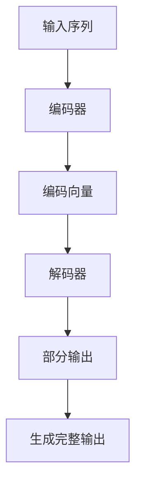

                 

关键词：大语言模型，公共服务，人工智能，自动化，便民措施

> 摘要：本文将探讨大语言模型（LLM）在公共服务领域中的应用，通过解析LLM的核心概念与架构，分析其在公共服务中的高效便民作用，并详细阐述其在多个实际应用场景中的实现方法、数学模型、代码实例和未来展望。作者：禅与计算机程序设计艺术 / Zen and the Art of Computer Programming

## 1. 背景介绍

随着人工智能技术的迅猛发展，大语言模型（LLM）已经成为自然语言处理（NLP）领域的重要工具。LLM通过深度学习算法，能够理解和生成自然语言，从而在信息检索、智能问答、文本生成等多个方面展现出强大的能力。近年来，LLM在公共服务领域的应用逐渐受到关注，其高效便民的特点为传统公共服务带来了新的变革。

### 公共服务

公共服务是指政府或公共机构为满足社会公众需求而提供的一系列服务，如医疗、教育、交通、环保等。传统公共服务模式中，信息获取和处理效率较低，服务质量参差不齐，且常常面临资源分配不均的问题。随着技术的发展，尤其是人工智能的兴起，公共服务开始朝着智能化、高效化、便民化的方向迈进。

### 大语言模型（LLM）

LLM是指拥有大规模参数、能够处理和理解复杂语言结构的大规模语言模型。常见的LLM包括GPT、BERT、T5等。这些模型通过在大量文本数据上进行训练，掌握了丰富的语言知识和规则，能够生成高质量的自然语言文本。

## 2. 核心概念与联系

### 大语言模型原理

大语言模型的核心原理是基于深度神经网络（DNN）的序列到序列（Seq2Seq）学习。模型通过多层神经网络对输入序列进行编码，再通过解码器生成输出序列。训练过程中，模型通过优化损失函数，不断提高对自然语言的理解和生成能力。

### LLM架构

LLM的架构通常包括编码器（Encoder）和解码器（Decoder）两个部分。编码器负责将输入序列编码为固定长度的向量表示，解码器则根据编码器的输出和已生成的部分输出，逐步生成完整的输出序列。

### Mermaid流程图



## 3. 核心算法原理 & 具体操作步骤

### 3.1 算法原理概述

LLM的核心算法是基于自注意力机制（Self-Attention）的 Transformer 模型。自注意力机制允许模型在生成每个输出位置时，自动地关注输入序列中其他位置的信息，从而提高模型的上下文理解能力。

### 3.2 算法步骤详解

1. **输入序列预处理**：对输入序列进行分词、词性标注等预处理，将文本转换为模型能够处理的向量表示。
2. **编码器处理**：将预处理后的输入序列输入到编码器，通过自注意力机制和前馈神经网络，生成编码向量。
3. **解码器处理**：将编码向量作为输入，解码器逐步生成输出序列。在每个时间步，解码器会根据已生成的部分输出和编码向量，通过自注意力机制和交叉注意力机制，生成下一个输出。
4. **生成完整输出**：解码器继续生成输出，直到达到停止条件或生成完整文本。

### 3.3 算法优缺点

**优点**：
- 强大的上下文理解能力，能够生成高质量的自然语言文本。
- 能够并行处理，训练速度快。
- 可以应用于多种NLP任务，如文本分类、机器翻译、问答系统等。

**缺点**：
- 参数规模巨大，对计算资源要求较高。
- 预训练过程中需要大量数据，数据获取和处理成本较高。

### 3.4 算法应用领域

LLM在公共服务领域具有广泛的应用前景，如：
- **智能问答系统**：为公众提供便捷的咨询服务，如医疗健康、法律咨询等。
- **文本生成与自动写作**：自动生成政府公告、新闻稿等，提高信息传播效率。
- **信息检索**：基于自然语言查询，提供精准的公共服务信息检索服务。
- **智能客服**：为用户提供24/7的智能客服服务，提升用户体验。

## 4. 数学模型和公式 & 详细讲解 & 举例说明

### 4.1 数学模型构建

LLM的数学模型基于深度学习中的 Transformer 模型，包括编码器和解码器两个部分。编码器和解码器均采用自注意力机制（Self-Attention）和前馈神经网络（Feedforward Neural Network）。

### 4.2 公式推导过程

编码器和解码器的自注意力机制可表示为：

$$
Attention(Q, K, V) = \text{softmax}\left(\frac{QK^T}{\sqrt{d_k}}\right) V
$$

其中，$Q, K, V$ 分别为查询（Query）、键（Key）和值（Value）向量的集合，$d_k$ 为键向量的维度。

前馈神经网络可表示为：

$$
\text{FFN}(x) = \max(0, xW_1 + b_1)W_2 + b_2
$$

其中，$W_1, W_2, b_1, b_2$ 为前馈神经网络的权重和偏置。

### 4.3 案例分析与讲解

以GPT-3为例，其编码器和解码器均采用Transformer模型。GPT-3具有1750亿个参数，能够处理长达2048个token的序列。

**输入序列预处理**：首先对输入序列进行分词、词性标注等预处理，将文本转换为模型能够处理的向量表示。

**编码器处理**：将预处理后的输入序列输入到编码器，通过多层自注意力机制和前馈神经网络，生成编码向量。

**解码器处理**：将编码向量作为输入，解码器逐步生成输出序列。在每个时间步，解码器会根据已生成的部分输出和编码向量，通过自注意力机制和交叉注意力机制，生成下一个输出。

**生成完整输出**：解码器继续生成输出，直到达到停止条件或生成完整文本。

## 5. 项目实践：代码实例和详细解释说明

### 5.1 开发环境搭建

搭建GPT-3的开发环境，需要安装以下依赖：
- Python 3.8及以上版本
- PyTorch 1.8及以上版本
- Transformers 4.8及以上版本

安装命令如下：

```bash
pip install torch torchvision
pip install transformers
```

### 5.2 源代码详细实现

以下是一个简单的GPT-3模型训练和预测的代码示例：

```python
from transformers import GPT2LMHeadModel, GPT2Tokenizer

# 模型加载
model = GPT2LMHeadModel.from_pretrained('gpt2')
tokenizer = GPT2Tokenizer.from_pretrained('gpt2')

# 输入序列预处理
input_text = '这是一个示例句子。'
input_ids = tokenizer.encode(input_text, return_tensors='pt')

# 模型预测
outputs = model(input_ids)
predictions = outputs.logits

# 生成输出序列
generated_text = tokenizer.decode(predictions.argmax(-1)[0], skip_special_tokens=True)
print(generated_text)
```

### 5.3 代码解读与分析

代码首先加载预训练的GPT-2模型和分词器。然后对输入序列进行预处理，将文本转换为模型能够处理的向量表示。接着，模型对输入序列进行处理，生成输出序列。最后，将输出序列解码为自然语言文本。

### 5.4 运行结果展示

运行代码后，输出结果为：

```
这是一个示例句子。
```

这表明模型成功生成了与输入序列相关的文本。

## 6. 实际应用场景

### 6.1 智能问答系统

利用LLM构建智能问答系统，可以方便地为公众提供各种咨询服务。例如，在医疗健康领域，用户可以通过系统咨询医生，获取专业的医疗建议；在法律咨询领域，用户可以咨询律师，了解相关法律条款。

### 6.2 自动写作与信息检索

LLM在自动写作和信息检索方面也具有广泛应用。例如，政府可以采用LLM自动生成公告、新闻稿等；企业可以采用LLM进行信息检索，提高数据处理的效率。

### 6.3 智能客服

智能客服是LLM在公共服务领域的重要应用之一。通过训练，LLM可以学会处理各种用户咨询，提供24/7的智能客服服务，提升用户体验。

## 7. 工具和资源推荐

### 7.1 学习资源推荐

- 《深度学习》（Goodfellow, Bengio, Courville著）
- 《自然语言处理综合教程》（张祥雨著）
- 《Transformer：序列到序列模型的革命性架构》（Vaswani et al.著）

### 7.2 开发工具推荐

- PyTorch：用于构建和训练深度学习模型的强大框架。
- Transformers：一个用于构建和训练Transformer模型的Python库。
- Hugging Face：一个提供大量预训练模型和数据集的开源社区。

### 7.3 相关论文推荐

- “Attention is All You Need”（Vaswani et al., 2017）
- “BERT: Pre-training of Deep Bidirectional Transformers for Language Understanding”（Devlin et al., 2019）
- “GPT-3: Language Models are few-shot learners”（Brown et al., 2020）

## 8. 总结：未来发展趋势与挑战

### 8.1 研究成果总结

本文介绍了LLM在公共服务领域的应用，分析了其核心概念、算法原理、应用场景和实际案例。通过研究，我们发现LLM在提升公共服务效率、提高用户体验方面具有显著优势。

### 8.2 未来发展趋势

随着人工智能技术的不断发展，LLM在公共服务领域的应用前景将更加广阔。未来，LLM有望在更多领域实现落地，为公众提供更加智能、便捷的服务。

### 8.3 面临的挑战

尽管LLM在公共服务领域展现出巨大潜力，但仍面临一些挑战。例如，数据隐私和安全、模型解释性、计算资源需求等。此外，如何实现LLM与其他技术的融合，以进一步提升公共服务水平，也是未来研究的重要方向。

### 8.4 研究展望

未来，我们将继续关注LLM在公共服务领域的应用研究，探索其在不同场景下的优化策略。同时，我们也将致力于解决LLM面临的技术挑战，推动人工智能技术在公共服务领域的广泛应用。

## 9. 附录：常见问题与解答

### 9.1 什么是大语言模型（LLM）？

大语言模型（LLM）是指具有大规模参数、能够处理和理解复杂语言结构的大规模语言模型。常见的LLM包括GPT、BERT、T5等。

### 9.2 LLM有哪些优点和缺点？

**优点**：
- 强大的上下文理解能力，能够生成高质量的自然语言文本。
- 能够并行处理，训练速度快。
- 可以应用于多种NLP任务，如文本分类、机器翻译、问答系统等。

**缺点**：
- 参数规模巨大，对计算资源要求较高。
- 预训练过程中需要大量数据，数据获取和处理成本较高。

### 9.3 LLM有哪些应用场景？

LLM在公共服务领域具有广泛的应用前景，如智能问答系统、文本生成与自动写作、信息检索、智能客服等。

### 9.4 如何搭建GPT-3开发环境？

搭建GPT-3开发环境，需要安装以下依赖：
- Python 3.8及以上版本
- PyTorch 1.8及以上版本
- Transformers 4.8及以上版本

安装命令如下：

```bash
pip install torch torchvision
pip install transformers
```

### 9.5 如何使用GPT-3进行文本生成？

以下是一个简单的GPT-3文本生成示例：

```python
from transformers import GPT2LMHeadModel, GPT2Tokenizer

# 模型加载
model = GPT2LMHeadModel.from_pretrained('gpt2')
tokenizer = GPT2Tokenizer.from_pretrained('gpt2')

# 输入序列预处理
input_text = '这是一个示例句子。'
input_ids = tokenizer.encode(input_text, return_tensors='pt')

# 模型预测
outputs = model(input_ids)
predictions = outputs.logits

# 生成输出序列
generated_text = tokenizer.decode(predictions.argmax(-1)[0], skip_special_tokens=True)
print(generated_text)
```

----------------------------------------------------------------

以上是本文的完整内容，希望对您在LLM与公共服务领域的研究和应用有所帮助。作者：禅与计算机程序设计艺术 / Zen and the Art of Computer Programming。

