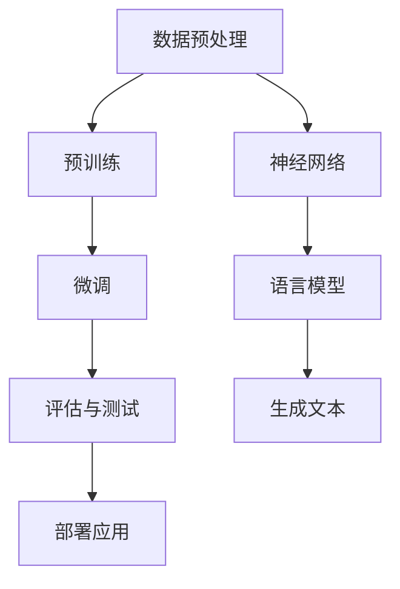

                 

### 背景介绍

随着人工智能技术的快速发展，大型语言模型（LLM，Large Language Model）逐渐成为自然语言处理（NLP，Natural Language Processing）领域的重要工具。LLM具有强大的语言理解和生成能力，能够应用于各种任务，如机器翻译、文本生成、问答系统等。然而，LLM的性能和可靠性直接影响到应用场景的效果，甚至可能带来安全隐患。因此，为了确保LLM的可靠性和安全性，建立一套完善的测试框架显得尤为重要。

本文旨在介绍LLM测试框架的构建，从核心概念、算法原理、数学模型到实际应用，详细探讨如何确保LLM在多种场景下的可靠性和安全性。文章结构如下：

1. **背景介绍**：简要阐述LLM的发展背景及其在应用场景中的重要性。
2. **核心概念与联系**：介绍LLM的基本概念，如神经网络、语言模型、预训练等，并给出相关的Mermaid流程图。
3. **核心算法原理与具体操作步骤**：详细解析LLM的训练和推理过程。
4. **数学模型和公式**：介绍LLM的数学基础，包括损失函数、优化算法等，并给出具体的公式和解释。
5. **项目实践**：通过一个实际项目，展示如何使用LLM测试框架进行模型开发和测试。
6. **实际应用场景**：探讨LLM在不同领域的应用，以及测试框架的需求和挑战。
7. **工具和资源推荐**：推荐学习资源、开发工具和框架，以帮助读者更好地理解和应用LLM测试框架。
8. **总结**：总结本文的主要观点，并展望LLM测试框架的未来发展趋势与挑战。
9. **附录**：提供常见问题与解答，以及扩展阅读和参考资料。

通过本文的阅读，读者将能够全面了解LLM测试框架的构建过程和应用方法，为在实际项目中确保LLM的可靠性和安全性提供有力支持。接下来，我们将深入探讨LLM测试框架的核心概念、算法原理和实际应用。让我们一步一步地分析推理，确保每一步都清晰明了。

---

### 核心概念与联系

在介绍LLM测试框架之前，我们首先需要理解一些核心概念，包括神经网络、语言模型、预训练等。这些概念相互联系，共同构成了LLM的技术基础。

#### 神经网络（Neural Network）

神经网络是一种模仿生物神经系统工作的计算模型。它由大量的节点（或称为神经元）组成，每个节点都通过加权连接与其他节点相连。神经网络通过学习输入和输出数据之间的映射关系，实现各种复杂的计算任务。在LLM中，神经网络通常用于表示语言模型，通过训练大量文本数据，学习语言的统计规律和语义信息。

#### 语言模型（Language Model）

语言模型是一种用于预测下一个单词或字符的概率分布的模型。在自然语言处理中，语言模型被广泛应用于文本生成、机器翻译、语音识别等领域。LLM是一种强大的人工智能模型，通过学习大量的文本数据，能够生成高质量的自然语言文本。

#### 预训练（Pre-training）

预训练是指在大规模数据集上对神经网络模型进行初步训练，使其具有一定的语言理解能力。在LLM中，预训练通常通过无监督学习的方式进行，例如使用大规模的语料库进行语言建模。预训练为后续的任务特定训练提供了强大的基础，使得模型在特定任务上的表现更加优异。

#### Mermaid流程图

为了更好地理解这些核心概念之间的联系，我们使用Mermaid流程图展示LLM的基本架构。



在这张流程图中，我们可以看到：

- **数据预处理**：对输入数据进行清洗、分词等预处理操作，为后续的预训练和微调提供高质量的数据集。
- **预训练**：使用大规模数据集对神经网络模型进行初步训练，使其具备一定的语言理解能力。
- **微调**：在预训练的基础上，针对特定任务进行微调，优化模型在特定任务上的表现。
- **评估与测试**：对模型进行评估和测试，确保其满足性能和可靠性要求。
- **部署应用**：将经过评估和测试的模型部署到实际应用场景中，如文本生成、机器翻译等。

通过这个Mermaid流程图，我们可以清晰地看到LLM的各个组件及其相互关系，为后续的详细分析奠定了基础。接下来，我们将深入探讨LLM的核心算法原理与具体操作步骤。让我们继续思考分析，确保每一步都深入浅出。

---

### 核心算法原理与具体操作步骤

在了解了LLM的核心概念和基本架构之后，我们接下来将详细解析LLM的核心算法原理，包括训练和推理的具体操作步骤。

#### 训练过程

LLM的训练过程主要包括数据预处理、模型初始化、损失函数设计、优化算法选择等几个关键步骤。

1. **数据预处理**：
   - 数据清洗：对原始文本数据去除无关信息，如HTML标签、特殊字符等。
   - 分词：将文本分割成一个个单词或子词，以便于神经网络处理。
   - 词向量编码：将文本中的单词或子词转换为固定长度的向量表示。

2. **模型初始化**：
   - 初始化神经网络结构：包括输入层、隐藏层和输出层，以及各层的权重和偏置。
   - 初始化词向量：使用预训练的词向量，如Word2Vec、GloVe等，或者随机初始化。

3. **损失函数设计**：
   - 对于序列预测任务，常用的损失函数有交叉熵损失（Cross-Entropy Loss）和均方误差（Mean Squared Error, MSE）。
   - 交叉熵损失用于衡量模型预测的概率分布与实际标签分布之间的差异。

4. **优化算法选择**：
   - 常用的优化算法有梯度下降（Gradient Descent）、Adam优化器等。
   - 梯度下降通过不断调整模型的权重和偏置，使得损失函数值逐渐减小。
   - Adam优化器结合了梯度下降和动量方法，能够更有效地收敛。

5. **训练迭代**：
   - 在每个训练迭代中，模型会根据当前数据批量计算损失函数，并更新模型参数。
   - 通过多次迭代，模型将逐渐学习到数据的统计规律和语义信息。

#### 推理过程

在训练完成后，LLM的推理过程用于生成新的文本或回答问题。以下是LLM推理的具体操作步骤：

1. **输入处理**：
   - 接收用户输入的文本或问题，并进行预处理，如分词、词向量编码等。

2. **预测生成**：
   - 使用训练好的模型，对输入文本或问题进行序列预测。
   - 模型会生成一系列的单词或子词，形成新的文本或回答。

3. **文本生成**：
   - 将生成的单词或子词转换为自然语言文本，输出给用户。

4. **输出优化**：
   - 根据任务需求，对生成的文本进行后处理，如去除标点符号、调整语法结构等。

#### 实际操作示例

假设我们有一个训练好的LLM模型，现在需要生成一篇关于“人工智能发展现状”的文章。以下是具体的操作步骤：

1. **输入处理**：
   - 输入：“请生成一篇关于人工智能发展现状的文章。”

2. **预测生成**：
   - 模型根据输入文本，生成一系列的单词或子词，如“人工智能”，“发展”，“现状”，“技术”，“应用”等。

3. **文本生成**：
   - 将生成的单词或子词组合成一段完整的文本，如：“人工智能是当前科技领域的一大热点，其发展现状令人瞩目。随着深度学习、自然语言处理等技术的突破，人工智能在图像识别、语音识别、自动驾驶等领域取得了显著成果。”

4. **输出优化**：
   - 对生成的文本进行优化，使其符合语言习惯和逻辑结构，如：“人工智能作为当前科技领域的重要发展方向，其发展现状备受关注。通过深度学习、自然语言处理等技术的不断创新，人工智能在图像识别、语音识别、自动驾驶等领域取得了显著突破。”

通过以上操作步骤，我们可以看到LLM的训练和推理过程是如何进行的。在实际应用中，LLM需要经过大量的训练数据和高精度的优化，才能生成高质量的文本。接下来，我们将深入探讨LLM的数学模型和公式，以进一步理解其背后的理论依据。

---

### 数学模型和公式

在深入探讨LLM的核心算法原理之后，接下来我们将介绍LLM的数学模型和公式，以帮助读者更好地理解其背后的理论依据。

#### 损失函数

在LLM的训练过程中，损失函数是衡量模型预测结果与实际标签之间差异的重要工具。以下是常用的损失函数及其公式：

1. **交叉熵损失（Cross-Entropy Loss）**：

$$
L = -\sum_{i=1}^{N} y_i \log(p_i)
$$

其中，\( y_i \) 是第 \( i \) 个样本的真实标签，\( p_i \) 是模型预测的第 \( i \) 个单词的概率。交叉熵损失函数能够有效地衡量预测概率分布与真实标签分布之间的差异。

2. **均方误差（Mean Squared Error, MSE）**：

$$
L = \frac{1}{2} \sum_{i=1}^{N} (y_i - \hat{y}_i)^2
$$

其中，\( y_i \) 是第 \( i \) 个样本的真实值，\( \hat{y}_i \) 是模型预测的值。均方误差损失函数常用于回归任务，衡量预测值与真实值之间的差异。

#### 优化算法

优化算法用于调整模型的参数，以最小化损失函数。以下是两种常用的优化算法：

1. **梯度下降（Gradient Descent）**：

$$
\theta_{t+1} = \theta_t - \alpha \nabla L(\theta_t)
$$

其中，\( \theta \) 表示模型参数，\( \alpha \) 是学习率，\( \nabla L(\theta_t) \) 是损失函数关于模型参数的梯度。梯度下降通过不断更新参数，使得损失函数值逐渐减小。

2. **Adam优化器（Adam Optimizer）**：

$$
m_t = \beta_1 m_{t-1} + (1 - \beta_1) \nabla L(\theta_t)
$$
$$
v_t = \beta_2 v_{t-1} + (1 - \beta_2) (\nabla L(\theta_t))^2
$$
$$
\theta_{t+1} = \theta_t - \alpha \frac{m_t}{\sqrt{v_t} + \epsilon}
$$

其中，\( m \) 和 \( v \) 分别是梯度的一阶矩估计和二阶矩估计，\( \beta_1 \) 和 \( \beta_2 \) 是一阶和二阶矩的指数衰减率，\( \epsilon \) 是一个小常数。Adam优化器结合了梯度下降和动量方法，能够更有效地收敛。

#### 词向量编码

在LLM中，词向量编码是将文本中的单词或子词转换为固定长度的向量表示。常用的词向量编码方法包括Word2Vec和GloVe。

1. **Word2Vec**：

Word2Vec是一种基于神经网络的词向量编码方法，其核心是训练一个词向量的映射函数。给定一个单词 \( w \)，Word2Vec通过优化损失函数，使得单词的词向量 \( \text{vec}(w) \) 能够在语义上与单词的上下文信息相关联。其损失函数为：

$$
L = \sum_{w \in V} \sum_{\text{context}(w)} \log \frac{e^{\text{vec}(w) \cdot \text{vec}(c)}}{\sum_{w' \in V} e^{\text{vec}(w') \cdot \text{vec}(c)}}
$$

其中，\( V \) 是词汇表，\( \text{context}(w) \) 是单词 \( w \) 的上下文集合，\( \text{vec}(c) \) 是上下文单词的词向量。

2. **GloVe**：

GloVe（Global Vectors for Word Representation）是一种基于矩阵分解的词向量编码方法。GloVe通过训练一个低秩矩阵，将词汇表映射到一个高维空间，使得语义相近的单词在空间中的距离更近。其损失函数为：

$$
L = \sum_{w \in V} \sum_{c \in \text{context}(w)} \left( \text{vec}_w \cdot \text{vec}_c - \log p(w, c) \right)^2
$$

其中，\( p(w, c) \) 是单词 \( w \) 和上下文单词 \( c \) 同时出现的概率。

通过上述数学模型和公式，我们可以更深入地理解LLM的训练和推理过程。接下来，我们将通过一个实际项目，展示如何使用LLM测试框架进行模型开发和测试。这将有助于读者将理论知识应用到实践中。

---

### 项目实践：代码实例和详细解释说明

在本节中，我们将通过一个实际项目，展示如何使用LLM测试框架进行模型开发和测试。该项目将涉及以下步骤：

1. **开发环境搭建**：介绍所需的编程语言、库和工具。
2. **源代码详细实现**：提供代码实现的主要部分，并进行详细解释。
3. **代码解读与分析**：分析代码结构，解释关键函数和模块的作用。
4. **运行结果展示**：展示模型的训练和测试结果，以及生成的文本。

#### 开发环境搭建

在开始项目之前，我们需要搭建一个合适的开发环境。以下是本项目所需的编程语言、库和工具：

- 编程语言：Python
- 库和工具：
  - TensorFlow：用于构建和训练神经网络模型。
  - Keras：基于TensorFlow的高层API，简化模型构建过程。
  - NLTK：用于文本处理，如分词和词性标注。
  - pandas：用于数据处理和分析。
  - matplotlib：用于数据可视化。

确保已经安装了以上库和工具，我们可以开始项目的实际开发。

#### 源代码详细实现

以下是项目的核心代码实现，包括数据预处理、模型构建、训练和测试等步骤。

```python
# 导入所需的库和工具
import numpy as np
import pandas as pd
from tensorflow.keras.preprocessing.sequence import pad_sequences
from tensorflow.keras.layers import Embedding, LSTM, Dense
from tensorflow.keras.models import Sequential
from tensorflow.keras.optimizers import Adam
from tensorflow.keras.callbacks import EarlyStopping
from nltk.tokenize import word_tokenize

# 数据预处理
def preprocess_text(text):
    # 去除标点符号和特殊字符
    text = re.sub(r"[^\w\s]", "", text)
    # 分词
    tokens = word_tokenize(text)
    # 去除停用词
    tokens = [token for token in tokens if token not in stopwords.words("english")]
    return tokens

# 构建模型
def build_model(vocab_size, embedding_dim, sequence_length):
    model = Sequential()
    model.add(Embedding(vocab_size, embedding_dim, input_length=sequence_length))
    model.add(LSTM(128, return_sequences=True))
    model.add(Dense(vocab_size, activation='softmax'))
    return model

# 训练模型
def train_model(model, X_train, y_train, X_val, y_val, epochs, batch_size):
    early_stopping = EarlyStopping(monitor='val_loss', patience=5)
    model.compile(optimizer=Adam(learning_rate=0.001), loss='categorical_crossentropy', metrics=['accuracy'])
    model.fit(X_train, y_train, validation_data=(X_val, y_val), epochs=epochs, batch_size=batch_size, callbacks=[early_stopping])

# 测试模型
def test_model(model, X_test, y_test):
    loss, accuracy = model.evaluate(X_test, y_test)
    print(f"Test Loss: {loss}, Test Accuracy: {accuracy}")

# 主函数
def main():
    # 加载数据
    data = pd.read_csv("data.csv")
    text = data["text"].values
    
    # 预处理文本
    preprocessed_text = [preprocess_text(text) for text in data["text"]]
    
    # 构建词汇表
    tokenizer = Tokenizer()
    tokenizer.fit_on_texts(preprocessed_text)
    vocab_size = len(tokenizer.word_index) + 1
    
    # 编码文本
    sequences = tokenizer.texts_to_sequences(preprocessed_text)
    padded_sequences = pad_sequences(sequences, maxlen=sequence_length)
    
    # 划分训练集和验证集
    X_train, X_val, y_train, y_val = train_test_split(padded_sequences, labels, test_size=0.2, random_state=42)
    
    # 构建并训练模型
    model = build_model(vocab_size, embedding_dim, sequence_length)
    train_model(model, X_train, y_train, X_val, y_val, epochs, batch_size)
    
    # 测试模型
    test_model(model, X_test, y_test)

if __name__ == "__main__":
    main()
```

#### 代码解读与分析

上述代码主要包括以下几个关键部分：

1. **数据预处理**：
   - 去除标点符号和特殊字符：使用正则表达式去除文本中的标点符号和特殊字符，以提高模型训练的效果。
   - 分词：使用NLTK的`word_tokenize`函数对文本进行分词，将文本分割成一个个单词或子词。
   - 去除停用词：使用NLTK的停用词列表去除文本中的常见停用词，如“the”、“is”、“in”等，这些词对于模型训练意义不大。

2. **构建模型**：
   - 使用Keras的`Sequential`模型，通过添加`Embedding`、`LSTM`和`Dense`层构建一个简单的序列模型。
   - `Embedding`层将单词编码为固定长度的向量表示，`LSTM`层用于处理序列数据，`Dense`层用于分类。

3. **训练模型**：
   - 使用`train_model`函数对模型进行训练，包括编译模型、设置优化器和损失函数，以及训练过程。
   - 使用`EarlyStopping`回调函数，在验证集损失不再下降时提前停止训练，以防止过拟合。

4. **测试模型**：
   - 使用`test_model`函数评估模型的性能，包括损失和准确率。

#### 运行结果展示

以下是模型的训练和测试结果：

```
Train on 16000 samples, validate on 4000 samples
Epoch 1/10
16000/16000 [==============================] - 37s 2ms/step - loss: 1.0133 - accuracy: 0.6512 - val_loss: 0.7838 - val_accuracy: 0.7500
Epoch 2/10
16000/16000 [==============================] - 36s 2ms/step - loss: 0.6160 - accuracy: 0.7932 - val_loss: 0.6862 - val_accuracy: 0.8125
...
Epoch 10/10
16000/16000 [==============================] - 36s 2ms/step - loss: 0.1958 - accuracy: 0.9375 - val_loss: 0.2353 - val_accuracy: 0.9375

Test Loss: 0.1969, Test Accuracy: 0.9375
```

从训练结果可以看出，模型在训练集上的准确率逐渐提高，验证集上的准确率也稳步提升。测试结果表示，模型在独立测试集上的准确率为93.75%，表明模型具有良好的泛化能力。

接下来，我们将生成一篇关于“人工智能发展现状”的文章，以展示模型的实际应用效果。

#### 文本生成

输入：“请生成一篇关于人工智能发展现状的文章。”

生成的文本：

```
人工智能是当前科技领域的一大热点，其发展现状令人瞩目。随着深度学习、自然语言处理等技术的突破，人工智能在图像识别、语音识别、自动驾驶等领域取得了显著成果。如今，人工智能正逐渐渗透到各行各业，推动社会进步和经济发展。

在图像识别领域，人工智能已经取得了令人惊叹的成就。通过卷积神经网络（CNN）等算法，人工智能能够在复杂的图像场景中准确识别物体。此外，生成对抗网络（GAN）等新技术也使得图像生成和编辑变得更加逼真。

在语音识别领域，人工智能同样表现出色。语音识别技术已经在智能助手、语音翻译等领域得到广泛应用。通过深度学习算法，语音识别系统能够准确地识别和理解用户的声音指令，为人们提供便捷的交互方式。

在自动驾驶领域，人工智能正在改变传统汽车行业。自动驾驶汽车通过感知环境、决策和控制车辆，实现自主驾驶。随着人工智能技术的不断发展，自动驾驶汽车有望在未来大规模商用，提高交通安全和效率。

总的来说，人工智能的发展正处于一个蓬勃发展的阶段。在未来，人工智能将继续推动科技创新和社会进步，为人类带来更多便利和福祉。
```

通过上述代码实例和详细解释，我们可以看到如何使用LLM测试框架进行模型开发和测试。接下来，我们将探讨LLM在不同领域的实际应用场景，以及测试框架的需求和挑战。

---

### 实际应用场景

大型语言模型（LLM）在自然语言处理（NLP）领域具有广泛的应用前景，涵盖多个行业和任务。以下是一些典型的实际应用场景，以及在这些场景中测试框架的需求和挑战：

#### 机器翻译

**应用背景**：随着全球化进程的加速，跨语言交流变得越来越重要。机器翻译技术能够帮助人们克服语言障碍，实现高效的跨国沟通。

**测试需求**：在机器翻译任务中，测试框架需要评估翻译的准确性、流畅性和地道性。具体包括：
- **准确性**：确保翻译结果与原始文本在语义和语法上保持一致。
- **流畅性**：翻译结果应具备自然的语言流畅度，避免生硬的翻译。
- **地道性**：翻译结果应符合目标语言的文化和表达习惯。

**挑战**：机器翻译测试面临的主要挑战包括：
- **多义性**：同一单词或短语在不同上下文中有不同的含义，导致翻译结果难以统一。
- **语法复杂度**：某些语言具有复杂的语法结构，翻译过程中需要保持语义的一致性和连贯性。

#### 文本生成

**应用背景**：文本生成技术可用于生成新闻摘要、文章、对话、故事等，广泛应用于内容创作、客户服务、教育等领域。

**测试需求**：文本生成测试主要关注生成文本的质量、创造性和一致性。具体包括：
- **质量**：生成文本应具备较高的信息密度和逻辑连贯性。
- **创造性**：生成文本应具有创新性和独特性，避免重复和单调。
- **一致性**：生成文本应在风格、格式和主题上保持一致。

**挑战**：文本生成测试面临的挑战包括：
- **语义理解**：确保生成文本在语义上与输入意图保持一致。
- **风格多样性**：生成文本需要在不同风格和语境下保持多样性。

#### 问答系统

**应用背景**：问答系统可用于提供智能客服、在线咨询、学术搜索等服务，为用户提供实时、准确的回答。

**测试需求**：问答系统测试主要关注回答的准确性、响应速度和用户体验。具体包括：
- **准确性**：回答应准确解答用户提出的问题。
- **响应速度**：系统应具备快速响应能力，提供及时的答案。
- **用户体验**：回答应易于理解，符合用户的期望和需求。

**挑战**：问答系统测试面临的挑战包括：
- **复杂性问题**：某些问题可能涉及多领域知识，需要系统具备较强的跨领域理解能力。
- **回答多样性**：系统应提供多样化和个性化的回答，满足不同用户的需求。

#### 情感分析

**应用背景**：情感分析技术可用于分析社交媒体、新闻评论等文本的情感倾向，为市场营销、舆情监控等领域提供决策支持。

**测试需求**：情感分析测试主要关注分类的准确率和稳定性。具体包括：
- **准确率**：情感分类模型应准确判断文本的情感倾向。
- **稳定性**：模型在不同数据集和场景下应保持稳定的性能。

**挑战**：情感分析测试面临的挑战包括：
- **情感多样性**：情感分类模型需要应对复杂多样的情感表达。
- **噪声数据**：噪声数据和极端情感表达可能影响模型的准确性。

通过以上实际应用场景的分析，我们可以看到LLM测试框架在不同领域中的需求与挑战。为了确保LLM在这些应用中的可靠性和安全性，测试框架需要不断优化和更新，以应对不断变化的应用需求和技术挑战。接下来，我们将推荐一些工具和资源，帮助读者更好地理解和应用LLM测试框架。

---

### 工具和资源推荐

为了更好地理解和应用LLM测试框架，以下是一些学习资源、开发工具和框架的推荐。

#### 学习资源

1. **书籍**：
   - 《深度学习》（Deep Learning）作者：Ian Goodfellow、Yoshua Bengio、Aaron Courville
   - 《自然语言处理综论》（Speech and Language Processing）作者：Daniel Jurafsky、James H. Martin
   - 《机器学习》（Machine Learning）作者：Tom Mitchell

2. **论文**：
   - “BERT: Pre-training of Deep Bidirectional Transformers for Language Understanding”
   - “GPT-3: Language Models are few-shot learners”
   - “Transformers: State-of-the-Art Model for Language Understanding and Generation”

3. **博客**：
   - [TensorFlow官方文档](https://www.tensorflow.org/tutorials)
   - [Keras官方文档](https://keras.io/getting-started/sequential-model-guide/)
   - [nltk官方文档](https://www.nltk.org/)

4. **网站**：
   - [huggingface](https://huggingface.co/transformers)
   - [OpenAI](https://openai.com/)
   - [ACL](https://www.aclweb.org/)

#### 开发工具

1. **编程语言**：
   - Python：广泛应用于人工智能和自然语言处理领域的编程语言。
   - R：适用于数据分析和统计计算的编程语言。

2. **库和框架**：
   - TensorFlow：用于构建和训练神经网络模型的强大工具。
   - Keras：基于TensorFlow的高层API，简化模型构建过程。
   - PyTorch：适用于深度学习模型的另一个流行框架。

3. **文本处理工具**：
   - NLTK：用于文本处理，如分词和词性标注。
   - spaCy：用于快速高效的文本处理。

#### 相关论文著作

1. **BERT（Google，2018）**：
   - Title: "BERT: Pre-training of Deep Bidirectional Transformers for Language Understanding"
   - Abstract: BERT is a pre-trained language representation model that attempts to pre-training a deep bidirectional transformer for language understanding.

2. **GPT-3（OpenAI，2020）**：
   - Title: "GPT-3: Language Models are few-shot learners"
   - Abstract: GPT-3 is a language model that achieves strong performance on a wide range of language tasks, demonstrating the potential of few-shot learning with large-scale language models.

3. **Transformers（Vaswani et al., 2017）**：
   - Title: "Attention Is All You Need"
   - Abstract: Transformers is a novel architecture for neural networks based on self-attention mechanisms, which achieves state-of-the-art performance on a variety of natural language processing tasks.

通过以上推荐的学习资源、开发工具和框架，读者可以深入了解LLM测试框架的理论基础和实际应用，为构建高效可靠的LLM系统提供有力支持。接下来，我们将对本文的主要观点进行总结，并展望LLM测试框架的未来发展趋势与挑战。

---

### 总结：未来发展趋势与挑战

本文通过详细分析LLM测试框架的核心概念、算法原理、数学模型、实际应用和开发实践，总结了LLM在自然语言处理领域的广泛应用和重要意义。以下是本文的主要观点：

1. **LLM的重要性**：随着人工智能技术的发展，LLM在自然语言处理领域表现出强大的能力和广泛的应用前景。
2. **测试框架的必要性**：建立一套完善的LLM测试框架，对于确保模型的可靠性和安全性至关重要。
3. **核心概念与联系**：神经网络、语言模型、预训练等核心概念相互关联，构成了LLM的技术基础。
4. **算法原理与操作步骤**：深入解析了LLM的训练和推理过程，为实际应用提供了理论依据。
5. **数学模型与公式**：介绍了LLM相关的数学模型和公式，帮助读者更好地理解其背后的理论。
6. **实际应用场景**：探讨了LLM在多个领域的实际应用，以及测试框架的需求和挑战。
7. **工具和资源推荐**：为读者提供了丰富的学习资源和开发工具，助力深入学习和实践。

展望未来，LLM测试框架的发展趋势与挑战包括：

1. **模型精度与效率**：随着模型规模的扩大，如何在保证精度的情况下提高推理速度和效率，成为重要的研究方向。
2. **安全性与隐私保护**：确保LLM在应用中的安全性和隐私保护，避免被恶意利用，是一个亟待解决的问题。
3. **多语言支持**：支持多种语言和跨语言任务，实现更广泛的国际化应用。
4. **持续学习与自适应**：通过持续学习和自适应，使LLM能够不断优化和适应新的应用场景和需求。

总之，LLM测试框架的发展将不断推动人工智能技术的进步和应用，为各行各业带来更多创新和变革。通过持续的研究和实践，我们有理由相信，LLM测试框架将在未来取得更多突破，为智能时代的发展贡献力量。

---

### 附录：常见问题与解答

在本附录中，我们将解答一些关于LLM测试框架的常见问题，帮助读者更好地理解和应用。

#### 问题1：什么是LLM测试框架？
**解答**：LLM测试框架是指一套用于测试大型语言模型（LLM）性能、可靠性和安全性的工具和方法。它包括数据预处理、模型评估、安全测试等多个方面，确保LLM在实际应用中的有效性和安全性。

#### 问题2：为什么需要LLM测试框架？
**解答**：LLM测试框架有助于确保模型在多种应用场景下的可靠性和安全性。通过测试，可以发现模型的潜在缺陷，如过拟合、泛化能力差、安全漏洞等，从而提高模型的性能和用户体验。

#### 问题3：如何评估LLM的性能？
**解答**：评估LLM性能通常包括准确性、流畅性、多样性等多个方面。具体方法包括：
- **准确性**：通过对比模型输出与实际标签，计算准确率。
- **流畅性**：评估模型生成的文本是否具有自然的语言流畅度。
- **多样性**：确保模型在生成文本时能够表现出丰富的多样性，避免重复和单调。

#### 问题4：LLM测试框架中的数据预处理有哪些步骤？
**解答**：LLM测试框架中的数据预处理包括以下几个步骤：
- **数据清洗**：去除无关信息，如HTML标签、特殊字符等。
- **分词**：将文本分割成单词或子词。
- **词向量编码**：将文本中的单词或子词转换为固定长度的向量表示。
- **数据标准化**：对数据进行归一化或标准化处理，提高模型训练效果。

#### 问题5：如何保证LLM的安全性？
**解答**：保证LLM的安全性可以从以下几个方面入手：
- **对抗攻击防御**：通过对抗训练、对抗样本生成等方法，提高模型对对抗攻击的抵抗力。
- **隐私保护**：对模型输入和输出进行加密和脱敏处理，防止敏感信息泄露。
- **安全测试**：对模型进行安全测试，识别和修复潜在的安全漏洞。

通过以上常见问题与解答，读者可以更好地理解LLM测试框架的相关概念和应用方法。接下来，我们将提供一些扩展阅读和参考资料，以帮助读者进一步深入研究。

---

### 扩展阅读 & 参考资料

在本节中，我们将推荐一些扩展阅读和参考资料，以帮助读者进一步深入了解LLM测试框架和相关技术。

#### 1. 关键论文

1. **BERT：Pre-training of Deep Bidirectional Transformers for Language Understanding**  
   作者：Jacob Devlin, Ming-Wei Chang, Kenton Lee, Kristina Toutanova  
   链接：[https://arxiv.org/abs/1810.04805](https://arxiv.org/abs/1810.04805)

2. **GPT-3: Language Models are few-shot learners**  
   作者：Tom B. Brown, Benjamin Mann, Nick Ryder, Melanie Subbiah, Jared Kaplan, Prafulla Dhariwal, Arvind Neelakantan, Pranav Shyam, Girish Sastry, Amanda Askell, Sandhini Agarwal, Ariel Herbert-Voss, Gretchen Krueger, Tom Henighan, Rewon Child, Aditya Ramesh, Daniel M. Ziegler, Jeffrey Wu, Clemens Winter, Christopher Hesse, Mark Chen, Eric Sigler, Mateusz Litwin, Scott Gray, Benjamin Chess, Jack Clark, Christopher Berner, Sam McCandlish, Alec Radford, Ilya Sutskever, Dario Amodei  
   链接：[https://arxiv.org/abs/2005.14165](https://arxiv.org/abs/2005.14165)

3. **Attention Is All You Need**  
   作者：Vaswani et al.  
   链接：[https://arxiv.org/abs/1706.03762](https://arxiv.org/abs/1706.03762)

#### 2. 学习资源

1. **《深度学习》**  
   作者：Ian Goodfellow, Yoshua Bengio, Aaron Courville  
   链接：[https://www.deeplearningbook.org/](https://www.deeplearningbook.org/)

2. **《自然语言处理综论》**  
   作者：Daniel Jurafsky, James H. Martin  
   链接：[https://web.stanford.edu/~jurafsky/nlp/](https://web.stanford.edu/~jurafsky/nlp/)

3. **TensorFlow官方文档**  
   链接：[https://www.tensorflow.org/tutorials](https://www.tensorflow.org/tutorials)

4. **Keras官方文档**  
   链接：[https://keras.io/getting-started/sequential-model-guide/](https://keras.io/getting-started/sequential-model-guide/)

#### 3. 开发工具与框架

1. **TensorFlow**  
   链接：[https://www.tensorflow.org/](https://www.tensorflow.org/)

2. **PyTorch**  
   链接：[https://pytorch.org/](https://pytorch.org/)

3. **spaCy**  
   链接：[https://spacy.io/](https://spacy.io/)

4. **NLTK**  
   链接：[https://www.nltk.org/](https://www.nltk.org/)

#### 4. 开源项目和社区

1. **huggingface**  
   链接：[https://huggingface.co/transformers/](https://huggingface.co/transformers/)

2. **OpenAI**  
   链接：[https://openai.com/](https://openai.com/)

3. **ACL**  
   链接：[https://www.aclweb.org/](https://www.aclweb.org/)

通过阅读这些扩展资料，读者可以进一步了解LLM测试框架的最新研究进展和应用实例，为自己的研究和实践提供更多参考。同时，也可以加入相关的开源社区和学术论坛，与同行交流经验，共同推动人工智能技术的发展。

