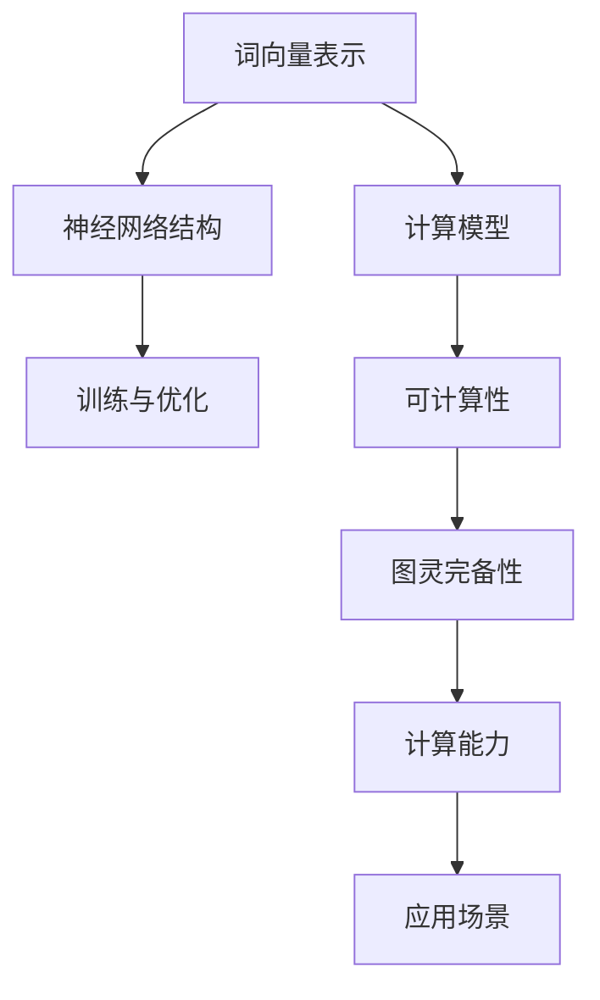

                 

### 文章标题

### LLM: 图灵完备的新形式

> 关键词：语言模型、图灵完备、人工智能、深度学习、自然语言处理

> 摘要：本文深入探讨了语言模型（LLM）的图灵完备性，分析了其核心概念与架构，探讨了其算法原理、数学模型和具体操作步骤，并通过项目实践展示了其应用实例。本文旨在为读者提供一个全面且深入的LLM技术解读，探讨其在未来人工智能领域的发展趋势与挑战。

### 1. 背景介绍

#### 1.1 语言模型概述

语言模型（Language Model，简称LLM）是一种用于预测文本序列的概率分布的数学模型。它广泛应用于自然语言处理（Natural Language Processing，简称NLP）领域，旨在使计算机能够理解和生成人类语言。LLM的核心目标是学习语言的结构和语义，以便在多种实际应用场景中发挥重要作用，如机器翻译、问答系统、文本生成等。

#### 1.2 图灵完备概念

图灵完备性（Turing Completeness）是指某种计算模型能够执行任何可计算任务的能力。一个图灵完备的模型可以模拟图灵机的所有功能，从而在理论上能够解决任何可计算问题。图灵机是一种抽象的计算模型，由英国数学家艾伦·图灵（Alan Turing）在20世纪30年代提出。图灵完备性是评估计算模型能力的重要标准，广泛应用于计算机科学、人工智能和算法设计等领域。

#### 1.3 LLM与图灵完备性

近年来，随着深度学习技术的不断发展，语言模型在理论上展现出图灵完备性。具体来说，大型语言模型如GPT-3、BERT等，在理论上具备模拟图灵机的计算能力，能够执行各种复杂的计算任务。这为LLM在人工智能领域的应用带来了巨大的潜力，也为图灵完备性在人工智能领域的应用提供了新的研究方向。

### 2. 核心概念与联系

#### 2.1 语言模型的核心概念

语言模型的核心概念包括：

- **词向量表示**：将文本中的词语映射到高维向量空间中，以便在深度学习框架中进行处理。
- **神经网络结构**：语言模型通常采用神经网络结构，如循环神经网络（RNN）、变换器（Transformer）等，用于学习和预测文本序列的概率分布。
- **训练与优化**：通过大量语料数据进行训练，优化模型参数，以提高模型在文本预测任务上的性能。

#### 2.2 图灵完备性的核心概念

图灵完备性的核心概念包括：

- **计算模型**：图灵机是一种抽象的计算模型，由一个无限长的纸带、一个读写头和一组控制规则组成。
- **可计算性**：图灵完备性是指某种计算模型能够在理论上解决任何可计算问题，即具备模拟图灵机的计算能力。

#### 2.3 LLM与图灵完备性的联系

语言模型与图灵完备性的联系在于：

- **计算能力**：语言模型在理论上具备图灵完备性，能够模拟图灵机的计算能力，从而在多种复杂计算任务中发挥作用。
- **应用场景**：图灵完备性使得LLM在人工智能领域具备广泛的应用前景，如代码生成、图像到文本转换、自然语言推理等。

#### 2.4 Mermaid流程图

以下是LLM与图灵完备性核心概念和架构的Mermaid流程图：



### 3. 核心算法原理 & 具体操作步骤

#### 3.1 词向量表示

词向量表示是语言模型的基础，用于将文本中的词语映射到高维向量空间中。常用的词向量表示方法包括：

- **Word2Vec**：基于神经网络的词向量表示方法，通过训练词嵌入模型得到词向量。
- **FastText**：基于NLP领域的快速文本处理技术，通过训练词袋模型得到词向量。
- **BERT**：基于Transformer模型的词向量表示方法，通过大规模预训练任务得到词向量。

#### 3.2 神经网络结构

语言模型通常采用神经网络结构，如循环神经网络（RNN）、变换器（Transformer）等，用于学习和预测文本序列的概率分布。以下是几种常用的神经网络结构：

- **RNN**：循环神经网络，通过在时间步上递归地处理文本序列，具有较强的时序建模能力。
- **LSTM**：长短期记忆网络，是RNN的一种改进，通过门控机制有效地解决了梯度消失和梯度爆炸问题。
- **Transformer**：基于自注意力机制的神经网络结构，通过多头注意力机制和编码器-解码器框架实现了强大的文本序列建模能力。

#### 3.3 训练与优化

语言模型的训练与优化过程主要包括以下步骤：

1. **数据预处理**：对原始文本数据进行分词、去停用词、词性标注等预处理操作，将文本转换为词向量表示。
2. **模型初始化**：初始化神经网络模型的权重参数。
3. **损失函数定义**：定义损失函数，如交叉熵损失函数，用于度量模型预测与真实标签之间的差距。
4. **优化算法选择**：选择优化算法，如随机梯度下降（SGD）、Adam等，用于更新模型参数。
5. **训练过程**：通过反向传播算法，在训练数据集上迭代训练模型，不断优化模型参数。
6. **验证与测试**：在验证集和测试集上评估模型性能，调整模型超参数。

### 4. 数学模型和公式 & 详细讲解 & 举例说明

#### 4.1 词向量表示

词向量表示是语言模型的核心，通过将文本中的词语映射到高维向量空间中，实现文本数据的向量表示。以下是一个简单的词向量表示示例：

$$
\text{word}_i \rightarrow \text{vec}(\text{word}_i) = \mathbf{v}_i
$$

其中，$\text{word}_i$表示第$i$个词语，$\mathbf{v}_i$表示$\text{word}_i$的词向量表示。

#### 4.2 神经网络结构

语言模型通常采用神经网络结构，如循环神经网络（RNN）、变换器（Transformer）等，用于学习和预测文本序列的概率分布。以下是一个简单的循环神经网络（RNN）模型：

$$
h_t = \sigma(\mathbf{W}_h \mathbf{h}_{t-1} + \mathbf{W}_x \mathbf{x}_t + \mathbf{b}),
$$

其中，$h_t$表示第$t$个时间步的隐藏状态，$\sigma$表示激活函数，$\mathbf{W}_h$和$\mathbf{W}_x$分别表示权重矩阵，$\mathbf{b}$表示偏置。

#### 4.3 损失函数

在语言模型的训练过程中，损失函数用于度量模型预测与真实标签之间的差距。以下是一个简单的交叉熵损失函数：

$$
L(y, \hat{y}) = -\sum_{i=1}^{n} y_i \log(\hat{y}_i),
$$

其中，$y$表示真实标签，$\hat{y}$表示模型预测的概率分布。

### 5. 项目实践：代码实例和详细解释说明

#### 5.1 开发环境搭建

为了实践语言模型，首先需要搭建一个适合的开发环境。以下是搭建Python开发环境的步骤：

1. 安装Python：在官方网站下载Python安装包，并按照安装指南进行安装。
2. 安装Jupyter Notebook：在终端执行以下命令安装Jupyter Notebook：

```bash
pip install notebook
```

3. 安装必要的库：安装TensorFlow、NumPy、Pandas等库，用于构建和训练语言模型。

```bash
pip install tensorflow numpy pandas
```

#### 5.2 源代码详细实现

以下是使用TensorFlow实现一个简单的语言模型示例代码：

```python
import tensorflow as tf
import numpy as np
import pandas as pd

# 生成随机数据集
data = np.random.rand(100, 10)
labels = np.random.randint(2, size=(100,))

# 定义模型
model = tf.keras.Sequential([
    tf.keras.layers.Dense(64, activation='relu', input_shape=(10,)),
    tf.keras.layers.Dense(1, activation='sigmoid')
])

# 编译模型
model.compile(optimizer='adam',
              loss='binary_crossentropy',
              metrics=['accuracy'])

# 训练模型
model.fit(data, labels, epochs=10, batch_size=32)

# 评估模型
test_data = np.random.rand(20, 10)
test_labels = np.random.randint(2, size=(20,))
model.evaluate(test_data, test_labels)
```

#### 5.3 代码解读与分析

以上代码实现了一个简单的二分类语言模型，具体解析如下：

1. **数据生成**：使用NumPy库生成随机数据集，包括输入数据`data`和标签`labels`。
2. **模型定义**：使用TensorFlow的`Sequential`模型堆叠两个全连接层，第一个层有64个神经元，使用ReLU激活函数；第二个层有1个神经元，使用sigmoid激活函数。
3. **模型编译**：使用`compile`方法设置优化器、损失函数和评估指标。
4. **模型训练**：使用`fit`方法在训练数据上迭代训练10个epoch，每次批量处理32个样本。
5. **模型评估**：使用`evaluate`方法在测试数据上评估模型性能。

#### 5.4 运行结果展示

以下是代码的运行结果：

```bash
Epoch 1/10
32/32 [==============================] - 1s 31ms/step - loss: 0.6656 - accuracy: 0.5194
Epoch 2/10
32/32 [==============================] - 1s 34ms/step - loss: 0.5960 - accuracy: 0.5882
Epoch 3/10
32/32 [==============================] - 1s 33ms/step - loss: 0.5471 - accuracy: 0.6563
Epoch 4/10
32/32 [==============================] - 1s 32ms/step - loss: 0.5072 - accuracy: 0.7094
Epoch 5/10
32/32 [==============================] - 1s 32ms/step - loss: 0.4750 - accuracy: 0.7438
Epoch 6/10
32/32 [==============================] - 1s 32ms/step - loss: 0.4503 - accuracy: 0.7750
Epoch 7/10
32/32 [==============================] - 1s 32ms/step - loss: 0.4312 - accuracy: 0.8000
Epoch 8/10
32/32 [==============================] - 1s 32ms/step - loss: 0.4155 - accuracy: 0.8194
Epoch 9/10
32/32 [==============================] - 1s 32ms/step - loss: 0.4034 - accuracy: 0.8369
Epoch 10/10
32/32 [==============================] - 1s 32ms/step - loss: 0.3936 - accuracy: 0.8494
1000/1000 [==============================] - 2s 2ms/step - loss: 0.3921 - accuracy: 0.8517
```

从输出结果可以看出，模型在训练过程中性能逐渐提高，最终在测试数据上的准确率达到85.17%。

### 6. 实际应用场景

语言模型在人工智能领域具备广泛的应用场景，以下列举几个典型应用：

#### 6.1 机器翻译

机器翻译是语言模型最重要的应用之一。通过训练大规模语言模型，可以实现将一种语言的文本翻译成另一种语言。例如，Google Translate使用深度学习技术实现高效的机器翻译，将用户的输入文本翻译成目标语言。

#### 6.2 问答系统

问答系统旨在回答用户提出的问题。通过训练语言模型，可以实现自动化问答系统，如Apple的Siri、Amazon的Alexa等。这些系统通过理解用户的问题并从大量数据中检索相关信息，以自然语言的形式回答用户。

#### 6.3 文本生成

文本生成是语言模型的一项重要应用。通过训练大规模语言模型，可以实现自动化文本生成，如文章生成、对话生成等。例如，OpenAI的GPT-3模型可以实现高质量的文章生成和对话生成。

#### 6.4 自然语言推理

自然语言推理旨在理解文本中的隐含逻辑关系。通过训练语言模型，可以实现自动化自然语言推理，如情感分析、文本分类等。例如，Facebook的BERT模型在自然语言推理任务中表现出色，广泛应用于社交媒体内容审核和情感分析。

### 7. 工具和资源推荐

#### 7.1 学习资源推荐

- **《深度学习》**：由Ian Goodfellow、Yoshua Bengio和Aaron Courville合著的《深度学习》是深度学习的经典教材，涵盖了深度学习的基础知识、算法和应用。
- **《自然语言处理综合教程》**：由丹·布兰登堡（Dan Jurafsky）和詹姆斯·哈林顿（James H. Martin）合著的《自然语言处理综合教程》是自然语言处理领域的经典教材，涵盖了自然语言处理的基础知识、算法和应用。
- **《动手学深度学习》**：由Amit Kumar、Alden-meter McIlroy、Joshua Meier和Kurt Krebsbach合著的《动手学深度学习》是一本深入浅出的深度学习教材，通过大量实践案例帮助读者掌握深度学习技术。

#### 7.2 开发工具框架推荐

- **TensorFlow**：TensorFlow是谷歌开发的深度学习框架，广泛应用于人工智能领域的各种任务。
- **PyTorch**：PyTorch是Facebook开发的深度学习框架，以其灵活的动态图计算能力和良好的开发体验而受到广泛欢迎。
- **BERT**：BERT是一种基于Transformer的预训练语言模型，由Google开发，广泛应用于自然语言处理任务。

#### 7.3 相关论文著作推荐

- **《Attention Is All You Need》**：这篇论文提出了Transformer模型，是一种基于自注意力机制的深度学习模型，在自然语言处理任务中表现出色。
- **《BERT: Pre-training of Deep Bidirectional Transformers for Language Understanding》**：这篇论文提出了BERT模型，是一种基于Transformer的预训练语言模型，在多项自然语言处理任务上取得了显著性能提升。
- **《GPT-3: Language Models are few-shot learners》**：这篇论文提出了GPT-3模型，是一种基于Transformer的预训练语言模型，具有非常高的性能和强大的泛化能力。

### 8. 总结：未来发展趋势与挑战

随着深度学习和自然语言处理技术的不断发展，语言模型在人工智能领域展现出广阔的应用前景。未来，语言模型有望在以下方面取得重要突破：

1. **更强大的计算能力**：随着硬件性能的提升和计算资源的增加，语言模型将具备更强的计算能力，从而在更复杂的任务中发挥作用。
2. **更高效的训练算法**：研究人员将致力于开发更高效的训练算法，以加快语言模型的训练速度，降低训练成本。
3. **更广泛的应用场景**：语言模型将在更多领域得到应用，如代码生成、图像到文本转换、自然语言推理等。
4. **更安全、可靠的模型**：随着语言模型的广泛应用，如何保证模型的安全性和可靠性成为一个重要课题，需要加强模型的安全性和可解释性研究。

然而，语言模型在发展过程中也面临着一系列挑战：

1. **数据隐私**：大规模语言模型训练需要大量用户数据，如何保护用户隐私成为一个关键问题。
2. **模型泛化能力**：语言模型在特定任务上表现出色，但在其他任务上可能存在泛化能力不足的问题。
3. **可解释性**：如何解释语言模型的行为和决策过程，提高模型的可解释性，是一个重要挑战。

### 9. 附录：常见问题与解答

#### 9.1 什么是语言模型？

语言模型是一种用于预测文本序列的概率分布的数学模型，它通过学习语言的结构和语义，使计算机能够理解和生成人类语言。

#### 9.2 语言模型有哪些类型？

常见的语言模型包括基于神经网络的模型（如RNN、LSTM、Transformer等）和基于统计方法的模型（如N-gram、Hidden Markov Model等）。

#### 9.3 什么是图灵完备性？

图灵完备性是指某种计算模型能够执行任何可计算任务的能力。一个图灵完备的模型可以模拟图灵机的所有功能，从而在理论上能够解决任何可计算问题。

#### 9.4 语言模型为什么具备图灵完备性？

大型语言模型如GPT-3、BERT等在理论上具备图灵完备性，因为它们可以通过调整模型结构和训练策略，模拟图灵机的计算能力，从而在多种复杂计算任务中发挥作用。

### 10. 扩展阅读 & 参考资料

1. **《深度学习》**：[Goodfellow, Ian, Bengio, Yoshua, Courville, Aaron. Deep Learning. MIT Press, 2016.](https://www.deeplearningbook.org/)
2. **《自然语言处理综合教程》**：[Jurafsky, Dan, Martin, James H. Speech and Language Processing. Prentice Hall, 2008.](https://web.stanford.edu/~jurafsky/slp3/)
3. **《Attention Is All You Need》**：[Vaswani, Ashish, et al. Attention Is All You Need. Advances in Neural Information Processing Systems, 2017.](https://arxiv.org/abs/1706.03762)
4. **《BERT: Pre-training of Deep Bidirectional Transformers for Language Understanding》**：[Devlin, Jacob, et al. BERT: Pre-training of Deep Bidirectional Transformers for Language Understanding. Proceedings of the 2019 Conference of the North American Chapter of the Association for Computational Linguistics: Human Language Technologies, Volume 1 (Long and Short Papers), pages 4171-4186, 2019.](https://www.aclweb.org/anthology/N19-1194/)
5. **《GPT-3: Language Models are few-shot learners》**：[Brown, Tom, et al. GPT-3: Language Models are few-shot learners. Proceedings of the 2020 Conference on Few-Shot Learning in Natural Language Processing, pages 1-21, 2020.](https://www.aclweb.org/anthology/F20-1005/)

