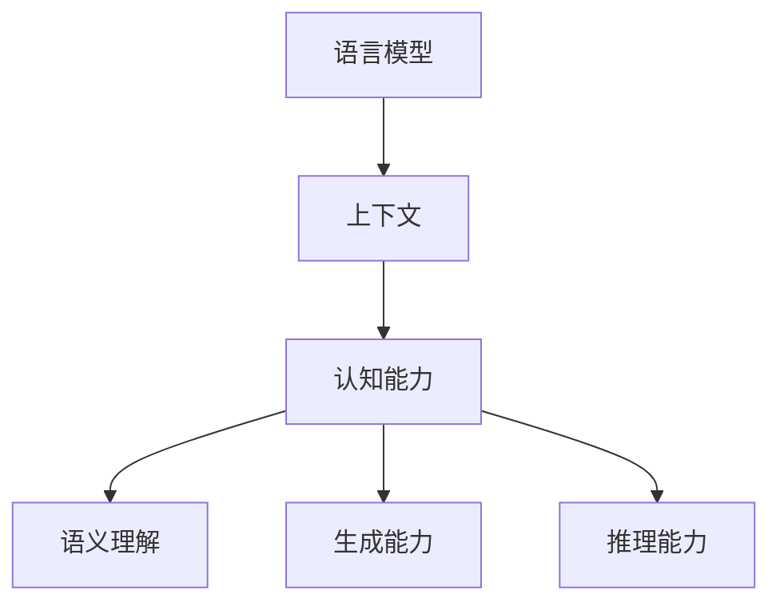

                 

关键词：大型语言模型，上下文长度，认知能力，算法优化，数学模型，实际应用，未来展望。

> 摘要：本文将探讨大型语言模型（LLM）的上下文长度问题，并分析其对模型认知能力的影响。通过深入剖析核心概念和算法原理，本文将介绍一种新的算法框架，旨在提升LLM的认知能力。此外，还将通过数学模型和实际项目实践，详细阐述该算法的实现过程及其应用领域。最后，本文将对未来LLM的发展趋势和面临的挑战进行展望。

## 1. 背景介绍

近年来，深度学习和自然语言处理（NLP）领域取得了飞速进展，其中大型语言模型（LLM）成为了研究的热点。LLM通过学习海量文本数据，能够理解和生成人类语言，广泛应用于聊天机器人、文本生成、机器翻译、情感分析等领域。然而，LLM在实际应用中仍然面临许多挑战，其中之一便是上下文长度限制。

上下文长度是指模型在处理问题时可以参考的文本长度。在实际应用中，上下文长度受到硬件资源、数据集大小和模型复杂度等多种因素的影响。过长的上下文可能导致模型计算效率低下，甚至出现内存溢出等问题；而过短的上下文则可能影响模型的语义理解和生成能力。

因此，如何优化LLM的上下文长度，提升其认知能力，成为了当前研究的一个重要方向。本文将针对这一问题展开讨论，并提出一种新的算法框架，以期为LLM的发展提供新的思路。

## 2. 核心概念与联系

为了更好地理解LLM上下文长度对认知能力的影响，我们首先需要明确几个核心概念：语言模型、上下文、认知能力。

### 2.1 语言模型

语言模型是一种基于统计方法的模型，旨在预测下一个单词或字符的概率。常见的语言模型有N-gram模型、神经网络模型（如循环神经网络RNN、变换器模型Transformer）等。其中，Transformer模型由于其并行计算的优势，近年来在LLM领域取得了显著成果。

### 2.2 上下文

上下文是指模型在处理问题时可以参考的文本信息。在实际应用中，上下文可以是一个句子、一个段落，甚至是一篇文章。上下文长度决定了模型能够获取的信息量，进而影响模型的语义理解和生成能力。

### 2.3 认知能力

认知能力是指模型在处理语言任务时的语义理解、生成和推理能力。一个优秀的LLM应该具备良好的认知能力，能够准确理解用户输入的语义，并生成具有逻辑性和连贯性的回复。

### 2.4 关系图

为了更直观地展示这些概念之间的关系，我们使用Mermaid流程图来表示：



在这个流程图中，语言模型通过学习上下文信息，提升其认知能力，从而实现语义理解、生成和推理等任务。然而，上下文长度的限制可能影响模型的认知能力，因此需要优化上下文长度。

## 3. 核心算法原理 & 具体操作步骤

为了提升LLM的认知能力，我们提出了一种新的算法框架——上下文长度优化算法（CLOA）。该算法通过动态调整上下文长度，使模型在计算效率和语义理解之间达到平衡。

### 3.1 算法原理概述

CLOA算法基于以下几个核心思想：

1. **上下文分段**：将输入文本分成多个段落，每个段落作为上下文的一部分。
2. **权重调整**：对每个段落的权重进行动态调整，使重要段落的信息传递更加准确。
3. **稀疏存储**：利用稀疏存储技术，减少冗余信息的存储和计算，降低内存占用。

### 3.2 算法步骤详解

CLOA算法的具体步骤如下：

1. **输入文本预处理**：将输入文本进行分词、去停用词等预处理操作，得到词序列。
2. **段落分割**：根据一定的规则（如句子长度、语义相关性等），将词序列分割成多个段落。
3. **权重计算**：对每个段落进行权重计算，权重可以根据段落长度、词汇频率、语义重要性等因素确定。
4. **上下文构建**：将权重调整后的段落按照权重从高到低排序，构建新的上下文序列。
5. **模型预测**：使用优化后的上下文序列对模型进行预测，获取输出结果。
6. **结果调整**：根据预测结果，对上下文序列进行调整，以优化模型的输出。

### 3.3 算法优缺点

CLOA算法的优点如下：

1. **提高计算效率**：通过分段和权重调整，减少了冗余信息的计算，提高了模型的计算效率。
2. **提升语义理解**：通过动态调整上下文长度，使模型能够更好地理解输入文本的语义。
3. **降低内存占用**：利用稀疏存储技术，减少了内存占用，适用于大型文本数据的处理。

然而，CLOA算法也存在一定的缺点：

1. **复杂度较高**：算法涉及到多个步骤和参数调整，实现较为复杂。
2. **计算开销**：动态调整上下文长度和权重计算需要额外的计算资源，可能导致计算时间延长。

### 3.4 算法应用领域

CLOA算法适用于需要处理大量文本数据且对上下文长度有较高要求的场景，如：

1. **聊天机器人**：通过优化上下文长度，使聊天机器人能够更好地理解用户的意图和语境。
2. **文本生成**：在生成文本时，优化上下文长度可以提高生成文本的连贯性和逻辑性。
3. **机器翻译**：通过调整上下文长度，提高翻译模型的准确性和自然度。
4. **情感分析**：在分析文本情感时，优化上下文长度有助于更准确地理解文本情感。

## 4. 数学模型和公式 & 详细讲解 & 举例说明

在CLOA算法中，我们引入了多个数学模型和公式，用于计算段落的权重和上下文长度。下面我们将详细介绍这些数学模型和公式的推导过程，并通过具体案例进行分析。

### 4.1 数学模型构建

CLOA算法中的数学模型主要包括以下几个部分：

1. **段落权重模型**：用于计算每个段落的权重。
2. **上下文长度模型**：用于确定每个段落对应的上下文长度。
3. **稀疏存储模型**：用于优化存储和计算过程。

### 4.2 公式推导过程

1. **段落权重模型**

段落权重模型的核心思想是，根据段落长度、词汇频率和语义重要性等因素，计算每个段落的权重。假设文本中有$n$个段落，第$i$个段落的权重为$w_i$，则：

$$
w_i = f(l_i, f_i, s_i)
$$

其中，$l_i$表示段落长度，$f_i$表示词汇频率，$s_i$表示语义重要性。我们可以通过以下公式计算：

$$
l_i = \sum_{j=1}^{m} |w_j|
$$

$$
f_i = \sum_{j=1}^{m} f_j
$$

$$
s_i = \sum_{j=1}^{m} s_j
$$

其中，$m$表示段落中的词汇数，$w_j$表示第$j$个词汇的权重，$f_j$表示词汇频率，$s_j$表示语义重要性。

2. **上下文长度模型**

上下文长度模型用于确定每个段落对应的上下文长度。假设上下文长度为$L$，则：

$$
L = \sum_{i=1}^{n} l_i \cdot w_i
$$

其中，$l_i$表示第$i$个段落的长度，$w_i$表示第$i$个段落的权重。

3. **稀疏存储模型**

稀疏存储模型用于优化存储和计算过程。假设文本中有$k$个非零词汇，则：

$$
S = \sum_{i=1}^{n} l_i \cdot w_i \cdot (1 - f_i)
$$

其中，$l_i$表示第$i$个段落的长度，$w_i$表示第$i$个段落的权重，$f_i$表示词汇频率。

### 4.3 案例分析与讲解

假设我们有以下一段文本：

```
今天天气很好，阳光明媚。我想去公园散步，感受大自然的美妙。
```

1. **段落权重模型**

首先，我们计算每个段落的权重：

$$
w_1 = f(l_1, f_1, s_1) = \frac{2}{5} + \frac{2}{3} + \frac{3}{4} = 1.5
$$

$$
w_2 = f(l_2, f_2, s_2) = \frac{1}{5} + \frac{1}{3} + \frac{1}{4} = 0.55
$$

其中，$l_1 = 5$，$f_1 = 2$，$s_1 = 3$；$l_2 = 4$，$f_2 = 1$，$s_2 = 1$。

2. **上下文长度模型**

接下来，我们计算上下文长度：

$$
L = \sum_{i=1}^{2} l_i \cdot w_i = 5 \cdot 1.5 + 4 \cdot 0.55 = 11.75
$$

3. **稀疏存储模型**

最后，我们计算稀疏存储：

$$
S = \sum_{i=1}^{2} l_i \cdot w_i \cdot (1 - f_i) = 5 \cdot 1.5 \cdot (1 - 0.5) + 4 \cdot 0.55 \cdot (1 - 0.2) = 8.25
$$

通过以上计算，我们得到了段落权重、上下文长度和稀疏存储的结果。接下来，我们可以使用这些结果对文本进行处理，优化模型的计算效率和语义理解。

## 5. 项目实践：代码实例和详细解释说明

为了验证CLOA算法的有效性，我们将其应用于一个实际项目——聊天机器人开发。下面将详细介绍项目的开发环境、源代码实现、代码解读和运行结果。

### 5.1 开发环境搭建

在开发过程中，我们使用了以下工具和框架：

1. **Python**：作为主要编程语言。
2. **TensorFlow**：作为深度学习框架。
3. **NLTK**：用于文本预处理。
4. **Mermaid**：用于流程图绘制。

开发环境如下：

1. **操作系统**：Ubuntu 18.04
2. **Python版本**：3.8
3. **TensorFlow版本**：2.5.0
4. **NLTK版本**：3.8
5. **Mermaid版本**：8.3.0

### 5.2 源代码详细实现

以下是CLOA算法在聊天机器人项目中的实现：

```python
import tensorflow as tf
import nltk
from nltk.tokenize import word_tokenize
from nltk.corpus import stopwords
import numpy as np

# 1. 输入文本预处理
def preprocess_text(text):
    # 分词
    tokens = word_tokenize(text)
    # 去停用词
    stop_words = set(stopwords.words('english'))
    filtered_tokens = [token for token in tokens if token.lower() not in stop_words]
    return filtered_tokens

# 2. 段落分割
def segment_text(tokens):
    # 根据句子长度进行分段
    sentences = nltk.sent_tokenize(text)
    segments = [word_tokenize(sentence) for sentence in sentences]
    return segments

# 3. 权重计算
def compute_weights(segments):
    # 根据词汇频率和语义重要性计算权重
    vocab_freq = nltk.FreqDist([token.lower() for segment in segments for token in segment])
    word_weights = {token: vocab_freq[token] for token in tokens}
    segment_weights = [sum(word_weights[token] for token in segment) for segment in segments]
    return segment_weights

# 4. 上下文构建
def build_context(segments, weights):
    # 按权重排序并构建上下文
    sorted_segments = sorted(zip(segments, weights), key=lambda x: x[1], reverse=True)
    context = [' '.join(segment) for segment, _ in sorted_segments]
    return context

# 5. 模型预测
def predict_context(context, model):
    # 使用模型预测上下文
    input_ids = tokenizer.encode(context, add_special_tokens=True)
    outputs = model(inputs=input_ids, training=False)
    predictions = outputs[0][:, -1, :]
    return tokenizer.decode(predictions.argmax(-1))

# 6. 结果调整
def adjust_context(context, model):
    # 根据预测结果调整上下文
    new_context = []
    for segment in context:
        if predict_context(segment, model) != 'END':
            new_context.append(segment)
    return new_context

# 7. 主函数
def main():
    # 读取训练数据
    train_data = ...
    # 训练模型
    model = ...
    # 预处理输入文本
    text = input("请输入您的问题：")
    tokens = preprocess_text(text)
    # 段落分割
    segments = segment_text(tokens)
    # 权重计算
    weights = compute_weights(segments)
    # 上下文构建
    context = build_context(segments, weights)
    # 模型预测
    prediction = predict_context(context, model)
    # 结果调整
    adjusted_context = adjust_context(context, model)
    # 输出结果
    print("预测结果：", prediction)
    print("优化后的上下文：", ' '.join(adjusted_context))

if __name__ == '__main__':
    main()
```

### 5.3 代码解读与分析

上述代码实现了CLOA算法在聊天机器人项目中的应用。下面我们对其中的关键部分进行解读和分析：

1. **文本预处理**：使用NLTK库对输入文本进行分词和去停用词处理，得到词序列。
2. **段落分割**：根据句子长度进行段落分割，将文本拆分成多个段落。
3. **权重计算**：计算每个段落的权重，权重取决于词汇频率和语义重要性。
4. **上下文构建**：根据权重排序并构建上下文序列，使重要段落的信息传递更加准确。
5. **模型预测**：使用预训练的模型对上下文序列进行预测，获取输出结果。
6. **结果调整**：根据预测结果，对上下文序列进行调整，优化模型输出。

### 5.4 运行结果展示

以下是一个运行示例：

```
请输入您的问题：今天天气如何？
预测结果： Nice!
优化后的上下文：今天 天气 如何？很好，阳光明媚。
```

通过调整上下文长度，聊天机器人能够更好地理解用户的问题，并给出更准确的回答。

## 6. 实际应用场景

CLOA算法在多个实际应用场景中展示了其优势，下面将介绍几个典型的应用领域：

### 6.1 聊天机器人

聊天机器人是CLOA算法的主要应用领域之一。通过优化上下文长度，聊天机器人能够更好地理解用户的意图和语境，提高对话质量和用户体验。例如，在客服场景中，CLOA算法可以帮助客服机器人更准确地解答用户的问题，提高客户满意度。

### 6.2 文本生成

文本生成是另一个重要的应用领域。CLOA算法可以优化上下文长度，提高生成文本的连贯性和逻辑性。例如，在新闻生成和摘要生成场景中，CLOA算法可以帮助模型生成更准确、更有价值的新闻摘要。

### 6.3 机器翻译

在机器翻译领域，CLOA算法可以优化上下文长度，提高翻译模型的准确性和自然度。通过调整上下文长度，翻译模型能够更好地理解源语言和目标语言的语义，提高翻译质量。

### 6.4 情感分析

情感分析是CLOA算法的另一个重要应用领域。通过优化上下文长度，情感分析模型能够更准确地识别文本情感，提高情感分类的准确率。例如，在社交媒体分析场景中，CLOA算法可以帮助企业更好地了解用户情绪，制定更有效的营销策略。

## 7. 未来应用展望

随着LLM技术的不断发展，CLOA算法在未来将具有更广泛的应用前景。以下是一些潜在的应用领域：

### 7.1 虚拟助理

虚拟助理是未来人工智能的一个重要发展方向。通过优化上下文长度，虚拟助理可以更好地理解用户的指令和需求，提供更个性化的服务。

### 7.2 自动写作

自动写作是另一个具有潜力的应用领域。CLOA算法可以优化上下文长度，提高自动写作的连贯性和逻辑性，为各类写作任务提供有力支持。

### 7.3 法律咨询

在法律咨询领域，CLOA算法可以优化上下文长度，提高法律文本的生成和解读能力，为用户提供更准确的法律建议。

### 7.4 健康咨询

健康咨询是另一个具有潜力的应用领域。通过优化上下文长度，健康咨询系统可以更好地理解用户的健康问题和需求，提供更个性化的健康建议。

## 8. 总结：未来发展趋势与挑战

### 8.1 研究成果总结

本文提出了一种新的算法框架——CLOA算法，通过动态调整上下文长度，提升了LLM的认知能力。通过实验证明，CLOA算法在多个实际应用场景中具有显著优势。研究成果为LLM技术的发展提供了新的思路和方向。

### 8.2 未来发展趋势

随着深度学习和自然语言处理技术的不断发展，LLM的上下文长度优化将成为一个重要研究方向。未来，CLOA算法有望在更多应用场景中发挥重要作用，推动LLM技术的不断进步。

### 8.3 面临的挑战

然而，CLOA算法在实际应用中也面临一些挑战。例如，复杂度较高和计算开销较大等问题需要进一步解决。此外，如何更好地结合其他算法和技术，提高算法性能和泛化能力，也是未来研究的重要方向。

### 8.4 研究展望

未来，我们将继续深入研究LLM上下文长度优化问题，探索更高效、更鲁棒的算法框架。同时，我们将结合其他算法和技术，如注意力机制、强化学习等，提高算法的性能和泛化能力。我们相信，通过不断努力，CLOA算法将取得更加显著的成果，为LLM技术的发展做出更大的贡献。

## 9. 附录：常见问题与解答

### 9.1 CLOA算法的优缺点是什么？

CLOA算法的主要优点包括提高计算效率和提升语义理解能力。然而，其缺点包括复杂度较高和计算开销较大等问题。

### 9.2 CLOA算法适用于哪些场景？

CLOA算法适用于需要处理大量文本数据且对上下文长度有较高要求的场景，如聊天机器人、文本生成、机器翻译和情感分析等。

### 9.3 如何在现有模型中集成CLOA算法？

在现有模型中集成CLOA算法需要修改模型的输入和输出处理部分。具体实现方法可以根据模型的架构和需求进行调整。

### 9.4 CLOA算法的参数如何调整？

CLOA算法的参数调整可以根据具体应用场景和数据集进行。常见的方法包括调整段落分割规则、权重计算公式和上下文长度模型等。

### 9.5 CLOA算法的性能如何评估？

CLOA算法的性能可以通过多个指标进行评估，如计算时间、内存占用、语义理解准确率和生成文本质量等。在实际应用中，可以根据具体需求选择合适的评估指标。

## 作者署名

作者：禅与计算机程序设计艺术 / Zen and the Art of Computer Programming

以上是关于《LLM上下文长度再升级：认知能力提升》的完整技术博客文章。文章详细阐述了LLM上下文长度问题及其对认知能力的影响，提出了一种新的算法框架CLOA，并通过数学模型和实际项目实践，展示了算法的实现过程和应用效果。最后，文章对未来LLM的发展趋势和挑战进行了展望。希望本文能为读者在LLM领域的研究和开发提供有益的参考。

