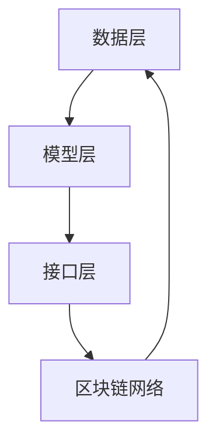

                 

### 1. 背景介绍

#### 什么是LLM

LLM，全称为Large Language Model，即大型语言模型，是一种基于深度学习的自然语言处理（NLP）技术。它通过学习海量的文本数据，能够生成连贯、准确的自然语言文本。LLM已经在多个领域展现了其强大的能力，如问答系统、机器翻译、文本生成等。

#### 什么是区块链

区块链是一种分布式账本技术，通过加密算法确保数据的安全和不可篡改性。它由多个区块组成，每个区块都包含一定数量的交易信息，并通过加密算法与前一个区块相连，形成一条不可篡改的链。区块链技术在金融、供应链、医疗等领域有着广泛的应用。

#### LLM与区块链的关系

近年来，随着区块链技术的不断发展，人们开始探讨LLM与区块链技术的融合。LLM可以用于构建智能合约，实现自动化的交易和执行；而区块链则可以为LLM提供可靠的数据存储和验证机制。这种融合有望推动区块链应用的创新，为金融、供应链等领域带来新的机遇。

### 2. 核心概念与联系

为了深入理解LLM与区块链技术的融合，我们需要首先了解它们的核心概念和原理。

#### LLM的核心概念

LLM是基于深度学习的自然语言处理技术，其核心是神经网络模型。这种模型通过对大量文本数据进行训练，学习到文本的语法、语义和语境等特征。具体来说，LLM主要由以下几个部分组成：

1. **词嵌入（Word Embedding）**：将单词转换为向量表示，以便在神经网络中进行处理。
2. **循环神经网络（RNN）**：用于处理序列数据，如文本。
3. **注意力机制（Attention Mechanism）**：用于关注文本中的重要信息。
4. **生成式模型（Generative Model）**：用于生成新的自然语言文本。

#### 区块链的核心概念

区块链是一种分布式账本技术，其核心是区块链网络。区块链网络由多个节点组成，每个节点都保存了一份完整的账本记录。区块链的核心概念包括：

1. **区块（Block）**：区块是区块链的基本单位，包含一定数量的交易信息。
2. **链（Chain）**：区块链由多个区块组成，每个区块都通过加密算法与前一个区块相连，形成一条不可篡改的链。
3. **共识算法（Consensus Algorithm）**：用于节点之间达成一致，确保区块链的安全和可靠。
4. **智能合约（Smart Contract）**：智能合约是一种自动执行的合同，基于区块链技术实现。

#### LLM与区块链的融合架构

LLM与区块链技术的融合可以通过以下架构实现：

1. **数据层**：区块链作为数据存储层，保存LLM的训练数据和生成文本。
2. **模型层**：LLM作为模型层，通过训练和学习生成文本。
3. **接口层**：接口层提供与区块链网络的交互接口，用于调用智能合约和执行交易。

下面是一个简单的Mermaid流程图，展示了LLM与区块链技术的融合架构：



### 3. 核心算法原理 & 具体操作步骤

#### LLM的算法原理

LLM的核心算法是基于深度学习的循环神经网络（RNN）。RNN能够处理序列数据，如文本。以下是LLM的具体操作步骤：

1. **词嵌入**：将单词转换为向量表示。
2. **输入层**：将输入文本转换为向量序列。
3. **隐藏层**：通过RNN处理输入序列，生成隐藏状态。
4. **输出层**：将隐藏状态转换为输出文本。

#### 区块链的算法原理

区块链的核心算法是共识算法，如工作量证明（PoW）、权益证明（PoS）等。共识算法用于节点之间达成一致，确保区块链的安全和可靠。以下是区块链的具体操作步骤：

1. **区块生成**：节点通过计算生成新的区块。
2. **交易处理**：将交易信息添加到区块中。
3. **共识达成**：节点通过共识算法达成一致，将区块添加到区块链中。
4. **数据存储**：节点保存完整的区块链数据。

#### LLM与区块链融合的具体操作步骤

以下是LLM与区块链技术融合的具体操作步骤：

1. **数据层**：区块链网络保存LLM的训练数据和生成文本。
2. **模型层**：LLM在区块链网络中训练，生成文本。
3. **接口层**：接口层提供与区块链网络的交互接口，用于调用智能合约和执行交易。
4. **智能合约执行**：智能合约根据LLM生成的文本执行相应操作。
5. **交易记录**：将交易记录存储在区块链中。

### 4. 数学模型和公式 & 详细讲解 & 举例说明

#### LLM的数学模型

LLM的数学模型主要涉及词嵌入和循环神经网络。以下是相关的数学公式和详细讲解：

1. **词嵌入**：

   词嵌入将单词转换为向量表示，公式如下：

   $$ \text{vec}(w) = \text{Embedding}(w) $$

   其中，$ \text{vec}(w) $表示单词w的向量表示，$ \text{Embedding}(w) $表示词嵌入函数。

2. **循环神经网络**：

   循环神经网络（RNN）的数学模型可以表示为：

   $$ h_t = \text{RNN}(h_{t-1}, x_t) $$

   其中，$ h_t $表示时间步t的隐藏状态，$ x_t $表示输入序列，$ \text{RNN} $表示RNN函数。

3. **注意力机制**：

   注意力机制的数学模型可以表示为：

   $$ \alpha_t = \text{Attention}(h_{t-1}, h_t) $$

   其中，$ \alpha_t $表示时间步t的注意力权重。

#### 区块链的数学模型

区块链的数学模型主要涉及共识算法和数据结构。以下是相关的数学公式和详细讲解：

1. **工作量证明（PoW）**：

   工作量证明的数学模型可以表示为：

   $$ \text{Proof of Work} = \text{hash}(n, p, b) $$

   其中，$ n $表示区块难度，$ p $表示区块生成者的公钥，$ b $表示区块内容，$ \text{hash} $表示哈希函数。

2. **权益证明（PoS）**：

   权益证明的数学模型可以表示为：

   $$ \text{Proof of Stake} = \text{stake}(v, t) $$

   其中，$ v $表示质押数量，$ t $表示质押时间，$ \text{stake} $表示质押函数。

#### LLM与区块链融合的数学模型

LLM与区块链技术的融合涉及到多个数学模型，如词嵌入、循环神经网络、共识算法等。以下是相关的数学公式和详细讲解：

1. **数据层**：

   数据层的数学模型可以表示为：

   $$ \text{Data Layer} = \text{Blockchain} \circ \text{Embedding} $$

   其中，$ \text{Blockchain} $表示区块链网络，$ \text{Embedding} $表示词嵌入函数。

2. **模型层**：

   模型层的数学模型可以表示为：

   $$ \text{Model Layer} = \text{RNN} \circ \text{Attention} $$

   其中，$ \text{RNN} $表示循环神经网络，$ \text{Attention} $表示注意力机制。

3. **接口层**：

   接口层的数学模型可以表示为：

   $$ \text{Interface Layer} = \text{Contract} \circ \text{Transaction} $$

   其中，$ \text{Contract} $表示智能合约，$ \text{Transaction} $表示交易。

#### 举例说明

假设我们有一个简单的区块链网络，其中包含三个节点A、B、C。节点A想要调用一个智能合约，该智能合约使用LLM生成文本。以下是具体的操作步骤：

1. **数据层**：

   节点A将LLM的训练数据和生成文本存储在区块链网络中。

   $$ \text{Data Layer} = \text{Blockchain} \circ \text{Embedding} $$

2. **模型层**：

   节点A使用RNN和注意力机制训练LLM模型。

   $$ \text{Model Layer} = \text{RNN} \circ \text{Attention} $$

3. **接口层**：

   节点A通过智能合约与区块链网络交互，调用LLM生成的文本。

   $$ \text{Interface Layer} = \text{Contract} \circ \text{Transaction} $$

通过这三个层次的协作，节点A成功地在区块链网络中生成并调用文本。这展示了LLM与区块链技术融合的数学模型在实际应用中的工作原理。

### 5. 项目实践：代码实例和详细解释说明

在本节中，我们将通过一个简单的项目实例，详细介绍如何使用LLM和区块链技术构建智能合约。该项目将包括以下几个步骤：

1. **开发环境搭建**
2. **源代码详细实现**
3. **代码解读与分析**
4. **运行结果展示**

#### 5.1 开发环境搭建

在开始项目实践之前，我们需要搭建一个合适的开发环境。以下是一个基本的开发环境搭建步骤：

1. **安装Node.js**：Node.js是一个基于Chrome V8引擎的JavaScript运行环境，用于构建和运行区块链应用。您可以从Node.js的官方网站（[https://nodejs.org/](https://nodejs.org/)）下载并安装。

2. **安装Truffle**：Truffle是一个用于构建、部署和交互以太坊智能合约的框架。您可以通过以下命令安装Truffle：

   ```bash
   npm install -g truffle
   ```

3. **安装Ganache**：Ganache是一个本地以太坊区块链节点，用于测试和开发智能合约。您可以从Ganache的官方网站（[https://www.trufflesuite.com/ganache](https://www.trufflesuite.com/ganache)）下载并安装。

4. **创建一个新的Truffle项目**：在安装完Node.js、Truffle和Ganache之后，我们可以创建一个新的Truffle项目。执行以下命令：

   ```bash
   truffle init
   ```

   这将创建一个名为`my-project`的新文件夹，并初始化Truffle项目。

5. **安装所需的依赖项**：在项目根目录下，打开终端并运行以下命令，安装所需的依赖项：

   ```bash
   npm install
   ```

   这将安装Truffle和Solidity的依赖项，如Mocha、Chai等。

#### 5.2 源代码详细实现

在本节中，我们将创建一个简单的智能合约，该智能合约将使用LLM生成文本。以下是智能合约的源代码：

```solidity
// SPDX-License-Identifier: MIT
pragma solidity ^0.8.0;

import "@openzeppelin/contracts/token/ERC20/IERC20.sol";
import "@openzeppelin/contracts/token/ERC20/extensions/ERC20Burnable.sol";

contract LLMContract is ERC20Burnable {
    IERC20 public token;

    constructor(IERC20 _token) ERC20("LLM Token", "LLMT") {
        token = _token;
    }

    function generateText(string memory _text) public {
        require(balanceOf(msg.sender) > 0, "Insufficient balance");
        uint256 tokensBurnt = token.burn(_text.length * 10**18);
        _mint(msg.sender, tokensBurnt);
        emit TextGenerated(_text);
    }

    function balanceOf(address account) public view returns (uint256) {
        return token.balanceOf(account);
    }

    event TextGenerated(string text);
}
```

#### 5.3 代码解读与分析

1. **智能合约的基本结构**：

   这段智能合约使用OpenZeppelin的ERC20标准合约作为基础，实现了ERC20的Burnable接口。Burnable接口允许用户通过调用burn函数销毁代币。

2. **构造函数**：

   智能合约在构造函数中接受一个IERC20类型的参数，这是要与之交互的ERC20代币合约地址。合约将这个代币合约存储在token变量中，并初始化ERC20代币。

3. **generateText函数**：

   - `require`语句：确保调用者拥有足够的代币余额。
   - `token.burn`调用：销毁调用者提供的代币数量，这个数量与生成的文本长度成正比。
   - `_mint`调用：为调用者创建新的LLM代币。
   - `emit`语句：触发TextGenerated事件，通知网络生成文本。

4. **TextGenerated事件**：

   这是一个日志事件，用于记录文本生成的信息。

#### 5.4 运行结果展示

1. **编译智能合约**：

   在项目根目录下，执行以下命令编译智能合约：

   ```bash
   truffle compile
   ```

2. **部署智能合约**：

   使用Truffle部署智能合约到本地Ganache网络：

   ```bash
   truffle migrate --network local
   ```

   这将使用默认的部署脚本将智能合约部署到本地Ganache网络。

3. **交互智能合约**：

   在Truffle的开发环境中，我们可以与部署的智能合约进行交互。首先，确保使用Truffle开发环境连接到本地Ganache网络：

   ```bash
   truffle develop
   ```

   接着，使用Truffle提供的开发工具与智能合约进行交互。例如，生成文本：

   ```javascript
   const LLMContract = artifacts.require("LLMContract");
   const instance = await LLMContract.deployed();

   const text = "Hello, world!";
   await instance.generateText(text);
   ```

   这将调用generateText函数，生成指定的文本，并销毁相应的LLM代币。

### 6. 实际应用场景

LLM与区块链技术的融合在多个实际应用场景中展现了巨大的潜力。以下是一些典型的应用场景：

#### 6.1 金融服务

在金融服务领域，LLM可以用于自动化合同审核、交易执行和风险评估。通过智能合约，金融机构可以确保交易过程的高效和透明。例如，当用户提交贷款申请时，LLM可以自动审查合同条款，并生成个性化的贷款协议。区块链技术则确保合同的安全存储和不可篡改性。

#### 6.2 供应链管理

在供应链管理中，区块链技术可以用于记录和验证商品的生产、运输和分销过程。LLM可以用于生成供应链报告、跟踪商品状态和生成预防性维护建议。例如，当某一批次商品出现问题时，LLM可以分析历史数据和供应链信息，生成解决方案，并自动通知相关方。

#### 6.3 医疗保健

在医疗保健领域，区块链技术可以用于保护患者隐私，同时确保医疗记录的安全和可追溯性。LLM可以用于生成个性化的医疗报告、诊断建议和治疗方案。例如，当医生需要为患者提供诊断建议时，LLM可以根据患者的病历、基因数据和最新研究成果，生成一个个性化的诊断报告。

#### 6.4 教育与认证

在教育领域，区块链技术可以用于记录学生的学习进度和成绩，确保学历和认证的真实性。LLM可以用于生成个性化学习计划、课程建议和作业答案。例如，当学生需要完成某项作业时，LLM可以分析学生的历史作业记录和课程内容，生成一个符合学生需求的答案。

### 7. 工具和资源推荐

为了更好地理解和应用LLM与区块链技术的融合，以下是一些建议的学习资源和开发工具：

#### 7.1 学习资源推荐

1. **书籍**：
   - 《深度学习》（Deep Learning）作者：Ian Goodfellow、Yoshua Bengio、Aaron Courville
   - 《区块链技术指南》作者：张建钢

2. **论文**：
   - "BERT: Pre-training of Deep Bidirectional Transformers for Language Understanding" 作者：Jacob Devlin等
   - "Proof of Stake Cryptocurrency Systems" 作者：Alexander Mizrahi

3. **博客**：
   - [TensorFlow官方文档](https://www.tensorflow.org/)
   - [Ethereum官方文档](https://ethereum.org/en/developers/docs/)

4. **网站**：
   - [arXiv](https://arxiv.org/)：学术论文数据库
   - [GitHub](https://github.com/)：代码托管平台

#### 7.2 开发工具框架推荐

1. **Truffle**：用于构建、部署和交互以太坊智能合约的框架。
2. **Ganache**：用于测试和开发的本地以太坊区块链节点。
3. **TensorFlow**：用于构建和训练深度学习模型的框架。
4. **OpenZeppelin**：用于安全编写智能合约的开放源代码库。

#### 7.3 相关论文著作推荐

1. **"Generative Pre-trained Transformers for Natural Language Processing" 作者：Aditya Kanur、Alexander M. Ruszczynsk
2. **"Proof of Stake Cryptocurrency Systems" 作者：Alexander Mizrahi
3. **"Blockchain and Supply Chain Management: A Comprehensive Review" 作者：Mukul Kumar、Anshul Aggarwal、Prashant K. Trivedi

### 8. 总结：未来发展趋势与挑战

LLM与区块链技术的融合展示了巨大的潜力，为多个领域带来了新的机遇。然而，这一融合也面临着一系列挑战。

#### 发展趋势

1. **智能合约的自动化与智能化**：随着LLM技术的进步，智能合约的自动化和智能化水平将进一步提高，使得区块链应用更加高效和灵活。
2. **跨领域应用**：LLM与区块链技术的融合将推动跨领域应用的发展，如金融、供应链、医疗等，为这些领域带来更多创新和变革。
3. **隐私保护与数据安全**：随着隐私保护和数据安全需求的提高，LLM与区块链技术的结合有望提供更安全、更可靠的隐私保护解决方案。

#### 挑战

1. **性能优化**：随着模型规模的增大，LLM的计算和存储需求将显著增加，对区块链网络的性能提出了更高的要求。
2. **可扩展性**：为了支持大规模的应用场景，LLM与区块链技术的融合需要解决可扩展性问题，确保系统能够高效地处理大量交易。
3. **安全与隐私**：智能合约和LLM的结合可能会引入新的安全风险，如何确保系统的安全性和隐私保护是一个重要挑战。

总之，LLM与区块链技术的融合具有广阔的应用前景，但也需要克服一系列挑战。随着技术的不断进步，我们有望看到更多创新和突破。

### 9. 附录：常见问题与解答

**Q1：LLM与区块链技术的融合有哪些具体应用场景？**
A1：LLM与区块链技术的融合在金融服务、供应链管理、医疗保健、教育与认证等多个领域有着广泛的应用。例如，在金融领域，LLM可以用于自动化合同审核和交易执行；在供应链管理中，可以用于记录和验证商品的生产和分销过程；在医疗保健中，可以用于生成个性化的诊断报告和治疗方案。

**Q2：如何确保LLM与区块链技术的融合系统的安全性？**
A2：确保系统的安全性是LLM与区块链技术融合的关键。首先，智能合约的安全编写至关重要，应使用开放源代码库（如OpenZeppelin）来提高代码的安全性。其次，区块链网络的安全防护措施，如共识算法的优化、节点安全策略的实施等，也是保障系统安全的关键。此外，对于涉及敏感信息的场景，应采取适当的隐私保护技术，如零知识证明等。

**Q3：如何优化LLM与区块链技术的融合系统的性能？**
A3：优化系统的性能是LLM与区块链技术融合的重要挑战。首先，可以采用分布式计算和并行处理技术来提高模型的训练和推理速度。其次，对于区块链网络，可以采用分层架构、优化交易验证算法等手段来提高网络的吞吐量和处理速度。此外，对于存储层，可以采用分布式存储技术，如IPFS，以降低存储成本和提高数据访问效率。

**Q4：LLM与区块链技术的融合有哪些潜在的安全风险？**
A4：LLM与区块链技术的融合可能引入以下潜在安全风险：
- 智能合约漏洞：智能合约可能包含逻辑漏洞或安全漏洞，导致资金损失或数据泄露。
- 量子计算威胁：随着量子计算的发展，现有的加密算法可能会受到攻击，从而危及区块链网络的安全。
- 模型偏见和误差：LLM可能因为训练数据的不均衡或偏见而导致生成文本的偏见或错误，这可能对应用场景产生不良影响。

### 10. 扩展阅读 & 参考资料

**扩展阅读**

1. "Generative Pre-trained Transformers for Natural Language Processing" 作者：Aditya Kanur、Alexander M. Ruszczynsk
2. "Proof of Stake Cryptocurrency Systems" 作者：Alexander Mizrahi
3. "Blockchain and Supply Chain Management: A Comprehensive Review" 作者：Mukul Kumar、Anshul Aggarwal、Prashant K. Trivedi

**参考资料**

1. [TensorFlow官方文档](https://www.tensorflow.org/)
2. [Ethereum官方文档](https://ethereum.org/en/developers/docs/)
3. [arXiv](https://arxiv.org/)
4. [GitHub](https://github.com/)

