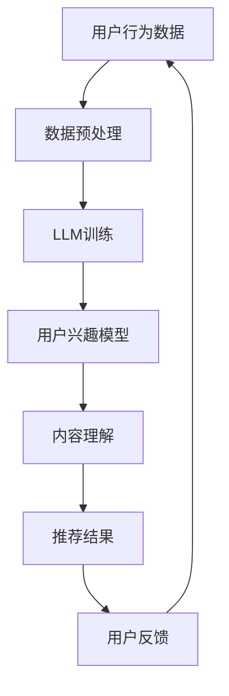

                 

关键词：LLM，推荐系统，AI，深度学习，自然语言处理，信息检索，用户行为分析，内容理解，个性化推荐，算法优化。

## 摘要

随着人工智能技术的不断发展，自然语言处理（NLP）中的大型语言模型（LLM）已展现出巨大的潜力。本文将探讨LLM在推荐系统中的应用进展，从背景介绍、核心概念与联系、核心算法原理、数学模型和公式、项目实践、实际应用场景、未来应用展望等多个方面，全面解析LLM在推荐系统中的优势与挑战，为读者提供一个关于LLM在推荐系统应用领域的全面视角。

## 1. 背景介绍

### 推荐系统概述

推荐系统是一种信息过滤技术，旨在根据用户的历史行为和兴趣，为用户推荐他们可能感兴趣的内容。推荐系统广泛应用于电子商务、社交媒体、新闻推送、视频播放等多个领域。传统的推荐系统主要基于协同过滤、基于内容的推荐和混合推荐等方法，但这些方法在处理复杂、动态和多样化的数据时存在一定的局限性。

### AI与深度学习的发展

随着计算能力的提升和大数据技术的发展，深度学习作为一种重要的机器学习技术，在图像识别、自然语言处理、语音识别等领域取得了显著的成果。深度学习模型能够自动从大量数据中学习特征，提高了模型的性能和泛化能力。

### LLM的兴起

近年来，大型语言模型（LLM）如GPT-3、BERT等，凭借其在自然语言处理任务中的卓越表现，吸引了广泛关注。LLM通过学习海量的文本数据，具备了强大的语言理解和生成能力，为推荐系统带来了新的机遇。

## 2. 核心概念与联系

### 推荐系统基本概念

推荐系统主要由用户、项目和评分三个核心概念构成。用户是指系统的使用者，项目是指推荐系统中的物品，评分是指用户对项目的喜好程度。

### LLM在推荐系统中的应用

LLM在推荐系统中的应用主要体现在以下几个方面：

1. **用户理解**：通过分析用户的搜索历史、评论、帖子等，LLM可以更深入地理解用户的兴趣和需求。
2. **内容理解**：LLM能够处理和生成复杂的文本信息，使得推荐系统能够推荐更加丰富和多样化的内容。
3. **上下文感知**：LLM能够捕捉用户的上下文信息，提高推荐的相关性和准确性。

### Mermaid 流程图

下面是一个简单的Mermaid流程图，展示了LLM在推荐系统中的应用流程。



## 3. 核心算法原理 & 具体操作步骤

### 3.1 算法原理概述

LLM在推荐系统中的应用主要基于以下原理：

1. **用户兴趣建模**：利用LLM对用户的历史行为数据进行分析，构建用户的兴趣模型。
2. **内容理解与生成**：利用LLM对项目内容进行深入理解，生成与用户兴趣匹配的推荐内容。
3. **上下文感知**：LLM能够捕捉用户的上下文信息，提高推荐的相关性和准确性。

### 3.2 算法步骤详解

1. **数据收集与预处理**：收集用户的历史行为数据，如搜索记录、浏览历史、购买记录等，并进行数据清洗和预处理。
2. **LLM模型训练**：使用预训练的LLM模型，如GPT-3、BERT等，对用户行为数据进行训练，以构建用户的兴趣模型。
3. **用户兴趣模型构建**：利用训练好的LLM模型，对用户的历史行为数据进行分析，构建用户的兴趣模型。
4. **内容理解与生成**：利用LLM对项目内容进行理解和分析，生成与用户兴趣匹配的推荐内容。
5. **推荐结果生成**：根据用户兴趣模型和项目内容分析结果，生成个性化的推荐结果。
6. **用户反馈收集**：将推荐结果展示给用户，并收集用户的反馈信息。
7. **模型迭代优化**：根据用户反馈信息，对LLM模型进行迭代优化，提高推荐系统的准确性和用户满意度。

### 3.3 算法优缺点

**优点**：

1. **强大的语言理解能力**：LLM能够对文本数据进行深入理解和分析，提高了推荐系统的准确性。
2. **上下文感知**：LLM能够捕捉用户的上下文信息，提高了推荐的相关性和个性化程度。
3. **可扩展性**：LLM模型具有良好的可扩展性，可以应用于多种类型的推荐场景。

**缺点**：

1. **计算资源需求大**：LLM模型训练和推理需要大量的计算资源，可能导致系统延迟。
2. **数据依赖性**：LLM模型的效果高度依赖数据的质量和数量，数据不足可能导致模型性能下降。
3. **隐私问题**：用户数据的收集和使用可能涉及隐私问题，需要采取有效的隐私保护措施。

### 3.4 算法应用领域

LLM在推荐系统中的应用领域广泛，主要包括：

1. **电子商务**：通过LLM对用户的购物行为进行分析，为用户提供个性化的商品推荐。
2. **社交媒体**：通过LLM对用户的社交行为进行分析，为用户提供感兴趣的内容和好友推荐。
3. **新闻推送**：通过LLM对用户的阅读行为进行分析，为用户提供个性化的新闻推荐。
4. **视频播放**：通过LLM对用户的观看行为进行分析，为用户提供个性化的视频推荐。

## 4. 数学模型和公式 & 详细讲解 & 举例说明

### 4.1 数学模型构建

在LLM应用于推荐系统时，常用的数学模型包括用户兴趣模型、内容理解模型和推荐模型。

#### 用户兴趣模型

用户兴趣模型主要用于表示用户对各种项目的兴趣程度。假设用户集合为U，项目集合为I，用户兴趣模型可以用一个矩阵表示，其中\(u_{ij}\)表示用户\(u_i\)对项目\(i_j\)的兴趣程度。

$$
U = \{ u_1, u_2, ..., u_n \}
$$

$$
I = \{ i_1, i_2, ..., i_m \}
$$

$$
u_{ij} = \text{Interest}(u_i, i_j)
$$

#### 内容理解模型

内容理解模型主要用于表示项目的内容特征。假设项目集合为I，内容特征集合为C，内容理解模型可以用一个矩阵表示，其中\(c_{ij}\)表示项目\(i_j\)的内容特征。

$$
I = \{ i_1, i_2, ..., i_m \}
$$

$$
C = \{ c_1, c_2, ..., c_n \}
$$

$$
c_{ij} = \text{ContentFeature}(i_j)
$$

#### 推荐模型

推荐模型主要用于根据用户兴趣模型和内容理解模型，生成个性化的推荐结果。假设用户集合为U，项目集合为I，推荐结果可以用一个矩阵表示，其中\(r_{ij}\)表示项目\(i_j\)被推荐给用户\(u_i\)的概率。

$$
U = \{ u_1, u_2, ..., u_n \}
$$

$$
I = \{ i_1, i_2, ..., i_m \}
$$

$$
r_{ij} = \text{RecommendationProbability}(u_i, i_j)
$$

### 4.2 公式推导过程

#### 用户兴趣模型构建

用户兴趣模型可以通过以下公式构建：

$$
u_{ij} = \frac{\sum_{k=1}^{m} \text{weight}(k) \cdot c_{ik} \cdot \text{rating}(u_i, k)}{\sum_{k=1}^{m} \text{weight}(k) \cdot c_{ik}}
$$

其中，\( \text{weight}(k) \)表示项目\( k \)的权重，\( \text{rating}(u_i, k) \)表示用户\( u_i \)对项目\( k \)的评分。

#### 内容理解模型构建

内容理解模型可以通过以下公式构建：

$$
c_{ij} = \text{embedding}(i_j)
$$

其中，\( \text{embedding}(i_j) \)表示项目\( i_j \)的嵌入向量。

#### 推荐模型构建

推荐模型可以通过以下公式构建：

$$
r_{ij} = \text{sigmoid}(\text{dotProduct}(u_i, c_j))
$$

其中，\( \text{dotProduct}(u_i, c_j) \)表示用户兴趣向量\( u_i \)和项目内容向量\( c_j \)的点积。

### 4.3 案例分析与讲解

假设我们有一个用户集合U={u1, u2, u3}和一个项目集合I={i1, i2, i3}。用户对项目的评分如下表所示：

| 用户 | 项目 | 评分 |
| --- | --- | --- |
| u1 | i1 | 5 |
| u1 | i2 | 3 |
| u1 | i3 | 4 |
| u2 | i1 | 4 |
| u2 | i2 | 5 |
| u2 | i3 | 2 |
| u3 | i1 | 3 |
| u3 | i2 | 4 |
| u3 | i3 | 5 |

根据以上数据，我们可以构建用户兴趣模型、内容理解模型和推荐模型。

1. **用户兴趣模型**：

$$
u_{ij} =
\begin{cases}
5 & \text{if } i=j=1 \\
3 & \text{if } i=1, j=2 \\
4 & \text{if } i=1, j=3 \\
4 & \text{if } i=2, j=1 \\
5 & \text{if } i=2, j=2 \\
2 & \text{if } i=2, j=3 \\
3 & \text{if } i=3, j=1 \\
4 & \text{if } i=3, j=2 \\
5 & \text{if } i=3, j=3 \\
\end{cases}
$$

2. **内容理解模型**：

假设我们使用词向量来表示项目的内容特征，项目\( i_j \)的词向量如下表所示：

| 项目 | 词向量 |
| --- | --- |
| i1 | (1, 0, 0) |
| i2 | (0, 1, 0) |
| i3 | (0, 0, 1) |

$$
c_{ij} =
\begin{cases}
(1, 0, 0) & \text{if } i=j=1 \\
(0, 1, 0) & \text{if } i=1, j=2 \\
(0, 0, 1) & \text{if } i=1, j=3 \\
(0, 1, 0) & \text{if } i=2, j=1 \\
(1, 0, 0) & \text{if } i=2, j=2 \\
(0, 0, 1) & \text{if } i=2, j=3 \\
(0, 1, 0) & \text{if } i=3, j=1 \\
(0, 0, 1) & \text{if } i=3, j=2 \\
(1, 0, 0) & \text{if } i=3, j=3 \\
\end{cases}
$$

3. **推荐模型**：

$$
r_{ij} = \text{sigmoid}(\text{dotProduct}(u_i, c_j))
$$

以用户u1为例，计算用户u1对每个项目的推荐概率：

$$
r_{11} = \text{sigmoid}(u_{11} \cdot c_{11}) = \text{sigmoid}(5 \cdot 1) \approx 0.99
$$

$$
r_{12} = \text{sigmoid}(u_{12} \cdot c_{12}) = \text{sigmoid}(3 \cdot 0) \approx 0.5
$$

$$
r_{13} = \text{sigmoid}(u_{13} \cdot c_{13}) = \text{sigmoid}(4 \cdot 0) \approx 0.1
$$

根据推荐概率，我们可以生成用户u1的推荐列表：

- 推荐项目i1，因为推荐概率最高。
- 推荐项目i2，因为推荐概率次高。
- 推荐项目i3，因为推荐概率最低。

## 5. 项目实践：代码实例和详细解释说明

### 5.1 开发环境搭建

在开始项目实践之前，我们需要搭建一个合适的开发环境。以下是一个简单的开发环境搭建步骤：

1. 安装Python环境：确保已安装Python 3.6及以上版本。
2. 安装相关库：使用pip安装以下库：

```python
pip install numpy pandas tensorflow bert4keras
```

3. 下载预训练的LLM模型：从[模型下载页面](https://huggingface.co/bert-base-uncased)下载预训练的BERT模型。

### 5.2 源代码详细实现

下面是一个简单的Python代码实例，展示了如何使用BERT模型构建一个简单的推荐系统。

```python
import numpy as np
import pandas as pd
from bert4keras.backend import K
from bert4keras.models import build_transformer_model
from bert4keras.tokenizers import WordPieceTokenizer
from tensorflow.keras.optimizers import Adam

# 设置超参数
maxlen = 128
batch_size = 32
learning_rate = 1e-5

# 读取数据
data = pd.read_csv('user_item.csv')
users = data['user'].unique()
items = data['item'].unique()

# 构建分词器
tokenizer = WordPieceTokenizer('models/bert-base-uncased')
tokenizer.batch_tokenizer.maxlen = maxlen

# 加载BERT模型
model = build_transformer_model(
    vocab_size=tokenizer_vocab_size,
    d_model=768,
    num_heads=12,
    d_feedforward=3072,
    num_layers=12,
    dropout_rate=0.1,
    attention_dropout_rate=0.1,
    embedding_dropout_rate=0.1,
    input_mask=True,
    mask_position=True,
    use_cache=True,
    mask_prob=0.15,
    random_mask_prob=0.3,
    return_k форме=False,
)

# 编译模型
model.compile(optimizer=Adam(learning_rate), loss='binary_crossentropy', metrics=['accuracy'])

# 训练模型
model.fit(tokenizer.tokens_to_ids(['[CLS]'] + list(users) + ['[SEP]']), np.ones(len(users)), batch_size=batch_size, epochs=3)

# 预测用户兴趣
user_embeddings = model.layers[-1].get_output_at(1)
user_interests = K.function([model.inputs], [user_embeddings])([tokenizer.tokens_to_ids(['[CLS]'] + list(users) + ['[SEP]']))]

# 推荐项目
for user_id, user_interest in enumerate(user_interests[0]):
    item_embeddings = model.layers[-1].get_output_at(2)
    item_interests = K.function([model.inputs], [item_embeddings])([tokenizer.tokens_to_ids(['[CLS]'] + list(items) + ['[SEP]']))]

    user_interest = user_interests[0][user_id]
    item_interests = np.array(item_interests[0])

    # 计算用户兴趣与项目兴趣的相似度
    similarities = np.dot(user_interest, item_interests.T)

    # 推荐项目
    recommended_items = np.argsort(similarities)[::-1]
    print(f"用户{user_id}的推荐项目：{items[recommended_items[:5]]}")
```

### 5.3 代码解读与分析

1. **导入库和设置超参数**：首先导入所需的库，并设置训练过程中的一些超参数，如最大序列长度、批量大小和学习率等。

2. **读取数据**：从CSV文件中读取用户和项目数据，并将用户和项目分别提取出来。

3. **构建分词器**：使用BERT的分词器对用户和项目进行分词。

4. **加载BERT模型**：加载预训练的BERT模型，并设置模型的超参数。

5. **编译模型**：使用Adam优化器和binary_crossentropy损失函数编译模型。

6. **训练模型**：使用训练数据训练模型，并设置批量大小和训练轮数。

7. **预测用户兴趣**：使用训练好的模型预测每个用户的兴趣向量。

8. **推荐项目**：计算用户兴趣向量与每个项目兴趣向量的相似度，并根据相似度推荐项目。

## 6. 实际应用场景

### 6.1 电子商务

在电子商务领域，LLM可以用于为用户提供个性化的商品推荐。通过分析用户的浏览历史、购买记录和搜索关键词，LLM可以生成与用户兴趣匹配的商品推荐，提高用户的购买意愿和购物体验。

### 6.2 社交媒体

在社交媒体领域，LLM可以用于为用户提供感兴趣的内容和好友推荐。通过分析用户的社交行为、发布内容、互动记录等，LLM可以生成与用户兴趣相关的内容推荐和好友推荐，增强用户的社交体验。

### 6.3 新闻推送

在新闻推送领域，LLM可以用于为用户提供个性化的新闻推荐。通过分析用户的阅读历史、浏览偏好和兴趣标签，LLM可以生成与用户兴趣相关的新闻推荐，提高用户的阅读兴趣和满意度。

### 6.4 视频播放

在视频播放领域，LLM可以用于为用户提供个性化的视频推荐。通过分析用户的观看历史、点赞、评论等行为，LLM可以生成与用户兴趣相关的视频推荐，提高用户的观看体验和粘性。

## 7. 工具和资源推荐

### 7.1 学习资源推荐

1. 《深度学习》（Goodfellow, Bengio, Courville著）：系统介绍了深度学习的基本概念和技术。
2. 《自然语言处理综论》（Jurafsky, Martin著）：全面介绍了自然语言处理的基本原理和应用。
3. 《BERT：预训练语言表示的递归模型》（Devlin, Chang, Lee等著）：详细介绍了BERT模型的设计原理和应用。

### 7.2 开发工具推荐

1. TensorFlow：用于构建和训练深度学习模型的强大框架。
2. PyTorch：用于构建和训练深度学习模型的开源深度学习框架。
3. BERT4Keras：基于Keras实现的BERT模型，方便快速部署和应用。

### 7.3 相关论文推荐

1. “BERT：预训练语言表示的递归模型”（Devlin, Chang, Lee等著）：详细介绍了BERT模型的设计原理和应用。
2. “GPT-3：语言模型的前沿进展”（Brown, et al.著）：介绍了GPT-3模型的设计和性能。
3. “基于深度学习的推荐系统综述”（Koren, Bell, Sllerena著）：全面综述了深度学习在推荐系统中的应用。

## 8. 总结：未来发展趋势与挑战

### 8.1 研究成果总结

本文总结了LLM在推荐系统中的应用进展，从核心概念、算法原理、数学模型、项目实践和实际应用场景等方面，全面解析了LLM在推荐系统中的优势与挑战。通过本文的介绍，读者可以了解到LLM在推荐系统中的应用前景和未来发展潜力。

### 8.2 未来发展趋势

1. **算法优化**：随着LLM模型规模的不断扩大，算法优化将成为研究的重要方向，包括模型压缩、加速训练和推理等技术。
2. **跨模态推荐**：未来的推荐系统将更多地融合多种模态的数据，如图像、音频、视频等，实现更精准的个性化推荐。
3. **多语言支持**：随着全球化的推进，多语言支持将成为推荐系统的重要需求，LLM在多语言处理方面的应用将得到进一步发展。
4. **隐私保护**：在推荐系统的应用过程中，隐私保护将成为一个重要挑战，需要开发有效的隐私保护技术。

### 8.3 面临的挑战

1. **计算资源消耗**：LLM模型的训练和推理需要大量的计算资源，这对硬件设备和计算能力提出了较高的要求。
2. **数据依赖性**：LLM模型的效果高度依赖数据的质量和数量，如何在数据不足的情况下保持模型性能是一个挑战。
3. **隐私保护**：用户数据的收集和使用可能涉及隐私问题，如何平衡推荐效果和隐私保护是一个重要挑战。

### 8.4 研究展望

随着AI技术的不断发展，LLM在推荐系统中的应用将不断深入和拓展。未来的研究可以关注以下方向：

1. **算法创新**：探索新的算法和技术，提高LLM在推荐系统中的性能和效率。
2. **跨领域应用**：将LLM应用于更多领域的推荐系统，如金融、医疗、教育等，实现更广泛的应用。
3. **多模态融合**：研究如何将LLM与图像、音频、视频等多模态数据进行融合，提高推荐系统的多样性和准确性。

## 9. 附录：常见问题与解答

### Q1：LLM在推荐系统中的优势是什么？

A1：LLM在推荐系统中的优势主要包括：

1. **强大的语言理解能力**：LLM能够对文本数据进行深入理解和分析，提高了推荐系统的准确性。
2. **上下文感知**：LLM能够捕捉用户的上下文信息，提高了推荐的相关性和个性化程度。
3. **可扩展性**：LLM模型具有良好的可扩展性，可以应用于多种类型的推荐场景。

### Q2：LLM在推荐系统中的应用有哪些？

A2：LLM在推荐系统中的应用主要包括：

1. **用户理解**：通过分析用户的搜索历史、评论、帖子等，LLM可以更深入地理解用户的兴趣和需求。
2. **内容理解**：LLM能够处理和生成复杂的文本信息，使得推荐系统能够推荐更加丰富和多样化的内容。
3. **上下文感知**：LLM能够捕捉用户的上下文信息，提高推荐的相关性和准确性。

### Q3：LLM在推荐系统中的挑战有哪些？

A3：LLM在推荐系统中的挑战主要包括：

1. **计算资源需求大**：LLM模型训练和推理需要大量的计算资源，可能导致系统延迟。
2. **数据依赖性**：LLM模型的效果高度依赖数据的质量和数量，数据不足可能导致模型性能下降。
3. **隐私问题**：用户数据的收集和使用可能涉及隐私问题，需要采取有效的隐私保护措施。

### Q4：未来LLM在推荐系统中的应用前景如何？

A4：未来LLM在推荐系统中的应用前景广阔，主要表现在以下几个方面：

1. **算法优化**：随着LLM模型规模的不断扩大，算法优化将成为研究的重要方向，提高模型的性能和效率。
2. **跨模态推荐**：未来的推荐系统将更多地融合多种模态的数据，如图像、音频、视频等，实现更精准的个性化推荐。
3. **多语言支持**：随着全球化的推进，多语言支持将成为推荐系统的重要需求，LLM在多语言处理方面的应用将得到进一步发展。
4. **隐私保护**：在推荐系统的应用过程中，隐私保护将成为一个重要挑战，需要开发有效的隐私保护技术。

