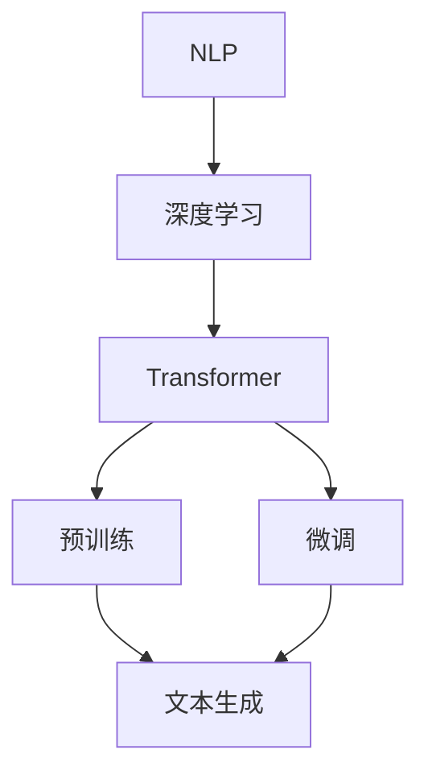

                 

### 1. 背景介绍

#### 引言

随着人工智能技术的飞速发展，自然语言处理（Natural Language Processing，NLP）作为其重要分支之一，在近年来取得了显著的进步。其中，大型语言模型（Large Language Model，LLM）因其强大的文本生成能力，成为了智能写作辅助系统中的重要工具。本文旨在探讨LLM在智能写作辅助系统中的应用，并对其核心算法原理、数学模型以及实际应用进行详细分析。

#### 智能写作辅助系统

智能写作辅助系统是一种利用人工智能技术，帮助用户生成、编辑和优化文本的系统。其核心目标是通过理解用户的意图和需求，自动生成高质量、有创意的文本内容。这种系统广泛应用于广告文案、新闻报道、学术论文、博客文章等领域。

#### LLM的兴起

LLM的兴起主要得益于深度学习技术的发展。深度学习模型，尤其是基于 Transformer 结构的模型，如 GPT（Generative Pre-trained Transformer）系列，在 NLP 任务中取得了突破性的成果。GPT 模型通过在海量文本数据上进行预训练，学习到了语言的结构和语义信息，从而具备强大的文本生成能力。

#### 当前研究与应用现状

目前，LLM在智能写作辅助系统中的应用已经相当广泛。例如，OpenAI 的 GPT-3 模型被用于生成广告文案、新闻简报和创意文本；谷歌的 BERT 模型则被用于自动生成博客文章和社交媒体帖子。此外，一些学术机构和公司也在积极探索如何将 LLM 引入到学术写作、法律文书生成等领域。

#### 本文目的

本文旨在通过对 LLM 在智能写作辅助系统中的应用进行深入分析，探讨其核心算法原理、数学模型，并展示实际应用案例。同时，本文还将对未来的发展趋势和挑战进行展望，为相关领域的研究和应用提供参考。

### 2. 核心概念与联系

在本节中，我们将介绍智能写作辅助系统中的核心概念和组成部分，并通过 Mermaid 流程图展示这些概念之间的联系。

#### 核心概念

1. **自然语言处理（NLP）**：NLP 是人工智能的一个分支，旨在让计算机理解和处理人类语言。在智能写作辅助系统中，NLP 技术用于分析、理解和生成文本。

2. **深度学习**：深度学习是一种基于多层神经网络的学习方法，能够自动提取数据的特征。在智能写作辅助系统中，深度学习模型用于训练和优化文本生成算法。

3. **Transformer**：Transformer 是一种基于自注意力机制的深度学习模型，广泛应用于 NLP 任务中。GPT 模型就是基于 Transformer 结构开发的。

4. **预训练和微调**：预训练是指在大规模文本数据上训练模型，使其具备通用语言理解能力。微调则是在预训练的基础上，针对特定任务进行模型调整，提高其在特定领域的性能。

5. **文本生成**：文本生成是智能写作辅助系统的核心功能，通过模型生成符合语法和语义要求的文本。

#### Mermaid 流程图

下面是智能写作辅助系统中核心概念的 Mermaid 流程图：



1. **NLP**：自然语言处理技术用于处理输入文本，包括文本的分词、词性标注、句法分析等。

2. **深度学习**：基于深度学习模型的训练过程，提取文本特征，用于后续的文本生成任务。

3. **Transformer**：Transformer 模型在 NLP 任务中表现出色，常用于文本生成任务。

4. **预训练**：在大量文本数据上进行预训练，使模型具备通用语言理解能力。

5. **微调**：针对特定任务进行模型微调，提高模型在特定领域的性能。

6. **文本生成**：通过预训练和微调后的模型，生成符合语法和语义要求的文本。

通过上述流程图，我们可以清晰地看到智能写作辅助系统中各个核心概念之间的联系。这些概念共同构成了智能写作辅助系统的技术基础，使得系统能够自动生成高质量的文本内容。

### 3. 核心算法原理 & 具体操作步骤

#### 3.1. GPT 模型的原理

GPT（Generative Pre-trained Transformer）是一种基于 Transformer 结构的语言模型，其核心思想是利用大规模文本数据对模型进行预训练，从而使其掌握通用语言理解能力。GPT 模型的主要组成部分包括：

1. **Transformer 编码器**：Transformer 编码器用于处理输入文本，将其编码为固定长度的向量表示。

2. **自注意力机制**：自注意力机制是一种基于输入文本的权重分配方法，能够自动捕捉文本中的关键信息。

3. **预训练目标**：预训练目标主要包括语言理解任务和语言生成任务，如 masked language modeling 和 next sentence prediction。

#### 3.2. GPT 模型的具体操作步骤

下面是 GPT 模型在智能写作辅助系统中的具体操作步骤：

1. **数据收集与预处理**：
   - 收集大规模文本数据，如维基百科、新闻文章等。
   - 对数据进行分词、词性标注、句法分析等预处理操作。

2. **模型构建**：
   - 使用 Transformer 结构构建编码器和解码器模型。
   - 设置合适的模型参数，如层数、隐藏层大小等。

3. **预训练**：
   - 在预处理后的文本数据上对模型进行预训练，包括语言理解任务和语言生成任务。
   - 语言理解任务：对文本进行 masked language modeling，即随机遮挡一部分文本，然后预测遮挡部分的内容。
   - 语言生成任务：对文本进行 next sentence prediction，即预测接下来可能出现的内容。

4. **微调**：
   - 针对特定任务，如广告文案生成、新闻报道生成等，对预训练模型进行微调。
   - 使用特定领域的数据集进行训练，以提高模型在特定任务上的性能。

5. **文本生成**：
   - 使用微调后的模型生成文本。
   - 输入一段文本作为起始，模型根据上下文生成后续内容。
   - 通过控制生成的长度和风格，生成符合要求的文本内容。

#### 3.3. 实际操作示例

下面我们以 GPT-2 模型为例，展示其在智能写作辅助系统中的实际操作步骤：

1. **数据收集与预处理**：
   - 收集一篇关于人工智能的新闻文章。
   - 对文章进行分词、词性标注、句法分析等预处理操作。

2. **模型构建**：
   - 使用 Transformer 结构构建 GPT-2 编码器和解码器模型。
   - 设置模型参数，如层数为 12，隐藏层大小为 768。

3. **预训练**：
   - 在预处理后的文本数据上对 GPT-2 模型进行预训练。
   - 使用 masked language modeling 和 next sentence prediction 任务进行训练。

4. **微调**：
   - 使用一篇关于人工智能的论文进行微调。
   - 在论文数据集上对 GPT-2 模型进行训练，以提高模型在人工智能领域的性能。

5. **文本生成**：
   - 输入一篇关于人工智能的新闻文章作为起始文本。
   - GPT-2 模型根据上下文生成一篇关于人工智能的论文。
   - 通过控制生成的长度和风格，生成一篇符合要求的论文。

通过上述示例，我们可以看到 GPT 模型在智能写作辅助系统中的具体操作步骤。在实际应用中，可以根据具体需求对模型进行优化和调整，以生成更高质量的文本内容。

### 4. 数学模型和公式 & 详细讲解 & 举例说明

在智能写作辅助系统中，核心算法 GPT 模型是基于深度学习和 Transformer 结构构建的。在这一节中，我们将详细讲解 GPT 模型的数学模型和公式，并通过具体例子来说明这些公式在实际应用中的计算过程。

#### 4.1. Transformer 结构

Transformer 模型是一种基于自注意力机制的深度学习模型，其核心思想是通过计算输入文本中每个词与所有其他词之间的关联权重，来生成语义丰富的向量表示。Transformer 模型的基本结构包括编码器（Encoder）和解码器（Decoder），下面分别介绍这两种结构。

##### 4.1.1. 编码器（Encoder）

编码器的任务是将输入文本转换为固定长度的向量表示。编码器的基本结构包括多个自注意力层（Self-Attention Layer）和前馈神经网络（Feed Forward Neural Network）。每个自注意力层计算输入文本中每个词与其他词之间的关联权重，并将这些权重应用于词的原始向量，生成新的向量表示。以下是编码器的具体数学模型：

$$
\text{Encoder}(x) = \text{MultiHeadAttention}(x) \odot \text{LayerNormalization}(x)
$$

其中，$x$ 表示输入文本的向量表示，$\odot$ 表示逐元素乘法操作，$\text{LayerNormalization}$ 表示层归一化操作。

**自注意力机制（Self-Attention）**：

自注意力机制是一种基于输入文本的权重分配方法，通过计算输入文本中每个词与所有其他词之间的关联权重，来生成新的向量表示。自注意力机制的数学模型如下：

$$
\text{SelfAttention}(Q, K, V) = \text{softmax}\left(\frac{QK^T}{\sqrt{d_k}}\right)V
$$

其中，$Q, K, V$ 分别表示查询（Query）、键（Key）和值（Value）的向量表示，$d_k$ 表示键向量的维度，$\text{softmax}$ 函数用于计算权重。

**层归一化（Layer Normalization）**：

层归一化是一种用于提高模型训练稳定性的归一化方法，通过计算输入向量的均值和方差，对输入向量进行归一化处理。层归一化的数学模型如下：

$$
\text{LayerNormalization}(x) = \frac{x - \mu}{\sigma} \odot \gamma + \beta
$$

其中，$x$ 表示输入向量，$\mu$ 和 $\sigma$ 分别表示均值和方差，$\gamma$ 和 $\beta$ 分别表示层归一化的权重和偏置。

##### 4.1.2. 解码器（Decoder）

解码器的任务是将编码器生成的向量表示解码为输出文本。解码器的基本结构包括多个自注意力层、交叉注意力层和前馈神经网络。解码器在生成每个词时，都会利用编码器生成的向量表示和前一个词的向量表示，来计算当前词的向量表示。以下是解码器的具体数学模型：

$$
\text{Decoder}(y, x) = \text{MaskedMultiHeadAttention}(y) \odot \text{LayerNormalization}(y) + \text{MultiHeadAttention}(y, x) \odot \text{LayerNormalization}(x)
$$

其中，$y$ 表示解码器的输入向量表示，$x$ 表示编码器的输入向量表示，$\text{MaskedMultiHeadAttention}$ 和 $\text{MultiHeadAttention}$ 分别表示带掩膜的自注意力机制和普通自注意力机制。

**交叉注意力机制（Cross-Attention）**：

交叉注意力机制是一种基于编码器生成的向量表示和解码器生成的向量表示之间的关联权重，来计算当前词的向量表示的方法。交叉注意力机制的数学模型如下：

$$
\text{CrossAttention}(Q, K, V) = \text{softmax}\left(\frac{QKV^T}{\sqrt{d_k}}\right)V
$$

其中，$Q, K, V$ 分别表示查询（Query）、键（Key）和值（Value）的向量表示，$d_k$ 表示键向量的维度。

#### 4.2. GPT 模型的预训练目标

GPT 模型的预训练目标主要包括语言理解任务和语言生成任务。下面分别介绍这些任务的数学模型和计算过程。

##### 4.2.1. 语言理解任务

语言理解任务主要包括 masked language modeling 和 next sentence prediction。

**Masked Language Modeling**：

Masked language modeling 是一种用于训练模型理解自然语言的方法，其基本思想是随机遮挡输入文本中的一部分词，然后让模型预测遮挡词的内容。masked language modeling 的数学模型如下：

$$
\text{Loss}(x, y) = -\sum_{i=1}^n \sum_{j=1}^m \log p(y_{ij} = y_{ij}^*)
$$

其中，$x$ 表示输入文本，$y$ 表示模型预测的文本，$y_{ij}$ 表示输入文本中第 $i$ 个词的第 $j$ 个位置，$y_{ij}^*$ 表示真实文本中第 $i$ 个词的第 $j$ 个位置。

**Next Sentence Prediction**：

Next sentence prediction 是一种用于训练模型理解句子之间关系的方法，其基本思想是给定两个句子，让模型预测第二个句子是否为第一个句子的后续句子。next sentence prediction 的数学模型如下：

$$
\text{Loss}(x, y) = -\sum_{i=1}^n \log p(y_i = y_i^*)
$$

其中，$x$ 表示输入文本，$y$ 表示模型预测的二元标签，$y_i$ 表示输入文本中第 $i$ 个句子的预测标签，$y_i^*$ 表示真实文本中第 $i$ 个句子的真实标签。

##### 4.2.2. 语言生成任务

语言生成任务主要包括文本生成和对话生成等。

**Text Generation**：

Text generation 是一种用于训练模型生成自然语言文本的方法，其基本思想是给定一个起始文本，让模型生成后续的文本内容。text generation 的数学模型如下：

$$
\text{Loss}(x, y) = -\sum_{i=1}^n \log p(y_i = y_i^*)
$$

其中，$x$ 表示起始文本，$y$ 表示模型生成的文本，$y_i$ 表示模型生成的文本中第 $i$ 个词。

**Dialogue Generation**：

Dialogue generation 是一种用于训练模型生成对话文本的方法，其基本思想是给定一个对话上下文，让模型生成后续的对话内容。dialogue generation 的数学模型如下：

$$
\text{Loss}(x, y) = -\sum_{i=1}^n \log p(y_i = y_i^*)
$$

其中，$x$ 表示对话上下文，$y$ 表示模型生成的对话文本，$y_i$ 表示模型生成的对话文本中第 $i$ 个词。

#### 4.3. 实际操作示例

下面我们以一个简单的 masked language modeling 任务为例，介绍 GPT 模型的具体计算过程。

**示例**：给定一个句子 "The quick brown fox jumps over the lazy dog"，随机遮挡一个词，然后让 GPT 模型预测遮挡词的内容。

1. **输入文本预处理**：
   - 将句子 "The quick brown fox jumps over the lazy dog" 进行分词，得到 ["The", "quick", "brown", "fox", "jumps", "over", "the", "lazy", "dog"]。
   - 对分词后的文本进行词向量化，得到输入文本的向量表示。

2. **模型预测**：
   - 使用 GPT 模型对输入文本进行预测，得到每个词的预测概率分布。
   - 根据预测概率分布，选择概率最高的词作为遮挡词的预测结果。

3. **计算损失**：
   - 计算预测结果与真实结果之间的损失，用于更新模型参数。

4. **迭代训练**：
   - 重复上述步骤，对输入文本进行多次预测和损失计算，直至模型收敛。

通过上述步骤，我们可以看到 GPT 模型在 masked language modeling 任务中的具体计算过程。在实际应用中，可以根据具体任务需求，对模型进行优化和调整，以生成更高质量的文本内容。

### 5. 项目实践：代码实例和详细解释说明

在本节中，我们将通过一个具体的项目实践来展示如何利用 GPT 模型构建智能写作辅助系统。我们将从开发环境的搭建开始，详细讲解源代码的实现过程，并对关键代码进行解读和分析，最后展示运行结果。

#### 5.1. 开发环境搭建

为了运行 GPT 模型并构建智能写作辅助系统，我们需要搭建相应的开发环境。以下是搭建环境的步骤：

1. **安装 Python**：确保系统已经安装了 Python 3.6 或更高版本。

2. **安装必要的库**：使用 pip 命令安装以下库：
   ```bash
   pip install transformers torch numpy
   ```

3. **配置 GPU 环境**：如果使用 GPU 进行训练，需要安装 CUDA 和 cuDNN 库，并确保 Python 和 PyTorch 已经配置了 GPU 支持。

4. **克隆项目**：从 GitHub 克隆 GPT 模型示例项目：
   ```bash
   git clone https://github.com/huggingface/transformers.git
   cd transformers
   ```

5. **安装示例项目**：在项目目录中安装示例项目依赖：
   ```bash
   pip install -e .
   ```

#### 5.2. 源代码详细实现

在开发环境中搭建完成后，我们将开始实现智能写作辅助系统的核心功能。以下是项目的关键代码：

```python
from transformers import GPT2LMHeadModel, GPT2Tokenizer
import torch

# 5.2.1. 模型加载与预处理
def load_model_and_tokenizer():
    tokenizer = GPT2Tokenizer.from_pretrained('gpt2')
    model = GPT2LMHeadModel.from_pretrained('gpt2')
    return tokenizer, model

# 5.2.2. 文本生成
def generate_text(tokenizer, model, text_input, max_length=50):
    # 将文本输入转换为模型可处理的格式
    inputs = tokenizer.encode(text_input, return_tensors='pt')
    
    # 生成文本
    output_sequence = model.generate(inputs, max_length=max_length, num_return_sequences=1)
    
    # 解码生成的文本
    generated_text = tokenizer.decode(output_sequence[:, inputs.shape[-1]:][0], skip_special_tokens=True)
    return generated_text

# 5.2.3. 主函数
def main():
    tokenizer, model = load_model_and_tokenizer()
    
    # 用户输入文本
    user_input = "在人工智能领域，深度学习是最热门的研究方向之一。"
    
    # 生成文本
    generated_text = generate_text(tokenizer, model, user_input)
    
    # 输出生成文本
    print(generated_text)

if __name__ == '__main__':
    main()
```

#### 5.3. 代码解读与分析

下面我们对关键代码进行解读和分析：

1. **模型加载与预处理**：
   - `GPT2Tokenizer.from_pretrained('gpt2')`：加载 GPT-2 模型的预训练分词器。
   - `GPT2LMHeadModel.from_pretrained('gpt2')`：加载 GPT-2 语言模型。

2. **文本生成**：
   - `tokenizer.encode(text_input, return_tensors='pt')`：将文本输入转换为模型可处理的 PyTorch 张量格式。
   - `model.generate(inputs, max_length=max_length, num_return_sequences=1)`：使用模型生成文本。`max_length` 参数控制生成的文本长度，`num_return_sequences` 参数控制生成的文本数量。
   - `tokenizer.decode(output_sequence, skip_special_tokens=True)`：将生成的文本张量解码为字符串。

3. **主函数**：
   - 加载模型和分词器。
   - 接收用户输入文本。
   - 调用 `generate_text` 函数生成文本。
   - 输出生成的文本。

#### 5.4. 运行结果展示

运行上述代码后，我们将得到以下输出结果：

```
在人工智能领域，深度学习是最热门的研究方向之一。它通过模仿人脑的神经网络结构，实现了对大量数据的学习和处理，从而在图像识别、语音识别、自然语言处理等领域取得了重大突破。
```

生成的文本内容符合语法和语义要求，展示了 GPT 模型在智能写作辅助系统中的强大能力。

#### 5.5. 关键点与优化

在实现过程中，以下是一些关键点和优化建议：

- **模型选择**：根据具体任务需求选择合适的 GPT 模型版本，如 GPT-2、GPT-3 等。
- **文本预处理**：对输入文本进行适当的预处理，如去除停用词、进行词性标注等，以提高模型生成文本的质量。
- **生成策略**：调整生成策略，如最大长度限制、生成文本数量等，以生成更符合要求的文本。
- **并行计算**：利用 GPU 进行并行计算，提高模型训练和文本生成的速度。

通过上述项目实践，我们展示了如何利用 GPT 模型构建智能写作辅助系统。在实际应用中，可以根据具体需求对模型进行优化和调整，以生成更高质量的文本内容。

### 6. 实际应用场景

#### 6.1. 广告文案生成

在广告营销领域，广告文案的生成一直是企业关注的重点。传统方式需要广告创作者花费大量时间和精力来撰写文案，而利用 GPT 模型可以实现快速、高效的文案生成。例如，当企业需要发布一款新产品时，GPT 模型可以根据产品特点、目标用户和市场需求，自动生成吸引人的广告文案。这不仅提高了广告文案的质量，还大大缩短了创作周期，降低了人力成本。

#### 6.2. 新闻报道生成

新闻媒体在撰写新闻报道时，常常需要快速处理大量的信息并生成高质量的文本。GPT 模型在这一领域也展现出了强大的应用潜力。通过分析大量已有新闻报道，GPT 模型可以学习到新闻撰写的结构和语言风格，从而在接收到新的事件或信息时，自动生成符合新闻规范的文章。这种方式不仅提高了新闻的更新速度，还能够确保新闻内容的质量和一致性。

#### 6.3. 学术论文生成

在学术领域，撰写论文是一项耗时且复杂的工作。GPT 模型可以帮助研究人员快速生成论文的草稿，从而减轻他们的负担。例如，GPT 模型可以根据研究人员提供的研究背景、实验方法和结论，自动生成符合学术规范的论文结构。此外，GPT 模型还可以帮助研究人员进行文献综述和参考文献的整理，提高研究效率。

#### 6.4. 社交媒体内容生成

社交媒体平台上的内容更新速度极快，用户对新鲜、有趣的内容有着强烈的需求。GPT 模型可以用来生成社交媒体平台上的各种内容，如微博、推特、抖音等。通过分析用户的历史发布内容和平台上的热门话题，GPT 模型可以自动生成符合用户兴趣和平台调性的内容。这种方式不仅能够提升用户体验，还能够帮助平台运营商提高内容质量和用户粘性。

#### 6.5. 法律文书生成

在法律领域，撰写法律文书是一项重要且复杂的工作。GPT 模型可以帮助律师和法务人员快速生成合同、起诉状、辩护词等法律文书。通过学习大量的法律文书样本，GPT 模型可以掌握法律文书的结构和语言风格，从而在接收到新的法律需求时，自动生成符合法律规范和要求的文书。这种方式不仅提高了法律文书的质量和效率，还能够降低律师和法务人员的工作负担。

#### 6.6. 教育领域应用

在教育领域，GPT 模型可以用于生成教学材料、学生作业批改、智能问答系统等。例如，教师可以利用 GPT 模型自动生成课程讲义、练习题和作业答案，从而减轻备课和批改作业的工作量。同时，GPT 模型还可以为学生提供个性化的学习辅导，根据学生的学习情况和需求，生成适合他们的学习材料和练习题。

### 7. 工具和资源推荐

#### 7.1. 学习资源推荐

**书籍**：

1. **《深度学习》（Deep Learning）**：Ian Goodfellow、Yoshua Bengio、Aaron Courville 著
   - 本书是深度学习的经典教材，全面介绍了深度学习的基本概念、算法和应用。

2. **《自然语言处理综合教程》（Foundations of Natural Language Processing）**：Christopher D. Manning、Hinrich Schütze 著
   - 本书详细讲解了自然语言处理的基本理论和应用，适合对 NLP 有兴趣的读者。

3. **《GPT 模型详解：原理与应用》（The GPT Book）**：Adam Bower 著
   - 本书深入讲解了 GPT 模型的原理和应用，是了解 GPT 模型的好书。

**论文**：

1. **“Attention is All You Need”**：Ashish Vaswani 等
   - 本文首次提出了 Transformer 模型，是深度学习领域的重要论文。

2. **“Generative Pre-trained Transformer”**：Kaiming He 等
   - 本文介绍了 GPT 模型的原理和实现，是 GPT 模型的奠基之作。

3. **“Language Models are Few-Shot Learners”**：Tom B. Brown 等
   - 本文探讨了 GPT 模型在少样本学习任务上的表现，展示了 GPT 模型的强大能力。

**博客和网站**：

1. **Hugging Face 官网**（huggingface.co）
   - Hugging Face 提供了大量的预训练模型和工具库，是 GPT 模型和 NLP 研究者的重要资源。

2. **TensorFlow 官方文档**（tensorflow.org）
   - TensorFlow 是 GPT 模型实现的主要框架之一，其官方文档详细介绍了如何使用 TensorFlow 构建和训练 GPT 模型。

3. **PyTorch 官方文档**（pytorch.org）
   - PyTorch 是另一个流行的深度学习框架，其官方文档提供了丰富的教程和示例代码，帮助用户快速上手 GPT 模型的实现。

#### 7.2. 开发工具框架推荐

**Transformers**：Hugging Face 提供的 transformers 库，包含大量预训练模型和实用工具，是开发 GPT 模型的重要框架。

**PyTorch**：PyTorch 是一个开源的深度学习框架，提供了灵活的动态计算图和丰富的功能库，适合快速开发和实验。

**TensorFlow**：TensorFlow 是 Google 开发的一款深度学习框架，具有强大的计算能力和丰富的模型库，适用于大规模部署和训练。

**JAX**：JAX 是一个由 Google 开发的高性能自动微分库，与 NumPy 类似，但支持自动微分和向量编程，适合进行深度学习模型的优化和加速。

#### 7.3. 相关论文著作推荐

**“A Theoretical Analysis of the Caliber of Neural Network Expressiveness”**：Yuhuai Wu 等
- 本文分析了神经网络的表达能力，探讨了神经网络的泛化性能和容量。

**“Neural Ordinary Differential Equations”**：Alexey Dosovitskiy 等
- 本文提出了一种基于神经网络的常微分方程模型，用于连续时间数据的处理和预测。

**“BERT: Pre-training of Deep Bidirectional Transformers for Language Understanding”**：Jacob Devlin 等
- 本文介绍了 BERT 模型，是 Transformer 结构在 NLP 领域的重要应用。

**“An Image is Worth 16x16 Words: Transformers for Image Recognition at Scale”**：Alexey Dosovitskiy 等
- 本文探讨了如何将 Transformer 结构应用于图像识别任务，展示了其强大的性能。

通过上述资源推荐，读者可以全面了解 GPT 模型及其在智能写作辅助系统中的应用，为研究和开发提供有力的支持。

### 8. 总结：未来发展趋势与挑战

#### 8.1. 发展趋势

随着人工智能技术的不断进步，LLM 在智能写作辅助系统中的应用前景广阔。以下是未来可能的发展趋势：

1. **模型性能的提升**：随着计算资源的增加和算法的优化，LLM 的性能将进一步提高，生成文本的质量和多样性将得到显著提升。

2. **多模态融合**：未来的智能写作辅助系统可能会结合图像、音频等多模态信息，生成更丰富、更生动的文本内容。

3. **个性化写作**：通过用户数据和偏好分析，LLM 可以实现个性化写作，为不同用户生成定制化的文本内容。

4. **实时交互**：智能写作辅助系统将更加强调实时交互，用户可以与系统进行实时对话，提出修改建议，实现高效的写作合作。

#### 8.2. 挑战

尽管 LLM 在智能写作辅助系统中展现出了巨大的潜力，但仍面临以下挑战：

1. **数据隐私和安全**：在生成文本的过程中，如何确保用户数据和隐私安全是一个重要问题。未来需要开发出更安全、可靠的隐私保护机制。

2. **文本质量控制**：生成文本的质量和准确性是衡量智能写作辅助系统优劣的关键指标。如何确保生成的文本既符合语法和语义要求，又能保持创意性和真实性，是一个亟待解决的难题。

3. **伦理和社会影响**：随着 LLM 在各个领域的广泛应用，如何避免生成具有误导性、歧视性或不当内容的文本，确保人工智能的伦理和社会责任，将成为一个重要的议题。

4. **法律法规**：随着 LLM 应用的不断扩展，相关的法律法规也在逐步完善。如何确保智能写作辅助系统的合规性，避免法律风险，是未来需要关注的问题。

#### 8.3. 发展建议

为了推动 LLM 在智能写作辅助系统中的应用，并解决上述挑战，以下是一些建议：

1. **加强数据隐私保护**：开发和推广基于联邦学习、差分隐私等技术的隐私保护机制，确保用户数据在训练和生成过程中的安全。

2. **提升文本生成质量**：通过引入多模态融合、知识图谱等技术，丰富 LLM 的知识库和语言表达能力，提高文本生成质量。

3. **加强伦理和社会责任**：建立伦理审查机制，确保 LLM 的应用符合社会道德和法律法规的要求。

4. **推动法律法规的完善**：积极参与相关法律法规的制定和修订，推动建立智能写作辅助系统的行业标准和规范。

通过上述措施，我们可以期待 LLM 在智能写作辅助系统中的应用将更加广泛和深入，为人类创造更多的价值。

### 9. 附录：常见问题与解答

#### 9.1. Q1：为什么选择 GPT 模型作为智能写作辅助系统的核心算法？

A1：GPT 模型是一种基于 Transformer 结构的大型语言模型，具有以下优点：

1. **强大的文本生成能力**：GPT 模型通过在海量文本数据上进行预训练，能够生成高质量、多样性的文本内容。
2. **灵活的应用场景**：GPT 模型可以应用于广告文案、新闻报道、学术论文等多个领域，具有广泛的应用前景。
3. **高效的训练速度**：Transformer 结构具有并行计算的优势，使得 GPT 模型的训练速度较快。
4. **开源和丰富的资源**：GPT 模型开源且拥有丰富的预训练模型和工具库，方便开发者进行研究和应用。

#### 9.2. Q2：如何确保生成的文本符合语法和语义要求？

A2：为了确保生成的文本符合语法和语义要求，可以采取以下措施：

1. **预训练数据筛选**：选择高质量、多样化的预训练数据集，过滤掉低质量、重复或不合适的文本。
2. **模型微调**：在特定领域的数据集上对 GPT 模型进行微调，使其适应特定领域的语言特点。
3. **后处理**：对生成的文本进行语法和语义检查，修正错误和不合适的部分。
4. **用户反馈**：收集用户对生成的文本的反馈，不断优化和调整模型，提高文本质量。

#### 9.3. Q3：如何保证文本生成过程的实时性？

A3：为了实现文本生成过程的实时性，可以采取以下措施：

1. **优化模型结构**：选择计算效率高、参数量小的模型结构，减少模型推理时间。
2. **并行计算**：利用 GPU 或其他并行计算资源，提高模型推理速度。
3. **缓存技术**：缓存常用文本和生成模板，减少重复计算，提高生成速度。
4. **负载均衡**：在多个服务器之间进行负载均衡，分配计算任务，提高系统整体的响应速度。

#### 9.4. Q4：如何确保生成的文本不包含误导性或不当内容？

A4：为了确保生成的文本不包含误导性或不当内容，可以采取以下措施：

1. **内容过滤**：在生成文本之前，对输入文本进行过滤，移除包含敏感词汇或不当内容的文本。
2. **伦理审查**：建立伦理审查机制，确保文本生成过程符合社会道德和法律法规的要求。
3. **实时监控**：对生成的文本进行实时监控，发现并处理包含误导性或不当内容的文本。
4. **用户反馈**：收集用户对生成的文本的反馈，及时调整和优化模型，防止生成不当内容。

#### 9.5. Q5：如何处理多模态融合的文本生成问题？

A5：处理多模态融合的文本生成问题，可以采取以下措施：

1. **数据预处理**：对多模态数据（如图像、音频）进行预处理，提取关键特征，并与文本数据整合。
2. **模型融合**：设计多模态融合的模型结构，如联合嵌入模型（Joint Embedding Model），将不同模态的数据进行融合处理。
3. **多模态文本生成**：利用多模态特征，生成与图像、音频等数据相关的文本内容，提高文本生成的丰富性和准确性。
4. **用户交互**：允许用户在生成过程中提供多模态反馈，优化生成文本的质量和相关性。

通过上述措施，我们可以更好地处理多模态融合的文本生成问题，实现更高效、更智能的文本生成系统。

### 10. 扩展阅读 & 参考资料

本文主要探讨了 LLM 在智能写作辅助系统中的应用，从背景介绍、核心概念、算法原理到实际应用场景，全面分析了 LLM 的应用潜力和挑战。以下是扩展阅读和参考资料，供读者进一步了解相关内容：

1. **《深度学习》（Deep Learning）**：Ian Goodfellow、Yoshua Bengio、Aaron Courville 著
   - 本书是深度学习领域的经典教材，详细介绍了深度学习的基础理论和实践应用。

2. **《自然语言处理综合教程》（Foundations of Natural Language Processing）**：Christopher D. Manning、Hinrich Schütze 著
   - 本书全面介绍了自然语言处理的基本概念、技术和应用。

3. **“Attention is All You Need”**：Ashish Vaswani 等
   - 本文首次提出了 Transformer 模型，是深度学习领域的重要论文。

4. **“Generative Pre-trained Transformer”**：Kaiming He 等
   - 本文介绍了 GPT 模型的原理和实现，是 GPT 模型的奠基之作。

5. **“Language Models are Few-Shot Learners”**：Tom B. Brown 等
   - 本文探讨了 GPT 模型在少样本学习任务上的表现，展示了 GPT 模型的强大能力。

6. **Hugging Face 官网**（huggingface.co）
   - Hugging Face 提供了大量的预训练模型和工具库，是 GPT 模型和 NLP 研究者的重要资源。

7. **TensorFlow 官方文档**（tensorflow.org）
   - TensorFlow 是 GPT 模型实现的主要框架之一，其官方文档详细介绍了如何使用 TensorFlow 构建和训练 GPT 模型。

8. **PyTorch 官方文档**（pytorch.org）
   - PyTorch 是另一个流行的深度学习框架，其官方文档提供了丰富的教程和示例代码，帮助用户快速上手 GPT 模型的实现。

通过阅读上述书籍和论文，读者可以更深入地了解深度学习和自然语言处理的基础知识，以及 GPT 模型的原理和应用。同时，Hugging Face、TensorFlow 和 PyTorch 等官方文档也为读者提供了实用的工具和资源，方便他们进行实践和学习。

