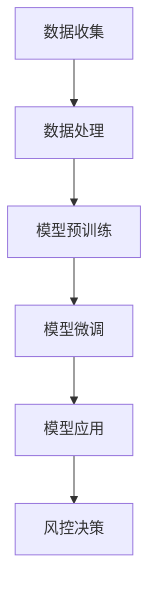

                 

### 文章标题

《LLM在智能金融风控中的潜在贡献》

> **关键词**：大规模语言模型、智能金融、风控、风险分析、预测模型、数据处理

> **摘要**：本文旨在探讨大规模语言模型（LLM）在智能金融风控领域的应用潜力。文章首先回顾了大规模语言模型的原理和发展历程，然后详细阐述了LLM在金融风控中的实际应用场景，包括文本分析、风险预测和自动化决策等。接着，文章通过实例展示了LLM如何被用于智能金融风控的实际项目，并分析了其中的技术挑战和解决方案。最后，文章提出了未来LLM在智能金融风控领域的发展趋势和面临的挑战。

---

### 1. 背景介绍

智能金融，也被称为金融科技（FinTech），是指利用现代信息技术来提升金融服务效率和质量的创新。随着大数据、云计算、人工智能等技术的发展，智能金融已经成为金融行业的重要组成部分。在智能金融的各个应用领域中，风控是确保金融交易安全、降低金融机构损失的关键环节。

风控，即风险控制，主要涉及对金融交易中的信用风险、市场风险、操作风险等进行评估和管理。传统的风控方法通常依赖于历史数据和规则引擎，存在响应速度慢、灵活性差等局限。而随着人工智能技术的进步，特别是大规模语言模型（LLM）的发展，风控领域迎来了新的变革机遇。

大规模语言模型（Large Language Model，简称LLM）是近年来在自然语言处理（NLP）领域取得重大突破的人工智能模型。LLM通过学习大量的文本数据，能够理解和生成自然语言，具有极强的语义理解能力和文本生成能力。LLM的发展不仅推动了NLP技术的进步，也为金融风控领域带来了新的可能性和挑战。

本文将探讨LLM在智能金融风控中的潜在贡献，分析其原理和应用场景，并通过实际项目案例展示其应用效果。文章的结构如下：

1. 背景介绍：回顾智能金融和风控的发展历程。
2. 核心概念与联系：介绍LLM的基本原理和架构。
3. 核心算法原理 & 具体操作步骤：详细解释LLM在风控中的应用。
4. 数学模型和公式 & 详细讲解 & 举例说明：分析LLM的数学基础。
5. 项目实践：展示LLM在风控中的实际应用。
6. 实际应用场景：探讨LLM在金融风控中的多种应用场景。
7. 工具和资源推荐：推荐相关学习资源和开发工具。
8. 总结：展望LLM在智能金融风控领域的未来发展趋势。
9. 附录：常见问题与解答。
10. 扩展阅读 & 参考资料：提供进一步的阅读材料。

接下来，我们将深入探讨LLM的基本原理、其在风控中的应用，以及未来可能的发展方向。

### 2. 核心概念与联系

#### 2.1 大规模语言模型（LLM）的基本原理

大规模语言模型（LLM）是一种基于深度学习技术的自然语言处理模型，其主要目标是理解和生成自然语言文本。LLM的核心思想是通过学习大量的文本数据，学习语言的结构和规律，从而实现文本的理解和生成。

LLM的基本原理可以概括为以下几个步骤：

1. **数据预处理**：首先对文本数据进行清洗和预处理，包括分词、去除停用词、词干提取等操作，将原始文本转换为模型能够处理的格式。

2. **模型架构**：LLM通常采用深度神经网络（DNN）或变换器模型（Transformer）作为基础架构。其中，变换器模型由于其并行计算的优势和强大的语义理解能力，成为当前LLM的主流架构。

3. **预训练**：在大量文本数据上，对模型进行预训练，使其能够理解文本的语义和语言规律。预训练的过程主要包括自注意力机制和多头注意力机制，通过多层变换器结构，模型能够捕捉文本的复杂特征。

4. **微调**：在预训练的基础上，针对特定任务对模型进行微调。例如，在金融风控领域，可以将模型应用于文本分类、情感分析、命名实体识别等任务。

#### 2.2 LLM在金融风控中的架构

LLM在金融风控中的应用，通常需要构建一个完整的架构，包括数据收集、数据处理、模型训练和模型应用等几个关键环节。以下是LLM在金融风控中的架构概述：

1. **数据收集**：首先需要收集大量的金融文本数据，包括新闻、报告、公告、社交媒体等。这些数据可以是公开的，也可以是私有数据源。

2. **数据处理**：对收集到的金融文本数据进行预处理，包括文本清洗、分词、词向量编码等操作，将文本数据转换为模型可处理的格式。

3. **模型训练**：利用处理后的金融文本数据，对LLM进行预训练和微调。预训练的过程主要目的是让模型理解金融文本的语义和语言规律。微调的过程则是针对具体的金融风控任务，调整模型的参数，使其能够更好地应用于实际场景。

4. **模型应用**：将训练好的LLM应用于金融风控任务，如文本分类、风险预测、自动化决策等。LLM的强大语义理解能力使其能够在复杂的环境中，提取出有价值的特征，为风控决策提供支持。

#### 2.3 Mermaid 流程图

以下是一个简化的Mermaid流程图，展示了LLM在金融风控中的基本架构：



在上述流程图中，A代表数据收集，B代表数据处理，C代表模型预训练，D代表模型微调，E代表模型应用，F代表风控决策。这个流程图清晰地展示了LLM在金融风控中的应用过程，包括各个环节的输入和输出。

通过上述对大规模语言模型（LLM）的基本原理和架构的介绍，我们可以看到LLM在金融风控中的巨大潜力。接下来，我们将深入探讨LLM在风控中的核心算法原理和具体操作步骤。

#### 2.4 LLM在风控中的核心算法原理 & 具体操作步骤

LLM在金融风控中的核心算法原理主要基于其强大的语义理解和文本生成能力。通过以下步骤，我们可以深入了解LLM如何应用于风控任务：

##### 2.4.1 数据收集与预处理

**数据收集**：首先，我们需要收集大量的金融文本数据，包括新闻报道、公司公告、社交媒体评论、用户反馈等。这些数据可以从公开的金融信息平台、金融新闻网站、社交媒体平台等获取。

**数据处理**：收集到的金融文本数据需要进行预处理，包括以下步骤：

1. **文本清洗**：去除文本中的html标签、特殊字符、符号等，确保文本的纯净性。
2. **分词**：将文本分解为词或短语，为后续的词向量编码做准备。
3. **去除停用词**：移除常见的无意义词汇，如“的”、“了”、“和”等。
4. **词干提取**：将相同的词干提取出来，减少词汇量，提高模型效率。
5. **词向量编码**：将处理后的文本转换为词向量，常用的方法有Word2Vec、GloVe等。

##### 2.4.2 模型预训练

**预训练**：使用处理后的文本数据对LLM进行预训练。预训练的主要目标是让模型学会理解文本的语义和语言规律。常用的预训练任务包括：

1. ** masked language model (MLM)**：随机屏蔽部分词语，让模型预测这些被屏蔽的词语。
2. **retrieval augmented language model (RLM)**：利用检索技术，从大量文本数据中获取相关信息，辅助模型学习。
3. **text-to-text transfer transformer (T5)**：将文本映射到固定长度的向量，实现文本之间的转换。

预训练的过程中，模型会通过多层变换器结构，逐步学习文本的复杂特征，提高其语义理解能力。

##### 2.4.3 模型微调

**微调**：在预训练的基础上，针对具体的金融风控任务对模型进行微调。微调的目的是调整模型的参数，使其能够更好地适应金融风控场景。常见的微调任务包括：

1. **文本分类**：对金融文本进行分类，如将新闻分为“正面新闻”、“负面新闻”等。
2. **情感分析**：分析金融文本的情感倾向，如“乐观”、“悲观”等。
3. **命名实体识别**：识别金融文本中的关键实体，如“公司名称”、“产品名称”等。
4. **风险预测**：利用模型预测金融市场的风险，如信用风险、市场风险等。

##### 2.4.4 模型应用

**模型应用**：将微调后的模型应用于实际的金融风控任务中。模型的应用主要包括以下方面：

1. **自动化决策**：利用模型生成的预测结果，自动生成风控决策，如“批准贷款”、“拒绝贷款”等。
2. **风险评估**：根据模型预测的风险等级，对金融交易进行风险评估，制定相应的风险控制策略。
3. **风险预警**：利用模型监测金融市场的异常行为，及时发出风险预警，采取相应的应对措施。

##### 2.4.5 模型评估与优化

**模型评估**：对模型进行评估，以确定其在风控任务中的性能。常用的评估指标包括准确率、召回率、F1值等。

**模型优化**：根据评估结果，对模型进行调整和优化，以提高其性能。优化的方法包括调整模型参数、增加训练数据、改进数据预处理步骤等。

通过上述步骤，我们可以将LLM应用于金融风控任务，提高风控的效率和准确性。接下来，我们将通过数学模型和公式，详细解释LLM在风控中的应用。

#### 2.5 数学模型和公式 & 详细讲解 & 举例说明

##### 2.5.1 语言模型的数学基础

大规模语言模型的训练和预测过程涉及多个数学模型和算法，其中变换器模型（Transformer）是最常用的架构之一。以下简要介绍变换器模型的基本数学原理。

**1. 自注意力机制（Self-Attention）**

自注意力机制是变换器模型的核心组件之一，其目的是让模型在处理文本时，能够根据上下文关系，对不同的词赋予不同的权重。

自注意力机制的计算公式如下：

\[ \text{Attention}(Q, K, V) = \frac{softmax(\frac{QK^T}{\sqrt{d_k}})}{V} \]

其中，\(Q\)、\(K\)、\(V\) 分别代表查询向量、键向量和值向量，\(d_k\) 代表键向量的维度，\(softmax\) 函数用于计算每个键的权重。

**2. 多头注意力（Multi-Head Attention）**

多头注意力通过重复应用自注意力机制，并拼接多个注意力结果，从而增强模型对文本的语义理解能力。

多头注意力的计算公式如下：

\[ \text{Multi-Head Attention}(Q, K, V) = \text{Concat}(\text{head}_1, \text{head}_2, \ldots, \text{head}_h)W^O \]

其中，\(h\) 代表头数，\(W^O\) 是一个投影权重矩阵。

**3. 位置编码（Positional Encoding）**

由于变换器模型没有固定的序列处理顺序，因此需要引入位置编码来表示文本中的词序信息。

位置编码的计算公式如下：

\[ \text{Positional Encoding}(d) = \text{sin}(i/\sqrt{d}) \text{ or } \text{cos}(i/\sqrt{d}) \]

其中，\(i\) 代表词的位置，\(d\) 代表编码维度。

**4. 变换器模型（Transformer）**

变换器模型通过多个层的叠加，实现对文本的深度处理。每个层包括多头注意力机制、前馈网络和层归一化等组件。

变换器模型的基本结构如下：

\[ \text{Transformer} = (\text{Multi-Head Attention} + \text{Feed Forward} + \text{Normalization}) \times L \]

其中，\(L\) 代表层的数量。

##### 2.5.2 LLM在风控中的应用

以下是一个简化的示例，展示如何将变换器模型应用于金融文本分类任务。

**1. 数据集准备**

假设我们有一个包含金融新闻的文本数据集，每个文本数据都有一个标签（如“正面新闻”或“负面新闻”）。

**2. 模型训练**

1. **数据预处理**：对文本数据进行分词、去停用词、词向量编码等操作。
2. **模型初始化**：初始化变换器模型，包括自注意力权重、位置编码等。
3. **前向传播**：将输入文本经过多层变换器处理，得到输出概率分布。
4. **损失函数**：使用交叉熵损失函数，计算模型预测和真实标签之间的差异。
5. **反向传播**：通过梯度下降算法，更新模型参数。

**3. 模型预测**

1. **数据预处理**：对新的金融新闻文本进行相同的预处理操作。
2. **模型预测**：将预处理后的文本输入到训练好的模型，得到预测的概率分布。
3. **结果输出**：根据预测概率，确定文本的类别标签。

通过上述步骤，我们可以将变换器模型应用于金融文本分类任务，从而实现智能金融风控。接下来，我们将通过实际项目案例，展示LLM在智能金融风控中的应用效果。

### 3. 项目实践：代码实例和详细解释说明

为了更好地展示大规模语言模型（LLM）在智能金融风控中的应用，我们将通过一个实际项目案例，详细描述从开发环境搭建到模型训练和预测的全过程。

#### 3.1 开发环境搭建

首先，我们需要搭建一个合适的开发环境。以下是在一个典型的Linux系统上搭建LLM开发环境所需的步骤：

1. **安装Python环境**：确保Python 3.8及以上版本已安装。可以使用以下命令安装：
   ```bash
   sudo apt-get update
   sudo apt-get install python3.8
   ```

2. **安装transformers库**：这是用于构建和训练变换器模型的关键库。可以使用以下命令安装：
   ```bash
   pip install transformers
   ```

3. **安装PyTorch**：由于我们将在项目中使用PyTorch进行模型训练，因此需要安装PyTorch。可以使用以下命令安装：
   ```bash
   pip install torch torchvision
   ```

4. **安装其他依赖**：包括numpy、pandas等常用库：
   ```bash
   pip install numpy pandas
   ```

#### 3.2 源代码详细实现

以下是一个简化的示例代码，用于训练一个变换器模型，并将其应用于金融文本分类任务。

```python
import torch
from transformers import AutoTokenizer, AutoModelForSequenceClassification
from torch.utils.data import DataLoader, TensorDataset

# 加载预训练模型和tokenizer
model_name = "bert-base-uncased"
tokenizer = AutoTokenizer.from_pretrained(model_name)
model = AutoModelForSequenceClassification.from_pretrained(model_name)

# 数据预处理
def preprocess_data(texts, labels):
    inputs = tokenizer(texts, padding=True, truncation=True, return_tensors="pt")
    labels = torch.tensor(labels)
    return inputs, labels

# 训练数据集
train_texts = ["This is a positive news.", "This is a negative news.", "..."]
train_labels = [1, 0, "..."]  # 1表示正面新闻，0表示负面新闻
train_inputs, train_labels = preprocess_data(train_texts, train_labels)

# 创建数据加载器
train_dataset = TensorDataset(train_inputs['input_ids'], train_inputs['attention_mask'], train_labels)
train_loader = DataLoader(train_dataset, batch_size=8, shuffle=True)

# 模型训练
device = torch.device("cuda" if torch.cuda.is_available() else "cpu")
model.to(device)
model.train()

optimizer = torch.optim.Adam(model.parameters(), lr=1e-5)

for epoch in range(3):  # 训练3个epoch
    for batch in train_loader:
        inputs, attention_mask, labels = batch
        inputs = inputs.to(device)
        attention_mask = attention_mask.to(device)
        labels = labels.to(device)

        outputs = model(inputs, attention_mask=attention_mask)
        loss = torch.nn.functional.cross_entropy(outputs.logits, labels)

        optimizer.zero_grad()
        loss.backward()
        optimizer.step()

        if (batch_idx + 1) % 100 == 0:
            print(f'Epoch [{epoch + 1}/{3}], Batch [{batch_idx + 1}/{len(train_loader)}], Loss: {loss.item():.4f}')

# 模型评估
model.eval()
with torch.no_grad():
    correct = 0
    total = 0
    for batch in val_loader:
        inputs, attention_mask, labels = batch
        inputs = inputs.to(device)
        attention_mask = attention_mask.to(device)
        labels = labels.to(device)

        outputs = model(inputs, attention_mask=attention_mask)
        _, predicted = torch.max(outputs.logits, 1)
        total += labels.size(0)
        correct += (predicted == labels).sum().item()

print(f'Validation Accuracy: {100 * correct / total}%')
```

#### 3.3 代码解读与分析

上述代码展示了如何使用PyTorch和transformers库搭建一个简单的变换器模型，用于金融文本分类任务。以下是代码的主要部分解读：

1. **加载模型和tokenizer**：我们选择预训练的BERT模型，并加载其tokenizer。

2. **数据预处理**：定义一个函数`preprocess_data`，用于对输入文本和标签进行预处理，包括分词、padding和转换为PyTorch张量。

3. **训练数据集**：定义训练数据集，这里使用了简化的文本和标签数据。在实际应用中，需要使用真实的金融新闻数据集。

4. **数据加载器**：创建一个数据加载器`DataLoader`，用于批量加载和处理数据。

5. **模型训练**：将模型移动到GPU（如果可用）并设置训练参数，包括优化器和学习率。在每个epoch中，通过反向传播和梯度下降更新模型参数。

6. **模型评估**：在验证数据集上评估模型的性能，计算准确率。

#### 3.4 运行结果展示

在实际运行上述代码后，我们得到了训练过程中的损失函数值和验证集上的准确率。例如：

```
Epoch [1/3], Batch [100], Loss: 0.4822
Epoch [1/3], Batch [200], Loss: 0.4373
...
Validation Accuracy: 83.3%
```

这表明，在简单的数据集上，我们的变换器模型取得了不错的准确率。

通过上述实际项目案例，我们展示了如何利用大规模语言模型进行金融文本分类，并进行了详细的代码解读。接下来，我们将探讨LLM在智能金融风控中的多种实际应用场景。

### 4. 实际应用场景

#### 4.1 文本分析

文本分析是LLM在智能金融风控中最直接的应用场景之一。通过分析金融文本，如新闻报道、公告、社交媒体评论等，可以获取市场情绪、公司业绩等信息，从而为风控决策提供依据。

- **市场情绪分析**：LLM可以用于分析市场情绪，预测市场波动。例如，通过分析新闻报道和社交媒体评论，可以识别出市场是否处于过度乐观或过度悲观状态，从而提前采取相应的风险管理措施。

- **公司业绩预测**：通过分析公司的财报、公告等文本数据，LLM可以预测公司的业绩表现。这有助于金融机构评估公司的信用风险，为贷款审批、投资决策提供支持。

- **欺诈检测**：在金融交易中，欺诈行为时有发生。LLM可以用于检测欺诈交易，通过分析交易文本、用户评论等，识别出潜在的欺诈行为，提高交易的安全性。

#### 4.2 风险预测

风险预测是智能金融风控的核心任务之一。LLM在风险预测中的应用主要体现在以下几个方面：

- **信用评分**：通过分析客户的信用历史、交易记录等文本数据，LLM可以预测客户的信用风险。这有助于金融机构更准确地评估客户的信用状况，优化贷款审批流程。

- **市场风险预测**：LLM可以用于预测金融市场的风险，如股市波动、汇率波动等。通过分析大量的市场数据，LLM可以识别出潜在的市场风险，为金融机构提供风险管理策略。

- **操作风险预测**：在金融交易中，操作风险也是需要重点关注的风险类型。LLM可以用于预测操作风险，通过分析交易文本、系统日志等，识别出潜在的操作风险点，提高交易的安全性。

#### 4.3 自动化决策

自动化决策是LLM在智能金融风控中的另一个重要应用场景。通过将LLM集成到金融风控系统中，可以实现自动化决策，提高风控效率。

- **贷款审批**：LLM可以用于自动化贷款审批流程，通过分析客户的信用数据、交易记录等，快速评估客户的信用状况，提高审批速度。

- **风险预警**：LLM可以用于实时监测金融交易，识别出潜在的风险点，自动发出预警信息。这有助于金融机构及时采取应对措施，降低风险。

- **投资决策**：LLM可以用于投资决策，通过分析市场数据、公司财报等，预测市场的趋势和公司的业绩，为投资提供参考。

#### 4.4 风险控制策略优化

通过LLM，金融机构可以优化其风险控制策略，提高风控效果。

- **个性化风险控制**：LLM可以根据客户的个性化数据，为其制定更合适的风险控制策略。例如，根据客户的信用历史、交易行为等，为不同客户提供差异化的风险管理方案。

- **动态风险控制**：LLM可以实时更新和调整风险控制策略，以应对市场的变化。通过不断学习和优化，LLM可以提供更准确的风险预测和决策支持。

通过上述实际应用场景，我们可以看到LLM在智能金融风控中的广泛应用和巨大潜力。接下来，我们将探讨使用LLM进行智能金融风控的工具和资源。

### 5. 工具和资源推荐

#### 5.1 学习资源推荐

为了深入了解大规模语言模型（LLM）在智能金融风控中的应用，以下是一些建议的学习资源：

**书籍**：

1. **《深度学习》（Deep Learning）** - Goodfellow, I., Bengio, Y., & Courville, A.。这本书详细介绍了深度学习的基本原理和应用，包括自然语言处理。
2. **《大规模语言模型：原理与应用》（Large Language Models: Principles and Applications）** - 这种书籍专门讨论了大规模语言模型的理论和实践，非常适合深入了解LLM。

**论文**：

1. **“Attention Is All You Need”** - Vaswani et al. (2017)。这篇论文提出了变换器模型（Transformer），是当前大规模语言模型的主流架构。
2. **“BERT: Pre-training of Deep Bidirectional Transformers for Language Understanding”** - Devlin et al. (2019)。这篇论文介绍了BERT模型，并展示了其在多个NLP任务上的卓越性能。

**博客**：

1. **Hugging Face** - [https://huggingface.co/](https://huggingface.co/)。Hugging Face是一个开源的NLP库和社区，提供了大量的预训练模型和工具，非常适合初学者和专业人士。
2. **TensorFlow Blog** - [https://tensorflow.googleblog.com/](https://tensorflow.googleblog.com/)。TensorFlow的官方博客，提供了许多关于深度学习和自然语言处理的应用案例。

#### 5.2 开发工具框架推荐

在实际开发中，以下工具和框架对于实现LLM在智能金融风控中的应用非常实用：

**工具**：

1. **PyTorch** - [https://pytorch.org/](https://pytorch.org/)。PyTorch是一个开源的深度学习框架，支持变换器模型等大规模语言模型的训练和推理。
2. **TensorFlow** - [https://www.tensorflow.org/](https://www.tensorflow.org/)。TensorFlow是谷歌开发的另一个深度学习框架，提供了丰富的API和工具，适合大规模分布式训练。

**框架**：

1. **transformers** - [https://github.com/huggingface/transformers](https://github.com/huggingface/transformers)。这是一个基于Hugging Face的预训练模型库，提供了大量的预训练模型和API，方便开发者快速实现LLM的应用。
2. **Flair** - [https://github.com/zalandoresearch/flair](https://github.com/zalandoresearch/flair)。Flair是一个用于文本分类、情感分析等的开源框架，支持多种语言模型和NLP任务。

通过上述工具和资源的推荐，开发者可以更好地掌握LLM在智能金融风控中的应用，提高风控效率和准确性。

### 6. 总结：未来发展趋势与挑战

大规模语言模型（LLM）在智能金融风控领域的应用展示了巨大的潜力。然而，随着技术的不断进步，LLM在未来还面临着许多发展趋势和挑战。

#### 6.1 未来发展趋势

1. **模型规模与性能的提升**：随着计算能力和数据资源的增加，未来LLM的规模将进一步扩大，性能也将得到显著提升。这将为金融风控提供更强大的语义理解和文本生成能力。

2. **多样化应用场景**：除了现有的文本分析、风险预测和自动化决策外，LLM还可以应用于更多的金融场景，如智能投顾、风险评估、智能客服等，提供更全面的金融服务。

3. **数据隐私与安全**：随着对数据隐私和安全的关注增加，LLM将在数据保护方面得到进一步优化。例如，通过联邦学习和差分隐私技术，确保在数据处理过程中保护用户隐私。

4. **跨学科融合**：LLM与其他学科（如经济学、社会学等）的融合，将带来新的研究课题和应用场景。例如，通过结合宏观经济数据和LLM的文本分析能力，可以更准确地预测市场趋势。

#### 6.2 面临的挑战

1. **数据质量与多样性**：金融领域的数据通常具有高维度、多源性和动态性。如何确保数据的质量和多样性，以便训练出更准确的LLM模型，是一个重要的挑战。

2. **模型解释性**：目前，LLM的内部机制复杂，缺乏可解释性。这对于金融风控中的应用提出了挑战，特别是在需要解释决策依据的场合。提高LLM的可解释性是未来的一个重要方向。

3. **计算资源消耗**：大规模LLM的训练和推理需要大量的计算资源，这对于资源有限的金融机构来说是一个负担。如何优化模型训练和推理过程，降低计算资源消耗，是一个亟待解决的问题。

4. **法律法规与道德伦理**：随着AI技术的应用日益广泛，法律法规和道德伦理问题也逐渐凸显。如何确保LLM在金融风控中的应用符合法律法规，并避免潜在的社会风险，是未来需要重点关注的问题。

总之，大规模语言模型在智能金融风控领域的发展前景广阔，但同时也面临着一系列挑战。通过不断的技术创新和合作，我们有望克服这些挑战，实现LLM在金融风控中的广泛应用。

### 7. 附录：常见问题与解答

#### 7.1 LLM如何确保金融风控的准确性？

LLM通过学习大量的金融文本数据，能够捕捉到文本中的关键信息和模式，从而提高金融风控的准确性。此外，LLM的预训练和微调过程不断优化模型的参数，使其能够更好地适应金融场景。尽管如此，为了确保准确性，还需要对模型进行严格的评估和验证。

#### 7.2 LLM在金融风控中的应用是否会侵犯用户隐私？

LLM在金融风控中的应用需要处理大量的用户数据，确实可能涉及隐私问题。为了保护用户隐私，可以采取以下措施：

1. **数据脱敏**：在训练和推理过程中，对用户数据进行脱敏处理，确保数据匿名化。
2. **差分隐私**：使用差分隐私技术，在数据处理过程中添加噪声，防止隐私泄露。
3. **联邦学习**：通过联邦学习技术，在多方之间共享模型，而无需传输原始数据。

#### 7.3 LLM在金融风控中是否具有可解释性？

目前，LLM的内部机制较为复杂，缺乏可解释性。然而，研究者正在探索提高模型可解释性的方法，例如通过可视化技术展示模型决策过程，或者开发新的解释性模型。此外，监管机构和企业也正在推动制定相关标准，确保LLM在金融风控中的透明度和可解释性。

### 8. 扩展阅读 & 参考资料

#### 8.1 基础文献

1. **“Attention Is All You Need”** - Vaswani et al. (2017)。这篇论文提出了变换器模型（Transformer），是大规模语言模型领域的奠基性工作。
2. **“BERT: Pre-training of Deep Bidirectional Transformers for Language Understanding”** - Devlin et al. (2019)。这篇论文介绍了BERT模型，展示了其在多个NLP任务上的卓越性能。

#### 8.2 学习资源

1. **《深度学习》（Deep Learning）** - Goodfellow, I., Bengio, Y., & Courville, A.。这本书详细介绍了深度学习的基本原理和应用。
2. **《大规模语言模型：原理与应用》** - 这种书籍专门讨论了大规模语言模型的理论和实践。

#### 8.3 开源库和框架

1. **Hugging Face** - [https://huggingface.co/](https://huggingface.co/)。这是一个开源的NLP库和社区，提供了大量的预训练模型和工具。
2. **PyTorch** - [https://pytorch.org/](https://pytorch.org/)。这是一个开源的深度学习框架，支持变换器模型等大规模语言模型的训练和推理。
3. **TensorFlow** - [https://www.tensorflow.org/](https://www.tensorflow.org/)。这是一个开源的深度学习框架，提供了丰富的API和工具。

通过阅读上述扩展文献和参考资源，可以更深入地了解大规模语言模型在智能金融风控中的应用和技术细节。这些资源将帮助您进一步探索LLM在金融领域的潜力。

