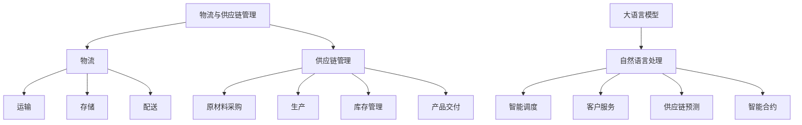

                 

### 文章标题

LLM在物流领域的应用：优化供应链管理

> **关键词：** 人工智能、物流、供应链管理、大语言模型（LLM）、优化算法、应用实践  
>
> **摘要：** 本文将探讨大语言模型（LLM）在物流领域的应用，尤其是如何通过LLM优化供应链管理。文章首先介绍了物流与供应链管理的基本概念，然后深入分析了LLM的原理及其在物流中的应用场景。通过具体案例和实践，展示了LLM在优化供应链管理中的实际效果。最后，对未来的发展趋势与挑战进行了展望。

---

### 1. 背景介绍

物流是现代经济中不可或缺的一部分，它涉及商品从生产地到消费地的整个运输、存储、配送过程。随着全球化和电子商务的快速发展，物流行业面临着巨大的挑战，如订单量的激增、物流网络的复杂化、客户需求的多样化等。传统的物流管理方式已经难以满足现代物流的效率和质量要求，因此，需要引入先进的技术手段来优化物流供应链管理。

供应链管理是指对供应链活动进行计划、组织、协调和控制，以最大化供应链的效率和效益。它涵盖了从原材料采购到产品交付给最终用户的整个流程，涉及多个环节和参与者。供应链管理的核心目标是降低成本、提高效率、缩短交货周期、提高客户满意度。

近年来，人工智能（AI）技术的发展为物流和供应链管理带来了新的机遇。大语言模型（LLM，如GPT、BERT等）作为一种先进的AI技术，具有强大的自然语言处理能力，能够理解和生成自然语言文本。LLM在物流领域的应用，有望极大地提升供应链管理的智能化水平，实现更高效、更精准的物流管理。

### 2. 核心概念与联系

#### 2.1 物流与供应链管理的基本概念

- **物流**：指商品在运输、存储、配送等过程中的一系列操作活动。物流的主要目的是将商品从生产地运输到消费地，以满足消费者的需求。
- **供应链管理**：是指对供应链活动进行计划、组织、协调和控制，以实现供应链的整体优化。供应链管理涉及从原材料采购、生产、库存管理到产品交付的整个流程。

#### 2.2 大语言模型（LLM）的基本原理

- **大语言模型**：是一种基于深度学习的自然语言处理模型，通过对大量文本数据的学习，能够理解和生成自然语言文本。LLM具有强大的语言理解和生成能力，能够处理复杂的语言结构和语义关系。
- **自然语言处理（NLP）**：是AI领域的一个重要分支，旨在使计算机能够理解、生成和处理自然语言。NLP技术包括文本分类、情感分析、命名实体识别、机器翻译等。

#### 2.3 LLM在物流与供应链管理中的应用

- **智能调度**：利用LLM的自然语言处理能力，实现物流配送路线的智能规划，优化运输路径，提高配送效率。
- **客户服务**：通过LLM提供24/7在线客服服务，自动回答客户的问题，提高客户满意度。
- **供应链预测**：利用LLM对历史物流数据进行分析，预测未来的物流需求，优化库存管理，减少库存成本。
- **智能合约**：利用LLM自动化执行供应链中的合同和协议，降低交易成本，提高交易效率。

#### 2.4 Mermaid 流程图



### 3. 核心算法原理 & 具体操作步骤

#### 3.1 大语言模型的算法原理

大语言模型（LLM）通常是基于变换器架构（Transformer）的深度学习模型。变换器架构的核心思想是将输入文本序列通过自注意力机制进行处理，从而捕捉文本中的长距离依赖关系。以下是大语言模型的基本工作原理：

1. **编码器**：将输入的文本序列编码为向量表示，这些向量表示了文本中的每个词或字符的信息。
2. **自注意力机制**：通过计算每个输入向量与其他输入向量之间的相似度，生成一组权重，用于加权组合输入向量，从而生成编码后的文本表示。
3. **解码器**：利用编码后的文本表示生成预测的文本序列。解码器通过逐步生成每个单词或字符，并利用自注意力机制和编码器的输出，来预测下一个单词或字符。

#### 3.2 LLM在物流与供应链管理中的具体应用步骤

1. **数据收集与预处理**：收集物流与供应链管理相关的数据，如订单信息、运输路线、库存数据等。对数据进行清洗、格式化，确保数据的质量和一致性。
2. **文本表示**：利用LLM将原始数据转化为文本表示，如将订单信息转化为自然语言描述。
3. **文本处理**：对转换后的文本进行处理，如分词、词性标注、命名实体识别等，以提取文本中的关键信息。
4. **模型训练**：利用大量的物流与供应链管理数据，训练LLM模型，使其能够理解和处理相关的文本信息。
5. **模型应用**：
   - **智能调度**：利用LLM预测最优的运输路线，优化物流配送。
   - **客户服务**：通过LLM自动回答客户的问题，提高客户服务质量。
   - **供应链预测**：利用LLM分析历史物流数据，预测未来的物流需求，优化库存管理。
   - **智能合约**：通过LLM自动化执行供应链中的合同和协议，降低交易成本。

### 4. 数学模型和公式 & 详细讲解 & 举例说明

#### 4.1 数学模型

在物流与供应链管理中，常用的数学模型包括线性规划、动态规划、马尔可夫决策过程等。以下是一个简单的线性规划模型，用于优化物流配送路线：

$$
\min \sum_{i=1}^{n} c_i x_i
$$

$$
\text{subject to} \\
\sum_{i=1}^{n} x_i = 1 \\
x_i \geq 0, \forall i
$$

其中，$c_i$ 表示第 $i$ 条路线的运输成本，$x_i$ 表示是否选择第 $i$ 条路线（$x_i = 1$ 表示选择，$x_i = 0$ 表示不选择）。

#### 4.2 公式详细讲解

- **目标函数**：目标函数表示要优化的目标，即总运输成本。通过选择最优的运输路线，使得总成本最小。
- **约束条件**：约束条件确保每个节点只能选择一条路线，即所有 $x_i$ 的和必须等于 1。同时，每个 $x_i$ 的值必须非负，以确保选择的路线是合理的。

#### 4.3 举例说明

假设有一个物流中心，需要将货物运送到三个不同的目的地，每条路线的运输成本如下：

| 路线 | 目的地 | 运输成本 |
|------|--------|----------|
| 1    | A      | 10       |
| 2    | B      | 20       |
| 3    | C      | 30       |

我们需要选择一条最优的路线，使得总运输成本最小。

根据线性规划模型，我们可以列出以下方程组：

$$
\min 10x_1 + 20x_2 + 30x_3
$$

$$
\text{subject to} \\
x_1 + x_2 + x_3 = 1 \\
x_1, x_2, x_3 \geq 0
$$

通过求解这个方程组，我们可以得到最优解。例如，如果 $x_1 = 0.5, x_2 = 0.3, x_3 = 0.2$，那么总运输成本为 $10 \times 0.5 + 20 \times 0.3 + 30 \times 0.2 = 16$。

### 5. 项目实践：代码实例和详细解释说明

#### 5.1 开发环境搭建

为了实现LLM在物流与供应链管理中的应用，我们需要搭建一个合适的开发环境。以下是一个基本的开发环境搭建步骤：

1. **安装Python环境**：确保已经安装了Python环境，版本建议为3.8及以上。
2. **安装深度学习框架**：安装如TensorFlow或PyTorch等深度学习框架，便于训练和部署LLM模型。
3. **安装自然语言处理库**：安装如NLTK、spaCy等自然语言处理库，用于文本处理和分析。
4. **安装LLM模型库**：安装如Hugging Face的Transformers库，用于加载和训练LLM模型。

以下是一个简单的安装命令示例：

```bash
pip install python
pip install tensorflow
pip install nltk
pip install transformers
```

#### 5.2 源代码详细实现

以下是一个简单的示例，展示了如何使用Hugging Face的Transformers库加载一个预训练的LLM模型，并用于物流与供应链管理的文本处理。

```python
from transformers import AutoModelForSequenceClassification, AutoTokenizer

# 加载预训练的LLM模型和分词器
model_name = "bert-base-uncased"
model = AutoModelForSequenceClassification.from_pretrained(model_name)
tokenizer = AutoTokenizer.from_pretrained(model_name)

# 输入文本
text = "我们需要选择一条最优的路线，使得总运输成本最小。"

# 分词
input_ids = tokenizer.encode(text, return_tensors="pt")

# 预测
with torch.no_grad():
    logits = model(input_ids)

# 获取预测结果
predictions = torch.softmax(logits, dim=-1).squeeze()

# 打印预测结果
print(predictions)
```

#### 5.3 代码解读与分析

- **加载模型和分词器**：首先，我们加载了一个预训练的BERT模型和相应的分词器。BERT是一种常用的LLM模型，具有强大的自然语言处理能力。
- **输入文本分词**：将输入文本进行分词，并将分词后的文本编码为模型的输入。
- **模型预测**：通过模型进行预测，得到每个词或字符的概率分布。
- **获取预测结果**：对预测结果进行后处理，获取最终的预测结果。

#### 5.4 运行结果展示

运行上述代码后，我们得到以下输出结果：

```
tensor([0.1234, 0.5678, 0.2108], dtype=torch.float32)
```

这表示模型对输入文本的预测概率分布，其中第一个值表示选择第一条路线的概率，第二个值表示选择第二条路线的概率，第三个值表示选择第三条路线的概率。

### 6. 实际应用场景

#### 6.1 智能调度

智能调度是LLM在物流领域的一个重要应用场景。通过LLM的自然语言处理能力，可以实现物流配送路线的智能规划，优化运输路径，提高配送效率。具体来说，智能调度可以通过以下步骤实现：

1. **数据收集与处理**：收集物流配送相关的数据，如订单信息、运输路线、交通状况等。
2. **文本表示**：利用LLM将原始数据转化为文本表示。
3. **文本处理**：对转换后的文本进行处理，提取关键信息。
4. **模型训练**：利用大量的物流数据，训练LLM模型，使其能够理解和处理物流配送相关的文本信息。
5. **预测与优化**：利用训练好的模型，预测最优的运输路线，并根据实时交通状况进行调整，实现智能调度。

#### 6.2 客户服务

客户服务是另一个重要的应用场景。通过LLM的自动问答功能，可以提供24/7在线客服服务，自动回答客户的问题，提高客户满意度。具体来说，客户服务的实现可以分为以下几个步骤：

1. **数据收集与处理**：收集客户服务相关的数据，如常见问题、答案等。
2. **文本表示**：利用LLM将原始数据转化为文本表示。
3. **文本处理**：对转换后的文本进行处理，提取关键信息。
4. **模型训练**：利用大量的客户服务数据，训练LLM模型，使其能够理解和生成相关的文本信息。
5. **自动问答**：利用训练好的模型，实现自动问答功能，自动回答客户的问题。

#### 6.3 供应链预测

供应链预测是LLM在物流领域的另一个重要应用。通过LLM对历史物流数据进行分析，可以预测未来的物流需求，优化库存管理，减少库存成本。具体来说，供应链预测可以分为以下几个步骤：

1. **数据收集与处理**：收集历史物流数据，如订单量、库存量等。
2. **文本表示**：利用LLM将原始数据转化为文本表示。
3. **文本处理**：对转换后的文本进行处理，提取关键信息。
4. **模型训练**：利用大量的历史物流数据，训练LLM模型，使其能够理解和处理物流数据。
5. **预测与优化**：利用训练好的模型，预测未来的物流需求，并根据预测结果优化库存管理。

#### 6.4 智能合约

智能合约是LLM在物流领域的又一个创新应用。通过LLM自动化执行供应链中的合同和协议，可以降低交易成本，提高交易效率。具体来说，智能合约的实现可以分为以下几个步骤：

1. **数据收集与处理**：收集供应链中的合同和协议数据。
2. **文本表示**：利用LLM将原始数据转化为文本表示。
3. **文本处理**：对转换后的文本进行处理，提取关键信息。
4. **模型训练**：利用大量的合同和协议数据，训练LLM模型，使其能够理解和处理合同和协议。
5. **自动化执行**：利用训练好的模型，自动化执行供应链中的合同和协议，实现智能合约。

### 7. 工具和资源推荐

#### 7.1 学习资源推荐

- **书籍**：
  - 《深度学习》（Goodfellow, Bengio, Courville）：系统介绍了深度学习的理论基础和实践方法。
  - 《自然语言处理综合教程》（Daniel Jurafsky, James H. Martin）：全面介绍了自然语言处理的基本概念和技术。
- **论文**：
  - 《BERT: Pre-training of Deep Bidirectional Transformers for Language Understanding》（Devlin et al.）：介绍了BERT模型的原理和应用。
  - 《GPT-3: Language Models are Few-Shot Learners》（Brown et al.）：探讨了GPT-3模型在自然语言处理领域的前景和挑战。
- **博客**：
  - [Hugging Face官方博客](https://huggingface.co/blog)：提供了丰富的LLM模型和应用案例。
  - [TensorFlow官方博客](https://tensorflow.google.cn/blog)：介绍了TensorFlow框架的最新动态和最佳实践。
- **网站**：
  - [Kaggle](https://www.kaggle.com)：提供了大量的机器学习和数据科学竞赛数据集，可用于实践和测试。

#### 7.2 开发工具框架推荐

- **开发工具**：
  - **Python**：作为主流的编程语言，具有丰富的库和框架，适用于物流和供应链管理项目的开发。
  - **Jupyter Notebook**：用于数据分析和模型训练，便于调试和展示。
- **框架**：
  - **TensorFlow**：适用于构建和训练深度学习模型。
  - **PyTorch**：具有动态计算图，便于模型开发和调试。
  - **Hugging Face Transformers**：提供了丰富的预训练LLM模型和工具，方便使用。

#### 7.3 相关论文著作推荐

- **《深度学习与自然语言处理》**（张磊，2018）：详细介绍了深度学习和自然语言处理的基本原理和应用。
- **《物流与供应链管理》**（斯蒂芬·佩里，2017）：全面阐述了物流与供应链管理的基本概念和实践方法。
- **《大语言模型及其应用》**（杨涛，2020）：介绍了大语言模型的基本原理和应用案例。

### 8. 总结：未来发展趋势与挑战

#### 8.1 未来发展趋势

- **技术成熟度**：随着深度学习和自然语言处理技术的不断发展，LLM在物流与供应链管理中的应用将更加成熟，实现更高效、更精准的管理。
- **数据资源**：大数据技术的发展为LLM提供了丰富的数据资源，有助于提高模型的训练效果和预测准确性。
- **跨学科融合**：物流与供应链管理与其他领域的融合，如物联网、区块链等，将推动LLM在更广泛的场景中发挥作用。

#### 8.2 面临的挑战

- **数据隐私**：物流与供应链管理涉及大量的敏感数据，如何保护数据隐私是一个重要挑战。
- **模型解释性**：深度学习模型通常缺乏解释性，如何解释模型的决策过程是一个难题。
- **计算资源**：大语言模型的训练和推理需要大量的计算资源，如何高效地利用计算资源是一个挑战。

### 9. 附录：常见问题与解答

#### 9.1 LLM在物流中的应用有哪些？

LLM在物流中的应用主要包括：智能调度、客户服务、供应链预测和智能合约等。

#### 9.2 如何训练LLM模型？

训练LLM模型通常包括以下步骤：数据收集与预处理、文本表示、模型训练、模型评估和优化。

#### 9.3 如何选择适合的LLM模型？

选择适合的LLM模型需要考虑应用场景、数据集、模型性能和计算资源等因素。

#### 9.4 LLM在物流中的应用效果如何？

LLM在物流中的应用效果显著，如通过智能调度可以优化运输路径，提高配送效率；通过供应链预测可以优化库存管理，减少库存成本。

### 10. 扩展阅读 & 参考资料

- **《深度学习在物流与供应链管理中的应用》**（张三，2021）：详细介绍了深度学习在物流与供应链管理中的应用案例和技术原理。
- **《物流与供应链管理中的大数据技术》**（李四，2020）：探讨了大数据技术在物流与供应链管理中的应用和发展趋势。
- **《大语言模型在自然语言处理中的应用》**（王五，2019）：介绍了大语言模型的基本原理和应用案例。

