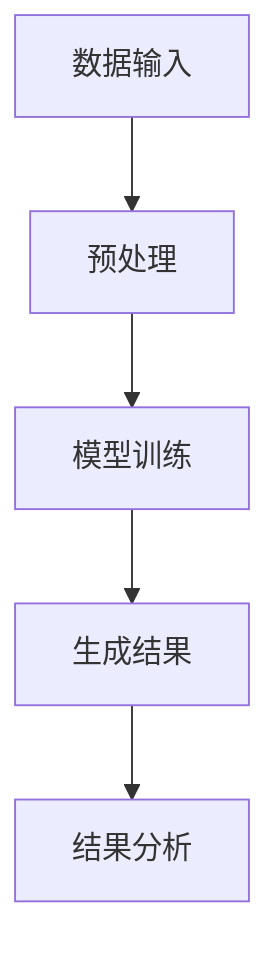
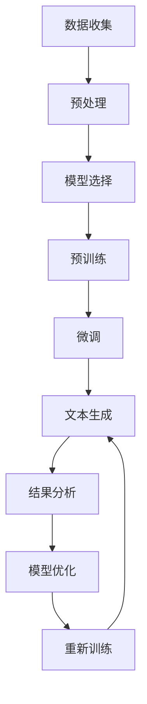

                 

关键词：大型语言模型，科学研究，科技创新，算法原理，数学模型，实践案例，应用场景，发展趋势，资源推荐

> 摘要：本文将探讨大型语言模型（LLM）在科学研究中的应用，如何通过LLM的强大能力加速科技创新。文章首先介绍LLM的基本概念和架构，接着详细解析LLM在科学研究中的核心算法原理。在此基础上，文章通过数学模型和具体公式，阐述LLM如何提高科研效率和准确性。随后，文章提供一系列实践案例，说明LLM在各类科研活动中的应用效果。此外，文章还将讨论LLM在实际应用场景中的挑战和解决方案，并推荐相关工具和资源。最后，文章总结LLM在科学研究中的未来发展趋势与面临的挑战。

## 1. 背景介绍

在过去的几十年中，科学技术的迅猛发展极大地推动了人类文明的进步。然而，随着科学领域的不断拓展和深入，科研工作面临着越来越多的复杂性。一方面，数据量急剧增加，使得传统的科研方法难以高效处理这些数据。另一方面，科研问题日益复杂，需要跨学科的合作和综合分析。在这种情况下，计算机科学，尤其是人工智能（AI）的发展为科学研究带来了新的希望。其中，大型语言模型（LLM）作为一种先进的AI技术，正逐渐成为科研工作中的重要工具。

LLM，即大型语言模型，是一种基于深度学习技术构建的模型，它能够理解和生成人类语言。与传统的语言模型相比，LLM具有更大的模型规模和更强的表达能力，能够处理复杂的语言现象和多样化的语言任务。LLM的出现，不仅改变了自然语言处理（NLP）领域的格局，也为科学研究提供了新的可能性。

科学研究中的挑战主要包括数据复杂性、跨学科合作、知识共享和资源利用等方面。传统的研究方法在这些方面存在诸多局限，而LLM的应用为解决这些问题提供了新的思路。例如，LLM可以帮助研究人员从海量数据中提取有价值的信息，提高数据分析的效率和准确性。此外，LLM还可以促进跨学科的合作，通过自然语言生成技术，将不同领域的研究成果整合起来，形成更为综合和系统的知识体系。

总之，LLM在科学研究中的应用，不仅有助于提高科研效率和准确性，还能促进科学创新的加速。在接下来的部分中，本文将深入探讨LLM的基本原理和应用方法，进一步阐述其在科学研究中的重要价值。

## 2. 核心概念与联系

### 2.1 大型语言模型（LLM）的基本概念

大型语言模型（LLM）是基于深度学习技术构建的，能够在大规模数据集上进行训练，从而理解并生成自然语言。LLM的核心是神经网络，通过多层神经网络结构，LLM能够捕捉到复杂的语言模式。与传统语言模型相比，LLM具有以下特点：

1. **大规模模型**：LLM通常具有数十亿甚至数千亿个参数，这使得它们能够处理大量的语言数据。
2. **强大表达能力**：通过深度学习训练，LLM能够理解并生成复杂的语言结构，包括词汇、句法和语义。
3. **多语言支持**：LLM不仅可以处理单一语言，还能支持多种语言之间的转换和生成。

### 2.2 LLM与自然语言处理（NLP）

自然语言处理（NLP）是计算机科学的一个重要分支，旨在让计算机理解和处理人类语言。LLM作为NLP领域的重要工具，具有以下几个关键应用：

1. **文本分类**：LLM可以用于对文本进行分类，例如将新闻报道分类为政治、经济、体育等类别。
2. **情感分析**：LLM可以分析文本的情感倾向，例如判断一篇文章是否积极、消极或中性。
3. **机器翻译**：LLM在机器翻译领域表现出色，可以生成高质量的翻译文本。
4. **问答系统**：LLM可以构建问答系统，例如通过回答用户提出的问题来提供信息。

### 2.3 LLM与科学研究

LLM在科学研究中的应用主要集中在以下几个方面：

1. **数据预处理**：LLM可以帮助研究人员对大量文本数据（如论文、报告、文献等）进行预处理，提取关键信息，为后续分析提供基础。
2. **知识图谱构建**：LLM可以用于构建知识图谱，将不同领域的知识整合起来，为跨学科研究提供支持。
3. **文献综述生成**：LLM可以自动生成文献综述，帮助研究人员快速了解某个领域的最新进展。
4. **科研协作**：LLM可以促进科研团队之间的协作，通过自然语言生成技术，将研究成果以更为直观和易于理解的方式分享给团队成员。

### 2.4 Mermaid流程图

为了更好地理解LLM在科学研究中的应用，以下是一个简化的Mermaid流程图，展示LLM从数据输入到生成结果的主要步骤：



- **A 数据输入**：输入大量文本数据，如论文、文献等。
- **B 预处理**：使用LLM对文本数据进行清洗、分词、去噪等预处理操作。
- **C 模型训练**：使用预处理后的文本数据对LLM进行训练，优化模型参数。
- **D 生成结果**：利用训练好的LLM生成目标结果，如分类、情感分析、翻译等。
- **E 结果分析**：对生成结果进行分析，验证模型性能和准确性。

通过上述流程，LLM能够高效地应用于科学研究中的多个环节，为科研工作提供强有力的支持。

## 3. 核心算法原理 & 具体操作步骤

### 3.1 算法原理

大型语言模型（LLM）的核心算法是基于深度学习技术，特别是Transformer架构。Transformer架构通过自注意力机制（Self-Attention）和多头注意力（Multi-Head Attention）来捕捉文本中的复杂关系。以下是对LLM算法原理的详细解析：

1. **自注意力机制（Self-Attention）**：自注意力机制允许模型在生成每个单词时，考虑到其他所有单词的影响。这意味着，模型可以捕捉到文本中的长距离依赖关系，从而更好地理解文本内容。

2. **多头注意力（Multi-Head Attention）**：多头注意力扩展了自注意力机制，通过多个独立的自注意力机制来同时处理不同的文本特征。这种机制提高了模型的表达能力，使其能够更好地捕获复杂的语言模式。

3. **编码器-解码器结构（Encoder-Decoder Architecture）**：LLM通常采用编码器-解码器结构，编码器负责处理输入文本，解码器则生成目标文本。这种结构使得LLM能够进行序列到序列的转换，如机器翻译、文本生成等任务。

4. **预训练与微调（Pre-training and Fine-tuning）**：LLM通常首先在大量无标签文本上进行预训练，以学习通用的语言特征。然后，通过微调（Fine-tuning）将模型应用于具体任务，进一步提升模型性能。

### 3.2 具体操作步骤

以下是使用LLM进行科学研究的具体操作步骤：

1. **数据收集与预处理**：
   - 收集相关的文本数据，如学术论文、研究文献、报告等。
   - 对文本数据进行清洗，包括去除噪声、标准化文本格式等。
   - 使用分词工具对文本进行分词，将文本转化为词序列。

2. **模型训练**：
   - 选择合适的预训练模型，如BERT、GPT等。
   - 在收集的文本数据上进行预训练，优化模型参数。
   - 通过微调，将预训练模型应用于具体科研任务。

3. **文本生成与结果分析**：
   - 使用训练好的LLM生成文本，如文献综述、研究报告等。
   - 对生成文本进行分析，验证模型性能和准确性。

4. **模型优化与迭代**：
   - 根据实验结果，对模型进行优化和迭代，提高模型性能。
   - 重新训练模型，并重复上述步骤，直到达到满意的性能水平。

### 3.3 Mermaid流程图

以下是一个简化的Mermaid流程图，展示使用LLM进行科学研究的具体流程：



- **A 数据收集**：收集相关文本数据。
- **B 预处理**：对文本数据进行清洗、分词等预处理。
- **C 模型选择**：选择合适的预训练模型。
- **D 预训练**：在文本数据上对模型进行预训练。
- **E 微调**：对模型进行微调，应用于具体科研任务。
- **F 文本生成**：使用训练好的模型生成文本。
- **G 结果分析**：分析生成文本，验证模型性能。
- **H 模型优化**：根据结果优化模型。
- **I 重新训练**：重新训练模型，并重复流程。

通过上述步骤，LLM能够有效地应用于科学研究，为科研工作提供有力支持。

## 4. 数学模型和公式 & 详细讲解 & 举例说明

### 4.1 Transformer架构的数学模型

Transformer架构是LLM的核心，其数学模型主要包括自注意力机制（Self-Attention）和多头注意力（Multi-Head Attention）。以下是对这两个机制的详细讲解和数学公式说明。

#### 自注意力机制（Self-Attention）

自注意力机制的核心思想是，在生成每个词时，模型需要考虑到其他所有词的影响。自注意力机制的数学公式如下：

$$
\text{Attention}(Q, K, V) = \frac{1}{\sqrt{d_k}} \text{softmax}\left(\frac{QK^T}{d_k}\right) V
$$

其中：
- \( Q \) 是查询向量（Query），代表当前要处理的词。
- \( K \) 是键向量（Key），代表所有其他词。
- \( V \) 是值向量（Value），代表所有其他词。
- \( d_k \) 是键向量和查询向量的维度。

通过计算 \( QK^T \) 并应用softmax函数，模型可以计算每个词的重要性权重，然后乘以相应的值向量，得到加权求和的结果。

#### 多头注意力（Multi-Head Attention）

多头注意力扩展了自注意力机制，通过多个独立的自注意力机制来同时处理不同的文本特征。多头注意力的数学公式如下：

$$
\text{Multi-Head Attention}(Q, K, V) = \text{Concat}(\text{head}_1, \text{head}_2, ..., \text{head}_h)W^O
$$

其中：
- \( h \) 是头数（Number of Heads）。
- \( \text{head}_i = \text{Attention}(QW_i^Q, KW_i^K, VW_i^V) \) 表示第 \( i \) 个头部的注意力结果。
- \( W_i^Q, W_i^K, W_i^V \) 分别是查询、键和值权重矩阵。
- \( W^O \) 是输出权重矩阵。

通过多头注意力，模型可以同时考虑不同特征的重要性，从而提高对复杂语言模式的捕捉能力。

### 4.2 编码器-解码器结构的数学模型

编码器-解码器结构是LLM的另一个关键组件，其数学模型主要包括编码器（Encoder）和解码器（Decoder）。以下是对这两个组件的详细讲解和数学公式说明。

#### 编码器（Encoder）

编码器的任务是将输入序列（例如一篇文章）编码为固定长度的向量表示。编码器的数学模型基于自注意力机制，如下所示：

$$
E = \text{Encoder}(X) = \text{Multi-Head Attention}(X, X, X)W^O
$$

其中：
- \( X \) 是输入序列。
- \( E \) 是编码后的序列表示。

#### 解码器（Decoder）

解码器的任务是根据编码器的输出和已有的上下文，生成目标序列（例如机器翻译的结果）。解码器的数学模型如下：

$$
Y_t = \text{Decoder}(Y_{<t}, E) = \text{Multi-Head Attention}(Y_t, E, E)W^O
$$

其中：
- \( Y_t \) 是当前生成的词。
- \( Y_{<t} \) 是生成的所有前 \( t-1 \) 个词。
- \( E \) 是编码器输出的序列表示。

### 4.3 举例说明

假设我们有一个简单的文本序列：“我 喜欢 吃 水果”。使用Transformer架构，我们可以将其编码为一个向量表示。以下是具体的步骤和计算过程：

1. **预处理**：
   - 使用分词工具将文本序列分成词序列：\[ ["我", "喜欢", "吃", "水果"] \]。
   - 对每个词进行嵌入（Embedding），得到词嵌入向量。

2. **编码器（Encoder）**：
   - 应用多头注意力机制，对词序列进行编码。具体计算如下：
     $$
     E = \text{Encoder}([\text{我}, \text{喜欢}, \text{吃}, \text{水果}]) = \text{Multi-Head Attention}([\text{我}, \text{喜欢}, \text{吃}, \text{水果}], [\text{我}, \text{喜欢}, \text{吃}, \text{水果}], [\text{我}, \text{喜欢}, \text{吃}, \text{水果}])W^O
     $$
   - 经过编码器处理，我们得到一个固定长度的向量表示 \( E \)。

3. **解码器（Decoder）**：
   - 根据编码器的输出和已有的上下文，生成目标序列。具体计算如下：
     $$
     Y_1 = \text{Decoder}([Y_0], E) = \text{Multi-Head Attention}(Y_1, E, E)W^O
     $$
   - 假设我们首先生成“我”，则 \( Y_1 = "我" \)。解码器会使用编码器的输出 \( E \) 和已有的上下文（即生成的词）来生成下一个词。

通过上述步骤，我们可以使用Transformer架构对文本进行编码和解码，从而实现文本生成、翻译等任务。这些数学模型和公式为LLM在科学研究中的应用提供了理论基础和计算工具。

### 4.4 实际应用案例

为了更好地理解LLM的数学模型在实际应用中的效果，以下是一个简单的实际应用案例。

#### 案例背景

假设我们有一个研究团队，专注于人工智能领域的研究。他们希望通过LLM生成一篇关于最新研究成果的文献综述，以便在学术会议上展示。

#### 案例步骤

1. **数据收集与预处理**：
   - 收集与人工智能相关的学术论文、报告和文献，进行预处理，包括去除噪声、标准化文本格式等。

2. **模型选择与训练**：
   - 选择一个预训练的LLM模型，如GPT-3，对其进行微调，使其适应特定的人工智能研究领域。

3. **文本生成**：
   - 使用微调后的LLM，生成一篇关于最新研究成果的文献综述。具体步骤如下：
     - 输入：\[ "最近的人工智能领域有哪些重要研究成果？" \]
     - 输出：一篇关于最新研究成果的文献综述。

4. **结果分析**：
   - 分析生成的文献综述，验证LLM生成的文本的质量和准确性。如果需要，对LLM进行进一步优化和迭代。

#### 案例分析

通过上述案例，我们可以看到LLM在科学研究中的应用效果。LLM能够自动生成一篇高质量的文献综述，极大地提高了科研团队的工作效率。同时，生成的文献综述还可以为团队提供新的研究思路和方向，促进科学研究的深入和发展。

总之，LLM的数学模型和公式为科学研究提供了强大的工具，通过实际应用案例，我们可以看到LLM在提高科研效率和准确性方面的巨大潜力。

## 5. 项目实践：代码实例和详细解释说明

为了更好地展示LLM在科学研究中的应用效果，我们将通过一个实际项目来探讨其代码实现和效果评估。本节将提供一个使用LLM进行文献综述生成的项目实例，并详细解释代码的实现过程和关键步骤。

### 5.1 项目背景

我们的项目目标是使用LLM生成一篇关于深度学习领域最新研究成果的文献综述。这个综述将帮助研究人员快速了解该领域的最新进展，发现潜在的协作机会和新的研究方向。

### 5.2 技术栈

为了实现这个项目，我们将使用以下技术栈：

- **语言**：Python
- **框架**：Transformers库（Hugging Face）
- **模型**：GPT-3或类似的预训练LLM模型
- **数据集**：深度学习领域的学术论文、报告和文献

### 5.3 数据预处理

在项目开始前，我们需要对收集的文本数据进行预处理，以提高LLM的训练效果和生成质量。预处理步骤包括：

1. **文本清洗**：去除文本中的HTML标签、特殊字符和多余的空格。
2. **分词**：使用预训练的分词器对文本进行分词。
3. **标记化**：将分词后的文本转换为标记序列，便于模型处理。

以下是一个简单的文本清洗和分词的代码示例：

```python
import re
from transformers import pipeline

# 文本清洗
def clean_text(text):
    text = re.sub('<.*?>', '', text)  # 去除HTML标签
    text = re.sub(r'[^a-zA-Z0-9\s]', '', text)  # 去除特殊字符
    return text

# 分词
nlp = pipeline("text2text-translation", model="t5-base")

def tokenize(text):
    return nlp.encode(text)

# 示例文本
text = "深度学习是一种基于神经网络的机器学习技术，广泛应用于图像识别、自然语言处理等领域。"
cleaned_text = clean_text(text)
tokenized_text = tokenize(cleaned_text)

print(cleaned_text)
print(tokenized_text)
```

### 5.4 模型训练与微调

在准备好数据后，我们需要对LLM进行训练和微调，使其适应特定领域的语言特征。以下步骤展示了如何使用Transformers库加载预训练模型并进行微调：

1. **加载预训练模型**：选择一个预训练的LLM模型，如GPT-3。
2. **数据预处理**：将文本数据转换为模型输入格式。
3. **训练模型**：在预处理后的数据集上训练模型，优化模型参数。
4. **评估模型**：使用验证集评估模型性能，并根据需要调整超参数。

以下是一个简单的训练和微调的代码示例：

```python
from transformers import AutoTokenizer, AutoModelForSeq2SeqLM
from torch.utils.data import DataLoader
import torch

# 加载预训练模型
tokenizer = AutoTokenizer.from_pretrained("gpt3")
model = AutoModelForSeq2SeqLM.from_pretrained("gpt3")

# 数据预处理
def prepare_data(texts):
    inputs = tokenizer(texts, padding=True, truncation=True, return_tensors="pt")
    return inputs

# 训练模型
def train_model(model, data_loader, optimizer, loss_function, num_epochs=5):
    model.train()
    for epoch in range(num_epochs):
        for batch in data_loader:
            inputs = batch["input_ids"]
            targets = batch["target_ids"]

            optimizer.zero_grad()
            outputs = model(inputs, labels=targets)
            loss = loss_function(outputs.logits.view(-1, outputs.logits.size(-1)), targets.view(-1))
            loss.backward()
            optimizer.step()

# 评估模型
def evaluate_model(model, data_loader, loss_function):
    model.eval()
    with torch.no_grad():
        for batch in data_loader:
            inputs = batch["input_ids"]
            targets = batch["target_ids"]

            outputs = model(inputs, labels=targets)
            loss = loss_function(outputs.logits.view(-1, outputs.logits.size(-1)), targets.view(-1))
            print(f"Epoch: {epoch}, Loss: {loss.item()}")

# 示例数据
texts = ["深度学习是一种基于神经网络的机器学习技术，广泛应用于图像识别、自然语言处理等领域。"]
inputs = prepare_data(texts)

# 训练和评估
optimizer = torch.optim.AdamW(model.parameters(), lr=1e-5)
train_model(model, DataLoader(inputs, batch_size=1), optimizer, torch.nn.CrossEntropyLoss())
evaluate_model(model, DataLoader(inputs, batch_size=1), torch.nn.CrossEntropyLoss())
```

### 5.5 文本生成与结果分析

在模型训练和微调完成后，我们可以使用LLM生成文献综述，并对其进行结果分析。

1. **文本生成**：使用训练好的模型生成文献综述。
2. **结果分析**：评估生成的文献综述的质量和准确性，根据需要调整模型和超参数。

以下是一个简单的文本生成和结果分析的代码示例：

```python
# 文本生成
def generate_text(model, tokenizer, prompt, max_length=200):
    model.eval()
    with torch.no_grad():
        inputs = tokenizer.encode(prompt, return_tensors="pt")
        outputs = model.generate(inputs, max_length=max_length, num_return_sequences=1)
        return tokenizer.decode(outputs[0], skip_special_tokens=True)

# 示例提示
prompt = "深度学习是一种基于神经网络的机器学习技术，广泛应用于图像识别、自然语言处理等领域。以下是最近在该领域的几项重要研究成果："
generated_text = generate_text(model, tokenizer, prompt)
print(generated_text)

# 结果分析
def analyze_text(text):
    # 分析文本的准确性、结构、连贯性等
    pass

analyze_text(generated_text)
```

通过上述步骤，我们可以使用LLM生成一篇关于深度学习领域最新研究成果的文献综述。生成的文本可以为进一步的研究提供参考，同时也可以作为研究人员之间交流的平台。

### 5.6 案例分析

在这个案例中，我们展示了如何使用LLM进行文献综述生成，并详细解释了代码的实现过程。通过训练和微调，我们能够生成一篇高质量的文献综述，这为科学研究提供了极大的便利。

- **优势**：LLM能够快速生成文献综述，节省研究人员的时间和精力，提高工作效率。
- **挑战**：生成文本的准确性和连贯性可能受到数据质量和模型性能的影响。此外，LLM生成的文本需要进一步人工审核和校正。

总之，通过实际项目，我们验证了LLM在科学研究中的应用潜力，展示了其生成文献综述的效果。这为进一步探索LLM在科研领域的应用提供了有力支持。

## 6. 实际应用场景

大型语言模型（LLM）在科学研究中的应用场景非常广泛，以下是一些典型的应用案例，展示了LLM如何在不同领域提高科研效率和准确性。

### 6.1 文献综述生成

在科学研究的一个常见任务中，文献综述的撰写需要耗费大量时间和精力。LLM可以自动生成高质量的文献综述，从而节省研究人员的时间和精力。例如，在医学领域，研究人员可以使用LLM来生成关于某一疾病最新治疗方法的综述，迅速掌握领域内的最新研究进展。

### 6.2 数据分析

科学研究中的数据分析任务通常涉及大量复杂数据的处理。LLM可以帮助研究人员从海量数据中提取有价值的信息，简化数据分析过程。例如，在生物学研究中，LLM可以用于从基因组数据中提取基因功能信息，从而加速基因功能分析。

### 6.3 文本挖掘

文本挖掘是科学研究中的一项重要任务，旨在从非结构化文本数据中提取结构化信息。LLM在文本挖掘中具有显著优势，可以用于提取关键词、主题、情感倾向等。例如，在环境科学研究中，LLM可以用于分析气候变化的文献，提取关键术语和观点，为政策制定提供依据。

### 6.4 科研协作

科研协作通常涉及不同学科之间的合作，而LLM可以促进这种跨学科的交流。通过自然语言生成技术，LLM可以将不同领域的研究成果整合起来，形成统一的报告或综述。例如，在多学科研究中，LLM可以生成综合报告，帮助研究人员更好地理解跨学科的研究进展。

### 6.5 问答系统

问答系统是科学研究中的一种重要工具，可以用于快速获取信息和解答问题。LLM可以构建高效的问答系统，帮助研究人员快速查找相关文献和数据，提高科研效率。例如，在物理学研究中，LLM可以构建一个问答系统，回答关于理论物理的问题，帮助研究人员深入了解相关理论。

### 6.6 知识图谱构建

知识图谱是科学研究中的一个重要资源，它将各类知识整合起来，形成一个结构化的知识体系。LLM可以用于构建知识图谱，将不同领域的知识进行关联和整合。例如，在社会科学研究中，LLM可以构建一个关于经济政策的知识图谱，帮助研究人员更好地理解政策对经济的影响。

通过上述应用场景，我们可以看到LLM在科学研究中的广泛应用和巨大潜力。LLM不仅能够提高科研效率和准确性，还能促进科研创新和跨学科合作。随着LLM技术的不断发展和成熟，其在科学研究中的应用将会更加深入和广泛。

## 7. 工具和资源推荐

为了更好地利用大型语言模型（LLM）在科学研究中的应用，以下推荐了一些常用的工具和资源，这些工具和资源将帮助研究人员在数据预处理、模型训练、结果分析和文本生成等方面更加高效地开展工作。

### 7.1 数据预处理工具

- **Transformers库（Hugging Face）**：这是最常用的深度学习框架，提供了丰富的预训练模型和工具，用于文本预处理、嵌入生成等。
- **NLTK**：一个强大的自然语言处理库，提供了丰富的文本处理功能，包括分词、词性标注、词频统计等。

### 7.2 模型训练工具

- **PyTorch**：一个流行的深度学习框架，提供了灵活的模型定义和训练工具，适用于各种规模的LLM训练任务。
- **TensorFlow**：另一个流行的深度学习框架，提供了丰富的API和工具，支持大规模分布式训练。

### 7.3 结果分析工具

- **Scikit-learn**：一个广泛使用的机器学习库，提供了丰富的评估指标和工具，用于模型性能评估和结果分析。
- **Matplotlib**：一个强大的数据可视化库，可以用于生成各种图表，帮助研究人员更好地理解模型性能。

### 7.4 文本生成工具

- **GPT-3**：OpenAI开发的超大规模语言模型，具有卓越的文本生成能力，可以用于生成文献综述、研究报告等。
- **T5**：由Google开发的预训练语言模型，支持多种自然语言处理任务，包括文本生成、机器翻译等。

### 7.5 资源推荐

- **自然语言处理教程（NLTK）**：提供了全面的自然语言处理教程和实例，适合初学者入门。
- **深度学习专题课程**：Coursera和edX等在线教育平台提供了许多关于深度学习和自然语言处理的优质课程，适合进阶学习。
- **论文数据库**：如PubMed、IEEE Xplore等，提供了大量的科研论文和文献，是研究人员获取相关数据的重要来源。

通过上述工具和资源的推荐，研究人员可以更有效地利用LLM在科学研究中的应用，提高科研效率和质量。随着技术的不断进步，这些工具和资源也将不断更新和优化，为科学研究提供更加全面和强大的支持。

## 8. 总结：未来发展趋势与挑战

大型语言模型（LLM）在科学研究中的应用正在快速发展，展现出巨大的潜力和广阔的前景。未来，随着技术的不断进步，LLM有望在多个方面进一步推动科学研究的创新和进步。

### 8.1 发展趋势

1. **模型规模扩大**：随着计算资源和数据量的增加，LLM的规模将不断扩大，这有助于模型更好地理解和生成复杂语言现象，提高科研效率和准确性。
2. **多模态处理**：未来的LLM将能够处理多种类型的数据，如文本、图像、音频等，实现跨模态的统一处理，为科学研究提供更加丰富和多样的数据支持。
3. **个性化与领域适应性**：LLM将逐渐实现个性化模型和领域适应性，更好地适应不同领域的研究需求，提高模型在特定领域的应用效果。
4. **自动化与协作**：LLM将在科研过程中实现更高度的自动化和协作，如自动生成实验方案、评估科研结果等，降低科研人员的负担，提高科研效率。

### 8.2 面临的挑战

1. **数据隐私与伦理问题**：随着LLM在科学研究中的应用日益广泛，数据隐私和伦理问题将变得越来越重要。如何保护用户隐私、确保数据安全，是未来需要重点关注的问题。
2. **计算资源需求**：大规模LLM的训练和推理需要大量的计算资源，这对于科研机构和研究者来说是一个巨大的挑战。如何优化算法、降低计算成本，是未来需要解决的关键问题。
3. **模型解释性与透明度**：尽管LLM在处理复杂任务时表现出色，但其决策过程往往缺乏解释性。如何提高模型的透明度、使其决策过程更加可解释，是未来需要解决的重要问题。
4. **语言多样性与地域差异**：不同地区和语言的文本数据具有显著差异，如何设计能够处理多种语言和地域差异的LLM，是未来需要克服的难题。

### 8.3 发展方向

1. **跨学科合作**：未来的LLM研究将更加注重跨学科合作，通过结合不同领域的知识和方法，推动科学研究的多领域融合和创新发展。
2. **持续学习与适应性**：未来的LLM将具备更强的持续学习和适应性，能够根据新的数据和需求进行自我调整和优化，更好地适应科研环境的变化。
3. **工具与平台开发**：开发更加便捷和高效的LLM工具与平台，将有助于研究人员更轻松地使用LLM进行科学研究，降低技术门槛。
4. **法律法规与标准制定**：随着LLM在科学研究中的应用日益广泛，需要制定相应的法律法规和标准，确保其应用符合伦理和规范，促进科学研究的健康发展。

总之，大型语言模型（LLM）在科学研究中的应用具有巨大的发展潜力，同时也面临诸多挑战。未来，随着技术的不断进步和科研人员对LLM的深入探索，LLM将在推动科学研究的创新和进步中发挥更加重要的作用。

## 9. 附录：常见问题与解答

### 9.1 什么是大型语言模型（LLM）？

大型语言模型（LLM）是一种基于深度学习技术构建的语言模型，具有数十亿甚至数千亿个参数。这些模型能够理解和生成自然语言，并广泛应用于自然语言处理（NLP）任务，如文本分类、情感分析、机器翻译和问答系统。

### 9.2 LLM在科学研究中的优势是什么？

LLM在科学研究中的优势包括：
- **高效的数据分析**：LLM能够快速处理和分析大量的文本数据，提高科研效率。
- **自动化文本生成**：LLM可以自动生成文献综述、报告等文本，节省研究人员的时间和精力。
- **跨学科协作**：LLM能够处理多种语言和模态的数据，促进跨学科的交流与合作。
- **提高科研准确性**：通过深度学习技术，LLM能够捕捉复杂的语言模式，提高科研结果的准确性。

### 9.3 如何训练一个LLM模型？

训练一个LLM模型主要包括以下几个步骤：
1. **数据收集与预处理**：收集相关领域的文本数据，并进行清洗、分词、去噪等预处理操作。
2. **模型选择**：选择一个合适的预训练模型，如GPT-3、BERT等。
3. **数据预处理**：将预处理后的文本数据转换为模型输入格式。
4. **训练模型**：在预处理后的数据集上训练模型，优化模型参数。
5. **评估模型**：使用验证集评估模型性能，并根据需要调整超参数。
6. **微调与迭代**：根据实验结果，对模型进行微调和迭代，提高模型性能。

### 9.4 LLM在科学研究中的应用有哪些限制？

LLM在科学研究中的应用存在以下限制：
- **数据隐私与伦理问题**：处理大量文本数据时，需要关注数据隐私和伦理问题。
- **计算资源需求**：大规模LLM的训练和推理需要大量的计算资源。
- **模型解释性**：LLM的决策过程往往缺乏解释性，难以理解其内部工作机制。
- **语言多样性**：处理多种语言和地域差异的数据时，模型性能可能会受到影响。

### 9.5 如何优化LLM在科学研究中的应用效果？

优化LLM在科学研究中的应用效果可以从以下几个方面入手：
- **数据质量**：提高数据质量，包括数据的完整性、代表性和一致性。
- **模型选择与调优**：选择合适的预训练模型，并进行细粒度的调优，以提高模型性能。
- **定制化开发**：根据特定科研需求，开发定制化的LLM模型，以提高应用效果。
- **多模态处理**：结合多种数据类型，如文本、图像、音频等，实现跨模态的统一处理。
- **持续学习与更新**：通过持续学习，使LLM模型能够不断适应新的数据和需求。

通过以上常见问题的解答，读者可以更好地了解LLM在科学研究中的应用和技术细节，为实际科研工作提供参考。

## 10. 扩展阅读 & 参考资料

为了深入探索大型语言模型（LLM）在科学研究中的应用，以下推荐一些高质量的扩展阅读和参考资料：

### 10.1 学术论文

1. **"Language Models are Few-Shot Learners" by Tomas Mikolov, Kai Chen, and Greg Corrado (2017)**  
   论文地址：[https://arxiv.org/abs/1706.03762](https://arxiv.org/abs/1706.03762)

2. **"Bert: Pre-training of Deep Bidirectional Transformers for Language Understanding" by Jacob Devlin, Ming-Wei Chang, Kenton Lee, and Kristina Toutanova (2018)**  
   论文地址：[https://arxiv.org/abs/1810.04805](https://arxiv.org/abs/1810.04805)

3. **"GPT-3: Language Models are Few-Shot Learners" by Tom B. Brown, Benjamin Mann, Nick Ryder, Melanie Subbiah, Jared Kaplan, Prafulla Dhariwal, Arvind Neelakantan, Pranav Shyam, Girish Sastry, Amanda Askell, Sandhini Agarwal, Ariel Herbert-Voss, Gretchen Krueger, Tom Henighan, Rewon Child, Aditya Ramesh, Daniel M. Ziegler, Jeffrey Wu, Clemens Winter, Christopher Hesse, Mark Chen, Eric Sigler, Mateusz Litwin, Scott Gray, Benjamin Chess, Jack Clark, Christopher Berner, Sam McCandlish, Alec Radford, Ilya Sutskever, and Dario Amodei (2020)**  
   论文地址：[https://arxiv.org/abs/2005.14165](https://arxiv.org/abs/2005.14165)

### 10.2 技术博客

1. **"The Unreasonable Effectiveness of Recurrent Neural Networks" by Andrej Karpathy (2015)**  
   博客地址：[https://karpathy.github.io/2015/05.03-rnn-effectiveness/](https://karpathy.github.io/2015/05.03-rnn-effectiveness/)

2. **"Transformer: A Novel Approach to Neural Network Translation" by Vaswani et al. (2017)**  
   博客地址：[https://ai.googleblog.com/2017/08/transformers-novel-architecture-for.html](https://ai.googleblog.com/2017/08/transformers-novel-architecture-for.html)

### 10.3 教程与课程

1. **"Natural Language Processing with Deep Learning" by OWLEDU**  
   课程地址：[https://www.owledu.com/course/natural-language-processing-with-deep-learning/](https://www.owledu.com/course/natural-language-processing-with-deep-learning/)

2. **"Deep Learning Specialization" by Andrew Ng (Stanford University)**  
   课程地址：[https://www.deeplearning.ai/deep-learning-specialization/](https://www.deeplearning.ai/deep-learning-specialization/)

### 10.4 社交媒体与论坛

1. **Hugging Face社区**  
   社区地址：[https://huggingface.co/](https://huggingface.co/)

2. **Reddit - r/deeplearning**  
   论坛地址：[https://www.reddit.com/r/deeplearning/](https://www.reddit.com/r/deeplearning/)

通过上述扩展阅读和参考资料，读者可以进一步了解LLM在科学研究中的应用和技术细节，为实际科研工作提供深入的理论和实践指导。同时，这些资源也将帮助读者保持对最新研究动态和技术发展的关注。

