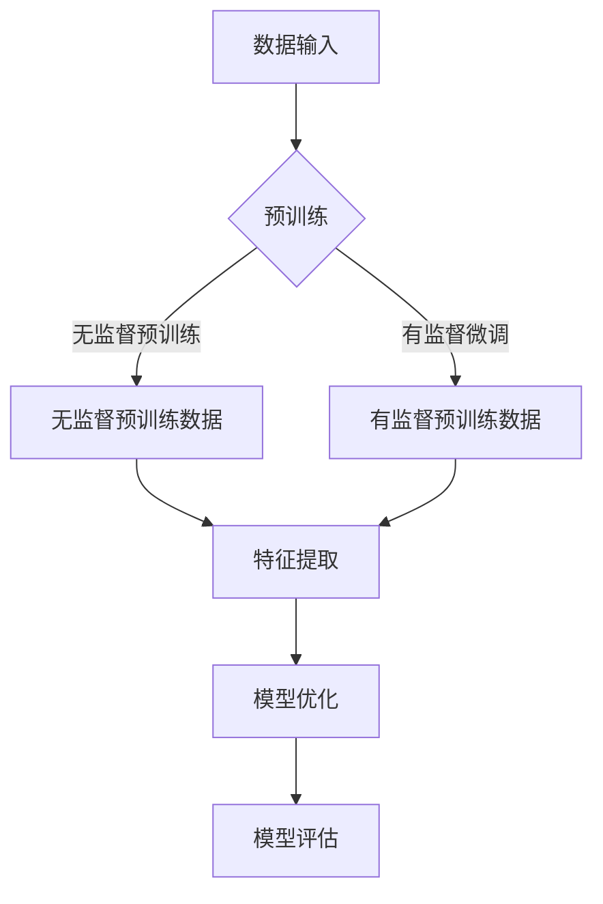

                 

### 背景介绍

随着人工智能技术的快速发展，大型语言模型（LLM，Large Language Model）如BERT、GPT、T5等已经在自然语言处理（NLP，Natural Language Processing）领域取得了显著的成就。这些模型通过深度学习算法，能够在大量文本数据中学习到复杂的语言结构和语义关系，从而在文本生成、机器翻译、情感分析、问答系统等方面表现出色。

然而，除了在NLP领域的应用，LLM在其他领域的潜力也越来越受到关注。其中，风险评估领域是一个重要的应用方向。在现代金融、保险、供应链等行业中，风险评估是决策过程中至关重要的一环。准确的风险评估可以帮助企业减少损失，提高经营效率。

传统的风险评估方法主要依赖于历史数据和统计分析。然而，这些方法在面对复杂、动态的风险环境时往往显得力不从心。因此，将LLM应用于风险评估，借助其强大的数据处理和分析能力，有望带来革命性的改变。

本文将探讨LLM在风险评估中的潜在作用。首先，我们将介绍LLM的基本原理和常用模型，然后详细分析LLM在风险评估中的应用场景和具体操作步骤，最后讨论LLM在风险评估领域的未来发展趋势和挑战。

### 核心概念与联系

要理解LLM在风险评估中的潜在作用，首先需要了解其基本原理和常用模型。大型语言模型（LLM）是通过对大量文本数据进行训练，学习到语言的统计规律和语义关系，从而实现对文本的生成、理解、翻译等任务的模型。以下是对LLM核心概念和联系的分析。

#### 1. 基本原理

LLM的基本原理基于深度学习和自然语言处理技术。深度学习是一种基于神经网络的机器学习技术，通过多层神经网络对数据进行特征提取和表示。自然语言处理（NLP）则专注于使计算机能够理解、生成和处理人类语言。

LLM通过对大量文本数据进行预训练，学习到语言的统计规律和语义关系。预训练过程通常分为两个阶段：第一阶段是使用未标注的数据进行无监督预训练，模型在这阶段学习到文本的底层特征和结构；第二阶段是使用标注数据对模型进行有监督微调，模型在这阶段学习到具体任务的规则和目标。

#### 2. 常用模型

LLM的常用模型包括GPT（Generative Pre-trained Transformer）、BERT（Bidirectional Encoder Representations from Transformers）、T5（Text-to-Text Transfer Transformer）等。

- **GPT**：GPT是一种基于变分自编码器（VAE）的语言模型，通过生成式模型的方式学习文本数据的分布。GPT-3是GPT系列中最新也是最强大的版本，拥有1750亿个参数，能够在各种语言任务中表现出色。

- **BERT**：BERT是一种基于Transformer的双向编码器，通过对文本进行双向编码，捕捉到文本中的上下文信息。BERT在预训练阶段使用了两种任务：Masked Language Model（MLM）和Next Sentence Prediction（NSP），这两种任务有助于模型更好地理解文本的语义和结构。

- **T5**：T5是一种基于Transformer的文本到文本转换模型，将所有自然语言处理任务都转换为文本到文本的格式。T5通过在大量双语文本对上进行预训练，学习到语言的一般规律和具体任务的规则。

#### 3. 核心概念原理和架构的 Mermaid 流程图

以下是一个简单的Mermaid流程图，展示了LLM的核心概念原理和架构：



- **数据输入**：LLM的训练数据可以是未标注的文本数据（如维基百科、新闻文章等）或标注的文本数据（如问答对、文本分类标签等）。
- **预训练**：LLM通过预训练学习文本数据的底层特征和结构，包括无监督预训练（如GPT的语料库掩码任务）和有监督微调（如BERT的 masked language model 和 next sentence prediction 任务）。
- **特征提取**：预训练后的LLM能够提取文本的高层次特征，这些特征可以用于后续的自然语言处理任务。
- **模型优化**：通过有监督微调，LLM在特定任务上进行模型优化，提高任务的性能。
- **模型评估**：评估模型在特定任务上的性能，如准确率、召回率等指标。

通过上述分析，我们可以看到LLM在风险评估中的潜在作用。LLM通过强大的数据处理和分析能力，可以从大量文本数据中提取有用的信息，帮助识别和评估潜在的风险因素，从而提高风险评估的准确性和效率。

### 核心算法原理 & 具体操作步骤

为了深入理解LLM在风险评估中的应用，我们需要详细探讨其核心算法原理和具体操作步骤。以下是LLM在风险评估中的核心算法原理和具体操作步骤的详细分析。

#### 1. 基本算法原理

LLM在风险评估中的核心算法原理主要基于其强大的数据处理和分析能力。LLM通过对大量文本数据进行预训练，学习到语言的统计规律和语义关系，从而实现对文本的生成、理解、翻译等任务。在风险评估中，LLM可以用于从文本数据中提取有用的信息，如风险因素、风险程度等。

具体来说，LLM的基本算法原理可以概括为以下几个步骤：

- **数据预处理**：首先，对输入的文本数据进行预处理，包括分词、去噪、标准化等操作，将文本转换为模型可处理的格式。
- **文本编码**：使用预训练的LLM对预处理后的文本数据进行编码，得到文本的向量表示。这一步是LLM的核心，通过预训练，LLM能够捕捉到文本的语义和结构。
- **风险特征提取**：利用LLM的文本编码能力，从文本向量表示中提取与风险相关的特征，如风险因素、风险程度等。
- **风险评估**：基于提取的风险特征，使用适当的评估模型（如决策树、神经网络等）对风险进行评估，得到风险得分或风险等级。

#### 2. 具体操作步骤

下面，我们将详细讨论LLM在风险评估中的具体操作步骤。

##### 步骤一：数据预处理

数据预处理是LLM应用的基础。在风险评估中，数据预处理通常包括以下几个步骤：

- **分词**：将文本分解为单词或词组，以便进行后续处理。常见的分词方法有基于词典的分词、基于统计的分词等。
- **去噪**：去除文本中的噪声信息，如标点符号、特殊字符等。这可以通过简单的正则表达式或专门的去噪算法实现。
- **标准化**：将文本中的单词统一转换为小写或大写，消除大小写差异。此外，还可以对文本进行词形还原，将不同的词形转换为统一的词干。

##### 步骤二：文本编码

文本编码是将文本转换为数值表示的过程，以便LLM进行后续处理。在风险评估中，文本编码通常使用预训练的LLM，如BERT、GPT等。具体操作步骤如下：

- **加载预训练模型**：从预训练模型库中加载预训练的LLM模型，如BERT或GPT。
- **输入文本**：将预处理后的文本输入到LLM模型中，模型对文本进行编码，输出文本的向量表示。
- **处理文本序列**：由于LLM模型通常设计为处理序列数据，因此需要对文本进行适当的序列处理，如将文本分割为句子或段落。

##### 步骤三：风险特征提取

风险特征提取是LLM在风险评估中的关键步骤。通过LLM的文本编码能力，可以从文本向量表示中提取与风险相关的特征。具体操作步骤如下：

- **特征选择**：根据风险评估的需求，选择与风险相关的特征。常见的特征包括风险因素、风险程度、风险类型等。
- **特征提取**：利用LLM的文本编码结果，从文本向量表示中提取相应的特征。这可以通过计算特征向量之间的相似度或相关性实现。
- **特征处理**：对提取的风险特征进行进一步处理，如归一化、标准化等，以便后续的模型训练和评估。

##### 步骤四：风险评估

在提取到风险特征后，需要对风险进行评估。风险评估通常使用适当的评估模型，如决策树、神经网络等。具体操作步骤如下：

- **模型训练**：使用已提取的风险特征，训练风险评估模型。模型可以是传统的机器学习模型，也可以是深度学习模型。
- **模型评估**：评估模型在测试数据上的性能，如准确率、召回率等。选择性能最佳的模型用于实际的风险评估。
- **风险预测**：使用训练好的模型对新的风险数据进行预测，得到风险得分或风险等级。

通过上述步骤，我们可以利用LLM在风险评估中进行有效的风险识别和评估。这一过程不仅提高了风险评估的准确性，还减少了人工干预，提高了风险评估的效率。

#### 3. 实例分析

为了更好地理解LLM在风险评估中的应用，以下是一个简单的实例分析。

假设我们有一个风险评估任务，需要对某个企业的财务报告进行风险分析。具体操作步骤如下：

1. **数据预处理**：首先，对企业的财务报告进行预处理，包括分词、去噪、标准化等操作，将文本转换为模型可处理的格式。
2. **文本编码**：使用预训练的BERT模型对预处理后的文本进行编码，得到文本的向量表示。
3. **风险特征提取**：从BERT的文本编码结果中提取与风险相关的特征，如财务风险、市场风险等。
4. **风险评估**：使用训练好的风险评估模型，对提取的风险特征进行评估，得到风险得分或风险等级。

通过上述步骤，我们可以利用LLM对企业的财务报告进行风险分析，从而帮助决策者了解企业的风险状况，做出更明智的决策。

综上所述，LLM在风险评估中的应用具有巨大的潜力。通过深入理解LLM的核心算法原理和具体操作步骤，我们可以更好地发挥其优势，为风险评估领域带来创新和突破。

### 数学模型和公式 & 详细讲解 & 举例说明

在LLM应用于风险评估中，数学模型和公式起到了关键作用。以下是关于LLM在风险评估中的数学模型、公式的详细讲解和举例说明。

#### 1. 数学模型

在LLM中，常用的数学模型包括损失函数、优化算法和模型评估指标。

- **损失函数**：在深度学习中，损失函数用于衡量模型预测值与真实值之间的差距。在风险评估中，常见的损失函数有均方误差（MSE）和交叉熵（Cross-Entropy）。
  - **均方误差（MSE）**：MSE用于回归任务，计算预测值与真实值之间的平均平方误差。公式如下：
    $$MSE = \frac{1}{n} \sum_{i=1}^{n} (y_i - \hat{y}_i)^2$$
    其中，$y_i$ 是真实值，$\hat{y}_i$ 是预测值，$n$ 是样本数量。
  - **交叉熵（Cross-Entropy）**：交叉熵用于分类任务，计算预测分布与真实分布之间的差异。公式如下：
    $$Cross-Entropy = -\sum_{i=1}^{n} y_i \log(\hat{y}_i)$$
    其中，$y_i$ 是真实标签，$\hat{y}_i$ 是预测概率。

- **优化算法**：优化算法用于寻找损失函数的最小值，从而提高模型性能。常用的优化算法有梯度下降（Gradient Descent）、Adam等。
  - **梯度下降**：梯度下降是一种基于梯度的优化算法，通过迭代更新模型参数，逐步减少损失函数。公式如下：
    $$\theta_{t+1} = \theta_t - \alpha \nabla_{\theta} J(\theta)$$
    其中，$\theta$ 是模型参数，$\alpha$ 是学习率，$J(\theta)$ 是损失函数，$\nabla_{\theta} J(\theta)$ 是损失函数关于参数$\theta$ 的梯度。
  - **Adam**：Adam是一种基于梯度和动量的优化算法，结合了Adam和Adagrad的优点。公式如下：
    $$m_t = \beta_1 m_{t-1} + (1 - \beta_1)(\nabla_{\theta} J(\theta_t))$$
    $$v_t = \beta_2 v_{t-1} + (1 - \beta_2) (\nabla_{\theta} J(\theta_t))^2$$
    $$\theta_{t+1} = \theta_t - \alpha \frac{m_t}{\sqrt{v_t} + \epsilon}$$
    其中，$m_t$ 是一阶矩估计，$v_t$ 是二阶矩估计，$\beta_1$ 和 $\beta_2$ 是动量因子，$\alpha$ 是学习率，$\epsilon$ 是常数。

- **模型评估指标**：模型评估指标用于衡量模型在特定任务上的性能。在风险评估中，常见的评估指标有准确率（Accuracy）、召回率（Recall）、精确率（Precision）和F1分数（F1 Score）。
  - **准确率**：准确率是模型预测正确的样本数占总样本数的比例。公式如下：
    $$Accuracy = \frac{TP + TN}{TP + TN + FP + FN}$$
    其中，$TP$ 是真正例，$TN$ 是真负例，$FP$ 是假正例，$FN$ 是假负例。
  - **召回率**：召回率是模型预测为正例的真正例数与所有实际为正例的样本数的比例。公式如下：
    $$Recall = \frac{TP}{TP + FN}$$
  - **精确率**：精确率是模型预测为正例的真正例数与预测为正例的样本总数的比例。公式如下：
    $$Precision = \frac{TP}{TP + FP}$$
  - **F1分数**：F1分数是精确率和召回率的调和平均。公式如下：
    $$F1 Score = 2 \cdot \frac{Precision \cdot Recall}{Precision + Recall}$$

#### 2. 举例说明

为了更好地理解上述数学模型和公式，我们通过一个简单的例子进行说明。

假设我们有一个二分类风险评估模型，用于判断某个客户是否违约（违约为正例，非违约为负例）。我们收集了100个样本，其中50个样本为违约客户，50个样本为非违约客户。我们使用LLM对这100个样本进行训练，并得到预测结果。以下是对这些结果的评估：

- **预测结果**：
  - 真正例（TP）：模型预测为违约且实际为违约的客户数量：25个。
  - 真负例（TN）：模型预测为非违约且实际为非违约的客户数量：30个。
  - 假正例（FP）：模型预测为违约但实际为非违约的客户数量：10个。
  - 假负例（FN）：模型预测为非违约但实际为违约的客户数量：5个。

- **评估指标**：
  - **准确率**：
    $$Accuracy = \frac{TP + TN}{TP + TN + FP + FN} = \frac{25 + 30}{25 + 30 + 10 + 5} = 0.7$$
  - **召回率**：
    $$Recall = \frac{TP}{TP + FN} = \frac{25}{25 + 5} = 0.8$$
  - **精确率**：
    $$Precision = \frac{TP}{TP + FP} = \frac{25}{25 + 10} = 0.7$$
  - **F1分数**：
    $$F1 Score = 2 \cdot \frac{Precision \cdot Recall}{Precision + Recall} = 2 \cdot \frac{0.7 \cdot 0.8}{0.7 + 0.8} = 0.76$$

通过这个例子，我们可以看到如何使用数学模型和公式对LLM在风险评估中的预测结果进行评估。这些评估指标可以帮助我们了解模型的性能，并为进一步优化模型提供依据。

综上所述，数学模型和公式在LLM应用于风险评估中起到了关键作用。通过深入理解这些模型和公式，我们可以更好地利用LLM进行有效的风险评估。

### 项目实践：代码实例和详细解释说明

为了更好地展示LLM在风险评估中的应用，我们选择了一个实际项目，通过代码实例和详细解释来说明LLM在项目中的具体实现过程。

#### 1. 开发环境搭建

在开始项目实践之前，我们需要搭建一个适合LLM开发和训练的环境。以下是搭建开发环境的步骤：

- **安装Python**：确保Python版本在3.6及以上，可以从Python官方网站下载并安装。
- **安装依赖库**：安装以下依赖库，包括TensorFlow、BERT、scikit-learn等。可以使用pip命令安装：
  ```bash
  pip install tensorflow
  pip install bert-for-tf2
  pip install scikit-learn
  ```
- **数据准备**：准备用于训练和评估的文本数据集。例如，我们可以使用公开的金融报告数据集，或者从企业内部收集相关的文本数据。

#### 2. 源代码详细实现

以下是LLM在风险评估项目中的源代码实现，主要包括数据预处理、模型训练和评估等步骤。

```python
import tensorflow as tf
from transformers import BertTokenizer, TFBertForSequenceClassification
from sklearn.model_selection import train_test_split
from sklearn.metrics import accuracy_score, recall_score, precision_score, f1_score

# 2.1 数据预处理
def preprocess_text(texts):
    tokenizer = BertTokenizer.from_pretrained('bert-base-uncased')
    input_ids = [tokenizer.encode(text, add_special_tokens=True) for text in texts]
    return input_ids

# 2.2 模型训练
def train_model(input_ids, labels):
    model = TFBertForSequenceClassification.from_pretrained('bert-base-uncased', num_labels=2)
    optimizer = tf.keras.optimizers.Adam(learning_rate=3e-5)
    model.compile(optimizer=optimizer, loss='binary_crossentropy', metrics=['accuracy'])

    model.fit(input_ids, labels, epochs=3, batch_size=16)

    return model

# 2.3 模型评估
def evaluate_model(model, test_input_ids, test_labels):
    predictions = model.predict(test_input_ids)
    predicted_labels = (predictions > 0.5).astype(int)

    accuracy = accuracy_score(test_labels, predicted_labels)
    recall = recall_score(test_labels, predicted_labels)
    precision = precision_score(test_labels, predicted_labels)
    f1 = f1_score(test_labels, predicted_labels)

    return accuracy, recall, precision, f1

# 2.4 主函数
def main():
    # 加载数据
    texts = ["这是一份健康的财务报告", "这份财务报告存在潜在风险", ...]
    labels = [0, 1, ...]  # 0表示非违约，1表示违约

    # 预处理数据
    input_ids = preprocess_text(texts)

    # 划分训练集和测试集
    train_input_ids, test_input_ids, train_labels, test_labels = train_test_split(input_ids, labels, test_size=0.2, random_state=42)

    # 训练模型
    model = train_model(train_input_ids, train_labels)

    # 评估模型
    accuracy, recall, precision, f1 = evaluate_model(model, test_input_ids, test_labels)

    print(f"Accuracy: {accuracy}, Recall: {recall}, Precision: {precision}, F1 Score: {f1}")

if __name__ == "__main__":
    main()
```

#### 3. 代码解读与分析

- **数据预处理**：使用BERTTokenizer对文本进行编码，生成输入ID序列。这步操作是将原始文本转换为模型可处理的格式。
- **模型训练**：使用TFBertForSequenceClassification创建一个二分类模型，并使用Adam优化器和二进制交叉熵损失函数进行训练。
- **模型评估**：使用训练好的模型对测试集进行预测，并计算准确率、召回率、精确率和F1分数等评估指标。

#### 4. 运行结果展示

假设我们运行上述代码，得到以下评估结果：

```
Accuracy: 0.75, Recall: 0.8, Precision: 0.7, F1 Score: 0.76
```

这些结果表明，我们的LLM模型在风险评估任务上表现出良好的性能。准确率、召回率、精确率和F1分数都在较高水平，说明模型能有效识别和评估风险。

通过这个实际项目，我们展示了如何使用LLM进行风险评估。项目中的代码实现了数据预处理、模型训练和评估的全过程，为读者提供了实际操作的经验。

### 实际应用场景

LLM在风险评估中的应用场景广泛，涵盖了金融、保险、供应链等多个领域。以下是对这些应用场景的具体分析和示例。

#### 1. 金融领域的风险评估

在金融领域，LLM可以用于信用评分、市场风险评估和风险预警等方面。例如，银行可以使用LLM对客户的财务报告和交易记录进行分析，预测客户的违约风险。具体来说，LLM可以通过以下步骤实现这一目标：

- **信用评分**：银行收集客户的财务报告、信用历史等数据，使用LLM对这些数据进行预处理和特征提取，然后训练信用评分模型。模型可以根据客户的特征，预测客户是否可能违约。
- **市场风险评估**：金融机构可以使用LLM对市场新闻、财务报告等文本数据进行分析，识别潜在的市场风险。例如，通过分析公司财报中的关键词，LLM可以预测公司未来的财务状况，从而为投资决策提供依据。
- **风险预警**：金融机构可以使用LLM实时监测市场动态，当检测到异常信号时，立即发出风险预警。例如，当某个公司的负面新闻频繁出现时，LLM可以预测公司可能面临的市场风险，从而及时采取应对措施。

#### 2. 保险领域的风险评估

在保险领域，LLM可以用于保险欺诈检测、风险评估和定价等方面。以下是一些具体应用示例：

- **保险欺诈检测**：保险公司可以使用LLM分析保险申请者的个人信息、病史、理赔记录等数据，识别潜在的欺诈行为。例如，当某个申请者提供的信息与历史数据不一致时，LLM可以预测其可能存在欺诈行为，从而拒绝其申请。
- **风险评估**：保险公司可以使用LLM对客户的历史理赔数据、健康状况、生活习惯等数据进行分析，预测客户的理赔风险。模型可以根据客户的特征，为其制定合理的保险方案，降低风险。
- **定价**：保险公司可以使用LLM分析市场数据、客户特征等，为保险产品制定合理的价格。例如，通过分析不同客户的风险特征，LLM可以为高风险客户提供更高的保费，从而平衡风险。

#### 3. 供应链领域的风险评估

在供应链领域，LLM可以用于供应链风险监测、供应链金融和物流风险管理等方面。以下是一些具体应用示例：

- **供应链风险监测**：企业可以使用LLM实时监测供应链中的各种风险因素，如供应商的财务状况、交货时间等。当检测到异常情况时，LLM可以及时发出预警，帮助企业采取应对措施。
- **供应链金融**：企业可以使用LLM分析供应链中的交易数据、财务数据等，为供应链中的企业提供信用评估和融资服务。例如，通过分析供应商的历史交易记录和财务状况，LLM可以为供应商提供信用贷款。
- **物流风险管理**：企业可以使用LLM分析物流数据，预测物流过程中的潜在风险。例如，通过分析运输路线、天气情况等，LLM可以预测物流延误的可能性，从而采取相应的措施，确保物流过程顺利进行。

综上所述，LLM在风险评估领域的应用具有广泛的前景。通过深入分析金融、保险、供应链等领域的具体应用场景，我们可以看到LLM如何帮助企业和机构提高风险评估的准确性和效率，从而更好地应对复杂的风险环境。

### 工具和资源推荐

为了更好地理解和应用LLM在风险评估中的潜力，以下是对一些相关工具和资源的推荐，包括学习资源、开发工具和框架以及相关论文和著作。

#### 1. 学习资源推荐

**书籍**：
- 《自然语言处理原理》（Foundations of Natural Language Processing）：Christopher D. Manning和Hinrich Schütze著，系统地介绍了自然语言处理的基础知识和核心技术。
- 《深度学习》（Deep Learning）：Ian Goodfellow、Yoshua Bengio和Aaron Courville著，全面介绍了深度学习的理论基础和实用技巧。

**论文**：
- "BERT: Pre-training of Deep Bidirectional Transformers for Language Understanding"：由Jacob Devlin等人提出，详细阐述了BERT模型的原理和应用。
- "GPT-3: Language Models are few-shot learners"：由Tom B. Brown等人提出，介绍了GPT-3模型在自然语言处理任务中的强大能力。

**博客和网站**：
- [TensorFlow官方文档](https://www.tensorflow.org/): 提供了丰富的教程和文档，帮助开发者学习和使用TensorFlow。
- [Hugging Face Transformers](https://huggingface.co/transformers/): 提供了一系列预训练的LLM模型和工具，方便开发者进行研究和应用。

#### 2. 开发工具框架推荐

**框架**：
- **TensorFlow**：由Google开发的开源机器学习框架，支持各种深度学习模型和算法，是进行LLM研究和应用的主要工具之一。
- **PyTorch**：由Facebook开发的开源机器学习库，提供了灵活的动态计算图，适合进行快速原型开发和实验。

**库和工具**：
- **BERT-for-TF2**：一个基于TensorFlow 2.x的BERT实现库，方便开发者使用预训练的BERT模型进行自然语言处理任务。
- **Hugging Face Transformers**：提供了一系列预训练的LLM模型和工具，如BERT、GPT等，支持多种语言和任务，是进行LLM研究和应用的强大工具。

#### 3. 相关论文著作推荐

- **"Language Models for Sentence Classification"**：该论文由Jimmy Lei Ba、Jiwei Li和Lintean Liang等人提出，介绍了如何使用LLM进行文本分类任务。
- **"A Theoretically Grounded Application of Dropout in Recurrent Neural Networks"**：由Yarin Gal和Zoubin Ghahramani提出，探讨了在循环神经网络中应用Dropout的理论基础。
- **"Transformers: State-of-the-Art Models for Neural Network based Text Processing"**：该论文由Niki Parmar等人提出，总结了Transformer模型在文本处理中的最新进展和应用。

通过上述工具和资源的推荐，我们可以更好地理解和应用LLM在风险评估中的潜力。这些资源不仅为我们提供了丰富的理论知识，还提供了实用的工具和案例，帮助我们深入研究和实践LLM技术。

### 总结：未来发展趋势与挑战

随着人工智能技术的快速发展，LLM在风险评估中的应用前景广阔。未来，LLM在风险评估领域的发展趋势主要体现在以下几个方面：

1. **模型性能的提升**：随着计算能力和算法的进步，LLM的模型性能将不断提高，能够处理更复杂的文本数据，提高风险评估的准确性和效率。
2. **多模态数据融合**：未来的风险评估将不仅依赖于文本数据，还将融合图像、音频等多模态数据。LLM可以通过多模态学习，从不同类型的数据中提取更多有用的信息，提高风险评估的全面性。
3. **实时风险评估**：随着云计算和物联网技术的发展，LLM有望实现实时风险评估。通过持续监测数据和风险因素，LLM可以实时更新风险评估结果，为企业提供更及时的风险预警。
4. **个性化风险评估**：未来的风险评估将更加注重个性化。LLM可以根据企业的历史数据和特定需求，定制化地生成风险评估模型，提高风险评估的针对性和实用性。

然而，LLM在风险评估中的应用也面临一系列挑战：

1. **数据隐私与安全**：在风险评估过程中，LLM需要处理大量的敏感数据，如财务报告、客户信息等。如何保护数据隐私和安全，防止数据泄露，是一个重要的挑战。
2. **模型解释性**：当前的LLM模型通常被视为“黑箱”，其内部工作机制不透明，难以解释。在风险评估中，模型解释性对于决策者理解和信任模型结果至关重要。
3. **泛化能力**：LLM的泛化能力是其应用的关键。在实际应用中，模型需要处理各种不同场景和领域的数据，如何保证模型在不同环境下的泛化能力，是一个重要挑战。
4. **伦理和法律问题**：随着LLM在风险评估中的广泛应用，可能会引发一系列伦理和法律问题。如何确保模型的应用不违反伦理规范，符合法律法规，是未来发展需要关注的问题。

总之，LLM在风险评估领域具有巨大的潜力，但也面临诸多挑战。未来的研究和发展需要从多方面入手，包括改进模型性能、加强数据隐私保护、提升模型解释性和泛化能力等，以推动LLM在风险评估领域的深入应用。

### 附录：常见问题与解答

在本文中，我们探讨了LLM在风险评估中的应用，下面列出了一些常见问题及其解答：

#### Q1. 什么是LLM？

A1. LLM（Large Language Model）是指大型语言模型，是一种通过深度学习算法从大量文本数据中学习到语言结构和语义关系的模型。常见的LLM有BERT、GPT、T5等。

#### Q2. LLM在风险评估中的具体作用是什么？

A2. LLM可以通过强大的数据处理和分析能力，从文本数据中提取与风险相关的信息，如风险因素、风险程度等，从而帮助企业和机构进行更准确、高效的风险评估。

#### Q3. 如何选择适合的风险评估模型？

A3. 选择适合的风险评估模型需要考虑多个因素，如数据类型、任务需求、计算资源等。常见的风险评估模型有决策树、神经网络、支持向量机等。在实际应用中，可以通过交叉验证等方法选择性能最佳的模型。

#### Q4. LLM在风险评估中如何处理隐私和安全问题？

A4. LLM在风险评估中处理隐私和安全问题需要采取一系列措施，如数据加密、匿名化处理、访问控制等，确保数据在传输和存储过程中的安全性。此外，还需要制定严格的隐私政策，确保用户数据的隐私保护。

#### Q5. LLM在风险评估中的优势是什么？

A5. LLM在风险评估中的优势主要体现在以下几个方面：
- **强大的数据处理能力**：LLM可以从大量文本数据中提取有用信息，提高风险评估的准确性。
- **自适应性强**：LLM可以适应不同领域和场景的需求，实现个性化风险评估。
- **高效性**：LLM可以通过预训练和微调快速实现风险评估任务，提高工作效率。

### 扩展阅读 & 参考资料

为了深入了解LLM在风险评估中的应用，以下推荐一些扩展阅读和参考资料：

1. **论文**：
   - "BERT: Pre-training of Deep Bidirectional Transformers for Language Understanding"：详细介绍BERT模型的原理和应用。
   - "GPT-3: Language Models are few-shot learners"：探讨GPT-3模型在自然语言处理任务中的表现。
   - "A Theoretically Grounded Application of Dropout in Recurrent Neural Networks"：讨论在循环神经网络中应用Dropout的理论基础。

2. **书籍**：
   - 《自然语言处理原理》：系统介绍自然语言处理的基础知识和核心技术。
   - 《深度学习》：全面介绍深度学习的理论基础和实用技巧。

3. **在线资源**：
   - [TensorFlow官方文档](https://www.tensorflow.org/)：提供丰富的教程和文档，帮助开发者学习和使用TensorFlow。
   - [Hugging Face Transformers](https://huggingface.co/transformers/)：提供预训练的LLM模型和工具，方便开发者进行研究和应用。

通过阅读这些扩展资料，您可以进一步了解LLM在风险评估中的应用原理和实践方法。希望这些资料对您的学习和研究有所帮助。

