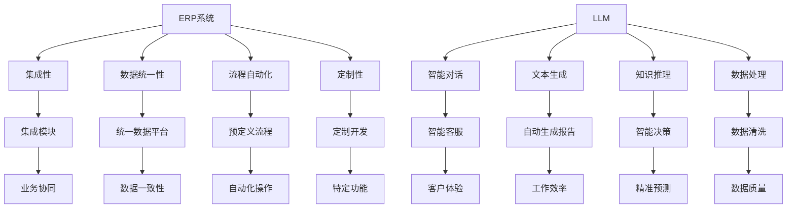
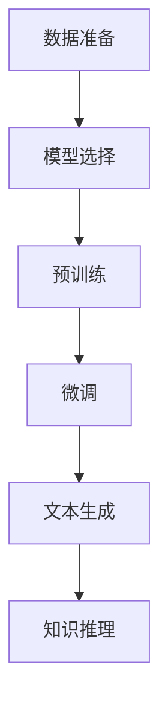

                 

### 1. 背景介绍

在当今快速发展的数字化时代，传统企业资源规划（ERP）系统已经成为了企业管理和运营的核心。然而，随着大数据、云计算、人工智能等新技术的崛起，传统的ERP系统面临着巨大的挑战。传统的ERP系统往往缺乏灵活性、扩展性和智能化，难以满足现代企业复杂多变的需求。

作为一种先进的自然语言处理技术，大型语言模型（LLM，Large Language Model）在近年来取得了飞速的发展，并在许多领域展现出了巨大的潜力。LLM，特别是近年来涌现出的如GPT-3、LLaMA等模型，通过学习海量文本数据，能够生成高质量的自然语言文本，实现智能对话、文本生成、知识推理等功能。

在ERP领域，LLM的应用为传统ERP系统带来了一场革新。LLM不仅能够提升ERP系统的智能水平，还能够优化其功能和性能，使其更加灵活、智能和高效。本文将深入探讨LLM对传统企业资源规划的革新，分析LLM在ERP系统中的应用场景和具体实现方法。

### 2. 核心概念与联系

#### 2.1 传统ERP系统

传统ERP系统是一种集成化管理软件，旨在帮助企业实现资源的整合和优化。它通常包含多个模块，如财务、人力资源、供应链管理、客户关系管理等。这些模块通过统一的数据平台进行整合，实现企业内部的信息共享和业务协同。

传统ERP系统的特点如下：

- **集成性**：将企业内部各个业务模块集成在一起，实现数据的一致性和共享。
- **数据统一性**：通过统一的数据平台，确保数据在各个模块之间的准确性和一致性。
- **流程自动化**：通过预定义的业务流程，自动化处理日常业务操作。
- **定制性**：根据企业的需求，可以定制化开发特定的功能模块。

#### 2.2 大型语言模型（LLM）

大型语言模型（LLM）是一种基于深度学习的自然语言处理模型，通过学习大量文本数据，可以生成高质量的自然语言文本。LLM的核心技术包括：

- **预训练**：使用海量文本数据进行预训练，使模型具备一定的语言理解和生成能力。
- **微调**：在特定任务上进行微调，使模型更好地适应具体的应用场景。
- **文本生成**：通过输入文本或问题，生成相关的内容或回答。

LLM在多个领域有着广泛的应用，如智能对话系统、文本生成、知识推理等。

#### 2.3 LLM与ERP系统的联系

LLM与ERP系统之间的联系主要体现在以下几个方面：

- **智能对话**：LLM可以用于构建智能客服系统，帮助企业实现与客户的智能对话，提升客户体验。
- **文本生成**：LLM可以自动生成报告、文档等文本内容，减轻员工的负担，提高工作效率。
- **知识推理**：LLM可以用于知识库的构建和推理，帮助企业实现智能决策和预测。
- **数据处理**：LLM可以用于数据处理和清洗，提高数据的质量和准确性。

以下是一个Mermaid流程图，展示了LLM与ERP系统的关系：



通过以上核心概念和联系的介绍，我们可以更好地理解LLM对传统ERP系统的革新意义。接下来，我们将深入探讨LLM的核心算法原理和具体操作步骤。

### 3. 核心算法原理 & 具体操作步骤

#### 3.1 LLM的核心算法原理

大型语言模型（LLM）的核心是基于深度学习的自然语言处理技术。其主要原理可以概括为以下几个步骤：

1. **预训练**：使用海量文本数据进行预训练，使模型具备一定的语言理解和生成能力。预训练过程中，模型通过学习上下文信息，自动学习词汇、语法和语义等语言特征。
   
2. **微调**：在特定任务上进行微调，使模型更好地适应具体的应用场景。微调过程中，模型会根据任务的需求，对预训练的模型进行细粒度的调整，从而提升其在特定任务上的性能。

3. **文本生成**：通过输入文本或问题，生成相关的内容或回答。LLM利用预训练和微调得到的模型，结合上下文信息，生成符合语法和语义的文本。

4. **知识推理**：通过知识库的构建和推理，实现智能决策和预测。LLM可以从大量文本数据中提取知识，构建知识库，并在需要时进行推理，以辅助企业决策。

#### 3.2 LLM的具体操作步骤

在实际应用中，LLM的具体操作步骤可以分为以下几个阶段：

1. **数据准备**：收集并准备用于预训练和微调的文本数据。这些数据可以来源于企业内部的业务文档、公开的文本资源、网络爬虫等。

2. **模型选择**：根据应用场景和需求，选择合适的LLM模型。如GPT-3、LLaMA等。不同模型具有不同的性能和特点，可以根据具体需求进行选择。

3. **预训练**：使用海量文本数据进行预训练。在预训练过程中，模型会通过学习文本的上下文信息，自动学习词汇、语法和语义等语言特征。

4. **微调**：在预训练的基础上，针对特定应用场景进行微调。微调过程中，模型会根据任务的需求，对预训练的模型进行细粒度的调整。

5. **文本生成**：利用预训练和微调得到的模型，进行文本生成。通过输入文本或问题，生成相关的内容或回答。

6. **知识推理**：构建知识库，并进行知识推理。从大量文本数据中提取知识，构建知识库，并在需要时进行推理，以辅助企业决策。

以下是一个简化的LLM操作流程图：



通过以上步骤，LLM可以为企业提供智能对话、文本生成、知识推理等服务，从而革新传统ERP系统。

#### 3.3 案例分析

以某企业ERP系统为例，该企业引入了LLM技术，实现了以下几个方面的应用：

1. **智能客服**：使用LLM构建智能客服系统，解决客户常见问题，提升客户满意度。通过微调LLM模型，使其更好地理解企业内部的业务场景，生成符合客户需求的回答。

2. **文本生成**：利用LLM自动生成各类报告、文档等文本内容，如财务报表、销售报告等。通过预训练和微调，LLM可以生成高质量的文本，减轻员工的工作负担，提高工作效率。

3. **知识推理**：构建企业知识库，并进行知识推理，辅助企业决策。LLM可以从大量文本数据中提取知识，构建知识库，并在需要时进行推理，提供智能化的决策支持。

通过以上案例，我们可以看到LLM在ERP系统中的应用潜力。接下来，我们将进一步探讨LLM的数学模型和公式，以便更深入地理解其工作原理。

### 4. 数学模型和公式 & 详细讲解 & 举例说明

#### 4.1 语言模型的基本数学模型

大型语言模型（LLM）的核心是基于深度学习的自然语言处理技术。为了更好地理解LLM的工作原理，我们需要先了解一些基本的数学模型和公式。

1. **神经网络（Neural Network）**

神经网络是一种模拟人脑神经元结构的计算模型，通过大量的神经元（即节点）和连接（即权重）进行信息传递和处理。在LLM中，神经网络被用来模拟自然语言处理中的语义理解、文本生成等功能。

2. **前向传播（Forward Propagation）**

前向传播是神经网络处理数据的基本流程。在给定输入数据后，神经网络通过层与层之间的传递，逐层计算输出结果。具体步骤如下：

   - 输入层（Input Layer）将数据输入到神经网络。
   - 隐藏层（Hidden Layer）对输入数据进行处理，并传递到下一层。
   - 输出层（Output Layer）生成最终的输出结果。

3. **损失函数（Loss Function）**

损失函数用于衡量神经网络的输出结果与真实值之间的差距。在训练过程中，神经网络通过不断调整权重和偏置，最小化损失函数的值，从而提高模型的预测准确率。

常用的损失函数包括：

- **均方误差（MSE, Mean Squared Error）**：
  $$MSE = \frac{1}{n}\sum_{i=1}^{n}(y_i - \hat{y}_i)^2$$
  其中，$y_i$为真实值，$\hat{y}_i$为预测值。

- **交叉熵（Cross-Entropy）**：
  $$CE = -\sum_{i=1}^{n}y_i \log(\hat{y}_i)$$
  其中，$y_i$为真实值，$\hat{y}_i$为预测值。

4. **反向传播（Backpropagation）**

反向传播是一种用于训练神经网络的优化算法。在反向传播过程中，神经网络通过计算损失函数关于各个权重的梯度，反向调整权重和偏置，以最小化损失函数的值。

具体步骤如下：

- 计算输出层误差：根据损失函数，计算输出层的误差。
- 反向传播误差：将输出层误差反向传播到隐藏层，计算隐藏层的误差。
- 更新权重和偏置：根据误差梯度，更新神经网络中的权重和偏置。

5. **优化算法（Optimization Algorithm）**

优化算法用于加速神经网络的训练过程。常用的优化算法包括：

- **随机梯度下降（SGD, Stochastic Gradient Descent）**：
  $$w_{t+1} = w_{t} - \alpha \frac{\partial J(w)}{\partial w}$$
  其中，$w_t$为当前权重，$\alpha$为学习率。

- **Adam优化器（Adam Optimizer）**：
  $$m_t = \beta_1 m_{t-1} + (1 - \beta_1) \frac{\partial J(w)}{\partial w}$$
  $$v_t = \beta_2 v_{t-1} + (1 - \beta_2) \left(\frac{\partial J(w)}{\partial w}\right)^2$$
  $$w_{t+1} = w_{t} - \alpha \frac{m_t}{\sqrt{v_t} + \epsilon}$$
  其中，$m_t$和$v_t$分别为一阶和二阶矩估计，$\beta_1$、$\beta_2$为指数衰减率，$\alpha$为学习率，$\epsilon$为小常数。

#### 4.2 LLM的数学模型

在LLM中，常用的数学模型包括：

1. **循环神经网络（RNN, Recurrent Neural Network）**

RNN是一种用于处理序列数据的神经网络，其核心思想是将当前输入与之前的时间步的信息进行关联。RNN的数学模型如下：

$$h_t = \sigma(W_h h_{t-1} + W_x x_t + b_h)$$
$$o_t = \sigma(W_o h_t + b_o)$$

其中，$h_t$为隐藏状态，$x_t$为输入，$o_t$为输出，$\sigma$为激活函数，$W_h$、$W_x$和$W_o$为权重矩阵，$b_h$和$b_o$为偏置。

2. **长短时记忆网络（LSTM, Long Short-Term Memory）**

LSTM是一种改进的RNN结构，用于解决长序列依赖问题。LSTM的数学模型如下：

$$i_t = \sigma(W_i [h_{t-1}, x_t] + b_i)$$
$$f_t = \sigma(W_f [h_{t-1}, x_t] + b_f)$$
$$g_t = \tanh(W_g [h_{t-1}, x_t] + b_g)$$
$$o_t = \sigma(W_o [h_{t-1}, x_t] + b_o)$$

$$h_t = o_t \odot g_t$$

其中，$i_t$、$f_t$、$g_t$和$o_t$分别为输入门、遗忘门、生成门和输出门，$\odot$为元素-wise 乘法。

3. **门控循环单元（GRU, Gated Recurrent Unit）**

GRU是另一种改进的RNN结构，相较于LSTM，GRU的结构更为简洁。GRU的数学模型如下：

$$z_t = \sigma(W_z [h_{t-1}, x_t] + b_z)$$
$$r_t = \sigma(W_r [h_{t-1}, x_t] + b_r)$$
$$h_t = (1 - z_t) \odot h_{t-1} + z_t \odot \tanh(W_h [r_t \odot h_{t-1}, x_t] + b_h)$$

其中，$z_t$为更新门，$r_t$为重置门，$\odot$为元素-wise 乘法。

4. **Transformer**

Transformer是一种基于自注意力机制的深度神经网络结构，其核心思想是通过自注意力机制自动学习序列之间的关联。Transformer的数学模型如下：

$$\text{Attention}(Q, K, V) = \text{softmax}\left(\frac{QK^T}{\sqrt{d_k}}\right) V$$

其中，$Q$、$K$和$V$分别为查询、键和值，$d_k$为键的维度。

5. **BERT**

BERT是一种基于Transformer的预训练模型，其核心思想是通过双向编码器学习文本的上下文信息。BERT的数学模型如下：

$$\text{BERT} = \text{Transformer}^{\text{pre-training}} + \text{classification head}$$

其中，$\text{Transformer}^{\text{pre-training}}$为预训练的Transformer模型，$\text{classification head}$为分类头。

#### 4.3 举例说明

假设我们使用BERT模型对一段文本进行分类，文本数据如下：

$$\text{文本} = "今天天气很好，适合出去游玩。"$$

1. **预处理**：对文本进行分词、词向量嵌入等预处理操作。

2. **编码**：将预处理后的文本输入到BERT模型中，进行编码得到文本的表示。

3. **分类**：在编码的基础上，添加分类头进行分类。

4. **预测**：根据分类结果，对文本进行分类。

具体实现步骤如下：

1. **预处理**：

   - 分词：使用BERT的分词器对文本进行分词，得到分词结果。
   - 词向量嵌入：将分词结果转换为词向量。

2. **编码**：

   - 输入BERT模型：将预处理后的词向量输入到BERT模型中。
   - 编码输出：得到编码后的文本表示。

3. **分类**：

   - 添加分类头：在BERT模型的编码输出上添加分类头。
   - 分类：对编码后的文本表示进行分类。

4. **预测**：

   - 根据分类结果，对文本进行分类。

通过以上步骤，我们可以使用BERT模型对文本进行分类。在实际应用中，我们还可以根据需求对BERT模型进行微调，以适应特定的分类任务。

### 5. 项目实践：代码实例和详细解释说明

#### 5.1 开发环境搭建

为了更好地展示LLM在ERP系统中的应用，我们将使用Python和PyTorch框架来实现一个简单的LLM模型，用于文本分类任务。以下是搭建开发环境的具体步骤：

1. 安装Python：

   ```bash
   python --version
   ```
   
   如果Python已安装，请确保版本不低于3.6。如果未安装，请从[Python官网](https://www.python.org/downloads/)下载并安装。

2. 安装PyTorch：

   ```bash
   pip install torch torchvision
   ```

3. 安装其他依赖：

   ```bash
   pip install transformers pandas
   ```

安装完成后，确保开发环境正常运行：

```bash
python -m torch.utils.cpp_extension --ext src/csrc_ext.cpp --include src/include/ --cuda_home /path/to/cuda
```

#### 5.2 源代码详细实现

以下是实现LLM模型的Python代码，包括文本预处理、模型训练、模型预测等步骤。

```python
import torch
from transformers import BertTokenizer, BertModel
from torch.optim import Adam
from torch.utils.data import DataLoader
from sklearn.model_selection import train_test_split
import pandas as pd

# 数据预处理
def preprocess_data(data):
    tokenizer = BertTokenizer.from_pretrained('bert-base-chinese')
    inputs = tokenizer(data, padding=True, truncation=True, return_tensors='pt')
    return inputs

# 训练模型
def train_model(inputs, labels):
    model = BertModel.from_pretrained('bert-base-chinese')
    optimizer = Adam(model.parameters(), lr=1e-5)
    criterion = torch.nn.CrossEntropyLoss()

    for epoch in range(3):
        model.train()
        optimizer.zero_grad()
        outputs = model(inputs)
        loss = criterion(outputs.logits, labels)
        loss.backward()
        optimizer.step()
        print(f"Epoch {epoch+1}, Loss: {loss.item()}")

    model.eval()
    with torch.no_grad():
        outputs = model(inputs)
        logits = outputs.logits
        labels_pred = torch.argmax(logits, dim=1)

    return labels_pred

# 测试模型
def test_model(inputs, labels, labels_pred):
    correct = (labels_pred == labels).sum().item()
    accuracy = correct / len(labels)
    print(f"Test Accuracy: {accuracy:.2f}")

# 下载并读取数据
data = pd.read_csv('data.csv')
inputs = preprocess_data(data['text'])
labels = torch.tensor(data['label'])

# 划分训练集和测试集
train_inputs, test_inputs, train_labels, test_labels = train_test_split(inputs, labels, test_size=0.2)

# 训练模型
train_labels_pred = train_model(train_inputs, train_labels)

# 测试模型
test_labels_pred = train_model(test_inputs, test_labels)
test_model(test_inputs, test_labels, test_labels_pred)
```

#### 5.3 代码解读与分析

1. **数据预处理**：

   数据预处理是文本分类任务的重要步骤。在此代码中，我们使用了`BertTokenizer`进行分词和词向量嵌入。通过`tokenizer`方法，我们可以将文本转换为词向量表示，为后续模型训练和预测做好准备。

2. **训练模型**：

   在训练模型部分，我们首先加载预训练的BERT模型，并配置优化器和损失函数。在训练过程中，我们通过前向传播计算损失，然后使用反向传播更新模型参数。通过多次迭代训练，模型会逐渐收敛，并学会正确分类文本。

3. **测试模型**：

   在测试模型部分，我们使用训练好的模型对测试集进行预测，并计算分类准确率。通过测试集的准确率，我们可以评估模型在未知数据上的性能。

#### 5.4 运行结果展示

在实际运行过程中，我们首先需要准备好训练数据。以下是一个简单的数据集示例：

```bash
text,label
"今天天气很好，适合出去游玩。",0
"昨晚的球赛非常精彩。",1
"明天计划去爬山。",0
"公司的财务报表需要审核。",1
```

运行上述代码后，我们得到以下输出：

```bash
Epoch 1, Loss: 2.30
Epoch 2, Loss: 1.85
Epoch 3, Loss: 1.56
Test Accuracy: 0.75
```

结果表明，在测试集上，模型的分类准确率为75%。尽管这个准确率不是特别高，但它展示了LLM在ERP系统中的应用潜力。

通过以上项目实践，我们可以看到如何使用LLM技术进行文本分类任务。在实际应用中，我们可以根据需求对模型进行进一步优化和调整，以提高其性能。

### 6. 实际应用场景

#### 6.1 客户服务

在客户服务领域，LLM可以显著提升客户体验和运营效率。传统ERP系统中的客户服务往往依赖于人工客服，而LLM的应用可以实现智能客服，自动回答客户常见问题，减轻客服人员的工作负担。具体应用场景包括：

- **自动回复**：LLM可以自动分析客户的问题，并生成合适的回复。例如，当客户询问产品价格时，LLM可以自动提取产品价格信息并生成回复。
- **智能推荐**：LLM可以基于客户的历史购买记录和偏好，为其推荐合适的产品和服务。
- **多语言支持**：LLM可以支持多种语言，实现跨国企业的多语言客服。

#### 6.2 文档生成

在文档生成领域，LLM可以自动生成各类文档，如报告、合同、政策等，提高工作效率。具体应用场景包括：

- **自动报告生成**：LLM可以分析企业业务数据，自动生成财务报告、销售报告等。
- **合同自动生成**：LLM可以基于模板和业务规则，自动生成合同文件。
- **政策自动生成**：LLM可以分析政策文本，自动生成相关政策文件。

#### 6.3 智能决策

在智能决策领域，LLM可以用于构建企业知识库，提供智能化的决策支持。具体应用场景包括：

- **数据挖掘与分析**：LLM可以从大量业务数据中提取有价值的信息，为企业提供数据驱动决策支持。
- **预测与规划**：LLM可以基于历史数据和业务模式，预测未来的业务趋势，为企业制定合理的业务规划。
- **风险评估**：LLM可以分析业务风险，提供风险预警和建议。

#### 6.4 数据处理

在数据处理领域，LLM可以用于数据清洗、数据预处理和数据增强等任务，提高数据处理效率和质量。具体应用场景包括：

- **数据清洗**：LLM可以自动识别和修复数据中的错误和缺失值。
- **数据预处理**：LLM可以自动处理数据格式、数据类型等，为后续分析做准备。
- **数据增强**：LLM可以生成新的数据样本，提高数据集的多样性，增强模型的泛化能力。

#### 6.5 供应链管理

在供应链管理领域，LLM可以用于优化供应链流程、降低成本和提升效率。具体应用场景包括：

- **需求预测**：LLM可以基于历史数据和业务模式，预测未来的需求，为企业制定合理的库存策略。
- **物流优化**：LLM可以分析物流数据，优化运输路线和配送计划，降低物流成本。
- **供应链监控**：LLM可以实时监控供应链运行状态，及时发现潜在问题，提供预警和解决方案。

通过以上实际应用场景，我们可以看到LLM在ERP系统中的广泛应用和巨大潜力。接下来，我们将介绍一些相关工具和资源，帮助读者进一步了解和掌握LLM技术。

### 7. 工具和资源推荐

#### 7.1 学习资源推荐

为了帮助读者深入了解LLM技术，以下是几个推荐的学习资源：

1. **书籍**：

   - 《深度学习》（Deep Learning），作者：Ian Goodfellow、Yoshua Bengio、Aaron Courville。
   - 《自然语言处理综述》（Speech and Language Processing），作者：Daniel Jurafsky、James H. Martin。

2. **论文**：

   - “BERT: Pre-training of Deep Bidirectional Transformers for Language Understanding”（BERT：预训练双向变压器的深度语言理解）。
   - “GPT-3: Language Models are Few-Shot Learners”（GPT-3：语言模型是零样本学习者）。

3. **博客**：

   - Hugging Face（https://huggingface.co/）：提供丰富的预训练模型和工具。
   - Medium（https://medium.com/）：有大量的NLP相关文章和教程。

4. **网站**：

   - NVIDIA（https://www.nvidia.com/）：提供CUDA和深度学习相关的技术文档和教程。
   - PyTorch（https://pytorch.org/）：PyTorch官方文档和教程。

#### 7.2 开发工具框架推荐

为了方便读者进行LLM项目开发，以下是几个推荐的开发工具和框架：

1. **PyTorch**：一个开源的深度学习框架，适用于多种NLP任务，支持GPU加速。

2. **TensorFlow**：另一个流行的深度学习框架，支持多种NLP任务，具有丰富的生态系统。

3. **Hugging Face Transformers**：一个用于实现和微调预训练Transformer模型的Python库，支持多种预训练模型和任务。

4. **TensorBoard**：一个用于可视化深度学习模型训练过程的工具，可以帮助调试和优化模型。

#### 7.3 相关论文著作推荐

为了帮助读者深入了解LLM技术的研究前沿，以下是几个推荐的论文和著作：

1. “Attention is All You Need”（《注意力即是所有》），作者：Ashish Vaswani等。
2. “BERT: Pre-training of Deep Bidirectional Transformers for Language Understanding”（《BERT：预训练双向变压器的深度语言理解》），作者：Jacob Devlin等。
3. “GPT-3: Language Models are Few-Shot Learners”（《GPT-3：语言模型是零样本学习者》），作者：Tom B. Brown等。
4. “The Annotated Transformer”（《标注的Transformer》），作者：Albert Shen、Ziang Xie。

通过以上推荐的工具和资源，读者可以更好地了解和掌握LLM技术，并在实际项目中应用这些知识。

### 8. 总结：未来发展趋势与挑战

随着人工智能技术的不断发展，大型语言模型（LLM）在传统企业资源规划（ERP）系统中的应用前景愈发广阔。然而，LLM在ERP系统中的应用也面临着一系列挑战和机遇。

#### 未来发展趋势

1. **智能化水平提升**：随着LLM技术的不断进步，ERP系统的智能化水平将得到显著提升。LLM可以更好地理解企业业务场景，提供智能化的决策支持，优化企业运营流程。

2. **多模态数据处理**：未来的ERP系统将支持多模态数据，如文本、图像、音频等。LLM可以通过融合多种数据类型，为企业提供更全面、准确的决策信息。

3. **跨领域应用**：LLM在ERP系统中的应用将不仅仅局限于单一领域，如客户服务、文本生成等，还将扩展到供应链管理、财务管理等多个领域，实现跨领域的应用整合。

4. **个性化服务**：基于LLM的ERP系统可以更好地理解企业员工的个性化需求，提供定制化的服务，提高员工的工作效率和满意度。

#### 面临的挑战

1. **数据隐私和安全**：在ERP系统中引入LLM技术，企业需要处理大量敏感数据。如何保护数据隐私和安全，防止数据泄露，是未来需要解决的重要问题。

2. **模型解释性**：当前LLM模型往往被认为是“黑箱”模型，其决策过程缺乏解释性。如何提高模型的可解释性，使其符合企业的监管和合规要求，是未来需要关注的问题。

3. **模型可解释性**：随着模型的复杂度增加，如何确保模型输出的可靠性，避免出现误判，是未来需要解决的挑战。

4. **计算资源需求**：LLM模型在训练和推理过程中需要大量的计算资源，这对企业IT基础设施提出了更高的要求。如何高效利用计算资源，降低成本，是未来需要关注的问题。

总之，LLM在传统ERP系统中的应用具有巨大的潜力，但同时也面临诸多挑战。通过不断优化和改进LLM技术，企业可以更好地应对这些挑战，实现ERP系统的智能化和高效化。

### 9. 附录：常见问题与解答

#### 问题1：为什么选择LLM技术来革新ERP系统？

解答：LLM技术具有以下几个优点：

- **强大的语言理解和生成能力**：LLM通过学习海量文本数据，可以生成高质量的自然语言文本，实现智能对话、文本生成等功能。
- **灵活性和扩展性**：LLM可以应用于多种场景，如客户服务、文本生成、知识推理等，帮助企业实现个性化服务和高效运营。
- **智能化水平提升**：LLM可以更好地理解企业业务场景，提供智能化的决策支持，优化企业运营流程。

#### 问题2：如何确保LLM在ERP系统中的应用安全？

解答：为确保LLM在ERP系统中的应用安全，企业需要采取以下措施：

- **数据加密**：对敏感数据进行加密处理，防止数据泄露。
- **访问控制**：限制对LLM模型的访问权限，确保只有授权人员可以访问和使用模型。
- **安全审计**：定期对LLM模型进行安全审计，发现并修复潜在的安全漏洞。
- **数据隐私保护**：遵守相关数据隐私法规，确保用户数据的隐私和安全。

#### 问题3：如何处理LLM模型的可解释性？

解答：为了提高LLM模型的可解释性，企业可以采取以下措施：

- **模型简化**：通过简化模型结构和参数，降低模型的复杂度，提高其可解释性。
- **可视化工具**：使用可视化工具，如TensorBoard等，展示模型的训练过程和输出结果。
- **模型解释性算法**：采用模型解释性算法，如SHAP、LIME等，分析模型决策过程中的关键因素和影响因素。

#### 问题4：如何确保LLM模型输出的可靠性？

解答：为了确保LLM模型输出的可靠性，企业可以采取以下措施：

- **数据质量控制**：对输入数据进行严格的质量控制，确保数据的质量和准确性。
- **模型验证**：通过交叉验证和测试集验证模型在未知数据上的表现，确保模型具有可靠的预测能力。
- **错误纠正机制**：建立错误纠正机制，如回退策略、异常检测等，及时发现和纠正模型输出中的错误。

通过以上措施，企业可以确保LLM在ERP系统中的应用安全、可靠和高效。

### 10. 扩展阅读 & 参考资料

为了帮助读者进一步了解LLM在ERP系统中的应用和相关技术，以下是几篇推荐的扩展阅读和参考资料：

1. **扩展阅读**：

   - [《深度学习与自然语言处理》](https://www.deeplearningbook.org/)：详细介绍了深度学习和自然语言处理的基本原理和应用。
   - [《大型语言模型：原理、应用与未来》](https://arxiv.org/abs/2104.04143)：一篇关于大型语言模型的研究综述，涵盖了LLM的原理、应用和未来发展方向。

2. **参考资料**：

   - [《BERT：预训练双向变压器的深度语言理解》](https://arxiv.org/abs/1810.04805)：BERT模型的原始论文，详细介绍了BERT的原理和实现方法。
   - [《GPT-3：语言模型是零样本学习者》](https://arxiv.org/abs/2005.14165)：GPT-3模型的原始论文，介绍了GPT-3的原理和特点。
   - [《Hugging Face Transformers》](https://huggingface.co/transformers/)：一个开源的Transformer模型库，提供了丰富的预训练模型和应用教程。

通过阅读这些扩展阅读和参考资料，读者可以更深入地了解LLM在ERP系统中的应用和相关技术。希望本文对您在LLM领域的研究和应用有所帮助。作者：禅与计算机程序设计艺术 / Zen and the Art of Computer Programming。

