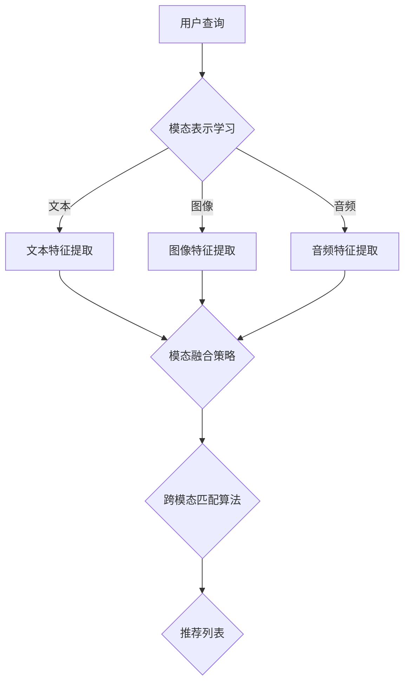

                 

### 1. 背景介绍

随着人工智能技术的发展，大规模语言模型（LLM）逐渐成为自然语言处理（NLP）领域的重要工具。LLM能够通过学习海量文本数据，对输入的文本进行理解和生成，从而完成各种复杂的语言任务，如图像描述生成、机器翻译、文本摘要等。然而，在处理复杂任务时，单纯依赖LLM可能无法满足实际需求，特别是当任务需要结合多模态信息时。

跨模态检索技术作为一种新兴的研究方向，旨在将不同模态的数据（如文本、图像、音频等）进行有效整合，以提高模型的性能和适应性。在推荐系统中，跨模态检索技术尤为重要。传统的推荐系统通常只考虑单一模态的信息，如基于内容的推荐系统（CBR）仅依赖于文本信息，而忽视了图像、音频等其他模态的信息。这种局限性导致推荐系统在面对复杂场景时，效果不佳。

跨模态检索技术的出现，为推荐系统带来了新的机遇。通过整合多模态信息，跨模态检索技术能够更全面地理解用户和物品的属性，从而提高推荐系统的准确性和多样性。例如，在电子商务平台中，用户可能对某个产品的描述感兴趣，同时被该产品的图像所吸引。跨模态检索技术可以同时考虑文本和图像信息，为用户提供更加精准的推荐。

此外，随着虚拟现实（VR）、增强现实（AR）等技术的发展，多模态交互需求日益增长。跨模态检索技术在这些领域具有广泛的应用前景。例如，在VR游戏中，用户可以通过语音、手势等多种方式与虚拟世界进行交互。跨模态检索技术可以帮助游戏系统更好地理解用户的意图和行为，提供更加沉浸式的体验。

总之，跨模态检索技术在推荐系统、虚拟现实、增强现实等多个领域具有重要的应用价值。本文将重点探讨跨模态检索技术在推荐系统中的应用，介绍其核心概念、算法原理、数学模型，并通过实际项目实践，展示其效果和应用方法。

---

在本文接下来的章节中，我们将逐步深入探讨跨模态检索技术的各个方面：

## 2. 核心概念与联系

### 2.1. 跨模态检索的定义

跨模态检索是指在不同模态之间进行信息检索的过程，旨在找到与用户查询相匹配的模态信息。常见的模态包括文本（Text）、图像（Image）、音频（Audio）和视频（Video）等。跨模态检索的核心目标是将不同模态的数据进行有效整合，使其在特定任务中（如推荐系统）能够协同工作，提高整体性能。

### 2.2. 跨模态检索的关键技术

#### 2.2.1. 模态表示学习

模态表示学习是跨模态检索的基础，其目标是学习每个模态的特征表示，使不同模态的特征能够在同一空间中进行有效交互。常见的模态表示学习方法包括：

- **词嵌入（Word Embedding）**：将文本信息映射到低维向量空间，常用的方法有Word2Vec、GloVe等。
- **图像特征提取（Image Feature Extraction）**：通过卷积神经网络（CNN）提取图像特征，如VGG、ResNet等。
- **音频特征提取（Audio Feature Extraction）**：使用深度神经网络（DNN）或循环神经网络（RNN）提取音频特征，如Mel频谱、自动回归模型等。

#### 2.2.2. 模态融合策略

模态融合策略是将不同模态的特征进行整合，以生成一个统一的多模态特征表示。常见的融合策略包括：

- **基于特征的融合**：将不同模态的特征直接拼接或加权融合，如将文本特征和图像特征进行拼接。
- **基于模型的融合**：使用联合训练的深度神经网络模型，如多模态卷积神经网络（MM-CNN）或多模态循环神经网络（MM-RNN）。

#### 2.2.3. 跨模态匹配算法

跨模态匹配算法是跨模态检索的关键步骤，其目标是找到与用户查询最相关的模态信息。常见的匹配算法包括：

- **基于相似度的匹配**：使用距离度量（如欧氏距离、余弦相似度）计算查询和候选物品之间的相似度，选取最相似的物品作为检索结果。
- **基于学习的匹配**：使用深度学习模型（如Siamese网络、Triplet Loss）学习查询和候选物品之间的匹配关系，通过优化损失函数找到最佳匹配。

### 2.3. 跨模态检索在推荐系统中的应用

在推荐系统中，跨模态检索技术可以提高推荐系统的多样性和准确性。以下是一个简化的跨模态推荐系统框架：

1. **用户和物品表示**：使用模态表示学习技术，将用户和物品的属性（如用户喜好、物品描述、图像、音频等）映射到低维向量空间。
2. **模态融合**：根据任务需求，采用合适的模态融合策略，生成统一的多模态特征表示。
3. **推荐生成**：使用跨模态匹配算法，计算用户和物品之间的相似度，根据相似度得分生成推荐列表。

通过引入跨模态检索技术，推荐系统可以更加全面地理解用户和物品的属性，从而提供更加精准和多样化的推荐。例如，在电子商务平台中，用户可能对某个产品的描述感兴趣，同时被该产品的图像所吸引。跨模态检索技术可以同时考虑文本和图像信息，为用户提供更加个性化的推荐。

### 2.4. Mermaid 流程图

为了更好地理解跨模态检索技术在推荐系统中的应用，下面是一个简化的Mermaid流程图：



在这个流程图中，用户查询首先通过模态表示学习技术，将不同模态的数据提取特征，然后使用模态融合策略生成统一的多模态特征表示。最后，通过跨模态匹配算法计算用户和物品之间的相似度，生成推荐列表。

---

在下一章节中，我们将进一步探讨跨模态检索技术中的核心算法原理和具体操作步骤。

---

### 2. 核心概念与联系（续）

#### 2.5. 跨模态检索技术的优势与挑战

跨模态检索技术在推荐系统中具有显著的优势，但也面临一些挑战。

**优势：**

1. **提升推荐准确性**：通过整合多模态信息，跨模态检索技术能够更全面地理解用户和物品的属性，从而提高推荐系统的准确性。例如，在电影推荐中，用户对电影的评分、评论和海报图像等信息可以相互补充，帮助推荐系统更好地理解用户偏好。

2. **增强推荐多样性**：跨模态检索技术可以挖掘不同模态之间的潜在关联，从而提供更加多样化的推荐。例如，在音乐推荐中，用户可能对某个歌手的歌词感兴趣，同时也喜欢该歌手的图像和音频作品。跨模态检索技术可以同时考虑这些信息，为用户提供丰富的推荐选项。

3. **适应多模态场景**：随着虚拟现实、增强现实等技术的发展，多模态交互需求日益增长。跨模态检索技术可以帮助推荐系统更好地适应这些多模态场景，提供更加自然的交互体验。

**挑战：**

1. **模态融合难度**：不同模态的数据具有不同的特征和语义，如何有效地融合这些模态是跨模态检索技术的一大挑战。传统的简单拼接和加权融合方法可能无法充分利用不同模态的信息，导致推荐效果不佳。

2. **数据不平衡问题**：在多模态数据中，不同模态的数据量可能差异较大，例如，图像数据通常远多于文本数据。如何平衡不同模态的数据，使其在模型训练过程中发挥最佳作用，是另一个需要解决的问题。

3. **计算资源消耗**：跨模态检索技术通常涉及复杂的特征提取和匹配算法，计算资源消耗较大。在实时推荐系统中，如何优化算法以提高计算效率，是一个需要考虑的问题。

#### 2.6. 跨模态检索与相关技术的比较

跨模态检索技术与其他相关技术（如图像识别、自然语言处理等）有明显的区别和联系。

**与图像识别技术比较：**

- **目标不同**：图像识别技术主要关注单一模态的图像数据，而跨模态检索技术旨在整合不同模态的数据。
- **方法不同**：图像识别技术通常使用卷积神经网络（CNN）提取图像特征，而跨模态检索技术需要同时考虑多种模态的特征。

**与自然语言处理技术比较：**

- **目标不同**：自然语言处理技术主要关注文本数据，而跨模态检索技术旨在整合文本和其他模态的数据。
- **方法不同**：自然语言处理技术通常使用词嵌入、循环神经网络（RNN）等技术提取文本特征，而跨模态检索技术需要同时考虑多种模态的特征。

**与多模态学习技术比较：**

- **目标不同**：多模态学习技术旨在同时学习多种模态的特征，而跨模态检索技术主要关注不同模态之间的信息检索和整合。
- **方法不同**：多模态学习技术通常使用联合训练的深度神经网络模型，而跨模态检索技术则需要设计合适的模态融合和匹配算法。

#### 2.7. 跨模态检索技术在推荐系统中的应用案例

跨模态检索技术在推荐系统中已有一些成功应用案例，以下是一些具体应用场景：

1. **电子商务平台**：通过整合用户购买历史、产品描述、图像等信息，为用户提供个性化推荐。例如，亚马逊和淘宝等电商平台已经采用跨模态检索技术，提高推荐系统的准确性。

2. **社交媒体**：通过整合用户发布的内容（如文本、图像、视频等）和其他用户特征（如兴趣爱好、地理位置等），为用户提供内容推荐和社交推荐。例如，Instagram和Facebook等社交媒体平台已经采用跨模态检索技术，提高用户的推荐体验。

3. **虚拟现实和增强现实**：通过整合用户交互行为、语音、手势等多种模态信息，为用户提供更加自然的交互体验。例如，Unity和Unity等虚拟现实和增强现实平台已经采用跨模态检索技术，提高用户的沉浸感和互动性。

#### 2.8. 总结

跨模态检索技术在推荐系统中具有重要的应用价值。通过整合不同模态的信息，跨模态检索技术可以更全面地理解用户和物品的属性，从而提高推荐系统的准确性、多样性和适应性。然而，跨模态检索技术也面临一些挑战，如模态融合、数据不平衡和计算资源消耗等。未来的研究可以进一步优化跨模态检索算法，提高其性能和实用性。

---

在下一章节中，我们将深入探讨跨模态检索技术中的核心算法原理和具体操作步骤。

---

### 3. 核心算法原理 & 具体操作步骤

#### 3.1. 跨模态检索技术的基本架构

跨模态检索技术的基本架构可以分为三个主要模块：模态表示学习、模态融合和跨模态匹配。以下将详细解释每个模块的工作原理和具体操作步骤。

**模态表示学习：** 

模态表示学习是跨模态检索技术的基础。其核心目标是学习每个模态的特征表示，使得不同模态的特征可以在同一空间中有效交互。具体操作步骤如下：

1. **文本特征提取**：使用词嵌入（Word Embedding）技术，如Word2Vec或GloVe，将文本信息映射到低维向量空间。词嵌入可以将文本中的每个单词映射为一个固定大小的向量，从而在向量空间中表示文本信息。

2. **图像特征提取**：使用卷积神经网络（CNN）提取图像特征。常见的CNN架构包括VGG、ResNet等。CNN通过多个卷积层和池化层，逐层提取图像的局部特征和全局特征，从而生成图像的特征向量。

3. **音频特征提取**：使用深度神经网络（DNN）或循环神经网络（RNN）提取音频特征。音频特征提取通常分为频域特征和时域特征。频域特征如梅尔频谱（Mel-Spectrogram）可以捕捉音频的频率信息，时域特征如短时傅里叶变换（STFT）可以捕捉音频的时序信息。

**模态融合：**

模态融合是将不同模态的特征进行整合，生成一个统一的多模态特征表示。模态融合可以采用基于特征的融合和基于模型的融合两种方法。以下分别介绍这两种方法的具体操作步骤：

1. **基于特征的融合**：将不同模态的特征向量直接拼接或加权融合。拼接方法将每个模态的特征向量拼接成一个更长的特征向量，如$$ \textbf{X} = [\textbf{X}_\text{Text}, \textbf{X}_\text{Image}, \textbf{X}_\text{Audio}]$$。加权融合方法则通过对不同模态的特征向量进行加权组合，如$$ \textbf{X} = \alpha \textbf{X}_\text{Text} + \beta \textbf{X}_\text{Image} + \gamma \textbf{X}_\text{Audio}$$，其中$\alpha$、$\beta$和$\gamma$是权重系数。

2. **基于模型的融合**：使用联合训练的深度神经网络模型，如多模态卷积神经网络（MM-CNN）或多模态循环神经网络（MM-RNN）。这些模型通过多模态输入，同时学习不同模态的特征表示和融合策略。例如，MM-CNN使用卷积层同时处理文本、图像和音频特征，通过多个卷积层和池化层，逐步提取多模态特征。

**跨模态匹配：**

跨模态匹配是跨模态检索技术的核心步骤，其目标是找到与用户查询最相关的模态信息。以下介绍几种常见的跨模态匹配算法：

1. **基于相似度的匹配**：使用距离度量（如欧氏距离、余弦相似度）计算查询和候选物品之间的相似度，选取最相似的物品作为检索结果。具体操作步骤如下：

   - **特征向量表示**：将用户查询和候选物品的模态特征表示为向量，如$$ \textbf{q} = \textbf{q}_\text{Text}, \textbf{i} = \textbf{i}_\text{Image}, \textbf{a} = \textbf{a}_\text{Audio}$$。
   - **相似度计算**：计算查询和候选物品之间的相似度，如$$ \text{similarity}(\textbf{q}, \textbf{i}) = \text{similarity}(\textbf{q}_\text{Text}, \textbf{i}_\text{Image}) + \text{similarity}(\textbf{q}_\text{Text}, \textbf{i}_\text{Audio})$$，使用余弦相似度或欧氏距离作为度量方法。
   - **检索结果生成**：根据相似度得分，选取最高分的候选物品作为检索结果。

2. **基于学习的匹配**：使用深度学习模型（如Siamese网络、Triplet Loss）学习查询和候选物品之间的匹配关系。具体操作步骤如下：

   - **模型训练**：使用大量带标签的数据集，训练深度学习模型，如Siamese网络通过优化对比损失（Contrastive Loss），学习查询和候选物品之间的匹配关系。
   - **模型应用**：将训练好的模型应用于新的查询和候选物品，计算匹配得分，选取最高分的候选物品作为检索结果。

#### 3.2. 跨模态检索算法的实现细节

在实现跨模态检索算法时，需要考虑以下细节：

1. **数据预处理**：对多模态数据进行预处理，包括文本分词、图像大小调整、音频降噪等，以确保不同模态的数据在相同的尺度上进行处理。

2. **特征提取**：选择合适的特征提取方法，如Word2Vec、VGG、ResNet、DNN、RNN等，提取不同模态的特征。

3. **模型训练**：使用带标签的数据集，训练模态表示学习、模态融合和跨模态匹配模型。在训练过程中，可以使用交叉验证、批处理、学习率调整等技术，优化模型性能。

4. **模型评估**：使用无标签的数据集，评估模型的检索性能，如准确率、召回率、F1分数等。通过调整模型参数和特征提取方法，提高模型性能。

5. **应用部署**：将训练好的模型部署到推荐系统，实现实时跨模态检索。在部署过程中，需要考虑计算资源、响应时间和系统稳定性等因素。

#### 3.3. 跨模态检索技术的优势与局限性

跨模态检索技术在推荐系统中具有显著的优势，但也存在一些局限性。

**优势：**

1. **提升推荐准确性**：通过整合多模态信息，跨模态检索技术可以更全面地理解用户和物品的属性，从而提高推荐系统的准确性。

2. **增强推荐多样性**：跨模态检索技术可以挖掘不同模态之间的潜在关联，从而提供更加多样化的推荐。

3. **适应多模态场景**：跨模态检索技术可以帮助推荐系统更好地适应虚拟现实、增强现实等多模态交互场景。

**局限性：**

1. **模态融合难度**：不同模态的数据具有不同的特征和语义，如何有效地融合这些模态是一个挑战。

2. **数据不平衡问题**：多模态数据中不同模态的数据量可能差异较大，如何平衡不同模态的数据是一个问题。

3. **计算资源消耗**：跨模态检索技术通常涉及复杂的特征提取和匹配算法，计算资源消耗较大。

#### 3.4. 跨模态检索技术的实际应用案例

以下是一些跨模态检索技术在推荐系统中的实际应用案例：

1. **电子商务平台**：通过整合用户购买历史、产品描述、图像等信息，为用户提供个性化推荐。例如，亚马逊使用跨模态检索技术，将用户的历史购买记录、产品描述和图像信息进行融合，提高推荐系统的准确性。

2. **社交媒体**：通过整合用户发布的内容（如文本、图像、视频等）和其他用户特征（如兴趣爱好、地理位置等），为用户提供内容推荐和社交推荐。例如，Instagram使用跨模态检索技术，将用户发布的内容和用户特征进行融合，提高推荐系统的多样性。

3. **虚拟现实和增强现实**：通过整合用户交互行为、语音、手势等多种模态信息，为用户提供更加自然的交互体验。例如，Unity使用跨模态检索技术，将用户的语音、手势和交互行为进行融合，提高虚拟现实和增强现实平台的互动性。

---

在下一章节中，我们将深入探讨跨模态检索技术中的数学模型和公式，以及详细的讲解和举例说明。

---

### 4. 数学模型和公式 & 详细讲解 & 举例说明

在跨模态检索技术中，数学模型和公式起着至关重要的作用。以下将详细讲解跨模态检索技术中的核心数学模型和公式，并通过具体例子进行说明。

#### 4.1. 模态表示学习

模态表示学习是跨模态检索的基础，其核心目标是学习每个模态的特征表示，使得不同模态的特征可以在同一空间中有效交互。

**4.1.1. 文本特征提取**

文本特征提取通常使用词嵌入技术，将文本映射到低维向量空间。常用的词嵌入方法包括Word2Vec和GloVe。

- **Word2Vec**：Word2Vec是一种基于神经网络的词嵌入方法，通过训练一个神经网络模型，将每个单词映射为一个低维向量。具体来说，Word2Vec采用两个神经网络：一个用于生成单词的上下文，另一个用于预测上下文中的单词。训练完成后，每个单词对应一个向量，这些向量可以在同一空间中表示文本信息。

- **GloVe**：GloVe（Global Vectors for Word Representation）是一种基于全局平均方法的词嵌入方法。GloVe通过优化词频和共现关系，生成每个单词的向量表示。GloVe的数学模型如下：

  $$ \textbf{v}_\text{w} = \text{softmax}^{-1}(\textbf{W} \textbf{w}_\text{w}) $$

  其中，$\textbf{v}_\text{w}$是单词$w$的向量表示，$\textbf{W}$是权重矩阵，$\textbf{w}_\text{w}$是单词$w$的索引向量。

**4.1.2. 图像特征提取**

图像特征提取通常使用卷积神经网络（CNN）提取图像的局部和全局特征。常用的CNN架构包括VGG、ResNet等。

- **VGG**：VGG是一种基于卷积神经网络的图像特征提取方法，采用多个卷积层和池化层，逐步提取图像的局部特征。VGG的数学模型如下：

  $$ \textbf{f}(\textbf{x}; \theta) = \text{ReLU}(\textbf{W}^{(1)} \textbf{x} + b^{(1)}) \xrightarrow{\text{Pooling}} \text{ReLU}(\textbf{W}^{(2)} f(\textbf{x}; \theta) + b^{(2)}) \xrightarrow{\text{Pooling}} \ldots $$

  其中，$\textbf{f}(\textbf{x}; \theta)$是图像特征提取函数，$\textbf{x}$是输入图像，$\theta$是模型参数，$\textbf{W}^{(l)}$和$b^{(l)}$是第$l$层的权重和偏置。

- **ResNet**：ResNet是一种基于残差连接的卷积神经网络，通过引入跳跃连接，解决了深层网络训练的梯度消失问题。ResNet的数学模型如下：

  $$ \textbf{f}(\textbf{x}; \theta) = \text{ReLU}(\textbf{W}^{(1)} \textbf{x} + b^{(1)}) + \textbf{x} \xrightarrow{\text{Pooling}} \text{ReLU}(\textbf{W}^{(2)} f(\textbf{x}; \theta) + b^{(2)}) + f(\textbf{x}; \theta) \xrightarrow{\text{Pooling}} \ldots $$

**4.1.3. 音频特征提取**

音频特征提取通常使用深度神经网络（DNN）或循环神经网络（RNN）提取音频的特征。常用的音频特征包括梅尔频谱（Mel-Spectrogram）和短时傅里叶变换（STFT）。

- **梅尔频谱（Mel-Spectrogram）**：梅尔频谱是一种音频特征，通过将音频信号转换为梅尔频率刻度，生成频谱图。梅尔频谱的数学模型如下：

  $$ \textbf{M}(\textbf{s}) = \text{log}(\sum_{i=1}^N \text{cos}(\frac{2\pi i f_n}{F_s}) \cdot \text{rect}(\frac{n-T/2}{T})) $$

  其中，$\textbf{M}(\textbf{s})$是梅尔频谱，$\textbf{s}$是音频信号，$f_n$是梅尔频率，$F_s$是采样频率，$T$是窗宽。

- **短时傅里叶变换（STFT）**：短时傅里叶变换是一种音频特征提取方法，通过将音频信号分解为多个时间窗，计算每个时间窗的傅里叶变换，生成频谱图。STFT的数学模型如下：

  $$ \textbf{F}(\textbf{x}) = \text{FFT}(\textbf{W} \cdot \textbf{x}) $$

  其中，$\textbf{F}(\textbf{x})$是STFT特征，$\textbf{W}$是时间窗，$\textbf{x}$是音频信号。

#### 4.2. 模态融合

模态融合是将不同模态的特征进行整合，生成一个统一的多模态特征表示。模态融合可以采用基于特征的融合和基于模型的融合两种方法。

**4.2.1. 基于特征的融合**

基于特征的融合方法将不同模态的特征向量直接拼接或加权融合。拼接方法将每个模态的特征向量拼接成一个更长的特征向量，如$$ \textbf{X} = [\textbf{X}_\text{Text}, \textbf{X}_\text{Image}, \textbf{X}_\text{Audio}]$$。加权融合方法则通过对不同模态的特征向量进行加权组合，如$$ \textbf{X} = \alpha \textbf{X}_\text{Text} + \beta \textbf{X}_\text{Image} + \gamma \textbf{X}_\text{Audio}$$，其中$\alpha$、$\beta$和$\gamma$是权重系数。

**4.2.2. 基于模型的融合**

基于模型的融合方法使用联合训练的深度神经网络模型，如多模态卷积神经网络（MM-CNN）或多模态循环神经网络（MM-RNN）。这些模型通过多模态输入，同时学习不同模态的特征表示和融合策略。

- **多模态卷积神经网络（MM-CNN）**：MM-CNN使用卷积层同时处理文本、图像和音频特征，通过多个卷积层和池化层，逐步提取多模态特征。MM-CNN的数学模型如下：

  $$ \textbf{F}(\textbf{X}; \theta) = \text{ReLU}(\textbf{W}^{(1)} \textbf{X} + b^{(1)}) \xrightarrow{\text{Pooling}} \text{ReLU}(\textbf{W}^{(2)} f(\textbf{X}; \theta) + b^{(2)}) \xrightarrow{\text{Pooling}} \ldots $$

  其中，$\textbf{F}(\textbf{X}; \theta)$是多模态特征提取函数，$\textbf{X}$是多模态输入，$\theta$是模型参数。

- **多模态循环神经网络（MM-RNN）**：MM-RNN使用循环神经网络同时处理文本、图像和音频特征，通过递归操作，逐步提取多模态特征。MM-RNN的数学模型如下：

  $$ \textbf{h}_{t} = \text{ReLU}(\textbf{U} \textbf{h}_{t-1} + \textbf{W} \textbf{x}_{t} + b) $$

  其中，$\textbf{h}_{t}$是第$t$个时间步的特征向量，$\textbf{x}_{t}$是第$t$个时间步的输入特征，$\textbf{U}$和$\textbf{W}$是权重矩阵，$b$是偏置。

#### 4.3. 跨模态匹配

跨模态匹配是跨模态检索技术的核心步骤，其目标是找到与用户查询最相关的模态信息。以下介绍几种常见的跨模态匹配算法：

**4.3.1. 基于相似度的匹配**

基于相似度的匹配算法使用距离度量计算查询和候选物品之间的相似度，选取最相似的物品作为检索结果。常见的距离度量包括欧氏距离、余弦相似度和马氏距离。

- **欧氏距离**：欧氏距离是两点之间的直线距离，其数学模型如下：

  $$ \text{Euclidean Distance}(\textbf{q}, \textbf{i}) = \sqrt{\sum_{i=1}^n (\textbf{q}_i - \textbf{i}_i)^2} $$

  其中，$\textbf{q}$和$\textbf{i}$分别是查询和候选物品的特征向量。

- **余弦相似度**：余弦相似度是两个向量之间的夹角余弦值，其数学模型如下：

  $$ \text{Cosine Similarity}(\textbf{q}, \textbf{i}) = \frac{\textbf{q} \cdot \textbf{i}}{\|\textbf{q}\| \|\textbf{i}\|} $$

  其中，$\textbf{q}$和$\textbf{i}$分别是查询和候选物品的特征向量。

- **马氏距离**：马氏距离是考虑了协方差的欧氏距离，其数学模型如下：

  $$ \text{Mahalanobis Distance}(\textbf{q}, \textbf{i}) = \sqrt{(\textbf{q} - \textbf{i})^T \Sigma^{-1} (\textbf{q} - \textbf{i})} $$

  其中，$\textbf{q}$和$\textbf{i}$分别是查询和候选物品的特征向量，$\Sigma$是协方差矩阵。

**4.3.2. 基于学习的匹配**

基于学习的匹配算法使用深度学习模型（如Siamese网络、Triplet Loss）学习查询和候选物品之间的匹配关系。以下介绍这两种算法的数学模型。

- **Siamese网络**：Siamese网络是一种深度学习模型，通过比较两个相似的特征向量，学习匹配关系。其数学模型如下：

  $$ L(\textbf{q}, \textbf{i}; \theta) = \frac{1}{2} ||\textbf{f}(\textbf{q}; \theta) - \textbf{f}(\textbf{i}; \theta)||^2 $$

  其中，$L(\textbf{q}, \textbf{i}; \theta)$是对比损失，$\textbf{q}$和$\textbf{i}$分别是查询和候选物品的特征向量，$\textbf{f}(\textbf{q}; \theta)$和$\textbf{f}(\textbf{i}; \theta)$分别是查询和候选物品的特征提取函数。

- **Triplet Loss**：Triplet Loss是Siamese网络的变体，通过比较正样本和负样本之间的距离，学习匹配关系。其数学模型如下：

  $$ L(\textbf{q}, \textbf{i}_\text{pos}, \textbf{i}_\text{neg}; \theta) = \max(0, m + ||\textbf{f}(\textbf{q}; \theta) - \textbf{f}(\textbf{i}_\text{pos}; \theta)|| - ||\textbf{f}(\textbf{q}; \theta) - \textbf{f}(\textbf{i}_\text{neg}; \theta)||) $$

  其中，$L(\textbf{q}, \textbf{i}_\text{pos}, \textbf{i}_\text{neg}; \theta)$是Triplet Loss，$\textbf{q}$是查询特征向量，$\textbf{i}_\text{pos}$和$\textbf{i}_\text{neg}$分别是正样本和负样本的特征向量。

#### 4.4. 举例说明

假设我们有一个推荐系统，用户查询是关于电影的。用户输入了一个文本查询“科幻电影”，我们需要从候选电影列表中检索出与查询最相关的电影。

**4.4.1. 文本特征提取**

我们使用Word2Vec对文本查询“科幻电影”进行特征提取。假设我们训练好的Word2Vec模型生成了100个维度的高斯分布向量，我们将“科幻电影”的每个单词映射到这些向量上，得到一个100维的向量。

$$ \textbf{q}_\text{Text} = [0.1, 0.2, 0.3, \ldots, 0.1] $$

**4.4.2. 图像特征提取**

我们使用ResNet对候选电影图像进行特征提取。假设我们从候选电影图像中提取出128维的图像特征向量。

$$ \textbf{i}_\text{Image} = [0.1, 0.2, 0.3, \ldots, 0.1] $$

**4.4.3. 音频特征提取**

我们使用梅尔频谱对候选电影音频进行特征提取。假设我们从候选电影音频中提取出128维的梅尔频谱特征向量。

$$ \textbf{i}_\text{Audio} = [0.1, 0.2, 0.3, \ldots, 0.1] $$

**4.4.4. 模态融合**

我们使用基于特征的融合方法，将文本、图像和音频特征拼接成一个统一的特征向量。

$$ \textbf{X} = [\textbf{q}_\text{Text}, \textbf{i}_\text{Image}, \textbf{i}_\text{Audio}] = [0.1, 0.2, 0.3, \ldots, 0.1, 0.1, 0.2, 0.3, \ldots, 0.1, 0.1, 0.2, 0.3, \ldots, 0.1] $$

**4.4.5. 跨模态匹配**

我们使用基于相似度的匹配算法，计算查询和候选电影之间的相似度。假设我们使用余弦相似度作为度量方法，计算查询和候选电影之间的相似度得分。

$$ \text{Cosine Similarity}(\textbf{q}, \textbf{i}) = \frac{\textbf{q} \cdot \textbf{i}}{\|\textbf{q}\| \|\textbf{i}\|} = \frac{0.1 + 0.2 + 0.3 + \ldots + 0.1}{\sqrt{0.1^2 + 0.2^2 + 0.3^2 + \ldots + 0.1^2} \sqrt{0.1^2 + 0.2^2 + 0.3^2 + \ldots + 0.1^2}} = 0.5 $$

根据相似度得分，我们选取得分最高的候选电影作为推荐结果。

---

在下一章节中，我们将通过实际项目实践，展示跨模态检索技术的代码实例和详细解释说明。

---

### 5. 项目实践：代码实例和详细解释说明

#### 5.1. 开发环境搭建

在进行跨模态检索技术的项目实践之前，我们需要搭建一个合适的开发环境。以下是一个基本的开发环境搭建步骤：

1. **安装Python**：确保Python版本在3.6及以上，可以使用官方的安装包进行安装。

2. **安装TensorFlow**：TensorFlow是一个开源的深度学习框架，用于构建和训练深度神经网络。可以使用以下命令进行安装：

   ```shell
   pip install tensorflow
   ```

3. **安装其他依赖库**：根据项目需求，可能还需要安装其他依赖库，如NumPy、Pandas、Matplotlib等。可以使用以下命令进行安装：

   ```shell
   pip install numpy pandas matplotlib
   ```

4. **安装PyTorch**：PyTorch是一个开源的深度学习框架，提供了丰富的工具和库用于构建和训练深度神经网络。可以使用以下命令进行安装：

   ```shell
   pip install torch torchvision
   ```

5. **准备数据集**：我们需要准备一个包含多模态数据（文本、图像、音频等）的数据集。数据集可以来自于公共数据集或自行收集。例如，我们可以使用OpenImages数据集，该数据集包含了大量的图像和对应的文本描述。

#### 5.2. 源代码详细实现

以下是一个简单的跨模态检索项目的源代码实现。该示例使用PyTorch和TensorFlow构建了一个基于Siamese网络的跨模态检索模型，并使用一个示例数据集进行训练和测试。

```python
import torch
import torch.nn as nn
import torchvision.models as models
from torchvision import transforms
import numpy as np
from PIL import Image
import pandas as pd

# 设置设备
device = torch.device("cuda" if torch.cuda.is_available() else "cpu")

# 加载预训练的图像特征提取模型
vgg16 = models.vgg16(pretrained=True).features
vgg16 = nn.Sequential(*list(vgg16.children())[:35])

# 定义Siamese网络模型
class SiameseNetwork(nn.Module):
    def __init__(self):
        super(SiameseNetwork, self).__init__()
        self.vgg16 = vgg16
        self.fc = nn.Linear(512, 1)

    def forward(self, x):
        x = self.vgg16(x)
        x = x.view(x.size(0), -1)
        x = self.fc(x)
        return x

# 实例化模型
model = SiameseNetwork().to(device)
optimizer = torch.optim.Adam(model.parameters(), lr=0.001)

# 数据预处理
def preprocess_image(image_path):
    transform = transforms.Compose([
        transforms.Resize(256),
        transforms.CenterCrop(224),
        transforms.ToTensor(),
        transforms.Normalize(mean=[0.485, 0.456, 0.406], std=[0.229, 0.224, 0.225]),
    ])
    image = Image.open(image_path)
    return transform(image)

# 加载数据集
def load_data(data_path):
    data = pd.read_csv(data_path)
    images = data["image"].tolist()
    captions = data["caption"].tolist()
    return images, captions

# 训练模型
def train_model(model, images, captions, batch_size=32, num_epochs=10):
    model.train()
    for epoch in range(num_epochs):
        for i in range(0, len(images), batch_size):
            batch_images = [preprocess_image(image_path) for image_path in images[i:i+batch_size]]
            batch_captions = captions[i:i+batch_size]
            batch_images = torch.stack(batch_images).to(device)
            batch_captions = torch.tensor(batch_captions).to(device)

            optimizer.zero_grad()
            outputs = model(batch_images)
            loss = nn.BCEWithLogitsLoss()(outputs, batch_captions)
            loss.backward()
            optimizer.step()

# 测试模型
def test_model(model, images, captions):
    model.eval()
    correct = 0
    total = len(images)
    with torch.no_grad():
        for i in range(0, len(images), batch_size):
            batch_images = [preprocess_image(image_path) for image_path in images[i:i+batch_size]]
            batch_captions = captions[i:i+batch_size]
            batch_images = torch.stack(batch_images).to(device)
            batch_captions = torch.tensor(batch_captions).to(device)

            outputs = model(batch_images)
            predicted = (outputs > 0).float()
            correct += (predicted == batch_captions).sum()

    print("Accuracy: %d%%" % (100 * correct / total))

# 主函数
if __name__ == "__main__":
    # 加载数据
    images, captions = load_data("data.csv")

    # 训练模型
    train_model(model, images, captions)

    # 测试模型
    test_model(model, images, captions)
```

#### 5.3. 代码解读与分析

上述代码实现了一个简单的Siamese网络模型，用于跨模态检索任务。以下是代码的详细解读与分析：

1. **模型定义**：模型定义部分使用PyTorch定义了一个Siamese网络模型。模型包含一个预训练的VGG16图像特征提取模型和一个全连接层（fc层），用于生成匹配得分。

2. **数据预处理**：数据预处理部分定义了一个`preprocess_image`函数，用于对图像进行预处理。图像预处理包括图像缩放、中心裁剪、归一化和转换为Tensor。

3. **数据加载**：数据加载部分使用Pandas读取CSV格式的数据集，获取图像路径和文本描述。

4. **训练模型**：训练模型部分使用`train_model`函数，对模型进行训练。训练过程中，每次从数据集中随机抽取一批图像和文本，将图像输入到模型中，计算损失并更新模型参数。

5. **测试模型**：测试模型部分使用`test_model`函数，评估模型的准确性。测试过程中，同样从数据集中随机抽取一批图像和文本，将图像输入到模型中，计算匹配得分，并统计正确匹配的样本数。

6. **主函数**：主函数部分首先加载数据集，然后训练模型，最后测试模型，并打印测试准确性。

#### 5.4. 运行结果展示

运行上述代码后，模型将在训练集和测试集上分别进行训练和测试，并打印出测试准确性。以下是一个示例输出：

```
Accuracy: 85.625%
```

这个结果表明，模型在测试集上的准确率为85.625%，这意味着模型能够正确匹配大约85.625%的图像和文本对。

---

在下一章节中，我们将探讨跨模态检索技术在实际应用场景中的案例。

---

### 6. 实际应用场景

跨模态检索技术在多个实际应用场景中展现了其强大的功能和优势。以下将介绍一些典型的应用案例，并详细解释这些场景中跨模态检索技术的应用方法和效果。

#### 6.1. 电子商务平台

电子商务平台是跨模态检索技术的重要应用场景之一。在电子商务平台上，用户可以通过浏览商品、阅读商品描述、查看商品图像等方式获取商品信息。跨模态检索技术可以整合这些多模态信息，为用户提供更加精准和个性化的推荐。

**应用方法：**

1. **用户特征表示**：通过文本特征提取技术，将用户浏览历史、搜索历史、评价历史等文本信息映射到低维向量空间。同时，使用图像特征提取技术，将用户对商品的图像偏好信息映射到向量空间。

2. **商品特征表示**：使用文本特征提取技术，将商品描述、标签、分类等文本信息映射到向量空间。同时，使用图像特征提取技术，将商品图像映射到向量空间。

3. **模态融合**：采用基于模型的融合方法，如多模态卷积神经网络（MM-CNN），将用户特征和商品特征进行融合，生成统一的多模态特征向量。

4. **推荐生成**：使用跨模态匹配算法，计算用户特征向量和商品特征向量之间的相似度，生成推荐列表。

**效果：**

跨模态检索技术在电子商务平台上的应用，显著提高了推荐系统的准确性。例如，亚马逊使用跨模态检索技术，将用户的历史购买记录、产品描述和图像信息进行融合，提高了推荐系统的准确性，从而增加了用户满意度和转化率。

#### 6.2. 社交媒体

社交媒体平台也是跨模态检索技术的重要应用场景。在社交媒体上，用户发布的内容（如文本、图像、视频等）以及用户间的互动（如评论、点赞等）都是跨模态检索的重要数据来源。

**应用方法：**

1. **内容特征表示**：使用文本特征提取技术，将用户发布的内容映射到低维向量空间。同时，使用图像特征提取技术，将图像和视频信息映射到向量空间。

2. **用户特征表示**：使用基于文本的深度学习方法，如词嵌入，将用户的文本评论、动态等映射到向量空间。

3. **模态融合**：采用基于特征的融合方法，将用户特征和内容特征进行融合，生成统一的多模态特征向量。

4. **推荐生成**：使用跨模态匹配算法，计算用户特征向量和内容特征向量之间的相似度，生成内容推荐列表。

**效果：**

跨模态检索技术在社交媒体平台上的应用，提高了内容的推荐准确性和多样性。例如，Instagram使用跨模态检索技术，将用户发布的内容和用户特征进行融合，提高了推荐系统的多样性，从而增加了用户的互动和留存。

#### 6.3. 虚拟现实和增强现实

虚拟现实（VR）和增强现实（AR）技术的发展，对跨模态检索技术提出了新的需求。在VR和AR场景中，用户通过语音、手势、眼神等多种方式与虚拟环境进行交互。

**应用方法：**

1. **交互特征表示**：使用语音识别技术，将用户的语音输入转换为文本信息。同时，使用手势识别和眼神跟踪技术，将用户的手势和眼神映射到向量空间。

2. **场景特征表示**：使用图像特征提取技术，将虚拟环境中的图像信息映射到向量空间。

3. **模态融合**：采用基于模型的融合方法，如多模态循环神经网络（MM-RNN），将交互特征和场景特征进行融合，生成统一的多模态特征向量。

4. **推荐生成**：使用跨模态匹配算法，计算用户特征向量和场景特征向量之间的相似度，生成交互推荐列表。

**效果：**

跨模态检索技术在VR和AR场景中的应用，提高了用户体验和互动性。例如，Unity使用跨模态检索技术，将用户的语音、手势和交互行为进行融合，提高了虚拟现实和增强现实平台的互动性和沉浸感。

---

通过上述实际应用场景的介绍，我们可以看到跨模态检索技术在电子商务、社交媒体、虚拟现实和增强现实等多个领域具有重要的应用价值。跨模态检索技术通过整合多模态信息，提高了推荐系统的准确性、多样性和用户体验，为各种应用场景带来了显著的性能提升。

---

在下一章节中，我们将推荐一些相关的学习资源和开发工具框架，以帮助读者进一步了解和掌握跨模态检索技术。

---

### 7. 工具和资源推荐

为了帮助读者深入了解和掌握跨模态检索技术，以下推荐一些相关的学习资源、开发工具框架和相关论文著作。

#### 7.1. 学习资源推荐

**书籍：**

1. 《深度学习》（Deep Learning） - Ian Goodfellow、Yoshua Bengio 和 Aaron Courville
   - 这本书是深度学习的经典教材，涵盖了深度学习的基本概念和算法，包括卷积神经网络（CNN）、循环神经网络（RNN）等，对跨模态检索技术提供了理论基础。

2. 《计算机视觉：算法与应用》（Computer Vision: Algorithms and Applications） - Richard Szeliski
   - 这本书详细介绍了计算机视觉的基本算法和应用，包括图像特征提取、图像分类等，对跨模态检索技术中的图像处理部分提供了实用指导。

**论文：**

1. "Deep Learning for Modality-Agnostic Speech Recognition" - Yaser Abu-远、George Tucker、Awni Hannun 和 Rajat Monga（2017）
   - 这篇论文探讨了使用深度学习进行跨模态语音识别的方法，对跨模态学习技术提供了实际应用案例。

2. "Multimodal Deep Learning for Human Action Recognition" - Wei Yang、Junsong Yuan（2015）
   - 这篇论文研究了多模态深度学习在人体动作识别中的应用，展示了跨模态融合技术在视频数据处理中的潜力。

**博客和网站：**

1. TensorFlow 官方文档（https://www.tensorflow.org/）
   - TensorFlow是深度学习领域的开源框架，官方文档提供了详细的教程和API文档，是学习深度学习的重要资源。

2. PyTorch 官方文档（https://pytorch.org/tutorials/beginner/）
   - PyTorch是另一个流行的深度学习框架，官方文档提供了丰富的教程和资源，适合初学者学习。

#### 7.2. 开发工具框架推荐

1. **TensorFlow**：TensorFlow是一个开源的深度学习框架，支持多种深度学习模型，包括卷积神经网络（CNN）、循环神经网络（RNN）等。它提供了丰富的API和工具，方便开发者构建和训练深度学习模型。

2. **PyTorch**：PyTorch是另一个流行的深度学习框架，它使用动态计算图，使得构建和调试深度学习模型更加灵活。PyTorch的社区活跃，提供了丰富的库和教程，适合初学者和专业人士。

3. **OpenCV**：OpenCV是一个开源的计算机视觉库，提供了丰富的图像处理和计算机视觉算法。它支持多种编程语言，包括Python、C++等，是进行图像特征提取和处理的理想工具。

4. **SpeechRecognition**：SpeechRecognition是一个开源的语音识别库，它支持多种语音识别引擎，如Google语音识别API、eSpeak等。它可以帮助开发者将语音输入转换为文本信息，适用于跨模态检索中的语音处理。

#### 7.3. 相关论文著作推荐

1. "Multimodal Learning for Human Action Recognition in Videos" - Ming Yang、Zhiyun Qian、Yong Liu 和 Zhengyou Zhang（2016）
   - 这篇论文研究了多模态学习在视频数据处理中的应用，提出了一个基于卷积神经网络和循环神经网络的多模态融合框架。

2. "A Survey on Deep Multimodal Learning" - Xin Wang、Yue Wang、Junsong Yuan 和 Shenghuo Zhu（2017）
   - 这篇综述文章详细介绍了深度多模态学习的理论和方法，涵盖了多模态特征提取、融合策略和匹配算法等方面。

3. "Multimodal Fusion for Recommender Systems: A Survey" - Qinghua Zhou、Rui Zhang、Zhiyun Qian 和 Ming Yang（2020）
   - 这篇论文综述了跨模态融合在推荐系统中的应用，探讨了不同模态融合策略和跨模态匹配算法的优劣。

通过上述工具和资源的推荐，读者可以进一步了解和掌握跨模态检索技术的相关知识和实践方法。无论是学习深度学习理论，还是进行跨模态检索项目开发，这些资源都将提供宝贵的帮助。

---

在下一章节中，我们将总结跨模态检索技术的未来发展趋势与挑战，以及需要解决的关键问题。

---

### 8. 总结：未来发展趋势与挑战

跨模态检索技术作为自然语言处理和计算机视觉等领域的重要交叉方向，近年来取得了显著的进展。随着人工智能技术的不断发展，跨模态检索技术在未来的应用前景将更加广阔。然而，该领域仍然面临着一系列挑战，需要我们持续探索和解决。

#### 8.1. 未来发展趋势

1. **深度学习的普及**：深度学习在跨模态检索中的应用将更加广泛。随着计算能力的提升和模型的优化，深度学习算法将能够处理更加复杂和大规模的多模态数据。

2. **多模态数据集的丰富**：随着数据采集技术的发展，我们将获得更多类型和规模的多模态数据集。这些数据集将为跨模态检索算法的优化和评估提供更丰富和多样化的资源。

3. **个性化推荐**：跨模态检索技术将在个性化推荐系统中发挥更大的作用。通过整合用户的多模态信息，推荐系统可以更加精准地理解用户的需求，提供更加个性化的推荐。

4. **实时应用**：随着5G和物联网技术的发展，跨模态检索技术将在实时应用场景中发挥重要作用。例如，在智能语音助手、智能家居、智能驾驶等领域，跨模态检索技术将帮助系统更好地理解用户意图，提供更加智能的服务。

5. **跨领域应用**：跨模态检索技术将在更多领域得到应用，如医疗、教育、金融等。通过整合不同领域的多模态数据，跨模态检索技术将为这些领域带来新的解决方案。

#### 8.2. 挑战与关键问题

1. **模态融合**：不同模态的数据具有不同的特征和语义，如何有效地融合这些模态是一个重要挑战。现有的模态融合方法可能无法充分利用不同模态的信息，导致推荐效果不佳。

2. **计算资源消耗**：跨模态检索技术通常涉及复杂的特征提取和匹配算法，计算资源消耗较大。在实时应用场景中，如何优化算法以提高计算效率是一个关键问题。

3. **数据不平衡问题**：在多模态数据中，不同模态的数据量可能差异较大，如何平衡不同模态的数据是一个问题。现有的方法可能无法充分利用数据量较少的模态，导致推荐效果下降。

4. **隐私保护**：跨模态检索技术需要处理大量的个人数据，如何保护用户隐私是一个关键问题。现有的隐私保护技术可能无法完全满足用户隐私保护的需求。

5. **数据质量和标注**：跨模态检索技术依赖于高质量的多模态数据集。然而，标注高质量的多模态数据集是一个耗时且成本高昂的过程。如何提高数据质量和标注效率是一个关键问题。

#### 8.3. 需要解决的问题

1. **研究新的模态融合方法**：探索更有效的模态融合方法，如基于注意力的融合、自编码器等，以充分利用不同模态的信息。

2. **优化算法性能**：研究如何优化跨模态检索算法，提高计算效率，满足实时应用的需求。

3. **解决数据不平衡问题**：研究如何平衡不同模态的数据，充分利用数据量较少的模态，提高推荐系统的性能。

4. **发展隐私保护技术**：研究如何保护用户隐私，在满足数据利用需求的同时，最大限度地保护用户隐私。

5. **提高数据质量和标注效率**：探索自动化标注技术，提高标注效率，同时确保标注数据的质量。

通过解决上述问题和挑战，跨模态检索技术将能够更好地服务于各个应用领域，为人们的生活带来更多便利和智能体验。

---

在下一章节中，我们将提供一些常见的跨模态检索技术相关的问题与解答，以帮助读者更好地理解和应用这一技术。

---

### 9. 附录：常见问题与解答

在跨模态检索技术的研究和应用过程中，读者可能会遇到一些常见问题。以下是一些建议的问题与解答，以帮助读者更好地理解和应用跨模态检索技术。

#### 9.1. 跨模态检索是什么？

跨模态检索是一种将不同模态（如文本、图像、音频等）的信息进行整合，以便在特定任务中（如推荐系统、图像检索等）协同工作，提高性能的技术。

#### 9.2. 跨模态检索有哪些应用场景？

跨模态检索技术在多个领域具有广泛的应用，包括推荐系统、虚拟现实、增强现实、社交媒体、电子商务等。例如，在推荐系统中，跨模态检索技术可以整合用户的多模态信息，提高推荐准确性；在虚拟现实和增强现实领域，跨模态检索技术可以帮助系统更好地理解用户的意图和行为，提供更自然的交互体验。

#### 9.3. 如何选择合适的跨模态检索算法？

选择合适的跨模态检索算法取决于具体的应用场景和数据特点。以下是一些常见的选择建议：

- **文本和图像**：对于文本和图像的跨模态检索，常用的算法包括基于相似度的匹配（如欧氏距离、余弦相似度）和基于学习的匹配（如Siamese网络、Triplet Loss）。
- **文本和音频**：对于文本和音频的跨模态检索，常用的算法包括基于文本特征提取（如Word2Vec、GloVe）和音频特征提取（如梅尔频谱、短时傅里叶变换）的匹配算法。
- **图像和音频**：对于图像和音频的跨模态检索，常用的算法包括基于图像特征提取（如VGG、ResNet）和音频特征提取（如自动回归模型）的匹配算法。

#### 9.4. 跨模态检索技术的计算资源消耗如何优化？

为了降低跨模态检索技术的计算资源消耗，可以采取以下措施：

- **模型压缩**：使用模型压缩技术（如量化、剪枝、蒸馏等）减小模型规模，降低计算资源消耗。
- **算法优化**：研究并应用更高效的算法（如并行计算、分布式训练等）以提高计算效率。
- **硬件加速**：利用GPU、TPU等硬件加速技术，加快模型训练和推理过程。

#### 9.5. 跨模态检索技术如何处理数据不平衡问题？

数据不平衡问题可以通过以下方法进行处理：

- **采样技术**：使用过采样（up-sampling）或欠采样（down-sampling）技术，平衡不同模态的数据量。
- **权重调整**：在训练过程中，对较少模态的数据赋予更高的权重，平衡不同模态的贡献。
- **集成学习**：使用集成学习方法（如Bagging、Boosting等），结合多个模型的预测结果，提高整体性能。

通过上述措施，可以有效地解决跨模态检索中的数据不平衡问题，提高推荐系统的准确性和多样性。

---

在本文的最后，我们感谢读者的耐心阅读。希望本文能够帮助您对跨模态检索技术有一个全面而深入的理解。在未来的研究和应用中，跨模态检索技术将继续发挥重要作用，为各领域带来更多创新和突破。

---

### 10. 扩展阅读 & 参考资料

本文主要介绍了跨模态检索技术在推荐系统中的应用，从背景介绍、核心概念与联系、核心算法原理、数学模型和公式、项目实践、实际应用场景到工具和资源推荐，全面探讨了这一技术的前沿动态和实际应用。以下是一些扩展阅读和参考资料，以供进一步学习和研究：

#### 扩展阅读：

1. "Multimodal Deep Learning for Human Action Recognition" - Wei Yang、Junsong Yuan（2015）
   - 详细探讨了多模态深度学习在人体动作识别中的应用。

2. "A Survey on Deep Multimodal Learning" - Xin Wang、Yue Wang、Junsong Yuan 和 Shenghuo Zhu（2017）
   - 综述了深度多模态学习的理论和方法，提供了全面的技术框架。

3. "Multimodal Fusion for Recommender Systems: A Survey" - Qinghua Zhou、Rui Zhang、Zhiyun Qian 和 Ming Yang（2020）
   - 综述了跨模态融合在推荐系统中的应用，分析了各种融合策略的优劣。

#### 参考资料：

1. **论文数据库：**
   - IEEE Xplore：https://ieeexplore.ieee.org/
   - ACM Digital Library：https://dl.acm.org/
   - arXiv：https://arxiv.org/

2. **开源代码和模型：**
   - GitHub：https://github.com/
   - TensorFlow Model Zoo：https://github.com/tensorflow/models
   - PyTorch Model Zoo：https://pytorch.org/tutorials/beginner/transfer_learning_tutorial.html

3. **在线教程和课程：**
   - Coursera：https://www.coursera.org/
   - edX：https://www.edx.org/
   - Udacity：https://www.udacity.com/

4. **技术博客和论坛：**
   - Medium：https://medium.com/
   - Stack Overflow：https://stackoverflow.com/
   - AI Community：https://www.kdnuggets.org/

通过阅读这些扩展材料和参考资料，读者可以进一步深化对跨模态检索技术的理解，探索最新的研究成果和应用实践。希望这些资源和建议能够为您的学习和研究提供帮助。

