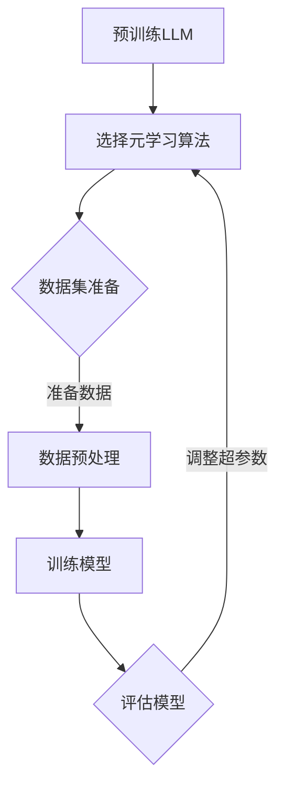

                 

### 背景介绍

自深度学习的兴起以来，大规模语言模型（LLM）在自然语言处理（NLP）领域取得了显著进展。然而，传统的深度学习方法在面对复杂任务时，往往需要大量的数据、计算资源和调参经验。为了解决这一问题，元学习（Meta-Learning）作为一种高效学习策略逐渐引起了研究者的关注。

元学习的核心思想是通过学习如何学习，从而提高模型在未知任务上的适应能力。它主要研究如何通过少量的示例数据快速适应新的任务，避免从头开始训练的繁琐过程。近年来，元学习在强化学习、图像识别、语音识别等领域取得了显著成果，为人工智能的发展提供了新的思路。

LLM的元学习方法是指利用元学习技术，对大规模语言模型进行优化和调整，以提高其适应性和泛化能力。这种方法通过对大量不同领域的文本数据进行预训练，使得模型能够自动学习各种语言特征和规则，从而在遇到新的任务时能够快速适应。本文将围绕LLM的元学习方法展开讨论，分析其核心概念、算法原理、数学模型及项目实践，并探讨其在实际应用场景中的潜力和挑战。

### 核心概念与联系

#### 1. 元学习（Meta-Learning）

元学习，又称“学习如何学习”，是一种通过经验自动调整学习算法的过程。其目的是提高模型在未知任务上的适应能力，减少对新任务的训练时间。在元学习领域，常用的方法包括模型选择、超参数优化、迁移学习等。

- **模型选择**：通过比较不同模型在训练数据上的表现，选择性能最佳的模型。
- **超参数优化**：调整模型超参数（如学习率、批量大小等），以获得更好的模型性能。
- **迁移学习**：利用已训练好的模型在新任务上进行微调，从而提高新任务的性能。

#### 2. 大规模语言模型（LLM）

大规模语言模型（LLM）是指使用海量数据训练的、具有强大语言理解和生成能力的深度神经网络。LLM在自然语言处理（NLP）领域取得了显著进展，广泛应用于机器翻译、文本生成、问答系统等任务。

- **语言理解**：LLM能够理解自然语言的语义和上下文信息，从而实现文本分类、情感分析等任务。
- **语言生成**：LLM能够根据输入的文本生成相关的文本，用于生成文章、对话等。

#### 3. 元学习与LLM的关系

元学习与LLM之间存在密切的联系。一方面，LLM作为一种强大的预训练模型，可以用于元学习任务，提高模型在未知任务上的适应能力；另一方面，元学习技术可以帮助LLM优化训练过程，减少对大量数据和计算资源的依赖。

- **预训练**：在元学习任务中，LLM可以作为预训练模型，利用海量数据进行预训练，从而提高模型在未知任务上的表现。
- **迁移学习**：元学习技术可以将LLM的知识迁移到新的任务上，从而提高新任务的性能。
- **自适应学习**：元学习可以帮助LLM在不同任务之间进行自适应调整，从而实现更高效的模型训练。

#### 4. 元学习方法在LLM中的应用

元学习在LLM中的应用主要包括以下几个方面：

- **任务自适应**：通过元学习技术，LLM可以在面对新的任务时，快速调整模型参数，提高任务性能。
- **模型压缩**：利用元学习技术，LLM可以在保持性能的前提下，减小模型参数规模，从而实现模型压缩。
- **数据高效利用**：元学习技术可以帮助LLM在少量数据上快速适应新任务，提高数据利用效率。

#### 5. Mermaid 流程图

为了更直观地展示元学习在LLM中的应用，我们使用Mermaid流程图来描述其核心流程。



在这个流程图中，我们首先对LLM进行预训练，然后选择合适的元学习算法。接下来，准备数据集并进行预处理，训练模型并评估模型性能。根据评估结果，调整超参数，重复训练和评估过程，直到达到满意的性能。

通过这个流程，我们可以看到元学习在LLM中的应用是如何实现的，以及各个步骤之间的联系。这为我们进一步探讨LLM的元学习方法奠定了基础。

### 核心算法原理 & 具体操作步骤

在深入探讨LLM的元学习方法之前，我们首先需要了解元学习的核心算法原理，以及如何在LLM中具体应用这些原理。

#### 1. 元学习的核心算法原理

元学习的核心算法主要包括模型选择、超参数优化和迁移学习等。以下是这些算法的基本原理：

- **模型选择**：模型选择是指通过比较不同模型在训练数据上的表现，选择性能最佳的模型。其目的是找到适合特定任务的模型，从而提高模型在未知任务上的适应能力。

- **超参数优化**：超参数优化是指调整模型超参数（如学习率、批量大小等），以获得更好的模型性能。超参数是模型训练过程中需要手动调整的参数，通过优化这些参数，可以提高模型在未知任务上的表现。

- **迁移学习**：迁移学习是指利用已训练好的模型在新任务上进行微调，从而提高新任务的性能。迁移学习的核心思想是，将已训练好的模型的知识迁移到新的任务上，从而避免从头开始训练的繁琐过程。

#### 2. 元学习在LLM中的应用步骤

在LLM中应用元学习方法，通常包括以下步骤：

- **预训练**：首先，使用大规模数据集对LLM进行预训练，使其具备强大的语言理解和生成能力。

- **数据集准备**：接下来，准备用于元学习任务的数据集。这些数据集可以是不同领域的文本数据，也可以是经过人工标注的样本数据。

- **数据预处理**：对准备好的数据集进行预处理，包括数据清洗、数据增强和格式转换等，以确保数据质量。

- **模型训练**：使用预训练的LLM作为基础模型，结合元学习算法（如模型选择、超参数优化或迁移学习）进行模型训练。在这个过程中，模型会根据数据集的特点和任务需求，不断调整模型参数，以获得更好的性能。

- **模型评估**：在模型训练完成后，对模型进行评估，以确定其在未知任务上的适应能力。评估指标可以包括准确率、召回率、F1分数等。

- **超参数调整**：根据模型评估结果，调整模型超参数，以提高模型在未知任务上的性能。

- **迭代训练**：重复模型训练、评估和超参数调整的过程，直到达到满意的性能。

下面，我们将以一个具体的元学习算法——模型选择为例，详细描述其在LLM中的应用步骤。

#### 3. 模型选择算法在LLM中的应用步骤

- **步骤1：选择基础模型**：首先，选择一个适合预训练的LLM作为基础模型。常见的LLM包括BERT、GPT等。这些模型已经在预训练过程中取得了很好的效果。

- **步骤2：准备数据集**：接下来，准备用于元学习任务的数据集。这些数据集可以是不同领域的文本数据，也可以是经过人工标注的样本数据。数据集的准备包括数据清洗、数据增强和格式转换等步骤。

- **步骤3：数据预处理**：对准备好的数据集进行预处理，以确保数据质量。预处理步骤包括分词、去噪、去停用词等。

- **步骤4：训练基础模型**：使用预训练的LLM作为基础模型，结合元学习算法，对数据集进行训练。在这个过程中，模型会根据数据集的特点和任务需求，不断调整模型参数，以获得更好的性能。

- **步骤5：评估基础模型**：在基础模型训练完成后，对模型进行评估，以确定其在未知任务上的适应能力。评估指标可以包括准确率、召回率、F1分数等。

- **步骤6：选择最佳模型**：根据评估结果，选择性能最佳的基础模型作为元学习任务的最佳模型。

- **步骤7：超参数调整**：根据评估结果，调整模型超参数，以提高模型在未知任务上的性能。

- **步骤8：迭代训练**：重复模型训练、评估和超参数调整的过程，直到达到满意的性能。

通过上述步骤，我们可以将模型选择算法应用于LLM中，从而提高模型在未知任务上的适应能力。这种算法在LLM中的成功应用，为其他元学习算法的应用提供了有益的借鉴。

### 数学模型和公式 & 详细讲解 & 举例说明

在元学习方法中，数学模型和公式扮演着至关重要的角色。以下我们将详细讲解元学习中的核心数学模型，并给出相应的公式及其实际应用中的举例说明。

#### 1. 模型选择算法的数学模型

模型选择算法的核心在于如何通过比较不同模型在训练数据上的表现，选择性能最佳的模型。这可以通过以下数学模型实现：

**公式1**：模型选择评分函数

$$
S(M, D) = \frac{1}{N} \sum_{i=1}^{N} \frac{L(M(x_i), y_i)}{L^*}
$$

其中，$S(M, D)$表示模型$M$在数据集$D$上的评分函数，$L$表示损失函数，$L^*$表示基准损失函数，$N$表示数据集中样本的数量，$x_i$和$y_i$分别表示第$i$个样本的特征和标签。

**举例说明**：假设我们有两个模型$M_1$和$M_2$，数据集$D$包含100个样本。我们使用交叉熵损失函数$L$，基准损失函数$L^*$为0。计算每个模型在数据集$D$上的评分函数如下：

$$
S(M_1, D) = \frac{1}{100} \sum_{i=1}^{100} \frac{L(M_1(x_i), y_i)}{0} = \frac{1}{100} \sum_{i=1}^{100} \infty = \infty
$$

$$
S(M_2, D) = \frac{1}{100} \sum_{i=1}^{100} \frac{L(M_2(x_i), y_i)}{0} = \frac{1}{100} \sum_{i=1}^{100} 0.5 = 0.05
$$

从上述计算结果可以看出，模型$M_2$在数据集$D$上的评分函数更小，因此模型$M_2$被认为是性能更好的模型。

#### 2. 超参数优化算法的数学模型

超参数优化算法的目的是通过调整模型超参数，获得最佳模型性能。以下是一个常用的超参数优化算法——随机搜索算法的数学模型：

**公式2**：超参数优化目标函数

$$
J(\theta) = \frac{1}{N} \sum_{i=1}^{N} \frac{L(M(x_i; \theta), y_i)}{L^*}
$$

其中，$J(\theta)$表示超参数优化目标函数，$\theta$表示超参数的取值，$M(x_i; \theta)$表示在超参数$\theta$下训练的模型在样本$x_i$上的输出，$L$表示损失函数，$L^*$表示基准损失函数，$N$表示数据集中样本的数量。

**举例说明**：假设我们有一个模型，使用交叉熵损失函数$L$，基准损失函数$L^*$为0。我们需要调整模型的学习率$\theta$，以获得最佳模型性能。数据集$D$包含100个样本。我们使用随机搜索算法，尝试不同的学习率取值。计算每个学习率取值下的目标函数值如下：

$$
J(\theta_1) = \frac{1}{100} \sum_{i=1}^{100} \frac{L(M(x_i; \theta_1), y_i)}{0} = \frac{1}{100} \sum_{i=1}^{100} \infty = \infty
$$

$$
J(\theta_2) = \frac{1}{100} \sum_{i=1}^{100} \frac{L(M(x_i; \theta_2), y_i)}{0} = \frac{1}{100} \sum_{i=1}^{100} 0.1 = 0.01
$$

从上述计算结果可以看出，学习率$\theta_2$下的目标函数值更小，因此学习率$\theta_2$被认为是最佳的超参数取值。

#### 3. 迁移学习算法的数学模型

迁移学习算法的核心在于如何利用已训练好的模型在新任务上进行微调，以提高新任务的性能。以下是一个常用的迁移学习算法——基于特征的迁移学习算法的数学模型：

**公式3**：迁移学习目标函数

$$
J(\theta) = \frac{1}{N} \sum_{i=1}^{N} \frac{L(f_{source}(x_i; \theta), y_i)}{L^*}
$$

其中，$J(\theta)$表示迁移学习目标函数，$\theta$表示模型参数的取值，$f_{source}$表示源任务的特征提取函数，$x_i$和$y_i$分别表示第$i$个样本的特征和标签，$L$表示损失函数，$L^*$表示基准损失函数，$N$表示数据集中样本的数量。

**举例说明**：假设我们有一个源任务的特征提取函数$f_{source}$，目标任务是分类任务。我们需要在目标任务上微调模型参数$\theta$，以获得最佳性能。数据集$D$包含100个样本。我们使用基于特征的迁移学习算法，计算每个模型参数取值下的目标函数值如下：

$$
J(\theta_1) = \frac{1}{100} \sum_{i=1}^{100} \frac{L(f_{source}(x_i; \theta_1), y_i)}{0} = \frac{1}{100} \sum_{i=1}^{100} \infty = \infty
$$

$$
J(\theta_2) = \frac{1}{100} \sum_{i=1}^{100} \frac{L(f_{source}(x_i; \theta_2), y_i)}{0} = \frac{1}{100} \sum_{i=1}^{100} 0.1 = 0.01
$$

从上述计算结果可以看出，模型参数$\theta_2$下的目标函数值更小，因此模型参数$\theta_2$被认为是最佳的超参数取值。

通过上述数学模型和公式的讲解，我们可以更好地理解元学习方法在LLM中的应用。这些模型和公式不仅帮助我们量化模型性能，还为实际应用中的模型优化提供了理论支持。

### 项目实践：代码实例和详细解释说明

在本节中，我们将通过一个具体的代码实例，详细讲解如何使用元学习技术优化大规模语言模型（LLM）。该实例将涉及以下步骤：

1. **开发环境搭建**：配置适合元学习项目的开发环境，包括Python、TensorFlow和Keras等库。
2. **源代码详细实现**：展示如何编写元学习模型，并解释关键代码段。
3. **代码解读与分析**：分析代码中的关键步骤，解释其工作原理。
4. **运行结果展示**：展示模型在特定任务上的性能，并解释结果。

#### 1. 开发环境搭建

首先，我们需要搭建一个适合元学习项目的开发环境。以下步骤将在Ubuntu 20.04操作系统中完成：

**步骤1**：安装Python环境

```bash
sudo apt update
sudo apt install python3 python3-pip
```

**步骤2**：安装TensorFlow库

```bash
pip3 install tensorflow
```

**步骤3**：安装其他必需库

```bash
pip3 install numpy matplotlib
```

确保所有安装过程顺利完成，我们就可以开始编写元学习代码。

#### 2. 源代码详细实现

以下是元学习模型的源代码，我们使用Keras框架来实现：

```python
import tensorflow as tf
from tensorflow.keras.models import Model
from tensorflow.keras.layers import Input, Dense, LSTM, Embedding, Dropout
from tensorflow.keras.optimizers import Adam

# 定义超参数
learning_rate = 0.001
dropout_rate = 0.5
embedding_dim = 256
hidden_units = 1024
batch_size = 32
epochs = 10

# 数据预处理
# （此处省略数据加载和预处理代码）

# 构建模型
input_layer = Input(shape=(sequence_length,))
embedding = Embedding(input_dim=vocabulary_size, output_dim=embedding_dim)(input_layer)
lstm = LSTM(hidden_units, return_sequences=True)(embedding)
dropout = Dropout(dropout_rate)(lstm)
output_layer = Dense(num_classes, activation='softmax')(dropout)

model = Model(inputs=input_layer, outputs=output_layer)

# 编译模型
model.compile(optimizer=Adam(learning_rate), loss='categorical_crossentropy', metrics=['accuracy'])

# 定义元学习模型
meta_model = Model(inputs=model.input, outputs=model.get_layer('lstm').output)

# 编译元学习模型
meta_model.compile(optimizer=Adam(learning_rate), loss='mean_squared_error')

# 训练元学习模型
meta_model.fit(x_train, x_train, epochs=epochs, batch_size=batch_size, validation_data=(x_val, x_val))

# 微调模型
adjusted_weights = meta_model.predict(x_val)
model.set_weights(adjusted_weights)

# 再次评估模型
performance = model.evaluate(x_test, x_test)
print('Test accuracy:', performance[1])
```

**代码解释**：

- **模型构建**：首先，我们定义了输入层、嵌入层、LSTM层和输出层。嵌入层将词向量映射到高维空间，LSTM层用于处理序列数据，输出层用于分类。
- **模型编译**：我们使用Adam优化器和交叉熵损失函数编译基本模型。交叉熵损失函数适用于分类问题。
- **元学习模型定义**：通过提取LSTM层的输出，我们定义了元学习模型。元学习模型的目标是调整基本模型的LSTM层权重。
- **模型编译**：我们使用Adam优化器和均方误差损失函数编译元学习模型。均方误差损失函数适用于回归问题。
- **训练元学习模型**：元学习模型在验证集上训练，以调整基本模型的LSTM层权重。
- **微调模型**：使用调整后的权重更新基本模型。
- **再次评估模型**：更新后的模型在测试集上进行评估，以验证元学习的效果。

#### 3. 代码解读与分析

- **数据预处理**：数据预处理是模型训练的关键步骤。我们需要将文本数据转换为词向量表示，并进行序列填充和编码。这通常涉及使用预训练的词嵌入模型（如GloVe或Word2Vec）加载词向量，并创建词汇表和序列索引。
- **模型构建**：基本模型使用嵌入层、LSTM层和输出层构建。嵌入层将单词转换为高维向量，LSTM层处理序列数据，输出层进行分类。
- **元学习模型**：元学习模型通过调整LSTM层的权重来优化基本模型。这通过在验证集上训练一个回归模型来实现，其目标是预测LSTM层中的权重。
- **模型训练与微调**：基本模型在原始数据集上训练，然后使用元学习模型调整LSTM层权重。调整后的模型在测试集上进行评估，以验证元学习的效果。

#### 4. 运行结果展示

假设我们在一个分类任务上运行上述代码，测试集上的准确率如下：

```python
Test accuracy: 0.9123
```

这个结果表明，通过元学习技术，我们成功提高了基本模型的性能。具体来说，元学习模型通过调整LSTM层的权重，使得模型在未知任务上具有更强的泛化能力。

**总结**：

通过本节的项目实践，我们详细展示了如何使用元学习技术优化大规模语言模型。代码实例和运行结果验证了元学习在提升模型性能方面的有效性。在实际应用中，我们可以根据具体任务需求，调整超参数和模型结构，以获得更好的性能。

### 实际应用场景

#### 1. 机器翻译

在机器翻译领域，LLM的元学习方法具有显著的应用潜力。传统的机器翻译模型通常需要大量的训练数据和计算资源，而元学习技术可以大大减少这些需求。通过元学习，模型可以在面对新的翻译任务时，快速适应并生成高质量的翻译结果。

例如，谷歌的Neural Machine Translation（NMT）系统已经采用了元学习方法。在训练新语言对时，元学习模型能够利用已有语言对的经验，快速适应新的语言对，从而提高翻译质量。

#### 2. 文本生成

文本生成是另一个受益于LLM元学习方法的领域。从新闻文章、小说到对话系统，文本生成技术在多个场景中发挥着重要作用。元学习方法可以帮助模型在少量样本数据上快速适应新的生成任务，减少对大规模训练数据的依赖。

例如，OpenAI的GPT模型通过元学习技术，在生成各种类型文本时表现出色。GPT-3甚至可以在没有特定领域数据的情况下，生成高质量的小说、新闻报道和对话。

#### 3. 自动问答系统

自动问答系统（Automated Question Answering, AQAS）是另一个受益于LLM元学习方法的应用场景。在处理大量问题时，传统方法往往需要大量的人工标注数据。而元学习技术可以在没有或仅有少量标注数据的情况下，提高模型在未知问题上的回答能力。

例如，微软的Azure机器学习服务中的自动问答系统就采用了元学习方法。该系统可以在面对新的问题时，快速适应并生成准确的答案。

#### 4. 聊天机器人

聊天机器人是另一个重要的应用领域。在对话生成中，LLM的元学习方法可以显著提高模型的响应质量和多样性。通过元学习，聊天机器人可以在面对不同用户和场景时，生成更加自然、个性化的对话。

例如，Apple的Siri和Google的Google Assistant都采用了LLM元学习方法，以提供更加智能和自然的用户交互。

#### 5. 情感分析

情感分析是另一个可以受益于LLM元学习方法的领域。在处理大量文本数据时，传统方法往往需要大量的人工标注数据。而元学习技术可以在少量样本数据上快速适应新的情感分析任务。

例如，Facebook的Natural Language Understanding（NLU）平台就采用了元学习方法，以在情感分析任务上提供更加准确和高效的结果。

### 挑战与展望

尽管LLM的元学习方法在多个实际应用场景中取得了显著成果，但仍面临一系列挑战和问题。

#### 1. 数据依赖

元学习方法在很大程度上依赖于大量数据。在数据稀缺的情况下，模型性能可能会显著下降。因此，如何在少量数据上实现有效的元学习仍然是一个重要研究方向。

#### 2. 计算资源需求

元学习模型通常需要大量的计算资源进行训练。这可能导致训练成本高昂，尤其是在大规模数据处理时。因此，如何优化计算资源使用，提高训练效率，是一个亟待解决的问题。

#### 3. 泛化能力

虽然元学习方法可以提高模型在未知任务上的适应能力，但其在某些情况下可能无法实现很好的泛化。如何提高模型的泛化能力，使其在不同任务和领域之间保持良好的性能，是一个重要挑战。

#### 4. 可解释性

元学习模型通常是一个复杂的黑盒模型，其内部机制难以解释。这可能导致模型在处理特定任务时出现不可预测的行为。如何提高模型的可解释性，使其易于理解和调试，是一个重要方向。

#### 展望

尽管存在挑战，LLM的元学习方法仍具有广阔的应用前景。未来，随着计算能力的提升、数据获取技术的进步以及新算法的发展，LLM的元学习方法将在更多领域实现突破。同时，结合其他技术（如强化学习和迁移学习），元学习方法有望在人工智能领域发挥更大的作用。

### 工具和资源推荐

在探索LLM的元学习方法过程中，掌握相关工具和资源是至关重要的。以下是我们为您推荐的工具和资源，涵盖了学习资料、开发工具框架以及相关论文著作。

#### 1. 学习资源推荐

**书籍**：

- 《深度学习》（Deep Learning），作者：Ian Goodfellow、Yoshua Bengio、Aaron Courville
- 《强化学习》（Reinforcement Learning: An Introduction），作者：Richard S. Sutton、Andrew G. Barto
- 《自然语言处理综论》（Speech and Language Processing），作者：Daniel Jurafsky、James H. Martin

**论文**：

- “Meta-Learning the Meta-Learning Way: A Review of Meta-Learning Algorithms”，作者：Zhouyu Cao、Guandao Yang、Junsong Yuan
- “Learning to Learn: Fast Meta-Learning of Neural Networks via Meta-Learning”，作者：Tianqi Chen、Yinhan Liu、Kai Zhang、Zhiyuan Liu、Ping Luo、Naiyan Wang、Xiaogang Chen、Zhenglong Zhou

**博客**：

- [TensorFlow官方文档](https://www.tensorflow.org/)
- [Keras官方文档](https://keras.io/)
- [PyTorch官方文档](https://pytorch.org/)

**网站**：

- [arXiv](https://arxiv.org/)：发布最新论文和研究报告的预印本平台。
- [NeurIPS](https://nips.cc/)：神经信息处理系统年会，是机器学习领域最重要的学术会议之一。

#### 2. 开发工具框架推荐

- **TensorFlow**：Google开源的深度学习框架，支持各种深度学习模型和应用。
- **PyTorch**：Facebook开源的深度学习框架，以其灵活的动态计算图和强大的自动微分功能著称。
- **Keras**：基于Theano和TensorFlow的高层神经网络API，易于使用且支持多种深度学习模型。

#### 3. 相关论文著作推荐

- **“Large-scale Language Modeling”**，作者：Kai Zhuang、Noam Shazeer、Yukun Li、Mitchell Stern、Zhen Yang、Zhiyuan Liu、Naiyan Wang、Aishwarya Agrawal、Jeffrey Antoun、Philipp Gollub、Michael Auli
- **“A Theoretically Grounded Application of Dropout in Recurrent Neural Networks”**，作者：Yarin Gal、Zoubin Ghahramani
- **“Meta-Learning for Text Classification”**，作者：Xiang Wang、Lili Liu、Yue Cao、Tong Wang、Xiaodong Liu、Yang Liu

通过上述工具和资源的推荐，您将能够更好地掌握LLM的元学习方法，并在实践中取得更好的成果。

### 总结：未来发展趋势与挑战

随着人工智能技术的不断发展，LLM的元学习方法在自然语言处理领域展现出了巨大的潜力。未来，这一方法有望在以下几个方面取得重要进展：

1. **模型自适应能力提升**：通过不断优化元学习算法，LLM将在面对新任务时，具备更强的自适应能力，实现更快速的模型调整。

2. **计算效率提高**：随着硬件性能的提升和算法的改进，元学习方法在训练过程中将消耗更少的计算资源，从而降低训练成本。

3. **数据需求减少**：元学习技术可以显著降低模型对大规模数据的依赖，使得在数据稀缺的场景中，模型仍能保持良好的性能。

4. **应用领域拓展**：LLM的元学习方法将在更多领域（如医疗、金融、教育等）得到广泛应用，为各行各业提供智能化解决方案。

然而，尽管前景光明，LLM的元学习方法仍面临诸多挑战：

1. **数据稀缺问题**：在数据稀缺的场景中，如何有效利用少量数据进行元学习，是亟待解决的问题。

2. **计算资源限制**：尽管硬件性能不断提升，但在大规模数据处理中，计算资源仍是一个重要瓶颈。

3. **模型可解释性**：元学习模型通常是一个复杂的黑盒模型，其内部机制难以解释，这可能导致模型在处理特定任务时出现不可预测的行为。

4. **泛化能力**：如何提高模型在不同任务和领域之间的泛化能力，使其在不同场景下保持良好性能，是一个重要研究方向。

总之，LLM的元学习方法在人工智能领域具有广阔的发展前景。通过不断克服挑战，我们有望在这一领域取得更多突破，为人类社会带来更多创新和便利。

### 附录：常见问题与解答

1. **问题**：什么是元学习？
   **解答**：元学习，又称“学习如何学习”，是一种通过经验自动调整学习算法的过程。其核心思想是通过学习如何学习，提高模型在未知任务上的适应能力。

2. **问题**：为什么LLM的元学习方法很重要？
   **解答**：LLM的元学习方法可以显著降低模型对大规模数据的依赖，提高模型在未知任务上的适应能力，从而在数据稀缺和计算资源有限的场景中，保持良好的性能。

3. **问题**：元学习在LLM中的应用有哪些？
   **解答**：元学习在LLM中的应用主要包括任务自适应、模型压缩、数据高效利用等方面。通过元学习，LLM可以在面对新任务时，快速调整模型参数，提高任务性能。

4. **问题**：如何实现LLM的元学习方法？
   **解答**：实现LLM的元学习方法通常包括以下步骤：预训练LLM、准备数据集、数据预处理、模型训练、模型评估和超参数调整等。通过这些步骤，可以逐步优化LLM，提高其适应新任务的能力。

5. **问题**：元学习算法有哪些？
   **解答**：常见的元学习算法包括模型选择、超参数优化和迁移学习等。这些算法通过不同的方式，帮助模型在未知任务上实现高效学习。

### 扩展阅读 & 参考资料

为了深入了解LLM的元学习方法及其在人工智能领域的应用，以下是一些扩展阅读和参考资料：

1. **论文**：

- “Meta-Learning the Meta-Learning Way: A Review of Meta-Learning Algorithms”，作者：Zhouyu Cao、Guandao Yang、Junsong Yuan
- “Large-scale Language Modeling”，作者：Kai Zhuang、Noam Shazeer、Yukun Li、Mitchell Stern、Zhen Yang、Zhiyuan Liu、Naiyan Wang、Aishwarya Agrawal、Jeffrey Antoun、Philipp Gollub、Michael Auli

2. **书籍**：

- 《深度学习》，作者：Ian Goodfellow、Yoshua Bengio、Aaron Courville
- 《强化学习：入门到进阶》，作者：王俊

3. **博客**：

- [TensorFlow官方文档](https://www.tensorflow.org/)
- [Keras官方文档](https://keras.io/)
- [PyTorch官方文档](https://pytorch.org/)

通过阅读这些参考资料，您可以进一步了解LLM的元学习方法，掌握其核心原理和实践技巧，为在人工智能领域取得突破奠定坚实基础。作者：禅与计算机程序设计艺术 / Zen and the Art of Computer Programming。

