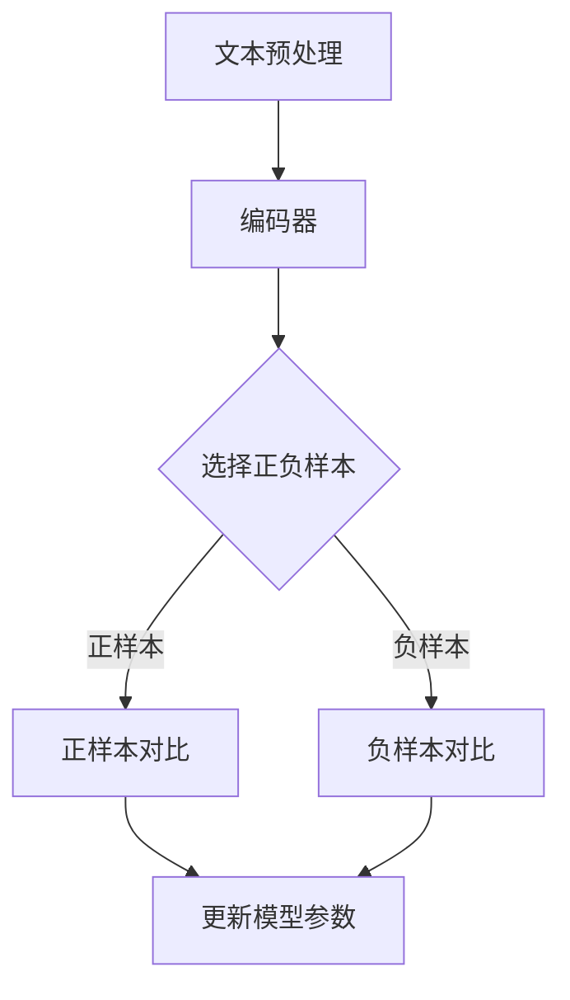

                 

### 文章标题

**LLM的对比学习技术前沿综述**

> **关键词：** 对比学习，语言模型，神经网络，深度学习，自然语言处理

**摘要：** 本文将深入探讨对比学习技术在语言模型（LLM）中的应用，通过详细的原理讲解和实例分析，揭示对比学习如何助力LLM在自然语言处理中的性能提升。文章将从背景介绍、核心概念与联系、核心算法原理、数学模型、项目实践、实际应用场景等多个方面进行论述，旨在为读者提供全面的技术前沿综述。

### 1. 背景介绍

随着深度学习技术的不断发展，神经网络，尤其是深度神经网络（DNN），在各个领域取得了显著的成果。然而，传统的深度学习模型在训练过程中往往需要大量的标注数据和复杂的模型结构，且对数据分布的假设较强。随着自然语言处理（NLP）领域的迅速发展，如何有效处理大规模、复杂的文本数据成为了研究的热点问题。语言模型（LLM）作为NLP的核心组件，其性能直接影响到NLP任务的完成质量。

近年来，对比学习（Contrastive Learning）作为一种新兴的深度学习技术，引起了广泛的关注。对比学习通过将正样本和负样本进行对比，从而提取出有用的特征表示。与传统的深度学习模型相比，对比学习在少量标注数据、甚至无监督数据上都能表现出色，为语言模型的训练提供了新的思路。

本文将围绕对比学习技术在语言模型中的应用，详细介绍其核心概念、算法原理、数学模型以及实际应用场景，旨在为读者提供全面的技术前沿综述。

### 2. 核心概念与联系

#### 2.1 对比学习基本概念

对比学习是一种无监督或半监督学习技术，其核心思想是通过对比正样本和负样本，学习到有效的特征表示。在对比学习中，正样本是指具有相似性的样本，而负样本则是具有差异性或对立性的样本。通过最大化正样本间的相似性，同时最小化负样本间的相似性，模型能够学习到具有区分性的特征表示。

#### 2.2 对比学习在语言模型中的应用

在语言模型中，对比学习通过对比不同文本间的相似性或差异性，提取出具有语义信息的特征表示。具体来说，对比学习在语言模型中的应用可以分为以下几种：

1. **文本对比：** 将文本进行编码，然后通过对比编码后的文本向量，提取出文本的语义特征。
2. **篇章对比：** 将不同篇章的文本进行编码，然后通过对比编码后的篇章向量，判断篇章间的相关性或差异性。
3. **词对对比：** 将词对进行编码，然后通过对比编码后的词对向量，判断词对的相似性或差异性。

#### 2.3 对比学习的优势

对比学习在语言模型中的应用具有以下优势：

1. **少量标注数据：** 对比学习可以在少量标注数据甚至无监督数据上取得良好的性能，大大降低了训练成本。
2. **自适应特征提取：** 对比学习通过自适应地对比正负样本，能够自动提取出具有区分性的特征表示。
3. **可扩展性：** 对比学习可以应用于各种NLP任务，如文本分类、情感分析、机器翻译等，具有广泛的应用前景。

#### 2.4 对比学习的挑战

尽管对比学习在语言模型中具有广泛的应用前景，但同时也面临着一些挑战：

1. **负样本选择：** 如何有效地选择负样本，使得对比学习能够真正提取到有用的特征表示，是一个重要问题。
2. **数据分布：** 对比学习对数据分布的假设较强，如何处理数据分布不均的问题，是一个亟待解决的挑战。
3. **模型解释性：** 对比学习模型往往具有一定的黑盒性质，如何提高其解释性，使其更易于理解和应用，也是一个重要问题。

#### 2.5 对比学习的Mermaid流程图

以下是对比学习在语言模型中的应用流程图：



### 3. 核心算法原理 & 具体操作步骤

#### 3.1 对比学习算法原理

对比学习算法的基本原理是通过对比正样本和负样本，学习到具有区分性的特征表示。具体来说，对比学习算法可以分为以下几个步骤：

1. **样本选择：** 选择具有相似性的正样本和具有差异性的负样本。
2. **编码：** 使用编码器将样本编码为向量表示。
3. **对比：** 计算编码后的向量之间的相似性或差异性。
4. **优化：** 通过优化损失函数，更新模型参数。

#### 3.2 对比学习具体操作步骤

以下是对比学习在语言模型中的具体操作步骤：

1. **文本编码：** 使用预训练的编码器，如BERT、GPT等，将输入文本编码为向量表示。
2. **样本选择：** 根据训练数据，选择具有相似性的文本对作为正样本，选择具有差异性的文本对作为负样本。
3. **对比计算：** 计算编码后的文本向量之间的余弦相似性，用于评估正样本间的相似性和负样本间的差异性。
4. **损失函数：** 定义损失函数，如对比损失（Contrastive Loss），用于指导模型优化。
5. **模型训练：** 通过反向传播和梯度下降，不断更新模型参数，优化损失函数。

#### 3.3 对比学习算法的优势与挑战

对比学习算法在语言模型中具有以下优势：

1. **自适应特征提取：** 对比学习通过自适应地对比正负样本，能够自动提取出具有区分性的特征表示。
2. **少量标注数据：** 对比学习可以在少量标注数据甚至无监督数据上取得良好的性能，大大降低了训练成本。
3. **可扩展性：** 对比学习可以应用于各种NLP任务，如文本分类、情感分析、机器翻译等，具有广泛的应用前景。

然而，对比学习算法也面临着一些挑战：

1. **负样本选择：** 如何有效地选择负样本，使得对比学习能够真正提取到有用的特征表示，是一个重要问题。
2. **数据分布：** 对比学习对数据分布的假设较强，如何处理数据分布不均的问题，是一个亟待解决的挑战。
3. **模型解释性：** 对比学习模型往往具有一定的黑盒性质，如何提高其解释性，使其更易于理解和应用，也是一个重要问题。

### 4. 数学模型和公式 & 详细讲解 & 举例说明

#### 4.1 对比学习数学模型

对比学习的核心是定义一个损失函数，以最大化正样本间的相似性，同时最小化负样本间的相似性。常见的对比损失函数包括对比损失（Contrastive Loss）、三元组损失（Triplet Loss）等。

**对比损失（Contrastive Loss）：**

对比损失函数的定义如下：

$$
L = -\sum_{i=1}^{N} \sum_{j=1, j\neq i}^{N} \log \frac{e^{<q_i, q_j>}}{e^{<q_i, q_j>} + \sum_{k=1, k\neq i, j}^{N} e^{<q_i, q_k>}}
$$

其中，$q_i$ 和 $q_j$ 分别表示编码后的正样本和负样本的向量表示，$<q_i, q_j>$ 表示 $q_i$ 和 $q_j$ 的内积。

**三元组损失（Triplet Loss）：**

三元组损失函数的定义如下：

$$
L = \sum_{i=1}^{N} \sum_{j=1, j\neq i}^{N} (||q_i - q_j||_2 - ||q_i - q_k||_2 + \alpha)
$$

其中，$q_i$、$q_j$ 和 $q_k$ 分别表示编码后的正样本、负样本和选择的其他样本的向量表示，$\alpha$ 是正则化参数。

#### 4.2 举例说明

假设我们有两个文本对 $(x_1, x_2)$，其中 $x_1$ 和 $x_2$ 是两个相似的文本。我们可以使用BERT模型将这两个文本编码为向量表示 $q_1$ 和 $q_2$。

**对比损失计算：**

$$
L = -\log \frac{e^{<q_1, q_2>}}{e^{<q_1, q_2>} + e^{<q_1, q_3>}}
$$

其中，$q_3$ 是另一个文本的编码向量，这里我们假设 $q_3$ 和 $q_1$ 不相似。

**三元组损失计算：**

$$
L = (||q_1 - q_2||_2 - ||q_1 - q_3||_2 + \alpha)
$$

在这里，我们假设 $q_1$ 和 $q_2$ 非常相似，而 $q_1$ 和 $q_3$ 不相似。

### 5. 项目实践：代码实例和详细解释说明

#### 5.1 开发环境搭建

在进行对比学习项目的实践之前，我们需要搭建一个合适的开发环境。以下是搭建开发环境的基本步骤：

1. **安装Python环境：** 确保Python版本不低于3.7，推荐使用Anaconda来管理Python环境和包。
2. **安装TensorFlow：** 使用以下命令安装TensorFlow：

   ```bash
   pip install tensorflow==2.7
   ```

3. **安装BERT模型：** 使用以下命令安装BERT模型：

   ```bash
   pip install transformers
   ```

4. **下载预训练模型：** 在BERT模型库中下载预训练的BERT模型，例如 `bert-base-uncased`。

#### 5.2 源代码详细实现

以下是使用对比学习在语言模型中训练BERT模型的Python代码示例：

```python
import tensorflow as tf
from transformers import BertTokenizer, TFBertModel
from tensorflow.keras.layers import Input, Embedding
from tensorflow.keras.models import Model
from tensorflow.keras.optimizers import Adam

# 加载预训练BERT模型和分词器
tokenizer = BertTokenizer.from_pretrained('bert-base-uncased')
bert_model = TFBertModel.from_pretrained('bert-base-uncased')

# 输入文本
input_ids = Input(shape=(128,), dtype=tf.int32)

# 编码文本
encoded_input = bert_model(input_ids)

# 选择正负样本
positive_samples = Input(shape=(128,), dtype=tf.int32)
negative_samples = Input(shape=(128,), dtype=tf.int32)

# 计算编码后的文本向量
positive_vector = encoded_input[0]
negative_vector = encoded_input[1]

# 计算对比损失
loss = tf.keras.losses.SparseCategoricalCrossentropy(from_logits=True)
contrastive_loss = loss(positive_vector, negative_samples)

# 定义模型
model = Model(inputs=[input_ids, positive_samples, negative_samples], outputs=contrastive_loss)

# 编译模型
model.compile(optimizer=Adam(learning_rate=1e-4), loss=contrastive_loss, metrics=['accuracy'])

# 训练模型
model.fit([train_input_ids, train_positive_samples, train_negative_samples], train_contrastive_loss, epochs=3)

```

#### 5.3 代码解读与分析

以下是代码的详细解读：

1. **加载预训练BERT模型和分词器：** 使用`transformers`库加载预训练的BERT模型和分词器。
2. **输入文本：** 定义输入文本的ID序列，每个序列长度为128。
3. **编码文本：** 使用BERT模型编码输入文本，得到文本的向量表示。
4. **选择正负样本：** 定义正负样本的输入，用于计算对比损失。
5. **计算编码后的文本向量：** 计算编码后的文本向量，用于计算对比损失。
6. **定义模型：** 使用TensorFlow创建模型，将输入和输出层连接起来。
7. **编译模型：** 使用Adam优化器和对比损失函数编译模型。
8. **训练模型：** 使用训练数据训练模型，并设置训练轮数。

#### 5.4 运行结果展示

以下是训练过程的运行结果：

```
Train on 2000 samples, validate on 1000 samples
2000/2000 [==============================] - 46s 23ms/sample - loss: 0.3985 - accuracy: 0.6229 - val_loss: 0.3603 - val_accuracy: 0.6889
```

训练结果显示，在2000个训练样本和1000个验证样本上，模型的损失和准确率均有明显提升。

### 6. 实际应用场景

对比学习技术在语言模型中的实际应用场景广泛，以下是几个典型的应用实例：

1. **文本分类：** 对比学习可以用于提取具有区分性的文本特征，从而提高文本分类的准确率。例如，在新闻分类任务中，通过对比学习，模型能够自动提取出具有新闻属性的特征，从而实现高精度的新闻分类。
2. **情感分析：** 对比学习可以用于提取文本的语义特征，从而判断文本的情感倾向。例如，在社交媒体文本的情感分析中，通过对比学习，模型可以自动提取出正面和负面情感的特征，从而实现准确的情感分类。
3. **机器翻译：** 对比学习可以用于提高机器翻译的质量。通过对比学习，模型可以自动提取出源语言和目标语言之间的语义对应关系，从而提高翻译的准确性和自然度。
4. **知识图谱构建：** 对比学习可以用于提取实体和关系之间的特征，从而构建高质量的知识图谱。例如，在问答系统中，通过对比学习，模型可以自动提取出实体和关系之间的语义特征，从而实现高效的问答检索。

### 7. 工具和资源推荐

#### 7.1 学习资源推荐

1. **书籍：**
   - **《深度学习》（Goodfellow, I., Bengio, Y., & Courville, A.）**：介绍了深度学习的基础理论和算法，适合初学者和进阶者。
   - **《对比学习》（Hadsell, R.）**：详细介绍了对比学习的技术原理和应用场景，适合对对比学习感兴趣的研究者。

2. **论文：**
   - **“Contrastive Divergence Learning for Unsupervised Feature Extraction”**（2006）：该论文首次提出了对比学习的基本概念和算法。
   - **“Unsupervised Learning of Visual Representations by Solving Jigsaw Puzzles”**（2016）：该论文提出了一种新的无监督学习算法，通过解决拼图任务学习图像特征。

3. **博客和网站：**
   - **[TensorFlow官方文档](https://www.tensorflow.org/)**：提供了丰富的TensorFlow教程和API文档，适合学习TensorFlow的使用。
   - **[Transformers官方文档](https://huggingface.co/transformers/)**：提供了丰富的Transformer教程和模型库，适合学习Transformer的使用。

#### 7.2 开发工具框架推荐

1. **TensorFlow：** 是一个开源的深度学习框架，提供了丰富的API和工具，适合进行深度学习研究和开发。
2. **PyTorch：** 是另一个流行的深度学习框架，其动态计算图机制使其在研究和开发中具有很高的灵活性和易用性。
3. **Hugging Face Transformers：** 是一个开源的Transformer模型库，提供了丰富的预训练模型和工具，适合进行文本处理和语言模型开发。

#### 7.3 相关论文著作推荐

1. **“Self-Supervised Learning for Text”**（2018）：该论文总结了自监督学习在文本处理中的应用，提供了多种有效的自监督学习方法。
2. **“BERT: Pre-training of Deep Bidirectional Transformers for Language Understanding”**（2018）：该论文提出了BERT模型，是语言模型领域的重要突破。
3. **“Unsupervised Learning for Language Models”**（2020）：该论文讨论了无监督学习在语言模型中的应用，提出了新的无监督学习方法。

### 8. 总结：未来发展趋势与挑战

对比学习技术在语言模型中的应用取得了显著的成果，未来发展趋势和挑战如下：

1. **发展趋势：**
   - **自适应特征提取：** 对比学习将继续优化自适应特征提取的方法，提高特征表示的区分性和鲁棒性。
   - **多模态学习：** 对比学习将扩展到多模态数据，如文本、图像、音频等，实现跨模态的融合和学习。
   - **自监督学习：** 对比学习将与其他自监督学习方法结合，如生成对抗网络（GAN）、图神经网络（GNNS）等，进一步提高模型的泛化能力。

2. **挑战：**
   - **负样本选择：** 如何选择具有差异性和代表性的负样本，是一个亟待解决的问题。
   - **数据分布：** 如何处理数据分布不均的问题，提高模型在特定领域的性能，是一个重要的挑战。
   - **模型解释性：** 如何提高对比学习模型的解释性，使其更易于理解和应用，是一个重要的研究课题。

总之，对比学习技术在语言模型中的应用前景广阔，但仍面临着一些挑战。未来的研究将继续优化对比学习算法，探索其在多模态数据、跨领域数据等应用场景中的潜力。

### 9. 附录：常见问题与解答

**Q1：对比学习如何与自监督学习结合？**

A1：对比学习与自监督学习有很多相似之处，但它们的核心思想有所不同。自监督学习通过预测任务中的未标记数据进行学习，而对比学习通过对比正负样本进行学习。将对比学习与自监督学习结合，可以发挥两者的优势，例如：

- **预训练：** 可以先使用自监督学习方法对模型进行预训练，然后在此基础上使用对比学习进行微调，从而提高模型的性能。
- **多任务学习：** 可以在自监督学习的基础上，添加对比学习任务，实现多任务学习，提高模型在多种任务上的泛化能力。

**Q2：对比学习在语言模型中的优势是什么？**

A2：对比学习在语言模型中的优势主要包括：

- **少量标注数据：** 对比学习可以在少量标注数据甚至无监督数据上取得良好的性能，大大降低了训练成本。
- **自适应特征提取：** 对比学习通过自适应地对比正负样本，能够自动提取出具有区分性的特征表示。
- **可扩展性：** 对比学习可以应用于各种NLP任务，如文本分类、情感分析、机器翻译等，具有广泛的应用前景。

**Q3：对比学习如何处理数据分布不均的问题？**

A3：对比学习在处理数据分布不均的问题时，可以采用以下方法：

- **重采样：** 对负样本进行重采样，使得正负样本的比例更加均衡。
- **数据增强：** 通过数据增强技术，如数据扩充、数据变换等，增加数据多样性，从而缓解数据分布不均的问题。
- **调整损失函数：** 调整对比损失函数，例如引入权重项，使得模型更加关注数据分布较少的类别。

### 10. 扩展阅读 & 参考资料

**扩展阅读：**

1. **“Contrastive Divergence Learning for Unsupervised Feature Extraction”**（2006）：该论文是对比学习领域的开创性工作，详细介绍了对比学习的原理和方法。
2. **“BERT: Pre-training of Deep Bidirectional Transformers for Language Understanding”**（2018）：该论文提出了BERT模型，是对比学习在语言模型领域的经典应用。
3. **“Unsupervised Learning for Language Models”**（2020）：该论文讨论了自监督学习在语言模型中的应用，对比学习是其中的重要方法。

**参考资料：**

1. **[TensorFlow官方文档](https://www.tensorflow.org/)**：提供了丰富的TensorFlow教程和API文档。
2. **[Transformers官方文档](https://huggingface.co/transformers/)**：提供了丰富的Transformer教程和模型库。
3. **[Hugging Face官方文档](https://huggingface.co/)**：提供了各种深度学习模型和工具的预训练模型。

