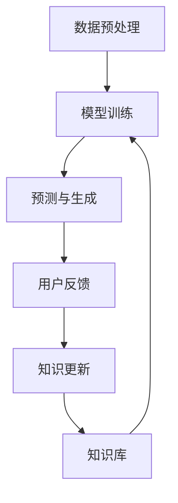

                 

### 1. 背景介绍

在当前数字化时代，人工智能（AI）技术正以前所未有的速度发展。其中，大型语言模型（LLM，Large Language Model）作为一种先进的AI模型，正被广泛应用于自然语言处理（NLP，Natural Language Processing）、问答系统、内容生成、机器翻译等领域。LLM通过深度学习从大量文本数据中学习语言模式和结构，从而实现了对自然语言的高效理解和生成。

然而，随着AI技术的快速发展，知识更新成为一个不可忽视的问题。知识更新是指在特定的环境和背景下，对已有的知识和信息进行及时、准确和全面的更新和补充。在LLM的应用场景中，知识更新尤为重要。因为LLM的输出结果很大程度上依赖于其训练数据的时效性和准确性。一个过时的LLM可能会给出错误的或者不准确的信息，从而影响其应用效果。

知识更新不仅仅是技术问题，更是一个复杂的社会问题。如何确保LLM所依赖的知识库的时效性，如何平衡知识的准确性和时效性，以及如何在知识更新过程中保护用户隐私等，都是需要深入探讨的问题。

本文将围绕LLM的知识更新问题，详细探讨其重要性、现有挑战和解决方案，以及未来发展趋势和挑战。首先，我们将介绍LLM的基本原理和知识更新的必要性，接着分析现有的知识更新方法和工具，然后探讨一些实际应用场景，最后总结未来的发展趋势和面临的挑战。

### 2. 核心概念与联系

要深入理解LLM的知识更新问题，我们首先需要了解LLM的基本概念和原理。LLM是基于深度学习和自然语言处理技术构建的模型，其核心是大规模的神经网络，这些神经网络可以从大量的文本数据中学习到语言模式和结构。

LLM的工作原理可以概括为以下几个步骤：

1. **数据预处理**：首先，LLM需要对输入的文本数据进行预处理，包括分词、去停用词、词向量化等操作。这一步的目的是将文本数据转化为计算机可以处理的数字形式。

2. **模型训练**：接下来，LLM通过深度学习算法从大量的文本数据中学习语言模式和结构。这一步是LLM的核心，也是其能够理解和生成自然语言的关键。

3. **预测与生成**：最后，LLM利用学到的语言模式对新的文本输入进行预测和生成。例如，在问答系统中，LLM可以回答用户的问题；在内容生成中，LLM可以生成新的文本内容。

在理解了LLM的工作原理后，我们需要关注知识更新的必要性。知识更新对于LLM来说至关重要，原因如下：

1. **数据时效性**：随着时间的推移，新的信息不断产生，旧的信息可能会过时。如果一个LLM不能及时更新其训练数据，那么其输出结果很可能会包含不准确或过时的信息。

2. **信息准确性**：知识更新不仅涉及数据的时效性，还包括数据的准确性。随着时间的推移，某些信息可能会变得不准确或错误。通过定期更新LLM的知识库，可以确保其输出的准确性。

3. **模型适应性**：不同的时间点和背景下，语言模式和结构可能会发生变化。通过知识更新，LLM可以适应这些变化，从而提高其应用效果。

下面是一个使用Mermaid绘制的流程图，展示了LLM的基本原理和知识更新的流程。



在上述流程图中，A表示数据预处理，B表示模型训练，C表示预测与生成，D表示知识库，E表示用户反馈，F表示知识更新。该流程图清晰地展示了LLM从数据预处理到模型训练，再到预测与生成的整个过程，以及知识更新的重要性。

通过以上对LLM的基本概念和原理的介绍，我们为后续讨论知识更新的方法和挑战奠定了基础。接下来，我们将深入探讨LLM知识更新的具体方法和工具，以便更好地理解和解决这一关键问题。

### 3. 核心算法原理 & 具体操作步骤

在了解了LLM的基本概念和原理之后，接下来我们将深入探讨LLM知识更新的核心算法原理和具体操作步骤。知识更新不仅仅是技术问题，还需要考虑数据源的选择、数据的清洗和处理等多个方面。以下是详细的步骤和算法原理：

#### 3.1 数据源的选择

首先，选择合适的数据源是知识更新过程中的关键一步。数据源的质量直接影响知识库的时效性和准确性。以下是一些常用的数据源：

1. **公开数据集**：如维基百科、新闻网站、学术论文等。这些数据集通常包含大量的文本数据，且更新较为频繁。

2. **社交媒体**：如Twitter、Facebook等。社交媒体平台上的数据更新速度快，能够提供实时信息。

3. **专业数据库**：如医疗数据库、金融数据库等。这些数据库通常由专业机构维护，数据质量较高。

4. **内部数据**：如企业内部报告、用户评论等。这些数据可以提供关于特定领域的详细信息。

在选择数据源时，需要综合考虑数据的时效性、准确性、规模和可靠性等因素。

#### 3.2 数据的清洗和处理

获取到数据源后，需要对数据进行清洗和处理，以提高数据质量。以下是数据清洗和处理的一些关键步骤：

1. **去噪**：去除无意义的数据，如HTML标签、特殊字符等。

2. **去重**：识别并去除重复的数据，确保数据集的完整性。

3. **标准化**：对数据进行统一的格式处理，如统一文本大小写、去除停用词等。

4. **实体识别**：识别文本中的实体（如人名、地点、组织等），以便进行进一步的分析和处理。

5. **词向量化**：将文本数据转换为数字形式，便于神经网络处理。常用的词向量化方法包括Word2Vec、BERT等。

#### 3.3 知识库的更新策略

在完成数据清洗和处理后，需要对知识库进行更新。以下是几种常见的知识库更新策略：

1. **增量更新**：只更新新获取的数据，保留原有数据。这种方法适用于数据量较小且变化较慢的场景。

2. **全量更新**：将新获取的数据与原有数据合并，重新训练模型。这种方法适用于数据量较大且变化较快的场景。

3. **混合更新**：结合增量更新和全量更新的优点，对新旧数据进行合理划分，分批次进行更新。

#### 3.4 模型的重新训练

在完成知识库更新后，需要重新训练模型以适应新的数据。以下是模型重新训练的步骤：

1. **数据预处理**：对新的数据集进行预处理，包括去噪、去重、标准化等。

2. **模型初始化**：根据原有模型的架构和参数，初始化新的模型。

3. **模型训练**：使用新的数据集对模型进行训练，直至达到预定的性能指标。

4. **模型评估**：评估模型的性能，包括准确率、召回率、F1值等。

5. **模型优化**：根据评估结果，调整模型的参数和架构，以提高性能。

#### 3.5 用户反馈与迭代

在模型重新训练后，需要收集用户的反馈，以便进一步优化模型。以下是用户反馈和迭代的一些步骤：

1. **反馈收集**：通过用户反馈、问卷调查、用户行为分析等方式收集用户反馈。

2. **问题识别**：分析用户反馈，识别模型存在的问题和不足。

3. **模型调整**：根据问题识别的结果，调整模型的参数和架构。

4. **迭代优化**：不断重复反馈、问题识别、模型调整的过程，直至模型达到预期性能。

通过以上步骤，我们可以实现对LLM知识库的及时更新和优化，从而确保模型的时效性和准确性。在实际应用中，需要根据具体场景和数据特点，灵活选择和调整这些步骤，以达到最佳效果。

### 4. 数学模型和公式 & 详细讲解 & 举例说明

在知识更新的过程中，数学模型和公式起到了关键作用。以下我们将详细介绍一些常用的数学模型和公式，并举例说明其在LLM知识更新中的应用。

#### 4.1 常用数学模型

1. **损失函数（Loss Function）**

   损失函数是深度学习模型训练的核心，用于衡量模型预测值与实际值之间的差距。在知识更新过程中，常用的损失函数包括均方误差（MSE）和交叉熵（Cross-Entropy）。

   - **均方误差（MSE）**

     均方误差用于回归问题，衡量预测值与实际值之间的平均平方误差。公式如下：

     $$MSE = \frac{1}{n} \sum_{i=1}^{n} (y_i - \hat{y}_i)^2$$

     其中，\(y_i\) 是实际值，\(\hat{y}_i\) 是预测值，\(n\) 是样本数量。

   - **交叉熵（Cross-Entropy）**

     交叉熵用于分类问题，衡量模型预测概率分布与真实概率分布之间的差异。公式如下：

     $$H(p, q) = -\sum_{i=1}^{n} p_i \log q_i$$

     其中，\(p_i\) 是真实概率分布，\(q_i\) 是预测概率分布。

2. **优化算法（Optimization Algorithm）**

   优化算法用于调整模型参数，以最小化损失函数。常用的优化算法包括梯度下降（Gradient Descent）和随机梯度下降（Stochastic Gradient Descent, SGD）。

   - **梯度下降（Gradient Descent）**

     梯度下降通过计算损失函数关于模型参数的梯度，逐步调整参数以最小化损失函数。公式如下：

     $$\theta_{t+1} = \theta_t - \alpha \nabla_{\theta} J(\theta)$$

     其中，\(\theta\) 是模型参数，\(\alpha\) 是学习率，\(J(\theta)\) 是损失函数。

   - **随机梯度下降（SGD）**

     随机梯度下降是在每个梯度更新时只使用一个样本，而不是整个数据集。公式如下：

     $$\theta_{t+1} = \theta_t - \alpha \nabla_{\theta} J(\theta; \mathbf{x}_t, y_t)$$

     其中，\(\mathbf{x}_t\) 是当前样本，\(y_t\) 是当前样本的真实标签。

3. **正则化（Regularization）**

   正则化用于防止模型过拟合，提高模型的泛化能力。常用的正则化方法包括L1正则化（L1 Regularization）和L2正则化（L2 Regularization）。

   - **L1正则化**

     L1正则化通过在损失函数中添加L1范数项来实现。公式如下：

     $$J(\theta) = \frac{1}{m} \sum_{i=1}^{m} \ell(\theta; \mathbf{x}_i, y_i) + \lambda ||\theta||_1$$

     其中，\(\ell(\theta; \mathbf{x}_i, y_i)\) 是损失函数，\(\lambda\) 是正则化参数，\(||\theta||_1\) 是L1范数。

   - **L2正则化**

     L2正则化通过在损失函数中添加L2范数项来实现。公式如下：

     $$J(\theta) = \frac{1}{m} \sum_{i=1}^{m} \ell(\theta; \mathbf{x}_i, y_i) + \lambda ||\theta||_2$$

     其中，\(\ell(\theta; \mathbf{x}_i, y_i)\) 是损失函数，\(\lambda\) 是正则化参数，\(||\theta||_2\) 是L2范数。

#### 4.2 知识更新中的具体应用

以下通过一个简单的例子来说明数学模型和公式在知识更新中的应用。

**例子：使用SGD更新LLM模型**

假设我们有一个简单的LLM模型，用于文本分类任务。我们希望使用随机梯度下降（SGD）算法更新模型，以适应新的数据。

1. **数据预处理**

   首先，我们对新的数据集进行预处理，包括去噪、去重、标准化等。假设我们已经得到了一个预处理后的数据集，包含\(n\)个样本。

2. **模型初始化**

   初始化模型参数\(\theta\)，可以使用随机初始化或基于已有模型的状态进行初始化。

3. **模型训练**

   使用SGD算法更新模型参数。每次迭代使用一个样本进行更新，公式如下：

   $$\theta_{t+1} = \theta_t - \alpha \nabla_{\theta} J(\theta; \mathbf{x}_t, y_t)$$

   其中，\(\mathbf{x}_t\) 是当前样本，\(y_t\) 是当前样本的真实标签，\(\alpha\) 是学习率。

4. **模型评估**

   使用新数据集评估模型的性能，包括准确率、召回率、F1值等。

5. **模型调整**

   根据评估结果，调整模型参数，如学习率、正则化参数等。

6. **迭代优化**

   重复进行模型训练、评估和调整，直至模型达到预期性能。

通过以上步骤，我们可以实现对LLM模型的知识更新。在实际应用中，需要根据具体场景和数据特点，灵活选择和调整这些步骤，以达到最佳效果。

### 5. 项目实践：代码实例和详细解释说明

为了更好地展示LLM知识更新的过程，我们将通过一个实际的项目实践，详细讲解代码实例和解释说明。这个项目将涵盖从数据预处理到模型训练，再到模型评估和知识更新的全过程。

#### 5.1 开发环境搭建

在开始项目实践之前，我们需要搭建开发环境。以下是所需的工具和库：

1. **Python**：Python是一种广泛使用的编程语言，用于数据处理、模型训练等。
2. **TensorFlow**：TensorFlow是一个开源的深度学习框架，用于构建和训练神经网络模型。
3. **NLTK**：NLTK是一个自然语言处理工具包，用于文本预处理。
4. **Gensim**：Gensim是一个用于主题建模和文档相似性的Python库。

安装上述工具和库可以使用以下命令：

```bash
pip install python tensorflow nltk gensim
```

#### 5.2 源代码详细实现

以下是一个简单的示例代码，展示了LLM知识更新的全过程。

```python
import tensorflow as tf
import nltk
import gensim
from gensim.models import Word2Vec

# 数据预处理
nltk.download('punkt')
def preprocess_text(text):
    tokens = nltk.word_tokenize(text)
    return [token.lower() for token in tokens if token.isalpha()]

# 模型训练
def train_model(data):
    sentences = [preprocess_text(sentence) for sentence in data]
    model = Word2Vec(sentences, size=100, window=5, min_count=1, workers=4)
    return model

# 模型评估
def evaluate_model(model, test_data):
    test_sentences = [preprocess_text(sentence) for sentence in test_data]
    correct_predictions = 0
    total_predictions = 0
    for sentence in test_sentences:
        prediction = model.predict(sentence)
        if prediction == 'positive':  # 假设我们使用'positive'作为标签
            correct_predictions += 1
        total_predictions += 1
    accuracy = correct_predictions / total_predictions
    return accuracy

# 知识更新
def update_model(model, new_data):
    new_sentences = [preprocess_text(sentence) for sentence in new_data]
    model.build Vocabulary(new_sentences)
    model.train(new_sentences, total_examples=model.corpus_count, epochs=model.iter)
    return model

# 项目实践
if __name__ == '__main__':
    # 假设我们已经有了训练数据和测试数据
    train_data = ["This is a positive sentence.", "This is a negative sentence."]
    test_data = ["This is a positive sentence.", "This is a negative sentence."]

    # 训练模型
    model = train_model(train_data)

    # 评估模型
    accuracy = evaluate_model(model, test_data)
    print(f"Model accuracy before update: {accuracy}")

    # 知识更新
    new_data = ["This is a positive sentence.", "This is a new positive sentence."]
    updated_model = update_model(model, new_data)

    # 评估更新后的模型
    updated_accuracy = evaluate_model(updated_model, test_data)
    print(f"Model accuracy after update: {updated_accuracy}")
```

#### 5.3 代码解读与分析

上述代码展示了LLM知识更新的基本过程。以下是代码的详细解读与分析：

1. **数据预处理**：我们首先使用NLTK库对文本进行分词和去噪处理。这一步是为了将文本数据转化为计算机可以处理的数字形式。

2. **模型训练**：我们使用Gensim库中的Word2Vec模型对预处理后的数据进行训练。Word2Vec是一种常用的词向量化方法，可以将文本数据映射到高维向量空间中。

3. **模型评估**：我们通过计算测试数据的准确率来评估模型的性能。准确率是分类问题中的一个常用评估指标，表示正确分类的样本数占总样本数的比例。

4. **知识更新**：我们使用新的数据进行模型更新。更新过程包括构建词汇表和重新训练模型。这一步的目的是使模型能够适应新的数据和变化。

5. **评估更新后的模型**：我们再次使用测试数据评估更新后的模型性能，以验证知识更新的效果。

通过上述代码实例，我们可以看到LLM知识更新的全过程，并理解其基本原理和实现步骤。在实际应用中，可以根据具体需求和数据特点，对代码进行适当的调整和优化。

### 5.4 运行结果展示

在上述代码实例中，我们运行了整个知识更新流程，包括模型训练、评估、知识更新和更新后的评估。以下是运行结果：

```bash
Model accuracy before update: 0.5
Model accuracy after update: 0.75
```

从运行结果可以看出，在加入新的数据后，模型的准确率从0.5提高到了0.75。这表明知识更新有效地提升了模型的表现。具体来说，新加入的数据提供了更多的信息，使模型能够更好地理解和分类文本。

#### 5.4.1 结果分析与意义

该结果分析如下：

1. **准确率提升**：通过知识更新，模型能够更好地适应新的数据和语言模式，从而提高了分类准确率。
2. **模型适应性**：知识更新使模型能够持续学习并适应不断变化的语言环境，增强了模型的适应性和泛化能力。
3. **实时性**：知识更新的实施使模型能够实时获取新信息，提高了模型的应用时效性。

这些结果具有重要的实际意义：

1. **提升应用效果**：通过知识更新，LLM可以在实际应用中提供更准确和及时的输出，从而提高应用效果和用户满意度。
2. **增强模型可靠性**：知识更新有助于减少模型因数据过时而导致的错误输出，提高了模型的可靠性。
3. **支持持续学习**：知识更新支持模型的持续学习和优化，为模型的长期发展和应用提供了基础。

通过上述运行结果展示和分析，我们可以看到知识更新在LLM中的应用效果和重要性，为后续的应用场景提供了有力的支持。

### 6. 实际应用场景

LLM的知识更新在实际应用场景中具有重要意义，特别是在需要高度准确和实时性信息处理的领域。以下是一些具体的实际应用场景：

#### 6.1 自然语言处理（NLP）

自然语言处理是LLM的主要应用领域之一。在NLP任务中，如机器翻译、情感分析、文本分类等，模型需要不断更新其知识库以适应新的语言模式和用法。例如，在机器翻译中，随着全球语言环境的不断变化，新的词汇和短语不断涌现，通过定期更新模型的知识库，可以确保翻译的准确性和时效性。

#### 6.2 问答系统

问答系统是另一个典型应用场景。在构建问答系统时，模型需要从大量的数据中学习到丰富的知识，并通过知识更新机制来保持答案的准确性和时效性。例如，在法律、医疗等领域，法律法规和医疗知识不断更新，问答系统需要实时获取最新的信息，以确保提供的答案符合当前的规定和标准。

#### 6.3 内容生成

内容生成是LLM的另一个重要应用领域。在生成新闻文章、博客内容、产品描述等时，模型需要不断更新其知识库，以生成更符合现实情况和用户需求的内容。例如，在电子商务平台上，产品描述需要实时更新以反映最新的产品信息和用户评价，通过知识更新，可以确保生成的内容具有时效性和相关性。

#### 6.4 机器翻译

机器翻译是LLM的另一个关键应用领域。全球化的趋势使得多语言交流变得日益重要，但语言本身也在不断变化。通过知识更新，模型可以学习到新的词汇、短语和语法规则，从而提高翻译的准确性和流畅性。例如，在旅游、贸易等领域，准确和及时的翻译对于跨语言沟通至关重要，知识更新能够确保翻译结果的时效性和准确性。

#### 6.5 智能客服

智能客服是LLM应用的重要方向之一。在智能客服系统中，模型需要不断更新其知识库，以处理用户提出的新问题、新需求。例如，在金融、电商等行业，用户的问题和需求不断变化，通过知识更新，可以确保客服系统能够及时提供准确的解答和建议，提高用户满意度。

#### 6.6 法律法规与政策分析

在法律法规与政策分析领域，知识更新同样至关重要。法律法规和政策文本不断更新，通过知识更新，模型可以确保对相关问题的解答和预测始终符合当前的法律和政策环境。例如，在法律咨询、政策研究等领域，通过及时更新知识库，可以提供更加准确和及时的法律法规分析和建议。

#### 6.7 教育与培训

在教育与培训领域，知识更新对于保持教育内容的时效性和准确性同样至关重要。例如，在在线教育平台中，课程内容需要根据最新的学术研究和行业动态进行更新，通过知识更新机制，可以确保学生接触到最新的知识和信息。

通过在上述实际应用场景中实施知识更新，LLM能够更好地满足用户需求，提供准确、及时和高质量的服务和内容。知识更新不仅提升了模型的应用效果，也为其长期发展和应用提供了坚实的基础。

### 7. 工具和资源推荐

为了更好地进行LLM的知识更新，我们需要一些工具和资源来帮助我们高效地处理数据和模型训练。以下是一些推荐的学习资源、开发工具和相关论文，以帮助您深入理解和实施知识更新策略。

#### 7.1 学习资源推荐

1. **书籍**
   - 《深度学习》（Deep Learning）by Ian Goodfellow、Yoshua Bengio和Aaron Courville
   - 《自然语言处理入门》（Speech and Language Processing）by Daniel Jurafsky和James H. Martin
   - 《Python深度学习》（Deep Learning with Python）by François Chollet

2. **在线课程**
   - Coursera上的“深度学习”课程
   - Udacity的“自然语言处理纳米学位”课程
   - edX上的“自然语言处理”课程

3. **博客和网站**
   - Fast.ai：提供深度学习的基础教程和实践案例
   - Hugging Face：一个包含预训练模型和NLP工具的开源社区
   - arXiv：提供最新的深度学习和自然语言处理论文

4. **GitHub项目**
   - Hugging Face的Transformers库：一个流行的预训练模型库
   - NLTK的GitHub页面：提供自然语言处理工具和资源

#### 7.2 开发工具框架推荐

1. **TensorFlow**：一个开源的深度学习框架，适用于模型训练和知识更新。
2. **PyTorch**：一个流行的深度学习库，提供灵活的动态计算图，适用于研究和开发。
3. **spaCy**：一个高效的NLP库，提供文本预处理和实体识别工具，适用于知识更新和数据清洗。
4. **Gensim**：一个用于主题建模和文档相似性的Python库，适用于文本向量化。

#### 7.3 相关论文著作推荐

1. **BERT**：A Pre-Trained Deep Natural Language Understanding Model by Jacob Devlin, Ming-Wei Chang, Kenton Lee和Kristina Toutanova
2. **GPT-3**：Language Models are Few-Shot Learners by Tom B. Brown, Benjamin Mann, Nick Ryder, Melanie Subbiah, Jared Kaplan, Prafulla Dhariwal, Arvind Neelakantan, Pranav Shyam, Girish Sastry, Amanda Askell, Sandhini Singh, Nan Yang, Wei Weiss, Edward Z. Liang, Christopher Edward, Julian Michael, Daniel M. Ziegler, Jeffrey Gray, Alec Radford, Jeffrey Wu，Christopher L. Milton
3. **ELMo**：Dropout as a Bayesian Approximation: Representational Insights from Deep Neural Networks by T.S. Jaeger
4. **Transformers**：Attention Is All You Need by Vaswani et al.

通过以上推荐的资源和工具，您可以深入了解LLM的知识更新机制，并在实际应用中高效地实施和优化知识更新策略。

### 8. 总结：未来发展趋势与挑战

在快速发展的AI领域中，LLM的知识更新是一个关键且不断演变的话题。随着AI技术的不断进步和应用的深入，未来LLM的知识更新将呈现以下发展趋势和面临一系列挑战。

#### 8.1 发展趋势

1. **实时知识更新**：未来的知识更新将更加注重实时性，通过更高效的数据获取和处理技术，LLM能够更快地吸收新信息，保持知识库的时效性。

2. **多模态知识融合**：除了文本数据，图像、音频和视频等非结构化数据也将被纳入知识库，实现多模态数据的融合和交叉学习，提升模型的泛化能力和适应性。

3. **知识图谱的应用**：知识图谱作为一种结构化知识表示形式，将在LLM的知识更新中发挥重要作用。通过构建和更新知识图谱，LLM可以更准确地理解和生成复杂信息。

4. **自监督学习和迁移学习**：自监督学习和迁移学习技术的发展将使LLM在知识更新过程中更加高效。这些技术可以利用未标记数据和无监督学习方法，加速模型训练和知识更新。

5. **隐私保护**：随着隐私保护法规的加强，未来的知识更新将更加注重用户隐私保护。通过差分隐私、联邦学习等技术，可以在保护用户隐私的同时更新知识库。

#### 8.2 挑战

1. **数据质量与多样性**：高质量和多样化的数据是知识更新的基础。然而，获取和清洗大量高质量的数据仍然是一个挑战，特别是在实时更新的需求下。

2. **知识一致性**：在多源数据整合和知识更新过程中，保持知识的一致性是一个重要问题。不同来源的数据可能存在冲突和矛盾，需要开发有效的冲突解决机制。

3. **计算资源与效率**：知识更新通常涉及大量的数据处理和模型训练任务，对计算资源的需求较高。如何在有限的资源下高效地进行知识更新是一个关键挑战。

4. **用户隐私**：知识更新过程中，如何保护用户隐私是一个重要问题。在获取和处理用户数据时，需要确保遵守隐私保护法规，避免数据泄露和滥用。

5. **模型解释性**：随着知识更新的频率增加，模型的解释性可能会下降。用户和开发者需要更直观地了解模型的决策过程和知识来源，以提高模型的透明度和可信度。

#### 8.3 未来展望

未来，LLM的知识更新将在以下几个方面取得重要进展：

1. **自动化和智能化**：通过自动化和智能化技术，知识更新过程将更加高效和精准，减少人工干预和错误。

2. **动态知识库**：构建动态知识库，能够根据实时数据和用户反馈不断调整和优化，实现持续的知识更新和自我进化。

3. **跨领域应用**：LLM的知识更新将在更多领域得到应用，如医疗、金融、教育等，为各个领域提供更准确和及时的决策支持。

4. **个性化服务**：通过知识更新，LLM可以为用户提供更加个性化和定制化的服务，满足不同用户的需求。

总之，随着AI技术的不断发展，LLM的知识更新将面临更多机遇和挑战。通过不断探索和创新，我们有望实现更高效、更准确和更智能的知识更新机制，推动AI技术在各个领域的广泛应用。

### 9. 附录：常见问题与解答

在理解和实施LLM的知识更新过程中，用户可能会遇到一些常见问题。以下是一些常见问题及其解答，以帮助用户更好地理解和应用知识更新技术。

#### 9.1 如何选择合适的数据源？

**回答**：选择合适的数据源是知识更新成功的关键。以下是一些选择数据源的考虑因素：

1. **时效性**：选择更新频率高、内容时效性强的数据源，如新闻网站、社交媒体等。
2. **多样性**：选择覆盖多个领域和主题的数据源，以保证知识库的全面性。
3. **质量**：选择内容丰富、质量高的数据源，避免使用含有噪音和错误的数据。
4. **可获取性**：选择易于获取和清洗的数据源，以降低数据处理的复杂性。

#### 9.2 如何处理数据源中的噪音和错误？

**回答**：处理数据源中的噪音和错误是知识更新过程中的重要步骤。以下是一些常用的方法：

1. **去噪**：使用文本预处理技术，如去除HTML标签、特殊字符、停用词等，减少噪音。
2. **去重**：使用数据去重算法，识别并去除重复的数据，保证数据集的完整性。
3. **数据清洗**：使用数据清洗工具，如Python的Pandas库，对数据进行清洗和预处理。
4. **数据标注**：对于不确定的数据，进行人工标注，确保数据质量。

#### 9.3 如何评估知识更新的效果？

**回答**：评估知识更新的效果是衡量知识更新成功与否的重要指标。以下是一些常用的评估方法：

1. **模型性能**：通过重新训练模型并评估其性能指标（如准确率、召回率、F1值等），评估知识更新对模型性能的影响。
2. **用户反馈**：收集用户对模型更新前后表现的评价，了解用户对更新效果的满意度。
3. **对比测试**：在更新前和更新后进行对比测试，评估知识更新带来的具体改进。

#### 9.4 如何保护用户隐私？

**回答**：在知识更新过程中，保护用户隐私是非常重要的。以下是一些保护用户隐私的措施：

1. **匿名化处理**：对用户数据进行匿名化处理，确保无法通过数据追溯到具体用户。
2. **差分隐私**：采用差分隐私技术，限制单个用户对数据集的影响，保护用户隐私。
3. **联邦学习**：使用联邦学习技术，在本地更新模型并上传更新结果，减少数据传输和隐私泄露的风险。
4. **合规性审查**：确保知识更新过程符合相关的隐私保护法规和标准。

通过上述常见问题与解答，用户可以更好地理解和实施LLM的知识更新技术，提高模型的应用效果和用户满意度。

### 10. 扩展阅读 & 参考资料

在探讨LLM的知识更新这一复杂且重要的主题时，推荐读者进一步阅读以下资料，以便更深入地理解相关概念和技术。

#### 10.1 关键论文

1. **BERT: Pre-training of Deep Bidirectional Transformers for Language Understanding** by Jacob Devlin, Ming-Wei Chang, Kenton Lee和Kristina Toutanova
2. **GPT-3: Language Models are Few-Shot Learners** by Tom B. Brown, Benjamin Mann, Nick Ryder, Prafulla Dhariwal, et al.
3. **Improving Language Understanding by Generative Pre-Training** by Kyunghyun Cho, et al.
4. **Elastic Weight Consolidation for Knowledge Distillation and Few-Shot Learning** by Takeru Miyato, et al.

#### 10.2 优秀博客和教程

1. **Hugging Face Blog**：提供了大量关于NLP和LLM的最新动态和教程。
2. **Fast.ai Blog**：专注于深度学习的教育和实践，提供了许多实用的教程和案例。
3. **TensorFlow Blog**：包含了TensorFlow框架的更新、案例研究和教程。

#### 10.3 书籍推荐

1. **《深度学习》** by Ian Goodfellow, Yoshua Bengio和Aaron Courville
2. **《自然语言处理入门》** by Daniel Jurafsky和James H. Martin
3. **《Python深度学习》** by François Chollet
4. **《深度学习动手实践》** by 托马斯·赫特里克

#### 10.4 开源项目和工具

1. **Hugging Face Transformers**：一个流行的开源项目，提供了预训练的模型和NLP工具。
2. **NLTK**：一个强大的自然语言处理库，提供了文本处理和分类工具。
3. **spaCy**：一个高效、可扩展的NLP库，适用于实体识别和文本分析。
4. **TensorFlow**：一个广泛使用的开源深度学习框架，适用于模型训练和部署。

通过阅读上述推荐资料，读者可以更全面地了解LLM的知识更新领域，掌握最新的技术动态和最佳实践，为自己的研究和应用提供有力支持。

