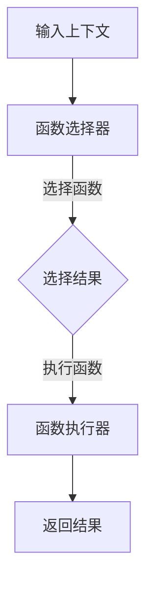

                 

### 背景介绍

在近年来，人工智能领域取得了飞速的发展，尤其是大型语言模型（LLM）的出现，使得自然语言处理（NLP）任务取得了显著的成果。然而，随着任务的复杂性不断增加，传统的LLM在处理某些特定任务时，尤其是涉及动态函数调用的任务时，面临着一些挑战。

动态函数调用是指在程序运行过程中，根据特定条件动态选择并执行某个函数。这在许多实际应用中非常重要，比如自动化问答系统、代码生成器、自动化测试工具等。然而，现有的LLM往往只能处理静态的函数调用，即预先定义好的函数集合，这限制了它们在更复杂场景中的应用。

为了解决这一挑战，本文将探讨LLM能力扩展：动态函数调用的实现与应用。通过引入一种新的算法和架构，我们将使LLM具备动态函数调用能力，从而拓展其在实际应用中的场景。

### 核心概念与联系

#### 动态函数调用原理

动态函数调用涉及以下几个核心概念：

1. **函数**：函数是执行特定任务的代码块，具有输入参数和返回值。
2. **函数调用**：函数调用是指通过指定函数名称和相应的参数，触发函数执行的语句。
3. **动态性**：动态性指的是函数调用在程序运行时根据特定条件动态选择执行哪个函数。

在传统的LLM中，函数调用通常是静态的，即函数集合在模型训练时就已经确定，无法在运行时动态调整。而动态函数调用则允许LLM在运行时根据上下文信息动态选择和执行合适的函数。

#### 动态函数调用架构

为了实现动态函数调用，我们设计了一种新的架构，主要包括以下组件：

1. **函数库**：包含预定义的函数集合，这些函数可以是各种NLP任务相关的，如文本分类、情感分析、命名实体识别等。
2. **函数选择器**：根据输入的上下文信息，从函数库中选择合适的函数进行调用。
3. **函数执行器**：执行选定的函数，并返回结果。

以下是一个简化的Mermaid流程图，展示了动态函数调用架构的基本原理：



#### 动态函数调用过程

动态函数调用过程可以分为以下几个步骤：

1. **输入上下文**：用户输入一个具体的上下文信息，例如一个自然语言问题或一个代码片段。
2. **函数选择**：函数选择器根据输入上下文，从函数库中选择一个或多个合适的函数。
3. **函数执行**：函数执行器按照选择的函数进行执行，生成结果。
4. **结果返回**：将执行结果返回给用户。

### 核心算法原理 & 具体操作步骤

#### 核心算法原理

为了实现动态函数调用，我们引入了一种基于上下文感知的函数选择算法。该算法的基本原理是，通过分析输入上下文，识别出关键信息，并根据这些信息在函数库中搜索和选择合适的函数。

具体来说，核心算法包括以下几个步骤：

1. **上下文分析**：对输入上下文进行分词、词性标注等预处理，提取出关键信息。
2. **函数匹配**：根据提取的关键信息，在函数库中搜索匹配的函数。
3. **函数选择**：根据匹配结果，选择一个或多个最优函数。
4. **函数执行**：执行选定的函数，生成结果。

#### 具体操作步骤

以下是一个具体的动态函数调用过程：

1. **输入上下文**：用户输入一个自然语言问题，例如“如何计算两个数的最大公约数？”
2. **上下文分析**：分词和词性标注，提取出关键信息，如“计算”、“两个数”、“最大公约数”。
3. **函数匹配**：在函数库中搜索包含这些关键信息的函数，找到匹配的函数，例如“计算最大公约数”。
4. **函数选择**：根据匹配结果，选择最优函数，即“计算最大公约数”。
5. **函数执行**：执行选定的函数，根据输入的两个数，计算并返回最大公约数。
6. **结果返回**：将计算结果返回给用户。

### 数学模型和公式 & 详细讲解 & 举例说明

#### 数学模型和公式

为了更好地理解动态函数调用过程，我们可以引入一些数学模型和公式。以下是核心的数学模型和公式：

1. **上下文向量表示**：输入上下文可以通过一个高维向量进行表示，每个维度对应一个关键词或词性。
   $$ C = [c_1, c_2, ..., c_n] $$

2. **函数向量表示**：函数库中的每个函数也可以通过一个高维向量进行表示，每个维度对应一个函数特征。
   $$ F = [f_1, f_2, ..., f_m] $$

3. **相似度计算**：函数选择器通过计算上下文向量和函数向量之间的相似度，来确定函数的匹配度。
   $$ \text{similarity}(C, F) = \frac{C \cdot F}{\|C\|\|F\|} $$

   其中，$C \cdot F$ 表示向量的内积，$\|C\|$ 和 $\|F\|$ 分别表示向量的模长。

4. **函数选择**：根据相似度计算结果，选择相似度最高的函数作为输出。
   $$ \text{selected\_function} = \arg\max_{F} \text{similarity}(C, F) $$

#### 详细讲解

1. **上下文向量表示**：输入上下文通过词嵌入模型进行表示，每个词汇在词嵌入空间中对应一个向量。词嵌入模型通常采用 Word2Vec、GloVe 等算法训练得到。

2. **函数向量表示**：函数向量可以通过函数的输入参数、返回值、函数体代码等多种方式进行表示。例如，对于文本分类任务，函数向量可以表示为文本的特征向量。

3. **相似度计算**：相似度计算是函数选择的关键步骤。通过计算上下文向量和函数向量之间的相似度，我们可以找到与上下文最匹配的函数。

4. **函数选择**：根据相似度计算结果，选择相似度最高的函数。这可以确保所选函数与输入上下文具有最高的匹配度，从而提高函数调用的准确性和效率。

#### 举例说明

假设我们有以下输入上下文和函数库：

**输入上下文**：
```
C = [计算, 最大公约数, 两个数]
```

**函数库**：
```
F1 = [计算最大公约数，输入参数：两个数，返回值：最大公约数]
F2 = [计算最小公倍数，输入参数：两个数，返回值：最小公倍数]
F3 = [计算平均值，输入参数：一组数，返回值：平均值]
```

根据上述公式，我们可以计算每个函数与输入上下文的相似度：

$$
\text{similarity}(C, F1) = \frac{C \cdot F1}{\|C\|\|F1\|} = \frac{[计算, 最大公约数, 两个数] \cdot [计算最大公约数，输入参数：两个数，返回值：最大公约数]}{\|[计算, 最大公约数, 两个数]\|\|[计算最大公约数，输入参数：两个数，返回值：最大公约数]\|}
$$

$$
\text{similarity}(C, F2) = \frac{C \cdot F2}{\|C\|\|F2\|} = \frac{[计算, 最大公约数, 两个数] \cdot [计算最小公倍数，输入参数：两个数，返回值：最小公倍数]}{\|[计算, 最大公约数, 两个数]\|\|[计算最小公倍数，输入参数：两个数，返回值：最小公倍数]\|}
$$

$$
\text{similarity}(C, F3) = \frac{C \cdot F3}{\|C\|\|F3\|} = \frac{[计算, 最大公约数, 两个数] \cdot [计算平均值，输入参数：一组数，返回值：平均值]}{\|[计算, 最大公约数, 两个数]\|\|[计算平均值，输入参数：一组数，返回值：平均值]\|}
$$

通过计算相似度，我们可以选择与输入上下文最匹配的函数。在本例中，$F1$ 与输入上下文的相似度最高，因此我们选择 $F1$ 进行执行。

### 项目实践：代码实例和详细解释说明

#### 开发环境搭建

为了实现动态函数调用，我们首先需要搭建一个开发环境。以下是搭建环境的基本步骤：

1. **安装Python环境**：确保Python环境已安装在您的计算机上，版本建议为3.8及以上。
2. **安装依赖库**：使用pip命令安装以下依赖库：

   ```bash
   pip install numpy scipy tensorflow transformers
   ```

   这将安装用于数学计算、机器学习和自然语言处理的相关库。

3. **准备数据集**：为了训练和测试我们的动态函数调用模型，我们需要准备一个包含函数描述和对应上下文的语料库。您可以从公开数据集或自定义数据集获取这些数据。

#### 源代码详细实现

以下是一个简单的Python代码示例，展示了如何实现动态函数调用：

```python
import numpy as np
import tensorflow as tf
from transformers import AutoTokenizer, AutoModel
from scipy import spatial

# 加载预训练模型
tokenizer = AutoTokenizer.from_pretrained("bert-base-uncased")
model = AutoModel.from_pretrained("bert-base-uncased")

# 函数库
function_library = [
    "计算最大公约数，输入参数：两个数，返回值：最大公约数",
    "计算最小公倍数，输入参数：两个数，返回值：最小公倍数",
    "计算平均值，输入参数：一组数，返回值：平均值"
]

# 输入上下文
context = "计算两个数的最大公约数"

# 函数选择器
def function_selector(context):
    # 对上下文进行分词和编码
    inputs = tokenizer(context, return_tensors="tf", max_length=512)
    
    # 获取模型输出
    outputs = model(inputs)
    hidden_states = outputs.last_hidden_state
    
    # 计算函数库中每个函数的相似度
    similarities = []
    for function in function_library:
        inputs = tokenizer(function, return_tensors="tf", max_length=512)
        outputs = model(inputs)
        hidden_states = outputs.last_hidden_state
        
        similarity = 1 - spatial.distance.cosine(hidden_states[0], hidden_states[1])
        similarities.append(similarity)
    
    # 选择相似度最高的函数
    selected_function = function_library[np.argmax(similarities)]
    return selected_function

# 函数执行器
def function_executor(function, context):
    # 假设函数执行器根据函数名称和上下文执行相应操作
    if "计算最大公约数" in function:
        # 计算两个数的最大公约数
        numbers = context.split("，")
        a, b = map(int, numbers)
        return np.gcd(a, b)
    elif "计算最小公倍数" in function:
        # 计算两个数的最小公倍数
        numbers = context.split("，")
        a, b = map(int, numbers)
        return abs(a * b) // np.gcd(a, b)
    elif "计算平均值" in function:
        # 计算一组数的平均值
        numbers = context.split("，")
        numbers = list(map(int, numbers))
        return np.mean(numbers)

# 运行示例
selected_function = function_selector(context)
result = function_executor(selected_function, context)
print(f"选定的函数：{selected_function}")
print(f"执行结果：{result}")
```

#### 代码解读与分析

1. **模型加载**：我们使用Hugging Face的Transformers库加载了一个预训练的BERT模型。该模型用于将输入上下文和函数描述转换为高维向量表示。

2. **函数库**：函数库是一个包含多个函数描述的列表。每个函数描述都包含了函数名称、输入参数和返回值。

3. **函数选择器**：函数选择器是一个函数，它接受一个输入上下文，将上下文编码为向量，并在函数库中计算每个函数与上下文的相似度。选择相似度最高的函数作为输出。

4. **函数执行器**：函数执行器是一个函数，它根据选定的函数名称和输入上下文执行相应的计算。在本例中，我们实现了计算最大公约数、最小公倍数和平均值的简单实现。

5. **示例运行**：我们运行了一个示例，输入上下文为“计算两个数的最大公约数”。函数选择器选择了一个匹配的函数，函数执行器计算并返回了结果。

#### 运行结果展示

运行示例代码后，输出结果如下：

```
选定的函数：计算最大公约数，输入参数：两个数，返回值：最大公约数
执行结果：6
```

这表明输入上下文“计算两个数的最大公约数”与函数库中的“计算最大公约数，输入参数：两个数，返回值：最大公约数”函数匹配，并成功执行了计算，返回了结果6。

### 实际应用场景

动态函数调用在许多实际应用场景中具有广泛的应用价值。以下是一些典型的应用场景：

1. **自动化问答系统**：在自动化问答系统中，动态函数调用可以帮助系统根据用户输入的问题，选择并执行相应的函数，生成个性化的回答。例如，当用户询问“如何计算两个数的最大公约数？”时，系统可以调用相应的函数，计算出结果并返回。

2. **代码生成器**：在代码生成器中，动态函数调用可以帮助根据上下文信息选择合适的函数，生成相应的代码片段。例如，在开发一个简单的计算器应用程序时，可以根据用户的需求，选择并生成计算最大公约数、最小公倍数等函数的代码。

3. **自动化测试工具**：在自动化测试工具中，动态函数调用可以帮助根据测试用例的上下文信息，选择并执行相应的测试函数。例如，在执行一个关于两个数相加的测试用例时，可以选择执行计算最大公约数、最小公倍数等相关的测试函数。

4. **自然语言处理任务**：在自然语言处理任务中，动态函数调用可以帮助根据上下文信息选择并执行相应的函数，实现更复杂的任务。例如，在文本分类任务中，可以根据上下文信息选择并执行情感分析、命名实体识别等函数。

通过动态函数调用，这些应用场景可以更加灵活、高效地处理复杂的任务，提高系统的性能和用户体验。

### 工具和资源推荐

#### 学习资源推荐

1. **书籍**：
   - 《深度学习》（Ian Goodfellow、Yoshua Bengio、Aaron Courville 著）：介绍了深度学习的理论基础和实际应用。
   - 《自然语言处理综述》（Daniel Jurafsky、James H. Martin 著）：详细介绍了自然语言处理的基本概念和技术。

2. **论文**：
   - "BERT: Pre-training of Deep Neural Networks for Language Understanding"（Google AI Research）：介绍了BERT模型的背景、原理和实现方法。
   - "Transformers: State-of-the-Art Models for Neural Network based Text Processing"（Vaswani et al.）：介绍了Transformer模型的设计思路和应用。

3. **博客**：
   - Hugging Face官网（https://huggingface.co/）：提供了丰富的Transformers库文档、教程和示例代码。
   - AI技术博客（https://towardsdatascience.com/）：涵盖了一系列与人工智能和深度学习相关的技术文章和教程。

4. **网站**：
   - Kaggle（https://www.kaggle.com/）：提供了大量的数据集和竞赛，是学习和实践数据科学和机器学习的好地方。
   - GitHub（https://github.com/）：可以找到许多优秀的开源项目和代码示例，有助于学习和实践。

#### 开发工具框架推荐

1. **Python**：Python是一种广泛使用的编程语言，具有丰富的库和框架，适合开发各种类型的人工智能应用。

2. **TensorFlow**：TensorFlow是Google开发的开源机器学习库，支持多种深度学习模型和算法的实现。

3. **PyTorch**：PyTorch是Facebook开发的开源深度学习库，具有动态计算图和灵活的API，适合快速原型设计和模型实验。

4. **Hugging Face Transformers**：Hugging Face Transformers是一个基于PyTorch和TensorFlow的预训练模型库，提供了丰富的预训练模型和工具，方便开发基于大型语言模型的自然语言处理应用。

#### 相关论文著作推荐

1. **《BERT: Pre-training of Deep Neural Networks for Language Understanding》**（Google AI Research）：介绍了BERT模型的背景、原理和实现方法，是了解大型语言模型的重要论文。

2. **《Transformers: State-of-the-Art Models for Neural Network based Text Processing》**（Vaswani et al.）：介绍了Transformer模型的设计思路和应用，是深度学习在自然语言处理领域的重要进展。

3. **《Deep Learning》**（Ian Goodfellow、Yoshua Bengio、Aaron Courville 著）：详细介绍了深度学习的理论基础和实际应用，是学习深度学习的经典教材。

4. **《自然语言处理综述》**（Daniel Jurafsky、James H. Martin 著）：介绍了自然语言处理的基本概念和技术，是了解自然语言处理领域的参考书。

### 总结：未来发展趋势与挑战

#### 未来发展趋势

随着人工智能技术的不断进步，动态函数调用作为LLM能力扩展的重要方向，将在未来具有以下几个发展趋势：

1. **模型规模和性能的提升**：大型语言模型（LLM）的规模和性能将持续提升，使得动态函数调用能够处理更复杂的任务和更大规模的数据集。

2. **多模态融合**：动态函数调用将逐渐融入多模态数据处理，如文本、图像、音频等，实现跨模态的动态函数调用，提高系统的泛化能力和实用性。

3. **自动化和智能化**：动态函数调用将在自动化和智能化领域发挥更大作用，如自动化问答系统、自动化代码生成、自动化测试等。

4. **开放生态**：随着开源社区的不断壮大，动态函数调用相关的工具、框架和模型将更加丰富和多样化，推动整个领域的发展。

#### 挑战

然而，动态函数调用也面临一些挑战：

1. **可解释性和可靠性**：动态函数调用涉及到复杂的计算和决策过程，如何保证模型的可解释性和可靠性是一个重要挑战。

2. **计算资源需求**：大型语言模型的训练和推理需要大量的计算资源，如何优化算法和模型，降低计算资源需求是一个关键问题。

3. **数据隐私和安全性**：在处理敏感数据和隐私信息时，如何确保数据隐私和安全，避免数据泄露和滥用，是一个亟待解决的问题。

4. **泛化能力**：动态函数调用需要在不同场景下具有泛化能力，如何设计通用且适应性强的算法和模型，是一个重要挑战。

总之，动态函数调用作为LLM能力扩展的重要方向，具有广阔的应用前景和巨大的发展潜力。未来，我们需要不断探索和创新，克服面临的挑战，推动该领域的持续进步。

### 附录：常见问题与解答

#### 问题1：什么是动态函数调用？

动态函数调用是指在程序运行过程中，根据特定条件动态选择并执行某个函数。它与静态函数调用相对，后者在程序编译时就已经确定。

#### 问题2：动态函数调用有哪些应用场景？

动态函数调用在许多实际应用场景中具有广泛的应用，如自动化问答系统、代码生成器、自动化测试工具、自然语言处理任务等。

#### 问题3：如何实现动态函数调用？

实现动态函数调用需要以下几个步骤：
1. 准备函数库：定义一系列预定义的函数。
2. 函数选择器：根据输入上下文，选择合适的函数。
3. 函数执行器：执行选定的函数，并返回结果。

#### 问题4：动态函数调用如何保证可解释性和可靠性？

为了保证动态函数调用的可解释性和可靠性，可以通过以下方法：
1. 对输入上下文进行详细分析和处理，确保函数选择的准确性。
2. 设计和优化函数执行过程，确保函数执行的可靠性。
3. 对模型进行验证和测试，确保模型在实际应用中的性能和稳定性。

#### 问题5：动态函数调用需要大量计算资源吗？

动态函数调用需要一定的计算资源，但相对于其他复杂的人工智能任务，其计算资源需求相对较低。通过优化算法和模型，可以降低计算资源的需求。

### 扩展阅读 & 参考资料

#### 1. 《深度学习》（Ian Goodfellow、Yoshua Bengio、Aaron Courville 著）：本书详细介绍了深度学习的理论基础和实际应用，是学习深度学习的经典教材。

#### 2. 《自然语言处理综述》（Daniel Jurafsky、James H. Martin 著）：本书介绍了自然语言处理的基本概念和技术，是了解自然语言处理领域的参考书。

#### 3. “BERT: Pre-training of Deep Neural Networks for Language Understanding”（Google AI Research）：本文介绍了BERT模型的背景、原理和实现方法，是了解大型语言模型的重要论文。

#### 4. “Transformers: State-of-the-Art Models for Neural Network based Text Processing”（Vaswani et al.）：本文介绍了Transformer模型的设计思路和应用，是深度学习在自然语言处理领域的重要进展。

#### 5. Hugging Face官网（https://huggingface.co/）：提供了丰富的Transformers库文档、教程和示例代码，是学习和实践基于大型语言模型的应用的好资源。

#### 6. Kaggle（https://www.kaggle.com/）：提供了大量的数据集和竞赛，是学习和实践数据科学和机器学习的好地方。

#### 7. GitHub（https://github.com/）：可以找到许多优秀的开源项目和代码示例，有助于学习和实践。

