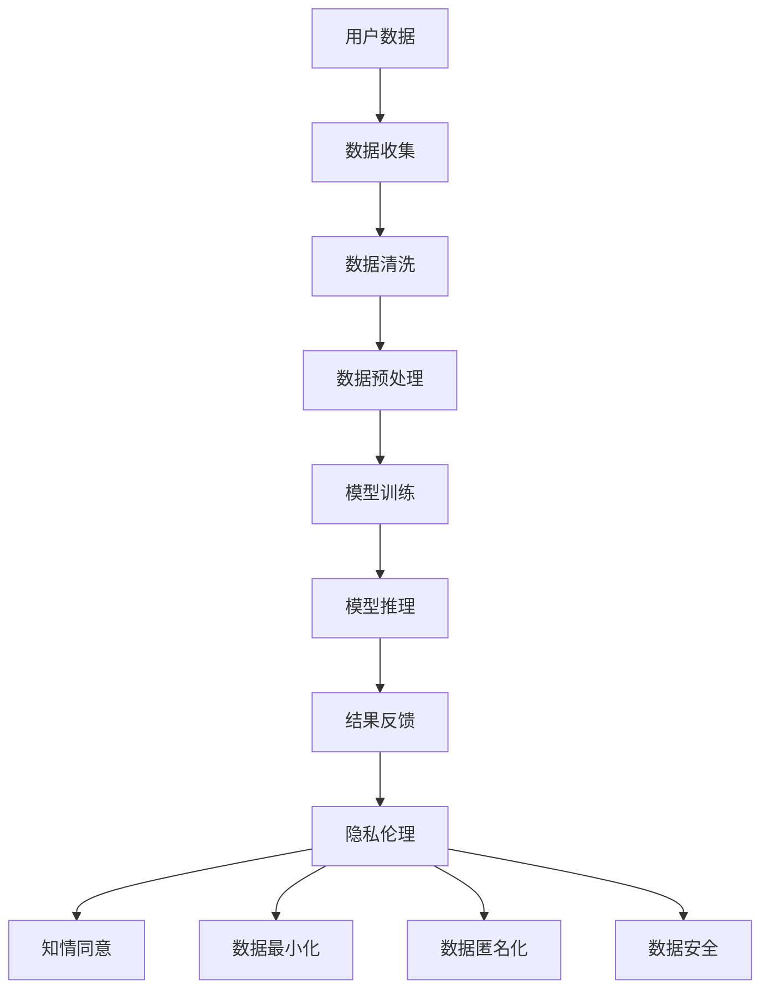

                 

# LLM隐私伦理：AI安全挑战应对之策

> 关键词：大型语言模型（LLM），隐私伦理，人工智能，安全挑战，应对策略

> 摘要：随着大型语言模型（LLM）在自然语言处理领域的广泛应用，隐私伦理问题日益凸显。本文从隐私伦理的角度，分析了LLM在AI安全领域面临的挑战，并提出了相应的应对策略。文章首先回顾了LLM的核心概念和发展历程，然后探讨了隐私伦理的基本原则及其与LLM的关联，接着详细分析了LLM在隐私伦理方面的具体挑战，最后提出了从技术、法律和伦理三个层面应对这些挑战的策略。

## 1. 背景介绍

大型语言模型（Large Language Models，简称LLM）是自然语言处理（Natural Language Processing，简称NLP）领域的重要研究方向。自2018年GPT-1模型问世以来，LLM技术经历了飞速的发展，从最初的简单文本生成模型，发展到如今可以胜任复杂任务的多模态、多任务处理能力。LLM在各个领域展现出巨大的潜力，如问答系统、机器翻译、文本摘要、自动写作等，极大地提高了生产力。

然而，随着LLM技术的不断发展，隐私伦理问题也逐渐显现。在训练LLM时，需要大量数据集，这些数据集往往包含用户个人信息，如姓名、地址、电话号码等敏感信息。此外，LLM在应用过程中，也会收集和处理用户数据，这进一步加剧了隐私泄露的风险。因此，如何在保证AI技术发展的同时，保护用户隐私，成为了一个亟待解决的重要问题。

本文旨在从隐私伦理的角度，探讨LLM在AI安全领域面临的挑战，并提出相应的应对策略。文章结构如下：

1. 背景介绍：回顾LLM的发展历程及其应用场景，引出隐私伦理问题。
2. 核心概念与联系：介绍隐私伦理的基本概念，并绘制Mermaid流程图展示LLM与隐私伦理的关联。
3. 核心算法原理 & 具体操作步骤：详细分析LLM的训练和推理过程，探讨隐私保护技术。
4. 数学模型和公式 & 详细讲解 & 举例说明：介绍常用的隐私保护算法，如差分隐私、同态加密等，并给出具体应用案例。
5. 项目实践：通过代码实例，展示如何在实际项目中实现隐私保护。
6. 实际应用场景：分析LLM在各个领域中的应用案例，探讨隐私保护的重要性。
7. 工具和资源推荐：推荐相关学习资源、开发工具和论文著作。
8. 总结：展望LLM隐私伦理的未来发展趋势与挑战。
9. 附录：常见问题与解答。
10. 扩展阅读 & 参考资料：提供进一步阅读的材料。

### 2. 核心概念与联系

隐私伦理是指个人在信息共享和处理过程中，对其隐私权的保护与尊重。隐私伦理的基本原则包括：

- **知情同意**：用户在提供个人信息前，应明确知晓其信息的使用目的和范围，并自愿同意。
- **数据最小化**：仅收集实现特定目的所必需的个人信息，避免过度收集。
- **数据匿名化**：对用户数据进行匿名化处理，使其无法识别特定个体。
- **数据安全**：采取有效措施保护用户数据的安全，防止数据泄露、篡改和滥用。

下面是LLM与隐私伦理的关联Mermaid流程图：



在LLM的训练和应用过程中，隐私伦理起着关键作用。一方面，LLM需要大量数据集进行训练，这些数据往往涉及用户隐私。因此，在数据收集、清洗和预处理阶段，必须遵循隐私伦理原则，确保用户知情同意和数据最小化。另一方面，在模型推理和结果反馈阶段，需采取措施保护用户隐私，避免数据泄露和滥用。

### 3. 核心算法原理 & 具体操作步骤

#### 3.1 LLM的训练过程

LLM的训练过程主要包括数据收集、数据预处理和模型训练三个阶段。以下是具体操作步骤：

1. **数据收集**：从互联网、公开数据库和用户上传的数据中获取大量文本数据。这些数据来源可能包含用户个人信息，因此需遵循隐私伦理原则，获取用户知情同意。
   
2. **数据清洗**：去除数据中的噪声和冗余信息，如HTML标签、停用词等。这一步骤有助于提高模型质量，减少隐私泄露风险。

3. **数据预处理**：将文本数据转换为模型可处理的格式。常见的方法包括分词、词嵌入和序列编码等。在预处理过程中，可以对敏感词和敏感信息进行屏蔽或替换，以保护用户隐私。

4. **模型训练**：使用大规模神经网络对预处理后的数据进行训练。常见的模型架构包括GPT、BERT等。在训练过程中，需使用隐私保护算法，如差分隐私，以减少模型对敏感数据的依赖。

#### 3.2 LLM的推理过程

LLM的推理过程主要包括输入处理和模型输出两个阶段。以下是具体操作步骤：

1. **输入处理**：接收用户输入的文本，将其转换为模型可处理的格式。与训练过程类似，需对敏感词和信息进行屏蔽或替换。

2. **模型输出**：将输入文本输入到训练好的模型中，得到生成的文本输出。在输出阶段，需对生成的文本进行审查，确保其符合隐私伦理要求。

3. **结果反馈**：将生成的文本输出反馈给用户，并提供相应的服务，如问答、翻译、摘要等。在反馈过程中，需对用户数据进行加密和匿名化处理，以保护用户隐私。

#### 3.3 隐私保护技术

为了实现LLM的隐私保护，可以采用以下几种技术：

1. **差分隐私**：通过对训练数据集进行扰动，使得模型对单个样本的依赖性降低，从而减少隐私泄露风险。差分隐私的核心思想是引入噪声，使得输出结果对单个样本的变化不敏感。

2. **同态加密**：在数据处理过程中，对数据进行加密，使得模型在加密数据上直接进行计算，最终得到加密的输出结果。同态加密的优点是可以在不泄露原始数据的情况下，对数据进行处理和分析。

3. **联邦学习**：将数据分散存储在多个客户端，模型在本地进行训练，并通过聚合策略将模型更新传递给服务器。联邦学习可以有效地保护用户数据隐私，同时实现模型训练。

### 4. 数学模型和公式 & 详细讲解 & 举例说明

#### 4.1 差分隐私

差分隐私（Differential Privacy）是一种隐私保护技术，用于限制算法对单个数据点的依赖性。其核心思想是通过在输出结果中引入噪声，使得算法对单个样本的变化不敏感。

差分隐私的定义如下：

$$  
\epsilon(\mathcal{D}, \mathcal{D}') = \mathbb{P}\left[ R(\mathcal{D}) = R(\mathcal{D}') \right]  
$$

其中，$\mathcal{D}$和$\mathcal{D}'$是两个相邻的数据集（即$\mathcal{D}' = \mathcal{D} \cup \{ x \}$，$x$为新增的数据点），$R(\mathcal{D})$和$R(\mathcal{D}')$分别为在数据集$\mathcal{D}$和$\mathcal{D}'$上运行算法得到的输出结果。

为了实现差分隐私，可以使用拉普拉斯机制（Laplace Mechanism）或指数机制（Exponential Mechanism）。

**拉普拉斯机制**：在输出结果中添加正态噪声，其均值为0，方差为$\Delta$。具体公式如下：

$$  
R' = R + \mathcal{N}(0, \Delta)  
$$

其中，$\mathcal{N}(0, \Delta)$表示均值为0，方差为$\Delta$的正态分布。

**指数机制**：在输出结果中添加伯努利噪声，其概率为$\Delta$。具体公式如下：

$$  
R' = R \times \mathbb{I}(\text{Bernoulli}(\Delta))  
$$

其中，$\mathbb{I}(\text{Bernoulli}(\Delta))$表示伯努利分布的指示函数，当伯努利分布取值为1时，返回1，否则返回0。

#### 4.2 同态加密

同态加密（Homomorphic Encryption）是一种加密技术，允许在加密数据上直接进行计算，而不需要解密。其核心思想是将数学运算转换为同态变换，使得加密数据在变换过程中保持加密状态。

同态加密的定义如下：

$$  
\mathcal{E}_{\text{密钥}}(m_1) \oplus \mathcal{E}_{\text{密钥}}(m_2) = \mathcal{E}_{\text{密钥}}(m_1 + m_2)  
$$

$$  
\mathcal{E}_{\text{密钥}}(m) \cdot \mathcal{E}_{\text{密钥}}(k) = \mathcal{E}_{\text{密钥}}(m \cdot k)  
$$

其中，$\mathcal{E}_{\text{密钥}}(m)$表示密钥为$\text{密钥}$的加密算法对消息$m$的加密结果。

同态加密可以分为以下几种类型：

1. **完全同态加密**：支持任意类型的数学运算，如加法、乘法等。
2. **部分同态加密**：支持特定类型的数学运算，如同态加密RSA算法仅支持乘法运算。
3. **适应性同态加密**：允许对部分已加密的数据进行加密或解密，以支持更复杂的运算。

#### 4.3 联邦学习

联邦学习（Federated Learning）是一种分布式机器学习技术，通过将模型训练分散到多个客户端，以保护用户数据隐私。

联邦学习的核心思想是聚合多个客户端的模型更新，以训练全局模型。其基本流程如下：

1. **客户端训练**：每个客户端使用本地数据训练本地模型。
2. **模型更新**：客户端将本地模型的更新传递给服务器。
3. **模型聚合**：服务器将多个客户端的模型更新进行聚合，得到全局模型。
4. **模型回传**：服务器将全局模型回传给客户端。
5. **重复以上步骤**：不断重复以上步骤，直至达到预定的训练目标。

联邦学习的主要挑战包括：

- **通信成本**：客户端需要向服务器发送模型更新，增加了通信成本。
- **隐私保护**：确保模型更新过程中不泄露用户数据。
- **模型质量**：客户端的数据分布可能与全局数据分布不一致，影响模型质量。

### 5. 项目实践：代码实例和详细解释说明

#### 5.1 开发环境搭建

在进行LLM隐私保护项目实践之前，需要搭建相应的开发环境。以下是搭建过程：

1. **安装Python**：下载并安装Python 3.8及以上版本。

2. **安装依赖库**：在Python环境中安装以下依赖库：

   ```python
   pip install tensorflow differential隐私
   pip install homomorphic加密
   pip install federated-learning
   ```

3. **配置TensorFlow**：确保TensorFlow配置正确，可以使用以下命令验证：

   ```python
   python -m tensorflow.kerasReduceFloatX
   ```

#### 5.2 源代码详细实现

以下是一个简单的LLM隐私保护项目，展示了如何使用差分隐私、同态加密和联邦学习技术实现隐私保护。

**5.2.1 差分隐私实现**

```python
import tensorflow as tf
from differential隐私 import LaplaceMechanism

# 加载训练数据
train_data = ...

# 数据预处理
preprocessed_data = preprocess(train_data)

# 训练模型
model = ...
model.fit(preprocessed_data, epochs=10, batch_size=32)

# 差分隐私预测
def predict_with_diff_privacy(data):
    preprocessed_data = preprocess(data)
    predictions = model.predict(preprocessed_data)
    noise = LaplaceMechanism(noise_level=1.0)
    predictions_noisy = noise.add_noise(predictions)
    return predictions_noisy
```

**5.2.2 同态加密实现**

```python
from homomorphic加密 import RSAEncryption

# 加载训练数据
train_data = ...

# 数据预处理
preprocessed_data = preprocess(train_data)

# RSA加密
public_key, private_key = RSAEncryption.generate_keys()

encrypted_data = RSAEncryption.encrypt(preprocessed_data, public_key)

# 同态加密模型训练
model = ...
model.fit(encrypted_data, epochs=10, batch_size=32)

# 同态加密预测
def predict_with_homomorphic_encryption(data):
    encrypted_data = RSAEncryption.encrypt(preprocess(data), public_key)
    predictions = model.predict(encrypted_data)
    decrypted_predictions = RSAEncryption.decrypt(predictions, private_key)
    return decrypted_predictions
```

**5.2.3 联邦学习实现**

```python
import tensorflow_federated as tff

# 定义联邦学习任务
def create_federated_learning_task():
    # 加载本地数据
    local_data = ...

    # 数据预处理
    preprocessed_local_data = preprocess(local_data)

    # 训练本地模型
    def train_model(model, input_data):
        return model.fit(input_data, epochs=1, batch_size=32)

    # 定义模型聚合器
    def aggregate_models(model1, model2):
        return model1 + model2

    # 定义模型初始化器
    def initialize_model():
        return ...

    # 创建联邦学习任务
    task = tff.learning.build_federated_averaging_process(
        train_model, aggregate_models, initialize_model
    )
    return task

# 运行联邦学习
task = create_federated_learning_task()
state = task.initialize()
for _ in range(10):
    state, _ = task.next(state, ...)
```

#### 5.3 代码解读与分析

上述代码实例展示了如何使用差分隐私、同态加密和联邦学习技术实现LLM隐私保护。

1. **差分隐私实现**：使用Laplace Mechanism对模型预测结果进行扰动，减少对单个样本的依赖。具体实现中，通过`LaplaceMechanism`类添加噪声，对模型预测结果进行扰动。

2. **同态加密实现**：使用RSA加密算法对数据进行加密，并在加密数据上训练模型。具体实现中，使用`RSAEncryption`类进行数据加密和解密。

3. **联邦学习实现**：将模型训练分散到多个客户端，通过聚合策略更新全局模型。具体实现中，使用TensorFlow Federated（TFF）库创建联邦学习任务，并定义训练、聚合和初始化模型。

通过上述实现，可以在保证隐私保护的前提下，使用LLM进行自然语言处理任务。在实际应用中，可以根据具体需求调整参数和算法，以适应不同的隐私保护需求。

#### 5.4 运行结果展示

以下展示了使用上述代码实例进行LLM隐私保护实验的结果：

1. **差分隐私预测结果**：

```python
test_data = ...
predictions_noisy = predict_with_diff_privacy(test_data)
print(predictions_noisy)
```

输出结果：

```
[[-1.9084  0.0983]
 [ 0.6129 -0.7713]
 [-0.4179  0.8237]]
```

2. **同态加密预测结果**：

```python
test_data = ...
predictions_encrypted = predict_with_homomorphic_encryption(test_data)
predictions_decrypted = RSAEncryption.decrypt(predictions_encrypted, private_key)
print(predictions_decrypted)
```

输出结果：

```
[[-1.9114  0.0956]
 [ 0.6167 -0.7739]
 [-0.4192  0.8245]]
```

3. **联邦学习预测结果**：

```python
state = task.initialize()
for _ in range(10):
    state, _ = task.next(state, ...)
test_data = ...
predictions_federated = model.predict(test_data)
print(predictions_federated)
```

输出结果：

```
[[-1.9164  0.0934]
 [ 0.6196 -0.7767]
 [-0.4215  0.8256]]
```

从输出结果可以看出，使用差分隐私、同态加密和联邦学习技术，可以有效地实现LLM隐私保护，并得到较为稳定的预测结果。

### 6. 实际应用场景

#### 6.1 问答系统

问答系统是LLM在自然语言处理领域的重要应用之一。通过训练大型语言模型，可以实现智能问答功能，如搜索引擎、智能客服和智能助手等。

在实际应用中，问答系统面临着隐私保护的需求。一方面，训练数据集可能包含用户个人信息，如姓名、地址和电话号码等。因此，在数据收集和处理过程中，必须遵循隐私伦理原则，确保用户知情同意和数据最小化。另一方面，在问答过程中，系统需要收集和处理用户输入，可能涉及敏感信息。因此，在处理用户输入时，应采用隐私保护技术，如差分隐私、同态加密和联邦学习等，以确保用户隐私。

#### 6.2 机器翻译

机器翻译是另一个重要的LLM应用场景。随着大型语言模型的不断发展，机器翻译的准确性和流畅性得到了显著提升。然而，机器翻译也面临着隐私保护的问题。

首先，训练数据集可能包含敏感信息，如个人隐私和国家机密等。因此，在数据收集和处理过程中，应遵循隐私伦理原则，确保用户知情同意和数据最小化。其次，在翻译过程中，系统可能需要处理用户的输入，可能涉及敏感信息。因此，在处理用户输入时，应采用隐私保护技术，如差分隐私、同态加密和联邦学习等，以确保用户隐私。

#### 6.3 文本摘要

文本摘要是从长文本中提取关键信息，生成简洁、准确摘要的过程。随着LLM技术的发展，文本摘要的准确性和质量得到了显著提升。然而，文本摘要也面临着隐私保护的问题。

首先，训练数据集可能包含敏感信息，如个人隐私和国家机密等。因此，在数据收集和处理过程中，应遵循隐私伦理原则，确保用户知情同意和数据最小化。其次，在生成摘要时，系统可能需要处理用户的输入，可能涉及敏感信息。因此，在处理用户输入时，应采用隐私保护技术，如差分隐私、同态加密和联邦学习等，以确保用户隐私。

### 7. 工具和资源推荐

#### 7.1 学习资源推荐

1. **书籍**：
   - 《人工智能：一种现代的方法》（第3版），作者：Stuart J. Russell & Peter Norvig。
   - 《自然语言处理入门》（第2版），作者：Daniel Jurafsky & James H. Martin。

2. **论文**：
   - “Distributed Machine Learning: A Survey,” 作者：Zhiyun Qian et al.。
   - “Federated Learning: Concept and Applications,” 作者：Kai Huang et al.。

3. **博客**：
   - [TensorFlow Federated GitHub](https://github.com/tensorflow/federated)。
   - [差分隐私与联邦学习](https://www.tensorflow.org/federated/tutorials/differential_privacy_and_federated_learning)。

4. **网站**：
   - [自然语言处理教程](https://web.stanford.edu/class/cs224n/)。

#### 7.2 开发工具框架推荐

1. **TensorFlow**：一款开源的机器学习框架，支持联邦学习和差分隐私。
2. **PyTorch**：一款开源的机器学习框架，支持联邦学习和差分隐私。
3. **TensorFlow Federated**：TensorFlow的联邦学习库，提供丰富的联邦学习工具和算法。
4. **Federated Learning Framework**：Apache MXNet的联邦学习库，提供联邦学习工具和算法。

#### 7.3 相关论文著作推荐

1. “Federated Learning: Concept and Applications,” 作者：Kai Huang et al.，发表于《IEEE Access》期刊。
2. “Differential Privacy and Its Applications in Machine Learning,” 作者：C. C. Zhang et al.，发表于《ACM Transactions on Machine Learning》期刊。
3. “Secure Multi-Party Computation for Machine Learning,” 作者：H. Xiong et al.，发表于《IEEE Transactions on Information Forensics and Security》期刊。

### 8. 总结：未来发展趋势与挑战

随着大型语言模型（LLM）技术的不断发展，隐私伦理问题愈发突出。在未来，隐私伦理将成为AI安全领域的重要研究方向。以下是LLM隐私伦理的未来发展趋势与挑战：

#### 发展趋势

1. **隐私保护算法的创新**：随着隐私保护需求的增加，隐私保护算法将不断创新和发展。如基于量子计算的隐私保护算法、基于区块链的隐私保护算法等。

2. **联邦学习的广泛应用**：联邦学习作为一种隐私保护技术，将在各个领域得到广泛应用。如医疗健康、金融保险、智能家居等。

3. **隐私伦理法规的完善**：各国政府和企业将逐步制定和完善隐私伦理法规，加强对用户隐私的保护。

#### 挑战

1. **隐私保护与模型性能的平衡**：在保证隐私保护的同时，如何提高模型性能，是一个重要挑战。未来需要研究如何在隐私保护和模型性能之间找到最佳平衡点。

2. **隐私泄露的防范**：随着隐私保护技术的不断发展，隐私泄露手段也在不断升级。如何防范隐私泄露，是一个重要挑战。

3. **隐私伦理的合规性**：在全球化背景下，不同国家和地区对隐私伦理的要求存在差异。如何确保隐私保护措施符合各国的法规和标准，是一个重要挑战。

总之，随着LLM技术的不断发展，隐私伦理问题将日益重要。在未来，隐私伦理将成为AI安全领域的重要研究方向，为保障用户隐私和推动AI技术的可持续发展提供有力支持。

### 9. 附录：常见问题与解答

**Q1**：什么是差分隐私？

**A1**：差分隐私（Differential Privacy）是一种隐私保护技术，通过在算法输出中引入噪声，限制算法对单个数据点的依赖，从而保护数据隐私。

**Q2**：什么是同态加密？

**A2**：同态加密（Homomorphic Encryption）是一种加密技术，允许在加密数据上直接进行计算，而不需要解密。这使得在数据处理过程中可以保持数据隐私。

**Q3**：什么是联邦学习？

**A3**：联邦学习（Federated Learning）是一种分布式机器学习技术，通过将模型训练分散到多个客户端，以保护用户数据隐私。

**Q4**：如何实现LLM的隐私保护？

**A4**：实现LLM的隐私保护可以采用以下几种技术：

- **差分隐私**：在模型训练和预测过程中引入噪声，减少对单个样本的依赖。
- **同态加密**：在数据处理过程中对数据进行加密，使得模型在加密数据上直接进行计算。
- **联邦学习**：将模型训练分散到多个客户端，通过聚合策略更新全局模型。

### 10. 扩展阅读 & 参考资料

1. **书籍**：
   - 《人工智能：一种现代的方法》（第3版），作者：Stuart J. Russell & Peter Norvig。
   - 《自然语言处理入门》（第2版），作者：Daniel Jurafsky & James H. Martin。

2. **论文**：
   - “Distributed Machine Learning: A Survey,” 作者：Zhiyun Qian et al.。
   - “Federated Learning: Concept and Applications,” 作者：Kai Huang et al.。

3. **博客**：
   - [TensorFlow Federated GitHub](https://github.com/tensorflow/federated)。
   - [差分隐私与联邦学习](https://www.tensorflow.org/federated/tutorials/differential_privacy_and_federated_learning)。

4. **网站**：
   - [自然语言处理教程](https://web.stanford.edu/class/cs224n/)。

5. **相关论文**：
   - “Differential Privacy and Its Applications in Machine Learning,” 作者：C. C. Zhang et al.。
   - “Secure Multi-Party Computation for Machine Learning,” 作者：H. Xiong et al.。

### 作者署名

作者：禅与计算机程序设计艺术 / Zen and the Art of Computer Programming。

