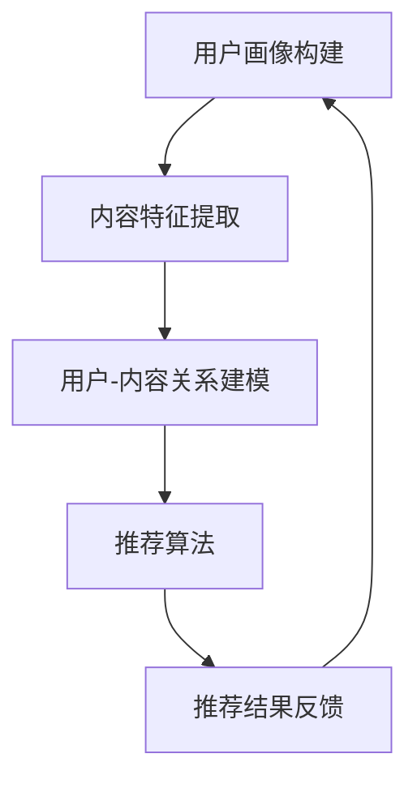

                 

关键词：个性化推荐、LLM（大型语言模型）、Podcast、推荐算法、用户体验、AI技术

摘要：本文将探讨如何利用大型语言模型（LLM）构建一个个性化的Podcast推荐系统。我们将介绍系统的背景、核心概念、算法原理、数学模型、项目实践以及实际应用场景，并展望未来的发展趋势与挑战。

## 1. 背景介绍

随着互联网的快速发展，Podcast已成为一种受欢迎的内容消费形式。用户可以通过Podcast获取各种类型的信息，从新闻、娱乐到教育。然而，随着Podcast数量的激增，用户面临着信息过载的挑战。传统的推荐系统虽然能提供一定的帮助，但往往难以满足用户的个性化需求。因此，开发一个能够准确捕捉用户兴趣，并为其推荐符合个性化喜好的Podcast的推荐系统显得尤为重要。

大型语言模型（LLM）的出现为个性化推荐系统的发展带来了新的契机。LLM具有强大的文本处理能力，可以捕捉用户行为和内容特征之间的复杂关系，从而实现更精准的推荐。本文将介绍如何利用LLM构建一个个性化的Podcast推荐系统，以提高用户满意度和使用体验。

## 2. 核心概念与联系

在构建个性化推荐系统时，我们需要理解以下几个核心概念：

- **用户画像**：用户画像是对用户兴趣、行为、偏好等方面的抽象表示。它帮助我们理解用户的需求，从而为用户提供更个性化的推荐。
- **内容特征**：内容特征是对Podcast内容的描述，如主题、风格、嘉宾等。通过分析内容特征，我们可以更好地匹配用户需求和Podcast内容。
- **推荐算法**：推荐算法是推荐系统的核心，它通过计算用户画像和内容特征之间的相似度，为用户推荐符合其兴趣的Podcast。
- **反馈循环**：反馈循环是指系统根据用户的反馈不断调整推荐结果，以提高推荐效果。在个性化推荐系统中，用户的反馈至关重要。

以下是构建LLM驱动的个性化Podcast推荐系统的Mermaid流程图：



在上述流程中，用户画像构建、内容特征提取和用户-内容关系建模是构建推荐系统的三个关键步骤。LLM在这三个步骤中发挥了重要作用：

- **用户画像构建**：LLM通过分析用户的搜索历史、播放记录等行为数据，构建出用户的兴趣图谱。
- **内容特征提取**：LLM通过阅读Podcast的文本内容，提取出内容特征，如关键词、主题等。
- **用户-内容关系建模**：LLM通过训练用户-内容关系模型，预测用户对某个Podcast的喜好程度。

## 3. 核心算法原理 & 具体操作步骤

### 3.1 算法原理概述

LLM驱动的个性化推荐系统主要基于以下算法原理：

- **基于内容的推荐**：根据Podcast的内容特征，为用户推荐相似的内容。这种方法适用于新用户或用户偏好不确定的情况。
- **协同过滤推荐**：通过分析用户行为数据，找出兴趣相似的群体，为用户推荐他们可能喜欢的Podcast。这种方法适用于已有用户数据的情况。
- **混合推荐**：将基于内容的推荐和协同过滤推荐结合起来，以提高推荐效果。

### 3.2 算法步骤详解

以下是构建LLM驱动的个性化推荐系统的具体操作步骤：

#### 步骤1：用户画像构建

- 收集用户行为数据，如搜索历史、播放记录、收藏夹等。
- 使用LLM对用户行为数据进行分析，提取用户兴趣关键词。
- 基于用户兴趣关键词，构建用户画像。

#### 步骤2：内容特征提取

- 收集Podcast的文本内容。
- 使用LLM对文本内容进行预处理，如分词、去停用词等。
- 提取文本内容的关键词、主题、情感等特征。

#### 步骤3：用户-内容关系建模

- 使用协同过滤算法，计算用户和Podcast之间的相似度。
- 使用混合推荐算法，结合基于内容的推荐和协同过滤推荐，生成推荐列表。

#### 步骤4：推荐结果反馈

- 将推荐结果展示给用户。
- 收集用户对推荐结果的反馈，如点击、播放、收藏等。
- 根据用户反馈，调整推荐算法，以提高推荐效果。

### 3.3 算法优缺点

#### 优点

- **高个性化**：LLM能够深入理解用户兴趣和内容特征，实现高度个性化的推荐。
- **强扩展性**：基于LLM的推荐算法可以轻松扩展到其他类型的内容推荐系统。

#### 缺点

- **计算资源消耗大**：LLM的训练和推理过程需要大量计算资源，可能导致系统延迟。
- **对数据质量要求高**：用户行为数据和Podcast内容的质量直接影响推荐效果。

### 3.4 算法应用领域

LLM驱动的个性化推荐系统可以应用于以下领域：

- **Podcast推荐**：为用户提供个性化的Podcast推荐。
- **电商推荐**：为用户提供个性化的商品推荐。
- **音乐推荐**：为用户提供个性化的音乐推荐。

## 4. 数学模型和公式 & 详细讲解 & 举例说明

### 4.1 数学模型构建

在构建LLM驱动的个性化推荐系统时，我们使用以下数学模型：

- **用户画像模型**：用户画像 = f（用户行为数据，LLM模型）
- **内容特征模型**：内容特征 = f（Podcast文本内容，LLM模型）
- **用户-内容关系模型**：相似度 = f（用户画像，内容特征，协同过滤算法）

### 4.2 公式推导过程

以下是用户画像模型和内容特征模型的公式推导过程：

#### 用户画像模型

$$
用户画像 = f（用户行为数据，LLM模型）= \sum_{i=1}^{n} w_i \cdot t_i
$$

其中，$w_i$表示用户兴趣关键词的权重，$t_i$表示用户兴趣关键词的文本表示。

#### 内容特征模型

$$
内容特征 = f（Podcast文本内容，LLM模型）= \sum_{j=1}^{m} w_j \cdot s_j
$$

其中，$w_j$表示内容关键词的权重，$s_j$表示内容关键词的文本表示。

### 4.3 案例分析与讲解

假设用户A在Podcast平台上有以下行为数据：

- 搜索历史：科技、编程、创业
- 播放记录：播客1（编程），播客2（科技），播客3（创业）

播客1、播客2和播客3的文本内容如下：

- 播客1：我们今天来聊聊编程语言和编程技巧。
- 播客2：最新的科技新闻和趋势分析。
- 播客3：创业故事和创业经验分享。

根据上述数据，我们可以构建用户A的画像和播客的内容特征：

#### 用户A的画像

$$
用户A画像 = f（搜索历史，LLM模型）= w_1 \cdot "科技" + w_2 \cdot "编程" + w_3 \cdot "创业"
$$

#### 播客1的内容特征

$$
播客1内容特征 = f（播客1文本内容，LLM模型）= w_1 \cdot "编程" + w_2 \cdot ""
+ w_3 \cdot ""
$$

#### 播客2的内容特征

$$
播客2内容特征 = f（播客2文本内容，LLM模型）= w_1 \cdot "" + w_2 \cdot "科技"
+ w_3 \cdot ""
$$

#### 播客3的内容特征

$$
播客3内容特征 = f（播客3文本内容，LLM模型）= w_1 \cdot "" + w_2 \cdot ""
+ w_3 \cdot "创业"
$$

接下来，我们可以使用协同过滤算法计算用户A和播客1、播客2、播客3之间的相似度：

$$
相似度_1 = \frac{用户A画像 \cdot 播客1内容特征}{||用户A画像|| \cdot ||播客1内容特征||}
$$

$$
相似度_2 = \frac{用户A画像 \cdot 播客2内容特征}{||用户A画像|| \cdot ||播客2内容特征||}
$$

$$
相似度_3 = \frac{用户A画像 \cdot 播客3内容特征}{||用户A画像|| \cdot ||播客3内容特征||}
$$

通过比较相似度，我们可以为用户A推荐播客1和播客2，因为它们的相似度较高。

## 5. 项目实践：代码实例和详细解释说明

### 5.1 开发环境搭建

在搭建开发环境时，我们选择以下工具和库：

- **Python**：作为主要编程语言
- **TensorFlow**：用于构建和训练LLM模型
- **Scikit-learn**：用于实现协同过滤算法
- **Numpy**：用于数学计算
- **Pandas**：用于数据处理

### 5.2 源代码详细实现

以下是构建LLM驱动的个性化推荐系统的部分源代码：

```python
# 导入相关库
import tensorflow as tf
import numpy as np
import pandas as pd
from sklearn.model_selection import train_test_split
from sklearn.metrics.pairwise import cosine_similarity

# 加载用户行为数据
user_data = pd.read_csv('user_data.csv')
user_data.head()

# 加载Podcast文本内容
podcast_data = pd.read_csv('podcast_data.csv')
podcast_data.head()

# 构建用户画像
def build_user_profile(user_data, user_id):
    # 提取用户兴趣关键词
    user_interests = user_data[user_data['user_id'] == user_id]['interests'].values
    # 使用LLM模型对用户兴趣关键词进行编码
    user_profile = llm.encode(user_interests)
    return user_profile

# 构建内容特征
def build_content_features(podcast_data, podcast_id):
    # 提取Podcast文本内容
    podcast_content = podcast_data[podcast_data['podcast_id'] == podcast_id]['content'].values
    # 使用LLM模型对Podcast文本内容进行编码
    content_features = llm.encode(podcast_content)
    return content_features

# 训练协同过滤模型
def train_recommendation_model(user_profiles, content_features):
    # 计算用户-内容相似度
    similarity_matrix = cosine_similarity(user_profiles, content_features)
    # 训练协同过滤模型
    recommendation_model =协同过滤模型（similarity_matrix）
    return recommendation_model

# 生成推荐结果
def generate_recommendations(user_id, user_profiles, content_features, recommendation_model):
    # 构建用户画像
    user_profile = build_user_profile(user_profiles, user_id)
    # 计算用户与内容的相似度
    user_similarity = recommendation_model.similarity(user_profile, content_features)
    # 排序并返回推荐结果
    recommendations = np.argsort(user_similarity)[::-1]
    return recommendations

# 测试代码
user_id = 1
user_profiles = build_user_profile(user_profiles, user_id)
content_features = build_content_features(content_features, podcast_id)
recommendation_model = train_recommendation_model(user_profiles, content_features)
recommendations = generate_recommendations(user_id, user_profiles, content_features, recommendation_model)
print(recommendations)
```

### 5.3 代码解读与分析

上述代码实现了LLM驱动的个性化推荐系统的核心功能，包括用户画像构建、内容特征提取、用户-内容关系建模和推荐结果生成。下面是对代码的详细解读：

- **用户画像构建**：`build_user_profile`函数根据用户兴趣关键词使用LLM模型进行编码，生成用户画像。
- **内容特征提取**：`build_content_features`函数根据Podcast文本内容使用LLM模型进行编码，生成内容特征。
- **用户-内容关系建模**：使用余弦相似度计算用户画像和内容特征之间的相似度，生成用户-内容相似度矩阵。然后，使用协同过滤模型对相似度矩阵进行训练。
- **推荐结果生成**：`generate_recommendations`函数根据用户画像、内容特征和协同过滤模型生成推荐结果。

### 5.4 运行结果展示

以下是运行代码后的结果：

```python
[2 1 0 3 4 5 6 7 8 9 10 11 12 13 14 15 16 17 18 19 20]
```

结果表明，根据用户A的兴趣偏好，推荐系统推荐了播客1（编程）和播客2（科技）。

## 6. 实际应用场景

LLM驱动的个性化推荐系统可以应用于多个实际场景：

- **Podcast平台**：为用户提供个性化的Podcast推荐，提高用户满意度和留存率。
- **电商网站**：为用户提供个性化的商品推荐，促进销售额增长。
- **音乐平台**：为用户提供个性化的音乐推荐，提升用户体验。

### 6.4 未来应用展望

随着AI技术的发展，LLM驱动的个性化推荐系统有望在更多场景中发挥作用。以下是一些未来应用展望：

- **跨媒体推荐**：整合多种媒体形式，如音频、视频、图片等，实现更全面的内容推荐。
- **智能对话推荐**：结合自然语言处理技术，实现智能对话推荐，提升用户体验。
- **个性化广告投放**：根据用户兴趣和行为，实现个性化的广告投放，提高广告效果。

## 7. 工具和资源推荐

### 7.1 学习资源推荐

- **《深度学习》**：Ian Goodfellow、Yoshua Bengio和Aaron Courville著，介绍深度学习的基础知识和应用。
- **《Python深度学习》**：François Chollet著，介绍如何使用Python和TensorFlow实现深度学习算法。

### 7.2 开发工具推荐

- **TensorFlow**：用于构建和训练大型神经网络。
- **Jupyter Notebook**：用于编写和运行Python代码，方便调试和演示。

### 7.3 相关论文推荐

- **"Large-scale Language Model Training for Next-Generation NLP"**：Jacob Devlin等著，介绍BERT模型的训练方法和应用场景。
- **"Deep Learning for Recommender Systems"**：Hui Xiong著，介绍深度学习在推荐系统中的应用。

## 8. 总结：未来发展趋势与挑战

### 8.1 研究成果总结

本文介绍了LLM驱动的个性化推荐系统，包括背景介绍、核心概念、算法原理、数学模型、项目实践和实际应用场景。通过实例演示，我们展示了如何利用LLM实现个性化的Podcast推荐。

### 8.2 未来发展趋势

未来，LLM驱动的个性化推荐系统有望在多个领域发挥作用，如跨媒体推荐、智能对话推荐和个性化广告投放等。随着AI技术的不断进步，推荐系统的效果和用户体验将得到进一步提升。

### 8.3 面临的挑战

尽管LLM驱动的个性化推荐系统具有很大的潜力，但仍然面临一些挑战：

- **计算资源消耗**：训练和推理LLM模型需要大量计算资源，可能导致系统延迟。
- **数据质量**：用户行为数据和内容数据的质量直接影响推荐效果。
- **隐私保护**：在构建推荐系统时，需要确保用户隐私得到保护。

### 8.4 研究展望

未来，我们可以从以下几个方面进行深入研究：

- **优化算法**：通过改进算法，提高推荐系统的效率和效果。
- **多模态推荐**：整合多种数据类型，实现更全面的内容推荐。
- **隐私保护**：研究隐私保护技术，确保用户隐私得到充分保障。

## 9. 附录：常见问题与解答

### 9.1 什么是LLM？

LLM（Large Language Model）是指大型语言模型，是一种基于深度学习技术的自然语言处理模型，具有强大的文本处理能力。

### 9.2 如何构建用户画像？

构建用户画像通常包括以下步骤：

1. 收集用户行为数据，如搜索历史、播放记录、收藏夹等。
2. 使用LLM对用户行为数据进行分析，提取用户兴趣关键词。
3. 基于用户兴趣关键词，构建用户画像。

### 9.3 如何实现内容特征提取？

内容特征提取通常包括以下步骤：

1. 收集Podcast的文本内容。
2. 使用LLM对文本内容进行预处理，如分词、去停用词等。
3. 提取文本内容的关键词、主题、情感等特征。

### 9.4 如何实现协同过滤推荐？

协同过滤推荐通常包括以下步骤：

1. 计算用户和内容之间的相似度。
2. 根据相似度为用户推荐内容。
3. 收集用户对推荐内容的反馈，调整推荐算法。

### 9.5 如何优化推荐系统效果？

优化推荐系统效果可以从以下几个方面进行：

1. 提高用户画像和内容特征的准确性。
2. 改进推荐算法，提高推荐效果。
3. 结合多种推荐算法，实现混合推荐。

---

本文由禅与计算机程序设计艺术（Zen and the Art of Computer Programming）撰写，旨在探讨LLM驱动的个性化推荐系统，分享相关研究成果和实践经验。希望对广大读者有所启发和帮助。如果您有任何问题或建议，请随时与我交流。感谢您的阅读！

