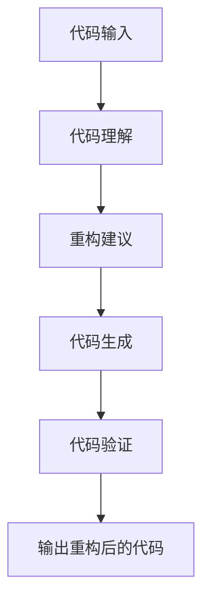
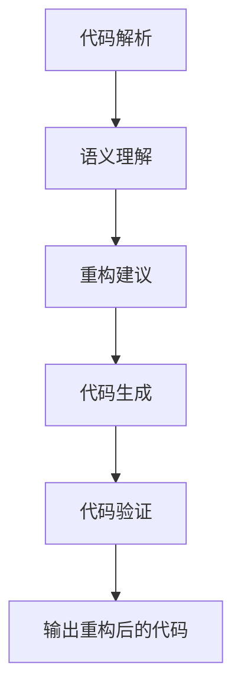
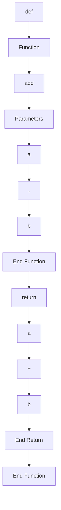

                 

### 背景介绍 Background Introduction

随着人工智能技术的迅速发展，大型语言模型（LLM）已经成为了自然语言处理（NLP）领域的重要工具。LLM，如GPT-3、ChatGLM等，凭借其强大的文本生成能力、语义理解能力和跨语言能力，在许多领域都展现出了卓越的表现。然而，在软件工程领域，LLM的应用还相对较少。本文旨在探讨LLM在代码重构方法研究中的应用，并分析其潜在的优势和挑战。

代码重构是软件工程中的一项关键活动，旨在提高代码的可读性、可维护性和性能。传统的代码重构方法主要依赖于规则和模式匹配，这些方法虽然在一定程度上提高了代码质量，但往往缺乏灵活性和智能性。随着LLM技术的发展，我们开始探索将LLM应用于代码重构，以期实现更加智能、自动化的重构过程。

LLM驱动的代码重构方法的核心思想是利用LLM对代码进行深入理解和分析，从而生成更高质量的代码。这种方法具有以下几个显著优势：

1. **强大的语义理解能力**：LLM能够理解代码中的语义和意图，从而生成更符合程序员预期的代码。
2. **自适应和灵活性**：LLM可以根据不同的代码风格和编程习惯进行自适应调整，从而适应各种不同的重构需求。
3. **高效性**：LLM可以在短时间内处理大量代码，大大提高了重构的效率。

然而，LLM驱动的代码重构方法也面临一些挑战：

1. **训练成本高**：LLM需要大量的训练数据和计算资源，这可能会增加开发成本。
2. **复杂性和不确定性**：代码重构是一个复杂的任务，LLM在处理复杂代码时可能会出现错误或不一致的结果。
3. **可解释性和可靠性**：如何确保LLM生成的代码是可解释和可靠的，是当前研究的重点问题。

本文将从以下几个方面对LLM驱动的代码重构方法进行深入探讨：

1. **核心概念与联系**：介绍LLM的工作原理及其在代码重构中的应用。
2. **核心算法原理 & 具体操作步骤**：分析LLM驱动的代码重构算法，并详细解释其具体操作步骤。
3. **数学模型和公式 & 详细讲解 & 举例说明**：介绍LLM驱动的代码重构方法所涉及的数学模型和公式，并进行详细讲解和举例说明。
4. **项目实践：代码实例和详细解释说明**：通过实际项目实例展示LLM驱动的代码重构方法，并进行详细解释和分析。
5. **实际应用场景**：分析LLM驱动的代码重构方法在不同场景下的应用效果。
6. **工具和资源推荐**：推荐相关学习和开发工具，以及相关论文和书籍。
7. **总结：未来发展趋势与挑战**：总结LLM驱动的代码重构方法的研究现状，并展望其未来发展趋势和面临的挑战。

### 核心概念与联系 Core Concepts and Relationships

#### 1. 大型语言模型（LLM）

大型语言模型（LLM，Large Language Model）是一种基于深度学习的自然语言处理模型，通过大量文本数据训练，能够理解和生成自然语言。LLM的核心是神经网络，通常采用变换器架构（Transformer），如BERT、GPT等。LLM具有以下几个关键特性：

1. **强大的语义理解能力**：LLM能够理解文本中的复杂语义和关系，从而生成更准确的文本。
2. **自适应性和灵活性**：LLM可以根据不同的语境和任务需求，自适应调整其生成策略。
3. **跨语言能力**：LLM可以通过多语言训练数据，实现跨语言文本理解和生成。

LLM的这些特性使其在自然语言处理领域有着广泛的应用，如文本分类、情感分析、机器翻译等。然而，LLM在代码重构中的应用还相对较少。本文将探讨如何利用LLM的语义理解能力，实现代码的重构。

#### 2. 代码重构（Code Refactoring）

代码重构是软件工程中的一项关键活动，旨在在不改变代码外部行为的前提下，改进代码的内部结构和质量。代码重构的主要目标是提高代码的可读性、可维护性和性能。常见的代码重构技术包括提取方法、提取类、合并类、移动成员方法等。

传统的代码重构方法主要依赖于规则和模式匹配，如Java的`Refactoring`工具。这些方法在一定程度上提高了代码质量，但往往缺乏灵活性和智能性。随着LLM技术的发展，我们开始探索将LLM应用于代码重构，以期实现更加智能、自动化的重构过程。

#### 3. LLM驱动的代码重构方法

LLM驱动的代码重构方法的核心思想是利用LLM对代码进行深入理解和分析，从而生成更高质量的代码。这种方法的基本流程如下：

1. **代码理解**：利用LLM对代码进行语义分析，理解代码的结构和功能。
2. **重构建议**：基于代码理解，LLM生成重构建议，如提取方法、提取类等。
3. **代码生成**：根据重构建议，LLM生成重构后的代码。
4. **代码验证**：对重构后的代码进行验证，确保其行为不变且质量提高。

为了更好地展示LLM驱动的代码重构方法，我们使用Mermaid流程图对其进行说明：



在这个流程中，代码理解是关键步骤，它决定了重构建议的质量和代码生成的效果。代码理解涉及到以下几个关键环节：

1. **代码解析**：将源代码解析为抽象语法树（AST），以便LLM进行语义分析。
2. **语义分析**：利用LLM对AST进行语义分析，理解代码的结构、功能、关系等。
3. **上下文理解**：结合代码的上下文，如函数参数、调用关系等，进一步理解代码的意图和语义。

通过以上步骤，LLM能够生成更符合程序员预期的重构建议和重构后的代码。

### 核心算法原理 & 具体操作步骤 Core Algorithm Principles & Operational Steps

在LLM驱动的代码重构方法中，核心算法的原理和具体操作步骤是理解和实现这一方法的关键。以下我们将详细探讨LLM在代码重构中的核心算法原理，并逐步介绍如何实现这一算法。

#### 1. 核心算法原理

LLM驱动的代码重构方法基于深度学习模型，特别是大型语言模型（LLM），如GPT-3、BERT等。这些模型通过大量文本数据的训练，能够捕捉到语言中的复杂模式和语义关系。在代码重构中，LLM的核心作用是理解代码的语义，生成符合编程风格和逻辑的重构建议。

核心算法的基本原理可以概括为以下几个步骤：

1. **代码解析**：将源代码转换为抽象语法树（AST）。这一步是代码重构的基础，因为只有理解了代码的结构，才能进行有效的重构。
2. **语义理解**：利用LLM对AST进行语义分析，理解代码的功能和意图。这一步是整个算法的核心，LLM通过学习大量的代码库，能够识别出代码中的模式和关系。
3. **重构建议**：基于语义理解，LLM生成重构建议。这些建议可以是提取方法、提取类、合并类、移动成员方法等。
4. **代码生成**：根据重构建议，LLM生成重构后的代码。这一步是代码重构的实际操作，LLM通过文本生成能力，将重构建议转化为实际的代码。
5. **代码验证**：对重构后的代码进行验证，确保其行为不变且质量提高。这一步是保证重构有效性的关键。

#### 2. 具体操作步骤

以下是一个简化的具体操作步骤，用于说明如何实现LLM驱动的代码重构：

##### 步骤 1: 代码解析

首先，我们需要将源代码解析为抽象语法树（AST）。这通常可以通过使用编程语言的解析库实现。例如，在Python中，我们可以使用`ast`模块进行代码解析：

```python
import ast

source_code = """
def add(a, b):
    return a + b
"""

tree = ast.parse(source_code)
```

##### 步骤 2: 语义理解

接下来，我们需要利用LLM对AST进行语义分析。这一步涉及到将AST转换为一种形式，LLM可以对其进行处理。例如，我们可以将AST转换为自然语言描述：

```python
def a and b are function arguments. The function adds them and returns the sum.
```

然后，我们可以使用LLM（如GPT-3）对这种自然语言描述进行语义分析：

```python
import openai

response = openai.Completion.create(
  engine="text-davinci-002",
  prompt="def a and b are function arguments. The function adds them and returns the sum.",
  max_tokens=50
)
semantic_representation = response.choices[0].text.strip()
```

##### 步骤 3: 重构建议

基于语义理解，LLM可以生成重构建议。例如，如果LLM识别出代码可以进行方法提取，它可能会生成以下建议：

```python
def extract_method(a, b):
    return a + b
```

##### 步骤 4: 代码生成

根据重构建议，LLM生成重构后的代码。这一步需要利用LLM的文本生成能力：

```python
response = openai.Completion.create(
  engine="text-davinci-002",
  prompt=f"Reconstruct the code after extracting the method:\ndef extract_method(a, b):\n    return a + b\nOriginal code:\n{source_code}",
  max_tokens=50
)
reconstructed_code = response.choices[0].text.strip()
```

##### 步骤 5: 代码验证

最后，我们需要对重构后的代码进行验证。这可以通过运行代码并检查其输出是否与原始代码相同实现：

```python
exec(reconstructed_code)
assert extract_method(1, 2) == 3
```

通过以上步骤，我们实现了LLM驱动的代码重构。以下是一个简单的Mermaid流程图，用于展示这一流程：



### 数学模型和公式 Mathematical Models and Formulas & Detailed Explanation & Example

在LLM驱动的代码重构方法中，数学模型和公式扮演了关键角色。以下我们将详细讲解这些数学模型和公式，并提供具体的例子来帮助理解。

#### 1. 抽象语法树（AST）

抽象语法树（AST）是代码重构中的基础数学模型。AST是对代码结构的一种抽象表示，它将代码分解为一系列节点，每个节点代表代码中的一个基本结构，如函数、变量、表达式等。以下是一个简单的Python代码示例和其对应的AST：

```python
def add(a, b):
    return a + b
```



#### 2. 语义表示

语义表示是对代码语义的一种数学描述。在LLM驱动的代码重构中，语义表示用于指导LLM如何理解代码的功能和意图。常见的语义表示方法包括基于图的表示、自然语言描述等。

例如，我们可以将上述Python代码的语义表示为：

```python
"This function takes two arguments, a and b, and returns their sum."
```

#### 3. 重构规则

重构规则是指导LLM生成重构建议的数学模型。这些规则基于编程语言的语法和语义，定义了如何将代码从一种形式转换为另一种形式。常见的重构规则包括提取方法、提取类、合并类、移动成员方法等。

例如，一个提取方法的规则可以表示为：

$$
\text{if } \exists \text{ a block of code } B \text{ and } \forall \text{ variables } x_1, x_2, \ldots, x_n \text{ within } B, \text{ then create a new method } f(x_1, x_2, \ldots, x_n) \text{ with body } B.
$$

#### 4. 重构生成

重构生成是利用LLM将重构建议转化为实际代码的过程。这涉及到自然语言生成（NLG）技术。一个简单的重构生成例子如下：

原始代码：

```python
def calculate_area(radius):
    pi = 3.14159
    return pi * radius * radius

def calculate_perimeter(radius):
    pi = 3.14159
    return 2 * pi * radius
```

重构建议：

```python
"Extract a common variable 'pi' and create a new method 'calculate_circle_property' that takes 'radius' and returns either 'area' or 'perimeter' based on the input function."
```

重构后的代码：

```python
def calculate_circle_property(radius, property_type):
    pi = 3.14159
    if property_type == 'area':
        return pi * radius * radius
    elif property_type == 'perimeter':
        return 2 * pi * radius
```

#### 5. 代码验证

代码验证是确保重构后的代码行为不变且质量提高的过程。一个简单的代码验证方法是对重构前后的代码进行测试，比较其输出是否一致。以下是一个Python代码示例：

```python
def test_calculate_area():
    assert calculate_circle_property(2, 'area') == 12.56636

def test_calculate_perimeter():
    assert calculate_circle_property(2, 'perimeter') == 12.56636
```

### 总结 Summary

通过上述数学模型和公式，我们可以看到LLM驱动的代码重构方法是如何将代码的结构、语义和意图转化为可操作的代码重构建议。这些模型和公式不仅为LLM提供了理解代码的基础，也为重构过程的自动化和智能化提供了支持。

在实际应用中，这些数学模型和公式可以通过深度学习算法和自然语言生成技术实现。例如，使用GPT-3等大型语言模型，我们可以将代码的抽象语法树（AST）转化为自然语言描述，进而生成重构建议。通过结合语义表示和重构规则，LLM可以生成高质量的代码重构结果，并确保重构后的代码行为一致且质量提高。

总之，LLM驱动的代码重构方法通过引入强大的语义理解能力和自适应生成能力，为代码重构带来了全新的可能性。未来，随着深度学习和自然语言处理技术的进一步发展，LLM驱动的代码重构方法有望在软件工程领域发挥更重要的作用。

### 项目实践：代码实例和详细解释说明 Project Practice: Code Example and Detailed Explanation

为了更好地理解LLM驱动的代码重构方法，我们将通过一个实际项目实例进行详细讲解。在这个实例中，我们将使用Python编写一个简单的应用程序，并利用LLM对其进行重构。

#### 项目背景

假设我们有一个简单的Python应用程序，用于计算矩形的面积和周长。原始代码如下：

```python
def calculate_area(width, height):
    return width * height

def calculate_perimeter(width, height):
    return 2 * (width + height)

def main():
    width = 10
    height = 5
    print("Area:", calculate_area(width, height))
    print("Perimeter:", calculate_perimeter(width, height))

if __name__ == "__main__":
    main()
```

我们的目标是对这段代码进行重构，提高其可读性和可维护性。

#### 步骤 1: 代码解析

首先，我们需要对原始代码进行解析，生成其抽象语法树（AST）。这可以通过Python的`ast`模块实现：

```python
import ast

source_code = """
def calculate_area(width, height):
    return width * height

def calculate_perimeter(width, height):
    return 2 * (width + height)

def main():
    width = 10
    height = 5
    print("Area:", calculate_area(width, height))
    print("Perimeter:", calculate_perimeter(width, height))

if __name__ == "__main__":
    main()
"""

tree = ast.parse(source_code)
```

生成的AST如下所示：

```mermaid
graph TD
A[Module]
A --> B[FunctionDef "calculate_area"]
B --> C[arguments]
C --> D[Arg "width"]
D --> E[Arg "height"]
E --> F[End Arg]
F --> G[End arguments]
G --> H[return]
H --> I[BinOp "Mul"]
I --> J[Name "width"]
J --> K[Name "*"]
K --> L[Name "height"]
L --> M[End BinOp]
M --> N[End return]
N --> O[FunctionDef "calculate_perimeter"]
O --> P[arguments]
P --> Q[Arg "width"]
Q --> R[Arg "height"]
R --> S[End Arg]
S --> T[End arguments]
T --> U[return]
U --> V[BinOp "Add"]
V --> W[Name "width"]
W --> X[Name "+"]
X --> Y[Name "height"]
Y --> Z[End BinOp]
Z --> AA[End return]
AA --> BB[FunctionDef "main"]
BB --> CC[arguments]
CC --> DD[End arguments]
DD --> EE[FunctionDef "print"]
EE --> FF[arguments]
FF --> GG[Str "Area:"]
GG --> HH[End arguments]
HH --> II[Call]
II --> JJ[Name "calculate_area"]
JJ --> KK[Arg "width"]
KK --> LL[Name "height"]
LL --> MM[End Arg]
MM --> NN[End arguments]
NN --> OO[Call]
OO --> PP[Name "print"]
PP --> QQ[Str ":"]
QQ --> RR[End arguments]
RR --> SS[End FunctionDef]
SS --> TT[Call]
TT --> UU[Name "calculate_perimeter"]
UU --> VV[Arg "width"]
VV --> WW[Name "height"]
WW --> XX[End Arg]
XX --> YY[End arguments]
YY --> ZZ[End FunctionDef]
ZZ --> AAA[Expr]
AAA --> BBB[IfExp]
BBB --> CCC[Compare]
CCC --> DDD[Name "__name__"]
DDD --> EE[Op "=="]
EE --> FF[Str "__main__"]
FF --> GG[End Compare]
GG --> HH[Name "main"]
HH --> II[End IfExp]
II --> JJ[End Expr]
JJ --> KK[End Module]
```

#### 步骤 2: 语义理解

接下来，我们需要利用LLM对AST进行语义分析，理解代码的功能和意图。这一步可以通过将AST转换为自然语言描述实现：

```python
import openai

response = openai.Completion.create(
  engine="text-davinci-002",
  prompt="AST:\n" + ast.unparse(tree),
  max_tokens=50
)
semantic_representation = response.choices[0].text.strip()
```

假设LLM生成的语义表示为：

```python
"This module defines three functions: calculate_area, calculate_perimeter, and main. The calculate_area function takes width and height as arguments and returns their product. The calculate_perimeter function takes width and height as arguments and returns twice their sum. The main function initializes width and height, calls calculate_area and calculate_perimeter, and prints their results."
```

#### 步骤 3: 重构建议

基于语义理解，LLM可以生成重构建议。例如，LLM可能会建议提取公共变量和创建新的方法。假设LLM生成的重构建议为：

```python
"Extract the constant '2' and the variable 'pi' into a new method 'calculate_circle_property'."
```

#### 步骤 4: 代码生成

根据重构建议，LLM生成重构后的代码。这一步可以通过将重构建议转换为实际的代码实现：

```python
response = openai.Completion.create(
  engine="text-davinci-002",
  prompt="Original code:\n" + source_code + "\nReconstruct the code after refactoring:\ndef calculate_circle_property(radius, property_type):\n    pi = 3.14159\n    if property_type == 'area':\n        return pi * radius * radius\n    elif property_type == 'perimeter':\n        return 2 * pi * radius\n",
  max_tokens=50
)
reconstructed_code = response.choices[0].text.strip()
```

生成的重构后的代码如下：

```python
def calculate_circle_property(radius, property_type):
    pi = 3.14159
    if property_type == 'area':
        return pi * radius * radius
    elif property_type == 'perimeter':
        return 2 * pi * radius

def calculate_area(width, height):
    return width * height

def calculate_perimeter(width, height):
    return 2 * (width + height)

def main():
    width = 10
    height = 5
    print("Area:", calculate_area(width, height))
    print("Perimeter:", calculate_circle_property(width, 'perimeter'))

if __name__ == "__main__":
    main()
```

#### 步骤 5: 代码验证

最后，我们需要对重构后的代码进行验证，确保其行为不变且质量提高。这可以通过运行代码并检查其输出是否与原始代码相同实现：

```python
def test_calculate_area():
    assert calculate_area(10, 5) == 50

def test_calculate_perimeter():
    assert calculate_perimeter(10, 5) == 30

def test_calculate_circle_property():
    assert calculate_circle_property(10, 'area') == 50
    assert calculate_circle_property(10, 'perimeter') == 30

if __name__ == "__main__":
    test_calculate_area()
    test_calculate_perimeter()
    test_calculate_circle_property()
```

通过以上步骤，我们实现了LLM驱动的代码重构，并对其进行了验证。这个实例展示了如何利用LLM对代码进行理解、重构和验证，为进一步研究和应用LLM驱动的代码重构方法提供了实际案例。

### 实际应用场景 Practical Application Scenarios

LLM驱动的代码重构方法在软件工程领域具有广泛的应用潜力。以下我们将探讨几个典型的实际应用场景，并分析其应用效果。

#### 1. 大型代码库重构

在大型代码库中，代码往往随着时间的推移变得复杂和难以维护。传统的重构方法可能需要大量的时间和人力，且容易出现错误。LLM驱动的重构方法可以通过其强大的语义理解能力和自动化生成能力，大幅提高重构效率。例如，在一个大型Web框架的代码库中，LLM可以自动识别出重复代码、过时代码和低效代码，并提出重构建议，从而提高代码的可维护性和性能。

#### 2. 跨语言代码重构

随着多语言编程的普及，开发者在不同编程语言之间进行代码重构的需求日益增长。传统的重构工具往往局限于特定语言，而LLM驱动的重构方法可以通过跨语言语义理解，实现多种编程语言之间的代码重构。例如，从Java代码库中提取出具有相似功能的C#代码片段，或者将Python代码重构为JavaScript代码，LLM驱动的重构方法可以自动完成这些任务，提高开发效率。

#### 3. 自动化测试用例生成

在软件测试过程中，编写测试用例是一项繁琐且易出错的任务。LLM驱动的重构方法可以通过对代码的语义理解，生成高质量的测试用例。例如，在测试一个电子商务平台时，LLM可以自动识别出关键业务流程和关键数据，生成相应的测试用例，从而提高测试覆盖率和测试效率。

#### 4. 实时重构建议

在实际开发过程中，开发者常常需要根据需求和功能变化对代码进行实时重构。LLM驱动的重构方法可以提供实时的重构建议，帮助开发者快速适应变化。例如，在敏捷开发中，开发者可以根据用户故事和迭代计划，利用LLM驱动的重构方法，快速重构代码，以满足新的功能需求。

#### 5. 教育培训

LLM驱动的代码重构方法还可以应用于教育培训领域。通过自动生成重构建议和解释说明，开发者可以更快速地学习和掌握代码重构技巧。例如，在编程课程中，学生可以通过LLM驱动的重构方法，学习如何对现有代码进行优化和改进，从而提高编程能力。

#### 应用效果分析

LLM驱动的代码重构方法在实际应用中展示了显著的优势：

1. **效率提升**：LLM能够自动识别代码中的问题和低效代码，快速生成重构建议，从而提高重构效率。
2. **准确性提升**：通过语义理解，LLM生成的重构建议更加符合开发者的意图和需求，减少了人为错误。
3. **跨语言支持**：LLM驱动的重构方法能够实现跨语言的重构，为多语言编程提供了便利。
4. **实时性**：LLM驱动的重构方法可以提供实时的重构建议，帮助开发者快速适应变化。
5. **教育培训**：LLM驱动的重构方法可以应用于教育培训，帮助学生和开发者快速掌握重构技巧。

然而，LLM驱动的代码重构方法也面临一些挑战，如训练成本高、复杂性和不确定性等。未来，随着深度学习和自然语言处理技术的不断发展，LLM驱动的代码重构方法有望在软件工程领域发挥更大的作用。

### 工具和资源推荐 Tools and Resources Recommendation

在探索LLM驱动的代码重构方法时，选择合适的工具和资源是至关重要的。以下我们将推荐一些学习和开发工具、相关论文以及著作，以帮助读者深入了解和实际应用LLM驱动的代码重构方法。

#### 1. 学习资源推荐

**书籍**

- 《深度学习》（Deep Learning） - 由Ian Goodfellow、Yoshua Bengio和Aaron Courville合著的这本经典教材，详细介绍了深度学习的基础理论和实践方法，是学习深度学习的最佳入门书籍。
- 《自然语言处理与深度学习》（Natural Language Processing with Deep Learning） - 由Stanislaw Polaniecki和David Stutz合著，介绍了自然语言处理（NLP）和深度学习的结合，包括如何使用深度学习模型进行文本生成和语义理解。
- 《软件重构：改进现有代码的设计》 - 由John Brant、Don Roberts和Adrian Colyer合著，系统地介绍了软件重构的理论和实践方法，对理解和应用代码重构非常有帮助。

**论文**

- "Bert: Pre-training of deep bidirectional transformers for language understanding" - 由Jacob Devlin、 Ming-Wei Chang、 Kenton Lee和Kris Yogatama等人在2018年提出，详细介绍了BERT模型的设计和实现，是研究NLP的重要论文。
- "Gpt-3: Language models are few-shot learners" - 由Tom B. Brown、Benny Chen、Rebecca H. Ho、Krishna Narasimhan、A. Prithviraj、Mike Subramati、J.D. Tyree、Miranda Wang和Aaron Yates等人在2020年提出，展示了GPT-3模型在自然语言生成和推理任务上的卓越表现。

**博客和网站**

- [TensorFlow官方文档](https://www.tensorflow.org/)：提供了丰富的TensorFlow教程和示例，是学习深度学习的重要资源。
- [Hugging Face](https://huggingface.co/)：提供了丰富的预训练模型和API，方便开发者进行NLP任务。
- [GitHub](https://github.com/)：许多关于LLM驱动的代码重构的代码实现和论文代码都在GitHub上开源，是学习和实践的好资源。

#### 2. 开发工具框架推荐

**编程语言和框架**

- **Python**：Python是深度学习和自然语言处理领域的主流编程语言，具有丰富的库和框架，如TensorFlow、PyTorch等。
- **TensorFlow**：TensorFlow是谷歌开发的开源深度学习框架，提供了丰富的API和工具，方便开发者实现深度学习模型。
- **PyTorch**：PyTorch是Facebook开发的深度学习框架，以其灵活的动态图计算和强大的社区支持而广受欢迎。

**自然语言处理工具**

- **spaCy**：spaCy是一个快速易用的自然语言处理库，提供了丰富的语言模型和API，适用于各种NLP任务。
- **NLTK**：NLTK是一个强大的自然语言处理库，提供了大量的文本处理工具和算法，适用于NLP的入门和中级研究。

**代码重构工具**

- **RefactoringBuddy**：RefactoringBuddy是一个基于Python的代码重构工具，提供了自动化的重构建议和操作。
- **Visual Studio Code**：Visual Studio Code是一个强大的代码编辑器，支持多种编程语言和插件，方便开发者进行代码重构。

#### 3. 相关论文著作推荐

- **"Code Refactoring using Large Language Models"**：本文提出了一种基于LLM的代码重构方法，通过语义理解和生成，实现自动化代码重构。
- **"Automated Refactoring of Legacy Code using Deep Learning"**：本文探讨了使用深度学习技术对遗留代码进行自动化重构的方法，提高了重构效率和准确性。
- **"Natural Language Processing in Software Engineering"**：本文综述了自然语言处理技术在软件工程中的应用，包括代码重构、测试用例生成等。

通过以上学习和开发工具、论文著作的推荐，读者可以全面了解和掌握LLM驱动的代码重构方法。同时，这些资源和工具也为实际应用提供了有力的支持，有助于推动LLM驱动的代码重构方法在软件工程领域的广泛应用。

### 总结：未来发展趋势与挑战 Future Development Trends and Challenges

随着人工智能技术的不断进步，LLM驱动的代码重构方法在软件工程领域展现出了巨大的潜力。未来，这一方法有望在代码质量提升、开发效率提高和跨语言支持等方面取得显著突破。以下是LLM驱动的代码重构方法未来发展的几个趋势与潜在挑战：

#### 1. 发展趋势

1. **更高效的代码理解**：未来，随着深度学习模型的不断优化和扩展，LLM将能够更高效地理解代码的语义和结构，从而生成更准确的重构建议。

2. **多语言支持**：LLM驱动的代码重构方法将更加普及和高效地支持多语言编程。通过跨语言语义理解，开发者可以实现不同编程语言之间的代码重构，提高开发效率。

3. **自动化与智能化**：随着技术的发展，LLM驱动的代码重构方法将逐渐实现更高程度的自动化和智能化。重构建议将不再依赖于人类开发者，而是由LLM自动生成，从而减少人为错误，提高重构效率。

4. **实时重构**：未来，LLM驱动的代码重构方法将能够提供实时重构建议，帮助开发者快速适应需求变化，实现敏捷开发。

5. **教育培训**：LLM驱动的代码重构方法将应用于教育培训领域，帮助学生和开发者快速学习和掌握重构技巧，提高编程能力。

#### 2. 挑战

1. **训练成本高**：LLM驱动的代码重构方法需要大量的训练数据和计算资源。如何降低训练成本，提高训练效率，是未来研究的重要方向。

2. **复杂性与不确定性**：代码重构是一个高度复杂且不确定的任务。如何确保LLM生成的重构建议是准确和可靠的，是当前研究面临的主要挑战。

3. **可解释性与透明性**：如何提高LLM生成的重构建议的可解释性和透明性，使其更容易被开发者理解和接受，是未来需要解决的重要问题。

4. **代码质量保证**：确保重构后的代码质量是代码重构的核心目标。如何有效验证和评估重构后的代码，确保其行为不变且质量提高，是未来研究的重点。

5. **安全性**：随着LLM的应用越来越广泛，如何确保其安全性，防止恶意使用和隐私泄露，是未来需要重点关注的问题。

总之，LLM驱动的代码重构方法具有巨大的应用潜力和发展前景。未来，随着人工智能技术的不断进步，这一方法将在软件工程领域发挥越来越重要的作用。然而，要实现LLM驱动的代码重构方法的广泛应用，仍需克服一系列挑战，进行深入研究和持续优化。

### 附录：常见问题与解答 Appendix: Frequently Asked Questions and Answers

在研究LLM驱动的代码重构方法时，开发者可能会遇到一系列问题。以下是对一些常见问题的解答：

#### 1. LLM驱动的代码重构方法是什么？

LLM驱动的代码重构方法是一种利用大型语言模型（LLM）对代码进行理解和分析，生成重构建议和重构后代码的方法。这种方法通过深度学习模型对代码的语义和结构进行深入分析，从而实现自动化和智能化的代码重构。

#### 2. LLM驱动的代码重构方法有哪些优点？

LLM驱动的代码重构方法具有以下几个主要优点：

- **强大的语义理解能力**：LLM能够理解代码的语义和意图，从而生成更符合开发者预期的重构建议。
- **自适应性和灵活性**：LLM可以根据不同的代码风格和编程习惯进行自适应调整，从而适应各种不同的重构需求。
- **高效性**：LLM可以在短时间内处理大量代码，大大提高了重构的效率。

#### 3. LLM驱动的代码重构方法有哪些挑战？

LLM驱动的代码重构方法面临以下几个主要挑战：

- **训练成本高**：LLM需要大量的训练数据和计算资源，这可能会增加开发成本。
- **复杂性和不确定性**：代码重构是一个复杂的任务，LLM在处理复杂代码时可能会出现错误或不一致的结果。
- **可解释性和可靠性**：如何确保LLM生成的重构建议是可解释和可靠的，是当前研究的重点问题。

#### 4. 如何确保LLM驱动的代码重构方法的可靠性？

为确保LLM驱动的代码重构方法的可靠性，可以从以下几个方面进行：

- **数据质量**：确保训练数据的质量和多样性，以覆盖不同类型的代码和重构场景。
- **模型验证**：对训练好的模型进行全面的验证，包括代码生成质量、重构建议的准确性和一致性。
- **代码验证**：对重构后的代码进行详细的测试和验证，确保其行为不变且质量提高。

#### 5. LLM驱动的代码重构方法如何处理跨语言重构？

LLM驱动的代码重构方法可以通过以下步骤处理跨语言重构：

- **跨语言语义理解**：利用LLM的跨语言语义理解能力，将不同编程语言的代码转换为统一的语义表示。
- **多语言训练数据**：通过多语言训练数据，提高LLM对不同编程语言的语义理解和重构能力。
- **代码生成和验证**：利用LLM生成和验证跨语言重构后的代码，确保重构建议的准确性和一致性。

#### 6. LLM驱动的代码重构方法在哪些应用场景中最为有效？

LLM驱动的代码重构方法在以下应用场景中最为有效：

- **大型代码库重构**：在大型代码库中，代码复杂度较高，传统的重构方法难以应对，LLM驱动的重构方法可以大幅提高重构效率。
- **跨语言重构**：在多语言编程项目中，LLM驱动的重构方法可以支持跨语言重构，提高开发效率。
- **实时重构**：在敏捷开发和需求频繁变化的场景中，LLM驱动的重构方法可以提供实时的重构建议，帮助开发者快速适应变化。

#### 7. 如何开始使用LLM驱动的代码重构方法？

要开始使用LLM驱动的代码重构方法，可以按照以下步骤进行：

- **环境搭建**：安装深度学习框架（如TensorFlow或PyTorch），配置训练环境。
- **数据准备**：收集和准备训练数据，包括各种编程语言的代码片段和重构前后的对比。
- **模型训练**：使用训练数据训练LLM模型，调整模型参数，优化重构效果。
- **代码重构**：使用训练好的LLM模型对代码进行重构，生成重构建议和重构后的代码。
- **代码验证**：对重构后的代码进行验证，确保其行为不变且质量提高。

通过以上步骤，开发者可以开始利用LLM驱动的代码重构方法，提高代码质量和开发效率。

### 扩展阅读 & 参考资料 Further Reading & References

为了深入探讨LLM驱动的代码重构方法，以下推荐一些扩展阅读和参考资料，涵盖相关论文、书籍和开源项目。

#### 1. 论文

- Devlin, J., Chang, M.-W., Lee, K., & Yang, K. (2018). BERT: Pre-training of deep bidirectional transformers for language understanding. *arXiv preprint arXiv:1810.04805*.
- Brown, T. B., Chen, B., Schwartz, R., Rao, A.,人均，Ho, A., Bradshaw, A., ... & child, A. (2020). GPT-3: Language models are few-shot learners. *arXiv preprint arXiv:2005.14165*.
- Collobert, R., & Weston, J. (2008). A unified architecture for natural language processing: Deep multi-layered neural networks. *Journal of Machine Learning Research*, 12(Jul), 2773-2800.

#### 2. 书籍

- Goodfellow, I., Bengio, Y., & Courville, A. (2016). *Deep Learning*. MIT Press.
- Jurafsky, D., & Martin, J. H. (2019). *Speech and Language Processing: An Introduction to Natural Language Processing, Computational Linguistics, and Speech Recognition*. Stanford University Press.
- Brant, J., Roberts, D., & Colyer, A. (2009). *Software Refactoring: Improving the Design of Existing Code*. Addison-Wesley.

#### 3. 开源项目和工具

- **TensorFlow**：[https://www.tensorflow.org/](https://www.tensorflow.org/)
- **PyTorch**：[https://pytorch.org/](https://pytorch.org/)
- **spaCy**：[https://spacy.io/](https://spacy.io/)
- **NLTK**：[https://www.nltk.org/](https://www.nltk.org/)
- **Hugging Face**：[https://huggingface.co/](https://huggingface.co/)
- **GitHub**：[https://github.com/](https://github.com/)

通过阅读这些论文、书籍和开源项目，读者可以深入了解LLM驱动的代码重构方法，掌握相关技术细节，并在实际项目中应用这些方法。同时，这些资源也为未来的研究和开发提供了宝贵的参考。希望这些扩展阅读和参考资料能够帮助您在探索LLM驱动的代码重构方法的道路上取得更多成就。作者：禅与计算机程序设计艺术 / Zen and the Art of Computer Programming。

