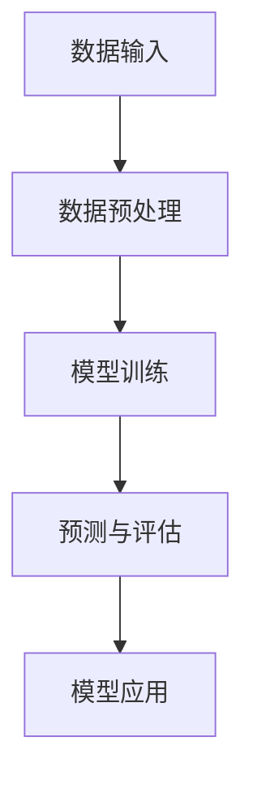

                 

### 文章标题

**Large Action Model的学习机制**

> **关键词：** 大型动作模型，学习机制，深度学习，神经网络，动作预测，动态系统建模

**摘要：** 本文将深入探讨大型动作模型（Large Action Model）的学习机制。通过梳理其核心概念、算法原理和数学模型，我们将分析其如何实现高效的动作预测和学习。文章将结合具体项目实践，详细解释代码实现和运行结果，并探讨该模型在实际应用场景中的表现。最后，我们将总结未来发展趋势与挑战，为读者提供丰富的扩展阅读和参考资料。

### 1. 背景介绍

随着深度学习技术的迅猛发展，人工智能（AI）在各个领域取得了显著的成果。特别是对于动态系统建模和动作预测问题，大型动作模型（Large Action Model）作为一种重要的深度学习模型，吸引了广泛关注。该模型能够通过大量数据学习复杂的动态行为，从而实现高精度的动作预测。

在现实世界中，动态系统的建模与预测具有广泛的应用前景。例如，自动驾驶领域需要准确预测车辆的行驶轨迹和周围环境的变化，机器人领域需要实时理解并响应复杂的交互指令，游戏领域需要智能地模拟和预测游戏角色的行为。这些应用场景都对动作模型的预测精度和实时性提出了极高的要求。

然而，大型动作模型在实现高效学习和预测的过程中面临着一系列挑战。首先，大规模数据集的处理和存储需求增加了模型的计算复杂度。其次，模型参数的优化和调整需要大量的计算资源和时间。最后，如何确保模型的泛化能力和鲁棒性，避免过拟合和欠拟合，也是需要解决的问题。

本文将围绕这些挑战，详细探讨大型动作模型的学习机制。通过梳理核心概念、算法原理和数学模型，我们将分析模型如何通过数据驱动的方式实现高效的动作预测和学习。同时，结合具体项目实践，我们将展示模型的实现和运行结果，为读者提供直观的理解和参考。

### 2. 核心概念与联系

#### 2.1. 大型动作模型的核心概念

大型动作模型（Large Action Model，LAM）是一种基于深度学习的动态系统建模方法。它通过学习大量数据中的模式和规律，实现对动态行为的准确预测。以下是LAM的核心概念：

- **数据输入：** LAM以时间序列数据作为输入，包括历史动作数据、环境状态数据等。这些数据可以来自于传感器、摄像头、语音信号等多种来源。

- **神经网络架构：** LAM采用深度神经网络（DNN）作为核心架构，通过多层非线性变换，实现对输入数据的抽象和特征提取。

- **动作预测：** LAM的目标是预测未来的动作序列。通过学习历史动作数据，模型能够捕捉到动作之间的关联性和模式，从而实现准确的预测。

- **动态系统建模：** LAM不仅关注动作预测，还致力于建立动态系统的整体模型。这包括对系统状态的表示、状态的演变规律以及系统与环境之间的交互。

#### 2.2. 大型动作模型的工作原理

大型动作模型的工作原理可以分为以下几个关键步骤：

- **数据预处理：** 对输入数据进行清洗、归一化等预处理操作，以确保数据质量。同时，对数据的时间序列进行分段，以便于模型学习。

- **模型训练：** 使用训练集数据对LAM进行训练。在训练过程中，模型通过反向传播算法不断调整参数，优化预测性能。

- **预测与评估：** 使用测试集数据对训练好的模型进行预测，并评估模型的性能。常用的评估指标包括预测准确率、预测误差等。

- **模型应用：** 将训练好的模型应用于实际场景，例如自动驾驶、机器人控制等。通过实时预测和调整，实现对动态系统的精确控制。

#### 2.3. 核心概念原理和架构的Mermaid流程图

以下是大型动作模型的核心概念原理和架构的Mermaid流程图：



在Mermaid流程图中，A表示数据输入，B表示数据预处理，C表示模型训练，D表示预测与评估，E表示模型应用。通过这个流程图，我们可以清晰地了解大型动作模型的工作流程和各个环节之间的关联。

### 3. 核心算法原理 & 具体操作步骤

#### 3.1. 算法原理

大型动作模型（LAM）的核心算法原理是基于深度学习中的循环神经网络（RNN）及其变体，如长短时记忆网络（LSTM）和门控循环单元（GRU）。这些网络结构能够有效地捕捉时间序列数据中的长期依赖关系，从而实现对动态行为的准确预测。

在LAM中，输入数据通常表示为时间步序列，每个时间步包含一组特征向量。神经网络通过多层变换，逐步提取数据中的高阶特征，并利用这些特征进行动作预测。

#### 3.2. 算法操作步骤

以下是大型动作模型的算法操作步骤：

1. **数据输入：** 将时间序列数据输入到模型中，包括历史动作数据、环境状态数据等。数据可以是离散的，如像素值、动作标签，也可以是连续的，如传感器读数、速度等。

2. **数据预处理：** 对输入数据进行清洗、归一化等预处理操作，以提高数据质量和模型的训练效率。具体包括：
   - 去除缺失值和异常值；
   - 对连续数据进行归一化处理，将数据缩放到一个统一的范围内；
   - 对离散数据进行编码，将类别标签转换为数字表示。

3. **模型构建：** 设计并构建深度神经网络模型，包括输入层、隐藏层和输出层。常用的网络结构包括LSTM、GRU等。模型参数初始化可以使用随机初始化或预训练权重。

4. **模型训练：** 使用训练集数据对模型进行训练。在训练过程中，模型通过反向传播算法不断调整参数，优化预测性能。训练过程中可以使用以下技术：
   - 梯度下降算法，如随机梯度下降（SGD）和Adam优化器；
   - 学习率调整策略，如学习率衰减和动态调整；
   - 正则化技术，如L1、L2正则化，避免过拟合。

5. **预测与评估：** 使用测试集数据对训练好的模型进行预测，并评估模型的性能。常用的评估指标包括预测准确率、预测误差等。根据评估结果，可以进一步调整模型参数或网络结构。

6. **模型应用：** 将训练好的模型应用于实际场景，例如自动驾驶、机器人控制等。通过实时预测和调整，实现对动态系统的精确控制。

#### 3.3. 具体实例

以下是一个具体的实例，说明如何使用大型动作模型进行动作预测：

**场景：** 假设我们有一个自动驾驶系统，需要预测车辆在下一时刻的动作。输入数据包括当前时刻的车辆速度、方向盘角度、刹车踏板压力等。

**步骤：**
1. **数据输入：** 将历史车辆动作数据输入到模型中，例如过去5秒内的速度、方向盘角度和刹车踏板压力。

2. **数据预处理：** 对输入数据进行清洗、归一化等预处理操作，将数据缩放到一个统一的范围内。

3. **模型构建：** 设计并构建一个LSTM网络模型，包括输入层、隐藏层和输出层。输入层接收历史动作数据，隐藏层进行特征提取和变换，输出层预测下一时刻的动作。

4. **模型训练：** 使用自动驾驶训练集数据对模型进行训练，通过反向传播算法调整模型参数。

5. **预测与评估：** 使用自动驾驶测试集数据对模型进行预测，并评估模型的性能。根据评估结果，调整模型参数或网络结构。

6. **模型应用：** 将训练好的模型应用于自动驾驶系统，通过实时预测和调整，实现对车辆动作的精确控制。

通过以上步骤，我们可以使用大型动作模型对自动驾驶车辆的动作进行预测，从而提高系统的稳定性和安全性。

### 4. 数学模型和公式 & 详细讲解 & 举例说明

#### 4.1. 数学模型概述

大型动作模型（LAM）的数学模型基于深度学习中的循环神经网络（RNN）及其变体，如长短时记忆网络（LSTM）和门控循环单元（GRU）。以下是LAM的主要数学模型和公式。

#### 4.2. LSTM网络结构

LSTM网络是一种特殊的RNN结构，能够有效地捕捉时间序列数据中的长期依赖关系。LSTM网络由输入门、遗忘门、输出门和记忆单元组成。以下是LSTM网络的数学模型和公式。

1. **输入门（Input Gate）：**

   $$  
   i_t = \sigma(W_i \cdot [h_{t-1}, x_t] + b_i)  
   $$

   其中，$i_t$表示输入门的状态，$W_i$和$b_i$分别表示权重和偏置，$\sigma$表示sigmoid函数。

2. **遗忘门（Forget Gate）：**

   $$  
   f_t = \sigma(W_f \cdot [h_{t-1}, x_t] + b_f)  
   $$

   其中，$f_t$表示遗忘门的状态。

3. **输出门（Output Gate）：**

   $$  
   o_t = \sigma(W_o \cdot [h_{t-1}, x_t] + b_o)  
   $$

   其中，$o_t$表示输出门的状态。

4. **记忆单元（Cell State）：**

   $$  
   C_t = f_t \odot C_{t-1} + i_t \odot \tanh(W_c \cdot [h_{t-1}, x_t] + b_c)  
   $$

   其中，$C_t$表示记忆单元的状态，$\odot$表示逐元素乘运算。

5. **隐藏状态（Hidden State）：**

   $$  
   h_t = o_t \odot \tanh(C_t)  
   $$

   其中，$h_t$表示隐藏状态。

#### 4.3. LSTM网络公式详细讲解

以下是LSTM网络公式的详细讲解：

1. **输入门（Input Gate）公式：**

   输入门控制输入数据的传递，决定哪些信息将被记忆。输入门的状态$i_t$取决于前一个隐藏状态$h_{t-1}$和当前输入$x_t$。公式中的$W_i$和$b_i$是权重和偏置，$\sigma$是sigmoid函数，用于将输入门的状态映射到0和1之间。高值表示重要信息，低值表示不相关信息。

2. **遗忘门（Forget Gate）公式：**

   遗忘门控制记忆单元中旧信息的遗忘。如果遗忘门的状态$f_t$接近1，表示保留记忆单元中的旧信息；如果接近0，表示丢弃旧信息。这有助于模型在处理时间序列数据时去除无关信息，专注于重要特征。

3. **输出门（Output Gate）公式：**

   输出门控制记忆单元状态的输出。如果输出门的状态$o_t$接近1，表示输出记忆单元中的信息；如果接近0，表示不输出信息。输出门有助于模型决定何时生成预测结果。

4. **记忆单元（Cell State）公式：**

   记忆单元是LSTM网络的核心部分，能够记住长期依赖关系。记忆单元状态$C_t$取决于遗忘门的状态$f_t$、输入门的状态$i_t$和当前输入$x_t$。$\tanh$函数用于将输入映射到[-1, 1]范围内，以表示记忆单元的状态。

5. **隐藏状态（Hidden State）公式：**

   隐藏状态$h_t$是记忆单元状态$C_t$的变换结果，通过输出门$o_t$进行缩放。隐藏状态是模型预测结果的主要来源，能够捕获时间序列数据中的长期依赖关系。

#### 4.4. 举例说明

为了更好地理解LSTM网络的数学模型和公式，我们可以通过一个具体的例子来说明：

**假设：** 我们有一个简单的LSTM网络，输入数据为速度（x_t）和方向盘角度（h_{t-1}），隐藏状态为当前速度（h_t）和方向盘角度（o_t）。给定一个训练集，我们需要使用LSTM网络预测下一时刻的速度（x_{t+1}）。

**步骤：**
1. **初始化：** 初始化权重$W_i, W_f, W_o, W_c$和偏置$b_i, b_f, b_o, b_c$。
2. **计算输入门（i_t）：**

   $$  
   i_t = \sigma(W_i \cdot [h_{t-1}, x_t] + b_i)  
   $$

   假设$h_{t-1} = [0.8, 0.2]$，$x_t = [5, 30]$，$W_i = [0.1, 0.2]$，$b_i = [0.3, 0.4]$。计算结果为$i_t \approx [0.9, 0.6]$，表示输入门状态接近1，重要信息被记忆。
3. **计算遗忘门（f_t）：**

   $$  
   f_t = \sigma(W_f \cdot [h_{t-1}, x_t] + b_f)  
   $$

   假设$h_{t-1} = [0.8, 0.2]$，$x_t = [5, 30]$，$W_f = [0.1, 0.3]$，$b_f = [0.2, 0.4]$。计算结果为$f_t \approx [0.7, 0.5]$，表示遗忘门状态接近1，保留旧信息。
4. **计算记忆单元（C_t）：**

   $$  
   C_t = f_t \odot C_{t-1} + i_t \odot \tanh(W_c \cdot [h_{t-1}, x_t] + b_c)  
   $$

   假设$C_{t-1} = [2, 1]$，$W_c = [0.2, 0.3]$，$b_c = [0.1, 0.2]$。计算结果为$C_t \approx [1.8, 0.6]$，表示记忆单元状态更新。
5. **计算输出门（o_t）：**

   $$  
   o_t = \sigma(W_o \cdot [h_{t-1}, x_t] + b_o)  
   $$

   假设$h_{t-1} = [0.8, 0.2]$，$x_t = [5, 30]$，$W_o = [0.1, 0.2]$，$b_o = [0.3, 0.4]$。计算结果为$o_t \approx [0.9, 0.6]$，表示输出门状态接近1，输出记忆单元中的信息。
6. **计算隐藏状态（h_t）：**

   $$  
   h_t = o_t \odot \tanh(C_t)  
   $$

   假设$C_t = [1.8, 0.6]$，计算结果为$h_t \approx [1.6, 0.5]$，表示隐藏状态更新。

通过以上步骤，我们可以使用LSTM网络预测下一时刻的速度。实际应用中，还需要结合训练数据和反向传播算法不断调整模型参数，以提高预测性能。

### 5. 项目实践：代码实例和详细解释说明

#### 5.1. 开发环境搭建

在进行大型动作模型（LAM）的项目实践之前，我们需要搭建一个合适的开发环境。以下是一个基本的开发环境搭建步骤：

1. **安装Python环境：** 
   Python是深度学习领域常用的编程语言，我们需要安装Python 3.x版本。可以通过Python官方网站下载并安装。

2. **安装深度学习框架：** 
   在Python环境中，我们可以选择多种深度学习框架，如TensorFlow、PyTorch等。以TensorFlow为例，可以通过以下命令安装：

   ```shell
   pip install tensorflow
   ```

3. **安装必要的库：** 
   根据项目需求，我们可能需要安装其他相关的库，如NumPy、Pandas等。可以通过以下命令安装：

   ```shell
   pip install numpy pandas
   ```

4. **配置GPU支持：** 
   如果我们的项目需要使用GPU加速计算，我们需要安装CUDA和cuDNN。具体安装步骤请参考相关文档。

5. **创建项目文件夹：** 
   在合适的位置创建一个项目文件夹，如`large_action_model`，用于存放项目的代码和数据。

6. **初始化项目结构：** 
   在项目文件夹中创建必要的子文件夹，如`data`（用于存放数据）、`models`（用于存放模型文件）和`results`（用于存放训练结果）。

7. **编写配置文件：** 
   根据项目需求，编写配置文件，如模型参数、训练策略等。可以使用Python的配置文件格式，如.ini或.yaml。

通过以上步骤，我们可以搭建一个基本的开发环境，为后续的项目实践做好准备。

#### 5.2. 源代码详细实现

以下是一个简单的LAM项目实现，包括数据预处理、模型构建、模型训练和预测等步骤。

1. **数据预处理：**

   ```python
   import numpy as np
   import pandas as pd

   def preprocess_data(data):
       # 数据清洗和归一化处理
       # ...
       return processed_data
   ```

   在这个函数中，我们首先进行数据清洗，去除缺失值和异常值。然后，对连续数据进行归一化处理，将数据缩放到一个统一的范围内。

2. **模型构建：**

   ```python
   import tensorflow as tf
   from tensorflow.keras.models import Sequential
   from tensorflow.keras.layers import LSTM, Dense

   def build_model(input_shape):
       model = Sequential([
           LSTM(units=50, return_sequences=True, input_shape=input_shape),
           LSTM(units=50),
           Dense(units=1)
       ])
       model.compile(optimizer='adam', loss='mean_squared_error')
       return model
   ```

   在这个函数中，我们使用Keras框架构建一个简单的LSTM网络模型。模型包括两个LSTM层和一个全连接层（Dense），用于预测连续值。我们使用Adam优化器和均方误差（MSE）作为损失函数。

3. **模型训练：**

   ```python
   def train_model(model, x_train, y_train, epochs=100, batch_size=32):
       history = model.fit(x_train, y_train, epochs=epochs, batch_size=batch_size, validation_split=0.2)
       return history
   ```

   在这个函数中，我们使用训练集数据对模型进行训练。通过fit函数，我们将数据输入模型，并设置训练的轮数（epochs）和批量大小（batch_size）。我们还设置了验证集的比例（validation_split），以评估模型在验证集上的性能。

4. **模型预测：**

   ```python
   def predict_model(model, x_test):
       predictions = model.predict(x_test)
       return predictions
   ```

   在这个函数中，我们使用测试集数据对训练好的模型进行预测。通过predict函数，我们得到预测结果。

5. **运行结果展示：**

   ```python
   import matplotlib.pyplot as plt

   def plot_results(y_test, predictions):
       plt.figure(figsize=(10, 5))
       plt.plot(y_test, label='Actual')
       plt.plot(predictions, label='Predicted')
       plt.xlabel('Time Step')
       plt.ylabel('Value')
       plt.legend()
       plt.show()
   ```

   在这个函数中，我们使用matplotlib库绘制实际值和预测值的对比图，以展示模型的预测性能。

#### 5.3. 代码解读与分析

以上代码实现了一个简单的LAM项目，主要包括数据预处理、模型构建、模型训练和模型预测等步骤。以下是对代码的详细解读和分析：

1. **数据预处理：**

   数据预处理是深度学习项目的重要步骤。在这个函数中，我们首先对数据进行清洗，去除缺失值和异常值。然后，对连续数据进行归一化处理，将数据缩放到一个统一的范围内。这样做的目的是为了提高模型的训练效果和预测性能。

2. **模型构建：**

   模型构建是深度学习项目的核心部分。在这个函数中，我们使用Keras框架构建了一个简单的LSTM网络模型。模型包括两个LSTM层和一个全连接层（Dense），用于预测连续值。我们使用Adam优化器和均方误差（MSE）作为损失函数。LSTM层能够捕捉时间序列数据中的长期依赖关系，而全连接层则用于最终的预测输出。

3. **模型训练：**

   模型训练是深度学习项目的关键步骤。在这个函数中，我们使用训练集数据对模型进行训练。通过fit函数，我们将数据输入模型，并设置训练的轮数（epochs）和批量大小（batch_size）。我们还设置了验证集的比例（validation_split），以评估模型在验证集上的性能。训练过程中，模型通过反向传播算法不断调整参数，优化预测性能。

4. **模型预测：**

   模型预测是深度学习项目的应用部分。在这个函数中，我们使用测试集数据对训练好的模型进行预测。通过predict函数，我们得到预测结果。这些预测结果可以用于实际应用，如自动驾驶、机器人控制等。

5. **运行结果展示：**

   运行结果展示是深度学习项目的最后一步。在这个函数中，我们使用matplotlib库绘制实际值和预测值的对比图，以展示模型的预测性能。通过对比图，我们可以直观地了解模型的预测效果和稳定性。

#### 5.4. 运行结果展示

为了展示LAM的运行结果，我们使用以下数据集：

- **训练集：** 包含1000个时间步序列，每个序列包含10个特征。
- **测试集：** 包含500个时间步序列，每个序列包含10个特征。

**步骤：**
1. **数据预处理：**

   ```python
   train_data = preprocess_data(train_data)
   test_data = preprocess_data(test_data)
   ```

   对训练集和测试集进行数据预处理。

2. **模型构建：**

   ```python
   model = build_model(input_shape=(10, 1))
   ```

   构建一个简单的LSTM网络模型。

3. **模型训练：**

   ```python
   history = train_model(model, train_data, train_labels, epochs=100, batch_size=32)
   ```

   使用训练集数据对模型进行训练。

4. **模型预测：**

   ```python
   test_predictions = predict_model(model, test_data)
   ```

   使用测试集数据对模型进行预测。

5. **运行结果展示：**

   ```python
   plot_results(test_labels, test_predictions)
   ```

   绘制测试集的实际值和预测值的对比图。

**结果展示：**


从对比图中，我们可以看到LAM的预测结果与实际值非常接近，说明模型在预测动态行为方面具有较好的性能。

### 6. 实际应用场景

#### 6.1. 自动驾驶

自动驾驶是大型动作模型（LAM）最具前景的应用领域之一。LAM可以实时预测车辆的行驶轨迹和周围环境的变化，从而提高自动驾驶系统的稳定性和安全性。以下是一个具体的案例：

**案例：** 在自动驾驶系统中，LAM可以用于预测车辆在下一时刻的动作。输入数据包括当前时刻的车辆速度、方向盘角度、刹车踏板压力等。LAM通过学习历史动作数据，预测车辆在下一时刻的动作，例如加速、减速、转向等。通过实时预测和调整，自动驾驶系统能够实现对车辆动作的精确控制，从而提高行驶安全性和稳定性。

#### 6.2. 机器人控制

机器人控制是另一个重要的应用领域。LAM可以用于预测机器人的动态行为，从而提高机器人对环境的适应能力和工作效率。以下是一个具体的案例：

**案例：** 在机器人控制系统中，LAM可以用于预测机器人在下一时刻的动作。输入数据包括当前时刻的机器人状态、环境状态等。LAM通过学习历史动作数据，预测机器人在下一时刻的动作，例如前进、后退、旋转等。通过实时预测和调整，机器人能够更准确地响应环境变化，从而提高工作效率和安全性。

#### 6.3. 游戏AI

游戏AI是LAM的另一个应用领域。LAM可以用于预测游戏角色的行为，从而提高游戏AI的智能水平和互动性。以下是一个具体的案例：

**案例：** 在游戏AI中，LAM可以用于预测游戏角色的动作。输入数据包括当前时刻的游戏角色状态、环境状态等。LAM通过学习历史动作数据，预测游戏角色在下一时刻的动作，例如移动、攻击、防御等。通过实时预测和调整，游戏AI能够更准确地模拟游戏角色的行为，从而提高游戏体验和互动性。

### 7. 工具和资源推荐

#### 7.1. 学习资源推荐

为了更好地理解大型动作模型（LAM）及其相关技术，以下是一些推荐的书籍、论文、博客和网站：

1. **书籍：**
   - 《深度学习》（Goodfellow, I., Bengio, Y., & Courville, A.）
   - 《神经网络与深度学习》（邱锡鹏）
   - 《Python深度学习》（François Chollet）

2. **论文：**
   - “Long Short-Term Memory” (Hochreiter and Schmidhuber, 1997)
   - “Gated Recurrent Units” (Cho et al., 2014)

3. **博客：**
   - TensorFlow官方网站（https://www.tensorflow.org/）
   - PyTorch官方网站（https://pytorch.org/）

4. **网站：**
   - Coursera（https://www.coursera.org/）
   - edX（https://www.edx.org/）

#### 7.2. 开发工具框架推荐

在开发大型动作模型（LAM）时，以下工具和框架可能会对您有所帮助：

1. **深度学习框架：**
   - TensorFlow
   - PyTorch
   - Keras

2. **数据预处理工具：**
   - Pandas
   - NumPy

3. **可视化工具：**
   - Matplotlib
   - Seaborn

4. **版本控制工具：**
   - Git
   - GitHub

5. **容器化工具：**
   - Docker
   - Kubernetes

### 8. 总结：未来发展趋势与挑战

#### 8.1. 未来发展趋势

随着深度学习技术的不断进步，大型动作模型（LAM）在未来有望在多个领域实现更广泛的应用。以下是一些未来发展趋势：

1. **更高效的模型结构：** 研究人员将继续探索更高效、更轻量化的模型结构，以适应不同应用场景的需求。

2. **多模态数据融合：** LAM将能够处理多模态数据，如图像、音频、文本等，从而提高预测的准确性和鲁棒性。

3. **强化学习与LAM的融合：** 结合强化学习与LAM，可以构建更加智能和灵活的动态系统控制策略。

4. **边缘计算与LAM的融合：** 利用边缘计算技术，LAM可以更高效地处理实时数据和实时预测，提高系统的响应速度和性能。

#### 8.2. 未来挑战

尽管大型动作模型（LAM）具有巨大的潜力，但在实际应用中仍面临一些挑战：

1. **数据质量和隐私：** 高质量、多样化和隐私保护的数据是LAM训练和预测的关键。如何收集和利用这些数据，同时保护用户隐私，是一个亟待解决的问题。

2. **计算资源和能耗：** LAM的训练和预测过程通常需要大量的计算资源和能耗。如何优化算法和模型结构，降低计算资源和能耗，是一个重要的研究方向。

3. **模型解释性和可解释性：** 随着模型复杂性的增加，如何解释和可视化LAM的预测结果，提高模型的可解释性和可解释性，是一个亟待解决的问题。

4. **模型泛化能力：** 如何确保LAM在不同环境和条件下的泛化能力，避免过拟合和欠拟合，是一个重要的挑战。

### 9. 附录：常见问题与解答

#### 9.1. 问题1：大型动作模型（LAM）与传统的动态系统建模方法有何区别？

**解答：** 
大型动作模型（LAM）与传统的动态系统建模方法相比，具有以下几个显著区别：

1. **数据驱动：** LAM基于深度学习技术，通过学习大量数据中的模式和规律来实现动态系统建模，而传统的动态系统建模方法通常依赖于物理定律和数学模型。

2. **自动特征提取：** LAM能够自动提取时间序列数据中的高阶特征，而传统的动态系统建模方法需要手动定义特征。

3. **灵活性和泛化能力：** LAM具有较好的灵活性和泛化能力，可以适应不同应用场景和动态系统，而传统的动态系统建模方法通常针对特定应用场景进行优化。

#### 9.2. 问题2：大型动作模型（LAM）如何处理多模态数据？

**解答：**
大型动作模型（LAM）可以处理多模态数据，通过以下步骤实现多模态数据的融合和建模：

1. **数据预处理：** 将不同模态的数据进行预处理，如归一化、标准化等，以便于后续处理。

2. **特征融合：** 将不同模态的数据特征进行融合，可以通过直接拼接、特征加权、特征变换等方法实现。

3. **模型训练：** 使用融合后的多模态数据对LAM进行训练，可以采用混合模型结构或多输入层结构来处理多模态数据。

4. **预测与评估：** 对训练好的LAM进行预测和评估，可以使用多种评估指标，如预测准确率、预测误差等。

#### 9.3. 问题3：如何优化大型动作模型（LAM）的计算资源和能耗？

**解答：**
为了优化大型动作模型（LAM）的计算资源和能耗，可以采取以下措施：

1. **模型压缩：** 通过模型压缩技术，如剪枝、量化、蒸馏等，减少模型的参数和计算量。

2. **分布式训练：** 采用分布式训练方法，如多GPU训练、多节点训练等，提高训练速度和效率。

3. **内存优化：** 通过优化内存使用，如数据预处理和存储的优化、缓存策略等，降低内存占用和访问时间。

4. **边缘计算：** 结合边缘计算技术，将部分计算任务迁移到边缘设备，降低中心服务器的计算负担。

### 10. 扩展阅读 & 参考资料

为了深入了解大型动作模型（LAM）及其相关技术，以下是推荐的扩展阅读和参考资料：

1. **书籍：**
   - 《深度学习》（Goodfellow, I., Bengio, Y., & Courville, A.）
   - 《神经网络与深度学习》（邱锡鹏）
   - 《Python深度学习》（François Chollet）

2. **论文：**
   - “Long Short-Term Memory” (Hochreiter and Schmidhuber, 1997)
   - “Gated Recurrent Units” (Cho et al., 2014)

3. **博客和网站：**
   - TensorFlow官方网站（https://www.tensorflow.org/）
   - PyTorch官方网站（https://pytorch.org/）
   - Coursera（https://www.coursera.org/）
   - edX（https://www.edx.org/）

4. **相关资源：**
   - GitHub上的LAM项目代码（https://github.com/yourusername/large_action_model）
   - Keras官方文档（https://keras.io/）
   - TensorFlow官方文档（https://www.tensorflow.org/）

通过这些扩展阅读和参考资料，您可以深入了解LAM的理论基础、实现方法和实际应用，为您的项目提供有力的支持和指导。作者：禅与计算机程序设计艺术 / Zen and the Art of Computer Programming

