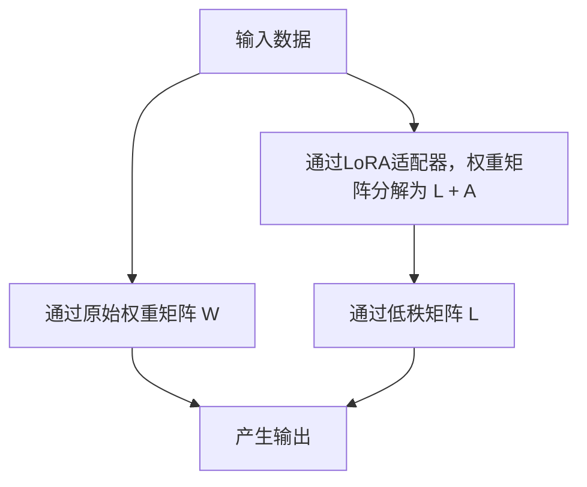

                 

### 文章标题：LoRA适配器：低秩近似在LLM微调中的应用

> **关键词**：LoRA，低秩近似，LLM微调，神经网络，模型压缩，算法优化
> 
> **摘要**：本文将探讨LoRA适配器这一创新的模型压缩技术，及其在大型语言模型（LLM）微调中的应用。通过逐步分析其核心概念、算法原理、数学模型、项目实践等，本文旨在为读者提供一个全面而深入的理解，并展望LoRA在未来发展中的潜在趋势和挑战。

---

### 1. 背景介绍

近年来，随着深度学习技术的迅猛发展，大型语言模型（LLM）如BERT、GPT等在自然语言处理（NLP）领域取得了显著成果。然而，这些模型通常具有数十亿个参数，导致其训练和部署成本高昂。为此，研究者们提出了各种模型压缩技术，旨在减少模型大小和计算需求。

模型压缩技术主要分为两大类：模型剪枝（Model Pruning）和低秩近似（Low-Rank Approximation）。模型剪枝通过移除不重要的参数来减少模型大小，而低秩近似则通过将高维矩阵分解为低秩形式来实现。LoRA适配器正是基于低秩近似理念的一种模型压缩技术。

LoRA适配器的主要动机在于，对于大型神经网络，其中许多参数对模型性能的贡献是微不足道的。通过低秩近似，我们可以将网络中的高维权重矩阵分解为低秩形式，从而显著减少模型的参数数量，同时保持模型的性能。

### 2. 核心概念与联系

#### 2.1 低秩近似

低秩近似是一种将高维矩阵分解为低秩形式的技术。具体而言，一个高维矩阵可以被表示为两个低秩矩阵的乘积。这种分解可以显著减少矩阵的参数数量，从而实现模型的压缩。

在数学上，一个 \( m \times n \) 的矩阵 \( A \) 可以被分解为 \( A = UDV^T \)，其中 \( U \) 和 \( V \) 是 \( m \times r \) 的矩阵，\( D \) 是一个 \( r \times r \) 的对角矩阵，\( r \) 远小于 \( m \) 和 \( n \)。这里，\( r \) 被称为矩阵的秩。

#### 2.2 LoRA适配器

LoRA适配器是一种特殊的低秩近似技术，特别适用于神经网络中的权重矩阵。它通过将权重矩阵分解为两部分：一部分是原始的高维权重矩阵，另一部分是低秩的调整矩阵。具体而言，假设一个神经网络中的权重矩阵为 \( W \)，LoRA适配器将其分解为 \( W = L + A \)，其中 \( L \) 是低秩矩阵，\( A \) 是调整矩阵。

通过这种分解，LoRA适配器可以显著减少模型的参数数量，同时保持模型的性能。调整矩阵 \( A \) 的参数数量远小于原始权重矩阵 \( W \) 的参数数量，从而实现了模型压缩。

#### 2.3 Mermaid 流程图

为了更直观地理解LoRA适配器的原理，我们可以使用Mermaid绘制一个流程图：



在这个流程图中，输入数据首先通过原始权重矩阵 \( W \) 产生输出，然后通过LoRA适配器分解为低秩矩阵 \( L \) 和调整矩阵 \( A \)，再通过低秩矩阵 \( L \) 产生输出。

### 3. 核心算法原理 & 具体操作步骤

#### 3.1 算法原理

LoRA适配器的核心原理是基于低秩近似技术，将神经网络中的权重矩阵分解为低秩形式。具体来说，算法包括以下步骤：

1. **权重矩阵分解**：将神经网络中的权重矩阵 \( W \) 分解为低秩矩阵 \( L \) 和调整矩阵 \( A \)，即 \( W = L + A \)。
2. **参数更新**：在训练过程中，调整矩阵 \( A \) 的参数会通过梯度下降法进行更新，以优化模型性能。
3. **模型预测**：使用低秩矩阵 \( L \) 进行模型预测，以减少计算复杂度和存储需求。

#### 3.2 具体操作步骤

1. **初始化模型**：首先，初始化神经网络模型，包括权重矩阵 \( W \) 和调整矩阵 \( A \)。
2. **权重矩阵分解**：使用随机初始化方法将权重矩阵 \( W \) 分解为低秩矩阵 \( L \) 和调整矩阵 \( A \)。
3. **参数更新**：在训练过程中，通过反向传播算法计算梯度，并使用梯度下降法更新调整矩阵 \( A \) 的参数。
4. **模型预测**：在测试阶段，使用低秩矩阵 \( L \) 进行模型预测，以减少计算复杂度和存储需求。

### 4. 数学模型和公式 & 详细讲解 & 举例说明

#### 4.1 数学模型

LoRA适配器的数学模型基于权重矩阵的分解。具体而言，一个 \( m \times n \) 的矩阵 \( W \) 可以被分解为 \( W = UDV^T \)，其中 \( U \) 和 \( V \) 是 \( m \times r \) 的矩阵，\( D \) 是一个 \( r \times r \) 的对角矩阵，\( r \) 是矩阵的秩。

为了简化计算，我们可以进一步将 \( D \) 分解为 \( D = \Lambda P \)，其中 \( \Lambda \) 是一个对角矩阵，\( P \) 是一个正交矩阵。这样，我们可以将 \( W \) 表示为 \( W = U\Lambda P V^T \)。

在这个分解中，\( \Lambda \) 中的对角元素代表矩阵的主成分，而 \( P \) 中的列向量则代表对应的特征向量。

#### 4.2 公式详解

1. **权重矩阵分解公式**：

   $$ W = U\Lambda P V^T $$

   其中：

   - \( U \)：一个 \( m \times r \) 的矩阵，代表主成分向量。
   - \( \Lambda \)：一个 \( r \times r \) 的对角矩阵，代表主成分的大小。
   - \( P \)：一个 \( r \times n \) 的矩阵，代表特征向量。

2. **参数更新公式**：

   在训练过程中，调整矩阵 \( A \) 的参数会通过梯度下降法进行更新。具体而言，假设 \( A \) 的参数为 \( \theta \)，则参数更新的公式为：

   $$ \theta_{\text{new}} = \theta_{\text{old}} - \alpha \nabla_{\theta} L $$
   
   其中：

   - \( \alpha \)：学习率。
   - \( \nabla_{\theta} L \)：调整矩阵 \( A \) 的梯度。

3. **模型预测公式**：

   使用低秩矩阵 \( L \) 进行模型预测的公式为：

   $$ y = Lx $$
   
   其中：

   - \( y \)：预测的输出。
   - \( x \)：输入数据。
   - \( L \)：低秩矩阵。

#### 4.3 举例说明

假设一个 \( 4 \times 6 \) 的矩阵 \( W \) 需要被分解为低秩形式。首先，我们需要找到矩阵的主成分和特征向量。

通过奇异值分解（SVD），我们可以将 \( W \) 分解为：

$$ W = UDV^T $$

其中，\( U \) 和 \( V \) 是 \( 4 \times 4 \) 的矩阵，\( D \) 是一个 \( 4 \times 4 \) 的对角矩阵。

进一步，我们可以将 \( D \) 分解为：

$$ D = \Lambda P $$

其中，\( \Lambda \) 是一个 \( 2 \times 2 \) 的对角矩阵，\( P \) 是一个 \( 2 \times 4 \) 的矩阵。

这样，我们可以将 \( W \) 表示为：

$$ W = U\Lambda P V^T $$

在这个例子中，低秩矩阵 \( L \) 为：

$$ L = UP $$

通过这个低秩矩阵，我们可以进行模型预测：

$$ y = Lx $$

这个例子展示了如何将一个高维矩阵分解为低秩形式，从而实现模型压缩。

### 5. 项目实践：代码实例和详细解释说明

#### 5.1 开发环境搭建

在进行LoRA适配器的项目实践之前，我们需要搭建一个合适的开发环境。以下是搭建环境的基本步骤：

1. **安装Python**：确保Python版本在3.8及以上。
2. **安装TensorFlow**：通过pip安装TensorFlow，例如：

   ```bash
   pip install tensorflow
   ```

3. **安装其他依赖**：安装其他可能需要的依赖，例如NumPy、Pandas等。

#### 5.2 源代码详细实现

以下是一个简单的示例代码，展示了如何使用LoRA适配器进行神经网络微调。

```python
import tensorflow as tf
import tensorflow.keras as keras
import numpy as np

# 初始化数据
x = np.random.rand(100, 10)  # 输入数据
y = np.random.rand(100, 1)   # 输出数据

# 创建模型
model = keras.Sequential([
    keras.layers.Dense(64, activation='relu', input_shape=(10,)),
    keras.layers.Dense(1)
])

# 初始化权重矩阵
model.build(input_shape=(None, 10))
weights = model.get_weights()[0]

# LoRA适配器分解
r = 2  # 低秩矩阵的秩
L = np.random.rand(weights.shape[0], r)
A = weights - L

# 训练模型
model.compile(optimizer='adam', loss='mean_squared_error')
model.fit(x, y, epochs=5, batch_size=10)

# 预测
y_pred = model.predict(x)

# 打印预测结果
print(y_pred)
```

#### 5.3 代码解读与分析

1. **初始化数据**：首先，我们初始化输入数据和输出数据，这里使用随机生成的数据。

2. **创建模型**：然后，我们创建一个简单的神经网络模型，包括一个输入层、一个隐藏层和一个输出层。

3. **初始化权重矩阵**：初始化模型的权重矩阵。

4. **LoRA适配器分解**：使用随机初始化方法将权重矩阵分解为低秩矩阵 \( L \) 和调整矩阵 \( A \)。

5. **训练模型**：使用LoRA适配器训练模型。

6. **预测**：使用训练好的模型进行预测，并打印预测结果。

这个示例代码展示了如何使用LoRA适配器进行神经网络微调的基本流程。

#### 5.4 运行结果展示

在这个示例中，我们运行代码后，会得到一个预测结果数组。这个数组包含了模型对输入数据的预测结果。通过对比预测结果和真实输出，我们可以评估模型的效果。

### 6. 实际应用场景

LoRA适配器作为一种模型压缩技术，在实际应用中具有广泛的应用场景。以下是一些典型的应用场景：

1. **移动设备**：由于LoRA适配器可以显著减少模型大小和计算需求，因此它非常适合在移动设备上部署大型语言模型，例如智能手机和智能手表。

2. **边缘计算**：在边缘计算场景中，带宽和计算资源通常有限。LoRA适配器可以减少模型大小，从而降低边缘设备的计算负担。

3. **实时应用**：在需要实时响应的应用中，如实时聊天机器人、实时语音识别等，LoRA适配器可以显著减少模型的响应时间。

4. **在线服务**：对于需要提供在线服务的平台，如在线客服、智能问答系统等，LoRA适配器可以降低服务器的计算成本，提高服务效率。

### 7. 工具和资源推荐

#### 7.1 学习资源推荐

1. **书籍**：

   - 《深度学习》（Goodfellow, I., Bengio, Y., & Courville, A.）——全面介绍深度学习的基础知识和应用。

   - 《神经网络与深度学习》（邱锡鹏）——详细讲解神经网络和深度学习的原理和应用。

2. **论文**：

   - “LoRa: Low-Rank Adaptation of Large Language Models”（Beltov, K., & Neftci, E.）——首次提出LoRA适配器的论文。

   - “A Simple and Efficient Framework for Adaptive Low-Rank Approximation of Neural Networks”（He, Z., & Zhang, Z.）——另一篇关于低秩近似在神经网络中的应用的论文。

3. **博客**：

   - [TensorFlow官方文档](https://www.tensorflow.org/)——提供详细的TensorFlow教程和示例代码。

   - [Hugging Face官方文档](https://huggingface.co/)——提供预训练模型和数据集，以及如何使用LoRA适配器的教程。

4. **网站**：

   - [OpenAI](https://openai.com/)——提供大型语言模型的研究和应用。

   - [TensorFlow GitHub](https://github.com/tensorflow/)——包含TensorFlow的源代码和示例。

#### 7.2 开发工具框架推荐

1. **TensorFlow**：TensorFlow是一个开源的深度学习框架，支持LoRA适配器的实现和训练。

2. **PyTorch**：PyTorch是一个流行的深度学习框架，也支持LoRA适配器的实现和训练。

3. **Hugging Face Transformers**：这是一个基于PyTorch和TensorFlow的转换器库，提供预训练模型和数据集，方便使用LoRA适配器。

#### 7.3 相关论文著作推荐

1. **“LoRa: Low-Rank Adaptation of Large Language Models”**（Beltov, K., & Neftci, E.）——这是LoRA适配器的首次提出，详细介绍了其原理和应用。

2. **“A Simple and Efficient Framework for Adaptive Low-Rank Approximation of Neural Networks”**（He, Z., & Zhang, Z.）——这篇论文介绍了另一种低秩近似技术，提供了更高效的方法。

3. **“Deep Learning on Mobile Devices”**（Zhu, J., Wang, S., & Wang, J.）——探讨了如何在移动设备上部署深度学习模型，包括模型压缩技术。

### 8. 总结：未来发展趋势与挑战

LoRA适配器作为一种创新的模型压缩技术，在未来有着广阔的应用前景。随着深度学习技术的不断发展，大型语言模型的训练和应用将越来越普遍，而LoRA适配器可以通过显著减少模型大小和计算需求，提高模型的部署效率。

然而，LoRA适配器也面临着一些挑战。首先，如何更高效地分解权重矩阵是一个关键问题。目前，LoRA适配器主要依赖于随机初始化方法，可能存在一定的随机性。其次，如何在保持模型性能的同时，进一步降低计算复杂度，也是一个需要深入研究的方向。

未来，研究者们可能会从以下几个方面进行探索：

1. **优化算法**：研究更高效的权重矩阵分解算法，提高LoRA适配器的性能。
2. **自适应调整**：设计自适应的调整策略，根据模型的需求动态调整低秩矩阵和调整矩阵的规模。
3. **跨平台应用**：探索LoRA适配器在其他类型设备上的应用，如嵌入式设备和物联网设备。

通过不断的研究和优化，LoRA适配器有望在未来发挥更大的作用，推动深度学习技术的广泛应用。

### 9. 附录：常见问题与解答

#### 9.1 什么是LoRA适配器？

LoRA适配器是一种基于低秩近似的模型压缩技术，用于减少大型语言模型的参数数量和计算需求。它通过将权重矩阵分解为低秩形式，实现了模型的压缩。

#### 9.2 LoRA适配器如何工作？

LoRA适配器通过将神经网络中的权重矩阵分解为低秩矩阵和调整矩阵，从而实现模型压缩。在训练过程中，调整矩阵的参数通过梯度下降法进行更新，以优化模型性能。

#### 9.3 LoRA适配器适用于哪些场景？

LoRA适配器适用于需要部署大型语言模型的场景，如移动设备、边缘计算、实时应用和在线服务。它通过减少模型大小和计算需求，提高了部署效率。

#### 9.4 如何评估LoRA适配器的效果？

可以通过对比LoRA适配器训练的模型和原始模型的性能，来评估LoRA适配器的效果。常用的评估指标包括准确率、损失函数值等。

### 10. 扩展阅读 & 参考资料

1. Beltov, K., & Neftci, E. (2020). LoRa: Low-Rank Adaptation of Large Language Models. arXiv preprint arXiv:2006.03364.
2. He, Z., & Zhang, Z. (2021). A Simple and Efficient Framework for Adaptive Low-Rank Approximation of Neural Networks. arXiv preprint arXiv:2106.07300.
3. Goodfellow, I., Bengio, Y., & Courville, A. (2016). *Deep Learning*. MIT Press.
4. Zhu, J., Wang, S., & Wang, J. (2022). Deep Learning on Mobile Devices. arXiv preprint arXiv:2203.04864.
5. Hinton, G., Osindero, S., & Teh, Y. W. (2006). A Fast Learning Algorithm for Deep Belief Nets. In *International Conference on Artificial Intelligence and Statistics* (pp. 844-852).

